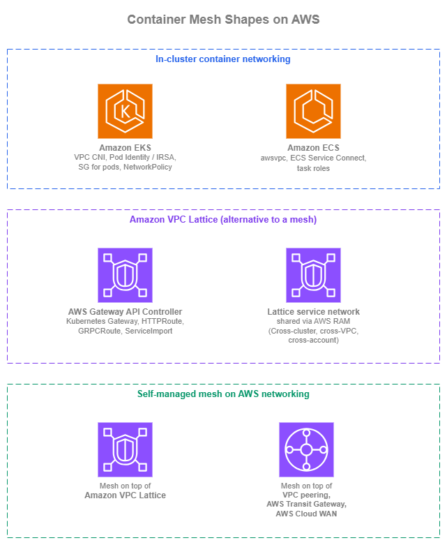
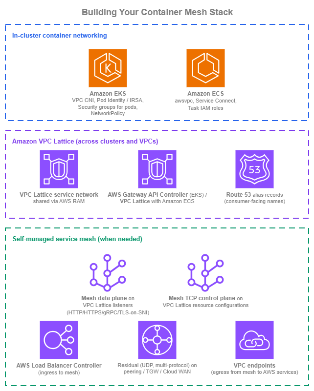

# コンテナメッシュ {#container-mesh}

!!! info "前提条件"
    このセクションでは、[Amazon VPC](../foundation/vpc.md)、[サブネット](../foundation/subnets.md)、[AWS 内の接続](../connectivity/within-aws.md)ページの接続パターン（特に Amazon VPC Lattice）、[サービス間通信](service-to-service.md)ページ、および[ロードバランシング](load-balancing.md)ページについて理解していることを前提としています。コンテナメッシュのパターンはこれらのプリミティブをすべて再利用します。このページでは、それらの上に構築されるコンテナ固有のメカニズムについて説明します。

## サービスメッシュとは何か、そして必要かどうか {#what-a-service-mesh-is-and-whether-you-need-one}

サービスメッシュとは、[CNCF グロッサリーの定義](https://glossary.cncf.io/service-mesh/)によれば、マイクロサービス間のトラフィックを管理し、アプリケーションコードを変更することなく、信頼性・可観測性・セキュリティを均一に提供する専用インフラストラクチャレイヤーです。典型的な実装は、コントロールプレーンによって設定されるポッドごとのサイドカープロキシ(データプレーン)ですが、サイドカーを使わない実装では eBPF を通じてカーネルに同じロジックを組み込みます。この用語は幅広く、メッシュプロジェクトごとに境界の引き方が微妙に異なるため、「サービスメッシュが必要か?」という問いは実質的に「どの具体的な機能が必要で、それぞれどこに置くべきか?」という問いになります。

クラウドネイティブな AWS 環境では、サービスメッシュを採用する主な目的となる機能の大部分は、AWS マネージドサービスによってすでにネイティブにカバーされています。以下の表では、メッシュが提供するとされる機能を個別の特性に分解し、それぞれがどこで対応されるかを示します。

| 機能 | 内容 | AWS ネイティブのカバレッジ | メッシュ固有のギャップ |
| --- | --- | --- | --- |
| **サービスディスカバリー** | 安定したサービス名を現在のターゲットに解決する | Amazon Route 53、AWS Cloud Map | 一般的なワークロードではなし。 |
| **サービス間認証** | 呼び出し元ごとの暗号化 ID をサービス側で評価する | IAM + AWS SigV4(Amazon VPC Lattice 認証ポリシー)、Amazon API Gateway IAM オーソライザーにより、共有シークレットなしのエンドツーエンドの ID ベース認証をカバー。 | AWS ネイティブの呼び出し元に対してはなし。 |
| **相互 TLS (mTLS)** | ハンドシェイク時に双方が証明書を提示する | ALB の mTLS および Amazon VPC Lattice の TLS パススルー(サイドカーまたはバックエンドで mTLS を終端)がリスナー側をカバー。 | メッシュが管理する mTLS ライフサイクル(ポッドごとの自動発行・自動ローテーション・自動失効)はサイドカーメッシュの領域。 |
| **トラフィック管理** | 重み付きルーティング、ブルー/グリーン、カナリアデプロイ | Amazon VPC Lattice の重み付きルーティング、ALB の重み付きターゲットグループ | メッシュネイティブの CRD(`VirtualService`、`DestinationRule`、`ServiceProfile`)およびリクエスト単位のフォールトインジェクションはサイドカーメッシュ専用。 |
| **レジリエンスポリシー** | リクエスト単位のリトライ・タイムアウト・外れ値検出・サーキットブレーカー | アプリケーションレベルまたは AWS SDK のリトライ、Amazon VPC Lattice およびロードバランサーのヘルスチェック。 | データプレーン設定としてサイドカーが強制する**リクエスト単位**のポリシーはサイドカーメッシュ専用。 |
| **可観測性** | リクエスト単位のアクセスログと分散トレース | Amazon VPC Lattice アクセスログ(ID 認識型)、ALB アクセスログ、AWS X-Ray、Amazon CloudWatch Application Signals。 | アプリケーション変更なしでサイドカーが出力するゴールデンシグナルメトリクスはサイドカーメッシュ専用。 |
| **ネットワークポリシー** | どのワークロードがどのワークロードに到達できるかを制御する | セキュリティグループ(タスク単位・ポッド単位)、Amazon VPC CNI 経由の Kubernetes NetworkPolicy、Amazon VPC Lattice 認証ポリシー。 | メッシュ CRD ベースのポリシーはサイドカーメッシュ専用。 |
| **マルチクラスターサービス接続** | クラスター A のサービスをクラスター B でローカルサービスとして到達可能にし、チームとクラスターの所有権を分離する | Amazon VPC Lattice により、独立したチーム境界を維持しながらマルチクラスター・マルチアカウントの到達性を実現。 | マルチクラスターの接続をメッシュ内部に置く必要がある場合は、メッシュネイティブのクラスターメッシュコントロールプレーン(Istio マルチプライマリ、Cilium Cluster Mesh)が必要。 |

クラウドネイティブな AWS 環境では、**ディスカバリー・ID ベース認証・トラフィック管理・可観測性・ネットワークポリシー・マルチクラスター到達性はすでにマネージドサービスでカバーされています**。サイドカーメッシュに残る領域は、メッシュが管理する mTLS ライフサイクル、メッシュ CRD ベースのトラフィックおよびレジリエンスポリシー、そして特定のクラスターメッシュコントロールプレーンパターンです。これらはメッシュを採用する正当な理由であり、一部のワークロードにとっては実際の要件ですが、デフォルトの出発点ではなく、**明示的な要件として定義された契約**であるべきです。

マルチクラスターの行は、特に意識的に検討する価値があります。チームがクラスターメッシュパターンを選ぶのは、独立したチームがそれぞれのクラスターを運用しながら、クラスターをまたいでサービスを公開できるようにするためです。Amazon VPC Lattice はネットワーク層で同じスケーリング課題を解決します。各チームは自分のクラスターを所有し、サービスを共有サービスネットワークにエクスポートし、他のクラスターのコンシューマーは Lattice サービスをバックエンドとする Route 53 エイリアスとしてそれらに到達できます。メッシュコントロールプレーンで橋渡しすることなく、チームの境界が維持されます。

ワークロードがメッシュ固有のギャップ項目の 1 つ以上を真に必要とする場合、セルフマネージドメッシュが適切な選択です。このページの残りでは、AWS 上のコンテナサービス間アーキテクチャが取る 3 つの形態を説明します。クラスター内プリミティブ、メッシュの代替としての Amazon VPC Lattice、そして AWS ネットワーキング上のセルフマネージドメッシュです。

/// caption
コンテナメッシュの形態 — [Drawio ソース](../assets/application-networking/container-mesh-shapes.drawio)
///

## クラスター内コンテナネットワーキング {#in-cluster-container-networking}

最初の形態は、厳密には「メッシュ」ではありません。Amazon ECS と Amazon EKS がすでに提供しているクラスター内プリミティブです。これらを適切に活用すれば、メッシュを導入せずとも「1 つのクラスター内にメッシュが欲しい」という要件のほとんどを満たせます。

### Amazon EKS クラスター内ネットワーキング {#amazon-eks-in-cluster-networking}

Amazon EKS のポッドはデフォルトで [Amazon VPC CNI](https://docs.aws.amazon.com/eks/latest/userguide/pod-networking.html) を使用します。各ポッドはクラスターのサブネットからルーティング可能な VPC IP を取得し、IP キャパシティを確保するためにセカンダリ ENI がノードにアタッチされ、ポッド間トラフィックはオーバーレイなしで VPC 内を直接流れます。必要に応じてプレフィックス委任によりノードあたりの IP 密度を高められます。IPv6 モード(クラスターで `enableIPv6: true` を設定)を使用すると、すべてのポッドに IPv6 アドレスが付与され、新規クラスターにおける IPv4 枯渇の問題が完全に解消されます。代替 CNI(Cilium、Calico)は、より豊富なポリシーセマンティクスや eBPF ベースのデータプレーンが必要な場合に有効な選択肢ですが、Amazon VPC CNI は AWS がサポートするデフォルトであり、**ポッド向けセキュリティグループ**をファーストクラスでサポートする唯一の CNI です。

クラスター内のサービス検出は、Kubernetes Services と CoreDNS を通じて機能します。安定した仮想 IP には ClusterIP、ポッド IP の DNS 直接解決にはヘッドレスサービス、サービス名のエイリアスには ExternalName を使用します。`kube-proxy`(`iptables` または `IPVS` モード)、あるいはその Cilium 代替実装が ClusterIP からポッド IP へのロードバランシングを処理します。これらにメッシュは不要です。

ポッドのアイデンティティは、メッシュなしでクロスサービス認証を実現するための重要な要素です。

* **[Amazon EKS Pod Identity](https://docs.aws.amazon.com/eks/latest/userguide/pod-identities.html)** は、新規クラスターに推奨されるパターンです。Pod Identity エージェントが DaemonSet として動作し、AWS SDK のクレデンシャル取得をインターセプトして、ポッドの IAM ロール用の短期クレデンシャルを返します。セットアップはアソシエーションごとに 1 回の API 呼び出しで完了し、ロールごとの OIDC 信頼関係は不要です。
* **[IAM Roles for Service Accounts (IRSA)](https://docs.aws.amazon.com/eks/latest/userguide/iam-roles-for-service-accounts.html)** は旧来のパターンですが、現在も完全にサポートされています。OIDC ベースの信頼モデルをすでに使用している既存クラスターで引き続き使用してください。新規クラスターは Pod Identity をデフォルトとすべきです。

AWS レイヤーのネットワークポリシーは、**[ポッド向けセキュリティグループ](https://docs.aws.amazon.com/eks/latest/userguide/security-groups-for-pods.html)**(ポッドごとの VPC セキュリティグループ識別子。他の ENI と同じ SG を使用)によって実現されます。その上に **[VPC CNI ネットワークポリシー](https://docs.aws.amazon.com/eks/latest/userguide/cni-network-policy.html)**(または採用済みであれば Cilium / Calico)を重ねることで、ラベルベースのクラスター内ネットワークポリシーを適用できます。この 2 つのレイヤーは補完関係にあります。SG は AWS 側の到達性を制御し、NetworkPolicy はクラスター側の到達性を制御します。

#### Amazon EKS クラスター内ネットワーキングのベストプラクティス {#amazon-eks-in-cluster-best-practices}

* **新規クラスターでは Amazon VPC CNI をデフォルトとする**。Cilium や Calico は、VPC CNI がカバーしない具体的な要件(eBPF データプレーン、より豊富な NetworkPolicy セマンティクス、kube-proxy の置き換えなど)がある場合にのみ採用する。
* **新規クラスターでは Amazon EKS Pod Identity を使用し、既存クラスターでは IRSA を維持する**。
* **ポッド向けセキュリティグループと Kubernetes NetworkPolicy を組み合わせる**。SG は「どの AWS ソースがこのポッドに到達できるか」を制御し、NetworkPolicy は「どのワークロードラベルがこのポッドに到達できるか」を制御する。
* **新規クラスターでは IPv6 モードを採用する**。IPv4 枯渇の問題がなくなり、プレフィックス委任のチューニングなしにクラスターがルーティング可能な v6 アドレスを取得できる。

#### Amazon EKS クラスター内ネットワーキングのドキュメント {#amazon-eks-in-cluster-documentation}

*   :material-file-document: **Amazon VPC CNI**

    ---

    VPC ルーティング可能なポッド IP、プレフィックス委任、IPv6 サポートを備えた Amazon EKS のデフォルトポッドネットワーキング。

    [:octicons-arrow-right-24: ドキュメント](https://docs.aws.amazon.com/eks/latest/userguide/pod-networking.html)

*   :material-file-document: **Amazon EKS Pod Identity**

    ---

    新規クラスターでポッドに IAM ロールを割り当てるための推奨パターン。ロールごとの OIDC 信頼関係が不要。

    [:octicons-arrow-right-24: ドキュメント](https://docs.aws.amazon.com/eks/latest/userguide/pod-identities.html)

*   :material-file-document: **IAM Roles for Service Accounts (IRSA)**

    ---

    ポッドに IAM ロールを割り当てる OIDC ベースのパターン。既存環境向けに引き続きサポート。

    [:octicons-arrow-right-24: ドキュメント](https://docs.aws.amazon.com/eks/latest/userguide/iam-roles-for-service-accounts.html)

*   :material-file-document: **ポッド向けセキュリティグループ**

    ---

    AWS レイヤーでアイデンティティベースのネットワークポリシーを実現するポッドごとの VPC セキュリティグループ。

    [:octicons-arrow-right-24: ドキュメント](https://docs.aws.amazon.com/eks/latest/userguide/security-groups-for-pods.html)

*   :material-file-document: **Amazon VPC CNI ネットワークポリシー**

    ---

    クラスター内のラベルベーストラフィック制御のための AWS ネイティブ Kubernetes NetworkPolicy 実装。

    [:octicons-arrow-right-24: ドキュメント](https://docs.aws.amazon.com/eks/latest/userguide/cni-network-policy.html)

### Amazon ECS クラスター内ネットワーキング {#amazon-ecs-in-cluster-networking}

**[awsvpc ネットワークモード](https://docs.aws.amazon.com/AmazonECS/latest/developerguide/task-networking-awsvpc.html)** の Amazon ECS タスクは、それぞれ専用の ENI、VPC IP、セキュリティグループを取得します。これにより、AWS レイヤーでのタスクごとのアイデンティティが無償で提供されます。ENI に使用するのと同じセキュリティグループベースのネットワークポリシーがタスクにも適用されます。`awsvpc` は Fargate のデフォルトであり、EC2 起動タスクにも推奨されるモードです。

単一の Amazon ECS クラスター内で AWS が提供するマネージドメッシュに最も近いものが **[Amazon ECS Service Connect](https://docs.aws.amazon.com/AmazonECS/latest/developerguide/service-connect.html)** です。Amazon ECS によって注入される AWS マネージドの Envoy サイドカー、AWS Cloud Map を通じた名前空間ベースのサービスアドレッシング、タスクごとの自動サービス検出、組み込みのトラフィックメトリクスを提供します。メッシュコントロールプレーンを運用する必要はなく、アプリケーションは他のサービスをフレンドリーな名前空間名で解決できます。単一の ECS クラスター内での新規コンテナ間トラフィックには、これが AWS ネイティブのパターンです。[AWS Cloud Map を使用した Amazon ECS サービス検出](https://docs.aws.amazon.com/AmazonECS/latest/developerguide/service-discovery.html)は旧来のパターンです。属性フィルタリングによる検出(コンシューマーがフィルタリングするカスタム属性を公開する ECS タスクインスタンス)や Service Connect 非対応ワークロードには引き続き有効ですが、新規クラスター内サービス間トラフィックには Service Connect が推奨されます。

タスクのアイデンティティは **[Amazon ECS タスクロール](https://docs.aws.amazon.com/AmazonECS/latest/developerguide/task-iam-roles.html)** を通じて管理されます。各タスク定義は、AWS SDK がリクエストの署名に使用する IAM ロールを参照します。

#### Amazon ECS クラスター内ネットワーキングのベストプラクティス {#amazon-ecs-in-cluster-best-practices}

* **Amazon ECS タスクでは `awsvpc` ネットワークモードをデフォルトとする**。タスクごとの ENI により、タスクごとの SG アイデンティティ、IP、オブザーバビリティが無償で得られる。
* **クラスター内コンテナ間トラフィックには Amazon ECS Service Connect を使用する**。名前空間の抽象化、AWS マネージドの Envoy サイドカー、トラフィックメトリクスにより、多くのチームがメッシュに求める機能を代替できる。
* **AWS Cloud Map サービス検出は属性フィルタリングが必要なケースに限定する**。シンプルなケースは Service Connect の方がよりクリーンに対応できる。
* **AWS API アクセスにはタスクごとの IAM ロールを割り当てる**。タスクごとのアイデンティティがあることで、監査ログとアクセスログのシグナルが有効活用できる。

#### Amazon ECS クラスター内ネットワーキングのドキュメント {#amazon-ecs-in-cluster-documentation}

*   :material-file-document: **Amazon ECS `awsvpc` ネットワークモード**

    ---

    タスクごとの ENI、IP、セキュリティグループを提供する Amazon ECS の推奨ネットワークモード。

    [:octicons-arrow-right-24: ドキュメント](https://docs.aws.amazon.com/AmazonECS/latest/developerguide/task-networking-awsvpc.html)

*   :material-file-document: **Amazon ECS Service Connect**

    ---

    クラスター内サービス間通信向けの AWS マネージド Envoy サイドカー。名前空間アドレッシング、サービス検出、トラフィックメトリクスを提供。

    [:octicons-arrow-right-24: ドキュメント](https://docs.aws.amazon.com/AmazonECS/latest/developerguide/service-connect.html)

*   :material-file-document: **AWS Cloud Map を使用した Amazon ECS サービス検出**

    ---

    Amazon ECS 向けの属性フィルタリングによるサービス検出。特定のワークロードで Service Connect を補完。

    [:octicons-arrow-right-24: ドキュメント](https://docs.aws.amazon.com/AmazonECS/latest/developerguide/service-discovery.html)

*   :material-file-document: **Amazon ECS タスク IAM ロール**

    ---

    AWS SDK が SigV4 でリクエストに署名する際に使用するタスクごとの IAM ロール。

    [:octicons-arrow-right-24: ドキュメント](https://docs.aws.amazon.com/AmazonECS/latest/developerguide/task-iam-roles.html)

## メッシュの代替としての Amazon VPC Lattice {#amazon-vpc-lattice-as-the-alternative-to-a-mesh}

[Amazon VPC Lattice](https://docs.aws.amazon.com/vpc-lattice/latest/ug/what-is-vpc-lattice.html) は、トラフィックが単一クラスターを離れた後に発生するメッシュのユースケースを吸収します。具体的には、サービスミラーやクラスターメッシュのコントロールプレーンを必要としないクロスクラスター検出、サービスまたはサービスネットワークレベルでの IAM ベースの認証、重み付きルーティング、アイデンティティ対応のアクセスログ、そして L3/L4 接続の統合(ピアリング、AWS Transit Gateway、AWS Cloud WAN が不要)などです。サービスの詳細な説明は [Within AWS](../connectivity/within-aws.md) ページ(接続性の観点)と [Service to Service](service-to-service.md) ページ(アプリケーションチームの観点)に記載されています。このセクションではコンテナ固有の仕組みについて説明します。

Kubernetes のネイティブ統合は **[AWS Gateway API Controller](https://www.gateway-api-controller.eks.aws.dev/)** です。このコントローラーはクラスター内の Kubernetes Gateway API リソース(`Gateway`、`HTTPRoute`、`GRPCRoute`、`TLSRoute`、`ServiceImport`、`ServiceExport`)を監視し、対応する Amazon VPC Lattice のサービスネットワークアソシエーション、サービス、ターゲットグループ、リスナールールを作成します。アプリケーションチームはルーティングを Gateway API リソース(標準仕様)として記述し、コントローラーが VPC Lattice のプロビジョニングを処理します。

Amazon ECS は [Amazon VPC Lattice with Amazon ECS](https://docs.aws.amazon.com/AmazonECS/latest/developerguide/vpc-lattice.html) 統合を通じて VPC Lattice に接続します。ECS サービス定義はタスクを VPC Lattice ターゲットグループのターゲットとして直接登録します。`awsvpc` によるタスクごとのセキュリティグループモデルもそのまま引き継がれます。

マルチクラスター・クロスアカウント構成では、AWS RAM を通じて組織全体で共有された Amazon VPC Lattice サービスネットワークを使用します([Within AWS](../connectivity/within-aws.md) ページで説明)。各クラスターはそのネットワークにサービスをエクスポートし、他のクラスターのコンシューマーは Kubernetes の `ServiceImport`(Amazon EKS)としてインポートするか、VPC Lattice サービスの DNS 名に紐付いた Route 53 エイリアスを呼び出します(Amazon ECS、汎用クライアント、ハイブリッド接続経由でアクセスするオンプレミスワークロード)。接続性はサービスに組み込まれているため、コンシューマークラスターごとにピアリングや AWS Transit Gateway のアタッチメントは不要です。

率直な評価として、**Amazon VPC Lattice が導入済みの場合でもサイドカーメッシュは必要でしょうか？** Amazon VPC Lattice は L7(HTTP および HTTPS)と L4(SNI による TLS パススルー)で動作します。ただし、メッシュコントロールプレーンが管理するポッドごとの mTLS ライフサイクル、メッシュネイティブのトラフィック管理 CRD(`VirtualService`、`DestinationRule`、`ServiceProfile`)、アウトライヤー検出やサーキットブレーカーポリシーといったリッチなクライアントサイドロードバランシングのセマンティクス(データプレーン設定として)は提供されません。ほとんどのワークロードではこれらは不要ですが、必要なワークロードには後述のセルフマネージドサービスメッシュが適切な選択肢です。

### Amazon VPC Lattice のベストプラクティス {#amazon-vpc-lattice-best-practices}

* **Amazon EKS における VPC Lattice のクラスター内コントラクトとして AWS Gateway API Controller を使用する**。アプリケーションチームは `Gateway` と `HTTPRoute`(Kubernetes 標準)でルーティングを記述し、コントローラーが Lattice のサービスネットワークとサービスのプロビジョニングを処理します。
* **VPC Lattice サービスのフロントには VPC Lattice マネージド DNS 名ではなく Route 53 エイリアスを使用する**。この間接参照により、将来の実装変更をコンシューマーに対して透過的にできます。
* **Amazon ECS のみの環境では、クロス VPC およびクロスアカウントの到達性に VPC Lattice を使用し、各クラスター内では Service Connect を使用する**。両者はクリーンに共存できます。ローカルなコンテナ間通信には Service Connect を、クラスター・VPC・アカウントの境界を越えるすべての通信には VPC Lattice を使用します。
* **サービスネットワークの共有モデルをアカウント構造に合わせる**。組織全体で 1 つのサービスネットワークが最もシンプルですが、ワークロードの境界に合わせて OU 単位または環境単位のネットワークにすることで影響範囲を限定できます。
* **セルフマネージドサービスメッシュは、サイドカーメッシュの特定機能が真に必要な場合にのみ採用する**。「みんなメッシュを使っている」という理由では不十分です。メッシュ CRD、ポッド内 mTLS ライフサイクル、メッシュネイティブのトラフィック管理セマンティクスが必要な場合が正当な理由です。

### Amazon VPC Lattice のドキュメント {#amazon-vpc-lattice-documentation}

*   :material-file-document: **Amazon VPC Lattice with Amazon EKS**

    ---

    AWS Gateway API Controller を通じた Amazon VPC Lattice による Amazon EKS ワークロードのクロスクラスター接続。

    [:octicons-arrow-right-24: ドキュメント](https://docs.aws.amazon.com/eks/latest/userguide/integration-vpc-lattice.html)

*   :material-file-document: **AWS Gateway API Controller**

    ---

    Amazon VPC Lattice のサービスネットワーク、サービス、ターゲットグループ、ルールをプロビジョニングする Kubernetes Gateway API の実装。

    [:octicons-arrow-right-24: ドキュメント](https://www.gateway-api-controller.eks.aws.dev/)

*   :material-file-document: **Amazon VPC Lattice with Amazon ECS**

    ---

    Amazon ECS サービスを Amazon VPC Lattice ターゲットグループのターゲットとしてネイティブにアタッチ。

    [:octicons-arrow-right-24: ドキュメント](https://docs.aws.amazon.com/AmazonECS/latest/developerguide/vpc-lattice.html)

*   :material-file-document: **Amazon VPC Lattice サービスネットワークと AWS RAM 共有**

    ---

    マルチアカウント・マルチクラスターのサービス間通信のためのサービスネットワークのクロスアカウント共有。

    [:octicons-arrow-right-24: ドキュメント](https://docs.aws.amazon.com/vpc-lattice/latest/ug/service-networks.html)

*   :material-file-document: **Kubernetes Gateway API**

    ---

    Amazon VPC Lattice および AWS ロードバランサー向けに AWS Gateway API Controller が実装する Kubernetes 仕様。

    [:octicons-arrow-right-24: ドキュメント](https://docs.aws.amazon.com/eks/latest/best-practices/gateway-api-controller.html)

## AWS ネットワーキング上のセルフマネージドサービスメッシュ {#self-managed-service-mesh-on-top-of-aws-networking}

ワークロードが AWS の提供していないサイドカーメッシュ機能（メッシュ管理の mTLS ライフサイクル、トラフィックポリシー用のメッシュ CRD、本番稼働中のマルチクラスターメッシュパターンなど）を真に必要とする場合、メッシュは AWS ネットワーキングの上で動作します。運用コストを左右する判断は、**メッシュの下でクロスクラスターおよびクロス VPC トラフィックを運ぶ AWS サービスの選択**です。メッシュのプロトコルセットが互換性を持つ場合、Amazon VPC Lattice がその負荷の多くを担えます。互換性がない場合は、VPC ピアリング、AWS Transit Gateway、AWS Cloud WAN が代替手段となります。

### Amazon VPC Lattice 上でのメッシュ実行 {#running-the-mesh-on-top-of-amazon-vpc-lattice}

メッシュのコントロールプレーンとデータプレーンのサイドカーはクラスター内で動作し、クロスクラスターおよびクロス VPC トラフィックは Amazon VPC Lattice を経由します。メッシュはフレンドリーな DNS 名（VPC Lattice サービスまたはリソース設定のカスタムドメイン名への Route 53 エイリアス）を参照し、他のクラスターをアップストリームとして扱います。**これにより削減できるもの**: ピアリング、AWS Transit Gateway、AWS Cloud WAN、CIDR 調整、クロス VPC セキュリティグループ認可、運用が必要な共有接続構成のすべてが不要になります。

同一の VPC Lattice ネットワークが、異なる VPC Lattice 構成を通じてさまざまなメッシュトラフィック形態を処理します。

| メッシュトラフィック形態 | VPC Lattice 構成 | 備考 |
| --- | --- | --- |
| HTTP / HTTPS / gRPC アプリケーショントラフィック | HTTPS リスナーを持つサービス | VPC Lattice が TLS を終端し、メッシュサイドカーはプレーンテキストを受信するか再暗号化します。 |
| サイドカー間 mTLS | TLS パススルーリスナーを持つサービス | SNI でルーティングし、サイドカーが mTLS を終端します。10 分間の接続上限が適用されるため、このパス上の長期 gRPC コントロールプレーンストリームは監視が必要です。 |
| TCP のみのメッシュトラフィック（xDS、アイデンティティ、クラスターメッシュコントロールプレーン） | リソースゲートウェイを経由した[リソース設定](https://docs.aws.amazon.com/vpc-lattice/latest/ug/resource-configuration.html) | TCP、設定可能なポート範囲、カスタムドメイン名をサポートします。10 分間のリスナー上限およびリスナーレベルの認証ポリシー制限は適用されません。 |
| UDP、マルチプロトコル、根本的に非 TCP のトラフィック | ピアリング / AWS Transit Gateway / AWS Cloud WAN にフォールバック | 上記 3 つを配置した後の残余トラフィックです。混在ルーティングは有効なパターンです。 |

### その他の AWS ネットワーキングサービス上でのメッシュ実行 {#running-the-mesh-on-top-of-other-aws-networking-services}

Amazon VPC Lattice のモデルが適合しない場合、クロスクラスタートラフィックは **VPC ピアリング、AWS Transit Gateway、または AWS Cloud WAN** を経由します。これらは [Within AWS](../connectivity/within-aws.md) ページで説明している接続プリミティブです。メッシュは他のクラスターを IP 到達可能なサブネットとして扱い、残りを処理します。

この構成のコストは現実的です。運用すべき完全な L3 接続、すべての参加 VPC にわたる CIDR 計画、メッシュのトラフィックパターン向けのセキュリティグループとルートテーブル、そして接続構成自体（ピアリングは N クラスターでスケールが悪く、AWS Transit Gateway と AWS Cloud WAN はスケールするものの VPC ごと・リージョンごとにアタッチメントが追加される）が必要です。メッシュチームとネットワークチームは新しいクラスターのたびに調整を行うことになります。

CIDR オーバーラップの問題は、Kubernetes を利用する組織に最も深刻な影響を与えます。IPv4 モードの Amazon VPC CNI はクラスターの VPC CIDR からポッド IP を割り当てるため、マルチクラスター環境ではクラスター間でポッドの IP 範囲が重複することがよくあります。VPC ピアリング、AWS Transit Gateway、AWS Cloud WAN はいずれも接続する側の間で重複しない CIDR を必要とします。標準的な対処法は、各クラスターのポッド範囲をクロスクラスターパスのみで使用する重複しない範囲に変換する **[プライベート NAT ゲートウェイ](https://docs.aws.amazon.com/vpc/latest/userguide/vpc-nat-gateway.html#private-nat-gateway-overview)** です。これは機能しますが、プライベート NAT ゲートウェイごとに時間単位 + GB 単位のコスト、分散トレーシングや監査ログに影響する IP 書き換え、そしてネットワークチームが運用しなければならないもう一つの配管が追加されます。**Amazon VPC Lattice はこの問題を完全に回避します**。コンシューマー側で接続を終端し、プロバイダー側で再開始するため、CIDR オーバーラップは見えなくなります。新規クラスターに **Amazon VPC CNI の IPv6 モード**を採用することも、問題を根本から解消します（すべてのポッドがグローバルに一意な IPv6 アドレスを取得します）。

セルフマネージドサービスメッシュのどちらの構成でも、AWS から引き続き得られるもの:

* **クラスター外部からメッシュへのイングレス**は、AWS Load Balancer Controller によって作成された ALB または NLB を経由します（[ロードバランシング](load-balancing.md)ページで説明）。ロードバランサーはメッシュのイングレスゲートウェイ（Istio Gateway、Linkerd イングレスなど）にアクセスし、メッシュはその先のルーティングを処理します。
* **AWS サービスへのエグレス**は [VPC エンドポイント](https://docs.aws.amazon.com/vpc/latest/privatelink/concepts.html)（インターフェイスおよびゲートウェイ）を経由します。メッシュのエグレスゲートウェイ、またはポッドが直接、エンドポイントを通じて Amazon S3、Amazon DynamoDB、Amazon SQS、Amazon Kinesis、その他の AWS サービスに到達します。
* **メッシュからのテレメトリ**は [AWS Distro for OpenTelemetry](https://aws-otel.github.io/) を経由して Amazon CloudWatch Application Signals、AWS X-Ray、Amazon Managed Service for Prometheus / Amazon Managed Grafana に流れ、AWS マネージドの境界では Amazon VPC Lattice アクセスログおよび ALB アクセスログも活用されます。

マルチクラスターメッシュパターン（Istio マルチプライマリ、Cilium Cluster Mesh など）はメッシュコントロールプレーン内に存在します。AWS ネットワーキングの観点からは、上記 2 つの構成のいずれかで運ばれる追加のクロスクラスタートラフィックに過ぎません。

### セルフマネージドメッシュのベストプラクティス {#self-managed-mesh-best-practices}

* **セルフマネージドメッシュを実行すると決めた場合は、デフォルトで Amazon VPC Lattice 上で実行してください**。各メッシュトラフィック形態を適切な VPC Lattice 構成にマッピングします（上記の表を参照）。HTTP / HTTPS / gRPC アプリケーショントラフィックには HTTPS リスナー、サイドカー mTLS には TLS パススルー、TCP のみのメッシュトラフィックにはリソース設定を使用します。長期 gRPC コントロールプレーンストリームに対する TLS パススルーリスナーの 10 分間接続上限に注意してください。リソース設定にはこの制限はありません。
* **メッシュの下でピアリング、AWS Transit Gateway、または AWS Cloud WAN にフォールバックする**のは、VPC Lattice がカバーしない残余トラフィック（UDP、マルチプロトコル）に対してのみ、または既存の接続構成がすでにワークロードを提供している場合に限定してください。
* **メッシュへのイングレスには AWS Load Balancer Controller を使用してください**。AWS マネージドロードバランサーが利用可能な場合、メッシュ CRD でイングレスを再実装しないでください。
* **AWS サービスへのメッシュエグレスには VPC エンドポイントを使用してください**。Amazon S3、Amazon DynamoDB、Amazon SQS などへは、パブリックインターネットではなくインターフェイスまたはゲートウェイエンドポイントを通じて到達してください。
* **AWS API アクセス用の IAM は Pod Identity、IRSA、またはタスクロールに維持し**、メッシュが発行した証明書には依存しないでください。メッシュはクラスター内のサービスアイデンティティを処理し、AWS は AWS サービスのアイデンティティを処理します。

### セルフマネージドメッシュのドキュメント {#self-managed-mesh-documentation}

*   :material-file-document: **AWS Load Balancer Controller**

    ---

    ALB と NLB をプロビジョニングする Kubernetes コントローラー。メッシュイングレスゲートウェイへの AWS ネイティブなイングレスを提供します。

    [:octicons-arrow-right-24: ドキュメント](https://docs.aws.amazon.com/eks/latest/userguide/aws-load-balancer-controller.html)

*   :material-file-document: **AWS PrivateLink と VPC エンドポイント**

    ---

    パブリックインターネットを経由せずに、クラスターワークロードから AWS サービスへのプライベート接続を提供するメッシュエグレス用の機能です。

    [:octicons-arrow-right-24: ドキュメント](https://docs.aws.amazon.com/vpc/latest/privatelink/concepts.html)

*   :material-file-document: **AWS Distro for OpenTelemetry**

    ---

    メッシュのテレメトリを Amazon CloudWatch、AWS X-Ray、Amazon Managed Service for Prometheus に送信するための AWS サポート付き OpenTelemetry ディストリビューションです。

    [:octicons-arrow-right-24: ドキュメント](https://aws-otel.github.io/)

## コンテナメッシュスタックの構築 {#building-your-container-mesh-stack}

コンテナメッシュアーキテクチャは、接続性([Within AWS](../connectivity/within-aws.md) ページで説明)とワークロードのアプリケーションロジックの間に位置するレイヤーです。上記の 3 つの形態は相互に排他的ではありません。ほとんどの環境では、各クラスター内のクラスター内コンテナネットワーキングと、クラスター間の Amazon VPC Lattice を組み合わせて使用し、サイドカーメッシュが真に必要なワークロードに対してのみセルフマネージドサービスメッシュを採用します。

/// caption
コンテナメッシュスタック — [Drawio ソース](../assets/application-networking/container-mesh-stack.drawio)
///

### 新規環境 {#new-environments}

コンテナのサービス間通信をゼロから構築する組織は、初日から一貫したスタックを採用できます。

1. **各クラスター内では AWS ネイティブのプリミティブを活用する**。Amazon VPC CNI(新規クラスターには IPv6 モードを使用することで、IPv4 枯渇と CIDR 重複の問題を根本から解消)、Amazon EKS Pod Identity、セキュリティグループ for pods、EKS 側の Kubernetes NetworkPolicy、ECS 側の `awsvpc` モード、Amazon ECS Service Connect、タスクごとの IAM ロールを活用します。このクラスター内コンテナネットワーキングの形態は、1 つのクラスター内でメッシュに求めるものの大部分をカバーします。
2. **クラスター、VPC、またはアカウントの境界を越えるすべての通信に Amazon VPC Lattice を使用する**。Amazon EKS では AWS Gateway API Controller、Amazon ECS ではネイティブの Lattice アタッチメントを使用します。OU レベルで AWS RAM を通じて共有される 1 つのサービスネットワークにより、新しいクラスターやアカウントが自動的に到達性を継承します。これにより、クロスクラスター接続の問題をメッシュの選定から切り離せます。
3. **Amazon Route 53 Profiles で配布される Route 53 エイリアスで Lattice サービスをフロントエンドに配置する**。[Service to Service](service-to-service.md) ページと同じパターンです。コンシューマー向けの名前は、背後の実装が変わっても安定したままになります。
4. **特定のサイドカーメッシュ要件がコストを正当化する場合にのみ、セルフマネージドメッシュを採用する**。その時点が来たら、上記のプロトコル適合テーブル(HTTPS リスナー / TLS パススルー / リソース設定)を使用して VPC Lattice 上でメッシュを実行することをデフォルトとし、残余の部分にはピアリング / AWS Transit Gateway / AWS Cloud WAN を使用します。
5. **初日からオブザーバビリティを一元化する**。AWS マネージドの境界では Amazon VPC Lattice アクセスログ(ID 認識型)、ロードバランサーが経路上にある場合は ALB および NLB アクセスログ、そして AWS Distro for OpenTelemetry でメッシュとアプリケーションのテレメトリを Amazon CloudWatch Application Signals、AWS X-Ray、Amazon Managed Service for Prometheus に送信します。

### 既存環境 {#existing-environments}

既存のコンテナサービス間通信パターンを運用している組織には、すべてを一度に変更する必要のない稼働中のアーキテクチャがあります。

1. **既存のクラスター内パターンはそのまま維持する**。AWS Cloud Map を使用した Amazon ECS サービスディスカバリー、Amazon EKS の IRSA、および現在運用中のクラスター内メッシュは引き続き機能します。固定のタイムラインではなく、呼び出し元のコードに触れるタイミングでワークロードごとに移行します。
2. **まず新しいクロスクラスター要件に Amazon VPC Lattice を追加する**。クラスター、VPC、またはアカウントの境界を越える新しいサービス間トラフィックは、既存のピアリングや AWS Transit Gateway ベースのメッシュを拡張するのではなく、AWS Gateway API Controller(EKS)または Amazon VPC Lattice with Amazon ECS を通じて Lattice を使用します。L3 パスの CIDR 重複とプライベート NAT ゲートウェイのコストが解消されます。
3. **既存のセルフマネージドメッシュには、機会を捉えて Amazon VPC Lattice を下層に追加する**。メッシュのアップグレード時、新しいクラスターの参加時、または接続レイヤーの再設計時に、クラスター間のアプリケーショントラフィックを VPC Lattice リスナーに、TCP コントロールプレーントラフィックをリソース設定に移行します。残余(UDP、マルチプロトコル)のみをピアリング / AWS Transit Gateway / AWS Cloud WAN に残します。すべてを一度に移行するために稼働中のメッシュを撤去しないでください。
4. **既存の内部ロードバランサーに触れる際に Route 53 エイリアスをフロントエンドに配置する**。アプリケーションコードにハードコードされた ALB / NLB の DNS 名や、直接使用する Lattice マネージド DNS 名は、いずれもコンシューマーをプロバイダーの特定のインスタンスに結びつけます。Route 53 エイリアスによる間接参照こそが、将来の実装変更をコンシューマーから見えなくするものです。
