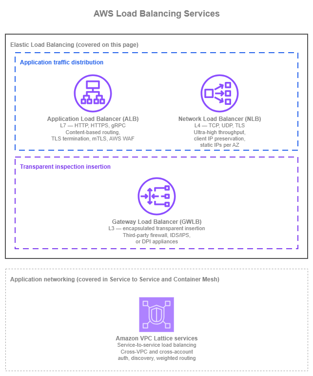
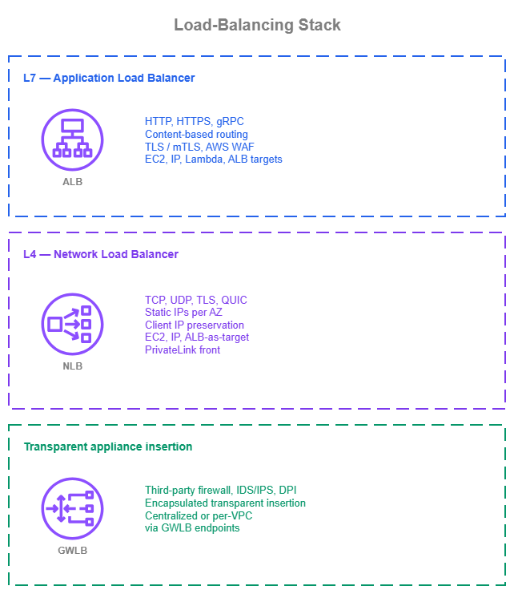

# ロードバランシング {#load-balancing}

!!! info "前提条件"
    このセクションでは、[Amazon VPC](../foundation/vpc.md)、[サブネット](../foundation/subnets.md)、および [AWS 内の接続](../connectivity/within-aws.md) と [インターネット接続](../connectivity/internet.md) のページで説明している接続パターンについて理解していることを前提としています。AWS ネットワーキングの基礎を初めて学ぶ方は、先にそれらのトピックを確認してください。

AWS Elastic Load Balancing は、3 つのマネージドサービスを通じて複数のターゲットにトラフィックを分散します。Application Load Balancer (ALB) は L7 の HTTP/HTTPS/gRPC に対応し、最大 100 のリスナールールによるコンテンツベースのルーティングを提供します。Network Load Balancer (NLB) は L4 の TCP/UDP/TLS に対応し、サブミリ秒のレイテンシーとアベイラビリティーゾーンごとの静的 IP を備えながら、毎秒数百万の接続を処理します。Gateway Load Balancer (GWLB) は GENEVE カプセル化を使用して、サードパーティのファイアウォールアプライアンスをトランスペアレントに挿入します。これらは互換性のあるサービスではなく、それぞれ異なるトラフィッククラスとアーキテクチャ上の役割のために設計されています。

このページでは、アプリケーションアーキテクチャの構成要素として 3 つの Elastic Load Balancing サービスを取り上げます。各サービスの機能、適切な設定方法、他のサービスとの使い分け、および他の AWS サービスとの組み合わせ方について説明します。

[Amazon VPC Lattice](https://docs.aws.amazon.com/vpc-lattice/latest/ug/what-is-vpc-lattice.html) のサービスも、マネージドなヘルスチェックと重み付きルーティングを備え、ターゲット間でトラフィックをロードバランシングします。VPC Lattice の詳細な説明(そのサービスのロードバランシング機能を含む)は、[サービス間通信](service-to-service.md) と [コンテナメッシュ](container-mesh.md) のページで扱っています。これは、VPC Lattice の価値がロードバランシングにとどまらず、クロス VPC・クロスアカウントのサービスディスカバリー、IAM ベースの認証、サービス間接続にまで広がるためです。このページでは 3 つの Elastic Load Balancing サービスに焦点を当てており、VPC Lattice への言及はその位置づけを示すポインターであり、詳細な説明ではありません。

/// caption
ロードバランシングサービス — [Drawio ソース](../assets/application-networking/load-balancing-services.drawio)
///

Application Load Balancer (ALB) と Network Load Balancer (NLB) はアプリケーショントラフィックをターゲットに分散します。Gateway Load Balancer (GWLB) は根本的に異なる役割を担います。サードパーティのネットワークアプライアンス(ファイアウォール、侵入検知、ディープパケットインスペクション)のフリートをデータパスにトランスペアレントに挿入するものです。GWLB を ALB や NLB と同列のサービスとして扱うことが、最もよくある混乱の原因です。このページではその違いを明示的に説明します。Amazon VPC Lattice は、そのサービスもトラフィックをロードバランシングするという参考情報として上図に示していますが、その主な用途は単一ワークロードの ELB スタイルのロードバランシングではなく、サービス間のアプリケーションネットワーキングです。そのため、図では独立したグループに配置されており、このセクションの別のページで詳しく説明しています。

## Application Load Balancer (ALB) {#application-load-balancer-alb}

[Application Load Balancer](https://docs.aws.amazon.com/elasticloadbalancing/latest/application/introduction.html) は L7 で動作します。TLS を終端し、HTTP/HTTPS および gRPC をデコードして、ホストヘッダー、パス、HTTP メソッド、クエリ文字列、送信元 IP などのリクエスト属性に基づいて各リクエストをルーティングします。ターゲットはターゲットグループに登録され、EC2 インスタンス、IP アドレス、または AWS Lambda 関数を指定できます。ALB はワークロード VPC 内に配置され、運用管理なしで水平スケールし、[AWS WAF](https://docs.aws.amazon.com/waf/latest/developerguide/waf-chapter.html)、Amazon CloudFront、AWS Global Accelerator、AWS Certificate Manager、Auto Scaling、およびコンテナサービス(Amazon ECS、Amazon EKS)とネイティブに統合されます。

### 主な機能 {#key-capabilities}

*   :material-router-network: **コンテンツベースルーティング**

    ---

    リスナールールにより、ホストヘッダー、パス、メソッド、クエリ文字列、送信元 IP、またはカスタムヘッダーでリクエストをルーティングできるため、1 つの ALB で 1 つの DNS 名を使って多数のサービスをフロントエンドとして提供できます。

*   :material-key-variant: **TLS および相互 TLS**

    ---

    ACM 発行の証明書を使用してワークロード VPC のエッジで TLS を終端し、パススルーモードまたは検証モードの相互 TLS を通じて X.509 証明書でクライアントを認証します。

*   :material-shield-bug: **AWS WAF 統合**

    ---

    リージョン AWS WAF ウェブ ACL を ALB に直接アタッチして、マネージドルールグループ、カスタムルール、およびレート制限をリクエスト層で適用し、AWS Firewall Manager による一元管理を実現します。

*   :material-trending-up: **Automatic Target Weights**

    ---

    異常検知により、5xx、TCP、または TLS エラーが増加しているターゲットを特定し、(加重ランダムアルゴリズムと組み合わせて)そのターゲットへのトラフィックを自動的に減らすことで、ヘルスチェックをパスするグレー障害を軽減します。

*   :material-package-variant-closed: **多様なターゲットのネイティブサポート**

    ---

    同一リージョン内の EC2 インスタンス、プライベート IP、Lambda 関数にルーティングでき、ターゲットグループは Auto Scaling、ECS、または EKS コントローラーで管理されます。

*   :material-internet: **デュアルスタックおよび IPv6**

    ---

    デュアルスタック(IPv4 + IPv6)リスナーまたは IPv6 専用リスナーを実行することで、変換なしにネイティブ IPv6 クライアントに対応し、バックエンド接続はワークロードの要件に応じて IPv4 または IPv6 で行えます。

### Application Load Balancer のベストプラクティス {#application-load-balancer-best-practices}

#### ライフサイクルを管理する主体に応じてターゲットタイプを選択する {#choose-target-type-by-what-owns-the-lifecycle}

ALB ターゲットグループは 3 種類のターゲットタイプ(インスタンス、IP、Lambda)をサポートしており、適切なタイプはターゲットのライフサイクルを管理する主体によって決まります。以下の表は、代表的なワークロード形態とのマッピングを示しています。

| ワークロード | ターゲットタイプ | 備考 |
| --- | --- | --- |
| Auto Scaling グループ内の EC2 | インスタンス | Auto Scaling グループがインスタンスの登録と登録解除を自動的に行います。 |
| Auto Scaling 以外のワークロード(ピアリング VPC、Direct Connect または VPN 経由のハイブリッド、手動管理の IP) | IP | VPC の境界を越えられる唯一のターゲットタイプです。インスタンスターゲットは同一 VPC 内のみ対応です。 |
| Lambda 関数 | Lambda | ALB が関数を直接呼び出します。低トラフィックのエンドポイント、シンプルな API、またはイベント駆動バックエンドへの HTTP フロントドアとして有用です。 |
| Fargate 上の ECS、または `awsvpc` モードの EC2 上の ECS | IP | 各タスクが独自の ENI を持ち、ECS がタスク IP をターゲットグループに登録します。 |
| `bridge` または `host` モードの EC2 上の ECS | インスタンス | ロードバランサーがホストにルーティングし、ホストのポートマッピングがコンテナに転送します。 |
| [AWS Load Balancer Controller](https://docs.aws.amazon.com/eks/latest/userguide/aws-load-balancer-controller.html) 経由の EKS | IP(デフォルト) | Amazon VPC CNI プラグインを通じてポッド IP に直接ルーティングします。Fargate ポッドでは必須であり、`kube-proxy` のホップを回避できるため新規クラスターにも推奨されます。レガシーの `NodePort` モデルはインスタンスターゲットを使用しますが、現在はデフォルトではありません。 |

1 つのターゲットグループ内でターゲットタイプを混在させることはサポートされていません。ターゲットグループごとに 1 つのタイプを選択してください。

#### ロードバランサーではなくアプリケーションに合わせてヘルスチェックを設計する {#design-health-checks-for-the-application-not-the-load-balancer}

ヘルスチェックは、ターゲットがトラフィックを処理できる状態かどうかを ALB が判断するための唯一のシグナルです。ヘルスチェックの設定が不適切だと、異常なターゲットがローテーションに残り続けるか(サイレントエラー)、正常なターゲットが除外されるか(回避可能な障害)のいずれかが発生します。アプリケーションが実際に保証できる内容に合わせてチェックを設定してください。

* **アプリケーションの重要な依存関係(キャッシュ、データベース接続、ダウンストリームサービスの可用性)を検証する専用のヘルスチェックパスを使用し**、ターゲットが実際のリクエストを処理できる場合にのみ成功を返すようにします。依存関係に触れないパスからの `200 OK` は意味がありません。
* **インターバルとしきい値をアプリケーションの回復時間に合わせてチューニングします**。デフォルト値(30 秒インターバル、正常しきい値 5 回 / 異常しきい値 2 回)は多くのワークロードで機能しますが、ウォームアップに 60 秒かかる低速起動コンテナは、安定稼働中の EC2 インスタンスとは異なる設定が必要です。
* **可能な限りヘルスチェックプロトコルをリスナープロトコルに合わせます**(HTTPS リスナーには HTTPS ヘルスチェック)。これにより、チェックが実際のトラフィックと同じ TLS パスを検証できます。ターゲット自体が TLS を終端できないがリスナーが終端する場合にのみ HTTP を使用してください。

#### ワークロードに適したルーティングアルゴリズムを使用する {#use-the-routing-algorithm-the-workload-needs}

ALB はターゲットグループレベルで 3 種類のルーティングアルゴリズムをサポートしています。ラウンドロビンはほとんどのワークロードに適しており、対応するワークロード上の課題がない状態で他のアルゴリズムに切り替えても、メリットよりもノイズが増えるだけです。

| アルゴリズム | 使用場面 | 備考 |
| --- | --- | --- |
| **ラウンドロビン** *(デフォルト)* | ターゲットがステートレスかつ均質で、リクエスト処理時間が均一であり、トラフィックをほぼ均等に分散できる場合。 | ほとんどの HTTP/HTTPS ワークロードに適した出発点です。 |
| **最小未処理リクエスト数** | リクエストごとの処理時間が大きく異なる場合(可変レイテンシーのバックエンド、混合ワークロードのターゲット)。 | 各新規リクエストをインフライトリクエスト数が最も少ないターゲットにルーティングするため、低速なターゲットにキューが蓄積されません。 |
| **加重ランダム** | ワークロードがグレー障害に敏感で Automatic Target Weights(ATW)による異常軽減が必要な場合、またはラウンドロビンとは異なる確率的分散が必要な場合。 | ATW を有効にするために必須です。ATW は 5xx、TCP、または TLS エラーが増加しているターゲットへのトラフィックを自動的に減らします。 |

#### ワークロードの要件に応じて異常軽減と同時実行制御を使用する {#use-anomaly-mitigation-and-concurrency-control-where-the-workload-needs-them}

2 つのターゲットグループレベルの機能が、単純な負荷分散を超えたトラフィック制御を担い、それぞれ異なる問題に対処します。

| 機能 | 使用場面 | 動作 | 制約 |
| --- | --- | --- | --- |
| **Automatic Target Weights(ATW)** | ターゲットがヘルスチェックをパスしているにもかかわらず、5xx、TCP、または TLS エラーが増加している場合(CPU 過負荷、依存関係の障害、潜在的なバグによるグレー障害)。 | 異常検知は 3 つ以上の正常なターゲットを持つ HTTP/HTTPS ターゲットグループで自動的に有効化されます。実際のトラフィックシフトを有効にするには**加重ランダム**ルーティングアルゴリズムを有効にしてください。 | エージェント不要。既存のターゲットグループで動作します。 |
| **[Target Optimizer](https://docs.aws.amazon.com/elasticloadbalancing/latest/application/target-group-register-targets.html#register-targets-target-optimizer)** | ターゲットに固有の同時実行制限がある場合(LLM 推論エンドポイント、長時間実行の同期タスク)。ターゲット自体でのキューイングは、ロードバランサーでのキューイングよりも深刻な障害モードを引き起こします。 | AWS が公開している Rust エージェント(Docker イメージ `public.ecr.aws/aws-elb/target-optimizer/target-control-agent`)が各ターゲット上でインラインで実行され、準備状態をシグナルします。同時リクエスト数は 1〜1000 に制限されます(デフォルト 1)。 | ターゲットグループ作成時に有効化する必要があり、後から追加することはできません。 |

ATW は*どの*ターゲットがトラフィックを受け取るかを制御し、Target Optimizer は各ターゲットが*同時に*保持するリクエスト数を制御します。これらは補完的な機能であり、ワークロードで両方を使用することも可能です。

#### ALB で TLS を終端し ACM 発行の証明書を使用する {#terminate-tls-at-the-alb-and-use-acm-issued-certificates}

ALB は [AWS Certificate Manager](https://docs.aws.amazon.com/acm/latest/userguide/acm-overview.html) で管理される証明書を使用して TLS を終端します。追加料金はなく、自動更新されます。L7 ワークロードのデフォルトとして使用してください。

* **ターゲット自体で自己管理証明書をローテーションするのではなく、ACM からアプリケーションごとの証明書を発行します**。
* **ワークロードのコンプライアンス要件がエンドツーエンド TLS を必要とする場合にのみ、オリジンへの再暗号化を行います**。L7 トラフィックの大部分は ALB で終端され、ALB からターゲットへは HTTP を使用します。
* **証明書でクライアントを認証するワークロードには[相互 TLS](https://docs.aws.amazon.com/elasticloadbalancing/latest/application/mutual-authentication.html) を使用します**。バックエンドサービスが独自の認証判断のためにクライアント証明書チェーン全体を必要とする場合は `passthrough` モードを選択し、ALB 自体が CA バンドルを使用して X.509 認証を実行する場合は `verify` モードを選択します。mTLS では TLS セッション再開がサポートされていないため、接続レートの予算に考慮してください。

#### アベイラビリティーゾーンの耐障害性を計画する {#plan-for-availability-zone-resilience}

* **本番環境では ALB を少なくとも 2 つ、理想的には 3 つのアベイラビリティーゾーンで実行します**。ALB 自体は有効化されたアベイラビリティーゾーン全体で高可用性を持ちます。制限はサブネットのサイジングとターゲットが実際に稼働しているアベイラビリティーゾーンによります。
* **クロスゾーン負荷分散は ALB レベルでデフォルトで有効**になっています(これが正しい設定です)。クライアントがアベイラビリティーゾーン間でどのように分散されていても、ターゲットの使用率を均等化します。ターゲットグループごとにオーバーライドできますが、ほぼすべてのワークロードでデフォルトが正しい設定です。
* **本番 ALB には Amazon Application Recovery Controller(ARC)を通じて[ゾーナルシフト](https://docs.aws.amazon.com/elasticloadbalancing/latest/application/zonal-shift.html)を有効にします**。ゾーナルシフトにより、実際のまたは疑わしいアベイラビリティーゾーンイベント発生時に、ヘルスチェックやルーティングルールを変更することなく、数秒でロードバランサーの DNS からアベイラビリティーゾーンをドレインできます。AZ に影響するイベントでの自動起動には、`zonal autoshift`(AWS 内部テレメトリがアベイラビリティーゾーンの障害を検知した際に AWS がゾーナルシフトをトリガーできる ARC 機能)を設定します。`zonal autoshift` 機能は、実際のシフトが発動する前にアプリケーションが 1 つのアベイラビリティーゾーンなしで正常に動作することを検証するため、毎週の練習実行設定が必要です。

#### IPv6 をファーストクラスのオプションとして計画する {#plan-ipv6-as-a-first-class-option}

ALB はデュアルスタックリスナー(IPv4 と IPv6 の両方)および IPv6 専用リスナーをサポートしています。どちらのオプションも IPv4 から IPv6 への変換なしにネイティブ IPv6 クライアントに対応でき、NAT のコストと複雑さを回避しながら、アプリケーションが元のクライアントを IPv6 アドレスで識別できます。

* **特定の理由で IPv4 専用にする必要がない限り、新規 ALB にはデュアルスタックをデフォルトとして使用します**。デュアルスタックは既存の IPv4 クライアントと将来の IPv6 クライアントを透過的に処理します。
* **クライアント全体が IPv6 対応であり、ワークロードが IPv4 クライアントにサービスを提供する必要がない場合は IPv6 専用リスナーを使用します**。これは IPv6 ファースト VPC 内の内部専用 ALB で最も一般的です。
* **ターゲットがリスナーで使用する IP バージョンをサポートしていることを確認します**。ALB からターゲットへのトラフィックはターゲットグループで宣言されたプロトコルを使用します。IPv6 専用リスナーが IPv4 専用ターゲットにサービスを提供する場合、ALB がプロトコルブリッジングを行いますが、予測可能な動作のために可能な限りエンドツーエンドで IP バージョンを一致させることを推奨します。

#### アプリケーションコードを置き換えられる場面では ALB の HTTP 層機能を活用する {#use-albs-http-layer-features-where-they-replace-application-code}

ALB はアプリケーションレベルの作業を置き換えることが多い HTTP 層機能をいくつか提供しています。

* **[Amazon Cognito](https://docs.aws.amazon.com/elasticloadbalancing/latest/application/listener-authenticate-users.html) または任意の OIDC 準拠 ID プロバイダーを通じた組み込みユーザー認証**。すべてのバックエンドサービスに認証コードを追加することなく、人間ユーザーのアクセスをゲートするために内部向け ALB で使用します。上流の API ゲートウェイ、ID 認識プロキシ、またはサービスメッシュがすでに ID を強制している場合はスキップしてください。
* **HTTP/2 はクライアントから ALB への接続でデフォルトで有効**になっています。そのままにしておいてください。HTTP/3 については、ALB 自体は HTTP/3 を直接終端しないため、ALB の前段に CloudFront を配置して終端してください。
* **リクエスト解析攻撃に対する軽減策**は `routing.http.desync_mitigation_mode = defensive` によりデフォルトで有効になっており、フロントエンドとバックエンドの HTTP パーサー間の曖昧さを悪用する不正なリクエストをブロックします。`monitor`(ログのみ)または `strictest`(より積極的)を必要とする特定のトラフィックパターンを検証済みでない限り、デフォルトのままにしてください。
* **スティッキーセッション**は ALB 生成またはアプリケーション生成の Cookie を通じて、クライアントを繰り返し同じターゲットにルーティングします。アプリケーションがキャッシュやデータベースに外部化されていないインメモリセッション状態を維持している場合にのみ使用してください。ステートレスなアプリケーションではスティッキーを有効にすべきではありません。負荷が集中し、回復が遅くなります。

#### クリーンなデプロイのためにターゲットライフサイクルを細かく調整する {#sub-tune-target-lifecycle-for-clean-deployments}

ターゲットグループの属性は ALB がターゲットをドレインおよび起動する方法を制御し、デプロイの品質に直接影響します。

* **登録解除遅延**(デフォルト 300 秒)をアプリケーションが処理する最も長いリクエストに合わせて設定します。短命の HTTP リクエストの場合は 30〜60 秒に下げてデプロイを長引かせないようにします。ロングポーリングやストリーミング接続の場合は適宜増やしてください。
* **コールドスタートに敏感なターゲットにはスロースタートモードを使用します**。新しいターゲットは、すぐにフルローテーションに追加されるのではなく、スロースタートウィンドウ(最大 15 分)にわたって線形に増加するトラフィックシェアを受け取ります。JIT コンパイル、キャッシュウォーミング、またはフル容量に達するまでに短い準備期間が必要なターゲットに使用してください。
* **ブルー/グリーンおよびカナリアリリースには加重ターゲットグループを組み合わせます**。1 つのリスナールールの背後に 2 つのターゲットグループを配置し、重みを段階的にシフト(90/10 → 50/50 → 0/100)することで、DNS TTL の待機なしに制御されたトラフィックシフトが実現できます。

#### 適切なデフォルト設定で ALB を運用する {#operate-the-alb-with-the-right-defaults}

| 設定 | デフォルト | 推奨 |
| --- | --- | --- |
| 削除保護 | オフ | 本番環境では**オン**。コストはゼロで、誤削除に対する保護は実質的です。 |
| S3 へのアクセスログ | オフ | リクエストレベルのフォレンジックが必要なワークロードでは**オン**。ALB の追加料金はなく、S3 ストレージコストのみ発生します。 |
| アイドルタイムアウト(`idle_timeout.timeout_seconds`) | 60 秒 | 長期接続(サーバー送信イベント、ロングポーリング)では増やし、一般的なリクエスト/レスポンスでは 60 秒のままにします。 |
| サブネットサイジング | — | アベイラビリティーゾーンのサブネットごとに少なくとも `/27` を確保し、8 つの空き IP を予約します。狭い `/28` サブネットはスケールイベント時に枯渇し、5xx エラーを引き起こします。 |

### Application Load Balancer を使用する場面 {#when-to-use-application-load-balancer}

ALB は、HTTP、HTTPS、または gRPC を使用し、リクエストレベルのルーティング判断から恩恵を受けるあらゆるワークロードのデフォルトロードバランサーです。以下の場合に ALB を選択してください。

* アプリケーションが HTTP/HTTPS ベースである場合: ウェブアプリケーション、REST API、マイクロサービス。
* コンテンツベースルーティング(ホストヘッダー、パス、メソッド)を使用して、単一のインターネットエントリポイントから複数のバックエンドサービスにファンアウトする必要がある場合。
* ACM 証明書と統合 AWS WAF によるマネージド TLS 終端が必要な場合。
* 相互 TLS 認証または mTLS で保護された内部 API が必要な場合。
* Amazon Cognito または任意の OIDC 準拠 ID プロバイダーを通じた組み込みユーザー認証が必要な場合。
* ターゲットが異種混在(EC2、コンテナ、Lambda、IP ターゲット経由のオンプレミス)の場合。
* Automatic Target Weights によるグレー障害軽減、または Target Optimizer による厳密なターゲットごとの同時実行制御が必要な場合。

ワークロードが非 HTTP の場合(NLB を使用)、HTTP デコードなしの超低レイテンシー L4 フォワーディングが必要な場合(NLB を使用)、またはサードパーティファイアウォールの透過的な挿入が必要な場合(GWLB を使用)は、ALB は適切な選択ではありません。

### Application Load Balancer と他のサービスの組み合わせ {#combining-application-load-balancer-with-other-services}

* **[Amazon CloudFront](https://docs.aws.amazon.com/AmazonCloudFront/latest/DeveloperGuide/Introduction.html) で ALB をフロントエンドとして使用**することで、グローバルエッジキャッシング、エッジ TLS 終端、HTTP/3 サポート、およびエッジでの AWS WAF を実現します。[CloudFront VPC Origins](https://docs.aws.amazon.com/AmazonCloudFront/latest/DeveloperGuide/private-content-vpc-origins.html) を使用することで、ALB をパブリック IP 露出なしにプライベートに保てます。
* **CloudFront が前段にない場合は、ALB に直接 [AWS WAF](https://docs.aws.amazon.com/waf/latest/developerguide/waf-chapter.html) を使用**して L7 保護を適用します。[AWS Firewall Manager](https://docs.aws.amazon.com/waf/latest/developerguide/fms-chapter.html) でルールセットを一元的に適用します。
* **Auto Scaling、Amazon ECS、Amazon EKS とネイティブなターゲットグループ登録を通じて統合**することで、ロードバランサーのターゲットリストが実際のキャパシティを反映します。
* **Lambda ターゲットを使用**して、API Gateway への依存なしに HTTP フロントドアの背後にサーバーレスバックエンドを配置します。
* **加重ターゲットグループを使用**して、DNS ベースのトラフィックシフトなしにブルー/グリーンおよびカナリアリリースを実現します。
* **[Amazon Application Recovery Controller](https://docs.aws.amazon.com/r53recovery/latest/dg/what-is-route53-recovery.html) と組み合わせて**、ゾーナルシフト(オペレーター起動)と `zonal autoshift`(AWS 起動、練習実行設定が必要)を有効にし、アベイラビリティーゾーンイベント時に迅速な AZ レベルのトラフィックドレインを実現します。

### ドキュメント {#documentation}

*   :material-file-document: **Application Load Balancer ドキュメント**

    ---

    リスナー、リスナールール、ターゲットグループ、ヘルスチェック、相互 TLS、Automatic Target Weights、Target Optimizer、IPv6、および料金を含む完全なサービスドキュメントです。

    [:octicons-arrow-right-24: ドキュメント](https://docs.aws.amazon.com/elasticloadbalancing/latest/application/introduction.html)

## Network Load Balancer (NLB) {#network-load-balancer-nlb}

[Network Load Balancer](https://docs.aws.amazon.com/elasticloadbalancing/latest/network/introduction.html) は L4 で動作します。TCP、UDP、TLS、QUIC、および複合プロトコルである TCP_UDP と TCP_QUIC をサポートしており、HTTP を認識したデコードは行いません。デフォルトでは、インスタンスタイプのターゲットは常にクライアントのソース IP を保持し、IP タイプのターゲットは UDP/TCP_UDP/QUIC/TCP_QUIC プロトコルでソース IP を保持します（プレーンな TCP/TLS では明示的に有効化した場合のみ保持されます）。NLB は TLS ターミネーションをサポートし、超低レイテンシーと非常に高いスループット向けに設計されており、アベイラビリティーゾーンごとに静的 IP を公開します（安定したパブリックアドレスのためにオプションで Elastic IP も利用可能）。これにより、クライアントは特定のアドレスをアクセス許可リストに登録できます。ターゲットは、ワークロードのデプロイ方法に応じて、インスタンス、IP アドレス、または Application Load Balancer としてターゲットグループに登録されます。

### 主な機能 {#key-capabilities}

*   :material-flash: **非常に高いスループットでの L4 フォワーディング**

    ---

    HTTP デコードなしの TCP および UDP フォワーディング。突発的なトラフィックスパイクや、HTTP レイヤーがレイテンシーを増加させたりアプリケーションを破壊したりするプロトコルに対応するよう設計されています。

*   :material-eye-outline: **クライアントソース IP の保持**

    ---

    デフォルトで、インスタンスターゲットおよび UDP/TCP_UDP/QUIC/TCP_QUIC ターゲットには元のクライアント IP が届くため、バックエンドのセキュリティグループとアプリケーションロジックで実際のクライアントアドレスを利用できます。

*   :material-ip-network: **アベイラビリティーゾーンごとの静的 IP および Elastic IP**

    ---

    各 NLB は有効化されたアベイラビリティーゾーンごとに安定した IP を持ちます（パブリック NLB ではオプションで Elastic IP も利用可能）。特定のアドレスをアクセス許可リストに登録する必要があるクライアントや、固定の L4 エンドポイントを指す DNS レコードに適しています。

*   :material-shield-key-outline: **L4 での TLS ターミネーション**

    ---

    TLS の上位プロトコルが HTTP ではない場合、またはターゲット自身が TLS を終端できない場合に、ACM 証明書を使用して NLB 上で TLS を終端します。

*   :material-shield-account: **NLB 自体へのセキュリティグループ**

    ---

    NLB に直接セキュリティグループをアタッチして、どのクライアントがロードバランサーに到達できるかを制御します。個々のターゲットごとにセキュリティグループのクォータを消費する必要がありません。セキュリティグループは NLB の作成時に割り当てる必要があります。

*   :material-internet: **デュアルスタックおよび IPv6 専用リスナー**

    ---

    IPv6 ターゲットを使用したデュアルスタックまたは IPv6 専用リスナーを実行します。UDP サポートを含み、IPv4 パスと同じ L4 セマンティクスでネイティブ IPv6 クライアントに到達できます。

### Network Load Balancer のベストプラクティス {#network-load-balancer-best-practices}

#### ターゲットの配置場所に応じてターゲットタイプを選択する {#choose-target-type-by-where-targets-live}

NLB ターゲットグループは 3 種類のターゲットタイプ（インスタンス、IP、ALB-as-target）をサポートしており、適切なタイプはターゲットの配置場所と登録方法によって決まります。以下の表は、最も一般的なワークロードの形態をまとめたものです。

| ワークロード | ターゲットタイプ | 備考 |
| --- | --- | --- |
| NLB と同じ VPC 内の Auto Scaling グループに属する EC2 | インスタンス | Auto Scaling グループがインスタンスを自動的に登録・登録解除します。 |
| ピアリングされた VPC 内のターゲット、共有 VPC を通じた別アカウントのターゲット、Direct Connect または VPN を通じたオンプレミスのターゲット | IP | VPC の境界を越えられる唯一のターゲットタイプです。インスタンスターゲットは同一 VPC 内のみ対応です。 |
| Fargate 上の ECS、または `awsvpc` モードの EC2 上の ECS | IP | 各タスクが独自の ENI を持ちます。 |
| `bridge` または `host` モードの EC2 上の ECS | インスタンス | ロードバランサーはホストにルーティングします。 |
| AWS Load Balancer Controller 経由の EKS | IP（デフォルト） | Amazon VPC CNI プラグインを通じてポッド IP に直接ルーティングします。Fargate ポッドでは必須であり、新規クラスターに推奨されます。レガシーの `NodePort` モデルはインスタンスターゲットを使用しますが、現在はデフォルトではありません。コントローラーは `LoadBalancer` タイプの `Service` リソースおよび Kubernetes Gateway API の `TCPRoute`、`UDPRoute`、`TLSRoute` リソースから NLB をプロビジョニングします。 |
| L4 エントリーポイント（静的 IP または PrivateLink 公開）と L7 ルーティングの両方が必要なワークロード | ALB-as-target | NLB が ALB ターゲットグループにフォワードします。同一ワークロードに NLB レベルの機能（静的 IP、PrivateLink フロント）と ALB レベルのルーティングルールの両方が必要な場合に使用します。 |

#### プロトコルに合わせたヘルスチェックを設計する {#design-health-checks-for-the-protocol}

NLB のヘルスチェックはターゲットグループレベルで行われ、各ターゲットを個別にプローブします。アプリケーションが確実に応答できるプロトコルに合わせてヘルスチェックプロトコルを選択してください。

* **TCP/UDP/TLS ターゲットグループでは、ターゲットが HTTP に対応している場合は HTTP または HTTPS プローブを使用してください**。リスナーが L4 であっても同様です。ターゲットの依存関係を検証する専用の `/health` パスへの HTTP プローブは、TCP のみのプローブ（ポートが開いていることを確認するだけ）よりもはるかに豊富なシグナルを提供します。
* **ターゲットが HTTP ヘルスエンドポイントを公開していない場合は TCP プローブを使用してください**。TCP の成功は「ポートが接続を受け付けている」ことを意味するだけであり、「アプリケーションが準備完了である」ことを意味しないことを認識してください。TCP ヘルスチェックと、実際の準備状態を反映するメトリクスに対するアプリケーションレベルのアラームを組み合わせてください。
* **インターバルとしきい値をアプリケーションの回復時間に合わせて調整してください**。NLB ヘルスチェックのデフォルトは 30 秒間隔、正常しきい値 5 回・異常しきい値 2 回です。多くのワークロードには適切ですが、起動が遅いバックエンドや、単一の失敗でターゲットをローテーションから外すべきでないプロトコルには適していません。

#### アベイラビリティーゾーンの耐障害性を計画する {#plan-for-availability-zone-resilience}

NLB のアベイラビリティーゾーン動作は ALB よりも複雑です。クロスゾーン負荷分散がデフォルトで**オフ**になっており、ゾーナルトラフィック分散が設計の一部となっているためです。NLB を少なくとも 2 つのアベイラビリティーゾーンにデプロイし、クロスゾーン、アベイラビリティーゾーン DNS アフィニティ、ゾーナルシフトを一連の関連した意思決定として扱ってください。

* **クロスゾーン負荷分散はデフォルトでオフ**です。これにより、クライアントトラフィックは到着したアベイラビリティーゾーン内に留まります（クロスゾーンのデータ転送料金なし、低レイテンシー）。トレードオフとして、分散はクライアントがアベイラビリティーゾーン間にどのように分散しているかに依存します。

  | 設定 | 使用する場面 |
  | --- | --- |
  | **オフ** *（デフォルト）* | クライアントの分散がアベイラビリティーゾーン間でほぼ均一であり、コストまたはレイテンシーの観点からゾーナルローカリティーが重要な場合。 |
  | **オン** | 分散が不均一な場合（単一 AZ の呼び出し元が支配的）、またはすべてのターゲットが到着アベイラビリティーゾーンに関係なく均等なトラフィックを受信すべき場合。クロスゾーンの NLB からターゲットへのトラフィックにはクロス AZ データ転送料金が発生します。 |

  パスの両側をゾーナルに保つ場合は、クロスゾーンオフと [アベイラビリティーゾーン DNS アフィニティ](https://docs.aws.amazon.com/elasticloadbalancing/latest/network/edit-load-balancer-attributes.html)（Route 53 Resolver がクライアント自身のアベイラビリティーゾーンにある NLB の IP を返す）を組み合わせてください。ターゲットを単一のプールとしてではなく、アベイラビリティーゾーンごとにスケールするよう計画してください。

* **本番環境の NLB では、Amazon Application Recovery Controller（ARC）を通じて [ゾーナルシフト](https://docs.aws.amazon.com/elasticloadbalancing/latest/network/zonal-shift.html)を有効化してください**。オペレーターがトリガーするゾーナルシフトにより、障害が発生した AZ の IP が DNS から削除され、新しい接続が正常なアベイラビリティーゾーンに向かいます（既存の接続はクローズ時にドレインされます）。AWS 内部のテレメトリーがアベイラビリティーゾーンの障害を検出した際に AWS がトリガーする `zonal autoshift` を設定してください。これには週次の練習実行設定が必要であり、実際のシフトが発生する前にアプリケーションが 1 つのアベイラビリティーゾーンなしで正常に動作することを検証します。

* **`ZonalHealthStatus` CloudWatch メトリクスにアラームを設定してください**。NLB は、ゾーナルヘルスチェックに失敗した場合（正常なターゲットがない、設定された最小数を満たしていない、またはアクティブなゾーナルシフトがある場合）にそのゾーンの DNS レコードを削除します。これを早期に検知することで、ゾーナルの問題が顧客向けの障害に発展するのを防ぎます。

#### クライアント IP 保持について意図的に設計する {#be-deliberate-about-client-ip-preservation}

NLB はインスタンスターゲットおよび UDP/TCP_UDP/QUIC/TCP_QUIC ターゲットグループに対してデフォルトでクライアントソース IP を保持し、IP ターゲットの TCP および TLS ターゲットグループに対してはデフォルトで無効にします。これを有効にするかどうかは、NLB における最も重要な設計上の決定の 1 つです。

* **クライアント IP 保持がオンの場合、ターゲットのセキュリティグループは実際のクライアント IP 範囲を許可する必要があります**。これはソース IP で認証するアプリケーションロジックにとっては改善ですが、セキュリティグループが実際のクライアントネットワークを反映する必要があることを忘れるオペレーターにとっては一般的な落とし穴です。
* **クライアント IP 保持は機能しません**。トラフィックが Transit Gateway / AWS Cloud WAN、Gateway Load Balancer エンドポイント、または AWS PrivateLink を経由する場合です。これらのパスでは、ターゲットでのソース IP は常に NLB のプライベート IP になります。これらのパスで元のクライアント IP が必要な場合は、ターゲットグループで [Proxy Protocol v2](https://docs.aws.amazon.com/elasticloadbalancing/latest/network/edit-target-group-attributes.html#proxy-protocol) を有効化してください。アプリケーションはクライアント IP を取得するために Proxy Protocol ヘッダーを解析する必要があります。
* **一部のレガシーインスタンスタイプはクライアント IP 保持をサポートしていません**。これらはクライアント IP 保持を無効にした IP ターゲットとして登録し、アプリケーションがクライアント IP を必要とする場合は Proxy Protocol v2 を使用してください。
* **クライアント IP 保持は AWS PrivateLink 経由のイングレスには効果がありません**。設定に関係なく、ソース IP は常に NLB のプライベート IP になります。

#### NLB にセキュリティグループを使用し、作成時のルールを覚えておく {#use-security-groups-on-the-nlb-and-remember-the-at-creation-rule}

NLB はロードバランサーに直接アタッチされたセキュリティグループをサポートしており、ターゲットごとのセキュリティグループルールクォータを消費せずに NLB への到達を制御できます。

* **NLB の作成時にセキュリティグループをアタッチしてください**。セキュリティグループは既存の NLB に後から追加することはできません。最初にアタッチしなかった場合は、NLB を再作成する必要があります。
* **ターゲットのセキュリティグループのソースとして NLB のセキュリティグループを使用してください**。これにより、ターゲットは NLB からのトラフィックのみを受け入れます。すべてのターゲットですべてのクライアント IP をアクセス許可リストに登録するよりもクリーンな方法です。
* **NLB のアウトバウンドルールでヘルスチェックトラフィックを許可してください**。ヘルスチェック接続は NLB から発信され、NLB のアウトバウンドルールに従ってターゲットに到達します。アウトバウンドルールがヘルスチェックポートでターゲットへのトラフィックを許可していない場合、すべてのターゲットが異常と表示されます。
* **PrivateLink のコンシューマーが直接クライアントと同じアクセスポリシーに直面すべきかどうかを決定してください**。デフォルトでは、PrivateLink 経由のトラフィックは NLB のインバウンドセキュリティグループルールをバイパスします。インターフェイス VPC エンドポイントを通じて NLB に到達するコンシューマーを直接クライアントと同じセキュリティグループでフィルタリングしたい場合は、PrivateLink トラフィックにインバウンドルールを適用するオプションを有効にしてください。

#### L4 TLS が要件の場合のみ NLB での TLS ターミネーションを使用する {#use-tls-termination-on-nlb-only-when-l4-tls-is-the-requirement}

NLB は ACM 証明書を使用してロードバランサーで TLS を終端する TLS リスナーをサポートしています。以下の場合に使用してください。

* TLS の上位プロトコルが HTTP ではない場合（一部のデータベースプロトコル、カスタムバイナリプロトコル、MQTT-over-TLS）。
* ターゲット自身が TLS を終端できず、マネージド証明書ワークフローが必要な場合。

ワークロードが HTTPS の場合は、代わりに ALB で終端してください。ALB の HTTP 認識型ターミネーションは運用がシンプルで、復号化されたリクエストに対するコンテンツベースのルーティングをサポートし、AWS WAF と統合されます。これらはいずれも NLB では利用できません。

#### アプリケーションコードを置き換える NLB の L4 機能を活用する {#use-nlbs-l4-features-where-they-replace-application-code}

NLB のいくつかの L4 レベルの機能は、追加コードや追加コンポーネントが必要になる懸念事項をカバーします。

* **接続アイドルタイムアウト**は TCP フローのデフォルトが 350 秒で、60 秒から 6000 秒の範囲で設定可能です。長期間の TCP 接続（データベース同期、永続的なメッセージバス）では、アプリケーションがまだ開いていると期待しているセッションを NLB が切断しないよう、値を大きくしてください。UDP フローのアイドルタイムアウトは固定の 120 秒（設定不可）です。TLS リスナーのアイドルタイムアウトは固定の 350 秒（設定不可）です。
* **QUIC および TCP_QUIC リスナー**は、組み込み TLS、接続確立のラウンドトリップ削減、ネットワーク間の接続マイグレーションを備えた QUIC ネイティブワークロードをサポートします。ワークロードが QUIC ネイティブ（一部の HTTP/3 実装、最新のトランスポートレイヤーアプリケーション）の場合に使用してください。
* **TCP ターゲットグループのスティッキーセッション**（ソース IP アフィニティ）は、クライアントを繰り返し同じターゲットにルーティングします。アプリケーションがキャッシュやデータベースに外部化されていないソース IP ごとのインメモリ状態を維持している場合にのみ使用してください。
* **ソース IP 保持が必要な IPv6 UDP リスナーでは、NLB の IPv6 ソース NAT プレフィックスを有効化してください**。これがないと、UDP IPv6 ソース IP をターゲットまで保持できません。これは IPv4 クライアント IP 保持動作の IPv6 版です。
* **クライアントがアクセス許可リストに登録するパブリック NLB には Elastic IP を使用してください**。Elastic IP は NLB の再作成後も存続しますが、エフェメラルなパブリック IP は存続しません。予期しない NLB の再作成により、古いアドレスをアクセス許可リストに登録していたすべてのクライアントが接続できなくなります。

#### クリーンなデプロイのためにターゲットのライフサイクルを調整する {#tune-target-lifecycle-for-clean-deployments}

* **登録解除の遅延**（デフォルト 300 秒）を、予想される最長の接続に合わせて設定してください。短い TCP リクエストの場合は短くしてください。長期間の TCP 接続の場合は長くするか、デプロイが停滞しないよう異常なターゲットへの接続終了を有効化してください。
* **異常なターゲットへの接続終了を有効化してください**。ワークロードがヘルスチェックに失敗したターゲットへの進行中の接続を、接続が自然にクローズするのを待つのではなく、即座に切断すべき場合に使用します。
* **異常ドレインインターバル**を使用して、NLB がターゲットを完全に異常とマークするまでの待機時間を制御してください。これにより、アプリケーションが一時的な問題から回復する機会が与えられます。

#### 適切なデフォルト設定で NLB を運用する {#operate-the-nlb-with-the-right-defaults}

| 設定 | デフォルト | 推奨 |
| --- | --- | --- |
| 削除保護 | オフ | 本番環境では**オン**。コストはゼロで、誤削除に対する保護は実質的です。 |
| S3 へのアクセスログ | オフ | フローレベルのフォレンジックが必要なワークロードでは**オン**。NLB の追加料金はなく、S3 ストレージコストのみ発生します。 |
| クロスゾーン負荷分散 | オフ | 上記のレイテンシーとクロスゾーンコストの理由から、デフォルトは**オフ**のままにしてください。特定のワークロードで必要な場合はターゲットグループごとに上書きしてください。 |
| ゾーナルシフト | オフ | 本番環境の NLB では**オン**にし、`zonal autoshift` と、アプリケーションが 1 つ少ないアベイラビリティーゾーンで動作することを検証できる練習実行設定を行ってください。 |
| サブネットごとのセカンダリ IP アドレス | 0 | 非常に大規模なスケールでポート割り当てエラーによりターゲットの追加が妨げられる場合にのみ増やしてください。一度増やすと設定を減らすことはできません。 |

### Network Load Balancer を使用する場面 {#when-to-use-network-load-balancer}

NLB は以下の場合に適切なロードバランサーです。

* ワークロードが L4 である場合 — TCP、UDP、HTTPS ではない TLS、または QUIC。
* HTTP 認識型の処理なしに超低レイテンシーのフォワーディングが必要な場合。
* アプリケーションがエンドツーエンドでソース IP によってクライアントを認証し、クライアント IP 保持が必要な場合。
* クライアントがロードバランサーをアクセス許可リストに登録できるよう、アベイラビリティーゾーンごとの静的 IP（または安定したパブリックアドレスのための Elastic IP）が必要な場合。
* プロトコルがロードバランサーを透過的に通過する必要がある場合 — ゲーミング、音声、映像、リアルタイム金融取引、カスタムバイナリプロトコル、または HTTP/3 / QUIC ワークロード。
* AWS PrivateLink を通じてサービスを公開する必要がある場合。NLB は [インターフェイス VPC エンドポイントサービス](https://docs.aws.amazon.com/vpc/latest/privatelink/configure-endpoint-service.html)の前段でサポートされているロードバランサーです。

NLB は、リクエストレベルのルーティングや AWS WAF 統合が必要な HTTP/HTTPS ワークロード（ALB を使用）や、透過的なインスペクションアプライアンスの挿入（GWLB を使用）には適していません。

### Network Load Balancer と他のサービスの組み合わせ {#combining-network-load-balancer-with-other-services}

* **大陸をまたいで分散したクライアントには、[AWS Global Accelerator](https://docs.aws.amazon.com/global-accelerator/latest/dg/what-is-global-accelerator.html) を NLB の前段に配置してください**。Global Accelerator のエニーキャスト IP はインターネットパスの変動を低減し、NLB はリージョン内の L4 エントリーポイントとして機能し続けます。元のクライアント IP がターゲットに届くよう、Global Accelerator エンドポイントでクライアント IP 保持を有効化してください。
* **[AWS PrivateLink](https://docs.aws.amazon.com/vpc/latest/privatelink/what-is-privatelink.html) を通じて NLB を公開し**、VPC ピアリングや Transit Gateway なしに、アカウントやリージョンをまたいだコンシューマー VPC からサービスに到達できるようにしてください。NLB は PrivateLink エンドポイントサービスの背後でサポートされているロードバランサーであり、コンシューマーはインターフェイス VPC エンドポイントを通じて接続します。
* **VPC Lattice VPC リソースを使用してください**。VPC とアカウントをまたいだプライベートな TCP リソースアクセスが目的の場合、PrivateLink エンドポイントサービスの代替として利用できます。VPC リソースは維持すべき NLB が不要で、重複する CIDR をネイティブにサポートします。
* **NLB と ALB-as-target を組み合わせてください**。ワークロードが本当に両方を必要とする L4-then-L7 パターンに使用します。静的 IP または PrivateLink 公開のための NLB と、HTTP 認識型ルーティングのための ALB を組み合わせます。これは少数のユースケースであり、クロス VPC HTTPS イングレスの回避策ではありません。
* **Auto Scaling、Amazon ECS、Amazon EKS とネイティブなターゲットグループ登録を通じて統合してください**。
* **[Amazon Application Recovery Controller](https://docs.aws.amazon.com/r53recovery/latest/dg/what-is-route53-recovery.html) と組み合わせて**、アベイラビリティーゾーンイベント時の高速な AZ レベルのトラフィックドレインのために、ゾーナルシフト（オペレーターがトリガー）と `zonal autoshift`（AWS がトリガー、練習実行設定が必要）を有効化してください。

### ドキュメント {#documentation}

*   :material-file-document: **Network Load Balancer ドキュメント**

    ---

    TCP/UDP/TLS/QUIC リスナー、ターゲットグループ、クライアント IP 保持、Proxy Protocol、セキュリティグループ、アベイラビリティーゾーン DNS アフィニティ、ゾーナルシフト、料金を含む完全なサービスドキュメントです。

    [:octicons-arrow-right-24: ドキュメント](https://docs.aws.amazon.com/elasticloadbalancing/latest/network/introduction.html)

## Gateway Load Balancer (GWLB) {#gateway-load-balancer-gwlb}

[Gateway Load Balancer](https://docs.aws.amazon.com/elasticloadbalancing/latest/gateway/introduction.html) は、ALB や NLB とは構造的に異なります。アプリケーショントラフィックをターゲットに分散するためのものではありません。すでに別の場所へ流れているトラフィックのデータパスに、**サードパーティ製ネットワークアプライアンス(ファイアウォール、侵入検知・防止システム、ディープパケットインスペクション)のフリートを透過的に挿入する**ためのものです。アプライアンスは GWLB の背後に配置され、コンシューマー VPC は [GWLB エンドポイント](https://docs.aws.amazon.com/vpc/latest/privatelink/gateway-load-balancer-endpoints.html)(PrivateLink ベースの構成要素)を通じて接続します。ロードバランサーはトラフィックをカプセル化することで、アプライアンスが元のパケットをリターンパスのスティッキネスに必要なメタデータとともに透過的に受信できるようにします。元の送信元と宛先は保持され、アプライアンスは直接アドレス指定されることなくトラフィックを確認でき、コンシューマー VPC のルートテーブルが GWLB エンドポイントを通じてトラフィックを誘導することでこれを実現します。

GWLB を選択するのは、実際に挿入するサードパーティ製アプライアンスがある場合に限ってください。AWS ネイティブの L4 ファイアウォールインスペクションには、GWLB を必要としないマネージドな代替サービスとして [AWS Network Firewall](https://docs.aws.amazon.com/network-firewall/latest/developerguide/what-is-aws-network-firewall.html) があります。

### 主な機能 {#key-capabilities}

*   :material-eye-off-outline: **カプセル化による透過的なアプライアンス挿入**

    ---

    アプライアンスは GWLB の背後に配置され、元の送信元と宛先を保持したままトラフィックを透過的に確認します。GWLB はポート 6081 で `GENEVE` ヘッダーを各パケットにラップしてアプライアンスに配信し、リターンパスを復元します。これにより、アプリケーション設定ではなくコンシューマーのルートテーブルがインスペクションを通じてトラフィックを誘導します。

*   :material-link-variant: **設定可能なフロースティッキネスとアイドルタイムアウト**

    ---

    アプライアンスのセッションモデルに合わせて、5 タプル(デフォルト)、3 タプル、または 2 タプルでフローをハッシュします。5 タプルスティッキネスでは、TCP アイドルタイムアウトを 60 〜 6000 秒の範囲で設定できます。3 タプルと 2 タプルはデフォルトの 350 秒に固定されます。

*   :material-domain-plus: **マネージドスケーリングとマルチ AZ アプライアンスフリート**

    ---

    GWLB の背後に複数のアベイラビリティーゾーンにまたがってアプライアンスをデプロイします。ターゲットグループのヘルスチェックがサービス中ステータスを管理し、Auto Scaling がフリートサイズを調整します。クロスゾーンロードバランシングと Transit Gateway/AWS Cloud WAN アプライアンスモードが、東西トラフィックや AZ 不均衡のシナリオに対応します。

*   :material-hub-outline: **PrivateLink ベースの GWLB エンドポイント**

    ---

    コンシューマー VPC は、アベイラビリティーゾーンごとに 1 つの GWLB エンドポイントを通じてインスペクションレイヤーに到達します。これは VPC ルートテーブルと統合された PrivateLink の構成要素であり、任意のフローをインスペクションに誘導できます。

### Gateway Load Balancer のベストプラクティス {#gateway-load-balancer-best-practices}

#### アプライアンス、GWLB、クライアントのタイムアウトを一致させる {#tune-timeouts-so-the-appliance-the-gwlb-and-the-client-agree}

GWLB がアプライアンスよりも先にコネクションテーブルからフローを削除すると、リターンパスのパケットが別のアプライアンスにハッシュされる可能性があり、ステートフルインスペクションにとって致命的です。3 者すべてを一致させてください。

| フロータイプ | GWLB アイドルタイムアウト | 設定可否 | 備考 |
| --- | --- | --- | --- |
| TCP | 350 秒(デフォルト) | **可**、60〜6000 秒 — ただし 5 タプルフロースティッキネスの場合のみ。3 タプルと 2 タプルのスティッキネスはデフォルトに固定。 | アプライアンスのセッションタイムアウトを GWLB タイムアウトに合わせてください。多くのファイアウォールベンダーはデフォルトで 3600 秒に設定しており、これは致命的です。アプライアンスが GWLB によってすでに切断されたセッションを保持し、リターンパケットを誤ったターゲットに送信します。 |
| 非 TCP(UDP、ICMP) | 120 秒 | 不可 | アプリケーションレベルでキープアライブを実装してください。OS は UDP タイマーを維持しません。 |

TCP については、アプリケーションまたは OS でキープアライブを GWLB アイドルタイムアウト未満で発火するよう設定し(`net.ipv4.tcp_keepalive_time = 60` on Linux、または GWLB タイムアウト未満の別の値)、アイドル状態のコネクションをエンドツーエンドで維持してください。ワークロードに長期間のフロー(データベース同期、永続的なメッセージバス)がある場合は、GWLB TCP アイドルタイムアウトを意図的に調整してください。タイムアウトを引き上げると、コネクションテーブルに古いエントリが残る可能性も高まります。

#### アベイラビリティーゾーンの耐障害性を計画する {#plan-for-availability-zone-resilience}

GWLB の背後に単一 AZ のアプライアンスをデプロイすると、インスペクションの単一障害点になります。GWLB のクロスゾーンロードバランシングはデフォルトで**オフ**になっています。これは通常正しい設定であり、アベイラビリティーゾーン障害を分離することで、障害が発生した AZ がクロスゾーンルーティングの背後に隠れないようにします。

* **GWLB の背後に少なくとも 2 つのアベイラビリティーゾーンにアプライアンスをデプロイ**し、インターフェイスへの ping だけでなくアプライアンスの実際のインスペクションパスを検証するヘルスチェックを設定してください。
* **トラフィック負荷が変動する場合は、アプライアンスフリートに Auto Scaling を使用**してください。GWLB ターゲットグループのヘルスチェックがサービス中ステータスを管理し、Auto Scaling は選択したワークロードシグナルに基づいてアプライアンスキャパシティを追加・削除します。
* **クロスゾーンロードバランシングはデフォルトでオフのまま維持**し、完全に障害が発生した AZ が健全な AZ の背後に隠れるのではなく、インスペクションがオフラインになるようにしてください。ワークロードが厳密なゾーン分離よりもサービス継続を優先すると判断し、クロスゾーントラフィックを吸収できるようにアプライアンスをサイジングした場合にのみ、オンにしてください。

#### ワンアームまたはツーアームのアプライアンスデプロイメントを選択する {#choose-one-arm-or-two-arm-appliance-deployment}

GWLB の背後にあるサードパーティ製アプライアンスは、ワンアームまたはツーアームモードで動作します。選択はアプライアンスの設定と周辺のルーティングに影響します。

| モード | 使用する場面 | 備考 |
| --- | --- | --- |
| **ワンアーム** *(デフォルトの出発点)* | 一般的な東西・南北インスペクション。 | 入力と出力の両方のトラフィックに単一のアプライアンスインターフェイスを使用。デプロイが簡単で、ほとんどのアプライアンスベンダーがサポート。 |
| **ツーアーム** | アプライアンスベンダーまたはユースケースが必要とする場合(一部の SSL/TLS インターセプション、明示的な内部/外部ポリシー適用)。 | 入力と出力に別々のインターフェイスを使用。サイジングとルーティングの要素が増えるため、アプライアンスが明示的に必要とする場合にのみ選択してください。 |

アーキテクチャの決定(共有 VPC での集中インスペクション vs ワークロード VPC ごとの分散インスペクション)は、デプロイメントモードの決定とは独立しています。

#### コンシューマー VPC のアベイラビリティーゾーンごとに GWLB エンドポイントを配置する {#place-gwlb-endpoints-per-availability-zone-in-the-consumer-vpc}

GWLB エンドポイントは PrivateLink ベースであり、コンシューマー VPC のアベイラビリティーゾーンごとに 1 つデプロイされます。エンドポイントは、コンシューマーのルートテーブルがインスペクションを通じてトラフィックを誘導するためのターゲットです。

* **すべてのコンシューマー VPC(または集中設計のインスペクション VPC)のアベイラビリティーゾーンごとに 1 つの GWLB エンドポイントをデプロイ**してください。ルーティングは各 AZ のトラフィックをローカルエンドポイントに誘導し、不要なクロス AZ ホップを避ける必要があります。
* **ルーティングを慎重に計画**してください。GWLB エンドポイントを通じてトラフィックを誘導するルートテーブルの変更がインスペクションを実現します。ルートテーブルの更新が不完全だと、一部のフローがインスペクションをバイパスし、監査で見落としやすいセキュリティギャップが生じます。

#### カプセル化の MTU とパケット処理を計画する {#plan-for-the-encapsulation-mtu-and-packet-handling}

GWLB はポート 6081 で IP トラフィックを `GENEVE` にカプセル化し、各パケットに 68 バイトを追加します。計画が必要な 2 つの影響があります。

* **アプライアンスの MTU を少なくとも 8568 バイトに設定**してください。GWLB インターフェイスは最大 8500 バイトのパケットをサポートします。68 バイトの `GENEVE` ヘッダーを加えると、アプライアンスは最大 8568 バイトのパケットを受け入れる必要があります。そうでなければ、パケットはサイレントにドロップされます。
* **非対称フローを避けて**ください。GWLB は最初のパケットを確認したフローのみをサポートします。レスポンスが GWLB を経由して返るが最初のパケットが経由しなかったフローはサポートされず、ネットワークパフォーマンスが低下します。フローの両方向が同じ GWLB を通過するようにルーティングを設計してください。
* **Path MTU Discovery がないことを計画**してください。GWLB は ICMP の「Destination Unreachable: fragmentation needed」メッセージを生成せず、IP フラグメンテーションもサポートしません。GWLB を通じてパケットサイズをネゴシエートするために Path MTU Discovery に依存するホストやアプリケーションは、期待するシグナルを受け取れません。パス全体で MTU を明示的にサイジングしてください。

#### IPv6 を意図的に計画する {#plan-ipv6-deliberately}

GWLB は `ipv4` と `dualstack` の IP アドレスタイプをサポートします。デュアルスタックモードでは、クライアントが IPv4 と IPv6 の両方でロードバランサーに到達できますが、アプライアンスに送信されるカプセル化パケットは、クライアントトラフィックが IPv4 か IPv6 かに関わらず、**常に IPv4 の `GENEVE` ヘッダーでラップ**されます。これにより、いくつかの選択が生じます。

* **コンシューマー VPC に IPv6 ワークロードがある場合はデュアルスタックを使用**してください。VPC とサブネットに IPv6 CIDR ブロックが必要であり、コンシューマーサブネットのルートテーブルと NACL が IPv6 を許可する必要があります。
* **アプライアンスが期待するカプセル化に合わせて**ください。アプライアンスはデータプレーンで引き続き IPv4 の `GENEVE` を受信します。つまり、アプライアンスの IPv6 対応はカプセル化トランスポートではなく、カプセル化されたペイロードに適用されます。
* **GWLB 作成後はサブネットを削除できません**。事前にサブネットを選択してください。変更するには GWLB を再作成する必要があります。

#### 適切なデフォルト設定で GWLB を運用する {#operate-the-gwlb-with-the-right-defaults}

| 設定 | デフォルト | 推奨 |
| --- | --- | --- |
| 削除保護 | オフ | 本番環境では**オン**。コストはゼロで、誤削除に対する保護は実質的です。 |
| クロスゾーンロードバランシング | オフ | 上記の AZ 分離の理由から、デフォルトは**オフ**のまま維持。ワークロードが厳密なゾーン分離よりもサービス継続を優先すると判断した場合にのみ上書きしてください。 |
| AZ ごとのサブネットサイズ | — | サブネットごとに少なくとも 8 つの空き IP。サブネットは作成後に削除できません。変更するには GWLB を再作成してください。 |
| ネットワーク ACL | — | アプリケーションサーバーと GWLB エンドポイントが同じサブネットにある場合、アプリケーションサーバーからエンドポイントへのトラフィックに NACL ルールが評価されます。NACL の変更は最初に非本番環境でテストしてください。 |

### Gateway Load Balancer と他のサービスの組み合わせ {#combining-gateway-load-balancer-with-other-services}

* **[AWS Transit Gateway](https://docs.aws.amazon.com/vpc/latest/tgw/what-is-transit-gateway.html)(アプライアンスモード有効)または [AWS Cloud WAN](https://docs.aws.amazon.com/vpc/latest/cloudwan/what-is-cloudwan.html) と GWLB を組み合わせ**、VPC 間、VPC とオンプレミス間、またはインターネットエグレストラフィックの集中インスペクションを実現します。インスペクション VPC は TGW または Cloud WAN アタッチメントの背後に配置され、スポーク VPC は TGW または Cloud WAN を通じてルーティングします。
* **GWLB とサードパーティ製ファイアウォールでインターネット入力をフロント**し、[インバウンドインスペクション](https://docs.aws.amazon.com/whitepapers/latest/building-scalable-secure-multi-vpc-network-infrastructure/inspecting-inbound-traffic-fa.html)を実現します。インターネットゲートウェイからのトラフィックは GWLB エンドポイントを通じてアプライアンスに誘導され、ワークロードの NLB または ALB に到達する前にフローがインスペクションされます。
* **集中エグレス VPC の NAT ゲートウェイと組み合わせ**、インスペクション後に NAT を行うエグレスを実現します。アプライアンスは元の VPC ソース IP でトラフィックを確認し、インスペクション後に NAT が行われます。

### ドキュメント {#documentation}

*   :material-file-document: **Gateway Load Balancer ドキュメント**

    ---

    ターゲットグループ、フロースティッキネス、アイドルタイムアウト、`GENEVE` カプセル化、MTU 処理、GWLB エンドポイント、料金を含む完全なサービスドキュメント。

    [:octicons-arrow-right-24: ドキュメント](https://docs.aws.amazon.com/elasticloadbalancing/latest/gateway/introduction.html)

## ロードバランシングスタックの構築 {#building-your-load-balancing-stack}

AWS におけるロードバランシングは、階層的な選択です。各役割に適したロードバランサーを選択してください。L7 アプリケーショントラフィックには ALB、L4 アプリケーショントラフィックには NLB、サードパーティの検査アプライアンスを挿入する場合にのみ GWLB を使用します。

/// caption
ロードバランシングスタック — [Drawio ソース](../assets/application-networking/load-balancing-stack.drawio)
///

### 新規環境 {#new-environments}

クリーンな状態からロードバランシングを構築する組織は、スケールしやすく保守性の高いパターンから始めることができます。

1. **HTTP、HTTPS、gRPC のデフォルトとして ALB を使用する**。ワークロードごとに 1 つの ALB、ACM 発行の証明書、デュアルスタックリスナー、リスナー内のコンテンツベースルーティングルール、L7 保護のための AWS WAF の付与(AWS Firewall Manager による一元管理)、グローバルエッジキャッシングのための CloudFront を前段に配置し、VPC Origins で ALB をプライベートに維持します。
2. **意図的なクロスゾーン設定を伴う L4 ワークロードへの NLB の使用**。クライアントの分散が均一でゾーン分離が重要な場合はクロスゾーンロードバランシングをオフに、クライアントの分散が不均一な場合やすべてのターゲットが均等なトラフィックを受信すべき場合はオンにします。NLB 作成時にセキュリティグループを付与します。セキュリティグループへの影響を考慮してクライアント IP 保持を選択します。クライアントが許可リストに登録するパブリック NLB には Elastic IP を使用します。
3. **ターゲットの信頼できる情報源として Auto Scaling、Amazon ECS、Amazon EKS を使用する**。ワークロードのライフサイクルによってターゲットグループのメンバーシップを管理し、手動でターゲットを管理しないようにします。EKS ユーザーは AWS Load Balancer Controller を通じて ALB と NLB を利用できます(Ingress、`LoadBalancer` タイプの Service、または Gateway API リソース、すべて 1 つのコントローラーで対応)。
4. **初日からアプリケーションを意識したヘルスチェックを設定する**。ターゲットの実際の依存関係を検証するパスをプローブし、ワークロードの回復特性に合わせてインターバルとしきい値を調整します。ヘルスチェックの設定ミスは、回避可能な本番インシデントの最も一般的な原因の 1 つです。
5. **挿入すべきサードパーティアプライアンスがある場合にのみ GWLB を使用する**。AWS ネイティブの L4 検査には、AWS Network Firewall がマネージドの代替手段です。GWLB が適切な選択である場合は、初日からマルチ AZ でデプロイし、東西方向の検査のために Transit Gateway または AWS Cloud WAN Appliance Mode を有効にし、GWLB、アプライアンス、クライアントのタイムアウトが一致するよう調整します。
6. **新規 VPC では ALB と NLB で IPv6 をファーストクラスとして扱う**。デフォルトでデュアルスタックリスナーを使用し、クライアント環境が完全に IPv6 対応の場合は IPv6 のみにします。
7. **作成時から本番デフォルトを設定する**: 削除保護を有効化、S3 へのアクセスログ、ARC によるゾーナルシフトを有効化(`zonal autoshift` と、アプリケーションが 1 つ少ない Availability Zone でクリーンに動作できることを確認するための練習実行設定を含む)。

### 既存環境 {#existing-environments}

既存のロードバランサーを運用している組織には、置き換える必要のない動作中のパターンがあります。

1. **既存の ALB** はその役割を維持します。新規 VPC ホスト型 L7 ワークロードには CloudFront VPC Origins を採用し、まだ付与されていない箇所には AWS WAF を追加(Firewall Manager による一元管理)し、グレー障害インシデントが発生したワークロードには Automatic Target Weights を有効にし、ARC によるゾーナルシフトを有効化します。
2. **セキュリティグループのない既存の NLB** は引き続き動作可能で、ターゲット側のセキュリティグループが引き続きアクセス制御を担います。新規 NLB および再作成する NLB はセキュリティグループを付与した状態で作成してください。本番 NLB では ARC によるゾーナルシフトを有効化します。
3. **既存の GWLB デプロイメント** は引き続き動作します。東西方向の検査パスに対して Transit Gateway または AWS Cloud WAN Appliance Mode が有効になっていること、GWLB・アプライアンス・ワークロード間でタイムアウトが整合していること、アプライアンスの MTU が少なくとも 8568 バイトであること、および GWLB エンドポイントがすべての利用 VPC の Availability Zone ごとにデプロイされていることを再確認してください。
4. **Classic Load Balancer** はレガシーな選択肢です。機会を捉えて ALB(HTTP/HTTPS 向け)または NLB(L4 向け)への移行を計画してください。CLB はサポートされていますが新機能は追加されないため、新規ワークロードの対象とすべきではありません。
5. **既存ロードバランサーへの IPv6 の採用** はリスナーごとの判断です。ALB と NLB は既存の IPv4 リスナーを中断することなく、新しいリスナーでデュアルスタックに移行できます。ワークロードごとにロールアウトを計画してください。
