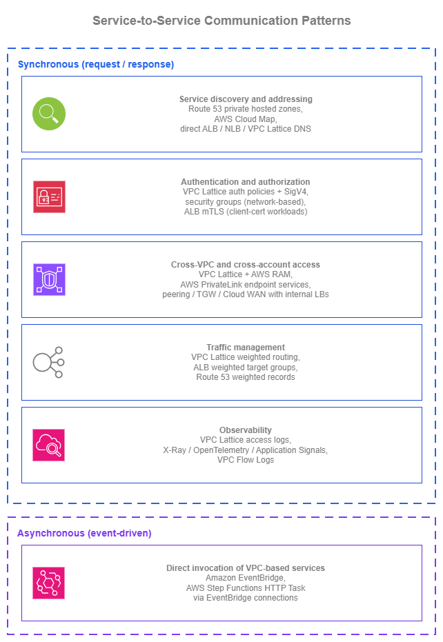
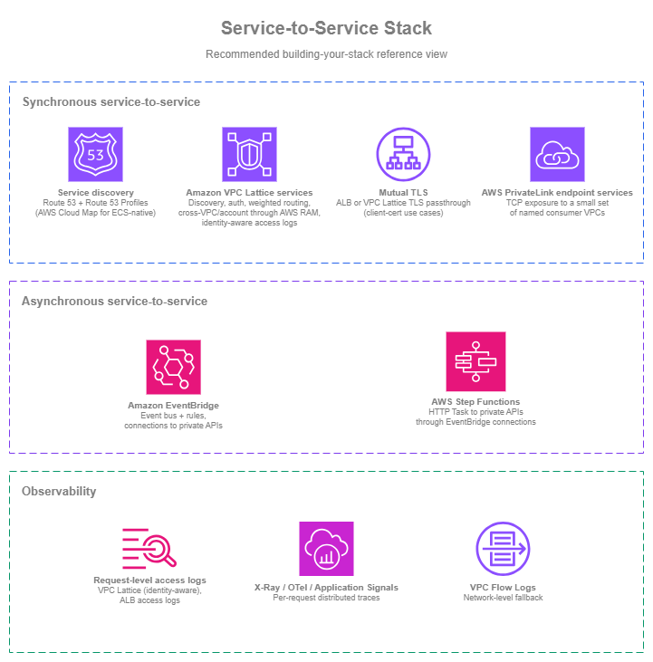

# サービス間通信 {#service-to-service}

!!! info "前提条件"
    このセクションでは、[Amazon VPC](../foundation/vpc.md)、[サブネット](../foundation/subnets.md)、[Within AWS](../connectivity/within-aws.md) ページの接続パターン（特に Amazon VPC Lattice）、および [ロードバランシング](load-balancing.md) ページに精通していることを前提としています。サービス間通信は、これらの基本要素の上に構築されます。

AWS におけるサービス間通信は、5 つのアーキテクチャ上の関心事にまたがります。ディスカバリ（コンシューマーが Route 53 プライベートホストゾーンまたは Amazon VPC Lattice DNS を通じてプロバイダーを見つける方法）、認証（VPC Lattice 認証ポリシーを使用した IAM ベースの SigV4 署名、または ALB 上の相互 TLS）、クロス VPC アクセス（CIDR 調整なしに RAM 経由で共有される VPC Lattice サービスネットワーク、または TCP 向け PrivateLink エンドポイントサービス）、トラフィック管理（VPC Lattice の重み付きルーティングによる DNS TTL の数分ではなく数秒でのターゲットグループ間のトラフィックシフト）、そしてオブザーバビリティ（すべてのリクエストに呼び出し元 ID と認証決定を含む VPC Lattice アクセスログ）です。重要な問いは「ALB か NLB か？」ではなく、「コンシューマーはどのようにプロバイダーを見つけるか？」「サービスはどのように互いを認証するか？」「新しいバージョンを安全にデプロイするにはどうすればよいか？」です。

このページは**パターン優先**で構成されています。以下の各パターンには複数の AWS サポートオプションがあり、適切な選択はアーキテクチャ全体によって異なります。ページ全体を通じて念頭に置くべき問いは、**ネットワーキングレイヤーをどの程度自分で管理したいか？** です。

各パターンのオプションは、個々のビルディングブロック（Amazon Route 53、AWS PrivateLink、ALB / NLB、IAM、CloudWatch、AWS WAF）から組み立てることができ、その場合はアプリケーションまたはプラットフォームチームがインテグレーションを担います。*あるいは* [Amazon VPC Lattice](https://docs.aws.amazon.com/vpc-lattice/latest/ug/what-is-vpc-lattice.html) を通じてカバーすることもでき、こちらはディスカバリ、認証、クロス VPC アクセス、トラフィック管理、オブザーバビリティを、接続性を抽象化した単一のマネージドアプリケーションネットワーキングレイヤーに統合します。どちらのアプローチも有効です。

Amazon VPC Lattice の接続側の詳細な解説（サービスネットワーク、アソシエーションモデル、ネットワークチーム側のベストプラクティス）は [Within AWS](../connectivity/within-aws.md) ページにあります。このページでは、アプリケーションチームがパターンをどのように*使用するか*に焦点を当てています。

/// caption
サービス間通信パターン — [Drawio ソース](../assets/application-networking/s2s-patterns.drawio)
///

## 同期サービス間パターン {#synchronous-service-to-service-patterns}

同期サービス間通信（サービスがリクエストを送信し、レスポンスを待機する方式）は、一般的なワークロードにおいて最も多く見られるサービス間インタラクションの形態です。以下のパターンは、設計上で繰り返し浮上する問いに対応しています。コンシューマーがプロバイダーを見つける方法、双方が認証を行う方法、VPC やアカウントの境界をまたいで呼び出しを行う方法、新バージョンを安全にロールアウトする方法、そしてオペレーターが状況を把握する方法です。

### サービスディスカバリーとアドレッシング {#service-discovery-and-addressing}

ハードコードされた IP アドレスは、実際の環境では通用しません。ターゲットはスケールし、インスタンスは入れ替わり、アベイラビリティーゾーンは障害を起こし、名前の背後にあるサービスは移行することがあります。サービスディスカバリーは 2 つの問いに答えます。サービス名が与えられたとき、コンシューマーが今すぐ使うべきアドレスはどれか、そして実装が変わっても名前を安定させるにはどうすればよいか、という問いです。

AWS における正しいパターンは、以下のどのオプションを選択するかにかかわらず、**常に Amazon Route 53 レコードでコンシューマー向けの名前を抽象化する**ことです。アプリケーションは `payments.internal.example.com` を呼び出し、ロードバランサーの DNS 名や Amazon VPC Lattice のマネージド DNS 名を直接呼び出すことはありません。Route 53 エイリアスレコードは、フレンドリーな名前を現在サービスを支えているもの（内部 ALB、NLB、Amazon VPC Lattice サービス、EC2 インスタンス）に解決します。実装を変更する際は Route 53 レコードの変更だけで済み、コンシューマー側での調整作業は不要です。

| オプション | 使用する場面 |
| --- | --- |
| **Amazon Route 53 プライベートホストゾーンとエイリアスレコード** | アプリケーションコードがフレンドリーな内部名（`payments.internal.example.com`）を呼び出し、Route 53 エイリアスレコードが現在のバッキングターゲットに解決する場合。エイリアスレコードは内部 ALB、NLB、Amazon VPC Lattice サービスに対してファーストクラスのサポートを提供します。実装が移行しても（EC2 から ECS へ、AWS PrivateLink エンドポイントサービスから Amazon VPC Lattice サービスへ）、変更するのはエイリアスレコードのみで、アプリケーションコードには手を加えません。単一の内部 DNS コントロールプレーンとして、アカウントをまたいで所有・共有できます。 |
| **AWS Cloud Map** | ディスカバリーレイヤーにカスタム属性フィルタリング（デプロイメントステージ、キャパシティ、カラー）を持つサービスインスタンスレジストリが必要な場合、または Amazon ECS サービスディスカバリーのタスクごとの自動登録を使用している場合。ECS はタスクの IP を AWS Cloud Map に自動的に登録・登録解除します。コンシューマーはサービス名（DNS）でクエリするか、属性（API）でフィルタリングできます。ECS 以外かつ属性フィルタリングが不要なケースでは、Route 53 プライベートホストゾーンの方がシンプルです。 |
| **ALB、NLB、または Amazon VPC Lattice サービスへの直接 DNS** | コンシューマーが AWS 割り当ての DNS 名（`internal-foo-1234.elb.us-east-1.amazonaws.com` や `my-service.7d67968.vpc-lattice-svcs.us-east-1.on.aws`）を直接呼び出せる、単一チーム・単一 VPC のシンプルな構成。機能はしますが、コンシューマーをプロバイダーの特定のインスタンスに結びつけてしまいます。ワークロードが成長したら Route 53 エイリアスに昇格させてください。 |

#### プライベートホストゾーンをスケールで管理する {#manage-private-hosted-zones-at-scale}

[Amazon Route 53 Profiles](https://docs.aws.amazon.com/Route53/latest/DeveloperGuide/profiles.html) は、プライベートホストゾーン、Resolver フォワーディングルール、DNS Firewall ルールグループを 1 つの共有可能なオブジェクトにまとめ、AWS RAM を通じて配布します。Profiles はネットワークアカウントまたはプラットフォームアカウントに置かれ、組織全体のコンシューマー VPC に共有されます。

マルチアカウント環境でスケールして運用する際の主な決定事項は、**Profile が参照するプライベートホストゾーンをどこに置くか、そして誰がゾーンを追加できるか**です。

| 所有モデル | プライベートホストゾーンの置き場所 | アプリケーションチームがレコードを追加する方法 |
| --- | --- | --- |
| **集中管理** | ネットワークアカウントまたはプラットフォームアカウントが、Profile から参照されるすべてのプライベートホストゾーンを所有する。 | 中央の IaC リポジトリへの PR、Service Catalog プロダクト、または中央アカウントへの権限を絞った委任 IAM ロールを通じて行う。 |
| **分散管理** | 各アプリケーションチームが自身のアカウントにプライベートホストゾーンを所有する。プラットフォームチームは管理権限（細かい制御）を持つ Profile をそれらのアプリケーションアカウントに共有し、チームが自分のゾーンを追加できるようにする。 | 各チームが自分のゾーンを直接管理し、Profile に追加する。 |

多くの環境は**ハイブリッド**に落ち着きます。横断的なインフラ向けのプラットフォーム所有ゾーン（`aws.internal`、`db.internal`）と、ビジネスドメインごとのチーム所有ゾーン（`payments.app.internal`、`inventory.app.internal`）を組み合わせ、すべてを 1 つ（または少数）の中央管理 Profile から参照し、読み取り専用の共有を通じて VPC から利用する形です。

#### サービスディスカバリーのベストプラクティス {#service-discovery-best-practices}

* **Amazon Route 53 Profiles を使用して、プライベートホストゾーン、Resolver フォワーディングルール、DNS Firewall ルールグループをマルチアカウント環境全体に配布する**。OU レベルで共有することで、新しいアカウントが自動的に設定を継承します。Profiles がなければ、マルチアカウント DNS はカスタムのクロスアカウント関連付け自動化が必要になりますが、Profiles を使えばファーストクラスの操作として実現できます。
* **プライベートホストゾーンの所有を集中管理にするか分散管理にするか（またはその組み合わせにするか）を意図的に決定する**。組織の運営方法に基づいて判断してください。アプリケーションチームへの委任変更パスを持つプラットフォーム所有か、共有管理 Profile を通じたプラットフォーム集約を持つチーム所有かを選択します。
* **ロードバランサーと Amazon VPC Lattice サービスには常に Route 53 エイリアスレコードを前置する**。エイリアスレコードは ALB、NLB、Amazon VPC Lattice サービスに対してファーストクラスのサポートを提供し、余分な CNAME ホップなしに AWS DNS 解決時に解決され、Route 53 ホストゾーン内では無料です。エイリアスにより、コンシューマーに気づかれることなく実装を変更できます。
* **AWS Cloud Map はそのユースケースがワークロードに合致する場合にのみ使用する**。Amazon ECS サービスディスカバリーのタスクごとの自動登録、または属性フィルタリングによるディスカバリー（`deployment_color = blue`）が該当します。それ以外のケースでは Route 53 の方がシンプルです。
* **アプリケーションコードにハードコードされた IP アドレスや、ロードバランサーや Amazon VPC Lattice の DNS 名を直接記述することを避ける**。どちらもコンシューマーをプロバイダーの特定のインスタンスに結びつけてしまいます。Route 53 エイリアスによる間接参照こそが、あらゆる変更を安全にする仕組みです。

#### サービスディスカバリーのドキュメント {#service-discovery-documentation}

*   :material-file-document: **Amazon Route 53 プライベートホストゾーン**

    ---

    1 つ以上の VPC 内の内部 DNS 権威ネームサービス。AWS リソースへのエイリアスレコードを含みます。

    [:octicons-arrow-right-24: ドキュメント](https://docs.aws.amazon.com/Route53/latest/DeveloperGuide/hosted-zones-private.html)

*   :material-file-document: **Amazon Route 53 エイリアスレコード**

    ---

    余分な DNS ホップなしに AWS リソース（ALB、NLB、Amazon VPC Lattice サービス、CloudFront、S3）に解決するファーストクラスのレコード。

    [:octicons-arrow-right-24: ドキュメント](https://docs.aws.amazon.com/Route53/latest/DeveloperGuide/resource-record-sets-choosing-alias-non-alias.html)

*   :material-file-document: **Amazon Route 53 Profiles**

    ---

    プライベートホストゾーン、Resolver フォワーディングルール、DNS Firewall ルールグループを 1 つの共有可能なオブジェクトにまとめ、AWS RAM を通じてマルチアカウント環境に配布します。

    [:octicons-arrow-right-24: ドキュメント](https://docs.aws.amazon.com/Route53/latest/DeveloperGuide/profiles.html)

*   :material-file-document: **AWS Cloud Map**

    ---

    DNS および API ディスカバリー、カスタム属性、Amazon ECS サービスディスカバリー統合を備えたサービスインスタンスレジストリ。

    [:octicons-arrow-right-24: ドキュメント](https://docs.aws.amazon.com/cloud-map/latest/dg/what-is-cloud-map.html)

*   :material-file-document: **Amazon ECS サービスディスカバリー**

    ---

    ネイティブなコンテナサービスディスカバリーのために、Amazon ECS サービスをタスクごとに AWS Cloud Map へ自動登録します。

    [:octicons-arrow-right-24: ドキュメント](https://docs.aws.amazon.com/AmazonECS/latest/developerguide/service-discovery.html)

### リクエストの認証と認可 {#request-authentication-and-authorization}

リクエストに応答するサービスは 2 つのことを知る必要があります。誰が呼び出しているか、そしてその呼び出し元が呼び出しを許可されているかです。従来のネットワークアプローチ（セキュリティグループとヘッダー内の共有シークレット）は小規模な環境では機能しますが、サービスがチーム、VPC、アカウントをまたぐようになるとスケールしなくなります。以下のオプションは、**何を**認証するか（ネットワークソース、暗号化 ID、アプリケーションが提示する証明書）と、**どれだけの認証コントロールプレーンを自分で運用するか**という点で異なります。

| オプション | 認証対象 | 運用するもの |
| --- | --- | --- |
| **Amazon VPC Lattice 認証ポリシー + AWS SigV4 / SigV4A** | 呼び出し元の IAM アイデンティティ（EC2 インスタンスプロファイル、Amazon ECS タスクロール、Amazon EKS ポッド IAM ロール、Lambda 実行ロール）。各コンシューマーは自身のロールでリクエストに署名し、Amazon VPC Lattice はサービスの認証ポリシーに対してリクエストを評価し、許可または拒否します。呼び出し元のアイデンティティはアクセスログに記録されます。 | 各 Amazon VPC Lattice サービスの IAM ベースのポリシー。署名はコンシューマー側の AWS SDK で行われるため、ローテーションが必要な共有シークレットはありません。 |
| **セキュリティグループ + プライベート接続（ネットワークベースの認証）** | サービスに到達できるネットワークソース（通常はセキュリティグループ識別子または CIDR）。リクエストに署名できない TCP サービスに必要であり、コンシューマーが IP ベースのアクセスしか知らないレガシーワークロードに適した答えです。 | コンシューマーとプロバイダーのすべてのペアにおけるセキュリティグループルール。セキュリティグループは「誰が呼び出せるか」ではなく「何が呼び出せるか」に答えます。同じセキュリティグループ識別子で実行されている異なるアプリケーションは区別できません。 |
| **相互 TLS（mTLS）** | TLS ハンドシェイク中に提示されるクライアント X.509 証明書。Application Load Balancer（ALB は TLS を終端し、`passthrough` または `verify` モードでクライアント証明書を検証）と Amazon VPC Lattice TLS パススルーリスナー（Amazon VPC Lattice は TLS を終端せずに SNI で暗号化フローをルーティングし、その背後のアプリケーションまたはロードバランサーが mTLS を終端）で利用可能。Amazon VPC Lattice TLS パススルーパスはエンドツーエンドの暗号化を維持しますが、そのリスナーでは認証ポリシーが匿名プリンシパルに制限されます。 | クライアント証明書のライフサイクル（発行、ローテーション、失効）。スケールすると実際の運用オーバーヘッドが発生しますが、B2B 統合、IoT、mTLS が契約またはコンプライアンス要件であるワークロードには適切な選択です。 |
| **共有 API キー、ベアラートークン、HTTP 基本認証** | ヘッダー内の静的シークレット。手動でローテーションする 1 つのシークレットに信頼を集中させます。 | 手動によるローテーション、配布、失効。IAM 署名リクエストが選択肢にある環境では、サービス間通信に使用することを避けてください。 |

4 つのオプションはきれいに重ね合わせることができます。セキュリティグループは*何があなたに到達できるか*を制御し、Amazon VPC Lattice 認証ポリシーは*どの IAM アイデンティティがあなたを呼び出せるか*を制御し、mTLS（ALB 上または Amazon VPC Lattice TLS パススルーを通じて）は*どのクライアント証明書が提示されるか*を制御します。これらは互いを置き換えるものではありません。問いは、どの組み合わせがワークロードに合致するかです。

#### 認証と認可のベストプラクティス {#authentication-and-authorization-best-practices}

* **コンシューマーが可能な限り、サービス間リクエストを AWS SigV4 / SigV4A で署名する**。EC2、Amazon ECS、Amazon EKS、Lambda 上の AWS SDK は、コンシューマーが IAM ロールで実行されている場合に自動的に署名します。
* **コンシューマーのアイデンティティにはエンドツーエンドで IAM ロールを使用する**。EC2 インスタンスプロファイル、Amazon ECS タスクロール、Amazon EKS ポッド IAM ロール（IAM Roles for Service Accounts または Amazon EKS Pod Identity を通じて）、Lambda 実行ロールを使用します。共有 IAM ユーザーや共有認証情報は避けてください。CloudTrail と Amazon VPC Lattice アクセスログの監査証跡は、各呼び出し元が独自のロールを持っている場合にのみ有用です。
* **多層防御のために、ネットワークベースの認証とアイデンティティベースの認証を組み合わせる**（代替としてではなく）。セキュリティグループはサービスまたはサービスネットワークに到達できるネットワークソースを制限し、アイデンティティベースの認証はサービスを呼び出せるプリンシパルを強制します。セキュリティグループの設定ミスがあっても、アイデンティティベースの認証がゲートとして機能します。認証ポリシーの設定ミスがあっても、ネットワークソースの制限が残ります。2 つのレイヤーにより、単一の設定ミスによる影響範囲を縮小できます。
* **別の認証メカニズムではなく、サービスサーフェスに合ったアイデンティティ評価ポイントを選択する**。SigV4 署名リクエストと IAM アイデンティティは、AWS サービス間トラフィック全体で一貫したアイデンティティベースのメカニズムです。評価ポイントは、コンシューミングサービスの前に何があるかによって異なります。

  | サービスサーフェス | アイデンティティ評価ポイント |
  | --- | --- |
  | Amazon VPC Lattice サービス | サービスまたはサービスネットワークの認証ポリシー（SigV4 署名リクエストを評価）。 |
  | Amazon API Gateway REST または HTTP API | IAM オーソライザー（SigV4 署名リクエストを評価）。 |
  | AWS サービスへの直接呼び出し（DynamoDB、S3、KMS など） | AWS SDK が SigV4 で署名し、AWS サービスが IAM に対して評価する。 |
  | AWS AppSync、IAM 認証を持つ AWS ネイティブ API | 同じ SigV4 + IAM メカニズムで、サービスで評価される。 |

* **mTLS は契約上本当に必要な場合にのみ使用する**。名前付きクライアントとの B2B 統合、アイデンティティとして証明書を提示する IoT デバイス、または mTLS を義務付けるコンプライアンス基準が該当します。クライアント証明書のライフサイクルはいずれの場合も実際の作業を伴います。一般的なサービス間パターンとして mTLS を選ぶことは避けてください。
* **サービス間通信に共有 API キー、ベアラートークン、HTTP 基本認証を使用しない**。これらはローテーション時に脆弱で、呼び出し元ごとの監査が困難であり、IAM 署名の代替手段は認証情報のライフサイクルを IAM で管理しながら同じ問題を解決します。
* **コンシューマーがリクエストに署名するよう更新されるまでは、リクエストがすでに持っている情報に一致する条件（ソース VPC、HTTP メソッド、パス、ヘッダー）で Amazon VPC Lattice 認証ポリシーを記述する**。これにより、アプリケーションの変更を待たずに、アクセスログ、明示的な許可/拒否の決定、機能するコントロールプレーンをすぐに得られます。コンシューマーが署名を採用するにつれて、プリンシパルベースの条件に絞り込んでいきます。

#### 認証と認可のドキュメント {#authentication-and-authorization-documentation}

*   :material-file-document: **Amazon VPC Lattice 認証ポリシー**

    ---

    サービスレベルの IAM ベースのアクセス制御。プリンシパル、条件、リクエスト属性、SigV4 / SigV4A 署名を含みます。

    [:octicons-arrow-right-24: ドキュメント](https://docs.aws.amazon.com/vpc-lattice/latest/ug/auth-policies.html)

*   :material-file-document: **AWS Signature Version 4（SigV4）**

    ---

    SDK クライアントが API 呼び出しと Amazon VPC Lattice サービスリクエストを IAM アイデンティティで認証するために使用する AWS リクエスト署名標準。

    [:octicons-arrow-right-24: ドキュメント](https://docs.aws.amazon.com/IAM/latest/UserGuide/reference_sigv-create-signed-request.html)

*   :material-file-document: **Application Load Balancer 相互 TLS**

    ---

    ALB 上のクライアント X.509 証明書認証。`passthrough` および `verify` モードを提供します。

    [:octicons-arrow-right-24: ドキュメント](https://docs.aws.amazon.com/elasticloadbalancing/latest/application/mutual-authentication.html)

*   :material-file-document: **Amazon VPC Lattice TLS パススルーリスナー**

    ---

    Amazon VPC Lattice で TLS を終端せずに SNI ベースで TLS および mTLS トラフィックをルーティングし、アプリケーションへのエンドツーエンドの暗号化を維持します。

    [:octicons-arrow-right-24: ドキュメント](https://docs.aws.amazon.com/vpc-lattice/latest/ug/tls-listeners.html)

*   :material-file-document: **VPC セキュリティグループ**

    ---

    ENI、ALB、NLB、Amazon VPC Lattice サービスネットワーク関連付けのネットワークレベルのアクセス制御。

    [:octicons-arrow-right-24: ドキュメント](https://docs.aws.amazon.com/vpc/latest/userguide/vpc-security-groups.html)

### 安全なデプロイのためのトラフィック管理 {#traffic-management-for-safe-deployments}

コンシューマーを中断させることなくサービスの新バージョンをリリースすることは、サービス間アーキテクチャの繰り返し行われるテストの 1 つです。ネットワーキングレイヤーに任せれば、その大部分を担うことができます。新バージョンへのトラフィックの小さな割合をシフトし、観察し、増やし、繰り返します。以下のオプションは、トラフィックシフトの決定が**どこで**行われるか、そして**どれだけ速く**効果が現れるかという点で異なります。

| オプション | シフトが行われる場所 | 変更の速度 |
| --- | --- | --- |
| **Amazon VPC Lattice 重み付きルーティング** | Amazon VPC Lattice サービス内、ターゲットグループをまたいで。重みは混在したコンピュートタイプにルーティングできます。EC2、Amazon ECS、Amazon EKS、Lambda は異なるターゲットグループを通じて同じ Amazon VPC Lattice サービスをバックエンドにできます。 | 秒単位。Amazon VPC Lattice サービスの重み付きルーティング変更がトラフィックをシフトします。DNS TTL は関係しません。 |
| **ALB 重み付きターゲットグループ** | ALB リスナールール内、その ALB の背後にあるターゲットグループをまたいで。同じリスナールール内のシフトですが、異なるロードバランサーです。 | 秒単位。リスナールールの変更は素早く伝播します。 |
| **Route 53 重み付きレコード** | DNS レイヤーで、DNS エンドポイントをまたいで。ワークロードが実際にロードバランシングレイヤーで統合できないエンドポイントをまたいで存在する場合に適しています（マルチリージョンのアクティブ-アクティブ、ALB から VPC Lattice への移行）。 | 低速。コンシューマーの DNS TTL に依存します。リージョン内のサービス間トラフィックには適していません。 |

#### トラフィック管理のベストプラクティス {#traffic-management-best-practices}

* **トラフィックは DNS レイヤーではなく、ロードバランシングレイヤーでシフトする**。Amazon VPC Lattice 重み付きルーティングと ALB 重み付きターゲットグループは秒単位でトラフィック分散を変更しますが、DNS ベースのシフトはすべてのコンシューマーの TTL が期限切れになるまで待つ必要があります。
* **重み付きルーティングはバージョンリリースだけでなく、コンピュートの移行にも使用する**。ワークロードを EC2 から Amazon ECS へ、または Amazon ECS から Lambda へ移行する場合、1 つのサービス内の Amazon VPC Lattice の重みを使って実現できます（コンシューマー側の変更は不要）。
* **重み付きルーティングをヘルスチェックとオブザーバビリティと組み合わせる**。これにより、不良な新バージョンのエラーレートが上昇したときに自動的に重みが減少（またはロールバック）されます。ターゲットグループごとのヘルスチェックとアクセスログがシグナルを提供し、新しいターゲットグループの CloudWatch アラームがループを閉じます。
* **Route 53 重み付きレコードは、ロードバランシングレイヤーで統合できない DNS エンドポイントをまたぐ場合にのみ使用する**。通常はマルチリージョンのアクティブ-アクティブが該当します。ソリューション間の移行（ALB から VPC Lattice）の際にもこのオプションを使用します。

#### トラフィック管理のドキュメント {#traffic-management-documentation}

*   :material-file-document: **Amazon VPC Lattice リスナールールと重み付きターゲットグループ**

    ---

    コンピュートタイプをまたいだ、Amazon VPC Lattice サービス内のターゲットグループへの重み付きルーティング。

    [:octicons-arrow-right-24: ドキュメント](https://docs.aws.amazon.com/vpc-lattice/latest/ug/listeners.html)

*   :material-file-document: **ALB 重み付きターゲットグループ**

    ---

    ブルー/グリーンおよびカナリアデプロイのための ALB リスナールール内の重み付きルーティング。

    [:octicons-arrow-right-24: ドキュメント](https://docs.aws.amazon.com/elasticloadbalancing/latest/application/lb-target-group-weights.html)

*   :material-file-document: **Route 53 重み付きルーティング**

    ---

    エンドポイントをまたいだ DNS レイヤーの重み付きルーティング。単一のロードバランサーがすべてのターゲットをカバーできないクロスリージョンまたはクロスプラットフォームのシフトに適しています。

    [:octicons-arrow-right-24: ドキュメント](https://docs.aws.amazon.com/Route53/latest/DeveloperGuide/routing-policy-weighted.html)

### サービス間トラフィックのオブザーバビリティ {#observability-for-service-to-service-traffic}

サービス間トラフィックはデフォルトではオペレーターから見えません。すべての内部リクエストが記録される中央の場所は存在しません。オブザーバビリティが重要なのは、サービス間のインシデントは通常「サービス A が失敗しているが、どのダウンストリーム呼び出しが原因かわからない」という状況から始まるためです。

シグナルの 3 つのレイヤーは、**ネットワークレベル**（接続が許可され、完了したか）、**リクエストレベル**（リクエスト、レスポンス、レイテンシー、そしてフロントドアが IAM を評価する場合は呼び出し元プリンシパルを含むリクエストごとのログ）、**アプリケーションレベル**（このユーザー向け操作のコールグラフはどのようなもので、レイテンシーはどこにあったか）です。各レイヤーは異なる問いに答えるため、健全なサービス間環境では 3 つすべてを使用します。

| レイヤー | ソース | わかること |
| --- | --- | --- |
| **ネットワークレベル** | VPC Flow Logs | IP レベルの接続が許可されたか、どれだけのデータが流れたか。セキュリティグループ / NACL のデバッグに有用ですが、アイデンティティやリクエストのセマンティクスは表示されません。 |
| **リクエストレベル** | Amazon VPC Lattice アクセスログ（アイデンティティ対応）、[Application Load Balancer アクセスログ](https://docs.aws.amazon.com/elasticloadbalancing/latest/application/load-balancer-access-logs.html) | ソース、宛先、レイテンシー、レスポンスコード、タイムスタンプを含むリクエストごとのログ。Amazon VPC Lattice アクセスログにはさらにソース IAM プリンシパルと認証ポリシーの決定が含まれますが、ALB アクセスログには含まれません（フロントドアは IAM を評価しません）。サービス間インシデントを特定のリクエストに、そして（Amazon VPC Lattice パスの場合）特定の呼び出し元と認可結果にマッピングするシグナルです。 |
| **アプリケーションレベル** | AWS X-Ray、OpenTelemetry、[Application Signals](https://docs.aws.amazon.com/AmazonCloudWatch/latest/monitoring/CloudWatch-Application-Signals.html) | サービス境界をまたいだ分散トレース。リクエストごとのコールグラフとレイテンシーバジェット。「時間はどこで費やされ、なぜか」の分析に有用です。 |

#### オブザーバビリティのベストプラクティス {#observability-best-practices}

* **トラフィックがロードバランサーやトランジットネットワークのプラミングを通過する場合は、3 つのレイヤーすべてを使用する**。接続デバッグにはネットワークレベル、監査とリクエストごとのトリアージにはリクエストレベル、レイテンシーとコールグラフ分析にはアプリケーションレベルのトレースを使用します。**Amazon VPC Lattice トラフィックの場合、ネットワークレベルのログはオプションです**。トラフィックは Amazon VPC Lattice データプレーンを通じてコンシューマーとプロバイダーの VPC 間を直接流れるため、VPC Flow Logs は Transit Gateway、AWS Cloud WAN、またはピアリングを経由するトラフィックほどの価値を追加しません。一般的な VPC オブザーバビリティのために有効にしておくことは推奨しますが、リクエストレベルとアプリケーションレベルのレイヤーが運用上の主役です。
* **すべてのサービスネットワークで初日から Amazon VPC Lattice アクセスログを有効にし**、内部サービスの前に置かれたロードバランサーには **ALB アクセスログを有効にする**。どちらも提供する可視性に対して安価であり、インシデント後に必要になってから再作成することは困難です。
* **ネットワークレベルだけでなく、サービスレベルのインストルメンテーションを使用する**。分散トレースと Application Signals は、アクセスログだけでは得られないコールグラフとレイテンシーバジェットを提供します。この 2 つを組み合わせることが、運用上健全なサービス間トラフィックの基盤です。
* **VPC Flow Logs はプライマリシグナルではなく、デバッグのフォールバックとして扱う**。「接続が宛先 IP に到達しているか」のデバッグには有用ですが、アプリケーション対応のオブザーバビリティの代替にはなりません。

#### オブザーバビリティのドキュメント {#observability-documentation}

*   :material-file-document: **Amazon VPC Lattice アクセスログ**

    ---

    認証ポリシーの決定を含む、Amazon S3、Amazon CloudWatch Logs、または Amazon Data Firehose へのリクエストごとのアクセスログ。

    [:octicons-arrow-right-24: ドキュメント](https://docs.aws.amazon.com/vpc-lattice/latest/ug/monitoring-access-logs.html)

*   :material-file-document: **Application Load Balancer アクセスログ**

    ---

    クライアント IP、リクエスト、レスポンスコード、レイテンシー、ターゲットの詳細を含む Amazon S3 へのリクエストごとのアクセスログ。

    [:octicons-arrow-right-24: ドキュメント](https://docs.aws.amazon.com/elasticloadbalancing/latest/application/load-balancer-access-logs.html)

*   :material-file-document: **AWS X-Ray**

    ---

    リクエストごとのコールグラフ分析を備えた、サービス境界をまたいだ分散トレーシング。

    [:octicons-arrow-right-24: ドキュメント](https://docs.aws.amazon.com/xray/latest/devguide/aws-xray.html)

*   :material-file-document: **Amazon CloudWatch Application Signals**

    ---

    組み込みのサービスマップ、リクエストレート、レイテンシー、エラーメトリクスを備えたサービスレベルモニタリング。

    [:octicons-arrow-right-24: ドキュメント](https://docs.aws.amazon.com/AmazonCloudWatch/latest/monitoring/CloudWatch-Application-Signals.html)

*   :material-file-document: **VPC Flow Logs**

    ---

    Amazon S3 および Amazon CloudWatch Logs で利用可能な、ENI、サブネット、VPC のネットワークレベルのトラフィックキャプチャ。

    [:octicons-arrow-right-24: ドキュメント](https://docs.aws.amazon.com/vpc/latest/userguide/flow-logs.html)

### クロス VPC およびクロスアカウントのサービスアクセス {#cross-vpc-and-cross-account-service-access}

単一 VPC 内での同期サービス間通信は簡単です。VPC とアカウントの境界をまたぐ場合、運用モデルを形作る問いは「どの接続オプションを選ぶか」（それは [Within AWS](../connectivity/within-aws.md) ページの問いです）ではなく、**クロスアカウント接続がどれだけサービスにバンドルされているか**です。

Amazon VPC Lattice サービスは、クロス VPC およびクロスアカウントのネットワーキングをサービスと*一緒に*提供します。サービスネットワークの AWS RAM 共有により、コンシューマー VPC は VPC ピアリング、AWS Transit Gateway、AWS Cloud WAN、CIDR の調整なしに到達可能性を得られます。アプリケーションチームがサービスを公開すると、接続性は公開されるものの一部になります。

[AWS PrivateLink エンドポイントサービス](https://docs.aws.amazon.com/vpc/latest/privatelink/configure-endpoint-service.html)も、ピアリングや CIDR の調整なしにクロス VPC およびクロスアカウントの到達性を解決しますが、ペアごとの構成として実現します。プロバイダーは NLB とエンドポイントサービスをデプロイし、各コンシューマーは自身の VPC にインターフェイス VPC エンドポイントを作成し、プロバイダーが接続を承認します。これは少数の名前付きコンシューマー VPC に対してはきれいに機能しますが、「多数のプロバイダー、多数のコンシューマー、多数の環境」が何百ものエンドポイント接続の管理に変わると、スケールしなくなります。AWS PrivateLink エンドポイントサービスは、ワークロードの形が本当に「少数のコンシューマーに公開される 1 つの TCP サービス」である場合に使用してください。スケールでの一般的なサービス間トラフィックには、Amazon VPC Lattice サービスの方が適しています。

残りのオプション（VPC ピアリング、AWS Transit Gateway、AWS Cloud WAN）は接続プリミティブであり、サービス公開プリミティブではありません。アプリケーションチームは内部 ALB または NLB を通じてサービスを公開し、コンシューマーの VPC が基盤となる接続を通じてプロバイダーの VPC への IP ルーティングを持つことに依存し、認証とオブザーバビリティは別途レイヤーとして追加します。

| アーキテクチャ | サービスにバンドルされているもの | 別途運用するもの |
| --- | --- | --- |
| **Amazon VPC Lattice サービス + AWS RAM 共有** | クロス VPC およびクロスアカウントの到達性、サービスディスカバリー、IAM ベースの認証ポリシー、重み付きルーティング、アクセスログ。CIDR は重複可能で、ピアリングやトランジットゲートウェイは不要。 | Amazon VPC Lattice サービスネットワーク設計自体（サービスごとの作業ではなく、共有プラットフォームインフラです）。 |
| **AWS PrivateLink エンドポイントサービス** | ピアリングなしのクロス VPC およびクロスアカウントの TCP 到達性。コンシューマーごとのエンドポイント接続。 | プロバイダー VPC の NLB、エンドポイントサービス、コンシューマーごとのインターフェイス VPC エンドポイント、および新しいコンシューマーごとの接続承認プロセス。コンシューマー VPC の数に比例してスケールします。 |
| **既存の接続上の内部 ALB / NLB** | アプリケーションチームが所有するロードバランサー。 | 接続レイヤー（VPC ピアリング、AWS Transit Gateway、AWS Cloud WAN）、認証レイヤー（セキュリティグループ、アプリケーションまたは別のフロントドアサービスでの IAM）、オブザーバビリティレイヤー（アクセスログ、トレース）。 |

これらのオプションの接続側の説明は [Within AWS](../connectivity/within-aws.md) ページにあります。

## 非同期サービス間パターン {#asynchronous-service-to-service-patterns}

サービス間のやり取りがすべてリクエスト/レスポンス型である必要はありません。運用上最も健全なパターンの多くは非同期です。プロデューサーはイベントやメッセージを発行して次の処理に進み、コンシューマーは準備ができたときに反応します。非同期通信はバッファリングによってトラフィックのスパイクを吸収し、プロデューサーとコンシューマー間のデプロイサイクルを分離し、遅い下流の呼び出しが上流の呼び出し元をブロックする同期的な障害モードを排除します。

このページはイベント駆動アーキテクチャのガイドではなく、*ネットワーキング*のベストプラクティスガイドです。非同期の主要な構成要素([Amazon EventBridge](https://docs.aws.amazon.com/eventbridge/latest/userguide/eb-what-is.html)、[Amazon SNS](https://docs.aws.amazon.com/sns/latest/dg/welcome.html)、[Amazon SQS](https://docs.aws.amazon.com/AWSSimpleQueueService/latest/SQSDeveloperGuide/welcome.html)、[Amazon Kinesis](https://docs.aws.amazon.com/streams/latest/dev/introduction.html)、[AWS Step Functions](https://docs.aws.amazon.com/step-functions/latest/dg/welcome.html))はそれぞれ独立した AWS サービスであり、固有の詳細なドキュメントがあります。このページで扱うネットワーキングに関連する問いはより限定的です。非同期ワークフローが **VPC 内の同期サービス**(EC2、Amazon ECS、Amazon EKS 上のプライベート API、または内部ロードバランサーの背後にあるサービス)を呼び出す必要がある場合、その呼び出しはどのように行うべきか、という点です。

### 同期より非同期を選ぶ場面 {#when-to-choose-asynchronous-over-synchronous}

次のような場合に非同期パターンを選択してください。

* プロデューサーが同じ実行内でレスポンスを必要としない場合。「注文完了」を発行し、下流の「確認メール送信」サービスに処理を任せるサービスは、ブロックする必要がありません。
* ワークロードの到着レートがスパイク状で、コンシューマーが即座にスケールできない場合。キューがバーストを吸収し、コンシューマーは持続可能なレートで処理します。
* 複数のコンシューマーが同じイベントを必要とする場合。Amazon EventBridge、Amazon SNS、Amazon Kinesis はいずれも、プロデューサーが相手を知ることなく、1 つのイベントを多数のコンシューマーに届けられます。
* 処理が長時間にわたる場合。AWS Step Functions ワークフローは、同期タイムアウトに構造を縛られることなく、リトライ、分岐、人間の承認ステップを含む複数ステップのプロセスをオーケストレーションできます。

非同期通信が常に正解とは限りません。コンシューマーが処理を続けるために結果を必要とする場合(注文の支払い、ログインの検証、設定の取得など)は、リクエスト/レスポンスが適切な形です。健全なアーキテクチャでは、この 2 つのパターンが共存します。

### Amazon EventBridge および AWS Step Functions から VPC ベースのサービスを呼び出す {#calling-vpc-based-services-from-amazon-eventbridge-and-aws-step-functions}

繰り返し挙がるネットワーキングの問いがあります。「非同期プロデューサー(Amazon EventBridge ルール、AWS Step Functions ワークフロー)があり、コンシューマーが EC2、Amazon ECS、または Amazon EKS 上で動作する HTTP サービスです。プロデューサーはどのようにしてプライベートエンドポイントに到達するのか?」

従来の答えは Lambda をリレーとして使う方法でした。Amazon EventBridge ルールが VPC にデプロイされた Lambda 関数を呼び出し、その Lambda がプライベートエンドポイントへ HTTP 呼び出しを行います。この方法は機能しましたが、ネットワーク層を橋渡しするためだけに存在するマネージドコンポーネントが追加され、独自のスケーリング、エラーハンドリング、オブザーバビリティの管理が必要でした。

しかし、**Amazon EventBridge と AWS Step Functions はどちらも、[EventBridge のプライベート API への接続](https://docs.aws.amazon.com/eventbridge/latest/userguide/connection-private.html)を通じて VPC 内のプライベートエンドポイントと直接統合できます**。この統合では、プライベートエンドポイントを表すラッパーとして [Amazon VPC Lattice リソース設定](https://docs.aws.amazon.com/vpc-lattice/latest/ug/resource-configuration.html)を使用します。リソース設定は*任意の*プライベート API を指定できます。コンシューマーサービスが Amazon VPC Lattice を全面的に採用しているかどうかに関わらず、この統合は機能します。リソース設定は非同期プロデューサーとプライベートリソースの間の薄いグルーにすぎません。

EventBridge が接続を作成すると、リソース設定と EventBridge サービス自身が所有する Amazon VPC Lattice サービスネットワーク間のリソースアソシエーションを管理します。そのサービスネットワークを自分で運用する必要はなく、EventBridge が提供します。クロスアカウントもサポートされており、あるアカウントの接続が、プライベート API が実際に存在する別のアカウントのリソース設定をターゲットにできます。

これにより実現できる主な 2 つのパターンを以下に示します。

* **プライベート API ターゲットを持つ Amazon EventBridge ルール**。プロデューサーが Amazon EventBridge バスにイベントを発行し、Amazon EventBridge ルールが一致するイベントを、プライベート API を指すリソース設定への接続を通じてルーティングします。プライベート API は AWS バックボーン経由でイベントペイロードを含む HTTP POST を受信して処理し、プロデューサーはその詳細を意識しません。
* **プライベート API ターゲットを持つ AWS Step Functions HTTP タスク**。AWS Step Functions ステートマシンの HTTP タスクが Amazon EventBridge 接続を使用して、オーケストレーションの一部としてプライベート HTTPS エンドポイントを呼び出します。複数ステップのワークフローが途中でプライベートサービスを同期的に呼び出す必要がある場合(例: 注文フルフィルメントプロセスをオーケストレーションし、処理を続ける前にプライベートな在庫サービスを呼び出す必要があるステートマシン)に使用します。

#### 非同期から同期へのドキュメント {#async-to-sync-documentation}

*   :material-file-document: **Amazon EventBridge のプライベート API ターゲットへの接続**

    ---

    Amazon VPC Lattice リソース設定への接続を通じて、Amazon EventBridge ルールから VPC 内のプライベート API ターゲットを直接呼び出します。

    [:octicons-arrow-right-24: ドキュメント](https://docs.aws.amazon.com/eventbridge/latest/userguide/connection-private.html)

*   :material-file-document: **AWS Step Functions HTTP タスク**

    ---

    Amazon EventBridge 接続を通じたプライベートエンドポイントを含む、AWS Step Functions ワークフローから HTTPS API を呼び出します。

    [:octicons-arrow-right-24: ドキュメント](https://docs.aws.amazon.com/step-functions/latest/dg/call-https-apis.html)

*   :material-file-document: **Amazon VPC Lattice リソース設定**

    ---

    Amazon EventBridge および AWS Step Functions が VPC ベースのサービスに到達するために使用する、プライベートエンドポイント(DNS 名、IP、ARN)のリソース表現です。

    [:octicons-arrow-right-24: ドキュメント](https://docs.aws.amazon.com/vpc-lattice/latest/ug/resource-configuration.html)

## サービス間通信における IPv6 {#ipv6-for-service-to-service-communication}

サービス間トラフィックは、最初からデュアルスタックで構成することを推奨します。このページで紹介するすべての同期パターンは IPv6 をサポートしており、内部トラフィックに IPv6 を採用することで、東西通信における NAT ゲートウェイへの依存(および GB あたりのコスト)を排除できます。

**サービス間通信オプションにおける IPv6 サポートの概要:**

| コンポーネント | IPv6 サポート | 備考 |
| --- | --- | --- |
| **Amazon VPC Lattice** | デュアルスタック(IPv4、IPv6、または両方) | サービスおよびターゲットグループはデュアルスタックをサポート。コンシューマーは NAT なしで IPv6 経由でプロバイダーに到達可能。 |
| **Application Load Balancer** | デュアルスタックおよび IPv6 専用リスナー | 内部 ALB はデュアルスタックをサポート。バックエンドターゲットに IPv6 を使用可能。 |
| **Network Load Balancer** | デュアルスタックおよび IPv6 専用リスナー | 内部 NLB は TCP/UDP/TLS の IPv6 ターゲットをサポート。 |
| **Route 53 プライベートホストゾーン** | AAAA レコード | デュアルスタック ALB および VPC Lattice サービスへのエイリアスレコードは、IPv6 対応コンシューマーに対して IPv6 アドレスを解決。 |
| **AWS PrivateLink** | デュアルスタックインターフェイスエンドポイント | インターフェイス VPC エンドポイントは IPv4 および IPv6 アドレッシングをサポート。 |
| **セキュリティグループ** | IPv4 と IPv6 のルールを個別に設定 | セキュリティグループには明示的な IPv6 ルールが必要。IPv4 ルールは IPv6 トラフィックには適用されない。 |

**デュアルスタックのサービス間通信におけるベストプラクティス:**

* **VPC Lattice サービスをデュアルスタックとして設定する**ことで、IPv6 専用サブネット内のコンシューマーが NAT64 なしで到達できるようになります。これは、ポッドが IPv6 アドレスのみを持つ IPv6 モードで動作する EKS クラスターに特に重要です。
* **Route 53 プライベートホストゾーンのすべての内部サービスに対して、A レコードと並べて AAAA エイリアスレコードを追加する**。IPv6 対応コンシューマーは自動的に AAAA レコードを優先します。
* **すべてのサービスエンドポイントで、両アドレスファミリーに対してセキュリティグループを更新する**。よくある失敗例として、ALB のセキュリティグループがポート 443 で `10.0.0.0/8` を許可しているにもかかわらず IPv6 ルールが存在せず、IPv6 コンシューマーが接続拒否される事例があります。
* **東西トラフィックに IPv6 を使用して NAT ゲートウェイのコストを削減する**。VPC Lattice またはピアリング経由の VPC 間サービス呼び出しは、両側が IPv6 対応であれば NAT を必要としません。これにより、内部トラフィックパスから GB あたりの NAT ゲートウェイ処理料金が排除されます。

***重要なポイント:*** *サービス間通信における IPv6 は、主にコスト最適化を目的としています。東西トラフィックパスから NAT ゲートウェイを排除できます。機能面は IPv4 と同一であり、同じ認証ポリシー、同じ重み付きルーティング、同じアクセスログが利用できます。異なる点は、サービス間の IPv6 トラフィックには NAT 処理料金が発生しないことです。*

## クロス VPC サービスアクセスのコスト考慮事項 {#cost-considerations-for-cross-vpc-service-access}

サービス間接続オプションの選択は、トラフィック量に応じてスケールする重大なコスト上の影響をもたらします。以下の表は、各クロス VPC アクセスパターンのコストモデルを比較したものです。

| パターン | 固定コスト | GB あたりのコスト | コストのスケール要因 |
| --- | --- | --- | --- |
| **Amazon VPC Lattice** | サービスネットワークやサービスに対する時間課金なし | 処理データ量あたりの GB 単価([Lattice 料金](https://aws.amazon.com/vpc/lattice/pricing/)) | リクエスト量とペイロードサイズ |
| **AWS PrivateLink エンドポイントサービス** | AZ ごと・エンドポイントごとの時間課金あり | 処理データ量あたりの GB 単価([PrivateLink 料金](https://aws.amazon.com/privatelink/pricing/)) | コンシューマー VPC 数 × Availability Zone 数、加えてトラフィック量 |
| **Transit Gateway + 内部 ALB/NLB** | アタッチメントごとの時間課金あり([TGW 料金](https://aws.amazon.com/transit-gateway/pricing/)) | TGW データ処理の GB 単価 | アタッチされた VPC 数、加えて TGW を通過するすべてのトラフィック(サービストラフィックに限らない) |
| **VPC Peering + 内部 ALB/NLB** | 無料(時間課金なし、データ処理課金なし) | クロス AZ の場合のみ標準のクロス AZ GB 単価 | クロス AZ トラフィックのみ。同一 AZ は無料 |
| **VPC Lattice + IPv6(NAT なし)** | 時間課金なし | Lattice 処理の GB 単価(NAT 処理課金なし) | リクエスト量。コンシューマー側の NAT Gateway の GB 単価課金を排除 |

**コストが意思決定を左右する場合:**

* **トラフィック量が少なく、コンシューマーが多い場合**: VPC Lattice が有利 — コンシューマーごとの固定コストがなく、GB 単価も競争力があります。
* **トラフィック量が多く、コンシューマーが少ない場合**: VPC Peering + 内部 LB が有利 — データ処理課金がゼロです。トレードオフとして、ピアリング接続の管理と CIDR の重複回避が必要です。
* **トラフィック量・コンシューマー数ともに中程度の場合**: PrivateLink はコンシューマー数が少ない場合にコスト効率が高くなります(トラフィックが少ない場合は AZ ごとの時間課金がコストの大半を占めます)。
* **他のトラフィックのために既に Transit Gateway を運用している場合**: TGW 上でのサービス間通信の追加コストは GB あたりの処理料金のみです — アタッチメントコストはすでに支払い済みです。ただし、TGW がサービス間通信のためだけに存在する場合は、VPC Lattice の方が安価です。

***重要なポイント:*** *最も安価なクロス VPC サービスアクセスパスは、コンシューマー VPC の数とトラフィック量という 2 つの変数によって決まります。VPC Lattice は固定コストがゼロであるため、コンシューマーが多くトラフィックが中程度のパターンで最も安価になります。VPC Peering は処理コストがゼロであるため、トラフィックが多くコンシューマーが少ないパターンで最も安価になります。Transit Gateway の GB 単価課金は、サービス間通信に特化した場合に最もコストが高いオプションとなりますが、他の接続ニーズのためにすでにデプロイされているケースが多いです。*

## サービス間スタックの構築 {#building-your-service-to-service-stack}

サービス間アーキテクチャは、接続性（[Within AWS](../connectivity/within-aws.md) ページで解説）とアプリケーションコードの間に位置するレイヤーです。上記のパターンは個々の AWS サービスを組み合わせて構築することも、Amazon VPC Lattice を単一のマネージドサーフェスとして活用することも可能です。どちらのアプローチも有効であり、多くの環境ではワークロードごとに両者を組み合わせて使用しています。

/// caption
サービス間スタック — [Drawio ソース](../assets/application-networking/s2s-stack.drawio)
///

### 新規環境 {#new-environments}

サービス間通信をゼロから構築する組織は、初日から一貫したスタックを導入できます。

1. **Amazon Route 53 プライベートホストゾーンを中央 DNS コントロールプレーンとして使用**します。ネットワークまたはプラットフォームチームが管理し、Amazon Route 53 Profiles を通じて（AWS RAM で OU レベルで共有）複数のアカウントに配布します。すべての内部サービスはフレンドリーな名前（`payments.internal.example.com`）で公開され、エイリアスレコードが現在のバッキングターゲットに解決されます。アプリケーションコードは、ロードバランサーの DNS 名や Amazon VPC Lattice のマネージド DNS 名を直接呼び出しません。
2. **コンシューマー ID には IAM ロールをエンドツーエンドで使用し、多層防御としてセキュリティグループを組み合わせます**。EC2 インスタンスプロファイル、Amazon ECS タスクロール、Amazon EKS ポッド IAM ロール、Lambda 実行ロールにより、AWS SDK が自動的に SigV4 でリクエストに署名します。ID ベースの認証（Amazon VPC Lattice 認証ポリシー、Amazon API Gateway IAM オーソライザー、AWS SDK 組み込みの SigV4 評価）により、誰が何を呼び出せるかを強制します。セキュリティグループは引き続き、どのネットワークソースがサービスに到達できるかを制御します。この 2 層構造により、単一の設定ミスによる影響範囲を最小化できます。
3. **ネットワークレイヤーをどこまで自分で管理するかをワークロードごとに決定します**。Amazon VPC Lattice サービスは、ディスカバリー、認証、重み付きルーティング、クロス VPC 接続、アクセスログを 1 つのマネージドサーフェスで提供します。パターンごとに個別サービス（Route 53、AWS PrivateLink、ALB、IAM、CloudWatch）を組み合わせる代替アプローチでも同じ結果を得られますが、統合の運用コストが発生します。どちらも有効なアプローチです。デフォルトで選ぶのではなく、意図的に選択してください。
4. **イベント駆動型通信には Amazon EventBridge を使用し、プライベート API に直接接続します**。初日から Amazon EventBridge コネクションを使用してプライベート API に接続し、プライベート API は Amazon VPC Lattice リソース設定としてラップします（リソース設定は内部 ALB、EC2 インスタンス、Amazon EKS サービス、オンプレミスエンドポイント、または Amazon VPC Lattice サービスを指定できます）。Lambda リレーは使用しません。
5. **プライベートサービスへの呼び出しを含む複数ステップのワークフローには AWS Step Functions を使用します**。Amazon EventBridge コネクションを使用した HTTP タスクが最新の統合方式です。直接サービス間通信と同じ認証ポリシーの考え方と組み合わせてください。
6. **初日からリクエストレベルのアクセスログと分散トレースを導入します**。Amazon VPC Lattice アクセスログ（Amazon VPC Lattice がパスに含まれる場合、ID 情報を含む）、ALB アクセスログ（ALB をフロントエンドとする内部サービス向け）、およびすべてのサービスにわたるアプリケーションレベルのトレース（X-Ray、OpenTelemetry、または Application Signals）を活用します。

### 既存環境 {#existing-environments}

既存のサービス間パターンを運用している組織は、すべてを一度に変更する必要はありません。

1. **AWS PrivateLink エンドポイントサービス**は引き続き機能します。次に新しいクロス VPC またはクロスアカウントの同期サービスを追加する際は、代わりに Amazon VPC Lattice にオンボードし、既存のエンドポイントサービスは変更のタイミングで段階的に移行します。移行手順は、既存のターゲットを Amazon VPC Lattice ターゲットグループとして登録し、新しい Amazon VPC Lattice サービスの DNS 名を公開（同じ Route 53 エイリアスの背後に配置）し、重み付きルーティングでコンシューマーを切り替えます。移行手順の詳細は [Within AWS](../connectivity/within-aws.md) ページに記載されています。
2. **内部 ALB および NLB** は、Amazon VPC Lattice の認証・重み付きルーティング機能をまだ必要としないワークロードに対してそのまま使用し続けます。ワークロードが Amazon VPC Lattice を採用する際は、既存のロードバランサーをターゲットグループとして Amazon VPC Lattice サービスに指定します。バックエンドを再プラットフォーム化することなく、コンシューマー向けのサーフェスが Route 53 エイリアス（Amazon VPC Lattice サービスでバックされた）になります。
3. **アプリケーションコード内のハードコードされた IP、ロードバランサーの DNS 名、Amazon VPC Lattice の DNS 名**は、呼び出し元コードを変更するタイミングで、エイリアスレコードを使用した Route 53 フレンドリー名に移行してください。間接参照を修正するためだけに動作中の呼び出しを壊す必要はありません。次に変更を加えるタイミングで修正してください。
4. **Amazon EventBridge または AWS Step Functions からプライベートエンドポイントへの Lambda リレーパターン**は、都合のよいタイミングで Amazon EventBridge コネクションを使用したプライベート API への直接接続に置き換えられます。既存のリレーは引き続き機能します。新しい統合では直接パスを使用してください。
5. **サービス間認証に使用する API キーと共有シークレット**は、古い環境で最も脆弱なパターンです。コンシューマーコードの更新に合わせて IAM 署名リクエストへの置き換えを計画し、シークレットが漏洩した場合の影響範囲が最も大きい呼び出しから優先的に対応してください。
