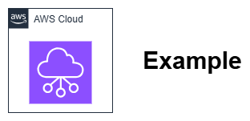

# 規約 {#conventions}

このセクションでは、本ベストプラクティスガイドで使用するいくつかの規約について説明します。

## アーキテクチャ図 {#architecture-diagrams}

### AWS アーキテクチャアイコン {#aws-architecture-icons}

アーキテクチャ図には、[最新の AWS アーキテクチャアイコンセット](https://aws.amazon.com/architecture/icons/)を使用してください。アイコンは、それが実際に表すものにのみ使用してください。

### フォーマットとツール {#format-and-tooling}

アーキテクチャ図は、白などの明るいニュートラルな背景を持つ PNG ファイル形式で提供してください。すべての要素の周囲に 8px の余白を設けてください。各図には、将来の変更を可能にするために [draw.io](https://www.drawio.com/) 形式のソースファイルを添付する必要があります。

#### ファイル構成 {#file-organization}

以下の構造でファイルを保存してください:

```
content/
  assets/
    foundation/
      vpc-setup-diagram.png
      vpc-setup-diagram.drawio
    security/
      network-acl-flow.png
      network-acl-flow.drawio
```

#### 技術要件 {#technical-requirements}

* **ファイル形式**: 透明な背景を持つ PNG
* **サイズ**: 最大幅 1200px、アスペクト比を維持。図は幅 700px にスケールしても読みやすい状態を保つ必要があります。
* **ファイルサイズ**: 最適な読み込みのために 500KB 未満に抑える
* **解像度**: Web 表示用に 72〜96 DPI

#### ライトモードとダークモードの互換性 {#light-and-dark-mode-compatibility}

図はライトとダーク両方のカラースキームで使用できる必要があります。これを実現するには:

* **透明な背景を使用する** — 白ではなく透明にしてください。これにより、図が両方のカラースキームに適応できます。
* **透明な背景上のテキストと線には `#7E7E7E` を使用する** — 黒(`#000000`)や白(`#FFFFFF`)は使用しないでください。このグレーは、ライト背景(`#FFFFFF`)とダーク背景(`#1e1e1e`)の両方に対してほぼ均等なコントラストを提供します。
* **色付きノード内のテキスト**(塗りつぶし背景を持つもの)は、白またはノードの塗りつぶし色に適した別の色を使用できます — `#7E7E7E` のルールは、透明な背景上に直接配置される要素にのみ適用されます。

!!! note "コントラスト比の制限"
    `#7E7E7E` グレーは、ライトとダーク両方の背景に対して約 4.1:1 のコントラストを達成します。これは WCAG AA の最低基準である 4.5:1 をわずかに下回ります。これは許容されるトレードオフです — 白とほぼ黒に近い背景の両方に対して同時に 4.5:1 のコントラストを達成できる単一の色は存在しません(数学的に範囲が相互に排他的です)。`#7E7E7E` の中間点は、重複した画像ファイルを必要とせずに、両方のスキームで最もバランスの取れた可読性を提供します。

{ width="300" }
/// caption
画像キャプションの例 - [Drawio ソース](../assets/community/Example.drawio)
///

### アクセシビリティ {#accessibility}

アクセシビリティを考慮してアーキテクチャ図を作成してください。テキスト(または線)と背景のコントラスト比は[少なくとも 4.5:1](https://www.w3.org/WAI/WCAG21/Understanding/contrast-minimum.html) 必要です。一般的に、強いコントラストの背景上の白または黒が最善の選択です。

#### アクセシビリティの例 {#accessibility-examples}

**良好なコントラストの組み合わせ:**

* 白背景(#FFFFFF)上の黒テキスト(#000000) - 21:1 の比率
* 白背景上のダークグレーテキスト(#16191F) - 12.6:1 の比率

**不十分なコントラストの組み合わせ:**

* 白背景上のライトグレーテキスト(#CCCCCC) - 1.6:1 の比率 ❌
* 白背景上の黄色テキスト - 1.1:1 の比率 ❌

#### ガイドライン {#guidelines}

* **シンプルに保つ**: できる限りシンプルな図を作成してください。必要に応じてコンテンツを複数の図に分割してください。ナプキンにスケッチできないほど複雑な場合は、作り直しが必要です。

* **二重エンコーディングを使用する**: 色だけを差異の唯一の指標として使用しないでください。

* **代替テキストを適切に使用する**: ビジュアルに代替テキストを含め、コンテンツを簡潔に説明してください。

### 図のスタイリング {#diagram-styling}

AWS のビジュアルスタイルと言語に合わせるために、以下のガイダンスを参照してください。図がこれらの要素ガイドラインをすべて満たしているか確認してください。

* **背景色**: 背景色として白(#FFFFFF)を使用してください。背景を透明のままにしないでください。

* **線と矢印**: 線の最小の太さ/幅は 1pt にしてください。主要な接続とコンテナには実線を使用してください。二次的な接続とコンテナは破線で表現できます。矢印のポインタースタイルは、閉じた矢印より開いた矢印を使用してください。

* **色**: 公式アイコンライブラリが提供する色は変更しないでください — そのまま使用してください。これらの色はセマンティックな意味を持っています(例: 特定の色はサービスカテゴリを表します)。図に追加の色を加える必要がある場合は、[AWS ブランドカラーパレット](https://design.amazon.com/styleguide/9188F3F120Af/aws/visual-identity/color/)に含まれる色値を使用してください。

* **タイポグラフィ(フォント)**: ほとんどの場合、ウェイトは Regular を使用してください。必要に応じて Bold を使用して強調を加えることができます。Thin や Light は使用しないでください(ほとんどの図で必要なフォントサイズ以下でアクセシビリティ基準を満たしません)。最小フォントサイズは 12px にしてください。ほとんどのアイコン/イラストのラベルには #16191F または #000000 を使用してください。図では ^^下線^^ より *イタリック* が推奨されます。(矢印/線のある図では、下線は不要な視覚的ノイズを加える可能性があります)。

* **ラベルとテキスト**: ラベルをアイコンと中央揃えにし、アイコンの下に配置してください。説明テキストを画像に埋め込まないでください — アクセシブルでも、ローカライズ可能でもありません。各図示オブジェクトやアイコンには短いラベルのみを使用してください。図の特定の部分を説明テキストで強調したい場合は、吹き出しを使用してください。これはアクセシビリティ、ローカライゼーション、および地域コンプライアンスの観点から優れています。

* **外側のフレーム**: 画像の上下左右に均等に 8px のパディングを適用してください。図に目に見える外側のボーダーを適用しないでください。ボーダーシャドウやフェードも避けることをお勧めします。

## IP アドレスの表記 {#representing-ip-addresses}

実際のネットワークとの競合を避け、例がどこでも機能するように、承認されたドキュメント用の範囲を使用してください。自動検証チェックによってこれらの標準が適用されます。

### IP 範囲とアドレスの例 {#example-ip-ranges-and-addresses}

「パブリック」IP アドレスを文書化する際は、IPv4 および IPv6 アドレスに利用可能な複数の[ドキュメント用範囲](https://en.wikipedia.org/wiki/Reserved_IP_addresses)のいずれかを使用してください。IPv4 範囲の良い例は ```192.0.2.0/24```、IPv6 範囲の例は ```2001:db8::/32``` です。

「内部範囲」の例には、[RFC1918](https://datatracker.ietf.org/doc/html/rfc1918)(```10.0.0.0/8, 172.16.0.0/12, 192.168.0.0/16```)、[RFC6598](https://datatracker.ietf.org/doc/html/rfc6598)(```100.64.0.0/10```)、または [RFC6815](https://datatracker.ietf.org/doc/html/rfc6815) の空間(```198.19.0.0/16```)を使用してください。これらはすべて VPC 内でサポートされています。

#### 完全なネットワーク例 {#complete-network-examples}

**マルチティア VPC のセットアップ:**

```
VPC: 10.0.0.0/16
  Public subnet: 10.0.1.0/24
  Private subnet: 10.0.2.0/24
  Database subnet: 10.0.3.0/24
```

### IPv6 アドレスとネットワークの表記 {#representing-ipv6-addresses-and-networks}

IPv6 アドレスを表記する際は、[RFC5952](https://datatracker.ietf.org/doc/html/rfc5952) に準拠してください。

| <!-- --> | 例 |
| -------- | -------- |
| :material-check:{ style="color: #4DB6AC" } **正しい** | ```2001:db8:0:1234::``` |
| :material-close:{ style="color: #EF5350" } **誤り** | ```2001:0db8:0000:1234::``` |
| :material-close:{ style="color: #EF5350" } **誤り** | ```2001:DB8:0:1234::``` |
| :material-close:{ style="color: #EF5350" } **誤り** | ```2001:0DB8:0000:1234::``` |

## コンソールのスクリーンショット {#console-screenshots}

AWS コンソールは頻繁に変更されるため、セクション内の複数のスクリーンショット間で一貫した外観を保ちながら画像を更新することは困難です。さらに、お客様は AWS デプロイメントの自動化に投資し、コンソールはレビュー、モニタリング、または試験的な操作にのみ使用すべきです。そのため、以下を含むほとんどの場合においてスクリーンショットの使用は避けるべきです:

* サービスの設定方法
* 基本的な AWS 操作

以下の場合は慎重に検討してください:

* コンソールでのグラフィカルな出力の表示(マップ、チャートなど)
* コンソール内の単一の機能や項目の強調表示(特に場所の説明が複雑な場合)

## クイックチェックリスト {#quick-checklist}

図を提出する前に確認してください:

* [ ] 最新の AWS アーキテクチャアイコンを使用している
* [ ] 白背景の PNG 形式である
* [ ] 対応する .drawio ソースファイルが含まれている
* [ ] テキストのコントラスト比が 4.5:1 以上である
* [ ] フォントサイズが 12px 以上である
* [ ] 承認された IP 範囲を使用している
* [ ] ファイルサイズが 500KB 未満である
* [ ] 説明的な代替テキストが含まれている

## 生成 AI の使用 {#use-of-generative-ai}

テキストコンテンツの作成や画像・図の生成に、生成 AI ツール(Amazon Q、Claude、ChatGPT、GitHub Copilot など)の使用は許可されています。AI によって支援されたコンテンツは、人間が作成したコンテンツと同じ品質基準を満たす必要があります — プロジェクトの[哲学](philosophy.md)およびこのページの規約は、コンテンツがどのように作成されたかに関わらず適用されます。

**AI 生成コンテンツの要件:**

* **人間によるレビューは必須です。** AI が生成したすべてのテキストと画像は、プルリクエストを作成する前に、技術的な正確性、トーン、およびプロジェクト規約への準拠について人間のコントリビューターがレビューする必要があります。AI の出力はドラフトであり、完成品ではありません。
* **技術的な正確性はレビュアーの責任です。** AI ツールは、事実として誤っている、古い、または微妙に誤解を招くコンテンツを、もっともらしく聞こえる形で生成することがあります。レビュアーは、サービスの機能、料金の詳細、API の動作、およびアーキテクチャの推奨事項を現在の AWS ドキュメントと照合して確認する必要があります。
* **コンテンツ自体に AI の使用を開示しないでください。** 読者は、コンテンツが人間によって書かれたのか、AI によって支援されたのかを判断できないようにする必要があります。品質基準はどちらの場合も同じです。
* **AI ツール向けのステアリング規約が存在します。** このプロジェクトには、リポジトリで作業する AI ツールに構造とフォーマットのガイダンスを提供する `.kiro/steering/content-conventions.md` ファイルが含まれています。AI ツールを使用するコントリビューターは、一貫した出力のためにツールがこのファイルを参照するようにしてください。
* **AI が生成した画像も同じ基準を満たす必要があります。** AI が生成した図は、承認された AWS アーキテクチャアイコンを使用し、アクセシビリティのコントラスト要件を満たし、将来の編集のために `.drawio` ソースファイルを含める必要があります — 人間が作成した図と同様です。

## 料金の参照 {#pricing-references}

ネットワーキングサービスとアーキテクチャの決定のコストへの影響について説明する際は:

* **具体的なドル金額ではなく、料金の次元を参照してください。** AWS の料金はリージョンによって異なり、頻繁に変更されます。具体的な価格(例: "$0.045/GB")を含めるのではなく、何に対して課金されるか(時間単位、処理 GB 単位、アタッチメント単位、リクエスト単位)と、サービスの相対的な比較を説明してください。
* **相対的な比較を使用してください。** 「VPC ピアリングにはデータ処理料金がかかりませんが、Transit Gateway は GB 単位で課金されます」や「DNS Firewall は同じトラフィック量に対して Network Firewall よりも桁違いに安価です」などの表現は、リージョンや時間を超えて持続的かつ正確です。
* **公式の料金ページにリンクしてください。** コストが意思決定の要因となる場合は、読者が自分のリージョンの現在の値を調べられるように、関連する AWS 料金ページへのリンクを含めてください。
