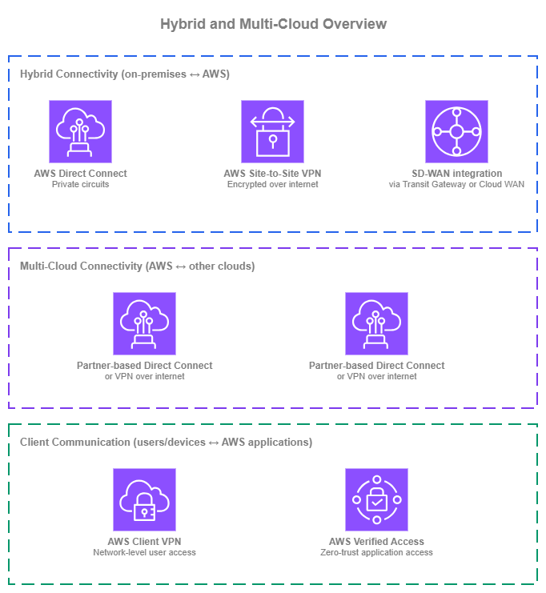
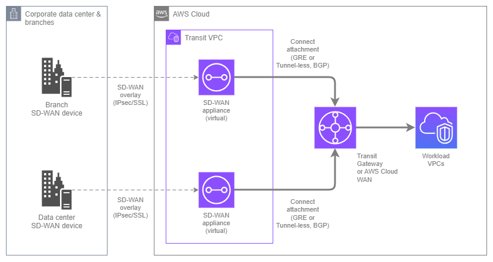
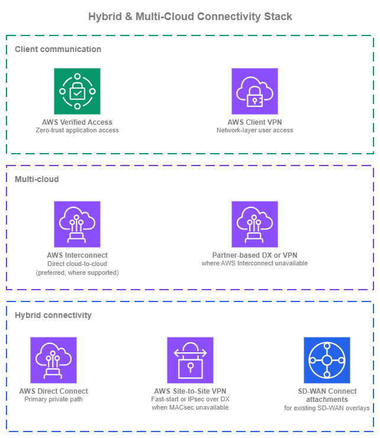

# ハイブリッドおよびマルチクラウド接続 {#hybrid-and-multi-cloud-connectivity}

!!! info "前提条件"
    このセクションでは、[Amazon VPC](../foundation/vpc.md)、[CIDR 計画](../foundation/cidr.md)、[AWS Organizations](../foundation/organizations.md)、および [AWS 内接続](within-aws.md)サービス（特に AWS Transit Gateway と AWS Cloud WAN）に精通していることを前提としています。AWS ネットワーキングの基礎を初めて学ぶ方は、先にそれらのトピックを確認してください。

AWS を AWS 外のネットワークに接続する際には、2 つの異なる課題があり、単一のサービスで解決できることはほとんどありません。**ハイブリッド接続**は、プライベート回線、暗号化 VPN、または SD-WAN オーバーレイを通じて、オンプレミスのデータセンターやブランチオフィスを AWS に接続します。**マルチクラウド接続**は、複数のプロバイダーにまたがるワークロードのために、AWS を他のパブリッククラウドに接続します。

/// caption
ハイブリッドおよびマルチクラウドの概要 — [Drawio ソース](../assets/connectivity/hybrid-overview.drawio)
///

オンプレミス接続については、[AWS Direct Connect](https://aws.amazon.com/directconnect/) が専用回線上でプライベートかつ予測可能な帯域幅を提供し、ほとんどの本番ハイブリッド環境の基盤となっています。[AWS Site-to-Site VPN](https://aws.amazon.com/vpn/site-to-site-vpn/) はインターネット経由で暗号化された接続を提供し、プライベート回線が不要な場合や、レイヤー 3 暗号化のために Direct Connect を補完する用途に適しています。**SD-WAN 統合**では、Transit Gateway Connect または AWS Cloud WAN Connect アタッチメントを使用して、サードパーティの SD-WAN オーバーレイを AWS ネットワーク プレーンに取り込みます。

マルチクラウドについては、[AWS Interconnect](https://docs.aws.amazon.com/interconnect/latest/userguide/what-is-interconnect.html) が推奨オプションです。これは、コロケーションでのクロスコネクト、パートナーとの調整、または手動のルーター設定を必要とせず、AWS VPC と他のクラウドプロバイダーのネットワーク間に直接プライベート接続を作成するマネージドサービスです。確立された代替手段（パートナーベースの Direct Connect クロスコネクト、またはクラウド間の Site-to-Site VPN）は、AWS Interconnect がまだ対象リージョンペアやクラウドペアをカバーしていない場合に引き続き有効ですが、運用上のオーバーヘッドが大きくなります。

多くの組織では、これらのサービスを同時に複数使用しています。目標は、それぞれのサービスが最も価値を発揮できる場面で活用することです。これらのサービスを組み合わせた推奨アーキテクチャについては、このページ末尾の[ハイブリッドおよびマルチクラウドスタックの構築](#building-your-hybrid-and-multi-cloud-stack)を参照してください。

## AWS Direct Connect によるオンプレミスのプライベート接続 {#private-on-premises-connectivity-with-aws-direct-connect}

[AWS Direct Connect](https://docs.aws.amazon.com/directconnect/latest/UserGuide/Welcome.html) は、オンプレミスネットワークと AWS の間に、プライベートかつ専用のネットワーク接続を提供します。トラフィックは Direct Connect ロケーションでプロビジョニングされた物理回線を経由し、パブリックインターネットを完全に迂回するため、帯域幅の予測が容易で、レイテンシーが安定しており、AWS からのデータ転送コストもインターネット経由より低くなります。Direct Connect はほとんどの本番ハイブリッド環境の基盤であり、ハイブリッドトラフィックを終端するすべての AWS ネットワークサービス(仮想プライベートゲートウェイ、Transit Gateway、AWS Cloud WAN)と統合されています。

**主な機能**:

*   :material-fiber: **専用接続とホスト型接続**

    ---

    専用接続は 1 Gbps、10 Gbps、または 100 Gbps で、Direct Connect ロケーションから AWS が直接提供します。ホスト型接続は小容量(50 Mbps ～ 25 Gbps)で、すでにロケーションへの容量をプロビジョニング済みの Direct Connect パートナーから提供されます。

*   :material-lan: **仮想インターフェイス(VIF)**

    ---

    1 本の物理接続が、VLAN タグ付きの複数の仮想インターフェイスを収容します。**プライベート VIF** は VPC リソースに到達します(仮想プライベートゲートウェイまたは Direct Connect ゲートウェイ経由)。**トランジット VIF** は Transit Gateway または AWS Cloud WAN コアネットワークに到達します(Direct Connect ゲートウェイ経由)。**パブリック VIF** はプライベートリンク経由で AWS パブリックサービスエンドポイントに到達します。

*   :material-router-network: **Direct Connect ゲートウェイ**

    ---

    グローバルに分散した BGP ルートリフレクターです。1 つの Direct Connect ゲートウェイを、任意の AWS リージョン(中国を除く)にまたがる仮想プライベートゲートウェイ、Transit Gateway、または AWS Cloud WAN コアネットワークに関連付けることができるため、複数の回線をプロビジョニングしなくても 1 本の物理接続で多数のリージョンに到達できます。

*   :material-transit-transfer: **SiteLink**

    ---

    AWS リージョンを経由せず、AWS グローバルバックボーン経由で 2 つの Direct Connect ロケーション間のトラフィックをルーティングします。AWS ネットワークを経由するパスが WAN より短いまたは信頼性が高い場合に、オンプレミスサイト同士を接続するのに有効です。

*   :material-shield-check: **MACsec 暗号化**

    ---

    IEEE 802.1AE MACsec は、対応する 10 Gbps および 100 Gbps 接続において、お客様のルーターと AWS Direct Connect ルーターの間のトラフィックをレイヤー 2 で暗号化します。コンプライアンス要件により専用回線自体にリンク層暗号化が必要な場合に有効です。

*   :material-ip-network: **デュアルスタックサポート**

    ---

    プライベート、トランジット、パブリックのすべての VIF タイプが IPv4 および IPv6 BGP セッションをサポートします。デュアルスタックは VIF ごとに設定するため、同一の物理接続上で IPv4 と IPv6 を同時に運用できます。

### AWS Direct Connect のベストプラクティス {#aws-direct-connect-best-practices}

#### 接続レベルだけでなく、ロケーションおよびプロバイダーレベルで冗長性を設計する {#design-for-resiliency-at-the-location-and-provider-level-not-just-at-the-connection-level}

100 Gbps の専用接続であっても、1 つの Direct Connect ロケーションを通る 1 本の回線に過ぎません。本番ハイブリッドトラフィックには、Resiliency Toolkit の**最大冗長性**モデルに従ってください。すなわち、異なるプロバイダーから提供され、それぞれ異なるオンプレミスルーターに終端する、2 つの別々の Direct Connect ロケーションに少なくとも 2 本の接続を用意します。これにより、ロケーション、プロバイダー、クロスコネクト、デバイスの単一障害点をすべて排除できます。

単一ロケーション障害時にパフォーマンスの低下を許容できるワークロードであれば、**高冗長性**モデル(1 つ以上のプロバイダーを通じて 2 つのロケーションにまたがる 2 本の接続)が現実的な妥協点となります。**開発/テスト**用の単一接続モデルは、最終的に本番トラフィックを担うことになるものには、ほとんどの場合適切ではありません。

#### アタッチポイントとして Direct Connect ゲートウェイを使用する {#use-a-direct-connect-gateway-as-the-attach-point}

Direct Connect ゲートウェイは無料でグローバルに分散したリソースであり、VIF と AWS ネットワークサービス(仮想プライベートゲートウェイ、Transit Gateway、または AWS Cloud WAN コアネットワーク)の間の BGP アタッチポイントとして機能します。1 つの Direct Connect ゲートウェイを複数のリージョンのアタッチポイントに関連付けることで、宛先ごとにリージョン固有の VIF を用意しなくても、1 本の物理接続で任意のリージョンのワークロードに到達できます。

これにより移行も簡素化されます。ワークロードをリージョン間で移動したり、Transit Gateway から AWS Cloud WAN へ移行したりする際に、VIF を再プロビジョニングするのではなく、Direct Connect ゲートウェイの関連付けを変更するだけで済みます。また、BGP コントロールプレーンをデータパスから分離するため、BGP の再コンバージェンスが正常なパスのトラフィックを中断しません。

#### ワークロードごとに適切な VIF タイプを選択する {#choose-the-right-vif-type-for-each-workload}

Direct Connect には 3 種類の VIF タイプがあり、それぞれ異なるユースケースに適しています。どこでも同じタイプをデフォルトにするのではなく、ワークロードごとに適切なタイプを選ぶことが重要です。

* **トランジット VIF** は、オンプレミス接続を AWS ネットワーク全体に拡張する際のデフォルトです。Direct Connect ゲートウェイ経由で Transit Gateway または AWS Cloud WAN コアネットワークに終端することで、1 本のトランジット VIF でハブがルーティングするすべての VPC に到達でき、VIF の乱立を防ぎ、ルーティングを一元管理できます。
* **プライベート VIF** を特定の VPC に向けることは、専用パスが正当化されるワークロード(持続的な高スループットのデータ転送、ハブのデータ処理オーバーヘッドを避けたいレイテンシー敏感なトラフィック、またはアタッチポイントを共有できないコンプライアンス要件)に適しています。
* **パブリック VIF** は、AWS パブリックサービスエンドポイント(Amazon S3 や Amazon DynamoDB など)を Direct Connect パス経由で直接利用する場合に適切な選択です。

ほとんどの本番環境では 3 種類すべてを運用します。バックボーンとして 1 本以上のトランジット VIF、要求の厳しい少数のワークロード向けにプライベート VIF、そして AWS パブリックエンドポイントのトラフィックが多い場合(最も一般的なのは S3)にパブリック VIF を使用します。

#### 複数の Direct Connect パスにまたがるトラフィックエンジニアリングに BGP 属性を使用する {#use-bgp-attributes-for-traffic-engineering-across-multiple-direct-connect-paths}

複数の Direct Connect 接続がある場合、BGP 属性を使ってトラフィックの流れを制御できます。プライマリパスとセカンダリパスの選択、回線間の負荷分散、対称なリターントラフィックなどが対象です。サポートされている属性は、**Local Preference コミュニティ**(AWS からのルートに対して、値が高いほど優先)、**AS_PATH プリペンド**(広告するルートに対して、パスが長いほど優先度が低い)、**MED**(広告するルートに対して、AS_PATH が同一の場合は値が低いほど優先)、および**最長プレフィックスマッチ**(常に上記の属性より優先)です。

Direct Connect ゲートウェイに終端する VIF の場合、オンプレミス側の設定はオンプレミスルーターで行います。VIF と Direct Connect ゲートウェイ自体には設定可能な BGP ポリシーのノブがないため、トラフィックエンジニアリングは主にオンプレミス側の作業となります。AWS Cloud WAN 環境では、Cloud WAN の[ルーティングポリシー](https://docs.aws.amazon.com/network-manager/latest/cloudwan/cloudwan-routing-policies.html)が AWS 側のコントロールポイントを追加します。Cloud WAN セグメントと Direct Connect ゲートウェイアタッチメント間のルートに対して、オンプレミスルーターだけでなくポリシーからフィルタリング、集約、BGP 属性の操作が可能になります。

#### サブ秒のフェイルオーバーのために BFD を有効にする {#enable-bfd-for-sub-second-failover}

BGP ホールドタイマーだけでは、デフォルトで約 90 秒(30 秒のキープアライブ間隔の 3 倍)かけて障害が発生したネイバーを検出します。これはほとんどの本番ハイブリッドワークロードには長すぎます。[Bidirectional Forwarding Detection (BFD)](https://docs.aws.amazon.com/directconnect/latest/UserGuide/enable_bfd.html) は BGP セッションと並行して軽量な死活監視を実行し、転送パスに障害が発生するとすぐにセッションを切断します。通常は約 1 秒以内です。

AWS はすべての Direct Connect BGP セッションで非同期 BFD を自動的に有効にしており、検出タイマーは 300 ms、マルチプライヤーは 3(セッションをダウンと判定するまで約 900 ms)です。お客様側では、ネゴシエーションを完了させるために、オンプレミスルーターで互換性のあるタイマーを使って BFD を有効にしてください。両端で BFD が有効でない場合、接続、VIF、またはピアデバイスの問題によるフェイルオーバーは BGP ホールドタイマーに依存することになり、障害時間はサブ秒ではなく数十秒になります。

BFD は、冗長性の目的がまさに迅速なフェイルオーバーにある、マルチ回線またはアクティブ/パッシブ構成において特に重要です。開通確認の一環としてすべてのセッションで BFD が稼働していることを確認し、BGP セッション状態と同様に BFD 状態もアラームを設定してください。

#### 最初から IPv6 を計画する {#plan-ipv6-from-the-start}

すべての VIF タイプが IPv6 BGP セッションをサポートしています。オンプレミスのホストが現時点で IPv4 のみであっても、最初から各 VIF に IPv4 と並行して IPv6 を設定してください。AWS 側はデュアルスタックをサポートしており、難しいのはオンプレミス側の展開です。AWS 側を準備しておくことで、オンプレミスネットワークの準備が整った時点で VIF 設定を再度変更することなく IPv6 を採用できます。

#### BGP と VIF のメトリクスを積極的に監視する {#monitor-bgp-and-vif-metrics-actively}

Direct Connect は、BGP セッション状態、接続状態、VIF ごとの送受信バイト数およびパケット数の CloudWatch メトリクスを公開しています。BGP セッション状態のフラッピングや、予期しないトラフィックの非対称性(BGP がバランスを取るべき状況で、ある VIF が他の VIF より著しく多いまたは少ないトラフィックを運んでいる場合)に対してアラームを設定してください。BGP 状態変化の迅速な検出が、ユーザーに気づかれないフェイルオーバーと 5 分間の障害の差を生みます。

### AWS Direct Connect を使用すべき場面 {#when-to-use-aws-direct-connect}

以下のいずれかに該当する場合、Direct Connect が適切な選択です。

* ハイブリッドワークロードが、パブリックインターネットでは保証できない予測可能な帯域幅またはレイテンシーを必要とする場合。
* AWS からのデータ転送量が多く、インターネット転送料金ではなく低コストの Direct Connect 転送料金を利用したい場合。
* 機密トラフィックがパブリックインターネットを経由することを禁じるコンプライアンス要件がある場合。
* 新しい本番ハイブリッドアーキテクチャを構築している場合。高い冗長性への道は、VPN フォールバックと組み合わせた単一の Direct Connect ではなく、複数のロケーションとプロバイダーにまたがる複数の Direct Connect 接続です。

Direct Connect は、接続を数週間ではなく数日で開通させる必要がある場合(プロビジョニングにはクロスコネクトとプロバイダーとの調整が必要)、トラフィック量が少なく VPN のコストとパフォーマンスで十分な場合、または接続が短期間のみ必要な場合(例: VPN スループットで十分な一回限りのデータ移行)には、**適切な出発点ではありません**。

### AWS Direct Connect と他のハイブリッドネットワーキングサービスの組み合わせ {#combining-aws-direct-connect-with-other-hybrid-networking-services}

| 組み合わせ | AWS Direct Connect が担う役割 | 他のサービスが担う役割 |
| --- | --- | --- |
| **Direct Connect + Site-to-Site VPN** | AWS へのプライベートパス | MACsec が利用できない場合(例: 10 Gbps 未満のホスト型接続、またはレイヤー 3 暗号化を要求するコンプライアンス基準)に Direct Connect 上に IPsec オーバーレイを構成 |
| **Direct Connect + SD-WAN(TGW/Cloud WAN Connect 経由)** | オンプレミス SD-WAN アプライアンスと AWS 間の基盤トランスポート | SD-WAN ソリューションが提供するオーバーレイ |
| **Direct Connect + AWS Interconnect(マルチクラウド)** | オンプレミスのハイブリッドパス | AWS と他のプロバイダー間のクラウド間パス。両者は Direct Connect ゲートウェイを共有可能 |

### ドキュメント {#documentation}

*   :material-file-document: **AWS Direct Connect ドキュメント**

    ---

    接続、仮想インターフェイス、Direct Connect ゲートウェイ、SiteLink、MACsec を網羅した完全なサービスドキュメントです。

    [:octicons-arrow-right-24: ドキュメント](https://docs.aws.amazon.com/directconnect/latest/UserGuide/Welcome.html)

*   :material-file-document-outline: **Resiliency Toolkit**

    ---

    AWS が推奨する冗長性モデル(開発、高冗長性、最大冗長性)と、それらを実装するためのガイド付きワークフローです。

    [:octicons-arrow-right-24: ドキュメント](https://docs.aws.amazon.com/directconnect/latest/UserGuide/resilency_toolkit.html)

*   :material-post: **AWS Direct Connect ブログ記事**

    ---

    AWS Networking and Content Delivery ブログによるアーキテクチャのウォークスルー、機能発表、および実装ガイドです。

    [:octicons-arrow-right-24: ブログ記事](https://aws.amazon.com/blogs/networking-and-content-delivery/category/networking-content-delivery/aws-direct-connect/)

*   :material-currency-usd: **AWS Direct Connect 料金**

    ---

    専用接続およびホスト型接続のポート時間料金と、通常インターネット転送より低コストなデータ転送料金の詳細です。

    [:octicons-arrow-right-24: 料金](https://aws.amazon.com/directconnect/pricing/)

## AWS Site-to-Site VPN による暗号化オンプレミス接続 {#encrypted-on-premises-connectivity-with-aws-site-to-site-vpn}

[AWS Site-to-Site VPN](https://docs.aws.amazon.com/vpn/latest/s2svpn/VPC_VPN.html) は、オンプレミスネットワークと AWS の間で、パブリックインターネット経由の暗号化された IPsec 接続を提供します。各 VPN 接続は、冗長性を確保するために別々の AWS エンドポイントで終端する 2 本の IPsec トンネルで構成され、スタティックルーティングと BGP によるダイナミックルーティングの両方をサポートします。Site-to-Site VPN は、VPC にアタッチされた仮想プライベートゲートウェイ、Transit Gateway、または AWS Cloud WAN コアネットワークで終端できます。

Site-to-Site VPN はハイブリッド接続を確立する最も迅速な方法です。プライベート回線を必要としないサイトの主要パスとして、データ移行などの短期的な接続として、また MACsec が利用できずレイヤー 3 暗号化が必要な場合に Direct Connect 上の IPsec オーバーレイとして、一般的に使用されます。

**主な機能**:

*   :material-shield-key: **接続ごとに 2 本のトンネルによる IPsec 暗号化**

    ---

    すべての VPN 接続は、別々のアベイラビリティーゾーンのエンドポイントで終端する 2 本の IPsec トンネルを提供します。

*   :material-speedometer: **Standard および Large トンネル帯域幅**

    ---

    Standard トンネルはトンネルあたり最大 1.25 Gbps を提供します。Large トンネルはトンネルあたり最大 5 Gbps を提供し、高スループットワークロードでの複雑な ECMP ボンディングが不要になります。Large トンネルは Transit Gateway VPN および AWS Cloud WAN VPN アタッチメントで利用できます。

*   :material-office-building-marker: **多数のリモートサイト向け VPN Concentrator**

    ---

    多数の低帯域幅(100 Mbps 未満)の VPN 接続を単一のアタッチメントに集約する Transit Gateway アタッチメントで、Concentrator あたり最大 100 サイト、集約帯域幅は 5 Gbps です。以前は AWS 内の複数の仮想コンセントレーターアプライアンスを管理する必要があった、数十の拠点(小売、ホスピタリティ、ヘルスケア)を持つ分散型企業向けに設計されています。

*   :material-rocket-launch: **Accelerated VPN**

    ---

    VPN トラフィックを AWS Global Accelerator と AWS エッジネットワーク経由でルーティングし、AWS リージョンから遠いお客様のジッターを低減してスループットを向上させます。Transit Gateway VPN 接続で利用できます。

*   :material-router: **Direct Connect 経由のプライベート IP VPN**

    ---

    パブリックインターネットの代わりに、Direct Connect 接続経由でアクセス可能なプライベート IP アドレスで VPN を終端します。トンネルエンドポイントをインターネットに公開せずに Direct Connect 回線上で IPsec 暗号化を使用したい場合に有効です。

*   :material-network: **BGP によるダイナミックルーティング**

    ---

    各トンネルの BGP により、オンプレミスルーターが AWS プレフィックスを動的に学習し、オンプレミスのプレフィックスを AWS にアドバタイズできます。BGP を実行しないデバイスにはスタティックルーティングがサポートされていますが、非自明なトポロジーには BGP を強く推奨します。

*   :material-ip-network: **デュアルスタックサポート**

    ---

    VPN トンネルは IPv4 または IPv6 のインサイドアドレスをサポートします。デュアルスタック通信には、プロトコルごとに別々の VPN トンネルが必要です。

### AWS Site-to-Site VPN のベストプラクティス {#aws-site-to-site-vpn-best-practices}

#### 異なる ISP パスと複数の VPN 接続およびダイナミックルーティングを使用する {#use-multiple-vpn-connections-with-diverse-isp-paths-and-dynamic-routing}

すべての VPN 接続は 2 本の IPsec トンネルを提供しますが、どちらも同じ接続内の AWS エンドポイントで終端します。本番環境の可用性を確保するには、**2 つ以上の VPN 接続**をプロビジョニングし、異なるオンプレミスルーターで終端させ、各ルーターが**異なる ISP** 経由で AWS に到達するようにして、単一プロバイダーの障害で両方のパスが同時にダウンしないようにします。すべてのトンネルで BGP を使用することで、AWS がパス間を自動的に学習してフェイルオーバーし、セッション状態を通じて到達可能性を報告し、BGP 属性でトラフィックを制御できます。スタティックルーティングではこれらすべてが省略されるため、本番環境にはほぼ適していません。オンプレミスデバイスが BGP をサポートしていない場合は、回避策を構築するのではなく、デバイスを交換することが解決策です。

#### VPN は仮想プライベートゲートウェイではなく Transit Gateway または AWS Cloud WAN で終端する {#terminate-vpn-on-transit-gateway-or-aws-cloud-wan-not-virtual-private-gateways}

仮想プライベートゲートウェイへの VPN は、1 つの VPC にしか到達できません。Transit Gateway または AWS Cloud WAN コアネットワークへの VPN は、ハブがルーティングするすべての VPC に到達でき、ルートテーブルまたはネットワークポリシーによってセグメンテーションが適用されます。複数の VPC を持つ環境では、Transit Gateway または AWS Cloud WAN で VPN を終端してください。

これにより、Large トンネル(トンネルあたり 5 Gbps)、Accelerated VPN、および複数の VPN アタッチメント間の ECMP も利用可能になります。これらはいずれも仮想プライベートゲートウェイ VPN では利用できません。

#### 多数の低帯域幅サイトには VPN Concentrator を使用する {#use-vpn-concentrator-for-many-low-bandwidth-sites}

[VPN Concentrator](https://docs.aws.amazon.com/vpc/latest/tgw/tgw-vpn-concentrator-attachments.html) は、多数の拠点というユースケースに対応します。サイトごとに専用の VPN 接続をプロビジョニングすると Transit Gateway アタッチメントが増大し、ワークロードに見合わない接続ごとのコストが発生するような、多数のサイトがそれぞれ適度な帯域幅ニーズを持つケースです。VPN Concentrator アタッチメントは最大 100 サイト(それぞれ 100 Mbps 未満)を単一の Transit Gateway アタッチメントに集約し、Concentrator あたり 5 Gbps の集約帯域幅、Transit Gateway あたり最大 5 つの Concentrator をサポートします。

低帯域幅プロファイル(小売チェーン、ホテル、ヘルスケア拠点、分散型フィールドオフィス)に該当するリモートサイトが 25 以上ある場合は VPN Concentrator を選択してください。Concentrator は BGP のみのルーティングを実行し、AZ 冗長エンドポイントを提供するため、運用上は接続されたすべてのサイトに一貫したルーティングポリシーとセキュリティルールが適用される 1 つのアタッチメントとして見え、サイトごとの接続管理が不要になります。サイト数が少ない場合や 100 Mbps 以上が必要なサイトには、標準の Site-to-Site VPN 接続を使用してください。

#### 遠隔地のサイトには Accelerated VPN を使用する {#use-accelerated-vpn-for-distant-sites}

AWS リージョンから遠い拠点やデータセンターには、Accelerated VPN がパブリックインターネットの代わりに AWS Global Accelerator エッジネットワーク経由でトラフィックをルーティングします。ジッターとスループットの改善は、レイテンシーやスループットに敏感なハイブリッドワークロードにとって有意義であり、有効化は接続ごとのトグルで行えます。

Accelerated VPN は、AWS リージョンがサイトと同じ大陸にない場合や、サイトとリージョン間のインターネットルーティングが歴史的に不安定な場合に最も効果的です。

#### 最初から IPv6 を計画する {#plan-ipv6-from-the-start}

VPN トンネルは IPv4 または IPv6 のインサイドアドレスをサポートしますが、1 本のトンネルは 1 つのプロトコルのみを運びます。両方が必要な場合は、同じ接続設定内で IPv4 用に 1 本、IPv6 用に 1 本のトンネルを作成してデュアルスタックをプロビジョニングし、帯域幅とトンネル数の計画に反映させてください。

#### トンネル状態と BGP セッションを監視し、Site-to-Site VPN ログを有効にする {#monitor-tunnel-state-bgp-sessions-and-enable-site-to-site-vpn-logs}

CloudWatch はトンネルごとに `TunnelState`、`TunnelIpAddress`、および BGP セッション状態メトリクスを公開します。トンネル状態の遷移と BGP セッションのフラップ回数にアラームを設定してください。単一トンネルのダウンは定期的に発生することが想定されます(AWS はトンネルエンドポイントの計画メンテナンスを実施します)。同じ接続の両方のトンネルが数分以上ダウンしている場合は障害です。

すべての接続で [Site-to-Site VPN ログ](https://docs.aws.amazon.com/vpn/latest/s2svpn/monitoring-logs.html)を有効にしてください。これらのログは IKE ネゴシエーション、IPsec トンネルの確立、デッドピア検出、および BGP ルーティングアクティビティをキャプチャします。これは、ネゴシエーションの失敗やセッションのフラップをトラブルシューティングするために必要な情報です。ログなしでは、確立できないトンネルの診断は通常オンプレミスデバイスのログのみに頼ることになりますが、ログがあれば会話の両側が 1 か所で確認できます。

### AWS Site-to-Site VPN を使用する場面 {#when-to-use-aws-site-to-site-vpn}

Site-to-Site VPN は以下のいずれかに該当する場合に適しています。

* 今すぐハイブリッド接続が必要で、Direct Connect のプロビジョニングに時間がかかる場合。
* サイトが小規模または遠隔地で、Direct Connect 回線のコストと物理的なプロビジョニングが正当化されない場合。
* MACsec が利用できない(10 Gbps 未満のホスト型接続)か、コンプライアンスがレイヤー 3 暗号化を要求するため、Direct Connect 上に暗号化オーバーレイが必要な場合。
* 接続が短期的なもの、たとえばインターネットベースの暗号化スループットで十分な 1 回限りのデータ移行の場合。
* 多数の小規模拠点を接続しており、合計すると現実的な数を超える Direct Connect 回線が必要になる場合(大規模では VPN Concentrator が通常適切なツールです)。

Site-to-Site VPN は、パブリックインターネットが保証できる範囲を超えた予測可能なレイテンシーが必要な場合、インターネットエグレスコストが高くなるほど大量のデータを転送する場合、またはコンプライアンスが暗号化オーバーレイではなくプライベート物理回線を明示的に要求する場合には**適していません**。

### AWS Site-to-Site VPN と他のハイブリッドネットワーキングサービスの組み合わせ {#combining-aws-site-to-site-vpn-with-other-hybrid-networking-services}

| 組み合わせ | Site-to-Site VPN が担う役割 | 他のサービスが担う役割 |
| --- | --- | --- |
| **VPN + AWS Direct Connect** | MACsec が利用できない場合やレイヤー 3 暗号化が必要な場合に Direct Connect 上の IPsec オーバーレイ | AWS へのプライベートパス |

### ドキュメント {#documentation}

*   :material-file-document: **AWS Site-to-Site VPN ドキュメント**

    ---

    トンネル設定、BGP、Transit Gateway および AWS Cloud WAN アタッチメント、Large トンネル、Accelerated VPN を網羅した完全なサービスドキュメントです。

    [:octicons-arrow-right-24: ドキュメント](https://docs.aws.amazon.com/vpn/latest/s2svpn/VPC_VPN.html)

*   :material-file-document-outline: **Accelerated VPN**

    ---

    Accelerated VPN を有効にする方法と、遠隔地サイトのスループットが向上する場面について説明します。

    [:octicons-arrow-right-24: ドキュメント](https://docs.aws.amazon.com/vpn/latest/s2svpn/accelerated-vpn.html)

*   :material-file-document-multiple-outline: **ハイブリッド接続ホワイトペーパー**

    ---

    ハイブリッド接続のための Site-to-Site VPN、Direct Connect、および SD-WAN アーキテクチャを網羅した AWS ホワイトペーパーです。

    [:octicons-arrow-right-24: ホワイトペーパー](https://docs.aws.amazon.com/whitepapers/latest/hybrid-connectivity/hybrid-connectivity.html)

*   :material-post: **AWS Site-to-Site VPN ブログ記事**

    ---

    AWS Networking and Content Delivery ブログのアーキテクチャパターン、機能発表、および実装ガイドです。

    [:octicons-arrow-right-24: ブログ記事](https://aws.amazon.com/blogs/networking-and-content-delivery/category/networking-content-delivery/aws-vpn/aws-site-to-site-vpn/)

*   :material-currency-usd: **AWS Site-to-Site VPN 料金**

    ---

    接続時間ごとの料金にデータ転送料金が加算され、Standard トンネルと Large トンネル、および Accelerated VPN には別途料金が設定されています。

    [:octicons-arrow-right-24: 料金](https://aws.amazon.com/vpn/pricing/)

## SD-WAN と AWS Transit Gateway および AWS Cloud WAN の統合 {#sd-wan-integration-with-aws-transit-gateway-and-aws-cloud-wan}

このセクションは、ブランチやデータセンター全体で既に SD-WAN を運用しており、AWS をそのオーバーレイのファーストクラスサイトとして参加させたい組織を対象としています。SD-WAN ベンダーがオーバーレイ自体(パス選択、WAN 最適化、サイト間暗号化、オーケストレーション)を担当し、AWS はオーバーレイを AWS ネットワーク プレーンに接続するアタッチポイントを提供します。

統合メカニズムは、[AWS Transit Gateway](https://docs.aws.amazon.com/vpc/latest/tgw/tgw-connect.html) または [AWS Cloud WAN](https://docs.aws.amazon.com/network-manager/latest/cloudwan/cloudwan-connect-attachment.html) 上の **Connect アタッチメント**です。Connect アタッチメントは複数の Connect ピアを持ち、各ピアは SD-WAN アプライアンスと AWS 間の動的ルーティングに BGP を使用します。BGP はすべての SD-WAN ベンダーが対応している標準コントロールプレーンです。トンネルプロトコル、アンダーレイ、およびサポートされるランディングサービスは Transit Gateway と AWS Cloud WAN で異なり、その違いが統合設計を左右します。以降のセクションでそれぞれを説明します。

/// caption
SD-WAN 統合 — [Drawio ソース](../assets/connectivity/sdwan-integration.drawio)
///

**統合の構成要素**:

*   :material-hub: **Transit Gateway と AWS Cloud WAN の違い**

    ---

    両サービスとも BGP を使用した Connect アタッチメントをサポートしていますが、サポートされる**トンネルプロトコル**と**アンダーレイ**が異なります。Transit Gateway Connect は GRE のみをサポートし、VPC と Direct Connect の両方のアンダーレイに対応しています。AWS Cloud WAN Connect は GRE と**トンネルレス Connect**(カプセル化オーバーヘッドを排除する高パフォーマンスオプション)をサポートしており、アンダーレイは VPC アタッチメントである必要があります。Direct Connect Gateway はサポートされていません。既存の AWS ネットワークバックボーンに合ったランディングサービスを選択してください。

*   :material-tunnel: **GRE とトンネルレス Connect**

    ---

    GRE は SD-WAN アプライアンスと AWS 側の間のトンネルで BGP とデータトラフィックをカプセル化します。トンネルレス Connect(AWS Cloud WAN のみ)はカプセル化を完全にスキップするため、BGP はアプライアンスと Cloud WAN 間で直接実行されます。トンネルレスは GRE オーバーヘッドを排除し、通常はピアあたりのスループットが向上します。

*   :material-router-wireless: **VPC または Direct Connect アンダーレイ(Transit Gateway のみ)**

    ---

    Transit Gateway Connect のアンダーレイには、VPC(SD-WAN 仮想アプライアンスが EC2 インスタンスとして動作する場所)または Direct Connect アタッチメント(SD-WAN アプライアンスがオンプレミスにあり、Direct Connect Gateway 経由で Direct Connect を通じて AWS とピアリングする場合)を使用できます。適切な選択は、SD-WAN アプライアンスをどこに配置するかによって異なります。AWS Cloud WAN Connect は現在、VPC アンダーレイのみをサポートしています。

*   :material-chart-pie: **SD-WAN トラフィックを AWS 環境ごとにセグメント化する**

    ---

    Transit Gateway ルートテーブルまたは AWS Cloud WAN セグメントを使用することで、SD-WAN トラフィッククラス(本番、非本番、ゲスト、IoT)を AWS 内の個別のルーティングドメインにマッピングできます。これには、複数の Connect ピア(セグメントごとに 1 つ)、または SD-WAN 側のカプセル化(ベンダーが適切な AWS セグメントにマッピングする)のいずれかが必要です。

*   :material-ip-network: **デュアルスタックサポート**

    ---

    Connect アタッチメントは同一の GRE トンネル上で IPv4 と IPv6 の BGP セッションをサポートしているため、個別のトンネルをプロビジョニングすることなく、SD-WAN オーバーレイと AWS ネットワーク間で IPv4 および IPv6 ルートを伝播できます。

### SD-WAN ネットワークを AWS と統合するためのベストプラクティス {#best-practices-for-integrating-sd-wan-networks-with-aws}

#### SD-WAN アプライアンスの配置場所に基づいてアンダーレイを選択する {#choose-the-underlay-based-on-where-the-sd-wan-appliance-lives}

SD-WAN ベンダーが AWS 内での仮想アプライアンスの実行を推奨している場合(一般的なパターン)、Transit Gateway または AWS Cloud WAN のいずれかで VPC ベースの Connect アタッチメントを使用します。トランジット VPC にアプライアンスをデプロイし、その VPC を選択したサービスにアタッチしてから、その上に Connect アタッチメントを重ねます。SD-WAN オーバーレイは、インターネットまたは Direct Connect 経由でオンプレミスデバイスをアプライアンスに接続します。

SD-WAN アプライアンスをオンプレミスに置いたまま AWS と直接ピアリングする場合は、Direct Connect アンダーレイ(Direct Connect Gateway 経由)を使用した Transit Gateway Connect アタッチメントを使用します。オンプレミスの SD-WAN デバイスは、Direct Connect 回線を通じて Transit Gateway への GRE ピアを確立します。これにより AWS 内の仮想アプライアンス層が完全に不要になりますが、SD-WAN が終端するすべての場所で Direct Connect が必要になります。このパターンは現在 Transit Gateway のみで利用可能であり、AWS Cloud WAN Connect は Direct Connect Gateway アンダーレイをサポートしていません。

#### セグメントごとに Connect ピアの冗長性を設計する {#design-for-connect-peer-redundancy-per-segment}

Connect アタッチメントは最大 4 つの Connect ピアをサポートし、各ピアは 2 つの BGP セッションを持ちます。冗長性のために、アタッチメントごとに少なくとも 2 つの Connect ピアをプロビジョニングし、異なる SD-WAN アプライアンスまたは異なるオンプレミスデバイスに終端させてください。AWS は、すべての Connect ピアで両方の BGP セッションを設定することを強く推奨しています。単一セッションで運用すると、AWS メンテナンスイベント中の BGP コントロールプレーン障害に対する保護が失われます。

SD-WAN トラフィックを複数の AWS 環境(例: 同一の Connect アタッチメント上の本番と非本番)にセグメント化する場合、各セグメントには通常、適切にルートがフィルタリングされた専用の Connect ピアが必要です。

#### マルチリージョン SD-WAN には Transit Gateway ルートテーブルではなく AWS Cloud WAN セグメントを使用する {#use-aws-cloud-wan-segments-instead-of-transit-gateway-route-tables-for-multi-region-sd-wan}

単一リージョンの SD-WAN ランディングには、ルートテーブルセグメンテーションを使用した Transit Gateway Connect が適しています。複数の AWS リージョンにランディングするグローバル SD-WAN デプロイメントには、ポリシー定義のセグメントへの AWS Cloud WAN Connect アタッチメントの方が運用上シンプルです。セグメンテーションはネットワークポリシーの一部として全リージョンに一貫して適用されるため、リージョンごとに個別の Transit Gateway ルートテーブルで管理する必要がありません。

既存の Transit Gateway Connect デプロイメントは段階的に移行できます。AWS Cloud WAN は Transit Gateway とピアリングできるため、他のトラフィックを AWS Cloud WAN に移行しながら、SD-WAN アタッチメントを Transit Gateway に残すことが可能です。

#### BGP プレフィックス数を管理可能な範囲に保つ {#keep-bgp-prefix-counts-manageable}

Connect ピアは IPsec VPN よりも多くのプレフィックス数をサポートしており(マルチプロトコル BGP で数千のプレフィックスも実用的)、SD-WAN オーバーレイは各ブランチサブネットを個別のプレフィックスとしてアドバタイズすることが多く、数はすぐに増加します。可能な限り SD-WAN 側で集約し、CloudWatch を通じて AWS 側の受信ルート数を監視してください。ピアごとの上限に近づいていることは、アドバタイズメントストームが発生するまで見落としやすいです。

AWS Cloud WAN に SD-WAN をランディングする場合は、[ルーティングポリシー](https://docs.aws.amazon.com/network-manager/latest/cloudwan/cloudwan-routing-policies.html)を通じて AWS 側でも集約できます。Connect アタッチメントにアドバタイズされるプレフィックスを集約したり、AWS Cloud WAN ネットワークに到着/離脱するルートをフィルタリングしたりすることが可能です。これは、SD-WAN オーケストレーターがソースで適切に集約できない場合や、異なるセグメントがブランチプレフィックス空間の異なるビューを必要とする場合に有効です。

#### 最初から IPv6 を計画する {#plan-ipv6-from-the-start}

すべての Connect ピアで最初から IPv4 と並行して IPv6 BGP セッションを設定してください。SD-WAN ベンダーはますます IPv6 対応が進んでおり、AWS 側はネイティブでデュアルスタックをサポートしています。後から IPv6 を追加する場合は SD-WAN オーケストレーターとの調整が必要になりますが、Connect ピアが最初からデュアルスタックであればその作業はよりスムーズになります。

### ドキュメント {#documentation}

*   :material-file-document: **Transit Gateway Connect ドキュメント**

    ---

    Connect アタッチメント、Connect ピア、GRE および BGP の設定、VPC または Direct Connect アンダーレイに関する完全なドキュメントです。

    [:octicons-arrow-right-24: ドキュメント](https://docs.aws.amazon.com/vpc/latest/tgw/tgw-connect.html)

*   :material-file-document-outline: **AWS Cloud WAN Connect アタッチメント**

    ---

    グローバル SD-WAN デプロイメントに向けた、AWS Cloud WAN とポリシー駆動セグメントを使用した Connect アタッチメントの利用方法です。

    [:octicons-arrow-right-24: ドキュメント](https://docs.aws.amazon.com/network-manager/latest/cloudwan/cloudwan-connect-attachment.html)

## マルチクラウド接続 {#multi-cloud-connectivity}

ワークロードは複数のパブリッククラウドにまたがるケースが増えています。あるクラウドにデータベース、別のクラウドに分析プラットフォーム、そして AWS 上のアプリケーションが両方を利用するといった構成です。AWS VPC を他のクラウドの VPC に接続するには、従来は自前でパスを構築する必要がありました。コロケーション施設への Direct Connect のプロビジョニング、相手クラウドの同等サービスへのクロスコネクト、そして両側での物理構成と BGP 設定の維持管理が必要でした。[AWS Interconnect](https://docs.aws.amazon.com/interconnect/latest/userguide/what-is-interconnect.html) は、AWS とピアクラウドがエンドツーエンドでプロビジョニングおよび維持管理するマネージドな直接クラウド間接続を提供することで、この状況を変えます。

このセクションでは、すべてのマルチクラウドオプションを説明します。利用可能な場合は AWS Interconnect をデフォルトとして推奨し、AWS Interconnect が対象のリージョンペアや他のクラウドをまだカバーしていない場合のパートナーベースの代替手段についても説明します。

### AWS Interconnect による直接クラウド間接続 {#direct-cloud-to-cloud-connectivity-with-aws-interconnect}

AWS Interconnect は、AWS VPC と他のクラウドプロバイダーの VPC 間にプライベートで高速な接続を作成するフルマネージドサービスです。現在、AWS Interconnect - Multi-cloud は、ペアリングされた AWS リージョンと Google Cloud リージョンのセットにおいて AWS と Google Cloud 間の接続をサポートしています。カバレッジは継続的に拡大しており、サポートされているリージョンの最新リストは [AWS Interconnect ドキュメント](https://docs.aws.amazon.com/interconnect/latest/userguide/what-is-interconnect.html)を参照してください。AWS 側では、Interconnect は Direct Connect Gateway に接続し、その Direct Connect Gateway が Transit Gateway、AWS Cloud WAN コアネットワーク、または仮想プライベートゲートウェイに関連付けられます。相手クラウド側では、サービスがそのクラウドの同等の構成要素に接続します。

コロケーションでの自前構築と異なり、AWS Interconnect は物理的なクロスコネクト、BGP 設定、VLAN プロビジョニングを抽象化します。AWS リージョン、ピアクラウドのリージョン、必要な帯域幅、プロバイダーを選択するだけで、AWS とプロバイダーが両側を自動的にプロビジョニングします。再プロビジョニングなしに容量のスケールアップ・ダウンが可能です。

**主な機能**:

*   :material-cloud-sync: **AWS ↔ 他クラウドへの直接接続**

    ---

    単一のマネージドオブジェクト（*インターコネクト*）が、AWS Direct Connect Gateway をピアクラウドのアタッチポイントに接続します。トラフィックは AWS グローバルバックボーンを経由してプロバイダーに到達し、中間のインターネットホップなしに直接ハンドオフされます。

*   :material-shield-lock-outline: **デフォルトの MACsec 暗号化**

    ---

    すべての物理リンクは、AWS ルーターとプロバイダーのルーター間で IEEE 802.1AE MACsec により暗号化されます。暗号化がアクティブな場合のみトラフィックが流れるため、暗号化されていないパスは存在しません。

*   :material-check-all: **組み込みの最大冗長性**

    ---

    すべての Interconnect は、独立した電源とネットワークを持つ物理的に異なる少なくとも 2 つの施設にまたがる冗長デバイス上にプロビジョニングされます。マルチクラウド接続は ECMP ロードバランシングを使用した 4 接続モデルを採用しており、計画メンテナンスやデバイス障害時でも少なくとも 1 つのリンクが維持されます。

*   :material-speedometer: **弾力的な帯域幅**

    ---

    クロスコネクトの再プロビジョニングやプロバイダーとの調整なしに、容量を増減できます。

*   :material-router-network: **AWS アタッチポイントとしての Direct Connect Gateway**

    ---

    Interconnect の AWS 側は Direct Connect Gateway に接続し、その Direct Connect Gateway が Transit Gateway、AWS Cloud WAN コアネットワーク、または仮想プライベートゲートウェイに関連付けられます。同じ Direct Connect Gateway がオンプレミスの Direct Connect とマルチクラウドの Interconnect の両方のアンカーとなるため、両方のパスが 1 つのグローバルルーティング構成を共有できます。

*   :material-clock-fast: **高速プロビジョニング**

    ---

    Interconnect は通常、AWS とプロバイダー間の作成・承認ワークフローを使用して数分以内にプロビジョニングされます。クロスコネクトのチケット、BGP 設定、VLAN のネゴシエーションは不要です。

#### AWS Interconnect のベストプラクティス {#aws-interconnect-best-practices}

##### サポートされているリージョンペアとプロバイダーにはデフォルトで AWS Interconnect を使用する {#use-aws-interconnect-as-the-default-for-supported-region-pairs-and-providers}

AWS Interconnect が必要な AWS リージョンとピアクラウドリージョンをサポートしている場合、デフォルトの選択肢とすべきです。パートナーベースの Direct Connect 代替手段との運用上の差異は大きく、クロスコネクト不要、自前ルーターでの BGP 設定不要、容量変更時のプロバイダー調整不要、そしてすべてのリンクでデフォルトの MACsec 暗号化が提供されます。

代替手段を検討する主な理由はカバレッジです。AWS Interconnect - Multi-cloud は現在 AWS から Google Cloud への接続をサポートしており、そのサポートは拡大中です。サポートリストにまだないリージョンペア、または AWS Interconnect がまだ利用できないクラウドペアについては、パートナーベースのアプローチまたはインターネットベースの VPN が引き続き選択肢となります。

##### AWS Cloud WAN を使用して AWS リージョンと Interconnect リージョンを分離する {#use-aws-cloud-wan-to-decouple-aws-region-from-interconnect-region}

AWS Interconnect が仮想プライベートゲートウェイまたは Transit Gateway に接続された Direct Connect Gateway を通じて到達される場合、到達可能な Interconnect はその AWS リージョンに「ローカル」です。つまり、ある AWS リージョンの Transit Gateway は、その同じ AWS リージョンとペアリングされた Google Cloud リージョンとペアリングされた Interconnect にのみ到達できます。Direct Connect Gateway が **AWS Cloud WAN** に接続されている場合、グローバルネットワーク内のすべての Core Network Edge がその Direct Connect Gateway 上のすべての Interconnect に到達できるため、1 つの Interconnect がコアネットワークに参加しているすべての AWS リージョンのワークロードにサービスを提供できます。

ピアクラウド側は別の話です。Interconnect がペアリングする Google Cloud リージョンは Interconnect 自体によって固定されています。特定の Google Cloud リージョンへの到達には、AWS Cloud WAN が AWS 側で何をするかに関わらず、そのリージョン用の Interconnect が引き続き必要です。

##### 最初から IPv6 を計画する {#plan-ipv6-from-the-start}

AWS Interconnect は Direct Connect Gateway への IPv4 と IPv6 の両方の BGP セッションをサポートしています。最初から Interconnect で IPv4 と並行して IPv6 を有効にしておくことで、ピアクラウドの IPv6 サポートがワークロード側で追いついた際に、トランスポートがすぐに利用できる状態になります。

#### AWS Interconnect を使用するタイミング {#when-to-use-aws-interconnect}

AWS Interconnect は以下の場合に適切な選択肢です。

* AWS と他のクラウドプロバイダー間でプライベートで予測可能な接続が必要であり、必要な AWS リージョンとピアクラウドリージョンがサポートされている場合。
* IPsec トンネルを自前で運用・維持することなく、暗号化されたクラウド間トラフィックが必要な場合。
* コロケーションでのクロスコネクトのプロビジョニングや、2 つのクラウドプロバイダーと施設間での BGP および VLAN 設定の調整という運用負担を避けたい場合。
* 静的な容量をコロケーションでコミットするのではなく、マルチクラウドワークロードの進化に合わせて帯域幅をスケールアップ・ダウンする予定がある場合。

### その他のマルチクラウドオプション {#other-multi-cloud-options}

AWS Interconnect が利用できない場合（サポートされていないクラウド、サポートされていないリージョンペア、またはコロケーションでの既存コミットメント）、2 つの確立されたパターンが引き続き有効です。

#### パートナーベースの AWS Direct Connect による他クラウドへの接続 {#partner-based-aws-direct-connect-to-another-cloud}

長年確立されているパターンです。ピアクラウドの同等サービス（Google Cloud Partner Interconnect、Microsoft Azure ExpressRoute、Oracle FastConnect）も収容している Direct Connect ロケーションで AWS Direct Connect 接続をプロビジョニングし、クロスコネクトを注文するか仮想インターコネクションパートナーのファブリックを使用して両者を橋渡しし、各側で BGP を設定してクラウド間でプレフィックスをアドバタイズします。

これにより、AWS Interconnect がまだサポートしていないリージョンやクラウドペアでプライベートで高帯域幅の接続が得られます。また、すでに Direct Connect 回線とコロケーションのフットプリントを持っており、同じ施設を拡張して 2 番目のクラウドに接続したい場合にも適切な選択肢となります。

AWS Interconnect と比較したトレードオフ:

* **管理が必要な物理的・論理的クロスコネクト**。2 つのクラウドと 1 つの施設で 3 者が関与します。
* **両側での BGP 設定**。パスはエンドツーエンドで管理されないため、BGP の設定、セッションの維持、複合的な動作のデバッグが必要です。
* **暗号化はお客様の責任**。コロケーション施設のクロスコネクトはデフォルトで MACsec 暗号化されていません。コンプライアンスで暗号化が必要な場合、クロスコネクト上で IPsec を実行することになり、AWS Interconnect が回避するトンネルオーバーヘッドが再び発生します。
* **容量変更に時間がかかる**。帯域幅のスケーリングは通常、コンソールでの調整ではなくクロスコネクトの再プロビジョニングを意味します。

このパターンは、AWS Interconnect がクラウドまたはリージョンペアをカバーしておらず、トラフィック量またはレイテンシー要件がインターネットベースの代替手段を許容しない場合に適切な選択肢です。

#### クラウド間の AWS Site-to-Site VPN {#aws-site-to-site-vpn-between-clouds}

最もシンプルなマルチクラウドオプションであり、低ボリュームまたは短期間のワークロードでは唯一の選択肢となる場合もあります。AWS Transit Gateway または AWS Cloud WAN コアネットワークからピアクラウドの VPN ゲートウェイへ Site-to-Site VPN を確立します。BGP がトンネル上で動作し、クラウド間でプレフィックスを伝達します。

インターネットベースの VPN はセットアップが迅速（物理的なプロビジョニング不要）で、低ボリュームのワークロードでは安価であり、広くサポートされています。ただし、インターネットベースであるため、パフォーマンスはパブリックインターネットの状況に左右され、両側で IPsec スループットを消費します。

AWS Interconnect が利用できず、ワークロードがインターネットベースのパフォーマンスを許容できる場合、またはパートナーベースの Direct Connect セットアップを正当化しない低ボリュームのクラウド間トラフィックに使用してください。

#### マルチクラウドオプションの比較 {#comparing-the-multi-cloud-options}

| 観点 | AWS Interconnect | パートナーベースの Direct Connect | クラウド間の Site-to-Site VPN |
| --- | --- | --- | --- |
| トランスポート | AWS グローバルバックボーン、ピアクラウドへの直接ハンドオフ | コロケーション施設での専用クロスコネクト | パブリックインターネット |
| 管理モデル | AWS とプロバイダーによるフルマネージド | 3 者にまたがる BGP、VLAN、クロスコネクトをお客様が管理 | 両側の BGP と IPsec をお客様が管理 |
| 暗号化 | デフォルトで MACsec | お客様の責任（通常は IPsec オーバーレイ） | インターネット上の IPsec |
| プロビジョニング時間 | 数分 | 数日〜数週間 | 数分 |
| 容量変更 | オンデマンドで弾力的 | クロスコネクトの再プロビジョニングが必要 | 各クラウドで弾力的 |
| 現在のカバレッジ | AWS ↔ Google Cloud、拡大中 | 主要クラウドすべて（コロケーションのフットプリントに依存） | 主要クラウドすべて |
| 最適な用途 | サポートされているクラウドペアとリージョン、本番マルチクラウドワークロード | AWS Interconnect がまだカバーしていないクラウドペアとリージョン、既存のコロケーションデプロイメント | AWS Interconnect がまだカバーしていないクラウドペアまたはリージョンでの低ボリュームまたは短期間のワークロード |

### ドキュメント {#documentation}

*   :material-file-document: **AWS Interconnect ドキュメント**

    ---

    Multi-cloud および last-mile の両オファリング、コンセプト、アタッチポイント、サポートされているリージョンペアを網羅した完全なサービスドキュメントです。

    [:octicons-arrow-right-24: ドキュメント](https://docs.aws.amazon.com/interconnect/latest/userguide/what-is-interconnect.html)

*   :material-currency-usd: **AWS Interconnect 料金**

    ---

    帯域幅ティア別の時間単位の料金に加え、データ転送料金が発生します。マネージドサービスにはパートナーベースの代替手段とは異なり、共有クロスコネクト費用が含まれています。

    [:octicons-arrow-right-24: 料金](https://aws.amazon.com/interconnect/multicloud/pricing/)

## ハイブリッドおよびマルチクラウドスタックの構築 {#building-your-hybrid-and-multi-cloud-stack}

実際のハイブリッド・マルチクラウドアーキテクチャでは、これらのサービスを組み合わせて使用し、それぞれが最も価値を発揮するレイヤーで動作します。

このページで取り上げるサービスは、競合する代替手段ではなく、互いを補完するレイヤーです。

/// caption
ハイブリッドおよびマルチクラウドスタック — [Drawio ソース](../assets/connectivity/hybrid-stack.drawio)
///

### 新規環境 {#new-environments}

ハイブリッド・マルチクラウド接続をゼロから構築する組織は、初日からスケールしやすいパターンを採用できます。

1. **オンプレミスのパスと冗長性**: AWS Direct Connect を Transit Gateway または AWS Cloud WAN コアネットワークに Direct Connect Gateway 経由で終端し、Resiliency Toolkit の最大冗長性モデル(複数のロケーションとプロバイダーにまたがる複数の接続)に基づいて設計します。冗長性は複数の Direct Connect 接続によって確保するものであり、単一の Direct Connect と VPN フォールバックを組み合わせることで実現するものではありません。
2. **価値を発揮する場面での VPN**: Direct Connect をまだ持たない立ち上げ段階のサイト、短期間の接続、または MACsec が利用できない場合に Direct Connect 上の IPsec オーバーレイとして、同じ Transit Gateway または AWS Cloud WAN 上で AWS Site-to-Site VPN を使用します。
3. **マルチクラウド**: サポートされている場合は AWS Interconnect を使用し、オンプレミスの Direct Connect と同じ Direct Connect Gateway を共有します。AWS Interconnect のカバレッジがまだ整っていないクラウド間接続には、パートナーベースの Direct Connect または Site-to-Site VPN を使用します。
4. **SD-WAN 統合**: 組織がすでにブランチ全体で SD-WAN を運用しており、そのオーバーレイを AWS まで拡張したい場合は、Transit Gateway Connect または AWS Cloud WAN Connect アタッチメントを使用します。
5. **アプリケーションアクセス**: AWS Verified Access および AWS Client VPN のガイダンスについては、[リモートアクセス](remote-access.md)を参照してください。

### 既存環境 {#existing-environments}

確立されたハイブリッドパターンを運用している組織には、置き換える必要のない動作基盤があります。

1. **AWS Direct Connect** は引き続き基盤となります。回線が Transit Gateway や AWS Cloud WAN ではなく仮想プライベートゲートウェイに終端されている場合は、環境の成長に合わせて Direct Connect Gateway を通じてハブへの統合を検討してください。
2. **AWS Site-to-Site VPN** は引き続き完全にサポートされています。スループットが高いサイトには Large トンネルを、リージョンから遠いサイトには Accelerated VPN を検討してください。
3. **パートナーベースの別クラウドへの Direct Connect** は引き続き機能するため、それ自体を理由に廃止する必要はありません。新しいマルチクラウドペアや既存のクロスコネクトの更新時期に AWS Interconnect の採用を検討してください。
4. **Transit Gateway Connect 上の SD-WAN 統合**は、マルチリージョン管理の複雑さが増した際に AWS Cloud WAN へ段階的に移行できます。AWS Cloud WAN は既存の Transit Gateway とピアリングできるため、SD-WAN トラフィックを一度に移行する必要はありません。
5. **AWS Client VPN** は移行中に AWS Verified Access と共存できます。推奨される移行パスについては、[リモートアクセス](remote-access.md)を参照してください。
