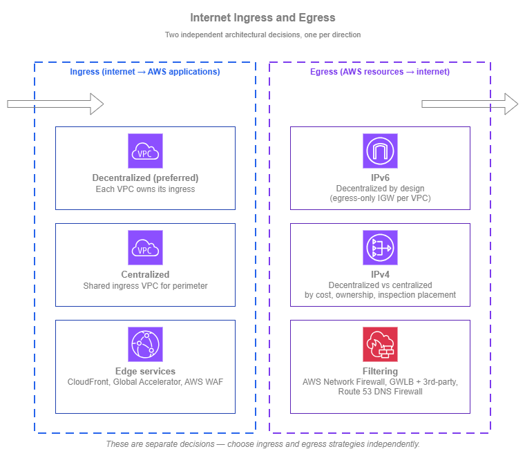
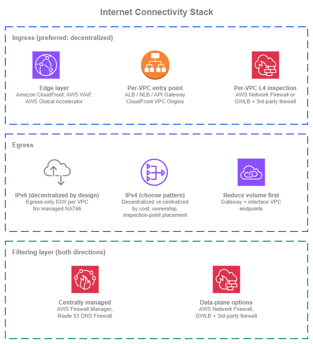

# インターネット接続 {#internet-connectivity}

!!! info "前提条件"
    このセクションでは、[Amazon VPC](../foundation/vpc.md)、[サブネット](../foundation/subnets.md)、および [AWS 内接続](within-aws.md)サービス(特に AWS Transit Gateway と AWS Cloud WAN)に精通していることを前提としています。AWS ネットワーキングの基礎を初めて学ぶ方は、先にそれらのトピックを確認してください。

インターネット接続には 2 つの異なる課題があり、それぞれに適したパターンは異なる基準によって決まります。**インバウンド接続(Ingress connectivity)**は、外部クライアントを AWS でホストされたアプリケーションへ誘導します。これには、450 か所以上のエッジロケーションを持つ Amazon CloudFront、マネージドルールグループに基づいてリクエストを評価する AWS WAF、および自動スケールする VPC ごとのロードバランサーが活用されます。**アウトバウンド接続(Egress connectivity)**は、AWS リソースが外部サービスへアクセスできるようにします。これには、1 ゲートウェイあたり最大 100 Gbps で IPv4 トラフィックを処理し GB 単位の処理料金が発生する NAT ゲートウェイ([NAT ゲートウェイの料金](https://aws.amazon.com/vpc/pricing/)を参照)、または無料で無制限の IPv6 アウトバウンドアクセスを提供する Egress-Only インターネットゲートウェイが使用されます。一方の決定がもう一方にそのまま適用されることはほとんどないため、このページではそれぞれを個別に扱います。

両方向に共通する選択肢が**集中型 vs. 分散型**です。インバウンドまたはアウトバウンドのトラフィックを共有 VPC とネットワークチームに集約するか、各アプリケーションを所有するチームに対してワークロードごとに分散させるかという判断です。この答えは方向によって異なります。インバウンドでは分散型がデフォルトとして推奨され、集中型は特定のケースに限定されます。アウトバウンドでは、コスト・運用上のオーナーシップ・検査ポイントの配置という観点で真のトレードオフが存在し、唯一の正解はありません。これらのパターンを組み合わせた推奨アーキテクチャについては、このページ末尾の「[インターネット接続スタックの構築](#building-your-internet-connectivity-stack)」を参照してください。

/// caption
インターネットのインバウンドとアウトバウンド — [Drawio ソース](../assets/connectivity/internet-ingress-egress.drawio)
///

インバウンドにおける分散型パターンでは、各アプリケーションのインターネット入口をワークロードを所有する VPC とアカウント内に配置します。アプリケーションチームは自身のロードバランサー、証明書、スケーリングの判断を管理し、あるチームのインバウンドに障害が発生しても他のチームには影響しません。集中管理された保護は、CloudFront、AWS WAF、および VPC ごとのレイヤー 3/4 検査(AWS Network Firewall、またはサードパーティファイアウォールアプライアンスを使用した [Gateway Load Balancer](https://docs.aws.amazon.com/elasticloadbalancing/latest/gateway/introduction.html))を通じて均一に適用され、これらはすべて [AWS Firewall Manager](https://docs.aws.amazon.com/waf/latest/developerguide/fms-chapter.html) によって一元管理されます。AWS エッジは事実上、一元管理されたグローバル分散型の境界となり、すべてのフローを共有リージョンインバウンド VPC 経由でルーティングするという従来の理由がなくなります。共有 VPC を通じた集中型インバウンドも選択肢として残りますが、ロードバランサーの連鎖、追加のトラフィック処理コスト、共有 VPC の障害影響範囲の拡大といったデメリットがあり、クラウドネイティブな分散型パターンがすでに提供している保護を超えるものは提供されません。

アウトバウンドの選択はより複雑で、IP バージョンによって分かれます。**IPv6 アウトバウンドは設計上分散型**です。各 VPC は独自の Egress-Only インターネットゲートウェイを通じてインターネットに接続し、集中管理できるマネージドな NAT66 は存在しません。**IPv4 アウトバウンド**は真の 50-50 の選択です。IPv4 を集中化すると、VPC ごとの [NAT ゲートウェイ](https://docs.aws.amazon.com/vpc/latest/userguide/vpc-nat-gateway.html)と検査エンドポイントを 1 つの共有アウトバウンド VPC に集約できますが、すべてのフローに Transit Gateway または AWS Cloud WAN のデータ処理料金が加算され、運用上のオーナーシップが中央チームに集中します。IPv4 を分散化すると、各 VPC はトランジットネットワーク料金なしで自己完結しますが、各 VPC が独自の NAT ゲートウェイのコストを負担し、必要に応じて VPC ごとの検査コストも発生します。均一なポリシーはどちらのパターンでも実現可能です。

## イングレス接続 {#ingress-connectivity}

イングレス (Ingress) とは、外部クライアントが AWS でホストするアプリケーションに到達する方法です。アーキテクチャパターンは大きく 2 つあります。**分散型** (各アプリケーションが独自のインターネット入口を持つ) と **集中型** (共有イングレス VPC が複数のアプリケーションの前段に置かれる) です。ほとんどの環境では、分散型がデフォルトとして適切です。集中型イングレスは特定のケースに限って正当化されるものであり、汎用的なベストプラクティスではありません。

これらのパターンはプロトコルにほぼ依存しませんが、各パターンを実装するサービスは **L7 トラフィック** (HTTP、HTTPS、gRPC の Web アプリケーション、REST API、その他のアプリケーション層ワークロード) と **L4 トラフィック** (ロードバランサーが HTTP を解釈せずにフォワードする必要がある TCP・UDP サービス。ゲーム、金融取引、カスタムプロトコル、エンドツーエンドでクライアント IP を保持する必要があるサービスなど) で異なります。以降の各サブセクションでは、両トラフィッククラスに対応するサービスを明示します。

!!! note "ベースライン DDoS 保護"
    [AWS Shield](https://docs.aws.amazon.com/waf/latest/developerguide/shield-chapter.html) Standard は、分散型・集中型のどちらのイングレスパターンを採用しているかにかかわらず、すべてのパブリック向け AWS エンドポイント (CloudFront ディストリビューション、Global Accelerator、ALB、NLB、Route 53、AWS API エンドポイント) に追加料金なしで自動的に適用されます。以下のパターンはアプリケーション層の保護とトラフィックシェーピングに焦点を当てており、ベースラインの帯域型 DDoS 防御はすでに適用済みです。

### 分散型イングレス (推奨) {#decentralized-ingress-preferred}

分散型モデルでは、インターネット向けアプリケーションをホストする各 VPC が自身のイングレスを所有します。アプリケーションチームはワークロードに合ったロードバランサーや API エンドポイントを選択し、AWS Certificate Manager を通じて独自の TLS 証明書を管理し、他のワークロードとは独立してイングレスをスケールできます。イングレスの設定ミスによる影響範囲は、そのアプリケーションに限定されます。

分散型イングレスに対してよく挙げられる懸念は、チームごとの所有がセキュリティ上のギャップを生むのではないかという点です。しかし、そうはなりません。すべてのワークロードの前段に一元的で均一な保護が適用されますが、それは共有イングレス VPC を通じてではなく、AWS エッジで行われます。

* L7 トラフィックの場合、[Amazon CloudFront](https://docs.aws.amazon.com/AmazonCloudFront/latest/DeveloperGuide/Introduction.html) と [AWS WAF](https://docs.aws.amazon.com/waf/latest/developerguide/waf-chapter.html) がすべてのディストリビューションに一貫したルールベースラインを適用します。
* L4 トラフィックの場合、各ワークロード VPC 内の **VPC ごとのファイアウォールエンドポイント** がインターネットゲートウェイとワークロードのエントリポイントの間でイングレストラフィックを検査します。選択肢は 2 つあります。AWS マネージドファイアウォールである [AWS Network Firewall](https://docs.aws.amazon.com/network-firewall/latest/developerguide/what-is-aws-network-firewall.html)、またはサードパーティ製ファイアウォールアプライアンスのフリートを前段に置く Gateway Load Balancer です。いずれの場合も、ルールセットは一元的に定義されます。

どちらの場合も、保護は一元的に定義・管理されており、分散されているのはデータプレーンです。AWS エッジと VPC ごとのファイアウォールエンドポイントが連携することで、完全に分散されながら一元管理された境界 (従来のネットワークにおける DMZ の役割) を実現します。これにより、すべてのフローを共有リージョン VPC 経由でルーティングする運用コストが不要になります。

**分散型が推奨される理由**:

*   :material-shield-check: **限定された障害ドメイン**

    ---

    リスナーの設定ミス、ターゲットグループのリソース枯渇、証明書の期限切れが発生しても、影響を受けるのは 1 つのアプリケーションのみであり、組織内のすべてのインターネット向けワークロードには波及しません。

*   :material-account-group: **チームの自律性と所有権**

    ---

    ワークロードを構築するアプリケーションチームが自身のイングレスも運用するため、日常的な変更を調整するためのクロスチーム依存が生じません。

*   :material-trending-up: **独立したスケーリング**

    ---

    各アプリケーションのイングレスは独自のトラフィックプロファイルに合わせてスケールするため、あるチームのトラフィックスパイクが他のチームに影響を与えません。

*   :material-tune: **ワークロードごとのチューニングと一元的な保護**

    ---

    証明書、リスナーポリシー、ターゲットグループはアプリケーションごとにチューニングされる一方、CloudFront、AWS WAF、VPC ごとのファイアウォール検査が組織全体で一貫したエッジおよび VPC 保護を提供します。

*   :material-routes: **シンプルなルーティング**

    ---

    クライアントは CloudFront 経由、または DNS 経由で直接アプリケーションに到達します。トランジットホップも、共有 VPC への依存も、デバッグが必要なトラフィックフローの複雑さもありません。

#### L7 トラフィック: 各オリジンの前段に CloudFront と AWS WAF を配置 {#l7-traffic-cloudfront-and-aws-waf-in-front-of-each-origin}

L7 トラフィックの推奨パターンは、**各オリジンの前段に Amazon CloudFront と AWS WAF を配置する**ことです。各アプリケーションチームが自身のオリジンを所有し、CloudFront は 3 種類のオリジンタイプをサポートします。Amazon S3 バケット (静的コンテンツ用)、ワークロードの VPC 内にあるプライベート (インターネット非公開) の [Application Load Balancer](https://docs.aws.amazon.com/elasticloadbalancing/latest/application/introduction.html) (ALB)、[Network Load Balancer](https://docs.aws.amazon.com/elasticloadbalancing/latest/network/introduction.html) (NLB)、または EC2 インスタンスを指す **VPC オリジン**、そして任意の HTTP/HTTPS パブリックエンドポイント向けの**カスタムオリジン**です。CloudFront と AWS WAF は一元的に管理され、すべてのディストリビューションに均一に適用されます。CloudFront はエッジで TLS を終端し、保護 (AWS WAF、HTTP/3、エッジ TLS) をユーザーの近くに集約します。AWS WAF はトラフィックがオリジン VPC に到達する前に、マネージドルールグループ、カスタムルール、レート制限に基づいて各リクエストを評価します。

**L7 イングレスのベストプラクティス**:

* **VPC でホストされるワークロードのデフォルトとして [CloudFront VPC Origins](https://docs.aws.amazon.com/AmazonCloudFront/latest/DeveloperGuide/private-content-vpc-origins.html) を使用する**。VPC Origins を使用すると、CloudFront はパブリック IP やパブリックサブネットへの配置なしにプライベートな ALB、NLB、または EC2 インスタンスに接続でき、CloudFront が唯一の経路となります。クロスアカウントの VPC オリジンは AWS Resource Access Manager (RAM) を通じてサポートされています。CloudFront を前段に置く新規の VPC ホスト L7 ワークロードにはこれを使用し、既存のパブリックオリジンの移行も検討してください。
* **TLS は CloudFront とオリジンのロードバランサーで終端し**、アプリケーションでは終端しない。ACM 発行の証明書は無料で自動更新され、一元的に監査可能です。CloudFront からオリジンへの再暗号化は、ワークロードのコンプライアンス要件がエンドツーエンド TLS を必要とする場合にのみ行います。
* **AWS WAF は AWS Firewall Manager を使用して一元管理する**。単一の Firewall Manager ポリシーが組織内のすべての CloudFront ディストリビューションと ALB に一貫したベースラインを適用しつつ、アプリケーションチームは独自のワークロードごとのルールを追加できます。
* **ワークロードに適したバックエンドサービスを選択する**。ALB はほとんどの HTTP/HTTPS Web アプリケーション、REST API、gRPC サービスに適しています。[Amazon API Gateway](https://docs.aws.amazon.com/apigateway/latest/developerguide/welcome.html) は、リクエスト検証、スロットリング、認可をイングレス層に組み込むことで恩恵を受ける API ファーストのワークロードに適しています。

#### L4 トラフィック: エッジまたは VPC 内保護を伴う VPC ごとのエントリポイント {#l4-traffic-per-vpc-entry-points-with-edge-or-in-vpc-protection}

一部のワークロードは HTTP を解釈するイングレスを使用できず、クライアントのソース IP とプロトコルをそのまま保持するレイヤー 4 のエントリポイントを必要とします。具体的には、HTTP 層の追加がレイテンシーを増加させるかプロトコルを破壊するリアルタイムゲーム、音声、映像、取引ワークロード、エンドツーエンドでソース IP によってクライアントを認証するワークロード、HTTP/HTTPS 以外のプロトコル (カスタムバイナリプロトコル、MQTT、SMTP、認可されたクライアントに公開されるデータベースプロトコル) を使用するサービス、プロトコルデコードなしにフォワードする必要がある高スループットの TCP または UDP などが該当します。

デフォルトの構成要素は、デフォルトでクライアントソース IP を保持しながら非常に高いスループットでレイヤー 4 の TCP、UDP、TLS 終端を処理する NLB と、大陸をまたいで分散したクライアントに対してエニーキャスト静的 IP と AWS グローバルエッジネットワークの恩恵を受ける TCP・UDP ワークロード向けの [AWS Global Accelerator](https://docs.aws.amazon.com/global-accelerator/latest/dg/what-is-global-accelerator.html) です。

L7 と同じ目標 (一元的な保護を伴うワークロードごとの所有) が適用されますが、セキュリティメカニズムは前段にあるエントリポイントによって異なります。

* **インターネット向け NLB (トラフィックがインターネットゲートウェイ経由で VPC に入る場合)**: 専用のファイアウォールサブネットに VPC ごとのファイアウォールエンドポイントをデプロイし、VPC イングレスルーティングを通じてインターネットゲートウェイと NLB の間に挿入します。IGW エッジルートテーブルは受信トラフィックをまずファイアウォールエンドポイントに向け、その後 NLB とワークロードサブネットに転送します。ファイアウォール層は AWS Network Firewall、またはサードパーティ製ファイアウォールアプライアンスのフリートを前段に置く Gateway Load Balancer であり、ルールセットは一元的に管理されます。
* **内部 NLB、ALB、または EC2 エンドポイントの前段に AWS Global Accelerator を配置する場合**: Global Accelerator からのトラフィックは、顧客のインターネットゲートウェイを経由せず AWS 内部ネットワーク経由でエンドポイントに配信されるため、上記の IGW + イングレスルーティングパターンは適用されません。適用される保護は、AWS Shield Standard (Global Accelerator に組み込み済み)、クライアント IP 保持 (NLB または EC2 エンドポイントで実際のクライアント IP を使用したセキュリティグループルールの記述が可能)、NLB 上のセキュリティグループ、エンドポイントが ALB の場合の AWS WAF です。より深いステートフル検査が必要な場合は、IGW ではなく、ロードバランサーサブネットとワークロードサブネットの間のサブネットレベルルーティングを通じて VPC 内に検査層を配置します。

どちらの場合も、一元化されているのはポリシーであり、分散されているのはデータプレーンです。

**L4 イングレスのベストプラクティス**:

* **NLB は複数のアベイラビリティーゾーンにデプロイし**、クロスゾーン負荷分散を有効にする (NLB ではデフォルトで無効)。クロスゾーンを有効にすることで、クライアントのゾーン間分布が不均一な場合でも負荷が均等化されます。
* **NLB の TLS リスナーは、ワークロードが本当に TCP レベルの TLS を必要とする場合にのみ使用する**。HTTPS ワークロードの場合、ALB の HTTP 対応終端 (通常は CloudFront の背後) の方が運用上シンプルです。
* **ソース IP 保持については意図的に判断する**。NLB はデフォルトでクライアント IP を保持するため、バックエンドのセキュリティグループはロードバランサーのアドレスではなくクライアント IP 範囲を許可する必要があります。アプリケーションが必要とするものに合ったロードバランサーを選択してください。
* **グローバルな L4 ユーザー向けには NLB の前段に Global Accelerator を配置する**。Global Accelerator のエニーキャスト IP は、CloudFront が L7 トラフィックに対して行うのと同様に、遠方のクライアントに対するインターネット経路の変動の影響を軽減します。Global Accelerator を使用する場合は、エンドポイントでクライアント IP 保持を有効にして、セキュリティグループが実際のクライアント IP を使用した IP ベースのルールを適用できるようにします。
* **検査パターンをエントリポイントに合わせる**。VPC ごとの AWS Network Firewall または GWLB + サードパーティファイアウォールエンドポイントは、トラフィックがインターネットゲートウェイ経由で入る場合 (NLB 直接イングレス) に機能します。Global Accelerator がエントリポイントの場合は、エッジ保護 (Shield Standard、クライアント IP 保持、セキュリティグループ、ALB エンドポイントの AWS WAF) を活用し、より深い検査が必要な場合は VPC 内のロードバランサーサブネットとワークロードサブネットの間に配置します。

### 集中型イングレス {#centralized-ingress}

集中型イングレスは、外部トラフィックをまず共有イングレス VPC に送り込み、そこで検査または共有 TLS 終端を経た後、内部ネットワーク (Transit Gateway または AWS Cloud WAN) を通じて適切なアプリケーション VPC に転送します。一般的な実装は 2 つあります。イングレス VPC 内の共有 ALB または NLB でワークロード VPC 内のバックエンドターゲットを使用するパターン、またはその共有ロードバランサーの前段にサードパーティ製ファイアウォールを伴う Gateway Load Balancer を配置するパターンです。

!!! danger "AWS ではほとんどの場合に適さないパターン"
    集中型イングレスは、すべての受信トラフィックが通過しなければならない境界 DMZ というオンプレミスの考え方を、同じセキュリティ目標を上述の分散型 + CloudFront + AWS WAF + VPC Origins パターンでより適切に達成できるクラウド環境に適用したものです。Firewall Manager を通じて一元管理される VPC ごとのファイアウォールエンドポイント (AWS Network Firewall または Gateway Load Balancer + サードパーティファイアウォールアプライアンス) は、L4 で同等の成果を達成します。どちらの場合も、保護は一元的に定義・管理されており、分散されているのはデータプレーンです。これこそがクラウドネイティブパターンを機能させる要素です。

AWS における集中型イングレスのトレードオフは現実のものです。

*   :material-link-variant: **ロードバランサーの連鎖**

    ---

    クロス VPC の ELB ターゲットグループは **IP ターゲットのみ** です (インスタンスおよび ALB ターゲットタイプは同一 VPC 内のみ)。共有イングレス VPC から動的なワークロードバックエンドにトラフィックを配信するには、各ワークロード VPC が通常、共有 LB に安定した IP ターゲットを提供するために独自の内部 NLB (L7 トラフィックの場合は ALB も) を実行する必要があります。トラフィック経路は、クライアント → エッジ → イングレス VPC ALB/NLB → Transit Gateway または AWS Cloud WAN 経由の IP ターゲット → ワークロード VPC NLB → ALB (L7 の場合) → ワークロードコンピュートとなります。各ホップはサイジングが必要な別のコンポーネントであり、デバッグが必要な別の障害モードであり、ターゲットグループ、リスナールール、証明書の同期を維持しなければならない別の箇所です。

*   :material-cash-multiple: **追加のトラフィック処理コスト**

    ---

    トラフィックはイングレスロードバランサー、検査層、そしてワークロード側ロードバランサーに加えて Transit Gateway または AWS Cloud WAN のデータ処理によって処理されます。分散型パターンでは同じフローが CloudFront で 1 回、オリジンで 1 回処理されるだけです。

*   :material-bullseye-arrow: **共有 VPC の影響範囲**

    ---

    イングレス VPC への変更はすべての利用アプリケーションに影響します。メンテナンスウィンドウ、変更管理、ロールバック手順がすべてチームごとではなく組織全体のものになります。

*   :material-account-cog: **運用上の所有権の集中**

    ---

    イングレス VPC を運用するネットワークチームが、インターネットに何かを公開したいすべてのアプリケーションの調整ボトルネックになり、アプリケーションチームの開発速度を妨げます。

これらのトレードオフは理論上のものではなく、集中型イングレスのデプロイが最終的に分解される最も一般的な理由です。

!!! info "集中型イングレスが正当化される場合"
    採用する前に、以下の特定の要因が本当に当てはまること、かつ分散型パターンではそれを満たせないことを確認してください。

    * **特定のコンプライアンス基準が、CloudFront の前段でネイティブに利用できない特定のプロキシ層を義務付けている**、または VPC ごとのファイアウォールアーキテクチャを許可していない。
    * **プライベート CA による集中型 TLS 終端**がすべてのインターネット向けサービスで必要であり、アプリケーションごとの証明書再発行が許容されない。
    * **単一の監査済みインターネット公開サーフェス**が、技術的なセキュリティ成果とは独立したポリシー上の選択として義務付けられている。

    これらのいずれも当てはまらない場合、分散型イングレスが正しい選択です。集中型パターンを動機付けるはずの一元的な保護を、共有イングレス VPC の運用コストなしに実現できます。

!!! tip "集中型イングレスを採用する場合"

    * **検査は集中型レイヤーで適用し、下流で再度行わない**。共有 ALB 上の AWS WAF、またはインターネットゲートウェイと共有 NLB の間へのファイアウォール挿入 (AWS Network Firewall または Gateway Load Balancer + サードパーティファイアウォールアプライアンス) により、集中型パターンを動機付ける一元的な保護が得られます。トラフィックが Transit Gateway または AWS Cloud WAN を経由してワークロード VPC に入る際に再度検査しても、実際のセキュリティは向上しません (トラフィックはすでに検査済みです)。また、すべてのフローに対して別の検査層のコストと運用サーフェスが追加されます。
    * **共有レイヤーの ALB および NLB のクォータを監視する**。ロードバランサー自体は自動的にスケールしますが、LB ごとのクォータはイングレスを共有するすべてのアプリケーションによって消費されるため、単一のアプリケーションのオンボーディングで共有 LB が制限を超える可能性があります。CloudWatch で各イングレス LB のクォータ使用量を追跡し、ワークロードのオンボーディングが失敗した時点ではなく、事前に制限引き上げをリクエストしてください。
    * **イングレス VPC への変更は厳格な変更管理で扱う**。イングレス VPC は多くのアプリケーションにとって唯一のインターネットエントリポイントとなるため、ルーティング、リスナールール、証明書、または検査ポリシーに影響する変更は組織全体に影響します。ピアレビュー、段階的リリース (下位環境のイングレスを先に、本番を最後に)、イングレス LB が許可する場合のカナリアまたは重み付きターゲットデプロイ、自動ロールバックパスを使用してください。目標は、集中型レイヤーを日常的なオンボーディングに対して十分に動的に保ちながら、単一の変更が複数アプリケーションにまたがるインシデントになることを防ぐことです。

## エグレス接続 {#egress-connectivity}

エグレス (Egress) とは、AWS リソースがインターネット上の外部サービスに到達する方法です。エグレスの設計判断は、ワークロードが使用する IP バージョンによって異なります。IPv4 と IPv6 では、AWS におけるエグレスパスが根本的に異なるためです。

* **IPv6 の場合、エグレスは本質的に分散型です**。各 VPC は、自身の [egress-only internet gateway](https://docs.aws.amazon.com/vpc/latest/userguide/egress-only-internet-gateway.html) を通じてインターネットに到達します。これは IPv6 における「プライベートサブネット + NAT」に相当するもので、アウトバウンド専用、ギガバイト単位の課金なし、データパスに NAT なしという特徴があります。IPv6 向けの AWS マネージド NAT は存在せず、egress-only internet gateway は自身の VPC にローカルです (VPC A のワークロードが VPC B の egress-only internet gateway を経由して IPv6 トラフィックをルーティングすることはできません)。以降で説明する分散型 vs 集中型の議論は、ほぼすべて IPv4 に適用されます。
* **IPv4 の場合、エグレスには NAT が必要**であり、これにより実際のアーキテクチャ上の選択が生まれます。各ワークロード VPC で NAT ゲートウェイを実行する (分散型) か、Transit Gateway または AWS Cloud WAN を経由して共有エグレス VPC に IPv4 エグレスを集約する (集中型) かです。これは 3 つの次元にわたる真の 50-50 のトレードオフであり、すべての組織に対して唯一の正解はありません。

IPv4 のトレードオフ:

* **コスト**: すべてのフローにはコスト構造があります。分散型モデルでは、各ワークロード VPC が独自の NAT ゲートウェイと (使用する場合) 独自の AWS Network Firewall または Gateway Load Balancer エンドポイントを実行するため、VPC ごとの時間単位の料金と処理料金が積み重なります。集中型にすると、これらを単一のエグレス VPC に集約できますが、すべてのフローがその VPC に到達するために Transit Gateway または AWS Cloud WAN のデータ処理料金も発生します。どちらのパターンが安価かは、実行する VPC の数とエグレス量によって異なります。
* **運用上のオーナーシップ**: NAT ゲートウェイを誰が管理し、誰が費用を負担し、エグレスが壊れたときに誰がチケットを処理するか。集中型にすると、これをネットワークチームまたはプラットフォームチームに集約できます。分散型にすると、各アプリケーションチームに委ねることになります。
* **インスペクションポイントの配置**: 分散型データプレーンでも、複数の AWS Network Firewall または Gateway Load Balancer エンドポイント (単一のファイアウォールフリート) と Route 53 DNS Firewall (アウトバウンドドメインルール用) を使用することで、統一されたポリシーを適用できます。集中型にすると、1 つの VPC 内の 1 つの物理的なインスペクションレイヤーに集約されます。どちらも一貫したポリシーを実現しますが、インスペクションポイントが論理的 (複数の VPC に分散した 1 セットのマネージドルールセット) か物理的 (すべてのフローが通過する 1 つの共有アプライアンスフリート) かという点で異なります。

正解は、これらの次元のどれが組織にとって最も重要かによって異なります。以降のサブセクションでは、各パターンとそれに伴う設計上の選択について詳しく説明します。

IP バージョンやパターンに関わらず、あらゆるエグレス戦略における最初の判断は、**NAT を行う場所を決める前にエグレス量を削減すること**です。パブリックな AWS エンドポイントに到達するために NAT ゲートウェイを経由する AWS API トラフィックは、最も一般的な回避可能なコストです。Amazon S3 と Amazon DynamoDB 向けのゲートウェイ [VPC エンドポイント (AWS PrivateLink)](https://docs.aws.amazon.com/vpc/latest/privatelink/what-is-privatelink.html) は無料であり、ワークロードが最も使用する AWS サービス (STS、KMS、ECR、Systems Manager、CloudWatch Logs など) 向けのインターフェイス VPC エンドポイントはそのトラフィックをプライベートに保ちます。これは集中型または分散型エグレスのどちらを選択した場合にも適用され、トラフィックをエグレスパスから完全に排除します。

### リージョン型とゾーン型 NAT ゲートウェイの選択 (IPv4) {#choose-between-regional-and-zonal-nat-gateway-ipv4}

IPv4 エグレスにおいて、分散型 vs 集中型を選択する前に、使用する NAT ゲートウェイの可用性モードを決定します。AWS NAT ゲートウェイには 2 つのモードがあります。**ゾーン型**モード (アベイラビリティーゾーンごとに 1 つの NAT ゲートウェイをパブリックサブネットに配置し、各アベイラビリティーゾーンのプライベートサブネットをローカルの NAT ゲートウェイ経由でルーティングするルートテーブルエントリを設定) と、新しい**リージョン型**モード (ワークロードの存在に基づいてアベイラビリティーゾーン間で自動的に拡張・縮小する単一の NAT ゲートウェイ ID で、パブリックサブネットが不要で、アベイラビリティーゾーンごとの IP とポートの上限が高い) です。

推奨事項は明確です。

* **グリーンフィールドデプロイメントでは、デフォルトでリージョン型 NAT ゲートウェイを使用してください**。すべてのアベイラビリティーゾーンにわたる単一の NAT ゲートウェイ ID により、ルートテーブルの設計が簡素化され、アベイラビリティーゾーンごとにパブリックサブネットを維持する必要がなくなり (これにより誤った公開リスクのクラスが排除されます)、手動での再プロビジョニングなしにアベイラビリティーゾーンごとの IP 割り当てをスケールできます。リージョン型 NAT ゲートウェイは、新しい VPC に推奨されるオプションです。
* **ゾーン型 NAT ゲートウェイを実行している既存のデプロイメントでは、移行する強い理由はありません**。ゾーン型 NAT ゲートウェイは引き続き完全にサポートされており、すでにルーティングとパブリックサブネットが整っている環境では切り替えの運用上のメリットは小さいです。新しい VPC を作成する際にリージョン型 NAT ゲートウェイを採用し、既存のものはそのまま運用してください。
* **プライベート NAT (ハイブリッドユースケース向けのプライベートサブネット内の NAT ゲートウェイ) では、引き続きゾーン型モードを使用してください**。リージョン型 NAT ゲートウェイは一般的なエグレスに推奨されますが、プライベート接続シナリオでは引き続きゾーン型モードに依存します。

この選択は、IPv4 エグレスを分散型で実行するか集中型で実行するかとは独立しています。これはどちらのパターンにも適用される NAT ゲートウェイの可用性モードの決定です。

### 分散型 IPv4 エグレス {#decentralized-ipv4-egress}

分散型 IPv4 モデルでは、インターネットエグレスが必要な各 VPC が独自の NAT ゲートウェイと独自のエグレスポリシーを実行します。プライベートサブネットからのトラフィックは、トランジットホップや共有依存関係なしに、その VPC のインターネットゲートウェイを通じて直接パブリックインターネットに到達します。これは IPv6 パス (VPC ごとのエグレス、トランジットネットワーク処理なし) と同じ形状であり、デュアルスタックワークロードが両方の IP バージョンに対して単一の VPC ローカルパターンを使用できることを意味します。

ベストプラクティス:

* **AZ 冗長な NAT キャパシティをデプロイしてください**。リージョン型 NAT ゲートウェイでは、これは自動的に行われます。ゾーン型 NAT ゲートウェイでは、アベイラビリティーゾーンごとに 1 つデプロイし、各アベイラビリティーゾーンのプライベートサブネットをローカルの NAT ゲートウェイ経由でルーティングしてください。単一のゾーン型 NAT ゲートウェイは、その VPC のエグレスにおける単一障害点です。AZ を意識したゾーン設計によりそのリスクを排除し、クロスゾーンのデータ転送を最小限に抑えます。
* **VPC エンドポイントを使用して NAT ゲートウェイのトラフィックを削減してください**。S3 と DynamoDB 向けのゲートウェイエンドポイントは無料で、そのトラフィックを NAT パスから完全に排除します。トラフィックの多い AWS サービス向けのインターフェイスエンドポイントは、NAT 処理料金の節約によって費用対効果が高いことが多いです。
* **VPC レイヤーでエグレスポリシーを適用してください**。ワークロードのセキュリティグループ、必要な CIDR のみを NAT パスに向けるルートテーブル、粗い第 2 レイヤーとしての NACL を使用します。宛先ベースのフィルタリング (特定のドメインや IP) には、Route 53 DNS Firewall、AWS Network Firewall、またはワークロード VPC 内のサードパーティファイアウォールを使用した Gateway Load Balancer を使用し、ルールセットは AWS Firewall Manager を通じて一元管理してください。

### 集中型 IPv4 エグレス {#centralized-ipv4-egress}

集中型 IPv4 モデルでは、共有エグレス VPC が多くのワークロード VPC のインターネットエグレスを担います。ワークロード VPC からの IPv4 トラフィックは、Transit Gateway または AWS Cloud WAN を経由してエグレス VPC にルーティングされ、その後 NAT ゲートウェイを通じてインターネットに到達します。エグレス VPC は通常、共有フィルタリング (AWS Network Firewall、サードパーティファイアウォールを使用した Gateway Load Balancer) もホストし、すべてのワークロードに対して単一のエグレスポリシーが適用されます。このパターンは IPv4 のみに適用されます。IPv6 エグレスは、egress-only internet gateway が VPC ごとであり、AWS がマネージドな NAT66 の代替を提供していないため、すべての利用 VPC で分散型のままです。

ベストプラクティス:

* **エグレス VPC をネットワークチームまたはプラットフォームチームが所有する共有サービスとして運用してください**。アプリケーションチームはエグレス VPC を変更せず、Transit Gateway または AWS Cloud WAN アタッチメントを通じて利用します。
* **最低でも AWS リージョンごとに 1 つのエグレス VPC を使用してください**。単一のグローバルエグレス VPC にリージョンをまたいでエグレスをルーティングすることは、コストとレイテンシーの観点からほとんどの場合に見合いません。AWS Cloud WAN を使用すると、リージョンごとのエグレス VPC を単一のネットワークポリシーで管理できます。
* **エグレスパスで NAT の前にインスペクションレイヤーを配置してください**。典型的なレイアウトは、ワークロード VPC → Transit Gateway または AWS Cloud WAN → エグレス VPC 内の AWS Network Firewall またはサードパーティファイアウォールを使用した Gateway Load Balancer → NAT ゲートウェイ → インターネットゲートウェイです。NAT の前にインスペクションを行うことで元の VPC ソース IP が保持され、VPC ごとのポリシーとフォレンジック分析において重要です。
* **共有インスペクションレイヤーを AZ 冗長にデプロイしてください**。AWS Network Firewall と GWLB フロントのサードパーティファイアウォールフリートはどちらもマルチ AZ デプロイメントをサポートしています。これを活用してください。単一 AZ のインスペクションレイヤーは、エグレス VPC を利用するすべてのワークロードにとっての単一障害点です。
* **スループットに加えて、インスペクションレイヤーのドロップ数とパス数にアラームを設定してください**。ドロップの急増は、利用しているワークロードがエグレスプロファイルを変更したことを示すことが多く、それを素早く検知することが、誤設定されたポリシーを修正するか混乱したアプリケーションチームを追いかけるかの違いになります。
* **運用上のオーナーシップの境界を文書化してください**。アプリケーションチームは、自分たちが所有するエグレス操作 (ワークロードのアウトバウンドトラフィックプロファイル、リクエストするアローリスト) と、中央チームが所有するもの (インスペクションルール、ポリシーの適用) を把握している必要があります。

### 分散型 vs 集中型 IPv4 エグレスの比較 {#comparing-decentralized-vs-centralized-ipv4-egress}

インターネットへの入口 (イングレス) とは異なり、分散型がほぼ常に正しいデフォルトであるのに対し、IPv4 エグレスは技術的な要因と同様に組織的な要因によって決まる真の 50-50 の判断です。以下の表は、各パターンが通常の判断基準となる次元をどのように扱うかをまとめたものです。この判断は IPv4 のみに適用されることを忘れないでください。IPv6 エグレスはどちらの場合も分散型です。

| 次元 | 分散型 IPv4 エグレス | 集中型 IPv4 エグレス |
| --- | --- | --- |
| **VPC ごとのコストオーバーヘッド** | 各 VPC が独自の NAT ゲートウェイと (使用する場合) 独自の AWS Network Firewall または Gateway Load Balancer エンドポイントの費用を負担します。直接 IGW 経由の出口のため、トランジットネットワークのデータ処理料金は発生しません | 1 つの共有エグレス VPC が、利用するワークロード数に関わらず NAT とインスペクションエンドポイントのコストを吸収しますが、すべてのフローがエグレス VPC に到達するために Transit Gateway または AWS Cloud WAN のデータ処理料金も発生します |
| **運用上のオーナーシップ** | 各アプリケーションチームが独自のエグレスパス、アローリスト、および費用を所有します | ネットワークチームまたはプラットフォームチームがエグレス VPC を所有し、アプリケーションチームは共有サービスとして利用します |
| **インスペクションポイントの配置** | 管理プレーンでは集中型、データプレーンでは分散型: AWS Network Firewall と Gateway Load Balancer のルールセットは一元管理され、[Route 53 DNS Firewall](https://docs.aws.amazon.com/Route53/latest/DeveloperGuide/resolver-dns-firewall.html) はすべての VPC に単一のドメインルールセットを適用します。すべてのフローを 1 つのエグレス VPC に強制することなく、同じ統一ポリシーを適用できます | 両プレーンで集中型: 1 つのエグレス VPC 内の 1 つのインスペクションレイヤーがすべてのフローを確認します。セキュリティベースラインが論理的なものではなく単一の物理的なインスペクションポイントを義務付けている場合に有効です |
| **障害ドメイン** | エグレスの問題は 1 つの VPC に影響します | 共有エグレス VPC でのエグレスの問題や変更は、すべての利用ワークロードに影響します |
| **インスペクションカバレッジ** | VPC ごとの AWS Network Firewall またはサードパーティファイアウォールを使用した Gateway Load Balancer を、ワークロードが必要とする場所にのみ配置します | エグレス VPC 内の 1 つの共有インスペクションレイヤーが、すべてのフローに均一に適用されます |
| **デュアルスタックの一貫性** | IPv4 と IPv6 の両方が VPC ごとに出口を持つため、両プロトコルでエグレスの形状が同一となり、ワークロード VPC が両方のパスを所有します | IPv4 は Transit Gateway または AWS Cloud WAN を経由して共有エグレス VPC に到達しますが、IPv6 は引き続き egress-only internet gateway を通じて VPC ごとに出口を持ちます。デュアルスタックワークロードでは、オペレーターが 2 つの異なるエグレスパターンを同時に運用することになります |
| **レイテンシーオーバーヘッド** | 直接 IGW 経由の出口で、トランジットホップなし | すべての IPv4 フローに Transit Gateway または AWS Cloud WAN のホップとインスペクション処理が追加されます |
| **最適なユースケース** | 小規模な環境、チームの自律性を重視する組織、レイテンシーまたはスループットに敏感なワークロード、単一のエグレス形状が好まれる IPv6 ファーストまたはデュアルスタックワークロード、互いに根本的に異なるエグレスポリシーが必要なアプリケーション | IPv4 トラフィックにおけるスケールでのコスト圧力 (数十または数百の VPC)、IPv4 向けの単一物理インスペクションポイントの義務付け、中央集権的なセキュリティオーナーシップ、IPv4 エグレスを共有プラットフォームサービスとして運用する組織 |

### 今後の展望: AWS Network Firewall Proxy (パブリックプレビュー) {#looking-ahead-aws-network-firewall-proxy-public-preview}

[AWS Network Firewall Proxy](https://aws.amazon.com/about-aws/whats-new/2025/11/aws-network-firewall-proxy-preview/) は、アウトバウンド Web トラフィック向けのマネージドな**明示的フォワードプロキシ**で、現在パブリックプレビュー中です。これは AWS Network Firewall やサードパーティファイアウォールを使用した Gateway Load Balancer (データパスに透過的に配置される) の代替ではなく、異なる抽象化レベルで動作します。このプロキシは、インターネットまたはオンプレミスの宛先への HTTP CONNECT リクエストを明示的にプロキシし、各リクエストの 3 つのフェーズ (PreDNS、PreRequest、PostResponse) でルールを評価することで、各ワークロードがアクセスできる宛先をリクエストレベルで細かく制御できます。

このサービスが置き換えるパターンは、**セルフホスト型フォワードプロキシフリート** (明示的なエグレスフィルタリングのために組織が従来運用してきた EC2 上の Squid クラスターやコンテナベースのプロキシフリート) です。AWS Network Firewall と GWLB + サードパーティファイアウォールがエグレスパスでパケットレベルのインスペクションを提供するのに対し、このプロキシはリクエストレベルのルールを持つアプリケーション対応のプロキシ機能を提供します。

このサービスはパブリックプレビュー中であるため、本稿執筆時点では機能、サポートされる設定、およびリージョンの可用性が限定されています。組織において明示的なフォワードプロキシのセマンティクスが要件である場合は、AWS Network Firewall Proxy を今すぐ評価を開始するパターンとして位置づけ、サービスが一般提供 (GA) に達した際により広く採用することを視野に入れてください。

### イングレスとエグレスパターンの組み合わせ {#combining-ingress-and-egress-patterns}

イングレスとエグレスは独立した判断です。ワークロードは分散型イングレスと集中型エグレスを組み合わせることも、その逆も可能です。最もよく見られる組み合わせは次のとおりです。

* **分散型イングレス + 分散型エグレス**は最もシンプルなパターンで、小規模な環境や完全なオーナーシップを求めるアプリケーションチームの典型的なデフォルトです。
* **分散型イングレス + 集中型エグレス**は大規模な組織でよく見られます。各アプリケーションが公開向けのエントリポイントを所有しつつ、IPv4 エグレスを集約して VPC ごとの NAT とインスペクションコストを 1 つの共有エグレス VPC に吸収します。
* **集中型イングレス + 集中型エグレス**は、境界インスペクションとアウトバウンドトラフィックへの単一物理インスペクションポイントの両方が義務付けられているコンプライアンス主導の環境に見られます。両方向が同じ運用上の依存関係とオーナーシップモデルを共有します。
* **集中型イングレス + 分散型エグレス**はまれです。インバウンドトラフィックへの境界インスペクションが集中型を正当化するなら、通常は同じ理由がアウトバウンドトラフィックにも適用されます。純粋な非対称性は珍しいです。

## ドキュメント {#documentation}

このページで参照しているサービスを、登場箇所ごとにまとめています。

| サービス | このページでの役割 | ドキュメント |
| --- | --- | --- |
| Amazon CloudFront | イングレス: すべてのワークロード向け L7 エッジ | [ドキュメント](https://docs.aws.amazon.com/AmazonCloudFront/latest/DeveloperGuide/Introduction.html) |
| CloudFront VPC Origins | イングレス: CloudFront の背後にあるプライベート ALB、NLB、または EC2 オリジン | [ドキュメント](https://docs.aws.amazon.com/AmazonCloudFront/latest/DeveloperGuide/private-content-vpc-origins.html) |
| AWS WAF | イングレス: CloudFront、ALB、API Gateway 上のマネージド L7 保護 | [ドキュメント](https://docs.aws.amazon.com/waf/latest/developerguide/waf-chapter.html) |
| Application Load Balancer | イングレス: ワークロード VPC 内の L7 エントリポイント | [ドキュメント](https://docs.aws.amazon.com/elasticloadbalancing/latest/application/introduction.html) |
| Network Load Balancer | イングレス: ワークロード VPC 内の L4 エントリポイント | [ドキュメント](https://docs.aws.amazon.com/elasticloadbalancing/latest/network/introduction.html) |
| Amazon API Gateway | イングレス: API ファーストなワークロード向けマネージド L7 イングレス | [ドキュメント](https://docs.aws.amazon.com/apigateway/latest/developerguide/welcome.html) |
| AWS Global Accelerator | イングレス: グローバルクライアントを持つ L4 ワークロード向けエニーキャスト静的 IP | [ドキュメント](https://docs.aws.amazon.com/global-accelerator/latest/dg/what-is-global-accelerator.html) |
| NAT gateway | エグレス (IPv4): リージョンモードまたはゾーンモードのマネージド NAT | [ドキュメント](https://docs.aws.amazon.com/vpc/latest/userguide/vpc-nat-gateway.html) |
| Egress-only internet gateway | エグレス (IPv6): VPC ごとのアウトバウンド IPv6 パス | [ドキュメント](https://docs.aws.amazon.com/vpc/latest/userguide/egress-only-internet-gateway.html) |
| Route 53 DNS Firewall | エグレス: VPC をまたいだドメインベースのアウトバウンドフィルタリング | [ドキュメント](https://docs.aws.amazon.com/Route53/latest/DeveloperGuide/resolver-dns-firewall.html) |
| AWS Network Firewall Proxy *(プレビュー)* | エグレス: マネージド明示的フォワードプロキシ | [お知らせ](https://aws.amazon.com/about-aws/whats-new/2025/11/aws-network-firewall-proxy-preview/) |
| VPC endpoints (AWS PrivateLink) | エグレス: AWS サービスのトラフィックをエグレスパスから切り離す | [ドキュメント](https://docs.aws.amazon.com/vpc/latest/privatelink/what-is-privatelink.html) |
| AWS Network Firewall | イングレス + エグレス: マネージドステートフルファイアウォール | [ドキュメント](https://docs.aws.amazon.com/network-firewall/latest/developerguide/what-is-aws-network-firewall.html) |
| Gateway Load Balancer | イングレス + エグレス: サードパーティファイアウォール向けの透過的な挿入ポイント | [ドキュメント](https://docs.aws.amazon.com/elasticloadbalancing/latest/gateway/introduction.html) |
| AWS Firewall Manager | イングレス + エグレス: AWS WAF、Network Firewall、GWLB の集中ルールセット管理 | [ドキュメント](https://docs.aws.amazon.com/waf/latest/developerguide/fms-chapter.html) |
| AWS Shield | ベースライン: Shield Standard はすべてのパブリック AWS エンドポイントに自動適用。上位の DDoS 対策には Shield Advanced を使用 | [ドキュメント](https://docs.aws.amazon.com/waf/latest/developerguide/shield-chapter.html) |

## インターネット接続スタックの構築 {#building-your-internet-connectivity-stack}

実際のインターネット接続戦略は、主に独立した 2 つの次元における選択を組み合わせます。イングレス（ワークロードごとに分散型か集中型か）とエグレス（IPv6 は分散型のまま、IPv4 はトレードオフによって分散型か集中型かを選択）です。それぞれの決定は独立したメリットに基づいて行います。

/// caption
インターネット接続スタック — [Drawio ソース](../assets/connectivity/internet-stack.drawio)
///

### 新規環境 {#new-environments}

クリーンな状態からインターネット接続を構築する組織は、スケールし、クラウドネイティブモデルに忠実なパターンから始めることができます。

1. **デフォルトとしての分散型イングレス**。各アプリケーションチームが自身の公開エントリポイントを所有します。L7 ワークロードの前段には Amazon CloudFront と AWS WAF を使用し（VPC ホスト型バックエンドには CloudFront VPC Origins を使用）、L4 ワークロードの前段には NLB または AWS Global Accelerator を使用します。L4 インスペクションが必要な箇所には VPC ごとの AWS Network Firewall または GWLB と サードパーティファイアウォールエンドポイントを適用し、ルールセットは AWS Firewall Manager を通じて一元管理します。
2. **ワークロードが対応している場合は IPv6 ファーストのエグレス**。各 VPC は独自の Egress-Only Internet Gateway を通じてインターネットに接続します。マネージドな NAT66 は存在しないため、IPv6 エグレスはどこでも分散型になることを前提に計画し、そのシンプルさを IPv6 採用の判断材料にしてください。
3. **すべての新規 VPC における IPv4 エグレス用のリージョン NAT Gateway**。VPC ごとに単一の NAT Gateway ID を使用し、パブリックサブネットが不要で、ルーティングがシンプルになります。
4. **初日から IPv4 エグレスのトラフィック量を削減**。すべての VPC に S3 と DynamoDB 向けの Gateway VPC エンドポイントを無料で設定します。ワークロードが最も頻繁に呼び出す AWS サービスには Interface VPC エンドポイントを使用します。
5. **組織の適合性に基づいて IPv4 エグレスパターンを選択**。チームの自律性、デュアルスタックの対称性、またはレイテンシの感度を重視する場合は分散型を選択します。大規模なコスト圧力や単一の物理インスペクションポイントが必要な場合は集中型を選択します。どちらも均一なポリシーを実現します。分散型の場合は AWS Firewall Manager と Route 53 DNS Firewall を通じて、集中型の場合は共有インスペクションレイヤーを通じて実現します。

### 既存環境 {#existing-environments}

確立されたインターネット接続を運用している組織には、置き換える必要のない動作中のパターンがあります。

1. **既存の分散型イングレス**は変更なしで継続して機能します。CloudFront + AWS WAF + AWS Firewall Manager のパターンはあらゆるアカウントトポロジーに適合します。新規に作成する VPC ホスト型 L7 ワークロードには CloudFront VPC Origins を採用し、運用ウィンドウが許す範囲で既存のパブリックオリジンを CloudFront の背後に移行することを検討してください。
2. **共有 VPC を通じた既存の集中型イングレス**は、特定のコンプライアンス要件のために採用された箇所では引き続き運用できます。新規ワークロードはデフォルトで分散型とし、集中型は元々必要としていたワークロードのためにそのまま維持します。
3. **既存のゾーナル NAT Gateway** は完全にサポートされており、リージョナルモードへの移行は不要です。新規 VPC の作成時にはリージョナル NAT Gateway をデフォルトとして採用し、既存のゾーナルデプロイメントはそのまま運用し続けてください。
4. **既存の集中型 IPv4 エグレス VPC** はその役割を維持します。集中型インスペクションレイヤーを経由する必要のないトラフィック（DNS ベースのフィルタリング、ワークロードごとのルール）に対して均一なポリシー適用を拡張するため、利用側 VPC 全体に Route 53 DNS Firewall と AWS Firewall Manager 管理のルールセットを追加します。
5. **IPv6 の採用を計画的に進める**。IPv6 エグレスは設計上分散型であり、セルフホスト型の NAT66 なしには集中型モデルに後付けすることはできません。各アプリケーションがデュアルスタック化を開始する時期と方法を決定する際には、この点を考慮してください。
