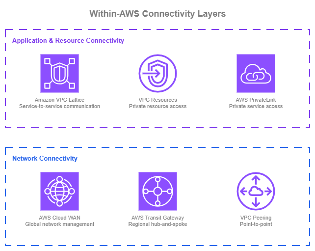
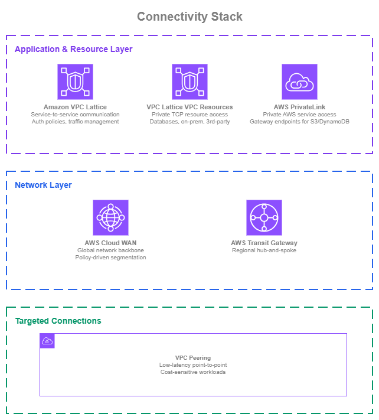

# AWS 内の接続性 {#connectivity-within-aws}

!!! info "前提条件"
    このセクションでは、[Amazon VPC](../foundation/vpc.md)、[CIDR 計画](../foundation/cidr.md)、および [AWS Organizations](../foundation/organizations.md) に関する知識を前提としています。AWS ネットワーキングの基礎を初めて学ぶ方は、先にそれらのトピックをご確認ください。

AWS 内で VPC とサービスを接続する際、単一のサービスだけで完結することはほとんどありません。AWS は異なるレイヤーで動作する 6 つの接続サービスを提供しています。単一の宣言型ポリシーで 30 以上のリージョンにわたるグローバルトポロジーを管理する AWS Cloud WAN から、CIDR の調整不要で IAM ベースの認証によりサービス間の HTTP/gRPC 通信を処理する Amazon VPC Lattice、特定の VPC ペア間でリージョン内のデータ転送コストをゼロにする VPC Peering まで、多岐にわたります。成熟した AWS ネットワークは、これらのサービスを同時に組み合わせて使用します。各サービスは最も価値を発揮するレイヤーで活用されます。すなわち、ネットワークレベルの接続性(VPC 同士がどのようにトラフィックをルーティングするか)、アプリケーションレベルのサービス通信(サービスがどのように互いを検出して通信するか)、そしてプライベートリソースアクセス(ワークロードがデータベースなどの特定のネットワークリソースにどのようにアクセスするか)です。

/// caption
AWS 内接続レイヤー — [Drawio ソース](../assets/connectivity/within-aws-layers.drawio)
///

最もシンプルなケースでは、2 つの VPC を接続するのに [VPC Peering](https://docs.aws.amazon.com/vpc/latest/peering/what-is-vpc-peering.html) 接続だけで十分です。直接的で低コストであり、ポイントツーポイント通信に効果的です。VPC とアカウントの数が増えるにつれて、[AWS Transit Gateway](https://aws.amazon.com/transit-gateway/) を使ったハブアンドスポークモデルにより、リージョン内のルーティングを一元化し管理を簡素化できます。ネットワーク全体で一貫したセグメンテーションポリシー、アタッチメント操作の自動化、および集中ガバナンスが必要になった場合、[AWS Cloud WAN](https://aws.amazon.com/cloud-wan/) が単一のポリシー駆動型コントロールプレーンのもとでそれらを実現します。これは単一リージョンで運用する場合でも、複数リージョンにまたがる場合でも同様です。AWS Cloud WAN のネットワークポリシーはトポロジーを宣言的に定義するため、VPC の追加、セグメント分離の適用、ルーティングの管理が、個々の Transit Gateway に対する手動設定ではなくポリシー変更によって行えます。

アプリケーション側では、[AWS PrivateLink](https://aws.amazon.com/privatelink/) が AWS サービスへのプライベートアクセスを提供し、ENI ベースのエンドポイントを通じて自社サービスを他のアカウントに公開できます。自社ワークロード間の通信には、[Amazon VPC Lattice](https://aws.amazon.com/vpc/lattice/) がより高レベルの抽象化を提供します。チーム間でネットワークレベルの調整を必要とせず、HTTP、HTTPS、gRPC サービスのサービス検出、IAM ベースのアクセス制御、トラフィック管理を処理します。データベース、オンプレミスエンドポイント、サードパーティの TCP サービスなど、特定のネットワークリソースへのプライベートアクセスには、[VPC Lattice VPC Resources](https://docs.aws.amazon.com/vpc-lattice/latest/ug/resource-configuration.html) が同じサービスネットワークモデルを TCP リソースにまで拡張します。

多くの組織では、これらのサービスを複数同時に使用します。目標は、各サービスが最も価値を発揮する場所で活用することです。これらのサービスを組み合わせた推奨アーキテクチャについては、このページ末尾の[接続スタックの構築](#building-your-connectivity-stack)をご参照ください。

## AWS Cloud WAN によるポリシー駆動型ネットワーク管理 {#policy-driven-network-management-with-aws-cloud-wan}

[AWS Cloud WAN](https://docs.aws.amazon.com/vpc/latest/cloudwan/what-is-cloudwan.html) を使用すると、単一の宣言型ポリシーを通じてネットワークの構築・管理・監視が可能です。リージョンやアカウントをまたいで個々の Transit Gateway、ピアリング接続、ルートテーブルを設定する代わりに、AWS Cloud WAN はネットワークトポロジー全体を JSON ポリシードキュメントに集約します。ネットワークポリシーはトポロジー全体を定義します。参加するリージョン、アタッチメントのセグメント分割とネットワークへの自動接続方法、セグメント間のトラフィックルーティング方法などが含まれます。ポリシーへの変更はバージョン管理され、チェンジセットプロセスを通じて適用されます。基盤となるインフラストラクチャの構築と更新はサービスが担います。

**主な機能**:

*   :material-file-code: **ポリシー駆動型トポロジー**

    ---

    ネットワークをコードとして定義します。セグメント、ルーティング、アタッチメントルール、リージョン間接続はすべてネットワークポリシーで宣言します。

*   :material-chart-pie: **セグメント**

    ---

    どの VPC が通信できるかを制御する論理的な分離境界です。セグメント間のトラフィックには明示的なルーティングルールが必要です。

*   :material-tag-check: **アタッチメントの自動受け入れ**

    ---

    アタッチメント(VPC、Direct Connect、Site-to-Site VPN、Connect、または Transit Gateway ルートテーブル)は、アタッチメントのメタデータ(タグ、アタッチメントタイプ、AWS アカウントメンバーシップ、AWS リージョン)に基づいて、手動承認の有無にかかわらず正しいセグメントに自動的に接続されます。

*   :material-shield-check: **サービスインサーション**

    ---

    ポリシーにインスペクションルールを定義することで、セグメント間のトラフィックを Inspection VPC 経由でルーティングします。

*   :material-earth: **マルチリージョンおよびシングルリージョン**

    ---

    AWS Cloud WAN は、複数のリージョンにまたがるグローバルネットワークと、ポリシー駆動型管理およびセグメンテーションが主な価値となるシングルリージョン展開の両方に対応しています。

*   :material-routes: **ルーティングポリシー**

    ---

    マルチパス環境でのトラフィックエンジニアリングに向けた、ルートフィルタリング、集約、BGP 属性操作を含むルート伝播の細かな制御が可能です。

*   :material-ip-network: **デュアルスタックサポート**

    ---

    IPv4 と IPv6 のルーティングを同一のネットワークポリシーで設定できます。

*   :material-transit-connection-variant: **Transit Gateway との統合**

    ---

    既存の Transit Gateway を AWS Cloud WAN とピアリングすることで、段階的な移行が可能です。

### AWS Cloud WAN のベストプラクティス {#aws-cloud-wan-best-practices}

#### セグメントを環境ではなくルーティングドメインとして捉える {#think-of-segments-as-routing-domains-not-environments}

最初の直感として「production」と「development」という名前のセグメントを作成しがちです。それ自体は機能しますが、セグメンテーションの力を制限してしまいます。セグメントは、信頼境界を定義するルーティングドメインまたはセキュリティゾーンとして理解するのが適切です。

たとえば、`pci` セグメントには本番環境とステージング環境の両方にまたがるカード会員データを扱う VPC を含め、そのセグメントに出入りするトラフィックに厳格なインスペクションルールを適用できます。`sharedservices` セグメントは、複数の他のセグメントから制御されたアクセスが必要な DNS、監視、ID サービスをホストできます。`hybrid` セグメントは、すべての Direct Connect および VPN アタッチメントをグループ化し、`hybrid` と他のセグメント間のトラフィックを優先ファイアウォールソリューションを実行する Inspection VPC 経由で強制するサービスインサーションルールを設定できます。

信頼境界とトラフィックフローパターンを中心にセグメントを設計することで、環境に 1:1 でマッピングするよりも柔軟性が高まります。環境ごとにセグメントを設けることも可能ですが、環境名をデフォルトにするのではなく、実際に必要なルーティングとセキュリティの境界を検討してください。

#### AWS Organizations SCP でアタッチメント受け入れを自動化する {#automate-attachment-acceptance-with-aws-organizations-scps}

AWS Cloud WAN のアタッチメント受け入れポリシーは、アタッチメントのメタデータ(主にタグの使用)に基づいて、どのアタッチメントがどのセグメントに接続できるかを決定します。手動承認なしにこれをスケールで機能させる鍵は、ソースでそれらのタグを制御することです。

[AWS Organizations Service Control Policies](https://docs.aws.amazon.com/organizations/latest/userguide/orgs_manage_policies_scps.html)(SCP)を使用して、アカウント全体のリソースにタグ付け要件を適用します。特定の OU 内のアカウントが必要なタグ(例: `segment:production` や `segment:sharedservices`)を付けた VPC を作成すると、Cloud WAN は自動的にアタッチメントを正しいセグメントに受け入れます。チケットも、ネットワークチームによる手動レビューも不要です。

タグガバナンスのための SCP とアタッチメントの自動受け入れのためのアタッチメントポリシーを組み合わせることで、どのトラフィックがどのセグメントに入るかの制御を維持しながら、アタッチメントのオンボーディングにおけるネットワークチームのボトルネックを解消できます。

#### アジャイルなセキュリティ適用にサービスインサーションを活用する {#use-service-insertion-for-agile-security-enforcement}

AWS Cloud WAN のサービスインサーション機能を使用すると、[AWS Network Firewall](https://aws.amazon.com/network-firewall/) またはサードパーティアプライアンスを実行する Inspection VPC を経由して、セグメント内またはセグメント間のトラフィックをルーティングできます。インスペクションルールはネットワークポリシーで定義されるため、どのトラフィックをインスペクションするかの変更や、別の Inspection VPC へのルーティングは、複数の Transit Gateway にまたがる手動のルーティング更新ではなく、ポリシー変更で対応できます。

これが重要なのは、セキュリティとインスペクションの要件が変化するからです。新しいコンプライアンス要件により、以前は直接通信していた 2 つのセグメント間のトラフィックのインスペクションが義務付けられる場合や、他のセキュリティメカニズムで保護されている環境のインスペクションを削除してコスト最適化戦略を適用する場合もあります。サービスインサーションを使用すれば、影響を受けるすべてのリージョンとセグメントに適用されるポリシー更新で対応できます。

#### ルーティングポリシーでルート伝播とトラフィックパスを制御する {#use-routing-policies-to-control-route-propagation-and-traffic-paths}

AWS Cloud WAN の[ルーティングポリシー](https://docs.aws.amazon.com/network-manager/latest/cloudwan/cloudwan-routing-policies.html)を使用すると、ネットワーク全体でどのルートが伝播されるか、マルチパス環境でトラフィックがどのように流れるかを細かく制御できます。ルーティングポリシーは、アタッチメント、セグメント共有、またはコアネットワークエッジレベルでのルート伝播に適用される、マッチ条件とアクションを持つルールのセットです。

**ルートフィルタリングと集約**: 大規模なネットワークでは、すべてのアタッチメントがすべてのルートを把握する必要はありません。ルーティングポリシーを使用すると、セグメント間または Cloud WAN と外部ネットワーク(Direct Connect、VPN)間で伝播するプレフィックスをフィルタリングできます。また、ルートテーブルのサイズを削減し、設定ミスの影響範囲を限定するためにルートを集約することもできます。たとえば、個々の VPC CIDR をオンプレミスネットワークに伝播する代わりに、セグメント全体をカバーする単一のサマリールートをアドバタイズできます。

**マルチパス環境での BGP 属性操作**: オンプレミスへの複数の接続パス(例: 2 つのリージョンの Direct Connect と VPN バックアップ)がある場合、ルーティングポリシーを使用して BGP 属性(AS パスプリペンド、MED、ローカルプリファレンス)を操作し、トラフィックが通るパスを制御できます。これは、帯域幅の可用性、レイテンシー、またはコストに基づいてパフォーマンスを最適化し、サードパーティのルーティングアプライアンスに依存せずにアクティブ/スタンバイフェイルオーバーパターンを構築するために不可欠です。

**リージョン別インターネットエグレス制御**: 特定のリージョンの Inspection VPC を通じてアウトバウンドインターネットトラフィックを集中管理する組織は、ルーティングポリシーを使用してデフォルトルートを適切に誘導できます。たとえば、アジアパシフィックリージョンからのトラフィックはシンガポールの Inspection VPC を経由し、ヨーロッパのトラフィックはフランクフルトを経由するように設定できます。

ルーティングポリシーは、ルーティングデータベースへの可視性も向上させ、BGP 属性とともにどのルートが学習・アドバタイズされているかを表示します。この可視性は、複雑なマルチパス環境でのトラブルシューティングに不可欠です。

#### 最初から IPv6 を計画する {#plan-ipv6-from-the-start}

AWS Cloud WAN はデュアルスタックルーティングをサポートしています。今日すべてのワークロードが IPv6 を使用していない場合でも、最初からネットワークポリシーで IPv4 と並行して IPv6 を設定してください。既存のネットワークポリシーに IPv6 を後から追加するのは、最初から含める場合よりも影響が大きく、AWS サービス全体で IPv6 の採用が加速しています。

#### ネットワークポリシーをコードとして扱う {#treat-the-network-policy-as-code}

AWS Cloud WAN コンソールはポリシーのバージョン管理とチェンジセットを提供しており、これは良い出発点です。本番ネットワークでは、さらに進んで: ネットワークポリシードキュメントを Git リポジトリに保存し、提案された変更にはプルリクエストを使用し、適用前に検証を実行してください。AWS Cloud WAN は変更が承認・適用されるとグローバルネットワークを構築するため、レビュープロセスが制御ゲートとなります。

このアプローチにより、監査証跡、ピアレビュー、バージョン管理によるロールバック機能、および本番環境に適用する前に非本番ネットワークでポリシー変更をテストする能力が得られます。また、ポリシー自体がドキュメントであるため、ネットワークトポロジーが定義によって文書化されることも意味します。

### AWS Cloud WAN を使用するタイミング {#when-to-use-aws-cloud-wan}

AWS Cloud WAN は、AWS で新しいマルチアカウントネットワークを構築する際に自然な選択肢です。ネットワークポリシーがトポロジー全体を宣言的に定義するため、成長に伴って個々の Transit Gateway とピアリング接続をつなぎ合わせる運用上のオーバーヘッドを回避できます。これは、1 つのリージョンから始める場合でも、複数のリージョンから始める場合でも同様です。

Transit Gateway を使用する既存の環境では、次の場合に AWS Cloud WAN への移行を検討してください。

* ネットワーク全体に一貫して適用される集中型セグメンテーションポリシーが必要で、個々の Transit Gateway ルートテーブルの管理がエラーを起こしやすくなっている場合。
* 組織が数十から数百のアカウントに拡大しており、手動のルート管理がチームの速度を低下させている場合。
* ポリシー駆動型のアタッチメント受け入れにより、アタッチメントのオンボーディングにおけるネットワークチームのボトルネックを解消したい場合。
* 複数のリージョンで Transit Gateway を運用しており、リージョン間ルーティングの管理が複雑になっている場合。

#### Transit Gateway からの移行 {#migrating-from-transit-gateway}

AWS Cloud WAN は、Transit Gateway ピアリングアタッチメントを通じて既存の Transit Gateway 展開と直接統合します。これにより段階的な移行が可能です。

1. 既存の Transit Gateway と並行して AWS Cloud WAN コアネットワークを作成します。
2. Transit Gateway をコアネットワークアタッチメントとして AWS Cloud WAN にピアリングします。ピアリングアタッチメントを通じて、TGW ルートテーブルアタッチメントを使用して Transit Gateway ルートテーブルをセグメントに拡張することでセグメンテーションを作成できます。
3. ネットワークにインスペクションが必要な場合は、Inspection VPC の複製を推奨します。現在の Inspection VPC は Transit Gateway に接続したまま、新しい Inspection VPC を AWS Cloud WAN に接続します(同じファイアウォールソリューションを指定)。サービスインサーションルールが適用されると、*ローカルの Transit Gateway トラフィック*は Transit Gateway に接続された Inspection VPC に留まり、その他のトラフィックは新しい Inspection VPC を経由します。
4. VPC アタッチメントを Transit Gateway から AWS Cloud WAN へ段階的に移行します。コアネットワークアタッチメントを作成し、トラフィックを新しいコアネットワークアタッチメントに切り替え、トラフィックを検証したら Transit Gateway アタッチメントを削除します。
5. Transit Gateway が空になったら廃止します。

このアプローチにより、一度に行う破壊的な移行を避け、まず重要度の低いワークロードで新しいネットワークの動作を検証できます。動作している Transit Gateway のセットアップから移行する緊急性はありません。AWS Cloud WAN は既存の Transit Gateway とピアリングできるため、自分のペースで採用できます。

### AWS Cloud WAN と他のネットワーキングサービスの組み合わせ {#combining-aws-cloud-wan-with-other-networking-services}

| 組み合わせ | AWS Cloud WAN が担う役割 | 他のサービスが担う役割 |
| --- | --- | --- |
| **AWS Cloud WAN + VPC Lattice** | ネットワークバックボーンとセグメンテーション | IAM ベースの認証ポリシーを使用したサービス間(HTTP/HTTPS/gRPC)通信 |
| **AWS Cloud WAN + VPC Resources** | ネットワークバックボーンとセグメンテーション | コンシューマーとプロバイダー VPC 間のネットワークレベルのルーティングを必要とせず、特定のリソース(データベース、オンプレミスエンドポイント)へのプライベート TCP アクセス |
| **AWS Cloud WAN + PrivateLink** | VPC 間ルーティング | AWS サービスへのプライベートアクセス(ゲートウェイ/インターフェイスエンドポイント) |
| **AWS Cloud WAN + Transit Gateway** | グローバルなポリシー駆動型ネットワーク(移行中は両方が並行稼働) | まだ移行していない VPC のリージョナルハブアンドスポークルーティング |
| **AWS Cloud WAN + VPC Peering** | プライマリネットワークバックボーン | 特定の VPC ペア(例: データベースレプリケーション)向けの直接低レイテンシー・高スループット接続 |

### ドキュメント {#documentation}

*   :material-file-document: **AWS Cloud WAN ドキュメント**

    ---

    ネットワークポリシー、セグメント、アタッチメント、サービスインサーション、ルーティングポリシー、料金を含む完全なサービスドキュメントです。

    [:octicons-arrow-right-24: ドキュメント](https://docs.aws.amazon.com/vpc/latest/cloudwan/what-is-cloudwan.html)

*   :material-github: **AWS Cloud WAN ブループリント**

    ---

    一般的な AWS Cloud WAN デプロイパターンのリファレンスアーキテクチャと IaC テンプレートです。

    [:octicons-arrow-right-24: GitHub リポジトリ](https://github.com/aws-samples/aws-cloud-wan-blueprints)

*   :material-school: **AWS Cloud WAN ワークショップ**

    ---

    AWS Cloud WAN ネットワークを構築・設定するハンズオンワークショップです。

    [:octicons-arrow-right-24: ワークショップ](https://catalog.workshops.aws/cloudwan/en-US)

*   :material-post: **AWS Cloud WAN ブログ記事**

    ---

    AWS Networking & Content Delivery ブログのアーキテクチャウォークスルー、機能発表、実装ガイドです。

    [:octicons-arrow-right-24: ブログ記事](https://aws.amazon.com/blogs/networking-and-content-delivery/category/networking-content-delivery/aws-cloud-wan/)

*   :material-domain: **お客様の成功事例**

    ---

    組織が AWS Cloud WAN を使用してグローバルネットワークを簡素化・拡張する方法を紹介します。

    [:octicons-arrow-right-24: ケーススタディ](https://aws.amazon.com/solutions/case-studies/browse-customer-success-stories/?ams%23interactive-card-vertical%23pattern-data-524264962.search=Cloud%20WAN)

## Amazon VPC Lattice によるアプリケーション層のサービス通信 {#application-layer-service-communication-with-amazon-vpc-lattice}

[Amazon VPC Lattice](https://docs.aws.amazon.com/vpc-lattice/latest/ug/what-is-vpc-lattice.html) はアプリケーション層で動作し、基盤となるネットワーク配管を管理することなく、サービス間通信を処理します。VPC Lattice は VPC の境界を抽象化し、マネージドなアプリケーションネットワーキング層を通じて、VPC やアカウントをまたいだサービス間通信を実現します。ネットワークトポロジーとは独立して動作します。

このセクションでは、VPC Lattice の**サービス**、すなわちチームが構築して相互に公開する HTTP、HTTPS、gRPC ワークロードに焦点を当てます。データベース、オンプレミスエンドポイント、サードパーティの TCP サービスなどのネットワークリソースへのプライベートアクセスについては、後続の [VPC リソース](#private-resource-access-with-vpc-lattice-vpc-resources) セクションを参照してください。どちらの機能も VPC Lattice の一部であり、同じサービスネットワーク構成を共有しているため、必要に応じて組み合わせることができます。

**主な機能**:

*   :material-swap-horizontal: **サービスネットワーク**

    ---

    関連するサービスと VPC 間の通信を可能にする論理グループ。サービスネットワーク内のアプリケーションは互いを検出し、通信できます。

*   :material-shield-lock: **IAM 認証ポリシー**

    ---

    サービスレベルでの ID ベースのアクセス制御。ネットワークトポロジーに関係なく、どのプリンシパル (IAM ロール、アカウント、組織) がどのサービスを呼び出せるかを定義します。

*   :material-scale-balance: **トラフィック管理**

    ---

    カナリアデプロイ、ブルー/グリーンリリース、コンピューティングタイプ (EC2、ECS、EKS、Lambda、ALB) をまたいだ段階的な移行のために、ターゲットグループ間で重み付きルーティングを実施します。

*   :material-account-multiple: **クロスアカウント共有**

    ---

    AWS RAM を使用して、特定のアカウントまたは組織全体と VPC Lattice サービスネットワークやサービスを共有します。アカウント間での CIDR 調整は不要です。

*   :material-protocol: **HTTP、HTTPS、gRPC**

    ---

    HTTP、HTTPS、gRPC サービス向けのリスナー。サービスはプロトコル、ポート、ルーティングルールを定義し、VPC Lattice が接続を処理します。データベースのような TCP のみのワークロードには、代わりに [VPC リソース](#private-resource-access-with-vpc-lattice-vpc-resources) を使用してください。

*   :material-ip-network: **デュアルスタックサポート**

    ---

    サービスとターゲットグループに対する IPv4、IPv6、デュアルスタック構成。

### VPC Lattice がネットワーク接続を補完する方法 {#how-vpc-lattice-complements-network-connectivity}

VPC Lattice は AWS Cloud WAN や Transit Gateway の代替ではありません。異なる層で動作します。ネットワーク接続は VPC 間の IP レベルのルーティングを担い、VPC Lattice は既存のネットワーク接続と並行して、あるいはネットワーク接続がなくても、アプリケーションレベルのサービス通信を処理します。

VPC Lattice を使用すると、異なる VPC 内のサービスは、それらの VPC 間にネットワークレベルの接続がなくても通信できます。VPC Lattice はデータプレーンを透過的に管理します。これにより、サービス通信アーキテクチャをネットワークトポロジーから切り離すことができます。

### VPC Lattice のベストプラクティス {#vpc-lattice-best-practices}

#### 各コンシューマー VPC を単一のサービスネットワークに関連付ける {#associate-each-consumer-vpc-with-a-single-service-network}

VPC はサービスネットワーク VPC アソシエーションを通じて、一度に 1 つのサービスネットワークと関連付けることができます。これにより、VPC Lattice データプレーンがコンシューマー VPC 内に直接配置されます。これは VPC の推奨される利用モデルです。その VPC が VPC Lattice 経由で利用するすべてのものに対して、単一の明確なエントリポイントを提供します。

代替手段として、サービスネットワーク VPC エンドポイントを使用して同じ VPC から追加のサービスネットワークにアクセスする方法がありますが、これは利用モデルを断片化させます。同じ VPC 内の異なるサービスが異なる構成を通じて VPC Lattice にアクセスすることになり、アクセスログの相関が難しくなり、セキュリティグループと認証ポリシーの把握が複雑になり、トラブルシューティングが遅くなります。単一アソシエーションモデルでは、その VPC からの VPC Lattice 宛てのすべてのリクエストが 1 か所を経由するため、オブザーバビリティ (一貫したアクセスログのセット)、認証ポリシーの帰属 (1 つのサービスネットワークポリシーが適用)、および Day 2 オペレーションが簡素化されます。

逸脱する特定の理由がない限り、これをデフォルトとして維持してください。正当な例外も存在します。たとえば、通常は利用しないサービスネットワークへの短期的なアクセスが必要な共有ツーリング VPC などです。それらは例外として扱い、パターンとして採用しないでください。

#### サービスネットワークは環境やコンシューマーではなくビジネスドメインを基準に設計する {#size-service-networks-around-business-domains-not-environments-or-consumers}

コンシューマー VPC が単一のサービスネットワークに関連付けることが推奨されているため、サービスネットワークの分割方法が各コンシューマーの見え方を直接決定します。関連する機能を、`production` や `staging` のような環境名や、アカウントや VPC のようなインフラ境界ではなく、**ビジネスドメイン** (例: `payments`、`inventory`、`identity`) に沿ったサービスネットワークにグループ化してください。

重要な柔軟性として、VPC Lattice の**サービスまたはリソース設定は複数のサービスネットワークに関連付けることができます**。異なるコンシューマーグループに公開するためにサービスを複製する必要はなく、一部のコンシューマーが両方を必要とするからといって無関係なドメインを 1 つのサービスネットワークにまとめる必要もありません。各サービスまたはリソースを一度公開し、それにアクセスすべきコンシューマーグループを表すサービスネットワークに関連付けてください。

避けるべき 2 つのアンチパターン:

* **すべてを対象とした組織全体の単一サービスネットワーク**。すべてのサービスとリソースが 1 つの認証ポリシー、1 セットのアクセスログ、1 つの障害ドメインの背後に置かれます。所有権が曖昧になり、設定ミスの影響範囲が広くなります。
* **コンシューマー VPC ごと、または利用アプリケーションごとに 1 つのサービスネットワーク**。これはアソシエーションモデルを逆転させます。すべてのプロバイダーがコンシューマーごとに専用のサービスネットワークを公開すると、コンシューマーは複数のプロバイダーに同時にアクセスできなくなります。例外は、サービスネットワークが**コンシューマー自身のアカウント**に存在し、複数のプロバイダーから共有されたリソースをコンシューマーが所有する単一のアソシエーションの背後に集約する場合です。

#### 初日から認証ポリシーを有効にする {#enable-auth-policies-from-day-one}

VPC Lattice の認証ポリシーは、サービスレベルで IAM ベースのアクセス制御を提供します。どの VPC がどれと通信できるかを制御するためにセキュリティグループと NACL を管理する代わりに、どのプリンシパル (IAM ロール、アカウント、組織) がどのサービスを呼び出せるかを、実行場所に関係なく指定するポリシーを定義します。

完全なゼロトラストの姿勢を実現するには、コンシューマーアプリケーションが AWS SigV4 (または SigV4A) でリクエストに署名する必要があり、既存のコードベース全体への展開には時間がかかります。待つ必要はありません。認証ポリシーはプリンシパル ID と並んで、リクエスト属性 (送信元 VPC、HTTP メソッド、パス、ヘッダー) に対する条件をサポートしているため、リクエストがすでに持っている情報を使って初日からポリシーを有効にし、コンシューマーが署名を採用するにつれてプリンシパルベースの条件に絞り込むことができます。これにより、アプリケーションの変更を待たずに、アクセスログ、明示的な許可/拒否の決定、および機能するコントロールプレーンをすぐに得ることができます。

ポリシーなしでデプロイされたサービスに後から認証ポリシーを追加することは、最初から許容的なポリシーで始めるよりも困難です。コンシューマーがすでにオープンアクセスに依存している可能性があり、後から制限を追加するにはすべての利用チームとの調整が必要になります。

#### 安全なデプロイのために重み付きルーティングを使用する {#use-weighted-routing-for-safe-deployments}

VPC Lattice サービスはターゲットグループへの重み付きルーティングをサポートしており、サービスのバージョン間またはコンピューティングタイプ間でトラフィックを段階的に移行できます。これは以下の場合に役立ちます:

* カナリアデプロイ: トラフィックの 5% を新バージョンに送り、監視してから増加させる。
* コンピューティング移行: 一度に切り替えることなく、EC2 から ECS または Lambda へトラフィックを段階的に移行する。
* インプレースアップグレード: 古いバージョンと新しいバージョンを並行稼働させ、信頼が高まるにつれてトラフィックを移行する。

重み付きルーティングはターゲットタイプをまたいで機能するため、同じサービス内で EC2 インスタンス、ECS タスク、EKS ポッド、Lambda 関数の組み合わせにルーティングできます。

#### 最初からマルチアカウントを考慮してサービスネットワークを設計する {#design-service-networks-for-multi-account-from-the-start}

個別のアカウントではなく、組織単位 (OU) レベルで AWS RAM を通じてサービスネットワークを共有してください。これにより、OU に新しいアカウントが追加されると自動的にスケールします。サービスオーナーはサービスと認証ポリシーの制御を維持し、利用アカウントは共有サービスネットワークに自分の VPC を関連付けます。

このモデルにより、プラットフォームチームは共有サービスネットワークを作成でき、組織全体のアプリケーションチームがネットワークレベルの調整なしに利用できます。

#### 可視性のためにアクセスログを有効にする {#enable-access-logs-for-visibility}

サービスネットワークに対して、S3、CloudWatch Logs、または Kinesis Data Firehose へのアクセスログを設定してください。アクセスログは、送信元と宛先の ID、レイテンシー、レスポンスコード、認証ポリシーの決定など、VPC Lattice を流れるすべてのリクエストをキャプチャします。この可視性は、トラブルシューティング、セキュリティ監査、およびサービス間のトラフィックパターンの把握に不可欠です。

#### 最初から IPv6 を計画する {#plan-ipv6-from-the-start}

VPC Lattice は IPv4、IPv6、デュアルスタック構成をサポートしています。サービスの要件に基づいて設定しますが、後から追加する手間を避けるために、最初から IPv6 を含めてください。

### Amazon VPC Lattice を使用する場面 {#when-to-use-amazon-vpc-lattice}

VPC Lattice は、新しい環境を構築する場合でも既存のネットワークにサービスを追加する場合でも、HTTP、HTTPS、gRPC を使用した新しいサービス間通信パターンに適しています。ネットワークトポロジーとは独立して動作するため、VPC Lattice の採用に既存の IP ベースのネットワーク設定の変更は不要です。

以下の場合にサービスへの VPC Lattice の使用を検討してください:

* アプリケーションチームが、ネットワーク変更リクエストを提出することなく、VPC やアカウントの境界をまたいで HTTP/HTTPS/gRPC サービスを公開または利用する必要がある場合。
* 接続ごとにセキュリティグループと NACL を管理する代わりに、サービス通信に ID ベースのアクセス制御 (IAM 認証ポリシー) が必要な場合。
* 混在したコンピューティング環境 (EC2、ECS、EKS、Lambda) を運用しており、ターゲットタイプをまたいでトラフィックをルーティングする統一された方法が必要な場合。
* 追加のロードバランサーをデプロイせずに、組み込みのトラフィック管理 (重み付きルーティング、ヘルスチェック) が必要な場合。

TCP のみのワークロード (データベース、メッセージブローカー、レガシープロトコル、オンプレミスリソース) には、代わりに [VPC リソース](#private-resource-access-with-vpc-lattice-vpc-resources) を使用してください。どちらの機能も同じサービスネットワーク内に共存できます。

#### 既存の接続パターンからサービスをオンボーディングする {#onboarding-services-from-existing-connectivity-patterns}

サービスが現在 PrivateLink エンドポイントサービス、内部ロードバランサー、または直接 IP ベースの接続を通じて通信している場合、既存のトラフィックを中断することなく段階的に VPC Lattice にオンボーディングできます。

**PrivateLink エンドポイントサービスから**: 同じバックエンドターゲットで VPC Lattice にサービスを作成する (または既存の NLB を IP ターゲットグループとして指定する)。コンシューマーが PrivateLink エンドポイント DNS の代わりに VPC Lattice サービスの DNS 名を使用するよう更新します。移行中は両方を並行稼働できます。すべてのコンシューマーが移行したら、PrivateLink エンドポイントサービスを廃止します。

**IP ルーティング可能な接続から (内部 ALB/NLB または AWS Cloud WAN / Transit Gateway / VPC Peering 経由の直接 IP)**: 現在ルーティング可能な IP パスを通じてアクセスされているサービス (内部 ALB/NLB でフロントされているか、インスタンス IP で直接アクセスされているかに関わらず) は、基盤となるネットワーク接続を変更せずに VPC Lattice に移行できます。既存のターゲットを VPC Lattice ターゲットグループとして登録します。内部 ALB は ALB ターゲットとして、内部 NLB は IP ターゲットグループとして、コンピューティング自体 (EC2、ECS、EKS、Lambda) はネイティブターゲットとして登録します。コンシューマーは既存の DNS 名または IP アドレスから VPC Lattice サービスの DNS 名に切り替えます。現在の IP ベースのネットワークは他のトラフィックのために維持でき、時間をかけてロードバランサーバックのターゲットからコンピューティングネイティブのターゲットに移行してロードバランサーを完全に廃止できます。その代わりに、開始時のバックエンドに加えて、VPC Lattice の認証ポリシー、アクセスログ、クロスアカウント共有を得ることができます。

いずれの場合も、VPC Lattice の重み付きルーティングにより移行が安全になります。トラフィックの少量を VPC Lattice パスに移行し、動作を検証し、移行が完了するまで段階的に増加させることができます。

### VPC Lattice と他のネットワーキングサービスの組み合わせ {#combining-vpc-lattice-with-other-networking-services}

| 組み合わせ | VPC Lattice が担当 | 他のサービスが担当 |
| --- | --- | --- |
| **VPC Lattice + VPC リソース** | 認証ポリシーとトラフィック管理を伴うサービス間通信 (HTTP/HTTPS/gRPC) | 同じサービスネットワークを共有するリソース (データベース、オンプレミスエンドポイント) へのプライベート TCP アクセス |
| **VPC Lattice + AWS Cloud WAN** | アプリケーション層でのサービス検出、認証ポリシー、トラフィック管理 | ネットワークバックボーン、セグメンテーション、グローバルルーティング |
| **VPC Lattice + Transit Gateway** | サービス通信のためのアプリケーション層機能 (認証、重み付きルーティング、アクセスログ) | VPC 間の IP レベルのルーティング |
| **VPC Lattice + Interface VPC エンドポイント** | 自社ワークロードとサードパーティ間のサービス間通信 | AWS サービスおよびサードパーティへのプライベートアクセス (VPC Lattice にまだオンボーディングされていない場合) |

### ドキュメント {#documentation}

*   :material-file-document: **Amazon VPC Lattice ドキュメント**

    ---

    サービスネットワーク、認証ポリシー、ターゲットグループ、リスナー、アクセスログを含む完全なサービスドキュメント。

    [:octicons-arrow-right-24: ドキュメント](https://docs.aws.amazon.com/vpc-lattice/latest/ug/what-is-vpc-lattice.html)

*   :material-github: **Amazon VPC Lattice ブループリント**

    ---

    一般的な VPC Lattice デプロイパターンのリファレンスアーキテクチャと IaC テンプレート。

    [:octicons-arrow-right-24: GitHub リポジトリ](https://github.com/aws-samples/amazon-vpc-lattice-blueprints)

*   :material-school: **Amazon VPC Lattice ワークショップ**

    ---

    VPC Lattice サービスネットワークを構築・設定するハンズオンワークショップ。

    [:octicons-arrow-right-24: ワークショップ](https://catalog.workshops.aws/vpc-lattice/en-US)

*   :material-post: **Amazon VPC Lattice ブログ記事**

    ---

    AWS Networking & Content Delivery ブログのアーキテクチャパターン、機能発表、実装ガイド。

    [:octicons-arrow-right-24: ブログ記事](https://aws.amazon.com/blogs/networking-and-content-delivery/category/networking-content-delivery/amazon-vpc-lattice/)

*   :material-domain: **カスタマーサクセスストーリー**

    ---

    組織が VPC Lattice を使用してサービス間接続を簡素化する方法。

    [:octicons-arrow-right-24: ケーススタディ](https://aws.amazon.com/solutions/case-studies/browse-customer-success-stories/?ams%23interactive-card-vertical%23pattern-data-524264962.search=VPC%20Lattice)

## VPC Lattice VPC リソースによるプライベートリソースアクセス {#private-resource-access-with-vpc-lattice-vpc-resources}

[VPC Lattice VPC リソース](https://docs.aws.amazon.com/vpc-lattice/latest/ug/resource-configuration.html)は、VPC Lattice をネットワークレベルのリソースへと拡張します。VPC Lattice サービスが HTTP、HTTPS、gRPC ワークロードを構築・公開するのに対し、VPC リソースは TCP リソース(データベース、オンプレミスエンドポイント、IP または DNS 名で到達可能なサードパーティサービス)を VPC やアカウントをまたいでプライベートに利用できる、スケーラブルな公開手段を提供します。コンシューマーは、VPC ピアリング、Transit Gateway、AWS Cloud WAN アタッチメント、またはコンシューマーとプロバイダーネットワーク間の非重複 CIDR を必要とせず、プロバイダー VPC 内のリソースゲートウェイを通じてリソースに到達できます。

VPC リソースは、よくある課題を解決します。マネージドデータベース、レガシーオンプレミスシステム、またはサードパーティ SaaS エンドポイントを複数のコンシューマー VPC やアカウントに公開するには、従来、リソースの前段に NLB を置いた PrivateLink エンドポイントサービスか、Transit Gateway やピアリングを通じたフルネットワークレベルのルーティングが必要でした。リソース設定(Resource Configuration)はそれを単一の構成要素に集約し、VPC Lattice サービスと並んで AWS RAM を通じて共有できます。

**主な機能**:

*   :material-database-lock: **リソース設定**

    ---

    IP アドレス、ドメイン名、または ARN(例: RDS DB インスタンス)でリソース(またはリソースグループ)を表します。コンシューマーは実際の IP ではなく、割り当てたカスタムドメイン名でリソースに到達します。

*   :material-gate: **リソースゲートウェイ**

    ---

    プロバイダー VPC 内の ENI ベースの入口ポイントで、複数のアベイラビリティーゾーンにまたがります。すべてのコンシューマートラフィックはリソースゲートウェイに到達し、ローカルトラフィックと同様にバックエンドリソースへ転送されます。VPC Lattice がトラフィックを VPC に引き渡す境界として機能します。

*   :material-account-multiple: **サービスネットワークまたは直接アクセス**

    ---

    リソース設定をサービスネットワークに関連付ける(大規模運用で推奨されるパターン)か、スタンドアロンのリソース VPC エンドポイントを通じて公開し、サービスネットワークなしでコンシューマーごとに直接アクセスさせることができます。

*   :material-share-variant: **RAM によるクロスアカウント共有**

    ---

    リソース設定とサービスネットワークは AWS Resource Access Manager を通じて共有されます。プロバイダーチームは公開内容を管理し、コンシューマーチームは自分たちのタイミングで VPC を関連付けられます。CIDR の調整は不要です。

*   :material-arrow-right-bold: **単方向 TCP アクセス**

    ---

    コンシューマーがリソースへの接続を開始し、同じ接続でレスポンスを受け取ります。プロバイダーはコンシューマー VPC に対して新しい接続を開始できません。

*   :material-swap-horizontal: **重複 CIDR のサポート**

    ---

    トラフィックはリソースゲートウェイの IP を通じて NAT されるため、コンシューマーとプロバイダーの VPC は重複する CIDR ブロックを持つことができます。これはピアリング / Transit Gateway / AWS Cloud WAN と比較した場合の大きな運用上の利点です。

*   :material-lan-connect: **オンプレミスおよびサードパーティとの連携**

    ---

    リソース設定は、Direct Connect や VPN 経由でアクセス可能なオンプレミスリソースやサードパーティ SaaS エンドポイントを含む、プロバイダー VPC から到達可能な IP アドレスや DNS 名を指定できます。

*   :material-ip-network: **デュアルスタックのサポート**

    ---

    リソースゲートウェイは IPv4、IPv6、またはデュアルスタックアドレッシングをサポートしており、コンシューマーはワークロードが使用する IP ファミリーでリソースに到達できます。

### VPC リソースがネットワーク接続を補完する方法 {#how-vpc-resources-complement-network-connectivity}

VPC Lattice サービスと同様に、VPC リソースはネットワークトポロジーから独立して動作します。ネットワーク接続は一般的なトラフィックのために VPC 間の IP レベルのルーティングを担います。VPC リソースは、既存のネットワーク接続の上で、あるいはネットワークレベルの接続がまったくない状態でも、特定のリソースへの的を絞ったプライベートアクセスを処理します。

これは、次の 2 つのよくある状況で特に有効です。

* **重複 CIDR**: コンシューマーとプロバイダーの VPC が同じ CIDR ブロックを持つことができます。リソースゲートウェイがトラフィックを NAT するため、コンシューマーはプロバイダー側の IP を見ることはありません。ピアリングと Transit Gateway はどちらも非重複 CIDR を必要としますが、VPC リソースは不要です。
* **最小権限の公開**: 2 つのネットワーク全体を接続するのではなく、特定のデータベースや特定のエンドポイントだけを公開したい場合。リソース設定は単一の明示的なエントリポイントであり、CIDR 範囲全体を接続するルートテーブルよりも把握しやすくなります。

### VPC リソースのベストプラクティス {#vpc-resources-best-practices}

#### スケールにはサービスネットワーク関連付けを優先する {#prefer-service-network-association-for-scale}

リソース設定をコンシューマーに公開する方法は 2 つあります。スタンドアロンのリソース VPC エンドポイント(コンシューマーごとの直接アクセス)と、サービスネットワークへの関連付け(コンシューマーはそのネットワーク内のサービスと並んで、共有サービスネットワークを通じてリソースにアクセス)です。

少数のコンシューマー VPC を超える規模では、サービスネットワークアプローチが推奨パターンです。コンシューマーは一度サービスネットワークに VPC を関連付けるだけで、プロバイダーがそのサービスネットワークに公開するすべてのリソース(およびサービス)にアクセスできます。プロバイダーチームはサービスネットワークを更新することでリソースを追加・削除でき、各コンシューマーがエンドポイントを再設定する必要はありません。

スタンドアロンのリソースエンドポイントは、特定の用途向け、短期間、または厳しく制限されたコンシューマーシナリオ(例: 単一のアプリケーション VPC に特定リソースへの一時的なアクセスを付与する場合で、より広いサービスネットワークに含めたくない場合)に使用してください。

#### 関連するサービスと並べてリソース設定を整理する {#organize-resource-configurations-alongside-related-services}

ビジネスドメイン(例: `payments`)がすでに HTTP/HTTPS サービスを持つサービスネットワークを持っている場合、そのドメインが依存するデータベースやその他の TCP リソースを同じサービスネットワークに登録してください。コンシューマーは一度 VPC を関連付けるだけで、ドメインのサービス(VPC Lattice リスナー経由)とその基盤となるリソース(リソース設定経由)の両方に単一の関連付けを通じてアクセスできます。

同じドメインのサービスネットワークと並行して「リソース専用」のサービスネットワークを別途作成することは避けてください。サービスネットワークは共有と認証の単位です。サービスとそのリソースをまとめておくことで、コンシューマーは関連付けるものが 1 つになり、考慮すべき認証ポリシーも 1 つになります。

#### 接続量に合わせてリソースゲートウェイをサイジングする {#size-the-resource-gateway-for-your-connection-volume}

リソースゲートウェイはコンシューマートラフィックをバックエンドリソースへ NAT します。ゲートウェイの各 IPv4 アドレスは宛先 IP ごとに最大約 55,000 の同時接続をサポートし、各 ENI には複数の IPv4 アドレスが割り当てられます(デフォルトは 16 個、設定可能)。高並列ワークロード(高負荷なデータベース、長期 TCP セッション)では、ゲートウェイの容量が想定する同時接続数に対応しているか確認し、リソースがサポートするアベイラビリティーゾーン全体にゲートウェイをデプロイしてください。

負荷がかかってから気づくのではなく、事前に計画してください。リソースゲートウェイの IPv4 アドレス割り当ては作成時に設定されます。

#### 安定したコンシューマー契約のためにカスタムドメイン名を使用する {#use-custom-domain-names-for-stable-consumer-contracts}

リソース設定を作成する際は、コンシューマーが使用するカスタムドメイン名を割り当ててください(例: `payments-db.internal.example.com`)。この名前は基盤となる IP やリソース ARN から切り離されているため、プロバイダーはコンシューマーの設定を変更させることなく、バックエンドリソースを変更(フェイルオーバー、移行、バージョンアップグレード)できます。

コンシューマーは VPC Lattice にカスタムドメインのプライベートホストゾーンを VPC 内で管理させることができ、手動の DNS 設定なしにリソースをローカルで解決できます。

#### 可視性のためにアクセスログを有効にする {#enable-access-logs-for-visibility}

サービスネットワークまたはリソース設定でアクセスログを設定してください。ログは接続試行、送信元 ID、および認証の決定を記録し、セキュリティ監査とトラブルシューティングに不可欠です。ログがなければ、リソースゲートウェイを通じた拒否された接続の診断は大幅に困難になります。

#### 最初から IPv6 を計画する {#plan-for-ipv6-from-the-start}

リソースゲートウェイは IPv4、IPv6、およびデュアルスタックアドレッシングをサポートします。コンシューマーまたはリソースのいずれかが IPv6 対応の場合は、最初からデュアルスタックのリソースゲートウェイを設定してください。後から IPv6 を追加するにはゲートウェイの再作成が必要です。

### VPC リソースを使用するタイミング {#when-to-use-vpc-resources}

VPC リソースは、少数のプロバイダーチームが特定のネットワークリソースをより多くのコンシューマー VPC やアカウントに公開するあらゆるパターンに適した選択肢です。

次の場合に VPC リソースを検討してください。

* 複数のコンシューマー VPC やアカウントに、特定のデータベース、キャッシュ、メッセージブローカー、またはその他の TCP エンドポイントへのプライベートアクセスを提供する必要がある場合。
* オンプレミスリソース(プロバイダー VPC の Direct Connect または VPN 経由で到達可能)を、基盤となるハイブリッド接続をすべてのコンシューマー VPC に拡張することなく AWS コンシューマーに公開したい場合。
* コンシューマーとプロバイダーの VPC が重複する CIDR を持っているか、将来的に重複する可能性があり、IP アドレス管理の負担を避けたい場合。
* 双方向のネットワークレベルのパスを開くことなく、単方向アクセス(コンシューマーからリソースへ)が必要な場合。
* TCP リソースのアクセスログが必要な場合(PrivateLink エンドポイントサービスはネイティブに提供していません)。

ルーティングルール、重み付きデプロイ、複数のコンピューティングバックエンドを持つ HTTP/HTTPS/gRPC サービスには、代わりに [VPC Lattice サービス](#application-layer-service-communication-with-amazon-vpc-lattice)を使用してください。両方の機能は単一のサービスネットワークを共有できます。

#### PrivateLink エンドポイントサービスから VPC リソースへの移行 {#migrating-from-privatelink-endpoint-services-to-vpc-resources}

現在、多くのチームが TCP リソースをリソースの前段に NLB を置いた PrivateLink エンドポイントサービスを通じて公開しています。VPC リソースはそのパターンの 2 つの制限に対処します。

* **動的 IP バックエンド**: RDS フェイルオーバーイベント、Aurora クラスターエンドポイント、またはクラスター化された TCP アプリケーションなど、IP が変わるリソースを NLB の背後に置き続けるのは煩雑です。リソース設定は RDS ARN や DNS 名を直接指定し、NLB とターゲットグループの手間なしにバックエンドの移動に追従できます。
* **コンシューマーのスケールアウト**: PrivateLink エンドポイントサービスでは、各コンシューマー VPC が独自のインターフェイスエンドポイントを作成する必要があります。サービスネットワークに関連付けられたリソース設定は、コンシューマーがすでに持っている(または一度作成する)サービスネットワーク関連付けを通じて利用されるため、新しいコンシューマーを追加しても VPC ごとのエンドポイント設定は不要です。

移行パス:

1. プロバイダー VPC にリソースゲートウェイを作成し、バックエンド(RDS ARN、DNS 名、または IP アドレス)を指定するリソース設定を作成します。
2. リソース設定をプロバイダーのドメインを表すサービスネットワークに関連付け、AWS RAM を通じてコンシューマーアカウントと共有します。
3. コンシューマーはカスタムドメイン名を使用して、サービスネットワーク関連付けを通じてリソースに到達します。
4. すべてのコンシューマーが移行したら、PrivateLink エンドポイントサービスとその NLB を廃止します。

### VPC Lattice サービスと VPC リソースの組み合わせ {#combining-vpc-lattice-services-and-vpc-resources}

サービスとリソースは同じサービスネットワーク構成要素に共存し、サービスネットワークに関連付けたコンシューマー VPC は単一の関連付けを通じて両方に到達できます。これにより、両者は自然なパートナーとなります。

#### 典型的なパターン: ビジネスドメインが両方を公開する {#typical-pattern-a-business-domain-exposes-both}

次のような `payments` サービスネットワークを考えてみましょう。

* 複数の VPC Lattice **サービス**(ECS と Lambda でバックされた HTTP/HTTPS API): `payments-api`、`refunds-api`、`reporting-api`。
* 複数の VPC Lattice **リソース**(TCP エンドポイント): `payments-db`(RDS)、`payments-cache`(ElastiCache)、およびプロバイダー VPC の Direct Connect 経由でアクセス可能なオンプレミスの `fraud-detection` システム。

別のアカウントのコンシューマー VPC が次のことを行う必要があります。

1. トランザクション開始のために `payments-api` を呼び出す。
2. レポート作成のために `payments-db` から読み取る。
3. フラグが立てられたトランザクションをオンプレミスの `fraud-detection` システムに転送する。

単一のサービスネットワーク関連付けにより、コンシューマーは 3 つすべてに到達できます。コンシューマーはプロバイダー VPC へのネットワークレベルの接続を必要とせず、プロバイダーのデータベース VPC やオンプレミスネットワークとの CIDR 重複を心配する必要もなく、サービスとリソース全体で統合されたアクセスログを取得できます。

### VPC リソースと他のネットワーキングサービスの組み合わせ {#combining-vpc-resources-with-other-networking-services}

| 組み合わせ | VPC リソースが担う役割 | 他のサービスが担う役割 |
| --- | --- | --- |
| **VPC リソース + VPC Lattice サービス** | 同じサービスネットワーク内のデータベース、キャッシュ、オンプレミスエンドポイントへのプライベート TCP アクセス | 認証ポリシーとトラフィック管理を伴う HTTP/HTTPS/gRPC サービス通信 |
| **VPC リソース + AWS Cloud WAN** | 重複 CIDR をまたぐ場合でも、特定リソースへの的を絞ったプライベートアクセス | 一般トラフィックの VPC 間ルーティング、セグメンテーション、ハイブリッド接続 |
| **VPC リソース + Transit Gateway** | すべてのコンシューマー VPC に TGW アタッチメントを必要とせず、特定リソースをコンシューマーに公開 | フルネットワークレベルの接続が必要な VPC のハブアンドスポークルーティング |
| **VPC リソース + PrivateLink** | IAM 認証ポリシーとアクセスログを備えた TCP リソースへのプライベートアクセス(NLB 不要) | AWS サービスへのインターフェイスおよびゲートウェイエンドポイント |
| **VPC リソース + Direct Connect / VPN** | ハイブリッド接続を各コンシューマー VPC に拡張することなく、プロバイダー VPC を通じてオンプレミスリソースを AWS コンシューマーに公開 | プロバイダー VPC で終端するハイブリッド接続 |

### ドキュメント {#documentation}

*   :material-file-document: **リソース設定のドキュメント**

    ---

    リソース設定、リソースゲートウェイ、サービスネットワーク関連付け、およびカスタムドメイン名に関する完全なドキュメントです。

    [:octicons-arrow-right-24: ドキュメント](https://docs.aws.amazon.com/vpc-lattice/latest/ug/vpc-resources.html)

*   :material-file-document-outline: **リソースゲートウェイのドキュメント**

    ---

    リソースゲートウェイのサイジング、IP アドレス割り当て、アベイラビリティーゾーン配置、およびセキュリティグループ設定の詳細です。

    [:octicons-arrow-right-24: ドキュメント](https://docs.aws.amazon.com/vpc-lattice/latest/ug/resource-gateway.html)

*   :material-school: **Amazon VPC Lattice ワークショップ**

    ---

    リソースゲートウェイとリソース設定のセットアップを含む、VPC Lattice サービスと VPC リソースの両方をカバーするハンズオンワークショップです。

    [:octicons-arrow-right-24: ワークショップ](https://catalog.workshops.aws/vpc-lattice/en-US)

*   :material-post: **Amazon VPC Lattice ブログ記事**

    ---

    サービスとリソースの両方をカバーするアーキテクチャパターンと実装ガイドです。

    [:octicons-arrow-right-24: ブログ記事](https://aws.amazon.com/blogs/networking-and-content-delivery/category/networking-content-delivery/amazon-vpc-lattice/)

## AWS Transit Gateway によるリージョンハブアンドスポーク {#regional-hub-and-spoke-with-aws-transit-gateway}

[AWS Transit Gateway](https://docs.aws.amazon.com/vpc/latest/tgw/what-is-transit-gateway.html) は、VPC、VPN 接続、Direct Connect ゲートウェイを中央ポイントで相互接続するための、確立されたリージョンハブアンドスポークサービスです。すべての VPC ペア間に個別のピアリング接続を作成する方法(接続数が二乗オーダーで増加する)とは異なり、各 VPC はハブに一度接続するだけで、Transit Gateway ルートテーブルを通じてルーティングを継承できます。組織がすでに Transit Gateway を運用している場合、それは引き続き堅固な基盤となります。また、グローバルかつポリシー駆動型のネットワークへスケールアップする準備が整ったときには、AWS Cloud WAN とも統合できます。

**主な機能**:

*   :material-hub: **リージョンハブ**

    ---

    リージョンごとに 1 つの Transit Gateway を配置し、最大 5,000 のアタッチメント(VPC、VPN、Direct Connect、ピアリング、Connect)を相互接続します。

*   :material-routes: **ルートテーブルとセグメンテーション**

    ---

    Transit Gateway ごとに複数のルートテーブルを作成することで、ネットワークを独立したドメイン(例: 本番、開発、共有サービス)に分割し、どのアタッチメントがどのアタッチメントに到達できるかを制御できます。

*   :material-earth: **リージョン間ピアリング**

    ---

    異なるリージョンの Transit Gateway 同士が AWS グローバルバックボーン上でピアリングし、静的ルートによってピアリング間で伝播する内容を制御します。

*   :material-account-multiple: **AWS RAM によるマルチアカウント共有**

    ---

    AWS Resource Access Manager を使用して、Transit Gateway をアカウント間または組織単位(OU)全体で共有できます。各アカウントは自身の VPC をアタッチしながら、ルート管理は一元化されたまま維持されます。

*   :material-lan-connect: **VPN および Direct Connect との統合**

    ---

    Site-to-Site VPN と Direct Connect ゲートウェイを Transit Gateway に直接ターミネートすることで、アタッチされたすべての VPC が同一のハブを通じてハイブリッド接続を利用できます。

*   :material-ip-network: **デュアルスタックサポート**

    ---

    VPC、VPN、Direct Connect、ピアリングの各アタッチメントにわたって IPv4 および IPv6 ルーティングをサポートします。

### Transit Gateway のベストプラクティス {#transit-gateway-best-practices}

#### セグメンテーションには個別のルートテーブルを使用する {#use-separate-route-tables-for-segmentation}

デフォルトのルートテーブルに依存しないでください。セキュリティや環境の境界に合わせたルートテーブル(例: `production`、`non-production`、`shared-services`、`inspection`)を作成し、各アタッチメントをその役割を表すルートテーブルに関連付けます。それらのルートテーブル間のルート伝播と静的ルートによって、どのアタッチメントがどのアタッチメントに到達できるかを定義でき、2 つ目の Transit Gateway を用意することなくネットワークレベルのセグメンテーションを実現できます。

#### 専用のネットワーキングアカウントにデプロイし、AWS RAM で共有する {#deploy-in-a-dedicated-networking-account-and-share-via-aws-ram}

Transit Gateway は専用のネットワーキングアカウントで所有し、個別のアカウントではなく OU レベルで組織全体に共有してください。OU レベルでの共有は、新しいアカウントが OU に追加されると自動的にスケールし、所有権を一元化することでルートテーブルの変更を 1 か所で管理できます。アプリケーションアカウントは自身の VPC をアタッチし、ネットワーキングチームがルーティングを管理します。

#### Transit Gateway アタッチメントには専用の `/28` サブネットを使用する {#use-dedicated-28-subnets-for-transit-gateway-attachments}

Transit Gateway の ENI 専用に、各アベイラビリティーゾーンに小さな `/28` サブネットを作成してください。専用サブネットを使用することで、NACL およびフローログの設定においてアタッチメント ENI の予測可能性が高まり、小さなサイズにより VPC CIDR から消費するアドレス空間を最小限に抑えられます。

#### ルートの伝播は選択的に行う {#propagate-routes-selectively}

必要な箇所にのみルート伝播を有効にしてください。すべてのアタッチメントのルートをすべてのルートテーブルに伝播することは便利ですが、セグメンテーションの意味がなくなります。静的ルートと選択的な伝播を組み合わせることで、各アタッチメントが到達できる範囲を明示的に制御できます。

#### 最初から IPv6 を計画する {#plan-for-ipv6-from-the-start}

Transit Gateway アタッチメントでデュアルスタックを有効にし、IPv4 と並行して IPv6 ルートを伝播してください。アタッチメントが配置された後に IPv6 を後付けすると、すべてのルートテーブルを見直す必要が生じます。

#### Amazon CloudWatch メトリクスと Transit Gateway フローログを有効にする {#enable-amazon-cloudwatch-metrics-and-transit-gateway-flow-logs}

最低限、Amazon CloudWatch で `BytesIn`、`BytesOut`、`PacketDropCountBlackhole`、`PacketDropCountNoRoute` を追跡してください。ブラックホールおよびルートなしのドロップは、通常、ルートテーブルエントリの欠落または誤りを直接示しています。VPC ごとのフローログだけでなく、Transit Gateway 自体に [Transit Gateway フローログ](https://docs.aws.amazon.com/vpc/latest/tgw/tgw-flow-logs.html)を有効にすることで、すべてのアタッチメントにわたるトラフィックを一元的に把握できます。これにより、インシデント発生時に各 VPC のログを個別に集約するよりも迅速にクエリを実行できます。

### AWS Transit Gateway を使用する場面 {#when-to-use-aws-transit-gateway}

Transit Gateway は、適度な数の VPC とアカウントにわたってリージョンハブアンドスポーク接続を必要とする組織に適しています。セットアップが簡単で、ハイブリッド接続のための VPN および Direct Connect と統合できます。

次のような場合に Transit Gateway を検討してください:

* 単一リージョンまたは少数のリージョン内で VPC を接続する場合。
* ルートテーブルによるセグメンテーションを備えたハブアンドスポークルーティングが必要な場合。
* 豊富なリファレンスアーキテクチャと既存のツールエコシステムを持つ実績あるサービスを求める場合。
* VPC アタッチメントと同じハブに VPN または Direct Connect ハイブリッド接続をターミネートする場合。

#### AWS Cloud WAN の検討を始める時期 {#when-to-start-looking-at-aws-cloud-wan}

Transit Gateway は引き続き完全にサポートされており、新機能も追加されています。動作中のセットアップを移行する緊急性はありません。マルチリージョン管理の複雑さが増大した場合、リージョン間で一貫したポリシー駆動型セグメンテーションが必要な場合、または個別の Transit Gateway の管理が運用上の負担になった場合に、AWS Cloud WAN の検討を始めてください。

Cloud WAN は既存の Transit Gateway とピアリングできるため、導入は一度に切り替えるのではなく段階的に行えます。詳細な手順については、Cloud WAN セクションの「[Transit Gateway からの移行](#migrating-from-transit-gateway)」を参照してください。

### AWS Transit Gateway と他のネットワーキングサービスの組み合わせ {#combining-aws-transit-gateway-with-other-networking-services}

| 組み合わせ | Transit Gateway が担う役割 | 他のサービスが担う役割 |
| --- | --- | --- |
| **Transit Gateway + AWS Cloud WAN** | 移行中のリージョンハブアンドスポークルーティング(両者が並行稼働) | グローバルかつポリシー駆動型のネットワークバックボーン |
| **Transit Gateway + VPC Lattice** | VPC 間の IP レベルルーティング | 認証ポリシーとトラフィック管理を備えたアプリケーション層のサービス間通信(HTTP/HTTPS/gRPC) |
| **Transit Gateway + VPC Resources** | 一般トラフィックのハブアンドスポークルーティング | すべてのコンシューマー VPC に Transit Gateway アタッチメントを必要とせず、特定の TCP リソースへのプライベートアクセスを提供 |
| **Transit Gateway + AWS PrivateLink** | VPC 間ルーティング | AWS サービスへのプライベートアクセス(ゲートウェイ/インターフェイスエンドポイント)。現在、本番環境で最も広く採用されている組み合わせ |
| **Transit Gateway + VPC Peering** | ほとんどの VPC に対するプライマリネットワークバックボーン | Transit Gateway のデータ処理料金を回避するため、データ転送量が多い特定の VPC ペア間の直接接続 |

### ドキュメント {#documentation}

*   :material-file-document: **AWS Transit Gateway ドキュメント**

    ---

    アタッチメント、ルートテーブル、ピアリング、共有、クォータを網羅した完全なサービスドキュメントです。

    [:octicons-arrow-right-24: ドキュメント](https://docs.aws.amazon.com/vpc/latest/tgw/what-is-transit-gateway.html)

*   :material-file-document-outline: **設計のベストプラクティス**

    ---

    ルートテーブルのセグメンテーション、アタッチメントトポロジー、および運用プラクティスに関する公式の設計ガイダンスです。

    [:octicons-arrow-right-24: ドキュメント](https://docs.aws.amazon.com/vpc/latest/tgw/tgw-best-design-practices.html)

*   :material-post: **AWS Transit Gateway ブログ記事**

    ---

    AWS Networking & Content Delivery ブログによるアーキテクチャのウォークスルー、機能発表、および実装ガイドです。

    [:octicons-arrow-right-24: ブログ記事](https://aws.amazon.com/blogs/networking-and-content-delivery/category/networking-content-delivery/aws-transit-gateway/)

*   :material-currency-usd: **Transit Gateway の料金**

    ---

    料金はアタッチメント時間、GB あたりのデータ処理、およびリージョン間ピアリングのデータ転送に基づきます。

    [:octicons-arrow-right-24: 料金](https://aws.amazon.com/transit-gateway/pricing/)

## AWS PrivateLink によるプライベートサービスアクセス {#private-service-access-with-aws-privatelink}

[AWS PrivateLink](https://docs.aws.amazon.com/vpc/latest/privatelink/what-is-privatelink.html) は、コンシューマーとプロデューサー間でプライベート IP ベースのネットワークを拡張することなく、サービスへのプライベート接続を提供します。VPC 内から AWS サービスやサードパーティの SaaS にアクセスする際の確立されたパターンであり、ENI ベースのエンドポイントを通じて自社サービスを他のアカウントに公開する際にも利用されます。

**主な機能**:

*   :material-ethernet: **インターフェイスエンドポイント**

    ---

    VPC サブネット内の ENI ベースのエンドポイントで、AWS サービス、AWS Marketplace のサードパーティ SaaS、または他の VPC やアカウントでホストされている自社サービスへのプライベートアクセスを提供します。各エンドポイントは VPC 内にプライベート IP を持ちます。

*   :material-gate-open: **ゲートウェイエンドポイント**

    ---

    ENI を使用せずに AWS ネットワーク経由で Amazon S3 または Amazon DynamoDB へトラフィックを誘導するルートテーブルエントリです。作成は無料で、これらのサービスに対する NAT ゲートウェイのデータ処理料金を排除できます。

*   :material-server-network: **エンドポイントサービス**

    ---

    Network Load Balancer または Gateway Load Balancer を前段に配置することで、自社サービスを他のアカウントにプライベートに公開します。コンシューマーは自分の VPC にインターフェイスエンドポイントを作成してサービスにアクセスします。

*   :material-shield-lock: **エンドポイントポリシー**

    ---

    各エンドポイントを通じてアクセス可能な IAM プリンシパル、リソース、またはアクションを制限するリソースベースのポリシーで、セキュリティグループを超えた防御レイヤーを提供します。

*   :material-dns: **プライベート DNS**

    ---

    インターフェイスエンドポイントは AWS サービスのパブリック DNS 名をオーバーライドでき、コード変更なしにアプリケーションがプライベートパスを透過的に利用できるようにします。

*   :material-ip-network: **デュアルスタックサポート**

    ---

    インターフェイスエンドポイントとゲートウェイエンドポイントは、対応サービスに対して IPv4 および IPv6 アドレッシングをサポートします。

### VPC Lattice と AWS PrivateLink の関係 {#how-vpc-lattice-relates-to-aws-privatelink}

VPC Lattice は PrivateLink エンドポイントサービスと多くのユースケース(VPC 間およびアカウント間のサービス通信)を共有していますが、より高レベルの抽象化によって 2 つの機能に分割されています。VPC Lattice の**サービス**は HTTP、HTTPS、gRPC ワークロードを対象とし、VPC Lattice の **VPC リソース**はデータベースやオンプレミスエンドポイントなどの TCP リソースを対象とします。

| 観点 | PrivateLink エンドポイントサービス | VPC Lattice サービス | VPC Lattice VPC リソース |
| -------- | ------------------------------- | ---------------------- | --------------------------- |
| 主なユースケース | NLB 経由の任意の TCP プロトコル | HTTP、HTTPS、gRPC サービス | TCP リソース(データベース、オンプレミスエンドポイント、サードパーティ IP/DNS) |
| 抽象化レベル | ネットワーク(ENI ベース) | アプリケーション(サービスベース) | リソース(設定 + リソースゲートウェイ) |
| サービスディスカバリ | エンドポイントごとの DNS | マネージドサービスディレクトリ | リソースごとのカスタムドメイン名 |
| アクセス制御 | セキュリティグループ + エンドポイントポリシー | IAM 認証ポリシー | IAM 認証ポリシー(サービスネットワークレベル) |
| トラフィック管理 | なし(パススルー) | 重み付きルーティング、ヘルスチェック、ルーティングルール | なし(パススルー) |
| マルチターゲットサポート | 単一の NLB/GWLB バックエンド | 複数のターゲットグループ(EC2、ECS、EKS、Lambda、ALB) | 設定ごとに単一のリソースまたはグループ(IP、DNS、ARN) |
| CIDR 重複 | 許可 | 許可 | 許可(リソースゲートウェイ経由で NAT) |
| クロスアカウントモデル | コンシューマー VPC ごとにエンドポイント | RAM 経由で共有されるサービスネットワーク | RAM 経由で共有されるサービスネットワークまたはリソース設定 |

新規の HTTP/HTTPS/gRPC サービス間通信には、VPC Lattice サービスがより完全なソリューションを提供します。データベースやオンプレミスエンドポイントなどの TCP リソースへの新規プライベートアクセスには、VPC リソースが PrivateLink エンドポイントサービス + NLB のパターンをよりシンプルなポリシー駆動の代替手段に置き換えます。PrivateLink は、AWS サービスへのプライベートアクセス(ゲートウェイおよびインターフェイスエンドポイント)、ENI レベルのネットワーク統合が必要なシナリオ、またはワークロードの前段に NLB/GWLB の完全な柔軟性が必要なシナリオに引き続き適しています。

### AWS PrivateLink のベストプラクティス {#aws-privatelink-best-practices}

#### Amazon S3 と DynamoDB には常にゲートウェイエンドポイントをデプロイする {#always-deploy-gateway-endpoints-for-amazon-s3-and-dynamodb}

ゲートウェイエンドポイントは作成・使用が無料です。規模や環境に関わらず、S3 または DynamoDB にアクセスするすべての VPC にデプロイしてください。ルートテーブルエントリがトラフィックを AWS ネットワーク経由で誘導し、これらの高トラフィックサービスに対する NAT ゲートウェイのデータ処理料金を排除します。有効化することにデメリットはありません。

#### 頻繁にアクセスする AWS サービスにはインターフェイスエンドポイントを使用する {#use-interface-endpoints-for-frequently-accessed-aws-services}

NAT ゲートウェイ経由で AWS API に到達するパターンは避けるべきです。すべての呼び出しに対して NAT データ処理料金が発生し、パスがプライベートネットワークではなくパブリックエンドポイントを経由します。ワークロードが定常的に呼び出すサービス(STS、KMS、ECR、Systems Manager、CloudWatch Logs)にはインターフェイスエンドポイントを使用し、プライベート DNS を有効化してアプリケーションがコード変更なしにプライベートパスを利用できるようにしてください。

主要な設計上の決定は、**分散型**(各 VPC が独自のエンドポイントを持つ)と**集中型**(他の VPC が Transit Gateway、AWS Cloud WAN、またはピアリング経由でアクセスする共有エンドポイント VPC を使用し、DNS 解決のためにプライベート DNS 解決を共有する)のどちらを選択するかです。分散型がデフォルトとして適切です。エンドポイントが各 VPC にローカルで存在し、VPC 間の依存関係がなく、ネットワーク構成がシンプルに保たれます。集中型を選択するのは、多数の小規模 VPC が同じサービスに対して少量の呼び出しを行い、VPC ごとのエンドポイント時間料金が支配的になる場合のみです。意味のあるトラフィックを持つ VPC では、VPC 間データ転送料金がコスト削減効果を相殺することが多いです。

#### 複数のアベイラビリティーゾーンにエンドポイントをデプロイする {#deploy-endpoints-in-multiple-availability-zones}

高可用性のために、少なくとも 2 つのアベイラビリティーゾーンにエンドポイント ENI を作成してください。単一のアベイラビリティーゾーンに限定されたエンドポイントは、それを使用するすべてのワークロードの単一障害点となり、アベイラビリティーゾーンに問題が発生するまで見落とされやすい点です。

#### 多層防御のためにエンドポイントポリシーを使用する {#use-endpoint-policies-for-defense-in-depth}

インターフェイスエンドポイントとゲートウェイエンドポイントは、エンドポイントを通じてアクセス可能なプリンシパル、リソース、またはアクションを制限するリソースベースのポリシーをサポートします。呼び出し元側の IAM ポリシーで原則的に十分な場合でも、アクセス範囲を絞り込むために使用してください。一般的なパターンは、S3 ゲートウェイエンドポイントを自組織のバケットのみに制限することで、サードパーティのバケットへの意図しないまたは悪意のあるデータ転送をブロックします。

### AWS PrivateLink を使用するタイミング {#when-to-use-aws-privatelink}

AWS PrivateLink は、あらゆる AWS 環境において初日から関連性があります。

* **Amazon S3 と DynamoDB のゲートウェイエンドポイント**: すべての VPC のベースライン。無料で、これらのサービスに対する NAT ゲートウェイのデータ処理を排除します。
* **AWS サービスのインターフェイスエンドポイント**: NAT ゲートウェイなしで AWS API に到達する必要があるプライベートサブネットが存在する場合、すぐに導入します。
* **サードパーティ SaaS のインターフェイスエンドポイント**: Marketplace プロバイダーが PrivateLink 経由でサービスを公開しており、VPC からプライベートアクセスが必要な場合。
* **エンドポイントサービス(自社サービスの公開)**: 既知のコンシューマーアカウントセットに対して特定のサービスへのプライベートアクセスが必要で、サービスが NLB または GWLB によってバックアップされており、コンシューマー VPC での ENI レベルの統合が必要な場合。

新規のクロスアカウントサービス間パターンには、まず VPC Lattice を評価してください。HTTP/HTTPS/gRPC サービスには、VPC Lattice サービスが PrivateLink エンドポイントサービスがネイティブに提供しない認証ポリシー、トラフィック管理、マルチターゲットサポートを提供します。TCP リソースへのプライベートアクセスには、まず VPC リソースを評価して、リソースの前段に NLB を実行・維持する必要性をなくし、サービスネットワークレベルでアクセスログを取得できるようにしてください。

### AWS PrivateLink と他のネットワーキングサービスの組み合わせ {#combining-aws-privatelink-with-other-networking-services}

| 組み合わせ | AWS PrivateLink が担う役割 | 他のサービスが担う役割 |
| --- | --- | --- |
| **AWS PrivateLink + AWS Cloud WAN** | 各 VPC 内での AWS サービスおよびサードパーティ SaaS へのプライベートアクセス | VPC 間のルーティングとセグメンテーション |
| **AWS PrivateLink + Transit Gateway** | AWS サービスへのプライベートアクセスおよび共有内部サービスの公開。現在本番環境で最も広く導入されている組み合わせ | VPC 間のハブアンドスポークルーティング |
| **AWS PrivateLink + VPC Lattice** | AWS サービスアクセス(ゲートウェイおよびインターフェイスエンドポイント) | 自社サービス間通信(VPC Lattice サービス経由の HTTP/HTTPS/gRPC、VPC リソース経由の TCP) |
| **AWS PrivateLink + VPC Peering** | 各ピアリング VPC でのローカル AWS サービスアクセス(独立して管理) | 2 つの VPC 間の直接 IP 接続 |

### ドキュメント {#documentation}

*   :material-file-document: **AWS PrivateLink ドキュメント**

    ---

    インターフェイスエンドポイント、ゲートウェイエンドポイント、エンドポイントサービス、エンドポイントポリシーを網羅した完全なサービスドキュメントです。

    [:octicons-arrow-right-24: ドキュメント](https://docs.aws.amazon.com/vpc/latest/privatelink/what-is-privatelink.html)

*   :material-post: **AWS PrivateLink ブログ記事**

    ---

    AWS Networking & Content Delivery ブログによるアーキテクチャパターン、機能発表、および実装ガイドです。

    [:octicons-arrow-right-24: ブログ記事](https://aws.amazon.com/blogs/networking-and-content-delivery/category/networking-content-delivery/aws-privatelink/)

*   :material-currency-usd: **AWS PrivateLink 料金**

    ---

    ゲートウェイエンドポイントは無料です。インターフェイスエンドポイントはアベイラビリティーゾーンごとの時間料金と GB あたりのデータ処理料金が発生します。エンドポイントサービスには NLB/GWLB 以外の PrivateLink 料金はかかりません。

    [:octicons-arrow-right-24: 料金](https://aws.amazon.com/privatelink/pricing/)

## VPC Peering によるポイントツーポイント接続 {#targeted-point-to-point-connectivity-with-vpc-peering}

[VPC Peering](https://docs.aws.amazon.com/vpc/latest/peering/what-is-vpc-peering.html) は、2 つの VPC 間に直接ネットワーク接続を作成し、両方の VPC が同じネットワークの一部であるかのように、プライベート IPv4 または IPv6 アドレスを介してトラフィックを流します。これは最もシンプルな VPC 間接続オプションであり、特定の正当なペアに対しては適切な選択肢ですが、デフォルトの接続戦略として使用すべきではありません。ピアリング接続の数は VPC 数の二乗に比例して増加し、ピアリングは非推移的(non-transitive)であるため、主要な接続モデルとしてはスケールしません。

**主な機能**:

*   :material-arrow-left-right: **VPC 間の直接接続**

    ---

    同一アカウント、異なるアカウント、または異なるリージョン間の 2 つの VPC を 1 対 1 で接続します。既存の VPC インフラストラクチャを使用し、追加のゲートウェイやアプライアンスは不要です。

*   :material-speedometer: **帯域幅のボトルネックなし**

    ---

    トラフィックは AWS バックボーン上に留まり、中間ホップがなく、インスタンス自体が出せる帯域幅を超えた接続ごとの帯域幅制限もありません。インスタンスのネットワーク上限に近いワークロードに適しています。

*   :material-cash-off: **時間課金やデータ処理料金なし**

    ---

    同一リージョン内のピアリングには、時間単位の接続料金や、標準のアベイラビリティーゾーン間データ転送を超えるデータ処理料金はかかりません。クロスリージョンピアリングにはリージョン間データ転送料金のみが発生します。

*   :material-earth: **同一リージョンまたはクロスリージョン**

    ---

    ピアリングはリージョン内、リージョン間、アカウント間で機能します。クロスリージョンのピアリングトラフィックは AWS グローバルバックボーン上に留まります。

*   :material-link-variant-off: **非推移的(Non-transitive)**

    ---

    VPC A が VPC B とピアリングし、VPC B が VPC C とピアリングしていても、VPC A は VPC B を経由して VPC C に到達できません。通信が必要なペアごとに個別のピアリング接続が必要です。

*   :material-ip-network-outline: **CIDR の重複不可**

    ---

    ピアリングされた VPC は CIDR ブロックが重複できません。CIDR の重複を避けにくい環境では、汎用バックボーンとしてのピアリングに制約が生じます。

*   :material-shield-account: **セキュリティグループの参照**

    ---

    同一リージョン内のピアリングでは、ルールにピア VPC のセキュリティグループを参照できるため、IP ベースのルールを使わずにアイデンティティベースのアクセス制御が可能です。

*   :material-ip-network: **デュアルスタックのサポート**

    ---

    IPv4 と IPv6 のピアリングはどちらも、同一リージョンおよびクロスリージョン接続でサポートされています。

### VPC Peering のベストプラクティス {#vpc-peering-best-practices}

#### バックボーンとしてではなく、特定の正当な接続にピアリングを使用する {#use-peering-for-specific-justified-connections-not-as-a-backbone}

VPC Peering の非推移的な性質により、接続数は二乗に比例して増加します。10 個の VPC をフルメッシュで接続するには 45 本のピアリング接続が必要で、それぞれが両方の VPC にルートテーブルエントリを持ちます。少数の VPC を超える場合は、Transit Gateway または Cloud WAN が線形にスケールする集中管理を提供します。

コストやレイテンシーの観点から専用接続が正当化される特定の VPC ペアに対してピアリングを選択してください。VPC を接続するデフォルトの方法として選択しないでください。

#### すべてのピアリング接続を文書化する {#document-every-peering-connection}

各ピアリングが存在する理由、各側を所有するチーム、および運ぶトラフィックの明確な記録を維持してください。ピアリング接続は時間とともに静かに蓄積され、文書化がなければ安全に廃止することが困難になります。接続ごとに短い理由を記載し、年次でレビューすることでメッシュの健全性を保てます。

#### 必要な特定の CIDR 範囲にルートを制限する {#restrict-routes-to-the-specific-cidr-ranges-needed}

ピアリング接続のルートを追加する際は、ピア VPC の CIDR 全体ではなく、実際に到達する必要がある CIDR 範囲のみを追加してください。これにより、どちらかのネットワークが変更された場合の影響範囲を制限し、ピアリングが実際に運ぶトラフィックのスコープを縮小できます。

#### 同一リージョンのピアリングではセキュリティグループ参照を使用する {#use-security-group-referencing-in-same-region-peering}

同一リージョンのピアリングでは、自身のルールにピア VPC のセキュリティグループを参照できます。これにより、ピア VPC の CIDR ではなく「VPC A 内のタグ X を持つインスタンス」にアクセスをスコープできるため、より狭く、IP 変更に対してより安定したアクセス制御が実現します。

#### VPC Flow Logs で監視する {#monitor-with-vpc-flow-logs}

ピアリングの両端のサブネットでフローログを有効にしてください。VPC 間のトラフィックパターンは、インシデント発生時に再構築しようとするよりも、ログがすでに存在している状態の方が調査しやすくなります。

#### IPv6 を計画する {#plan-for-ipv6}

どちらかの VPC が IPv6 を使用している場合は、ピアリング接続で IPv4 と並んで IPv6 ルートを設定してください。既存のピアリング接続への IPv6 の有効化は簡単ですが、作成時に計画しておく方が正確に設定できます。

### VPC Peering を使用する場面 {#when-to-use-vpc-peering}

VPC Peering は、少数の特定の正当な接続に適しています。次の場合に適切な選択肢です。

* 2 つの VPC が大量のデータをやり取りしており、Transit Gateway または AWS Cloud WAN のデータ処理料金を避けたい場合。
* 中間ホップなしで、2 つの特定の VPC 間で可能な限り低いレイテンシーが必要な場合。
* メッシュに成長しない少数の VPC を持つシンプルなトポロジーの場合。
* リージョン間でプライマリと災害復旧 VPC を接続しており、単一ペアのために Transit Gateway ピアリングや AWS Cloud WAN の運用オーバーヘッドを望まない場合。

数個を超える VPC を接続することが予想される場合は、VPC Peering を中心に接続戦略を構築することは避けてください。管理オーバーヘッドと推移的ルーティングの欠如により、主要な接続モデルとしては実用的でなく、スケールでピアリングから始めた多くの組織は最終的に Transit Gateway または AWS Cloud WAN へ移行することになります。

### VPC Peering と他のネットワーキングサービスの組み合わせ {#combining-vpc-peering-with-other-networking-services}

| 組み合わせ | VPC Peering が担う役割 | 他のサービスが担う役割 |
| --- | --- | --- |
| **VPC Peering + AWS Cloud WAN** | バックボーンのデータ処理料金を避けるための特定の VPC ペア間の直接接続(例: 高スループットのデータベースレプリケーション) | ポリシー駆動のセグメンテーションを持つ主要ネットワークバックボーン |
| **VPC Peering + Transit Gateway** | Transit Gateway のデータ処理をバイパスする、高データ転送量の特定の VPC ペア間の直接接続 | ネットワークの残りの部分のハブアンドスポークルーティング |
| **VPC Peering + VPC Lattice** | ピアリングされた 2 つの VPC 間の直接 IP レベルのトラフィック | ピアリングとは独立した VPC Lattice データプレーンを通じたサービスおよびリソース通信 |
| **VPC Peering + AWS PrivateLink** | 2 つの VPC 間の直接 IP 接続 | ピアリングされた各 VPC 内で独立して維持されるローカル PrivateLink エンドポイント |

### ドキュメント {#documentation}

*   :material-file-document: **VPC Peering ドキュメント**

    ---

    ピアリング接続の作成、ルートテーブルの更新、制限事項、セキュリティグループ参照を網羅した完全なドキュメントです。

    [:octicons-arrow-right-24: ドキュメント](https://docs.aws.amazon.com/vpc/latest/peering/what-is-vpc-peering.html)

*   :material-file-document-outline: **ピアリングの制限事項**

    ---

    非推移性や CIDR 重複ルールを含む、VPC Peering の明示的な制限と制約事項です。

    [:octicons-arrow-right-24: ドキュメント](https://docs.aws.amazon.com/vpc/latest/peering/vpc-peering-basics.html#vpc-peering-limitations)

## 接続スタックの構築 {#building-your-connectivity-stack}

実際の AWS ネットワークは、複数の接続サービスを組み合わせて構成されます。単一のオプションを選択するのではなく、各サービスが最も価値を発揮するレイヤーで動作する接続スタックを構築してください。

このページで紹介するサービスは、競合する代替手段ではなく、互いを補完するレイヤーです。

/// caption
接続スタック — [Drawio ソース](../assets/connectivity/connectivity-stack.drawio)
///

### 新規環境 {#new-environments}

マルチアカウントの AWS ネットワークを新規に構築する組織は、最初からスケールを考慮して設計されたサービスを採用できます。

1. **ネットワークバックボーン**: AWS Cloud WAN は、初日からリージョンおよびアカウントをまたいで一元的かつポリシー駆動のネットワーク管理を提供します。後から個々の Transit Gateway をつなぎ合わせる必要がなくなります。
2. **サービス間通信**: VPC Lattice を使用すると、アプリケーションチームはネットワークレベルの変更を待つことなく、IAM 認証ポリシーとトラフィック管理を備えた HTTP/HTTPS/gRPC ワークロードを VPC やアカウントをまたいで接続できます。
3. **プライベートリソースアクセス**: VPC Resources は、データベース、キャッシュ、オンプレミスエンドポイントをサービスネットワーク経由でコンシューマー VPC やアカウントに公開します。CIDR の重複をサポートしており、NLB のメンテナンスも不要です。
4. **AWS サービスアクセス**: すべての VPC に S3 および DynamoDB 向けの PrivateLink ゲートウェイエンドポイント(無料)を設定し、プライベートサブネットでよく使用する AWS サービス向けのインターフェイスエンドポイントも追加します。
5. **ターゲット接続**: 直接の低レイテンシーまたは高スループット通信が必要な特定の VPC ペアには、VPC Peering による専用接続を使用します。

### 既存環境 {#existing-environments}

Transit Gateway と PrivateLink を運用している組織は、置き換えを必要としない動作済みの基盤を持っています。

1. **Transit Gateway** は引き続き完全にサポートされており、十分な機能を備えています。ルートテーブルのセグメンテーション最適化とモニタリングに注力してください。マルチリージョン管理の複雑さが増してきたら、AWS Cloud WAN の採用を検討してください。AWS Cloud WAN は既存の Transit Gateway とピアリングできるため、現在の接続を中断することなく段階的に移行できます。
2. **PrivateLink** のゲートウェイエンドポイントおよびインターフェイスエンドポイントは、ネットワーク接続アプローチに関わらず、AWS サービスへのアクセスに適したパターンであり続けます。
3. **VPC Lattice サービス**は、既存の PrivateLink エンドポイントサービスと並行して、新しい HTTP/HTTPS/gRPC のサービス間通信に採用できます。既存の動作中のサービスを移行する必要はありません。
4. **VPC Resources** は、TCP リソース(データベース、メッセージブローカー、オンプレミスエンドポイント)を公開している PrivateLink エンドポイントサービスの自然な置き換え先です。既存のエンドポイントサービスと並行してリソース設定を作成し、コンシューマーを移行した後、NLB バックエンドのエンドポイントサービスを廃止するという段階的な移行が可能です。
