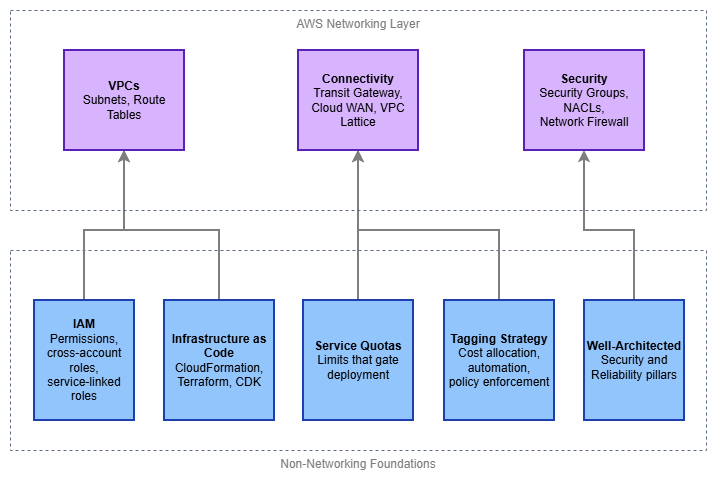

# 始める前に {#before-you-start}

AWS のネットワーキングは独立して存在するものではありません。すべての VPC、ルートテーブル、Transit Gateway アタッチメントは、アカウント内に存在し、IAM ポリシーによって管理され、サービスクォータの制約を受け、コードを通じてデプロイされるべきものです。CIDR ブロックに手を触れる前に、これらのネットワーキング以外の基盤を正しく整えておくことで、後から修正するのが最も困難な問題を未然に防ぐことができます。具体的には、クロスアカウント共有をブロックするパーミッションエラー、本番デプロイ中のクォータ枯渇、コスト配分を不可能にするタグ未設定のリソース、そして静かにドリフトしていく手動設定などが挙げられます。

このページでは、ネットワーキングレイヤーの下に位置する前提条件について説明します。これらはいずれもネットワーキング固有のものではありませんが、すべてがネットワークアーキテクチャの実際の動作に影響を与えます。

/// caption
ネットワーキング以外の基盤 — [Drawio ソース](../assets/foundation/prerequisites-layers.drawio)
///

## Identity and Access Management (IAM) {#identity-and-access-management-iam}

IAM は AWS におけるすべてのコントロールプレーンです。VPC の作成、Transit Gateway のアタッチ、AWS RAM を通じたリソース共有など、あらゆる API 呼び出しは IAM によって認可されるアクションです。IAM の基盤が脆弱であれば、ネットワーキングの自動化は診断が困難な形で失敗します。たとえば、クロスアカウントのリソース共有がサイレントに拒否される、サービスリンクロールに必要な権限が不足している、あるいはデプロイパイプラインが過度に制限された SCP によってブロックされるといった問題が発生します。

**ネットワーキングにおいて特に重要な点:**

* **クロスアカウントロールと信頼ポリシー** — マルチアカウントのネットワーキングは例外ではなく標準です。Transit Gateway の共有、Route 53 Resolver ルールの関連付け、VPC Lattice サービスネットワーク、AWS RAM 共有はいずれもクロスアカウントの IAM 信頼を必要とします。現在作業中のアカウントだけでなく、使用予定のリソース共有パターンをサポートするようにロールの信頼ポリシーを設計してください。
* **サービスリンクロール** — AWS Transit Gateway、Amazon VPC Lattice、AWS Network Firewall などのサービスは、サービスリンクロールを自動的に作成します。これらのロールには、サービスが動作するために必要な特定の権限が付与されています。サービスリンクロールが存在すること、初回使用時に作成されること、そして `iam:CreateServiceLinkedRole` をブロックする SCP や権限境界がサービスのプロビジョニングを妨げることを理解しておいてください。
* **サービスコントロールポリシー (SCP)** — AWS Organizations 環境では、SCP がすべてのアカウントに対する最大権限境界を設定します。よくある誤りは、VPC、サブネット、ルートテーブル、セキュリティグループ、ENI の操作がすべて `ec2:` 名前空間に属することに気づかずに、`ec2:*` アクションを制限する SCP をデプロイしてしまうことです。SCP はネットワーキングアクションに対して明示的にテストしてください。
* **ネットワークリソース向けの条件キー** — IAM は `ec2:Vpc`、`ec2:Subnet`、`aws:RequestedRegion` などの条件キーをサポートしており、特定のネットワーク境界に権限をスコープすることができます。誤った VPC やリージョンへのリソース作成を防ぐために活用してください。

***重要な洞察:*** *ネットワーキングにおける最も一般的な IAM の失敗は「単一リソースへの権限拒否」ではありません。開発環境(同一アカウント)では機能するが、本番環境(異なるアカウント、異なる Organization)では壊れるクロスアカウントの信頼関係こそが問題です。クロスアカウントの IAM パスは早期にテストしてください。*

## Infrastructure as Code {#infrastructure-as-code}

ネットワークインフラストラクチャはほぼ常にコードとして管理されますが、それには十分な理由があります。ネットワークリソースは長期間にわたって存在し、相互に依存し合い、チーム間で共有されます。コンソールで手動作成した VPC は、誰かがそれを複製・監査したり、ルートが存在する理由を把握しようとした瞬間に負債となります。AWS の Infrastructure as Code における主要ツールは **AWS CloudFormation**、**Terraform**、**AWS CDK** の 3 つであり、それぞれ異なる運用モデルを持っています。

**ツールの選び方:**

* **AWS CloudFormation** — AWS ネイティブのサービスで、AWS Organizations(マルチアカウントデプロイ向けの StackSets)、ドリフト検出、チェンジセットと緊密に統合されています。環境が AWS のみであり、デプロイのオーケストレーションを AWS に任せたい場合に最適です。ネットワークリソースは十分にサポートされており、CloudFormation がネイティブにカバーしていない操作向けのカスタムリソースも利用できます。
* **Terraform** — プロバイダーベースかつステートファイル駆動で、マルチクラウドをサポートします。AWS プロバイダーはネットワークリソースを包括的にカバーしています。チームがすでに Terraform を使用している場合、複数のクラウドにまたがるリソースを管理する必要がある場合、または HCL の宣言的なスタイルを好む場合に最適です。ステートファイルの管理が必要です(S3 + DynamoDB ロックなどのリモートバックエンドを使用してください)。
* **AWS CDK** — 内部では CloudFormation を生成しますが、TypeScript、Python、Java、Go、C# などの汎用プログラミング言語でインフラストラクチャを定義できます。チームが汎用プログラミング言語を好み、再利用可能なコンストラクトを構築したい場合に最適です。`aws-ec2` モジュールは VPC、サブネット、ルーティング向けの L2 コンストラクトを提供しており、一般的なパターンを適切なデフォルト値で処理します。

**ネットワーキング IaC において重要なパターン:**

* **ネットワークインフラストラクチャとワークロードインフラストラクチャを分離する** — ネットワークリソース(VPC、Transit Gateway アタッチメント、ルートテーブル)は、アプリケーションリソースとは異なるサイクルで変更されます。ワークロードのデプロイが共有ネットワークインフラストラクチャを誤って変更しないよう、別々のスタックまたはステートファイルにデプロイしてください。
* **出力とクロススタック参照を活用する** — ネットワークスタックが生成する値(VPC ID、サブネット ID、ルートテーブル ID)は、ワークロードスタックが利用します。CloudFormation エクスポート、Terraform のリモートステートデータソース、または SSM Parameter Store を通じて、これらの値をクリーンにエクスポートしてください。
* **CIDR ブロックをパラメータ化する** — CIDR レンジをハードコードしてはいけません。パラメータとして渡すか、IPAM から参照してください。これにより、テンプレートを複数の環境で再利用できるようになります。
* **一時的な環境でテストする** — テストアカウントで完全なネットワークスタックを起動し、接続性を検証してから削除します。これにより、クォータの問題、IAM トラストの失敗、ルーティングエラーを本番環境に到達する前に検出できます。

***重要な洞察:*** *ツールそのものよりも規律の方が重要です。1 つを選んで一貫して使用し、本番アカウントのネットワークリソースに対する手動のコンソール変更を絶対に許可しないでください。コードと実態のドリフトは、成熟した AWS 環境におけるネットワーキングインシデントの最大の原因です。*

## サービスクォータ {#service-quotas}

AWS はネットワーキングリソースにデフォルトの制限を設けており、その多くは想定より低い値です。リージョンあたり 5 つの VPC というデフォルト値は、各アカウントに少なくとも 1 つの VPC が必要なマルチアカウントのランディングゾーンを運用するまでは十分に見えます。ルートテーブルあたり 50 ルートというデフォルト値も、60 の VPC とピアリングするまでは問題なく見えます。本番デプロイ中のクォータ枯渇は、事前に防げるインシデントです。

**ネットワーキングチームが最もよく直面するクォータ:**

| リソース | デフォルト制限 | 重要な理由 |
|----------|:---:|---|
| リージョンあたりの VPC 数 | 5 | マルチアカウント環境では共有サービスアカウントですぐに上限に達する |
| VPC あたりのサブネット数 | 200 | 通常は問題にならないが、多層構成の大規模マルチ AZ 設計では上限に近づく場合がある |
| ルートテーブルあたりのルート数 | 50 | Transit Gateway と VPC ピアリングはそれぞれ宛先ごとに 1 エントリを消費する |
| ENI あたりのセキュリティグループ数 | 5 | きめ細かい SG ルールを持つマイクロサービスアーキテクチャで上限に達する |
| VPC あたりの VPC ピアリング接続数 | 50 | メッシュトポロジーでは枯渇する。Transit Gateway が解決策となる |
| Transit Gateway アタッチメント数 | 5,000 | 数百のアカウントを持つ大規模組織では上限に近づく |
| RAM 共有あたりの参加者数 | 5,000 | 大規模な Transit Gateway および VPC Lattice の共有に関係する |

**クォータ管理のベストプラクティス:**

* **設計前にクォータを確認する** — 使用予定のすべてのリージョンで `aws service-quotas list-service-quotas --service-code ec2` および `--service-code vpc` を実行し、デフォルト値とアーキテクチャのリソース数を比較する。
* **事前に増加申請を行う** — クォータの増加申請には数時間から数日かかる場合がある。デプロイが失敗してからではなく、環境プロビジョニングの一環として申請する。
* **CloudWatch で適用済みクォータを監視する** — Service Quotas は使用率メトリクスを公開している。上限に達する前に増加申請の時間を確保できるよう、使用率 80% でアラームを設定する。
* **IaC でクォータを考慮する** — Terraform または CloudFormation テンプレートがクォータに近いリソースを作成する場合はドキュメントに記載する。さらに望ましいのは、デプロイ前チェックを追加することである。

***重要なポイント:*** *クォータはバグではなく、ガードレールです。ただし、デフォルト値はシングルワークロードアカウントを想定しており、共有サービスアカウントやネットワーキングアカウントは考慮されていません。クォータ計画は後付けではなく、アーキテクチャ設計の一部として取り組んでください。*

## IPv6 対応 {#ipv6-readiness}

IPv6 は将来の検討事項ではなく、現代の AWS ネットワーキングにおける現在進行形の要件です。新しい VPC はすべて初日からデュアルスタック構成にすべきであり、ネットワーキング以外の基盤もそれをサポートできる状態でなければなりません。IPv6 対応の失敗は気づきにくいものです。たとえば、IPv6 が有効化されているにもかかわらずセキュリティグループに IPv4 ルールしか存在しない VPC、`::/0` エントリのないルートテーブルを作成する IaC テンプレート、IPv6 トラフィックをサイレントにブロックする NACL などが典型例です。

**前提条件における IPv6 対応の意味:**

* **セキュリティグループには明示的な IPv6 ルールが必要** — IPv4 ルールは IPv6 トラフィックに自動的には適用されません。ポート 443 で `0.0.0.0/0` を許可するセキュリティグループは、ポート 443 の `[::]/0` を許可しません。IaC テンプレート内のすべてのセキュリティグループに、両方のプロトコルファミリーのルールを含める必要があります。
* **NACL は IPv6 を許可する必要がある** — デフォルト NACL はすべてのトラフィック(IPv4 および IPv6)を許可しますが、カスタム NACL には明示的な IPv6 エントリが必要です。インバウンドで `0.0.0.0/0` を許可するカスタム NACL は、IPv6 のインバウンドトラフィックを許可しません。
* **IaC テンプレートは最初からデュアルスタックを含める必要がある** — VPC テンプレートは IPv4 CIDR と Amazon 提供の IPv6 `/56` の両方を割り当てるべきです。サブネットテンプレートは IPv4 CIDR と IPv6 `/64` の両方を割り当てるべきです。ルートテーブルには `0.0.0.0/0` と `::/0` の両方のエントリが必要です。既存のテンプレートに後から IPv6 を追加する作業は、最初から含めるよりも大幅に手間がかかります。
* **`ec2:` アクションを参照する IAM ポリシー** — IPv6 固有のアクション(`ec2:AssignIpv6Addresses` など)が、`ec2:*` アクションを制限する SCP や権限境界によって意図せずブロックされないようにする必要があります。
* **DNS 解決** — アプリケーションはデュアルスタックの DNS レスポンス(A レコードと並ぶ AAAA レコード)を処理できなければなりません。DNS が IPv6 アドレスを返す場合に、アプリケーションコード、ヘルスチェック、および監視ツールが正しく動作することをテストしてください。

***重要な洞察:*** *最も一般的な IPv6 の失敗は「VPC がサポートしていない」ではなく、「セキュリティグループに IPv4 ルールしかない」です。IaC テンプレート、セキュリティグループモジュール、および NACL ベースラインに最初から IPv6 を組み込めば、この種の問題はすべて解消されます。*

## タグ付け戦略 {#tagging-strategy}

タグはメタデータですが、AWS ネットワーキングにおいてはコスト配分、自動化のターゲット指定、ポリシー適用のメカニズムでもあります。タグのない VPC は、コストを誰も帰属させられず、自動化が確実にターゲットにできず、コンプライアンスルールが評価できない VPC です。数百の VPC と数千のサブネットを持つマルチアカウントのネットワーキング環境では、一貫したタグ付けが運用上の可視性と混乱の分かれ目となります。

**ネットワークリソースに対する最低限のタグ付け標準:**

* **`Environment`** — `production`、`staging`、`development`。自動化の動作を制御します(例: 本番リソースを自動削除しないなど)。
* **`Owner`** — リソースの責任チーム。Transit Gateway アタッチメントがキャパシティを消費しており、誰に連絡すべきかを把握する必要がある場合に不可欠です。
* **`CostCenter`** — 請求の配分に使用します。ネットワークリソース(NAT ゲートウェイ、Transit Gateway アタッチメント、VPC エンドポイント)は帰属させなければならない多大なコストを発生させます。
* **`ManagedBy`** — `cloudformation`、`terraform`、`cdk`、または `manual`。リソースの管理方法と変更が安全かどうかを識別します。
* **`Name`** — わかりやすく一貫した名前。`{env}-{region}-{purpose}-{type}` のような命名規則を使用します(例: `prod-use1-shared-tgw`)。

**適用メカニズム:**

* **AWS Organizations タグポリシー** — 組織レベルで必須タグと許可値を定義します。非準拠のリソースはフラグが立てられます(適用モードによってはブロックされます)。
* **SCP ベースの適用** — リクエストに必須タグが含まれていない場合、`ec2:CreateVpc`、`ec2:CreateSubnet`、その他のネットワーキングアクションを拒否します。
* **AWS Config ルール** — `required-tags` ルールが既存のリソースを評価し、修正のために非準拠にフラグを立てます。

***重要な洞察:*** *タグ付けは事後ではなく、作成時に適用してください。数百のネットワークリソースに後からタグを付けるのは手間がかかり、エラーが発生しやすい作業です。リソース作成時にタグを要求する SCP または IAM ポリシー条件は、四半期ごとのタグ付け修正作業よりもはるかにコストが低く抑えられます。*

## AWS Well-Architected Framework {#aws-well-architected-framework}

Well-Architected Framework は、ネットワーキングの意思決定が準拠すべきアーキテクチャ原則を提供します。ネットワークアーキテクチャに直接関連する柱が 2 つあります: **セキュリティ**と**信頼性**です。3 つ目の柱である**コスト最適化**は、Transit Gateway、NAT ゲートウェイ、VPC エンドポイントを大規模に運用する際に重要になります。

**セキュリティの柱 — ネットワーキングへの適用:**

* **多層防御(Defense in depth)** — セキュリティコントロールを階層化します: ENI レベルのセキュリティグループ、サブネットレベルの NACL、VPC 境界での Network Firewall または GWLB、アプリケーションエッジでの AWS WAF。単一の層だけでは十分ではありません。
* **ネットワークアクセスの最小権限** — デフォルト拒否のセキュリティグループ、明示的なルートテーブルエントリ、そして可能な限りパブリックエンドポイントの代わりに PrivateLink を使用します。
* **攻撃対象領域の縮小** — デフォルトでプライベートサブネットを使用し、AWS サービスへのアクセスには VPC エンドポイントを利用し、明示的に必要な場合を除きパブリック IP を割り当てません。

**信頼性の柱 — ネットワーキングへの適用:**

* **デフォルトでマルチ AZ** — すべてのネットワーキングコンポーネント(NAT ゲートウェイ、Network Firewall エンドポイント、ロードバランサー)を複数のアベイラビリティーゾーンにデプロイします。単一 AZ のネットワーキングは、その上位にあるすべてのコンポーネントの単一障害点となります。
* **影響範囲の限定(Blast radius の制限)** — 複数の VPC とアカウントを使用して障害を封じ込めます。ある VPC でのルーティング設定ミスが他の VPC に伝播しないようにします。
* **障害モードのテスト** — アベイラビリティーゾーン障害、Transit Gateway アタッチメントの喪失、DNS 解決の失敗をシミュレートします。何が壊れ、どのように回復するかを把握しておきます。

**コスト最適化の柱 — ネットワーキングへの適用:**

* **データ転送料金の理解** — AZ 間、リージョン間、Transit Gateway の処理、NAT ゲートウェイの処理、VPC エンドポイントの時間課金はすべて積み重なります。不要なデータ移動を最小化するアーキテクチャを設計します。
* **NAT コスト削減のための VPC エンドポイントの活用** — VPC エンドポイントを通じた S3、DynamoDB、その他の AWS サービスへのトラフィックは、NAT ゲートウェイの処理料金を完全に回避できます。
* **接続方式の適正化** — 2 つの VPC に VPC ピアリングで十分な場合は Transit Gateway をデプロイしません。単一リージョンの Transit Gateway でトポロジーをカバーできる場合は AWS Cloud WAN をデプロイしません。

***重要なインサイト:*** *Well-Architected はビルド後に完了するチェックリストではなく、設計時に適用する原則の集合です。最初のネットワーク図を描く前に、セキュリティと信頼性の柱を確認してください。後回しにしてはいけません。*

---

## ドキュメント {#documentation}

*   :material-shield-account: **IAM ユーザーガイド**

    ---

    ID とアクセス管理の基礎、ポリシー、ロール、クロスアカウントアクセスパターン。

    [:octicons-arrow-right-24: IAM ドキュメント](https://docs.aws.amazon.com/IAM/latest/UserGuide/introduction.html)

*   :material-code-braces: **AWS CloudFormation**

    ---

    StackSets、ドリフト検出、チェンジセットを備えた AWS ネイティブの Infrastructure as Code。

    [:octicons-arrow-right-24: CloudFormation ドキュメント](https://docs.aws.amazon.com/AWSCloudFormation/latest/UserGuide/Welcome.html)

*   :material-terraform: **Terraform AWS プロバイダー**

    ---

    すべてのネットワークリソースを網羅した HashiCorp の AWS プロバイダードキュメント。

    [:octicons-arrow-right-24: Terraform AWS プロバイダー](https://registry.terraform.io/providers/hashicorp/aws/latest/docs)

*   :material-gauge: **Service Quotas**

    ---

    AWS サービスの制限値の確認、管理、および引き上げリクエスト。

    [:octicons-arrow-right-24: Service Quotas ドキュメント](https://docs.aws.amazon.com/servicequotas/latest/userguide/intro.html)

*   :material-tag-multiple: **タグ付けのベストプラクティス**

    ---

    AWS のタグ付け戦略、タグポリシー、および適用メカニズム。

    [:octicons-arrow-right-24: タグ付けドキュメント](https://docs.aws.amazon.com/tag-editor/latest/userguide/tagging.html)

*   :material-check-decagram: **Well-Architected フレームワーク**

    ---

    セキュリティ、信頼性、パフォーマンス、コスト、運用上の優秀性にわたるアーキテクチャのベストプラクティス。

    [:octicons-arrow-right-24: Well-Architected フレームワーク](https://docs.aws.amazon.com/wellarchitected/latest/framework/welcome.html)

## 次のステップ {#next-steps}

これらの基礎が整ったら、以下の順序で Foundation のトピックを進めてください。

1. **[AWS Organizations](organizations.md)** — ネットワークリソースの共有と分離を管理するマルチアカウント構造
2. **[Amazon VPC](vpc.md)** — その他すべての基盤となる、分離された仮想ネットワーク
3. **[リージョンとアベイラビリティーゾーン](regions-azs.md)** — 地理的な分散と、信頼性を高めるマルチ AZ パターン
4. **[CIDR 計画](cidr.md)** — 大規模環境での競合を防ぐ IP アドレス割り当て戦略
5. **[サブネット](subnets.md)** — VPC 内のネットワークセグメンテーション
6. **[IPAM](ipam.md)** — マルチアカウント環境における集中型 IP アドレス管理
