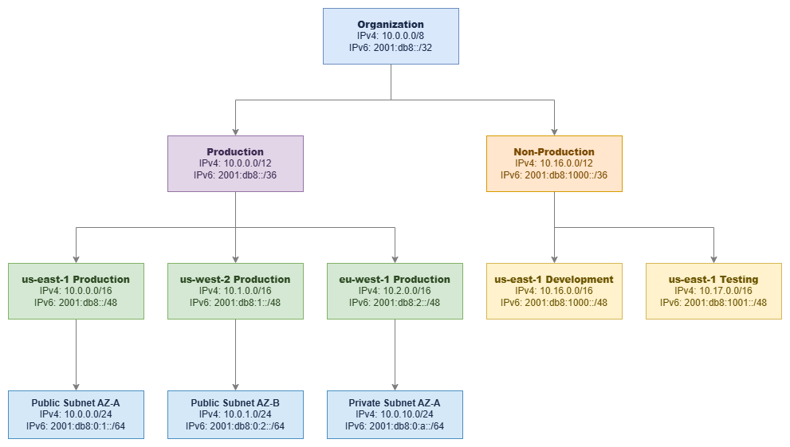

# CIDR ブロックによる IP アドレス設計 {#ip-address-planning-with-cidr-blocks}

!!! info "前提条件"
    このセクションは、[始める前に](aws-prerequisites.md)、[Amazon VPC](vpc.md)、および [リージョンとアベイラビリティーゾーン](regions-azs.md) に精通していることを前提としています。AWS ネットワーキングの基礎を初めて学ぶ方は、先にそれらのページをご確認ください。

IP アドレス設計は、AWS デプロイの初期段階で行う意思決定の中で、後から簡単に変更できない最も重要な決断です。すべての VPC、すべてのサブネット、すべてのピアリング接続、すべてのハイブリッドリンク、そしてすべてのルートテーブルは、作成時に選択した CIDR ブロックによって制約されます。正しく設計すれば、ネットワークは何年にもわたってクリーンにスケールします。誤って設計すれば、アドレスの重複、枯渇したアドレス空間、そして「2 つの VPC が同じ範囲を共有しているために実現できない」接続の問題を回避するために、その後の年月を費やすことになります。

CIDR (Classless Inter-Domain Routing) 表記は、IP アドレス設計の共通言語です。旧来のクラスフルシステム (クラス A、B、C) を可変長プレフィックスに置き換えることで、必要なサイズにアドレス空間を正確に分割できます。VPC、Transit Gateway、Cloud WAN、Direct Connect、VPN など、すべての AWS ネットワーキングサービスは CIDR を使用します。これを習得することは必須です。

/// caption
階層的な CIDR 割り当て — [Drawio ソース](../assets/foundation/cidr-hierarchy.drawio)
///

***重要なポイント:*** *組織 → 環境 → リージョン → VPC → サブネットという階層的な CIDR 割り当ては、単なる整理整頓ではありません。ルート集約を可能にし、ファイアウォールルールを簡素化し、ルートテーブルを読む誰もがネットワークトポロジーを理解できるようにします。*

## CIDR 表記について {#understanding-cidr-notation}

CIDR 表記は、`IP_ADDRESS/PREFIX_LENGTH` という形式で IP アドレス範囲を表します。

**例**: `10.0.0.0/16`

* **IP アドレス**: `10.0.0.0` — ネットワークアドレス(範囲の起点)
* **プレフィックス長**: `/16` — ネットワーク部の固定ビット数(残りのビットがホストに使用可能)
* **アドレス範囲**: `10.0.0.0` ～ `10.0.255.255`(65,536 アドレス)
* **サブネットマスク**: `255.255.0.0`

プレフィックス長によって、ブロックに含まれるアドレス数が決まります。`/16` の場合、2^(32-16) = 65,536 アドレスです。プレフィックスが短いほどアドレス数は多く、長いほど少なくなります。プレフィックスを 1 増やすたびに、アドレス空間は半分になります。

### 代表的な CIDR ブロックサイズ {#common-cidr-block-sizes}

| CIDR | アドレス数 | サブネット内の使用可能数* | 主な用途 |
|------|-----------|-------------------|-------------|
| /16  | 65,536    | 65,531            | エンタープライズ向けの大規模 VPC。サブネット設計の余裕が最大限確保できる |
| /20  | 4,096     | 4,091             | 中規模 VPC。部門単位または単一ワークロード向け VPC |
| /24  | 256       | 251               | 標準的なサブネットサイズ。密度と管理性のバランスが良い |
| /26  | 64        | 59                | ファイアウォールエンドポイント、NAT ゲートウェイ、TGW アタッチメント向けの小規模サブネット |
| /28  | 16        | 11                | VPC またはサブネットの最小サイズ。特定のサービス専用 |

*AWS は各サブネットで 5 つの IP アドレスを予約します(先頭の 4 つと末尾の 1 つ)。

### RFC 1918 プライベートアドレス範囲 {#rfc-1918-private-address-ranges}

VPC で使用可能なプライベート IP 範囲は以下のとおりです。

| 範囲 | CIDR | アドレス数 | 推奨事項 |
|-------|------|-----------|----------------|
| 10.0.0.0 ～ 10.255.255.255 | 10.0.0.0/8 | 16,777,216 | **ほとんどの組織に推奨。** 最大の連続アドレス空間を持ち、階層的なアドレス割り当てに対応できる |
| 172.16.0.0 ～ 172.31.255.255 | 172.16.0.0/12 | 1,048,576 | 第 2 候補として有効。オンプレミスネットワークで既に使用されていることが多い |
| 192.168.0.0 ～ 192.168.255.255 | 192.168.0.0/16 | 65,536 | 本番 AWS 環境での使用は避けること。マルチアカウント環境には小さすぎるうえ、家庭用ネットワークや VPN クライアントで広く使われており、アドレス重複の原因になりやすい |

### AWS ワークロード向けの追加アドレス範囲 {#additional-ranges-for-aws-workloads}

RFC 1918 以外にも、AWS VPC では以下の範囲をサポートしています。

* **100.64.0.0/10**（キャリアグレード NAT 範囲）: VPC CNI カスタムネットワーキング機能を使用した EKS ポッドネットワーキングに有効です。ポッドにこの範囲から IP が割り当てられるため、プライマリ RFC 1918 空間をノードやその他のリソース向けに確保できます。RFC 1918 空間が枯渇した場合にも活用できます。
* **RFC 6815 空間**(`198.19.0.0/16`): 他の範囲が枯渇した際に、VPC のセカンダリ CIDR として利用可能です。

***重要なポイント:*** *`100.64.0.0/10` 範囲は、EKS を多用する環境における戦略的なツールです。単一の EKS クラスターだけでも、ポッド用に数千の IP アドレスを消費することがあります。カスタムネットワーキングを通じてポッドネットワーキングを `100.64.0.0/10` に割り当てることで、プライマリ VPC CIDR をノード、ロードバランサー、その他のインフラ向けに維持できます。*

## ベストプラクティス {#best-practices}

### CIDR 割り当て戦略 {#cidr-allocation-strategy}

#### ルート集約のために連続したアドレスを割り当てる {#allocate-contiguously-for-route-summarization}

優れた CIDR 計画の最も重要な特性は、同じ論理グループ内の割り当てが**連続している**ことです。us-east-1 のすべての本番 VPC が `10.0.0.0/12` の範囲内に収まっていれば、各 VPC に対して個別の `/16` ルートを広告する代わりに、オンプレミスネットワークへ単一の `/12` サマリールートを広告できます。これが重要な理由は以下のとおりです。

* ルートテーブルにはサイズ制限があります(Transit Gateway は 10,000 ルートをサポートしますが、オンプレミスのルーターはそれよりはるかに少ない場合があります)
* ルート数が少ないほど、障害後のコンバージェンスが速くなります
* サマリールートはファイアウォールルールを簡素化します — VPC ごとのエントリではなく、1 つのルールで環境全体をカバーできます
* オンプレミスへの BGP 広告がよりクリーンで安定します

**悪い割り当て例**(非連続のため集約不可):

* 本番 VPC 1: `10.0.0.0/16`
* 開発 VPC: `10.1.0.0/16`
* 本番 VPC 2: `10.5.0.0/16`

**良い割り当て例**(連続しており `10.0.0.0/12` として集約可能):

* 本番 VPC 1: `10.0.0.0/16`
* 本番 VPC 2: `10.1.0.0/16`
* 本番 VPC 3: `10.2.0.0/16`

#### 本番 VPC には /16 から始める {#start-with-16-for-production-vpcs}

`/16` は 65,536 アドレスを提供し、256 個の `/24` サブネットを作成できる余裕があります。マルチ AZ デプロイ(3 つ以上のアベイラビリティーゾーン × 複数のサブネット層)、EKS ポッド密度、将来の成長、そして VPC CIDR は作成後に縮小できないという事実を考慮すると、これは過剰には思えません。`/16` のコストはゼロです(VPC 内の IP アドレスは Elastic IP やパブリック IPv4 を使用するまで無料です)が、アドレス空間が枯渇した場合のコストは、痛みを伴う移行作業となります。

スケールに自信がある非本番ワークロードには、`/20`(4,096 アドレス)が妥当な選択です。単一目的の独立した VPC(インスペクション VPC、Transit Gateway アタッチメント VPC など)には、`/24` や `/28` で十分な場合もあります。

***重要なポイント:*** *VPC のプライマリ CIDR ブロックを縮小することはできません。後からセカンダリ CIDR を追加することは可能ですが、セカンダリ CIDR には制限があります。既存の CIDR と重複できず、一部のサービスでは適切にサポートされず、運用上の複雑さが増します。プライマリ CIDR を最初から正しく設計することは、後から修正するよりも常にコストが低くなります。*

#### 接続する可能性のある VPC 間で CIDR ブロックを重複させない {#never-overlap-cidr-blocks-across-vpcs-you-might-connect}

CIDR ブロックが重複している VPC は、VPC ピアリング、Transit Gateway、または Cloud WAN で接続できません。これは絶対的な制約であり、ネットワーク層での回避策はありません。VPC A が `10.0.0.0/16` を使用し、VPC B が `10.0.5.0/24` を使用している場合、`10.0.5.0/24` は `10.0.0.0/16` の範囲内に含まれるため、これらの VPC はピアリングや Transit Gateway ルートテーブルの共有が永遠にできません。

重複から抜け出す唯一の方法は、PrivateLink(ENI を使用し、ルーティング可能な接続を必要としない)または VPC Lattice(アプリケーション層で動作する)です。ただし、これらはサービスレベルのソリューションであり、ネットワークレベルの接続ではありません。VPC 間で IP レベルのルーティングが必要な場合(ほとんどの組織で必要です)、重複は致命的です。

これは、まだ作成していない VPC を含む組織全体に適用されます。割り当て計画において、将来のアカウントやリージョン向けのアドレス空間を予約してください。

#### 初日からハイブリッド接続を計画する {#plan-for-hybrid-connectivity-from-day-one}

AWS 環境がオンプレミスネットワーク、企業データセンター、または他のクラウドに接続する可能性が少しでもある場合は、最初からすべての環境にわたって CIDR 割り当てを調整する必要があります。CIDR の重複によるハイブリッド接続の失敗は、ワークロードの再 IP 化が必要になるため、修正コストが最も高いネットワーキングミスの一つです。この作業は DNS、アプリケーション設定、ファイアウォールルール、監視システムに影響します。

具体的には以下が必要です。

1. **AWS CIDR を割り当てる前に、すべてのオンプレミス IP 範囲を文書化する。** ブランチオフィス、パートナーネットワーク、買収した企業のネットワーク、リモートアクセス VPN プールを含めてください。把握していない範囲こそが重複を引き起こします。
2. **オンプレミスの割り当てと競合しない AWS 用の非重複スペースを予約する。** クリーンな分割(例: オンプレミスが `10.128.0.0/9`、AWS が `10.0.0.0/9` を所有する)により、曖昧さがなくなります。
3. **オンプレミスのアドレス管理を担当するネットワークチームと調整する。** データセンターの範囲と重複する AWS CIDR の一方的な決定が 6 か月後に発覚すると、VPC の再作成を余儀なくされます。
4. **VPN クライアントプールを考慮する。** リモートアクセス VPN クライアントには、AWS とオンプレミスのどちらとも重複しない IP 範囲が必要です。多くの組織では、クライアント VPN プールに `172.16.0.0/12` を使用しています。
5. **買収を計画に含める。** 自社が別の組織を買収すると、その組織のネットワーク範囲が自社の問題になります。一般的な企業の割り当てと競合しにくいスペースを予約してください。

一般的なパターン: `10.0.0.0/8` を割り当て、オンプレミスが `10.128.0.0/9`、AWS が `10.0.0.0/9` を使用します。これにより、各環境に 800 万アドレスが与えられ、重複リスクがゼロになります。既存のオンプレミス割り当てが `10.0.0.0/8` 全体に散在している組織では、AWS に `172.16.0.0/12` を使用するか、ネットワークチームと協力して `10.x` 空間の未使用部分を特定してください。

***重要なポイント:*** *最も一般的なハイブリッド接続の失敗は、Direct Connect の設定ミスや BGP の設定ミスではなく、ワークロードが稼働した後に発覚する CIDR の重複です。AWS 割り当てを行う前に、「一時的な」ラボネットワークや忘れられたブランチオフィスを含む、すべての既存範囲を文書化してください。*

#### マルチリージョン割り当て戦略を設計する {#design-a-multi-region-allocation-strategy}

組織の割り当て内で、各リージョンに専用ブロックを割り当てます。これにより、リージョンごとのルート集約が可能になり、拡張時のリージョン間の重複を防ぎます。

**マルチリージョン構成例**(AWS 用 `10.0.0.0/9` 内):

| リージョン | CIDR ブロック | 用途 |
|--------|-----------|---------|
| us-east-1 | 10.0.0.0/12 | プライマリリージョン |
| us-west-2 | 10.16.0.0/12 | DR / セカンダリ |
| eu-west-1 | 10.32.0.0/12 | ヨーロッパワークロード |
| ap-southeast-1 | 10.48.0.0/12 | アジアパシフィックワークロード |
| 予約済み | 10.64.0.0/10 | 将来のリージョン |

各 `/12` はリージョンあたり 1,048,576 アドレスを提供します — 16 個の `/16` VPC または 256 個の `/20` VPC に十分な量です。予約済みブロックにより、既存の割り当てを再構成することなく新しいリージョンへ拡張できます。

Direct Connect または VPN 経由でオンプレミスにルートを広告する場合、リージョンごとの割り当てにより、個別の VPC プレフィックスではなく、リージョンごとに単一のサマリールート(例: us-east-1 全体に対して `10.0.0.0/12`)を広告できます。これにより、オンプレミスのルートテーブルを小さく保ち、BGP セッションを安定させることができます。

***重要なポイント:*** *総アドレス空間の少なくとも 50% を将来の成長のために予約してください。組織は、3〜5 年後に必要になる VPC、アカウント、リージョンの数を一貫して過小評価しています。アドレス空間は無料ですが、枯渇した場合のコストは無料ではありません。*

#### IPv4 と並行して IPv6 を計画する {#plan-ipv6-alongside-ipv4}

AWS VPC における IPv6 は IPv4 とは異なる動作をするため、別途計画が必要です。

* **VPC レベル**: 各 VPC は `/56` の IPv6 CIDR を受け取ります(256 個の `/64` サブネットが利用可能)。Amazon 提供のアドレスを使用するか、独自のアドレスを持ち込む(BYOIP)ことができます。
* **サブネットレベル**: 各サブネットは VPC の `/56` から `/64` を取得します。これは固定であり、異なるサブネットプレフィックス長を選択することはできません。
* **NAT 不要**: IPv6 アドレスはグローバルに一意です。エグレス専用インターネットゲートウェイは、NAT なしでアウトバウンドのみのインターネットアクセスを提供します。
* **デュアルスタック**: ほとんどの組織は、少なくとも移行期間中は IPv6 のみではなくデュアルスタック(IPv4 + IPv6)で運用します。
* **アドレス枯渇の懸念なし**: 単一の `/56` は 4,722,366,482,869,645,213,696 個のアドレスを提供します。IPv6 では枯渇は計画上の考慮事項になりません。

**IPv6 CIDR ソースのオプション:**

| ソース | ユースケース | 考慮事項 |
|--------|----------|---------------|
| Amazon 提供 | ほとんどのワークロードのデフォルト | アドレスは Amazon のプールから割り当てられ、関連付けを解除すると変更される |
| BYOIP(独自 IP の持ち込み) | 既存の IPv6 割り当てを持つ企業 | RIR 登録と ROA が必要。アドレスの可搬性を提供する |
| IPAM 管理の Amazon プール | 一貫した割り当てを必要とするマルチアカウント環境 | Amazon のプールから割り当てるが、ガバナンスのために IPAM を経由する |

IPv6 の計画は一点において IPv4 より簡単です。アドレス空間が非常に広大なため、枯渇は懸念事項になりません。複雑さは、セキュリティグループ、NACL、ルートテーブル、ファイアウォールルールが IPv6 トラフィックパスを考慮していることを確認する点にあります。IPv6 サブネットはデフォルトでインターネットルーティング可能であることを見落とす組織が多くあります — エグレス専用インターネットゲートウェイはアウトバウンドアクセスを提供しますが、適切なセキュリティグループルールがなければ、パブリック IPv6 アドレスを持つリソースはインターネットから到達可能になります。

**IPv6 計画チェックリスト:**

* VPC を作成する前に Amazon 提供か BYOIP かを決定する(後から変更するには関連付けの解除が必要)
* すべてのセキュリティグループに IPv6 ルールを追加する(IPv4 ルールは IPv6 トラフィックに自動的には適用されない)
* IPv6 ルート(インターネットゲートウェイまたはエグレス専用インターネットゲートウェイへの `::/0`)でルートテーブルを設定する
* 必要なフローに対して IPv6 トラフィックを許可するよう NACL を設定する
* アプリケーションと DNS 解決がデュアルスタックを正しく処理することを確認する

#### セカンダリ CIDR は戦略的に使用し、頼りすぎない {#use-secondary-cidrs-strategically-not-as-a-crutch}

AWS では VPC あたり最大 5 つの IPv4 CIDR ブロック(プライマリ 1 つ + セカンダリ 4 つ)を許可しています。セカンダリ CIDR が有用なケースは以下のとおりです。

* **EKS ポッドネットワーキング**: ポッド IP スペースとして `100.64.0.0/16` をセカンダリ CIDR として追加する
* **買収**: 一時的なアドレス空間が必要な、新たに買収した企業のワークロードを統合する
* **段階的な移行**: 適切な再 IP 化を計画しながら、重複しないスペースを追加する

セカンダリ CIDR は適切な初期計画の**代替手段ではありません**。複雑さが増します。ルートテーブルには各 CIDR のエントリが必要になり、一部のサービスでは複数の CIDR の扱いが一貫しておらず、VPC ごとに複数の範囲を管理する運用上のオーバーヘッドが数百の VPC にわたって積み重なります。

***重要なポイント:*** *VPC にセカンダリ CIDR を定期的に追加していることに気づいたら、初期割り当てが小さすぎたということです。セカンダリ CIDR は設計パターンではなく、緊急回避手段として扱ってください。*

#### よくある CIDR 計画ミスを避ける {#avoid-common-cidr-planning-mistakes}

| ミス | 問題点 | 対策 |
|---------|-------------|------------|
| 本番環境に `192.168.0.0/16` を使用する | ホームネットワーク、VPN クライアント、多くのオンプレミス環境と重複する | AWS 本番環境には `10.0.0.0/8` を使用する |
| 「スペース節約」のために `/24` VPC を割り当てる | サブネット容量がすぐに枯渇し、マルチ AZ や EKS の余裕がなくなる | 本番環境はデフォルトで `/16`、非本番環境は最低 `/20` にする |
| 将来のリージョン用のスペースを予約しない | 拡張時に非連続な割り当てを強いられる | 総割り当ての 50% 以上を予約する |
| オンプレミスの範囲を無視する | 発覚した重複がハイブリッド接続をブロックする | AWS 割り当ての前にすべての既存範囲を文書化する |
| チームごとに調整なしで割り当てる | チームが独立して重複する範囲を選択する | IPAM または共有レジストリを通じて割り当てを一元管理する |
| VPC CIDR を変更可能なものとして扱う | プライマリ CIDR は削除できず、VPC の再作成を強いられる | プライマリ CIDR は初日から永続的なものとして計画する |

## CIDR 計画と他のサービスの組み合わせ {#combining-cidr-planning-with-other-services}

CIDR 計画は独立した作業ではありません。CIDR 計画は、他のすべてのネットワーキングサービスを直接有効化するか、あるいは制約します。アドレス割り当てに関する決定は、後から採用するすべての接続パターンに波及します。適切に設計された CIDR 計画は、Transit Gateway のルートテーブルをシンプルに保ち、Direct Connect の BGP アドバタイズを簡潔にし、Cloud WAN のセグメントルーティングを予測可能にします。設計が不十分な計画は、あらゆる層で回避策を強いることになります。

以下の表は、CIDR の決定が主要な AWS ネットワーキングサービスとどのように相互作用するかを示しています。

| 組み合わせ | CIDR 計画が実現すること | 他のサービスが提供すること |
|---|---|---|
| **CIDR + IPAM** | 階層的な割り当てスキーム、サイズ標準、予約済み範囲 | 割り当ての自動適用、重複防止、コンプライアンス監査、マルチアカウントガバナンス |
| **CIDR + Transit Gateway** | ルートテーブルを共有できる非重複の VPC 範囲、ルート集約のための連続ブロック | リージョンハブアンドスポークルーティング、集中型エグレス、共有サービス接続 |
| **CIDR + Direct Connect / ハイブリッド** | オンプレミスと重複しない AWS 範囲、BGP アドバタイズ用に集約可能なブロック | プライベート専用接続、予測可能な帯域幅、データ転送コストの削減 |
| **CIDR + VPC ピアリング** | ピアリングされた VPC 間で厳密に非重複の範囲(部分的な重複も不可) | 帯域幅のボトルネックなしの直接低レイテンシー接続 |
| **CIDR + Cloud WAN** | セグメント境界に合わせたリージョンごとの連続割り当て、ルーティングポリシー用に集約可能なプレフィックス | グローバルポリシー駆動型ネットワーク、セグメント分離、サービス挿入、マルチリージョンルーティング |
| **CIDR + EKS (VPC CNI)** | ポッドネットワーキング用のセカンダリ CIDR (`100.64.0.0/10`)、ノード用にサイズ調整されたプライマリ CIDR | VPC ネイティブセキュリティグループとネットワークポリシーを使用したポッドレベルのネットワーキング |

最も一般的な失敗パターンは、新しいサービスを導入しようとしたときに初めて CIDR の制約を発見することです。例えば、Transit Gateway をデプロイした際に、各チームが独立して割り当てを行ったため、異なるアカウントの 2 つの VPC が同じ `10.0.0.0/16` 範囲を使用していることが判明するケースがあります。あるいは、Direct Connect を確立した際に、誰もドキュメント化していなかったブランチオフィスのサブネットと AWS の範囲が重複していることに気づくケースもあります。これらは Transit Gateway や Direct Connect の問題ではなく、デプロイ時に表面化する CIDR 計画の問題です。

***重要な洞察:*** *後から採用するすべてのネットワーキングサービスは、あなたの CIDR 計画によって恩恵を受けるか、制約を受けるかのどちらかです。適切な割り当てスキームに費やす 30 分が、Transit Gateway、Direct Connect、Cloud WAN のデプロイ全体にわたる何百時間もの回避策を節約します。*

## サブネット CIDR の設計 {#subnet-cidr-planning}

VPC 内において、サブネット設計はワークロードの分離方法、各アベイラビリティーゾーンで実行できるリソース数、およびルートテーブルによるトラフィック制御方法を決定します。サブネット CIDR は VPC の CIDR ブロックから切り出され、互いに重複することはできません。

各サブネットは VPC CIDR の連続した範囲を消費します。AWS は各サブネットで 5 つのアドレスを予約します。ネットワークアドレス、VPC ルーター(`.1`)、DNS サーバー(`.2`)、将来の使用のために予約された 1 つ(`.3`)、そしてブロードキャストアドレス(最後の IP)です。そのため `/24` サブネットで使用可能なアドレス数は 256 ではなく 251 となります。

**3 つのアベイラビリティーゾーンにまたがる `/16` VPC の推奨サブネットレイアウト:**

| サブネット層 | AZ-A | AZ-B | AZ-C | サイズ | 用途 |
|-------------|------|------|------|------|---------|
| パブリック | 10.0.0.0/24 | 10.0.1.0/24 | 10.0.2.0/24 | /24 (251 使用可能) | ロードバランサー、NAT ゲートウェイ、踏み台ホスト |
| プライベート(アプリケーション) | 10.0.10.0/24 | 10.0.11.0/24 | 10.0.12.0/24 | /24 (251 使用可能) | アプリケーションサーバー、コンテナ、Lambda |
| プライベート(データ) | 10.0.20.0/24 | 10.0.21.0/24 | 10.0.22.0/24 | /24 (251 使用可能) | RDS、ElastiCache、OpenSearch |
| プライベート(予備) | 10.0.30.0/24 | 10.0.31.0/24 | 10.0.32.0/24 | /24 (251 使用可能) | 将来の使用、追加層 |
| TGW/ファイアウォール | 10.0.250.0/28 | 10.0.250.16/28 | 10.0.250.32/28 | /28 (11 使用可能) | Transit Gateway ENI、ファイアウォールエンドポイント |

**サブネットサイズ選定のガイダンス:**

* `/24` はほとんどのワークロードに対する標準的なサブネットサイズです。アベイラビリティーゾーンごとに 251 の使用可能アドレスを提供し、ほとんどのアプリケーション層を十分にカバーします。
* ポッドがプライマリ CIDR を使用する場合、EKS ワーカーノードのサブネットには `/20` 以上を使用してください(各ノードはポッドキャパシティに比例した IP を消費します)。
* Transit Gateway アタッチメント、Network Firewall エンドポイント、NAT ゲートウェイなど、少数の ENI のみをホストするインフラストラクチャサブネットには `/28` を使用します。
* 番号付けスキームにギャップを残してください(上記の `.2.0` から `.10.0` へのジャンプに注目)。これにより、既存のサブネットを番号付け変更することなく、新しいサブネット層を挿入できます。

**サブネット設計の原則:**

* **アベイラビリティーゾーン間での一貫性**: すべてのアベイラビリティーゾーンは、同じサイズの同じサブネット層を持つ必要があります。これにより、ワークロードがアベイラビリティーゾーン間でフェイルオーバーする際に、キャパシティの差異が生じません。
* **層ごとに個別のルートテーブル**: パブリックサブネットはインターネットゲートウェイへルーティングし、プライベートサブネットは NAT を経由するか内部にとどまります。単一のルートテーブルで層を混在させるとセキュリティリスクが生じます。
* **少なくとも 3 つのアベイラビリティーゾーンを計画する**: 2 つから始める場合でも、最初から 3 つのアベイラビリティーゾーンを想定したサブネットスキームを設計してください。計画済みであれば、一貫したスキームで後から 3 つ目のアベイラビリティーゾーンを追加するのは容易です。
* **インフラストラクチャサブネット用のスペースを確保する**: Transit Gateway アタッチメント、Network Firewall エンドポイント、Gateway Load Balancer エンドポイントはそれぞれアベイラビリティーゾーンごとにサブネットが必要です。これらは `/28` で十分ですが、すべてのアベイラビリティーゾーンに存在する必要があります。

***重要なポイント:*** *サブネットスキームの番号ギャップは無駄なスペースではなく、将来への備えです。最初の 3 層に 10.0.0.0/24、10.0.1.0/24、10.0.2.0/24 を使用する VPC では、それらの間に新しい層を挿入する余地がありません。ギャップのあるスキーム(0、10、20、30)であれば、既存のサブネットを変更することなく 5、15、25 に新しい層を追加できます。*

## ドキュメント {#documentation}

*   :material-file-document: **VPC CIDR ブロック**

    ---

    VPC CIDR ブロックの設定、制限、およびサポートされる範囲に関する公式ドキュメント。

    [:octicons-arrow-right-24: ドキュメント](https://docs.aws.amazon.com/vpc/latest/userguide/vpc-cidr-blocks.html)

*   :material-file-document: **サブネットのサイジング**

    ---

    サブネット CIDR ブロックの仕組み、予約済みアドレス、およびサイジングに関する考慮事項。

    [:octicons-arrow-right-24: ドキュメント](https://docs.aws.amazon.com/vpc/latest/userguide/configure-subnets.html#subnet-sizing)

*   :material-file-document: **サブネット CIDR 予約**

    ---

    特定のサービスによる専用利用など、特定のユースケース向けにサブネット CIDR スペースの一部を予約する方法。

    [:octicons-arrow-right-24: ドキュメント](https://docs.aws.amazon.com/vpc/latest/userguide/subnet-cidr-reservation.html)

*   :material-book-open-variant: **スケーラブルなマルチ VPC ネットワークの構築**

    ---

    大規模な IP アドレス計画、マルチアカウント戦略、および接続パターンを解説した AWS ホワイトペーパー。

    [:octicons-arrow-right-24: ホワイトペーパー](https://docs.aws.amazon.com/whitepapers/latest/building-scalable-secure-multi-vpc-network-infrastructure/welcome.html)

*   :material-post: **ハイパースケール VPC ネットワークの設計**

    ---

    大規模な CIDR 計画、アドレス空間の管理、および成長戦略に関するブログ記事。

    [:octicons-arrow-right-24: ブログ記事](https://aws.amazon.com/blogs/networking-and-content-delivery/designing-hyperscale-amazon-vpc-networks/)

*   :material-book-open-variant: **RFC 1918 - プライベートアドレスの割り当て**

    ---

    VPC CIDR 計画で使用されるプライベート IPv4 アドレス範囲を定義した基礎的な RFC。

    [:octicons-arrow-right-24: RFC 1918](https://datatracker.ietf.org/doc/html/rfc1918)

---

## 関連する基礎トピック {#related-foundation-topics}

このページでは CIDR 計画の原則について説明します。関連する基礎トピックについては、以下を参照してください。

* **[Amazon VPC](vpc.md)** — VPC 設計パターン、マルチ AZ アーキテクチャ、および VPC 構造が CIDR 計画にどのように基づいているか
* **[サブネット](subnets.md)** — CIDR 割り当て内のサブネット階層、ルートテーブル設計、およびネットワーク ACL
* **[AWS IPAM](ipam.md)** — CIDR 割り当ての自動化、重複の防止、および組織全体へのポリシー適用
* **[リージョンとアベイラビリティーゾーン](regions-azs.md)** — リージョン選択がマルチリージョン CIDR 割り当て戦略に与える影響
* **[AWS Organizations](organizations.md)** — CIDR 階層が反映すべきアカウント構造
