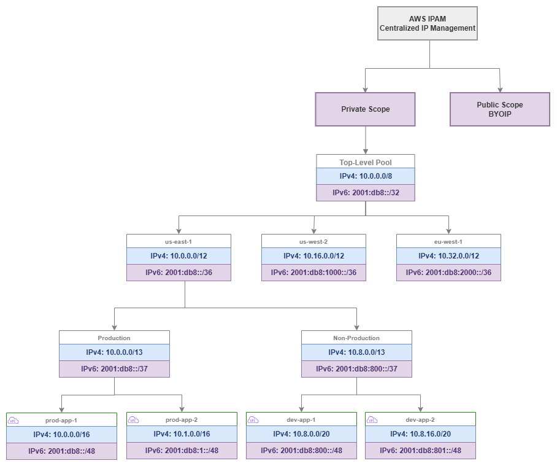

# IP アドレス管理 (IPAM) {#ip-address-management-ipam}

!!! info "前提条件"
    このセクションは、[始める前に](aws-prerequisites.md)、[AWS Organizations](organizations.md)、[Amazon VPC](vpc.md)、および [CIDR 計画](cidr.md) に精通していることを前提としています。AWS ネットワーキングの基礎を初めて学ぶ方は、先にそれらのページをご確認ください。

AWS IPAM (IP Address Management) は、組織の IP アドレス空間に対するコントロールプレーンです。スプレッドシート、Confluence ページ、属人的な知識を、AWS Organization 内のすべてのアカウントおよびリージョンにわたって IP アドレスを計画・割り当て・追跡・監視する、一元化されたポリシー駆動型のシステムに置き換えます。IPAM がなければ、IP アドレス管理は調整のボトルネックに陥ります。チームは CIDR ブロックを求めてチケットを起票し、ネットワークエンジニアが手動で重複を確認し、次に作成する VPC が既存のものと競合しないという確信を誰も持てません。IPAM は、割り当てを自動化・重複排除・監査可能にすることで、そのような摩擦を解消します。

このサービスは、リージョン・環境・ビジネスユニットごとに整理された CIDR 範囲のコレクションであるプールの階層を通じて動作し、サイジング・タグ付け・ローカリティの制約を強制する割り当てルールを備えています。チームが VPC を作成する際、適切なプールに CIDR をリクエストすると、IPAM は組織標準に準拠した重複のない割り当てを保証します。チケット不要、手動確認不要、スプレッドシートの更新も不要です。


/// caption
IPAM プール階層 — [Drawio ソース](../assets/foundation/ipam-pool-hierarchy.drawio)
///

## 主要機能 {#key-capabilities}

<div class="grid cards" markdown>

*   :material-ip-network: **階層型プール管理**

    ---

    IP アドレス空間を、リージョン・環境・ワークロードタイプごとにネストされたプールとして整理します。プールは親から制約を継承し、すべての階層でアロケーションルールを適用します。

*   :material-shield-check: **重複防止**

    ---

    すべてのアロケーションはプール階層全体に対して検証されます。IPAM は 2 つの VPC が競合する CIDR ブロックを受け取らないことを保証し、マルチアカウント環境で最も多いネットワーク設定ミスを排除します。

*   :material-chart-pie: **使用率モニタリング**

    ---

    すべてのプール・リージョン・アカウントにわたって、アドレス空間のアロケーション済み・使用済み・利用可能な量をリアルタイムで可視化します。プールが枯渇に近づいた際にアラートを発報します。

*   :material-tag-check: **アロケーションルール**

    ---

    すべてのアロケーションに対して、CIDR サイズの最小・最大値、必須タグ、ロケール制限を適用します。ルールにより、チームが不適切なサイズのブロックを要求したり、許可されていないリージョンにデプロイしたりすることを防止します。

*   :material-account-multiple: **Organizations 統合**

    ---

    IPAM の管理をネットワーキングアカウントに委任し、RAM を通じて Organization 全体でプールを共有し、すべてのメンバーアカウントのコンプライアンスを自動的に監視します。

*   :material-clipboard-check: **コンプライアンス監査**

    ---

    継続的なモニタリングにより、アロケーションルールに違反する手動割り当て CIDR を持つ VPC、管理対象プールと重複する VPC、または必須タグが欠落している VPC を検出します。

</div>

## AWS IPAM を使用するタイミング {#when-to-use-aws-ipam}

AWS 環境が 1 人のエンジニアが頭の中で把握できる規模を超えた時点で、IPAM は不可欠になります。そのしきい値は、多くのチームが想定するよりも低いところにあります。

**IPAM を使用すべき状況:**

* アカウント数を問わず、10 個以上の VPC を運用している場合。手動での管理はすぐに破綻し、CIDR の重複が 1 件発生した場合のコスト(修正には VPC の再作成が必要)は、数年分の IPAM コストを上回ります。
* 複数のチームが独立して VPC を作成している場合。一元的な割り当てがなければ、チーム間で、あるいはオンプレミスネットワークと競合する CIDR が選択されてしまいます。
* VPC 同士、または VPC とオンプレミスネットワークを接続する必要がある場合。CIDR が重複していると、該当する VPC 間で Transit Gateway、Cloud WAN、VPC Peering が使用できなくなります。
* コンプライアンスフレームワークにより、IP アドレスのガバナンスと監査証跡の証明が求められる場合。
* Infrastructure as Code を使用して VPC をプロビジョニングする予定がある場合。IPAM プールは CloudFormation および Terraform と直接統合されており、完全に自動化された競合のない VPC 作成が可能になります。

**IPAM の導入を先送りできる状況:**

* 単一アカウントで 1〜2 個の VPC のみを持ち、ハイブリッド接続もない場合。ただし、この場合でも早期に IPAM を設定しておくことで、後から改修する手間を避けられます。
* 本番ネットワークに接続することのない、独立したサンドボックスアカウントのみを運用している場合。

***重要なポイント:*** *IPAM を使用しないことのコストは、深刻な問題が発生するまで表面化しません。CIDR の重複が発覚するのは、VPC のピアリング、Transit Gateway へのアタッチ、またはハイブリッド接続の確立を試みたときです。その時点での唯一の解決策は、VPC を再作成してワークロードを移行することになります。IPAM は、重複による運用上の混乱と比較すれば、わずかなコストで済む保険です。*

## ベストプラクティス {#best-practices}

### プール階層の設計 {#pool-hierarchy-design}

#### プールをトップダウンで設計する: 組織 → リージョン → 環境 → ワークロード {#design-pools-top-down-organization-region-environment-workload}

プール階層は組織構造を反映し、アドレス空間をどのように管理したいかを示すものでなければなりません。最上位にプライベートレンジ全体を置き、リージョン別(ルート集約を可能にするため)、環境別(分離を強制するため)、そして任意でワークロードタイプ別(異なるサイジングルールを適用するため)に細分化します。

典型的なエンタープライズ向けの適切な階層設計:

* **トップレベルプール**: `10.0.0.0/8` — プライベートアドレス空間全体
* **リージョナルプール**: リージョンごとに `/12` — 各リージョンに 1,048,576 アドレスを付与(数千の VPC に対応可能)
* **環境プール**: リージョン内の環境ごとに `/13` または `/14` — 本番環境と非本番環境を分離
* **ワークロードプール**(任意): ワークロードタイプごとに `/16` 以上 — EKS クラスターと標準 VPC に異なる割り当てルールを適用

この構造により、すべての階層でルート集約が可能になります。オンプレミスネットワークは、すべての VPC の個別ルートを管理する代わりに、us-east-1 全体に対して `10.0.0.0/12` へルーティングできます。この集約により、オンプレミスルーターのルートテーブルサイズが削減され、ファイアウォールルールが簡素化されます。

#### リージョナルプールは余裕を持ってサイジングする — アドレス空間は希少なリソースではない {#size-regional-pools-generously-address-space-is-not-a-scarce-resource}

IPAM で最もよくある間違いは、リージョナルプールを小さく作りすぎることです。`/16` のリージョナルプールでは、`/24` の VPC が 256 個、または `/20` の VPC が 16 個しか作れません。数十のアカウントにわたる本番、ステージング、開発、サンドボックス環境を考慮すると、これでは不十分です。

トップレベルプールが `/8` であれば、リージョナルプールには `/12` を使用してください。これにより各リージョンに `/16` ブロックが 16 個、または `/20` ブロックが 256 個確保でき、数年間の成長に対応できます。より小さなトップレベルレンジ(例: オンプレミスで残りを使用しているため `10.0.0.0/10`)に制約される場合は、リージョンごとに少なくとも `/14` を割り当ててください。

プールを大きくしすぎるコストはゼロです — プール内の未使用アドレス空間には費用がかかりません。小さくしすぎるコストは、配下のすべての VPC を再割り当てするプール再構築作業です。

#### 本番環境と非本番環境に別々のプールブランチを作成する {#create-separate-pool-branches-for-production-and-non-production}

本番ワークロードと非本番ワークロードは、同じプール内の異なる割り当てからではなく、異なるプールブランチから取得すべきです。この分離により以下が可能になります:

* 異なる割り当てルール(本番 VPC は `/16`、開発 VPC は `/20`)
* 異なる共有ポリシー(本番プールは本番 OU のみと共有)
* 独立した使用率モニタリング(本番プールの枯渇は開発プールの枯渇とは重大度が異なる)
* 環境別のルート集約(本番トラフィックを異なる扱いにするファイアウォールルールに有用)

***重要なポイント:*** *プール階層は、インフラストラクチャとして表現された IP ガバナンスモデルです。リージョンごとに 1 つのプールを持つフラットな階層では、重複防止しか実現できません。深い階層では、ガバナンス、集約、環境分離、差別化された割り当てルールがすべて自動的に適用されます。*

### 割り当てルール {#allocation-rules}

#### すべてのプールに最小・最大 CIDR サイズを設定する {#set-minimum-and-maximum-cidr-sizes-on-every-pool}

チームが割り当てを行うすべてのプールには、明示的なサイズ制約が必要です。制約がなければ、チームが開発プールから `/16` をリクエストして(アドレス空間を無駄にする)、または本番ワークロードに `/28` をリクエストして(即座に拡張問題を引き起こす)しまう可能性があります。

推奨サイジングルール:

| プールタイプ | 最小 CIDR | 最大 CIDR | 理由 |
| --- | --- | --- | --- |
| 本番 | `/20` | `/16` | 本番 VPC は成長余地、複数のサブネット層、IP を多く消費するサービス(EKS、ECS)に対応できる必要がある |
| 非本番 | `/24` | `/20` | 開発/テスト VPC は必要なスペースが少ないが、基本的なサブネット層には対応すべき |
| サンドボックス | `/26` | `/24` | サンドボックス VPC は一時的で小規模。アドレス空間を節約する |
| EKS ワークロード | `/16` | `/16` | VPC CNI を使用する EKS は IP を積極的に消費する。サイズ不足はポッドスケジューリング障害を引き起こす |

#### すべての割り当てにタグを必須にする {#require-tags-on-every-allocation}

割り当てルールにより、CIDR が付与される前に特定のタグを必須にできます。最低限、以下を必須にしてください:

* `Environment`(production、staging、development、sandbox)
* `Team` または `CostCenter`(説明責任のため)
* `Application`(トレーサビリティのため)

必須タグには 2 つの目的があります: 割り当て時にガバナンスを強制すること(チームはアドレス空間を取得する前に VPC を分類しなければならない)と、後で IPAM のコンプライアンスモニタリングがタグなしまたはタグ誤りのリソースを特定できるようにすることです。

#### ロケール制限を使用してリージョン間の割り当てミスを防ぐ {#use-locale-restrictions-to-prevent-cross-region-allocation-mistakes}

各プールは特定の AWS リージョンに制限できます。`us-east-1` 向けのプールは `us-west-2` からの割り当てリクエストを拒否します。これにより、チームが誤って間違ったリージョナルプールから割り当てを行い、別のリージョン向けのアドレス空間を消費して集約戦略を壊してしまうという一般的なミスを防ぎます。

トップレベル以下のすべてのプールにロケールを設定してください。トップレベルプールはすべてのリージョンにまたがりますが、リージョナルプール以下には常にロケールを設定すべきです。

***重要なポイント:*** *割り当てルールは官僚主義ではありません — IPAM における 3 つの最もコストの高いミスを防ぐガードレールです: スペースを無駄にする過大な割り当て、VPC の再作成を必要とする過小な割り当て、ルート集約を壊すリージョン間の割り当てです。*

### スコープ: プライベートとパブリック {#scopes-private-vs-public}

#### すべての RFC 1918 および RFC 6598 アドレス管理にはプライベートスコープを使用する {#use-the-private-scope-for-all-rfc-1918-and-rfc-6598-address-management}

プライベートスコープは内部 IP アドレス空間を管理する場所です: RFC 1918 レンジ(`10.0.0.0/8`、`172.16.0.0/12`、`192.168.0.0/16`)および RFC 6598 共有アドレス空間(`100.64.0.0/10`、EKS ポッドネットワーキングで一般的に使用)。すべての組織にプライベートスコープが必要です。これが IPAM の中核的なユースケースです。

#### パブリックスコープは自分の IP アドレスを持ち込む場合(BYOIP)のみ使用する {#use-the-public-scope-only-when-you-bring-your-own-ip-addresses-byoip}

パブリックスコープは、BYOIP プロセスを通じて AWS に登録した、自分が所有するパブリックルーティング可能な IPv4 アドレスを管理します。ほとんどの組織にはこれは不要です — AWS が割り当てるパブリック IP と Elastic IP は IPAM の外で管理されます。パブリックスコープが必要になるのは以下の場合です:

* ポータブルな IPv4 アドレスブロック(ARIN、RIPE などから)を所有しており、AWS で使用したい場合
* クラウドプロバイダー間で一貫したパブリック IP アドレスを維持する必要がある場合
* 組織が所有するパブリックアドレス空間の使用を義務付けるコンプライアンス要件がある場合

パブリック IPv4 ブロックを所有していない場合は、パブリックスコープを完全に無視してください。AWS が割り当てるアドレスに対しては何の価値も追加しません。

### IPv6 プール管理 {#ipv6-pool-management}

#### 最初から IPAM 階層に IPv6 プールを含める {#include-ipv6-pools-in-your-ipam-hierarchy-from-day-one}

IPAM は IPv4 と並行して IPv6 プール管理をサポートしており、プール階層には両方のアドレスファミリーを含めるべきです。IPv6 プールは IPv4 プールとは異なる動作をします。アドレス空間が広大(枯渇の懸念なし)で、割り当てモデルがシンプル(Amazon 提供は VPC ごとに `/56`、BYOIP は `/48`)ですが、ガバナンスは依然として重要です: どの VPC で IPv6 が有効になっているかを追跡し、一貫した割り当てソースを確保し、組織全体の可視性を維持する必要があります。

**IPv6 プールのソース:**

| ソース | IPAM での動作 | ユースケース |
| --- | --- | --- |
| **Amazon 提供 IPv6** | IPAM が Amazon の IPv6 プールから割り当てる。各 VPC は `/56` を取得。アドレスは Amazon が所有し、関連付けを解除すると変更される。 | ほとんどの組織のデフォルト。RIR 登録不要。 |
| **BYOIP IPv6** | 自分の IPv6 ブロック(ARIN、RIPE、APNIC から)を IPAM のパブリックスコープにプロビジョニングし、そこからプールを作成する。各 VPC は自分のブロックから `/56` を取得。 | 既存の IPv6 割り当てを持ち、アドレスのポータビリティや環境間での一貫したプレフィックスを求める組織。 |
| **IPAM プール経由の Amazon 提供** | `amazon` をソースとして IPAM プールを作成する。IPAM が Amazon のプールからの割り当てを管理しつつ、ガバナンス(割り当てルール、タグ付け、コンプライアンスモニタリング)を提供する。 | 両方の利点: Amazon 提供アドレスと IPAM ガバナンス。IPv6 ブロックを所有していないが、一元的な追跡を求める組織に推奨。 |

#### IPv6 プールを IPv4 階層と並行して構成する {#structure-ipv6-pools-parallel-to-your-ipv4-hierarchy}

IPv4 プール構造を反映した IPv6 プールを作成します: トップレベル → リージョナル → 環境。IPv6 の枯渇は懸念事項ではありませんが、並行した構造により以下が得られます:

* 一貫したガバナンス(同じ割り当てルール、同じ必須タグ)
* 統合されたコンプライアンスモニタリング(VPC ごとに両方のアドレスファミリーを 1 つのビューで確認)
* 明確な監査証跡(どの VPC が IPv6 を持ち、いつ有効化され、どのプールから取得したか)

#### IPAM を使用してデュアルスタック採用を強制する {#use-ipam-to-enforce-dual-stack-adoption}

IPAM コンプライアンスモニタリングは、IPv4 割り当てはあるが IPv6 割り当てがない VPC を特定できます。これはデュアルスタック採用の進捗を追跡するのに役立ちます。組織が IPv6 ファーストに移行するにつれて、IPAM はどの VPC がまだ IPv6 の有効化を必要としているかを把握するための可視性を提供します。

***重要なポイント:*** *IPAM における IPv6 プール管理は枯渇防止のためではありません(それは IPv4 の問題です)。ガバナンスと可視性のためです: どの VPC が IPv6 を持っているかを把握し、組織全体で一貫した割り当てソースを確保し、デュアルスタック採用の進捗を追跡する。希少性の懸念がなくなっても、ガバナンスの価値は変わりません。*

### 委任管理 {#delegated-administration}

#### IPAM を一元化されたネットワーキングアカウントに委任する {#delegate-ipam-to-your-centralized-networking-account}

IPAM は、組織の管理アカウントではなく、専用のネットワーキングアカウント(または共有サービスアカウント)から管理すべきです。委任管理により、管理アカウントをクリーンに保ちながら(Organizations、請求、SCP のみを扱うべき)、ネットワーキングチームに完全な IPAM 制御を与えられます。

委任管理者アカウントは以下が可能です:

* すべての IPAM プールと割り当てルールの作成・管理
* 組織全体のコンプライアンスモニタリング
* RAM を通じた他のアカウントへのプール共有
* すべてのメンバーアカウントの IP アドレス使用状況の確認

#### プールは個別アカウントではなく OU レベルで共有する {#share-pools-at-the-ou-level-not-individual-accounts}

AWS RAM を通じて IPAM プールを共有する際は、特定のアカウントではなく組織単位(OU)と共有してください。これにより、OU に追加された新しいアカウントが手動操作なしに自動的に適切なプールへのアクセスを取得できます。アカウントベンディングプロセスが正しい OU にアカウントを作成し、IPAM プールへのアクセスが自動的に付与されます。

共有をプール階層に合わせて構成します:

* 本番 OU → 本番プールへのアクセス
* 開発 OU → 非本番プールへのアクセス
* サンドボックス OU → サンドボックスプールへのアクセス

***重要なポイント:*** *委任管理と OU レベルの共有を組み合わせることで、チームが自動的に適切なアドレス空間を取得するセルフサービスモデルが実現します。ネットワーキングチームがルールを一度定義すれば、その後のすべての VPC 作成が人手を介さずにそのルールに従います。*

### コンプライアンスモニタリング {#compliance-monitoring}

#### 組織全体で IPAM コンプライアンスモニタリングを有効にする {#enable-ipam-compliance-monitoring-across-your-organization}

IPAM は組織内のすべての VPC を継続的に監視し、以下に該当するものにフラグを立てます:

* 管理されたプール割り当てと重複する CIDR を持つ VPC
* IPAM プール外で手動割り当てされた CIDR で作成された VPC
* 割り当てルールで定義された必須タグが欠けている VPC
* ロケール制限に違反している VPC

このモニタリングは、IPAM 導入前に作成された VPC、IPAM をバイパスしたチームが作成した VPC(テンプレートにハードコードされた CIDR を使用)、および最近組織に追加されたアカウント内の VPC を検出します。

#### コンプライアンス違反を高優先度の検出事項として扱う {#treat-compliance-violations-as-high-priority-findings}

非準拠の VPC は時限爆弾です。単独では問題なく動作するかもしれませんが、ネットワークへの接続(Transit Gateway、Cloud WAN、ピアリング)を試みた瞬間に重複が表面化します。コンプライアンス違反には積極的に対処してください:

1. 非準拠の VPC とその所有者を特定する
2. CIDR が実際に管理されたスペースと競合しているか確認する
3. 競合している場合は、準拠した CIDR への移行を計画する(VPC の再作成が必要)
4. 競合していない場合は、CIDR を IPAM にインポートして管理下に置く

#### 問題が発生する前に既存の CIDR を IPAM にインポートする {#import-existing-cidrs-into-ipam-before-they-cause-problems}

既存の VPC がある環境で IPAM を採用する場合は、それらの CIDR をプール階層にインポートしてください。これにより既知の割り当てとして登録され、将来の割り当てがそれらと重複するのを防ぎます。インポートは VPC を変更しません — IPAM に「このスペースは使用中」と伝えるだけです。

***重要なポイント:*** *IPAM コンプライアンスモニタリングは早期警告システムです。非準拠の VPC はすべて、潜在的な接続障害の予備軍です。モニタリングは無料(IPAM に含まれる)です — 無視するコストは、接続変更時に重複を発見したときの本番インシデントです。*

### Infrastructure as Code との統合 {#integration-with-infrastructure-as-code}

#### CloudFormation で `Ipv4IpamPoolId` を使用して IPAM プールを参照する {#reference-ipam-pools-in-cloudformation-using-ipv4ipampoolid}

CloudFormation は IPAM 割り当て CIDR をネイティブにサポートしています。VPC テンプレートに CIDR をハードコードする代わりに、IPAM プールを参照して IPAM に重複しないブロックを割り当てさせます:

```yaml
Resources:
  MyVPC:
    Type: AWS::EC2::VPC
    Properties:
      Ipv4IpamPoolId: !Ref IpamPoolId
      Ipv4NetmaskLength: 16
      Tags:
        - Key: Environment
          Value: production
        - Key: Application
          Value: my-app
```

このアプローチにより、VPC テンプレートがアカウントとリージョンをまたいで再利用可能になります — CIDR はそのコンテキストで利用可能なプールに基づいてデプロイ時に決定されます。

#### Terraform で `aws_vpc_ipam_pool_cidr_allocation` リソースを使用する {#use-the-awsvpcipampoolcidrallocation-resource-in-terraform}

Terraform の AWS プロバイダーは、`aws_vpc_ipam_pool_cidr_allocation` データソースと `aws_vpc` の `ipv4_ipam_pool_id` 引数を通じて IPAM をサポートしています:

```hcl
resource "aws_vpc" "main" {
  ipv4_ipam_pool_id   = var.ipam_pool_id
  ipv4_netmask_length = 16

  tags = {
    Environment = "production"
    Application = "my-app"
  }
}
```

どちらのアプローチも IaC テンプレートからハードコードされた CIDR を排除します。これは IP アドレスガバナンスのために行える最も効果的な変更です。テンプレート内のハードコードされた CIDR は、IaC を使用する組織での重複の主な原因です — チームがテンプレートをコピーし、CIDR の変更を忘れ、競合する VPC を作成してしまいます。

#### プール ID を SSM Parameter Store または Terraform リモートステートに保存する {#store-pool-ids-in-ssm-parameter-store-or-terraform-remote-state}

IPAM プール ID は、IaC テンプレートとアドレス空間ガバナンスをつなぐ橋渡しです。テンプレートがプール ID をハードコードせずに正しいプールを参照できるよう、AWS Systems Manager Parameter Store(RAM 経由でクロスアカウントアクセス可能)または Terraform リモートステートに保存してください。

***重要なポイント:*** *IPAM プールとそれらを参照する IaC テンプレートの組み合わせが、IP アドレス管理を手動の調整問題から自動化されたセルフサービス機能へと変革します。チームは取得する CIDR を知ることも気にすることもなく VPC をデプロイできます — 正しく、重複なく、準拠していることだけが保証されます。*

### ハイブリッド接続とオンプレミス統合 {#hybrid-connectivity-and-on-premises-integration}

#### オンプレミスの CIDR レンジを非割り当て予約として IPAM にインポートする {#import-on-premises-cidr-ranges-into-ipam-as-non-allocatable-reservations}

オンプレミスネットワークは、重複を防ぐために AWS IPAM が把握しておく必要があるアドレス空間を占有しています。これらのレンジをトップレベルプールに手動割り当てとして(または専用の「オンプレミス」プールに)インポートし、IPAM の重複検出がそれらを考慮できるようにしてください。

これはオンプレミスで RFC 1918 スペースを使用している組織にとって重要です。データセンターが `10.0.0.0/16` から `10.15.0.0/16` を使用している場合、AWS プールが同じスペースから割り当てを行う前に、それらのレンジを IPAM に予約しておく必要があります。この予約がなければ、IPAM が新しい VPC に `10.5.0.0/16` を割り当てる可能性があります — その VPC とオンプレミス間でルーティングを試みた瞬間に失敗します。

#### ハイブリッド集約に対応するようプール階層を設計する {#design-your-pool-hierarchy-to-accommodate-hybrid-summarization}

AWS とオンプレミス間でルートをアドバタイズする際(Direct Connect または VPN 経由)、ルート集約によりオンプレミスのルートテーブルを管理しやすく保てます。各リージョナルプールの CIDR を単一のサマリールートとしてアドバタイズできるよう、IPAM プール階層を設計してください。

例えば、us-east-1 のリージョナルプールが `10.0.0.0/12` であれば、そのリージョンのすべての VPC をカバーする単一の `/12` ルートをオンプレミスにアドバタイズします。これは、すべての us-east-1 VPC がその `/12` 内から割り当てを行う場合にのみ機能します — IPAM のロケール制限がこれを保証します。

### 避けるべき一般的なミス {#common-mistakes-to-avoid}

#### ミス: 小さすぎるプールの作成 {#mistake-creating-pools-that-are-too-small}

`/16` のリージョナルプールは、`/20` の VPC が 16 個、または `/16` の VPC が 1 個しかサポートできないと気づくまでは大きく見えます。小さなプールから始めた組織は数ヶ月以内に枯渇に直面し、苦痛を伴う再構築を余儀なくされます。常に 5〜10 年の成長を見越してプールをサイジングしてください。

#### ミス: リージョン階層なし(フラットなプール構造) {#mistake-no-regional-hierarchy-flat-pool-structure}

すべてのリージョンに対して単一のプールを使用すると、ルート集約が妨げられ、ロケールベースのガバナンスが不可能になります。今日 1 つのリージョンしか運用していなくても、トップレベルプールの下にリージョナルプールを作成してください。階層が整っていれば、後から 2 番目のリージョンを追加するのは簡単です。後から追加しようとすると、既存の VPC の再割り当てが必要になります。

#### ミス: リーフプールに割り当てルールなし {#mistake-no-allocation-rules-on-leaf-pools}

割り当てルールのないプールは単なる CIDR コンテナです — 重複は防ぎますが、ガバナンスは強制しません。チームは任意のサイズをリクエストし、タグをスキップし、任意のリージョンにデプロイできます。チームが直接割り当てを行うすべてのプールにルールを追加してください。

#### ミス: コンプライアンスモニタリングを有効にする前に既存の VPC をインポートしない {#mistake-not-importing-existing-vpcs-before-enabling-compliance-monitoring}

既存の VPC の CIDR をインポートせずにコンプライアンスモニタリングを有効にすると、既存のすべての VPC が非準拠として表示されます。これによりアラート疲れが生じ、真に問題のある VPC とレガシーの VPC を区別することが不可能になります。まずインポートし、その後モニタリングを有効にしてください。

#### ミス: プールを広く共有しすぎる {#mistake-sharing-pools-too-broadly}

本番プールをすべてのアカウント(開発やサンドボックスを含む)と共有すると、どのアカウントも本番アドレス空間を消費できてしまいます。プールはそれを使用すべき OU とのみ共有してください。これはガバナンスであり、制限ではありません — 適切なチームが適切なアドレス空間を取得することを保証します。

***重要なポイント:*** *すべての IPAM ミスには同じ根本原因があります: IP アドレス管理を継続的なガバナンスシステムではなく、一度きりのセットアップとして扱うことです。IPAM は、プール階層、割り当てルール、共有ポリシーが一貫したシステムとして一緒に設計されたときに最もよく機能します — 問題が発生するたびに後付けで追加するのではなく。*

## IPAM と他のサービスの組み合わせ {#combining-ipam-with-other-services}

IPAM は、IP アドレス空間を消費または管理するすべてのサービスと統合されるガバナンスレイヤーです。これらの統合を理解することで、一貫したアドレス管理戦略を構築できます。

| 組み合わせ | IPAM が提供するもの | 他のサービスが提供するもの | 統合パターン |
| --- | --- | --- | --- |
| **IPAM + Organizations** | 全メンバーアカウントにわたる一元的な IP ガバナンス | アカウント構造、OU、SCP、委任管理 | IPAM 管理者をネットワーキングアカウントに委任し、OU レベルでプールを共有して組織全体のコンプライアンスを監視する |
| **IPAM + RAM** | プール定義と割り当てルール | クロスアカウントのリソース共有 | IPAM プールを OU と共有することで、メンバーアカウントがネットワーキングチームの関与なしに CIDR を割り当てられるようにする |
| **IPAM + Transit Gateway** | 接続されたすべての VPC にわたる重複しない CIDR | リージョンのハブアンドスポークルーティング | IPAM により TGW に接続するすべての VPC が一意の CIDR を持つことを保証し、TGW ルートテーブルでのルート集約を可能にする |
| **IPAM + Cloud WAN** | リージョン集約を伴う競合のないアドレス空間 | グローバルなポリシー駆動型ネットワークバックボーン | リージョンプールを Cloud WAN セグメントに合わせて設計し、集約されたルートをセグメントごとにアドバタイズする |
| **IPAM + VPC** | VPC 作成時の自動 CIDR 割り当て | 割り当てられた CIDR を消費するネットワーク構成要素 | VPC はハードコードされた CIDR の代わりに IPAM プール ID を参照し、IPAM が次の利用可能なブロックを割り当てる |
| **IPAM + CloudFormation / Terraform** | プール ID と割り当て API | インフラデプロイの自動化 | IaC テンプレートがプール ID を参照し、CIDR は作成時ではなくデプロイ時に決定される |

***重要なポイント:*** *IPAM は単独のサービスではなく、他のすべてのネットワーキングサービスを大規模に正しく機能させるアドレスガバナンスレイヤーです。Transit Gateway は重複しない CIDR を必要とし、Cloud WAN は集約可能なアドレス空間から恩恵を受け、VPC Peering は重複があると失敗します。IPAM は、本番環境で問題が発覚する前に、これらの前提条件が満たされていることを保証するサービスです。*

## IPAM の料金とコストに関する考慮事項 {#ipam-pricing-and-cost-considerations}

IPAM の料金は 2 つの軸で構成されています。

* **アクティブな IP アドレスの監視**: 監視対象のパブリック IP アドレス 1 件あたり、1 時間ごとの料金。パブリックスコープおよび BYOIP アドレスに適用されます。組織内のプライベート IP の監視は、アクティブな IPAM があれば追加の IP 単位料金なしで含まれます。
* **IPAM インスタンス**: IPAM インスタンス自体に対する個別料金はありません。監視および監査機能に対して料金が発生します。

プライベートアドレス空間 (RFC 1918) のみを使用するほとんどの組織では、IPAM のコストは最小限であり、CIDR の重複インシデントが 1 件発生した場合の運用コストよりも大幅に低くなります。この料金モデルにより、BYOIP を使用しない組織においては、プライベート IP ガバナンスのための IPAM は実質的に無料となります。

正確な料金は変更される場合があるため、[最新の料金ページ](https://aws.amazon.com/vpc/pricing/)をご確認ください。重要なポイントは、IPAM のコストは、節約できるエンジニアリング工数や防止できるインシデントと比較すると、無視できるほど小さいということです。

## ドキュメント {#documentation}

<div class="grid cards" markdown>

*   :material-file-document: **IPAM とは?**

    ---

    コンセプト、プール管理、割り当てルール、スコープ、コンプライアンスモニタリングを網羅した完全なサービスドキュメントです。

    [:octicons-arrow-right-24: ドキュメント](https://docs.aws.amazon.com/vpc/latest/ipam/what-it-is-ipam.html)

*   :material-cog: **IPAM の仕組み**

    ---

    IPAM のアーキテクチャ、プール階層、割り当てのメカニズム、モニタリングの動作について詳しく説明します。

    [:octicons-arrow-right-24: 仕組みを見る](https://docs.aws.amazon.com/vpc/latest/ipam/how-ipam-works.html)

*   :material-school: **IPAM チュートリアル**

    ---

    プールの作成、割り当てルールの設定、AWS Organizations との共有、コンプライアンスモニタリングのステップバイステップガイドです。

    [:octicons-arrow-right-24: チュートリアル](https://docs.aws.amazon.com/vpc/latest/ipam/ipam-tutorials.html)

*   :material-account-multiple: **AWS Organizations との IPAM 連携**

    ---

    委任管理の設定、クロスアカウントモニタリング、組織全体のコンプライアンス管理の方法を説明します。

    [:octicons-arrow-right-24: Organizations 連携](https://docs.aws.amazon.com/vpc/latest/ipam/choose-single-user-or-orgs-ipam.html)

*   :material-ip-network: **IPAM を使った BYOIP**

    ---

    IPAM のパブリックスコープを通じて、独自のパブリック IPv4 アドレスブロックを管理します。

    [:octicons-arrow-right-24: BYOIP ガイド](https://docs.aws.amazon.com/vpc/latest/ipam/tutorials-byoip-ipam.html)

*   :material-post: **IPAM ローンチブログ記事**

    ---

    サービス発表時のアーキテクチャ概要とユースケースを紹介します。

    [:octicons-arrow-right-24: ブログ記事](https://aws.amazon.com/blogs/aws/network-address-management-and-auditing-at-scale-with-amazon-vpc-ip-address-manager/)

</div>

## IPAM とその他の基盤要素との関係 {#how-ipam-relates-to-the-rest-of-the-foundation}

IPAM は、[CIDR 計画](cidr.md)戦略と組織全体の実際の [VPC](vpc.md) デプロイメントの間に位置するガバナンスレイヤーです。アドレッシングに関する決定事項を強制し、複数のチームが独立してインフラを管理する際に必然的に生じるドリフトを防ぎます。

**その他の基盤トピックとの関係:**

* **[CIDR 計画](cidr.md)**: CIDR 計画は、使用するアドレス範囲・分割方法・集約の実現方法といったアドレッシング戦略を定義します。IPAM はプールと割り当てルールを通じてその戦略を実装・強制します。CIDR 計画がなければ、IPAM に強制すべき一貫した構造が存在しません。IPAM がなければ、CIDR 計画は紙の上にしか存在しません。
* **[Amazon VPC](vpc.md)**: VPC は IPAM 割り当ての主要な消費者です。すべての VPC は、ハードコードされた値ではなく IPAM プールから CIDR を取得すべきです。IPAM の割り当てルールにより、VPC CIDR として許容されるサイズとタグが決まります。
* **[サブネット](subnets.md)**: IPAM は VPC レベルの CIDR 割り当てを管理しますが、VPC 内のサブネット設計は別の関心事です。IPAM は VPC に十分なアドレス空間があることを保証し、サブネット戦略はその空間をどのように分割するかを決定します。
* **[AWS Organizations](organizations.md)**: Organizations は IPAM が管理するアカウント構造を提供します。委任管理、OU レベルのプール共有、クロスアカウントのコンプライアンス監視はすべて、適切に構造化された Organization に依存します。
* **[リージョンとアベイラビリティーゾーン](regions-azs.md)**: リージョン戦略は、必要なリージョナルプールの数とアドレス空間の地理的な分散方法を決定します。IPAM のロケール制限により、その分散が強制されます。

**接続性との関係:**

* **[AWS 内の接続性](../connectivity/within-aws.md)**: Transit Gateway と Cloud WAN は、接続されたすべての VPC 間で重複しない CIDR を必要とします。IPAM はこの前提条件を保証するサービスです。
* **[ハイブリッド & マルチクラウド](../connectivity/hybrid-multicloud.md)**: AWS の割り当てが既存のネットワークと競合しないよう、オンプレミスの CIDR 範囲を IPAM にインポートする必要があります。Direct Connect または VPN 接続を持つ組織にとって、IPAM のハイブリッド対応は不可欠です。
