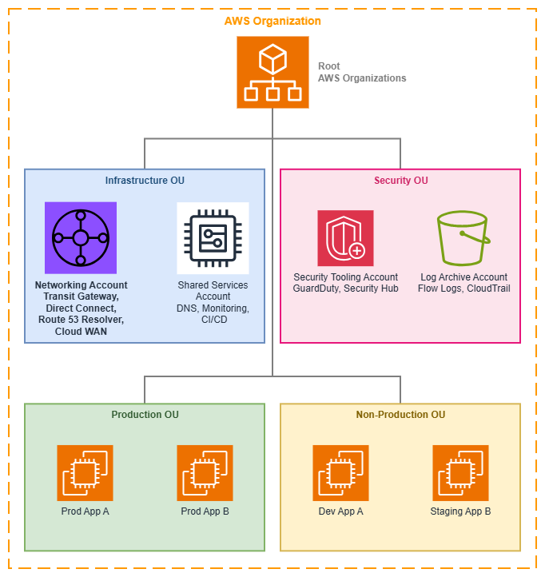

# AWS Organizations とアカウント構造 {#aws-organizations-and-account-structure}

!!! info "前提条件"
    このセクションは [Before You Start](aws-prerequisites.md) の内容を理解していることを前提としています。AWS ネットワーキングの基礎を初めて学ぶ方は、まずそちらのページをご確認ください。

AWS Organizations は複数の AWS アカウントの一元管理とガバナンスを実現し、スケーラブルかつセキュアなネットワークアーキテクチャの基盤を提供します。ネットワーキングの観点では、Organizations はオプションのインフラではありません。ネットワークリソースの共有方法、セキュリティ境界の適用方法、そしてチームが接続の混乱を招かずに独立して運用する方法を決定するコントロールプレーンです。

適切に設計されたマルチアカウント戦略は、ワークロードを分離し、請求を簡素化し、ネットワークの一元管理を可能にします。Organizations がなければ、クロスアカウントのネットワーキングパターン(Transit Gateway の共有、集中型 DNS、IPAM の委任、RAM によるリソース共有)はすべて手動の信頼関係に依存することになり、スケールせず一貫したガバナンスも実現できません。

/// caption
AWS Organizations の構造 — [Drawio ソース](../assets/foundation/organizations-structure.drawio)
///

## コアコンセプト {#core-concepts}

### 組織単位 (OUs) {#organizational-units-ous}

OU は、ビジネス構造とガバナンス境界を反映したアカウントの論理的なグループです。ネットワーキングにおいて、OU は二重の役割を果たします。アカウントを人間が理解しやすい形で整理するとともに、リソース共有の自動化、ポリシーの適用、アタッチメントの承認スコープを提供します。

**主な機能:**

*   :material-file-tree: **階層構造**

    ---

    OU はネストして組織の複雑さを反映できます。ネットワークポリシー (SCP、RAM 共有、IPAM 委任) は階層の任意のレベルを対象にできます。

*   :material-share-variant: **RAM 共有スコープ**

    ---

    ネットワーキングリソース (Transit Gateway、IPAM プール、VPC Lattice サービスネットワーク、Route 53 Resolver ルール) を個別アカウントではなく OU 全体と共有できます。新しいアカウントは自動的にアクセスを継承します。

*   :material-tag-check: **アタッチメントの自動化**

    ---

    AWS Cloud WAN と Transit Gateway は、リクエスト元アカウントの OU メンバーシップに基づいてアタッチメントを自動承認できるため、ネットワーキングチームがボトルネックになることを防ぎます。

*   :material-shield-lock: **ポリシーの継承**

    ---

    OU に適用された SCP はすべての子アカウントおよびネストされた OU にカスケードされ、アカウントごとの設定なしに一貫したガバナンスを実現します。

ネットワーキングに特化した一般的な OU パターン:

* **Infrastructure OU**: 集中管理されたネットワーキングアカウント、共有サービス、DNS
* **Security OU**: セキュリティツール、ログアーカイブ、監査アカウント
* **Production OU**: 厳格な変更管理が適用された本番ワークロードアカウント
* **Non-Production OU**: 緩やかなポリシーが適用された開発・テスト・ステージングアカウント
* **Sandbox OU**: 本番ネットワークへの接続を持たない実験用アカウント

### サービスコントロールポリシー (SCPs) {#service-control-policies-scps}

SCP は、アカウントおよび OU 全体で利用可能な最大権限を定義します。SCP は権限を付与するものではなく、IAM ポリシーが超えられないガードレールを設定します。ネットワーキングにおいて、SCP はアーキテクチャに違反する接続パターンを善意のチームが作成することを防ぐための適用メカニズムです。

**ネットワーキング固有の SCP パターン:**

* **未承認の VPC 作成を防止**: `ec2:CreateVpc` を VPC を所有すべきアカウントに限定し、シャドーネットワークを防ぎます
* **リージョン制限を適用**: `ec2:*` アクションを承認済みリージョンに限定し、予期しない場所へのネットワークリソース作成を防ぎます
* **パブリック IP の割り当てをブロック**: プライベートのままであるべきアカウントで、パブリック IP パラメーターを含む `ec2:AssociateAddress` および `ec2:RunInstances` を拒否します
* **タグ付けを強制**: VPC、サブネット、Transit Gateway アタッチメントに特定のタグを必須とし、Cloud WAN セグメントへの自動割り当てを可能にします
* **共有リソースを保護**: ワークロードアカウントが RAM リソース共有を変更したり、Transit Gateway からデタッチしたりすることを防ぎます
* **IPv6 を誤ってブロックしない**: `ec2:*` アクションを制限する SCP は、`ec2:AssignIpv6Addresses`、`ec2:AssociateSubnetCidrBlock` (IPv6 用)、`ec2:CreateEgressOnlyInternetGateway` をブロックしてはなりません。IPv6 オペレーションに対して SCP を明示的にテストしてください。よくある失敗として、IPv4 の VPC 作成では機能するが IPv6 CIDR の関連付けをサイレントにブロックする SCP があります

### 集中管理されたネットワーキングアカウント {#centralized-networking-account}

専用のネットワーキングアカウントが共有接続インフラストラクチャをホストします。これはマルチアカウントネットワーキングにおける最も重要なアーキテクチャ上の決定であり、「ネットワーク」と「ネットワークを使用するワークロード」の間に明確な所有権の境界を確立します。

**ネットワーキングアカウントに属するもの:**

* AWS Transit Gateway または AWS Cloud WAN コアネットワーク
* AWS Direct Connect 接続とゲートウェイ
* Route 53 Resolver エンドポイントと転送ルール
* 集中管理された NAT ゲートウェイまたは Egress VPC (集中型 Egress を使用する場合)
* Network Firewall インスペクション VPC
* IPAM 管理者委任 (IPv6 プール管理を含む)
* VPN 接続と Customer Gateway

**コスト可視化に関する注意:** ネットワーキングアカウントには、消費アカウント数に応じてスケールするコストが集中します。Transit Gateway のアタッチメント時間課金 ([Transit Gateway 料金](https://aws.amazon.com/transit-gateway/pricing/) を参照)、Cloud WAN アタッチメント時間、Transit Gateway または Cloud WAN を通過するデータ処理の GB 単位課金、集中型 Egress の NAT ゲートウェイ時間課金と GB 単位課金などが含まれます。コスト配分タグを使用した Organizations の一括請求を活用し、これらの共有コストをトラフィックを生成するワークロードアカウントに帰属させてください。この帰属がなければ、組織のスケールに伴いネットワーキングアカウントの請求額が不透明なまま増加し続けます。

**ネットワーキングアカウントに属さないもの:**

* アプリケーションワークロード (EC2、ECS、Lambda)
* アプリケーションロードバランサー
* VPC Lattice サービス (これらはサービスオーナーのアカウントに属します)
* アプリケーションごとのセキュリティグループ

## ベストプラクティス {#best-practices}

### ワークロードアカウントより先にネットワーキングアカウントを構築する {#establish-the-networking-account-before-any-workload-accounts}

ネットワーキングアカウントは、管理アカウントとセキュリティアカウントの次に最初に作成すべきアカウントです。以降のすべてのワークロードアカウントは共有ネットワーキングリソースに依存するため、各チームが独自の接続を構築した後から集中管理型ネットワーキングを後付けするのは、最初から集中管理型で始めるよりもはるかに困難です。

この順序が重要な理由は、集中管理モデルが存在しない状態で独自の Transit Gateway、VPN 接続、または Direct Connect ゲートウェイを作成したチームは、後から移行に抵抗するためです。独自の接続を構築するアカウントが増えるほど、やり直しのコストは膨らみます。早い段階でパターンを確立し、初日から RAM 経由でリソースを共有することで、新しいアカウントは自動的に接続性を継承できます。

### OU は組織図ではなくガバナンス境界に基づいて設計する {#design-ous-around-governance-boundaries-not-org-charts}

よくある間違いは、会社の報告体制を OU 階層に反映させることです。OU は*ガバナンスおよびポリシーの境界*、つまり同じセキュリティポスチャ、コンプライアンス要件、ネットワークアクセスパターンを共有するアカウントのグループを反映すべきです。

ネットワーキングの観点では、同じレベルのネットワークアクセス、同じ SCP 制限、同じ RAM リソース共有を必要とするアカウントは同じ OU に配置すべきです。「プラットフォームエンジニアリング」チームは、共有サービス用の Infrastructure OU と本番ワークロード用の Production OU の両方にアカウントを持つ場合があります。OU が反映するのは適用されるポリシーであり、アカウントの所有者ではありません。

この設計原則がネットワーキングに直接影響する理由は、RAM 共有、SCP の適用、Cloud WAN アタッチメントポリシーがすべて OU レベルで機能するためです。OU がネットワークガバナンス境界と一致していない場合、リソース共有の範囲が過度に広くなるか、アカウントごとの例外処理が複雑になります。

### SCP はセキュリティだけでなくネットワークアーキテクチャの強制にも活用する {#use-scps-to-enforce-network-architecture-not-just-security}

多くの組織は SCP をセキュリティのガードレールとして捉えています。しかしネットワーキングにおいて、SCP は*アーキテクチャの強制*としても同様に重要です。SCP は意図したネットワークトポロジーからの逸脱を防ぎます。

**アーキテクチャを強制する SCP の例:**

* 集中管理型エグレスを使用すべきアカウントで `ec2:CreateInternetGateway` を拒否する — これはセキュリティポリシーではなく、トラフィックが検査インフラを経由することを保証するアーキテクチャポリシーです
* IPAM 管理範囲外の CIDR ブロックを指定した `ec2:CreateVpc` を拒否する — これにより IP の競合を事前に防止できます
* `ec2:CreateVpc` に `network-segment` タグを必須とする — これにより Cloud WAN アタッチメントの自動承認が可能になります
* ワークロードアカウントで `ec2:CreateTransitGateway` を拒否する — Transit Gateway はネットワーキングアカウントのみが所有すべきです

重要な洞察: SCP によってネットワークアーキテクチャが自己強制的になります。逸脱を引き起こす API 呼び出しが Organizations レベルで拒否されるため、チームが意図したトポロジーから誤って(または意図的に)逸脱することができなくなります。

### IPAM の管理をネットワーキングアカウントに委任する {#delegate-ipam-administration-to-the-networking-account}

AWS IPAM は Organizations を通じた[委任管理](https://docs.aws.amazon.com/vpc/latest/ipam/ipam-delegated-admin.html)をサポートしています。IPAM をネットワーキングアカウントに委任することで、ネットワーキングチームは管理アカウントへのアクセスを必要とせずに、IP アドレスプール、割り当てルール、コンプライアンス監視を管理できます。

この委任により、ワークロードアカウントは RAM 経由で共有された IPAM プールから CIDR の割り当てをリクエストできるようになり、組織全体で重複しないアドレス空間を確保できます。これを行わない場合、アカウント数が少数を超えてスケールするにつれて、アカウント間の IP 競合は避けられません。

### リソースはアカウントレベルではなく OU レベルで共有する {#share-resources-at-the-ou-level-not-the-account-level}

AWS RAM 経由でネットワーキングリソース(Transit Gateway、IPAM プール、Route 53 Resolver ルール、VPC Lattice サービスネットワーク)を共有する際は、個々のアカウントではなく OU に対して共有してください。これにより、OU に追加された新しいアカウントは手動操作なしに共有ネットワーキングリソースへのアクセスを自動的に継承できます。

これは Transit Gateway および Cloud WAN アタッチメントにおいて特に重要です。Production OU に新しいワークロードアカウントが作成された場合、そのアカウントはすぐに VPC を作成して共有 Transit Gateway または Cloud WAN セグメントにアタッチできるべきです。アカウントレベルで共有している場合、誰かが RAM 共有を更新するまでの間、アカウント作成とネットワーク接続の間に常にタイムラグが生じます。

### 管理アカウントとネットワーキングを分離する {#separate-the-management-account-from-networking}

管理アカウント(Organization を所有するアカウント)にはネットワーキングインフラをホストすべきではありません。管理アカウントは固有のセキュリティ特性を持ちます — SCP による制限を受けず、すべての組織機能にルートレベルでアクセスできます。管理アカウントは最小限の用途、すなわち Organizations の管理と請求のみに限定してください。

Transit Gateway や Direct Connect を管理アカウントにホストすると、セキュリティリスク(最も広い権限を持つアカウントがネットワークも制御する)と運用リスク(組織設定の変更がネットワークインフラに意図せず影響する可能性)が生じます。

### OU 構造はネットワークセグメンテーションを考慮して初日から設計する {#plan-your-ou-structure-for-network-segmentation-from-day-one}

OU 階層はネットワークセグメンテーション戦略に直接対応します。AWS Cloud WAN を使用する場合、アタッチメント承認ポリシーは OU メンバーシップを参照して VPC が参加するセグメントを決定します。複数のルートテーブルを持つ Transit Gateway を使用する場合、OU にスコープされた RAM 共有によってどのアカウントがどのルートテーブルにアタッチできるかが決まります。

同じ OU 内のアカウントが同じネットワークセグメント、同じ検査レベル、同じ接続パターンを共有するように OU を設計してください。この整合性により、ネットワークセグメンテーションが自己文書化されます。OU 構造を見るだけでトラフィックの流れが把握できます。

**避けるべきアンチパターン:** フラットな OU 構造(すべてのワークロードアカウントを単一の「Workloads」OU に配置)を作成し、アカウントごとの RAM 共有や複雑な SCP 条件でネットワークアクセスを差別化しようとすること。このアプローチはスケールせず、組織構造とネットワークトポロジーの関係が不透明になります。

### ネットワークガバナンスのために SCP と合わせてタグポリシーを使用する {#use-tag-policies-alongside-scps-for-network-governance}

[タグポリシー](https://docs.aws.amazon.com/organizations/latest/userguide/orgs_manage_policies_tag-policies.html)は、Organization 全体で一貫したタグ値を強制することで SCP を補完します。SCP はリソースにタグが*存在する*ことを要求できますが、タグポリシーはタグの*値*が標準に準拠していることを保証します。

ネットワーキングにおいてこれが重要な理由は、自動化システム(Cloud WAN アタッチメントポリシー、IPAM 割り当てルール、コスト配分)が一貫したタグ値に依存しているためです。あるチームが VPC に `environment:prod` とタグ付けし、別のチームが `env:production` を使用した場合、自動化はサイレントに機能しなくなります。

以下を強制するタグポリシーを定義してください:

* ネットワークセグメントタグの許可値(例: `network-segment` は `production`、`development`、`shared-services`、`pci` のいずれかでなければならない)
* すべてのアカウントにわたる一貫した環境名
* ネットワークリソース(NAT ゲートウェイ、Transit Gateway アタッチメント、VPN 接続)への必須コスト配分タグ

### ネットワークアカウントのベンディングパターンを実装する {#implement-a-network-account-vending-pattern}

組織がスケールするにつれて、新しいアカウントごとにネットワーク接続を手動で設定することがボトルネックになります。AWS Control Tower Account Factory またはカスタムソリューションを通じて、以下を自動的に実行するアカウントベンディングパターンを実装してください:

1. 正しい OU にアカウントを作成する
2. 適切な IPAM プールから CIDR ブロックを割り当てる
3. 標準のサブネットレイアウトで VPC を作成する
4. VPC を Transit Gateway または Cloud WAN にアタッチする
5. DNS 解決のために Route 53 Resolver ルールを設定する
6. ベースラインのセキュリティグループと NACL を適用する

このパターンにより、すべての新しいアカウントが最初から正しく一貫したネットワーキングで開始できます。チームはネットワーキングチームが接続をプロビジョニングするのを待つ必要がなく、ネットワーキングチームも非標準の設定を心配する必要がありません。

## AWS Organizations を使用するタイミング {#when-to-use-aws-organizations}

AWS Organizations は、アカウント間のネットワーク接続が必要な複数の AWS アカウントを持つあらゆる環境に適した選択肢です。実際には、ほぼすべての本番 AWS デプロイメントが該当します。

**Organizations を使用すべき場合:**

* AWS アカウントが 2〜3 個以上ある(または今後増える予定がある)
* 異なるアカウントのワークロード間で通信が必要
* 集中管理されたネットワークインフラ(Transit Gateway、Direct Connect、DNS)が必要
* アカウント全体で一貫したセキュリティポリシーを適用したい
* 新しいアカウントの作成時にリソース共有を自動化したい
* コンプライアンス要件として、集中ガバナンスと監査証跡が義務付けられている

**単一アカウントで十分な場合:**

* 概念実証(PoC)や個人プロジェクトを実行している
* すべてのワークロードが分離の懸念なく 1 つのアカウントに共存できる
* アカウントレベルの分離に関するコンプライアンス要件がない
* クロスアカウントネットワーキングが不要(すべてが 1 つの VPC 内、または 1 つのアカウント内でピアリングされた VPC 内に収まっている)

**移行の判断基準**: 最初のアカウントと通信する 2 つ目のアカウントが必要になった時点で、Organizations を設定してください。導入の手間は最小限であり、既存のマルチアカウント環境に後から Organizations を組み込む作業は、最初から導入する場合と比べて大幅に工数がかかります。

**よくある移行シナリオ**: Organizations なしで複数のアカウントをすでに運用している場合、移行パスは明確ですが計画が必要です。既存のアカウントを新しい Organization に招待することは可能ですが、既存のネットワークリソース(Transit Gateway、VPN 接続、Direct Connect)が自動的に集中管理モデルに移行されるわけではありません。移行はフェーズに分けて計画してください。まず Organization と OU 構造を確立し、次に集中管理用のネットワークアカウントを作成し、その後、共有ネットワークリソースを段階的に移行して RAM 共有を更新します。

## AWS Organizations と他のサービスの組み合わせ {#combining-aws-organizations-with-other-services}

Organizations は、他のすべてのマルチアカウントネットワーキングサービスをスケールで運用するためのガバナンスレイヤーです。Organizations がなければ、これらのサービスはそれぞれアカウントごとに手動で設定する必要があり、スケールしません。

| 組み合わせ | Organizations が提供するもの | 他のサービスが提供するもの |
| --- | --- | --- |
| **Organizations + AWS RAM** | 共有スコープ(OU およびアカウント)、新規アカウントへの自動継承 | Transit Gateway、IPAM プール、Resolver ルール、VPC Lattice サービスネットワークの実際のリソース共有メカニズム |
| **Organizations + AWS Transit Gateway** | アタッチメントガバナンスのための SCP 適用、Transit Gateway の RAM 共有スコープ | VPC とハイブリッド接続間のリージョンハブアンドスポークルーティング |
| **Organizations + AWS Cloud WAN** | OU ベースのアタッチメント受け入れポリシー、セグメント割り当てのための SCP 強制タグ付け | セグメンテーションを備えたグローバルなポリシー駆動型ネットワーク管理 |
| **Organizations + Amazon VPC IPAM** | 委任管理、OU スコープのプール共有、全アカウントにわたるコンプライアンス監視 | IP アドレスの計画、割り当て、および競合防止 |
| **Organizations + Route 53 Resolver** | OU 全体への Resolver ルールの RAM 共有、組織全体での一貫した DNS 解決 | VPC とオンプレミス間の集中型 DNS フォワーディング |
| **Organizations + AWS Network Firewall** | アカウントが集中検査をバイパスするのを防ぐ SCP 適用 | ステートフルなトラフィック検査とフィルタリング |
| **Organizations + Amazon VPC Lattice** | OU レベルでのサービスネットワークの RAM 共有、`aws:PrincipalOrgID` に対する認証ポリシー条件 | アプリケーション層のサービス間通信 |
| **Organizations + AWS Control Tower** | 組織構造とアカウントファクトリー | ネットワーキングガードレールが事前設定された自動ランディングゾーンのセットアップ |

***重要なポイント:*** *Organizations はパケットを転送するサービスではありません。実際にパケットを転送するサービスを誰が作成・共有・接続できるかを決定するサービスです。スケールにおけるすべてのネットワーキング上の意思決定は、Organizations が提供するガバナンス構造を通じて行われます。*

## ドキュメント {#documentation}

*   :material-file-document: **AWS Organizations ユーザーガイド**

    ---

    OU、SCP、委任管理、および他の AWS サービスとの統合を含む完全なサービスドキュメントです。

    [:octicons-arrow-right-24: ドキュメント](https://docs.aws.amazon.com/organizations/latest/userguide/orgs_introduction.html)

*   :material-book-open-variant: **AWS 環境の整理**

    ---

    マルチアカウント戦略、OU 設計パターン、およびガバナンスのベストプラクティスに関する AWS ホワイトペーパーです。

    [:octicons-arrow-right-24: ホワイトペーパー](https://docs.aws.amazon.com/whitepapers/latest/organizing-your-aws-environment/organizing-your-aws-environment.html)

*   :material-office-building: **ランディングゾーンの構築**

    ---

    ネットワーキング、セキュリティ、およびガバナンスの基盤を備えたマルチアカウント環境のセットアップに関する規範的なガイダンスです。

    [:octicons-arrow-right-24: ガイド](https://docs.aws.amazon.com/prescriptive-guidance/latest/migration-aws-environment/building-landing-zones.html)

*   :material-share-variant: **AWS Resource Access Manager**

    ---

    Organization 内のアカウントおよび OU 間でネットワーキングリソースを共有するためのドキュメントです。

    [:octicons-arrow-right-24: ドキュメント](https://docs.aws.amazon.com/ram/latest/userguide/what-is.html)

*   :material-shield-check: **サービスコントロールポリシー**

    ---

    SCP の構文、例、継承動作、およびポリシー設計のベストプラクティスです。

    [:octicons-arrow-right-24: ドキュメント](https://docs.aws.amazon.com/organizations/latest/userguide/orgs_manage_policies_scps.html)

*   :material-network: **マルチ VPC ネットワークインフラストラクチャ**

    ---

    集中型ネットワーキングパターンを用いたスケーラブルかつセキュアなマルチ VPC アーキテクチャの構築に関する AWS ホワイトペーパーです。

    [:octicons-arrow-right-24: ホワイトペーパー](https://docs.aws.amazon.com/whitepapers/latest/building-scalable-secure-multi-vpc-network-infrastructure/welcome.html)

## Organizations とその他の基盤コンポーネントとの関係 {#how-organizations-relates-to-the-rest-of-the-foundation}

AWS Organizations は、他のすべての基盤コンポーネントの上位に位置するガバナンスレイヤーです。[VPC](vpc.md) の設計、[CIDR 計画](cidr.md)、[サブネット戦略](subnets.md)、[IPAM 設定](ipam.md)はいずれも、Organizations が定義する構造の中で機能します。

**その他の基盤トピックとの関係:**

* **[Amazon VPC](vpc.md)**: Organizations は、どのアカウントが VPC を作成できるか、また使用できる CIDR 範囲を決定します(SCP および IPAM 委任を通じて)
* **[CIDR 計画](cidr.md)**: Organizations を通じて共有される IPAM プールにより、すべてのアカウント間でアドレス空間の重複を防ぎます
* **[サブネット](subnets.md)**: SCP によってサブネットのタグ付けを強制し、承認済みのアベイラビリティーゾーンへのサブネット作成を制限できます
* **[IPAM](ipam.md)**: Organizations を通じた IPAM 管理の委任により、IP ガバナンスの一元化が実現します
* **[リージョンとアベイラビリティーゾーン](regions-azs.md)**: SCP によってアカウントがリソースをデプロイできるリージョンを制限し、ネットワークの地理的なフットプリントを直接制御します

**接続性との関係:**

* **[AWS 内の接続性](../connectivity/within-aws.md)**: Transit Gateway および Cloud WAN は、RAM 共有とアタッチメントのガバナンスのために Organizations に依存しています
* **[ハイブリッド & マルチクラウド](../connectivity/hybrid-multicloud.md)**: 集中型ネットワーキングアカウント内の Direct Connect および VPN リソースは、RAM を通じて Organization 全体に共有されます
* **[インターネット接続性](../connectivity/internet.md)**: 集中型エグレスパターンは、トラフィックを検査インフラストラクチャ経由で流すことを強制するために Organizations に依存しています
