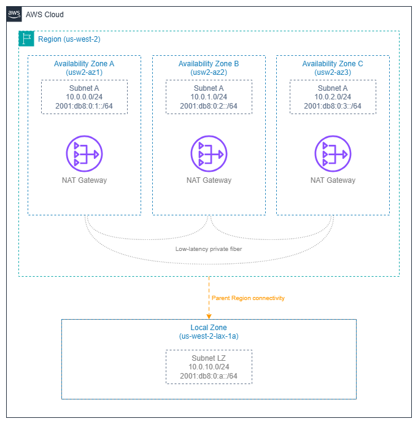

# リージョンとアベイラビリティーゾーン {#regions-and-availability-zones}

!!! info "前提条件"
    このページは、[始める前に](aws-prerequisites.md) で説明している概念を理解していることを前提としています。AWS ネットワーキングの基礎を初めて学ぶ方は、先にそちらをご確認ください。

AWS インフラストラクチャはリージョンとアベイラビリティーゾーン (Availability Zone) で構成されています。サブネットのレイアウト、NAT ゲートウェイの配置、ロードバランサーのデプロイ、Direct Connect の終端など、あらゆるネットワーキングの意思決定は、リージョンとアベイラビリティーゾーンの仕組みによって左右されます。このページでは、それらの意思決定の基盤となるインフラストラクチャの背景として、リージョンとアベイラビリティーゾーンとは何か、ネットワーク設計にどう影響するか、そして回復性が高くコスト効率に優れたアーキテクチャを実現するパターンについて説明します。

ネットワーキングで最もよくある失敗は、サービスの設定ミスではありません。リージョンやアベイラビリティーゾーンの選択が、サブネットのサイジング、トラフィックコスト、障害の影響範囲にどう波及するかを考慮し損ねることです。この層を深く理解することで、そうした失敗を未然に防ぐことができます。

/// caption
リージョンとアベイラビリティーゾーン — [Drawio ソース](../assets/foundation/regions-azs-layout.drawio)
///

## AWS リージョン {#aws-regions}

AWS リージョンとは、特定の地理的エリアに集積したデータセンターのクラスターであり、AWS プラットフォームの完全に独立したインスタンスとして動作します。各リージョンは独自のコントロールプレーン、独自の API エンドポイント、および独自のサービスセットを持ちます。レプリケーションや転送を明示的に設定しない限り、データがリージョン外に出ることはありません。

ネットワーキングの観点では、リージョンはほとんどのインフラ障害に対する影響範囲(ブラストラジアス)の境界であり、Transit Gateway、NAT ゲートウェイ、VPC エンドポイントといったサービスのデプロイ単位でもあります。マルチリージョンアーキテクチャも存在しますが、明示的なリージョン間接続(VPC ピアリング、Transit Gateway ピアリング、またはエッジでの CloudFront/Global Accelerator)が必要です。

***重要なポイント:*** *リージョンの選択は、レイテンシやコンプライアンスだけの問題ではなく、ネットワーキング上の意思決定です。リージョンの選択によって、利用可能な Direct Connect ロケーション、使用できるサービス、およびリージョン間トラフィックのコスト構造が決まります。*

### ネットワーキングにおけるリージョン選択基準 {#region-selection-criteria-for-networking}

| 基準 | ネットワーキングへの影響 | 評価方法 |
| --- | --- | --- |
| **ユーザーへのレイテンシ** | エッジサービス(CloudFront、Global Accelerator)が必要か、リージョンから直接配信できるかを左右する。 | ユーザーの所在地から実測する。地理的な近さがそのまま低レイテンシを意味するとは限らない。 |
| **Direct Connect ロケーション** | リージョンによって Direct Connect パートナーのエコシステムが異なる。近くに DX ロケーションがないリージョンでは、ハイブリッド接続のレイテンシが高くなる。 | ハイブリッドワークロード向けにリージョンを確定する前に、[AWS Direct Connect ロケーションページ](https://aws.amazon.com/directconnect/locations/)を確認する。 |
| **サービスの提供状況** | 新しいネットワーキングサービス(VPC Lattice、Cloud WAN、IPv6 専用サブネットなど)は主要リージョンから先行リリースされる。小規模なリージョンを選ぶと、アーキテクチャの選択肢が制限される場合がある。 | デプロイ前に、設計で使用するすべてのサービスが対象リージョンで利用可能であることを確認する。 |
| **IPv6 サービスの対応状況** | ネットワーキング機能の IPv6 サポートはリージョンによって異なる。IPv6 専用サブネット、デュアルスタック VPC Lattice、IPv6 Transit Gateway ルーティングはいずれも主要リージョンから先行リリースされた。 | 対象リージョンの各サービスで IPv6 サポートを確認する。IPv6 サポートが部分的なリージョンでデュアルスタックアーキテクチャを構築すると、運用上の一貫性が損なわれる。 |
| **リージョン間データ転送コスト** | リージョン間トラフィックはリージョン内トラフィックと比べて大幅にコストが高い。マルチリージョン設計では、レプリケーションや API 呼び出しのコストを考慮する必要がある。 | 想定されるリージョン間トラフィック量を見積もり、アーキテクチャレビューでコストを明示的に試算する。 |
| **コンプライアンスとデータレジデンシー** | 規制によっては、データを特定の地理的境界内に保持することが求められ、他の要因に関わらずリージョンの選択が制約される。 | 規制上の制約を最初に特定する。これはすべての他の基準より優先される。 |

## アベイラビリティーゾーン {#availability-zones}

アベイラビリティーゾーン (Availability Zone) とは、1 つのリージョン内にある 1 つ以上の独立したデータセンターで構成され、それぞれが冗長化された電源、ネットワーク、および接続性を備えています。同一リージョン内のアベイラビリティーゾーン間は、低レイテンシかつ高スループットのプライベートファイバー (通常はラウンドトリップ 2ms 未満) で接続されていますが、局所的な障害 (電力網の停止、洪水、火災など) が 1 つのアベイラビリティーゾーンにのみ影響するよう、物理的に十分な距離を置いて配置されています。

すべてのリージョンには最低 3 つのアベイラビリティーゾーンがあります。これは、クォーラムベースのシステムに必要な最小数であり、単一のアベイラビリティーゾーン障害が発生した際に可用性を維持しながら、十分なキャパシティの余裕を確保するためでもあります。

***重要なポイント:*** *アベイラビリティーゾーンは、リージョン内における障害分離の単位です。デプロイするすべてのネットワーキングリソース — サブネット、NAT ゲートウェイ、ロードバランサーノード、インターフェイスエンドポイント — は、必ず 1 つのアベイラビリティーゾーンに属します。マルチ AZ 戦略は、実質的には「AZ ごとにサブネットを配置する」戦略です。この設計を誤ると、未使用のキャパシティにコストを払い続けるか、最も必要なときに可用性を失うかのどちらかになります。*

### アベイラビリティーゾーン ID とアベイラビリティーゾーン名 {#availability-zone-ids-vs-availability-zone-names}

これはアベイラビリティーゾーンのアーキテクチャにおいて最も誤解されやすい点であり、クロスアカウントのネットワーキングで実際に問題を引き起こします。

* **AZ 名** (`us-east-1a` など) は AWS アカウントごとにランダムにマッピングされます。あなたのアカウントの `us-east-1a` と別のアカウントの `us-east-1a` は、異なる物理的な場所を指している場合があります。
* **AZ ID** (`use1-az1` など) はすべてのアカウントで一貫しており、同一の物理インフラストラクチャにマッピングされます。

| シナリオ | アベイラビリティーゾーン名と ID のどちらを使用するか |
| --- | --- |
| 単一アカウントのデプロイ、CloudFormation テンプレート | アベイラビリティーゾーン名で問題なし |
| クロスアカウントの共有サブネット (AWS RAM) | **AZ ID が必須** |
| クロスアカウントの Transit Gateway または VPC ピアリングのトラフィック分析 | **AZ ID が必須** |
| パートナーまたはカスタマーアカウントとの配置の調整 | **AZ ID が必須** |
| アカウントをまたいだクロス AZ データ転送料金の分析 | **AZ ID が必須** |

AWS Resource Access Manager を通じてサブネットを共有する場合、共有サブネットのアベイラビリティーゾーンはアベイラビリティーゾーン ID で識別されます。共有 VPC、集中型エグレス、Transit Gateway アタッチメントなど、クロスアカウントのアーキテクチャを構築する際は、アベイラビリティーゾーン名ではなく、常にアベイラビリティーゾーン ID を基準に考えるようにしてください。

## ベストプラクティス {#best-practices}

### ネットワーキングのマルチ AZ 設計パターン {#multi-az-design-patterns-for-networking}

#### ステートフルなネットワーキングリソースは AZ ごとにデプロイする {#deploy-every-stateful-networking-resource-per-az}

NAT ゲートウェイ、インターフェイス VPC エンドポイント、ロードバランサーノードは AZ スコープのリソースです。1 つの Availability Zone に NAT ゲートウェイを 1 つだけデプロイし、すべてのプライベートサブネットをそこ経由でルーティングすると、単一障害点が生まれるだけでなく、他の Availability Zone からのすべてのパケットに AZ 間データ転送料金が発生します。

正しいパターンは次のとおりです。

* **各パブリックサブネット層の Availability Zone ごとに 1 つの NAT ゲートウェイ**を配置する。各 Availability Zone のプライベートサブネットのルートテーブルは、同じ Availability Zone 内の NAT ゲートウェイを指すようにする。
* **エンドポイントを使用するワークロードが存在するすべての Availability Zone にインターフェイス VPC エンドポイント**を配置する。ある Availability Zone にエンドポイントがない場合、その Availability Zone からのトラフィックは別の Availability Zone を経由してエンドポイントに到達することになり、レイテンシとコストが増加する。
* **ターゲットが存在するすべての Availability Zone でロードバランサーを有効化**する。Availability Zone が欠けた ALB または NLB は、非対称ルーティングとターゲット負荷の偏りを引き起こす。

***重要なポイント:*** *「AZ ごと」のパターンは固定リソースのコストが増加します(NAT ゲートウェイが 1 つではなく 3 つ)。しかし、AZ 間データ転送料金をなくし、単一 AZ 障害のリスクを排除し、障害の影響範囲を限定できます。本番ワークロードには、AZ ごとのパターンが正解です。*

#### N-1 Availability Zone の容量でサイジングする {#size-for-n-1-availability-zone-capacity}

1 つの Availability Zone が失われても残りの Availability Zone が過負荷にならないよう、AZ ごとの容量を設計してください。3 AZ 構成では、各 Availability Zone がピーク負荷の 50%(33% ではなく)を処理できるようにしておくことで、障害発生時に 2 つの Availability Zone がワークロード全体を吸収できます。

これは以下に適用されます。

* Auto Scaling グループの Availability Zone ごとの最小数と希望数
* NAT ゲートウェイのスループットのヘッドルーム(各 NAT GW は 100 Gbps を処理できますが、AZ ごとのエグレスパターンが重要です)
* サブネットの IP アドレス容量(1 つの Availability Zone が障害を起こしてワークロードが残りの 2 つで再起動する場合、それらのサブネットに IP のヘッドルームが必要です)

#### 高速な Availability Zone 退避にはゾーンシフトを使用する {#use-zonal-shift-for-fast-availability-zone-evacuation}

Amazon Application Recovery Controller のゾーンシフト(zonal shift)は、ヘルスチェックやルーティングルールを変更することなく、障害が発生した Availability Zone をロードバランサーの DNS から数秒で除外します。AWS が Availability Zone の障害を検出したときに自動的に有効化されるよう、ゾーンオートシフト(zonal autoshift)を設定してください。これは Availability Zone 退避への最速の手段であり、ヘルスチェックの失敗や手動介入よりも高速です。

### AZ 間トラフィックのコスト管理 {#cross-az-traffic-cost-management}

#### コストモデルを理解する {#understand-the-cost-model}

リージョン内の AZ 間データ転送は、ほとんどのリージョンで GB 単位・方向ごとに課金されます(往復では 2 倍)。現在の料金は [VPC pricing](https://aws.amazon.com/vpc/pricing/) を参照してください。これは IPv4 と IPv6 の両方のトラフィックに適用されます。デュアルスタックにしても AZ 間のコストモデルは変わりません。GB 単価は小さく見えますが、大規模になるとネットワーキングコストの大部分を占めます。

* 1 KB のペイロードで 1 秒あたり 10,000 リクエストを Availability Zone をまたいで処理するサービスは、月間約 1.7 TB の AZ 間トラフィックを生成します。その 1 つのサービスペアだけでも、大規模になるとコストは急速に膨らみます。
* 数十のサービス間呼び出しを持つチャッティなマイクロサービスアーキテクチャでは、AZ 間トラフィックが月間数百 TB に達することも珍しくありません。

#### 可用性を犠牲にせずに AZ 間トラフィックを最小化する {#minimize-cross-az-traffic-without-sacrificing-availability}

目標は AZ 間トラフィックをゼロにすることではありません(それは単一 AZ デプロイを意味し、本番環境では許容できません)。目標は、*不要な* AZ 間トラフィックをデータパスから排除することです。

* **AZ 対応のサービスディスカバリーを使用する**(Cloud Map とヘルスチェック、または VPC Lattice の組み込み Availability Zone アフィニティ)。ローカルに正常なターゲットが存在する場合、サービスが同じ AZ のターゲットを優先するようにする。
* **クライアントの分散が Availability Zone 間でほぼ均一な場合は、NLB のクロスゾーンロードバランシングを無効化する**。これによりトラフィックはデフォルトでゾーナルに保たれる。ALB はデフォルトでクロスゾーンが有効になっており、ALB の場合はそれが通常正しい(ALB の価値は L7 ルーティングであり、ゾーナルアフィニティではないため)。
* **アプリケーションインスタンスが稼働するすべての Availability Zone にキャッシュ(ElastiCache、DAX)を配置する**。Availability Zone をまたぐキャッシュミスはキャッシュの目的を損なう。
* **Availability Zone メタデータ付きの VPC Flow Logs を使用して**、最大の AZ 間トラフィックフローを特定し、最適化の対象とする。

***重要なポイント:*** *AZ 間コストの最適化はトラフィックエンジニアリングの問題であり、デプロイの問題ではありません。可用性のために複数の Availability Zone にデプロイしつつ、可能な限り同じ AZ 内のパスを優先するようにトラフィックをルーティングするだけです。*

### Availability Zone の選択はサブネット設計に連鎖する {#availability-zone-choices-cascade-into-subnet-design}

#### 層ごと・Availability Zone ごとに 1 つのサブネット {#one-subnet-per-availability-zone-per-tier}

基本的なサブネットパターンは、ネットワーク層(パブリック、プライベート、データなど)ごと・Availability Zone ごとに 1 つのサブネットです。これは任意ではなく、AWS ネットワーキングの仕組みそのものです。

* サブネットは厳密に 1 つの Availability Zone に存在する
* ルートテーブルはサブネットに関連付けられ、Availability Zone には関連付けられない
* サブネット内で起動されたリソースは、そのサブネットの AZ に配置される

3 AZ・3 層の VPC では、最低 9 つのサブネットが必要です。CIDR の割り当てを適切に計画してください。サイジングのガイダンスは [CIDR Planning](cidr.md) と [Subnets](subnets.md) を参照してください。

#### サブネットのサイジングは Availability Zone 障害シナリオを考慮する必要がある {#subnet-sizing-must-account-for-availability-zone-failure-scenarios}

各 Availability Zone のサブネットを現在のワークロードにぴったり合わせてサイジングすると、Availability Zone 障害からの回復に必要なヘッドルームがなくなります。Availability Zone が障害を起こして Auto Scaling が残りの Availability Zone に代替キャパシティを起動する際、それらのサブネットに利用可能な IP アドレスが必要です。各 Availability Zone のサブネットは定常状態の要件の 2 倍でサイジングするか、セカンダリ CIDR レンジをオーバーフロー用として大きめの CIDR ブロックを使用してください。

### NAT ゲートウェイの配置は Availability Zone の境界に従う {#nat-gateway-placement-follows-availability-zone-boundaries}

#### Availability Zone ごとに 1 つの NAT ゲートウェイが本番環境のパターン {#one-nat-gateway-per-availability-zone-is-the-production-pattern}

NAT ゲートウェイは AZ スコープのリソースです。Availability Zone ごとに 1 つデプロイし、各 Availability Zone のプライベートサブネットをローカルの NAT ゲートウェイにルーティングすることで、次のメリットが得られます。

* **障害の分離**: Availability Zone の障害は、その Availability Zone の NAT ゲートウェイのみに影響し、VPC 全体のエグレスには影響しない。
* **AZ 間料金なし**: プライベートサブネットからインターネットへのトラフィックは、NAT ゲートウェイに到達するまで同じ Availability Zone 内に留まり、その後インターネットゲートウェイ(リージョンスコープで AZ 間料金なし)を通じて外部に出る。
* **予測可能なスループット**: 各 NAT ゲートウェイが独立して最大 100 Gbps を処理する。

単一 NAT ゲートウェイパターン(NAT GW が 1 つで、すべての Availability Zone がそこにルーティングする)は、可用性よりもコストが優先される開発・テスト環境にのみ適しています。

### ロードバランサーのデプロイと Availability Zone 対応 {#load-balancer-deployment-and-availability-zone-awareness}

#### ターゲットが存在するすべての Availability Zone を有効化する {#enable-all-availability-zones-where-targets-exist}

ALB または NLB を作成する際、動作させる Availability Zone を選択します。ロードバランサーは選択した各 Availability Zone にノードを配置します。3 つの Availability Zone にターゲットがあるにもかかわらず、ロードバランサーで 2 つの Availability Zone しか有効化しない場合、3 つ目の Availability Zone のターゲットには到達できません。

#### クロスゾーンロードバランシングの影響を理解する {#understand-cross-zone-load-balancing-implications}

| ロードバランサー | クロスゾーンのデフォルト | コストへの影響 |
| --- | --- | --- |
| ALB | **有効** | ALB からターゲットへのトラフィックに追加の AZ 間料金は発生しない |
| NLB | **無効** | 有効化した場合、NLB からターゲットへのクロスゾーントラフィックに標準の AZ 間データ転送料金が発生する |
| GWLB | **無効** | 有効化した場合、GWLB からアプライアンスへのクロスゾーントラフィックに標準の AZ 間データ転送料金が発生する |

ALB のクロスゾーンがデフォルトで有効なのは、ほとんどのワークロードにとって正しい設定です。ALB の価値は L7 ルーティングと均等な分散にあるためです。NLB のクロスゾーンがデフォルトで無効なのは、ゾーナルアフィニティの恩恵を受け、AZ 間料金を避けたいワークロードに適しています。ただし、ターゲットが Availability Zone 間で均等に分散されていることが前提です。

## ローカルゾーンと Wavelength ゾーン {#local-zones-and-wavelength-zones}

### ローカルゾーン {#local-zones}

AWS ローカルゾーンは、コンピューティング、ストレージ、および一部のネットワーキングサービスをエンドユーザーの近くに配置する、親リージョンの拡張機能です。ネットワーキングの観点からは、以下の点が重要です。

* ローカルゾーンのサブネットは親リージョンの VPC の一部ですが、ローカルゾーンの物理的な場所に存在します。
* **ローカルゾーンからのインターネットエグレスは、ローカルゾーン独自のインターネットゲートウェイを使用します** — インターネットアクセスのために親リージョンへトラフィックをバックホールすることはありません。
* **ローカルゾーンと親リージョン間のトラフィックは、パブリックインターネットではなく AWS バックボーンを経由します**。ただし、クロス AZ トラフィックと同様のデータ転送料金が発生します。
* **すべてのネットワーキングサービスがローカルゾーンで利用できるわけではありません**。NAT ゲートウェイ、Transit Gateway アタッチメント、VPC エンドポイントは利用できない場合があります — 特定のローカルゾーンについては [ローカルゾーンの機能ページ](https://aws.amazon.com/about-aws/global-infrastructure/localzones/features/) を確認してください。
* **サブネット設計**: 既存の VPC 内のローカルゾーンに専用サブネットを作成します。ローカルゾーンサブネットのルートテーブルは、親リージョンのアベイラビリティーゾーンのルートテーブルとは独立しています。

***重要なポイント:*** *ローカルゾーンは、特定の都市圏からシングルデジットミリ秒のアクセスを必要とする、レイテンシーに敏感なワークロード向けです。親リージョンでのマルチ AZ デプロイの代替ではなく、アーキテクチャの残りの部分を親リージョンに維持しながら、レイテンシーに敏感な層をユーザーの近くに配置することで補完するものです。*

### Wavelength ゾーン {#wavelength-zones}

AWS Wavelength は、通信プロバイダーの 5G ネットワーク内にコンピューティングとストレージを組み込みます。ネットワーキングの観点からは、以下の点が重要です。

* Wavelength ゾーンは、キャリアネットワークとの間のトラフィック用に独自のキャリアゲートウェイを持ちます — このトラフィックはパブリックインターネットに触れることはありません。
* Wavelength ゾーンと親リージョン間のトラフィックは AWS バックボーンを使用します。
* 利用可能なネットワーキングサービスは限定されています。Wavelength ゾーン内では、NAT ゲートウェイ、VPC エンドポイント、Transit Gateway アタッチメントは使用できません。
* リージョンのアベイラビリティーゾーンへの 5G ネットワークホップが許容できないレイテンシーを追加するような、超低レイテンシーのモバイル/エッジワークロードに Wavelength を使用してください。

## ドキュメント {#documentation}

*   :material-earth: **AWS グローバルインフラストラクチャ**

    ---

    すべての AWS リージョン、アベイラビリティーゾーン、ローカルゾーン、Wavelength ゾーンのインタラクティブマップと、サービス提供状況の詳細。

    [:octicons-arrow-right-24: グローバルインフラストラクチャ](https://aws.amazon.com/about-aws/global-infrastructure/)

*   :material-map-marker-multiple: **リージョンとアベイラビリティーゾーン**

    ---

    リージョンおよびアベイラビリティーゾーンの概念、アベイラビリティーゾーン ID、プログラムによる操作方法を解説した EC2 ドキュメント。

    [:octicons-arrow-right-24: ドキュメント](https://docs.aws.amazon.com/AWSEC2/latest/UserGuide/using-regions-availability-zones.html)

*   :material-identifier: **クロスアカウント連携のための AZ ID**

    ---

    アベイラビリティーゾーン ID のマッピングと、アカウントをまたいだリソース配置を一貫して行うための AZ ID の活用方法を説明した AWS RAM ドキュメント。

    [:octicons-arrow-right-24: アベイラビリティーゾーン ID](https://docs.aws.amazon.com/ram/latest/userguide/working-with-az-ids.html)

*   :material-map-marker-radius: **ローカルゾーンの機能**

    ---

    各ローカルゾーンで利用可能なサービスのマトリクス。ネットワーキングサービス、インスタンスタイプ、ストレージオプションを網羅。

    [:octicons-arrow-right-24: ローカルゾーン](https://aws.amazon.com/about-aws/global-infrastructure/localzones/features/)

*   :material-access-point-network: **Direct Connect ロケーション**

    ---

    リージョン別の Direct Connect ロケーション一覧。リージョン選定時にハイブリッド接続オプションを評価する際に不可欠な情報。

    [:octicons-arrow-right-24: DX ロケーション](https://aws.amazon.com/directconnect/locations/)

*   :material-cellphone-wireless: **Wavelength ゾーン**

    ---

    Wavelength ゾーンのネットワーキング、キャリアゲートウェイ、および親リージョンの VPC との統合に関するドキュメント。

    [:octicons-arrow-right-24: Wavelength](https://docs.aws.amazon.com/wavelength/latest/developerguide/what-is-wavelength.html)

---

## 関連する基礎ページ {#related-foundation-pages}

このページでは、リージョンおよびアベイラビリティゾーンの選択に関するインフラストラクチャのコンテキストを提供します。以下のページでは、それらの選択が具体的なリソース設定にどのように反映されるかを説明します。

* **[VPC](vpc.md)** — マルチ AZ アーキテクチャを基盤とした VPC 設計パターン
* **[サブネット](subnets.md)** — AZ ごと・ティアごとのサブネットパターンとサイジングガイダンス
* **[CIDR 計画](cidr.md)** — マルチ AZ および AZ 障害時のヘッドルームを考慮した IP アドレス割り当て
* **[IPAM](ipam.md)** — リージョンおよびアカウントをまたいだ集中型 IP アドレス管理
* **[AWS Organizations](organizations.md)** — アベイラビリティゾーン ID マッピングおよび共有サブネットと連携するアカウント構造
