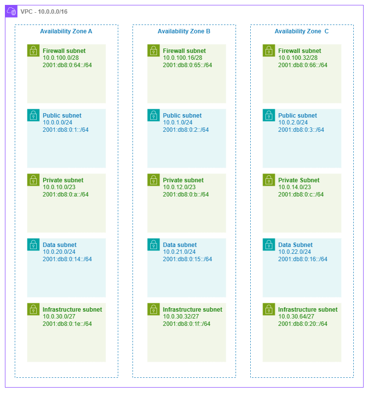

# サブネット {#subnets}

!!! info "前提条件"
    このセクションでは、[始める前に](aws-prerequisites.md)、[Amazon VPC](vpc.md)、[リージョンとアベイラビリティーゾーン](regions-azs.md)、および [CIDR 計画](cidr.md) の内容を理解していることを前提としています。AWS ネットワーキングの基礎を初めて学ぶ方は、先にそれらのページをご確認ください。

サブネットは、ルーティングポリシーと IP アドレッシングが交わる場所です。AWS で起動するすべてのリソース — EC2 インスタンス、ECS タスク、EKS ポッド、Lambda 関数、RDS データベース、ロードバランサー、ファイアウォールエンドポイント — はサブネットに配置され、そのサブネットのルートテーブルがリソースの到達範囲を決定します。サブネット自体はセキュリティ境界ではなく、ルーティングドメインです。同じ VPC 内の 2 つのサブネットが同一の NACL とセキュリティグループを持つ場合、異なるルートテーブルをアタッチするまでは同じ動作をします。「パブリック」と「プライベート」はサブネットの属性ではなくルートテーブルの属性である、というこの区別を理解することが、サブネット設計において最も重要なメンタルモデルです。

適切に設計されたサブネットアーキテクチャは、ティア間の分離、予測可能な IP 消費、成長余地、そして AWS が提供するすべての接続・セキュリティサービスとのクリーンな統合をもたらします。一方、設計が不十分な場合は、IP アドレス枯渇の緊急事態、ワークロードの移行強制、そして不必要に複雑なファイアウォールおよびルーティングポリシーを引き起こします。

/// caption
5 層サブネットアーキテクチャ — [Drawio ソース](../assets/foundation/subnet-tiers.drawio)
///

## サブネット階層設計パターン {#subnet-tier-design-patterns}

「パブリック/プライベート/データ」という古典的な 3 層モデルは出発点であり、上限ではありません。ファイアウォール、Transit Gateway、VPC エンドポイント、またはコンテナワークロードを実行する本番ネットワークでは、インフラストラクチャの関心事をアプリケーションワークロードから分離するために、追加の階層が有効です。

***重要なポイント:*** 各階層はラベルではなく、そのルートテーブルとホストするリソースの種類によって定義されます。「パブリック」サブネットとは、単にルートテーブルに `0.0.0.0/0` ルートがあり、インターネットゲートウェイを指しているものです。「プライベート」サブネットは、アウトバウンドトラフィックを NAT ゲートウェイ経由でルーティングするか、インターネットへのルートを持ちません。サブネットリソース自体はどちらの場合も同一です。

### 5 層リファレンスアーキテクチャ {#five-tier-reference-architecture}

| 階層 | 目的 | 代表的な CIDR | ルートテーブルのパターン |
| --- | --- | --- | --- |
| **ファイアウォール** | AWS Network Firewall エンドポイント、GWLB エンドポイント | アベイラビリティゾーンごとに `/28` | IGW および他の階層からのトラフィックをインスペクションするルート |
| **パブリック** | ALB、NLB、NAT ゲートウェイ、踏み台ホスト | アベイラビリティゾーンごとに `/24` | `0.0.0.0/0` → インターネットゲートウェイ(またはファイアウォールエンドポイント) |
| **プライベート(アプリケーション)** | EC2、ECS タスク、EKS ポッド、Lambda ENI | アベイラビリティゾーンごとに `/23` または `/22` | `0.0.0.0/0` → NAT ゲートウェイ(またはインターネットルートなし) |
| **データ** | RDS、ElastiCache、OpenSearch、Redshift | アベイラビリティゾーンごとに `/24` | インターネットルートなし。VPC ローカルおよびオンプレミスへのルートのみ |
| **インフラストラクチャ / トランジット** | TGW ENI、VPC エンドポイント ENI、Direct Connect VIF アタッチメント | アベイラビリティゾーンごとに `/27` または `/28` | サービス固有のルートのみ |

すべての VPC に 5 つの階層すべてが必要なわけではありません。シンプルなワークロード VPC であれば、パブリックとプライベートのみで十分です。共有サービス VPC では、VPC エンドポイント用にインフラストラクチャサブネットを追加することがあります。インスペクション VPC にはファイアウォール階層が必要です。現時点でデプロイするものに合わせて設計しつつ、後から追加する可能性のある階層のために CIDR の余裕を残しておきましょう。

## ベストプラクティス {#best-practices}

### サブネットのサイジング {#subnet-sizing}

#### 慣例ではなく、ワークロードに合わせてサイズを決める {#size-for-the-workload-not-for-convention}

「どこでも /24 を使えばよい」というアドバイスはシンプルですが、一部のティアでは無駄が多く、別のティアでは危険なほど小さくなります。各ティアは、そのサブネットで実際に IP を消費するリソースに基づいてサイズを決めてください。

AWS はすべてのサブネットで 5 つのアドレスを予約しています(ネットワークアドレス、ルーター、DNS、将来の使用、ブロードキャスト)。それ以外の実際のサイジング要因は次のとおりです。

| リソースタイプ | IP 消費パターン |
| --- | --- |
| EC2 インスタンス | インスタンスごとに 1 つのプライマリ IP + マルチホームワークロード向けの追加 ENI |
| ECS タスク (awsvpc) | タスクごとに 1 つの ENI = 実行中のタスクごとに 1 つの IP |
| EKS ポッド (VPC CNI) | デフォルトではポッドごとに 1 つの IP。プレフィックス委任を使用する場合は、スロットごとに 1 つの `/28` プレフィックス |
| Lambda (VPC 接続) | セキュリティグループとサブネットの組み合わせごとに 1 つの ENI(Hyperplane 経由で呼び出し間で共有) |
| NAT ゲートウェイ | ゲートウェイごとに 1 つの IP |
| Network Firewall エンドポイント | アベイラビリティーゾーンのエンドポイントごとに 1 つの IP |
| VPC エンドポイント (インターフェイス) | エンドポイントごとにアベイラビリティーゾーンごとに 1 つの ENI |
| Transit Gateway アタッチメント | アベイラビリティーゾーンごとに 1 つの ENI |

***重要なポイント:*** VPC CNI プラグインを使用した EKS は、AWS で最も積極的に IP を消費します。単一の `m5.xlarge` ノードは 58 個のポッドをホストでき、それぞれがサブネットから IP を消費します。1 つのアベイラビリティーゾーンに 20 ノードのクラスターがあると、1,160 個の IP を消費する可能性があり、これは `/24` サブネット 4 つ以上に相当します。EKS を実行する場合は、アベイラビリティーゾーンごとにプライベートサブネットを `/21` または `/20` でサイジングするか、プレフィックス委任を有効にして ENI スロットごとの消費を 1 つの `/28` に抑えてください。

#### ティア別のサイジング推奨事項 {#sizing-recommendations-by-tier}

| ティア | 推奨サイズ | 根拠 |
| --- | --- | --- |
| ファイアウォール | `/28`(使用可能 11 個) | Network Firewall はアベイラビリティーゾーンごとに 1 つのエンドポイントを作成するため、数個以上の IP が必要になることはほとんどない |
| パブリック | `/24`(使用可能 251 個) | ALB は水平スケールして IP を消費する。NAT ゲートウェイにも余裕が必要。`/24` で十分なヘッドルームを確保できる |
| プライベート (非コンテナ) | `/24`(使用可能 251 個) | 標準的な EC2 および Lambda ワークロードは問題なく収まる |
| プライベート (EKS/ECS) | `/22` ～ `/20`(使用可能 1,019 ～ 4,091 個) | コンテナワークロードは積極的に IP を消費する。ここでのサイズ不足はポッドのスケジューリング失敗を引き起こす |
| データ | `/24`(使用可能 251 個) | データベースインスタンスは少数だが長期稼働する。`/24` は余裕があってシンプル |
| インフラストラクチャ | `/27` または `/28`(使用可能 27 個または 11 個) | TGW および VPC エンドポイントの ENI は予測可能で少数 |

#### 事前に過剰割り当てするのではなく、セカンダリ CIDR を使用する {#use-secondary-cidrs-rather-than-over-allocating-upfront}

サブネットティアが初期割り当てを超えて拡張した場合、サブネットのサイズを変更することはできません。より大きな新しいサブネットを作成してリソースを移行する必要があります。これを避けるために、VPC にセカンダリ CIDR ブロックを追加する機能を活用してください。これにより、既存のワークロードを中断することなく、別の CIDR 範囲から同じティアに追加のサブネットを作成できます。

### ルートテーブルの設計 {#route-table-design}

#### サブネットごとではなく、ティアごとに 1 つのルートテーブルを使用する {#one-route-table-per-tier-not-one-per-subnet}

最も一般的なルートテーブルのパターンは、ティアごとに 1 つの共有ルートテーブルを使用し、すべてのアベイラビリティーゾーンにわたってそのティアのすべてのサブネットに関連付けることです。これにより、ティア内のルーティングポリシーが一貫し、管理するルートテーブルの数が減ります。

| パターン | 使用するタイミング |
| --- | --- |
| **ティアごとに 1 つのルートテーブル** | デフォルト。すべてのパブリックサブネットが 1 つのルートテーブルを共有し、すべてのプライベートサブネットが別のルートテーブルを共有する。シンプルで一貫性があり、監査しやすい。 |
| **ティアごとにアベイラビリティーゾーンごとに 1 つのルートテーブル** | 各アベイラビリティーゾーンに独自の NAT ゲートウェイがあり、AZ ローカルのエグレスを希望する場合(`0.0.0.0/0` ルートが同じアベイラビリティーゾーンの NAT ゲートウェイを指す)。これはプライベートサブネットの標準的な HA パターン。 |
| **サブネットごとに 1 つのルートテーブル** | まれなケース。個々のサブネットに固有のルーティングが必要な場合にのみ使用する(例: 特定のサブネットがファイアウォールエンドポイントにルーティングし、他のサブネットは直接ルーティングする)。運用の複雑さが増す。 |

***重要なポイント:*** NAT ゲートウェイを使用するプライベートサブネットでは、各アベイラビリティーゾーンのルートテーブルが `0.0.0.0/0` を同じアベイラビリティーゾーンの NAT ゲートウェイに向けるため、ティアごとではなくアベイラビリティーゾーンごとに 1 つのルートテーブルが必要です。これにより、エグレストラフィックが AZ ローカルに保たれ、クロス AZ データ転送料金を回避でき、NAT ゲートウェイの障害が自身のアベイラビリティーゾーンのみに影響することを保証します。

### インフラストラクチャサブネットティア {#infrastructure-subnet-tier}

#### ネットワークサービス ENI 専用のサブネットを確保する {#dedicate-subnets-for-network-service-enis}

Transit Gateway アタッチメント、VPC インターフェイスエンドポイント、Network Firewall エンドポイント、Direct Connect 仮想インターフェイスアタッチメントはすべて、サブネットに ENI を配置します。これらをアプリケーションワークロードと混在させると、次のような問題が発生します。

* **IP の管理が予測不能になる。** 新しい VPC エンドポイントが、アプリケーションが使用するのと同じプールから IP を消費する。
* **ルートテーブルの競合。** インフラストラクチャ ENI は、同じティアのアプリケーションワークロードとは異なるルーティングを必要とすることが多い。
* **セキュリティグループの乱立。** インフラストラクチャ ENI は、アプリケーションリソースとは異なるアクセスパターンを持つ。

専用のインフラストラクチャサブネット(小さいサイズ — `/27` または `/28`)でこれら 3 つの問題をすべて解決できます。独自のルートテーブル、必要に応じて独自の NACL を持ち、IP 消費が分離されて予測可能になります。

***重要なポイント:*** Transit Gateway アタッチメントは、指定したサブネットのアベイラビリティーゾーンごとに 1 つの ENI を作成します。TGW ENI をアプリケーションサブネットに配置すると、TGW のルートテーブルエントリとサブネットのルートテーブルが複雑に絡み合い、理解しにくくなります。アベイラビリティーゾーンごとに専用の `/28` インフラストラクチャサブネットを用意してもアドレス空間のコストはほぼゼロで、ルーティングの混乱を一クラス丸ごと排除できます。

### ネットワーク ACL {#network-acls}

#### NACL はデフォルトでオープンにし、特定のコンプライアンス要件にのみルールを追加する {#default-to-open-nacls-add-rules-only-for-specific-compliance-requirements}

NACL はステートレスで、サブネットレベルで動作し、セキュリティグループに関係なくサブネットに出入りするすべてのトラフィックに適用されます。ステートフルでインスタンスレベルのセキュリティグループと比べると、粗いツールです。

**NACL が価値を発揮する場面:**

* インスタンスレベルの制御とは独立したネットワークレベルの拒否ルールを要求するコンプライアンスフレームワーク(PCI-DSS、HIPAA)
* サブネット境界で CIDR 範囲全体をブロックする場合(例: 既知の悪意ある範囲からのトラフィックがセキュリティグループに到達する前に拒否する)
* セキュリティグループが許可する内容に関わらず、ソース CIDR の明示的な許可リストが必要なデータティアサブネットの多層防御

**NACL が価値なく複雑さを増す場面:**

* 「念のため」サブネットレベルでセキュリティグループのルールを複製する — メンテナンスの負担が倍増し、設定のずれが生じる
* すべてのアクセス制御がすでにセキュリティグループ、IAM ポリシー、サービスレベルの認証で処理されている環境
* ステートレスルールが広いポートレンジを必要とし、セキュリティ上のメリットを打ち消してしまう動的ポートレンジ(戻りトラフィックのエフェメラルポート)を持つワークロード

***重要なポイント:*** デフォルトの VPC NACL はすべてのインバウンドおよびアウトバウンドトラフィックを許可します。サブネットレベルで制限する具体的かつ文書化された理由がない限り、そのままにしておいてください。セキュリティグループが主要なネットワークアクセス制御であり、NACL はコンプライアンス主導のセカンダリレイヤーです。

### サブネット CIDR 予約 {#subnet-cidr-reservations}

#### 特定のリソースタイプ向けにアドレス範囲を予約する {#reserve-address-ranges-for-specific-resource-types}

[サブネット CIDR 予約](https://docs.aws.amazon.com/vpc/latest/userguide/subnet-cidr-reservation.html)を使用すると、サブネットのアドレス空間の一部を特定のリソースタイプ(プレフィックス委任、明示的な割り当て)向けに確保し、他のリソースがそれらの IP を消費できないようにすることができます。

**CIDR 予約を使用する場面:**

* プレフィックス委任を使用した EKS を実行する場合 — ポッド IP が予測可能なブロックから割り当てられるよう `/28` プレフィックス用の範囲を予約する
* 特定のワークロード向けに安定した IP 範囲が必要な場合(例: オンプレミスのファイアウォールが許可リストに登録している IP ブロック)
* 自動割り当てリソースと手動割り当て ENI 間の IP 競合を防ぐ場合

**CIDR 予約をスキップする場面:**

* サブネットが単一のワークロードタイプをホストしている場合(アドレス空間の競合がない)
* 割り当てを管理する割り当てルールを持つ IPAM プールをすでに使用している場合

### IPv6 サブネットアドレッシング {#ipv6-subnet-addressing}

#### すべての IPv6 サブネットは /64 — それを前提に計画する {#every-ipv6-subnet-is-a-64-plan-accordingly}

IPv4 では `/28` から `/16` の範囲でサブネットサイズを選択できますが、AWS の IPv6 サブネットは常に `/64` です。これは制限ではなく標準です。`/64` はサブネットごとに 2^64 個のアドレスを提供し、事実上無制限です。VPC は Amazon または独自の BYOIP プールから `/56` を受け取り、256 個の `/64` サブネットを作成できます。

設計上の考慮事項:

* **可変サイジングはない。** 「小さな」IPv6 サブネットを作成することはできない。ティアに関係なく、すべてのサブネットが同じ `/64` を取得する。
* **制約はサイズではなくサブネット数。** 単一の `/56` から 256 個の `/64` が利用可能なため、ティアとアベイラビリティーゾーンのレイアウトがその予算内に収まるよう計画する。
* **デュアルスタックサブネットは IPv4 CIDR と IPv6 /64 の両方を持つ。** IPv4 CIDR はワークロードに合わせてサイジングし、IPv6 側は自動的に対応される。
* **IPv6 専用サブネット**は IPv4 を完全に排除する。IPv4 接続を必要としないワークロード(内部マイクロサービス、バッチ処理)に使用することで、アドレッシングを簡素化し、IPv4 の枯渇を回避できる。

***重要なポイント:*** VPC ごとの `/56` で 256 個のサブネットが得られます。3 つのアベイラビリティーゾーン × 5 つのティア = 15 個のサブネットを実行する場合、256 個中 15 個を使用したことになり、十分な余裕があります。ただし、ワークロード固有のサブネットが数十個ある共有 VPC を構築する場合は、枯渇を避けるために `/64` の割り当てを追跡してください。

### コンテナおよびサーバーレスワークロードの考慮事項 {#container-and-serverless-workload-considerations}

#### EKS: 積極的な IP 消費に備えて計画する {#eks-plan-for-aggressive-ip-consumption}

Amazon VPC CNI プラグインは、デフォルトですべてのポッドに VPC IP アドレスを割り当てます。`m5.xlarge`(4 ENI × 15 IP/ENI = 最大 58 ポッド)では、フル稼働のノードがサブネット IP を 58 個消費します。これを管理するための戦略:

* **プレフィックス委任を有効にする**: 各 ENI スロットが個別の IP の代わりに `/28` プレフィックス(16 IP)を取得し、ENI スロットをそれ以上消費せずにノードあたりのポッド密度を高める。消費パターンが「ポッドごとに 1 IP」から「スロットごとに 1 つの /28、ポッド間で共有」に変わる。
* **カスタムネットワーキングを使用する**: ノードのプライマリ ENI とは異なるサブネット(または CIDR 範囲)からポッド IP を割り当てる。これにより、ノードサブネットを控えめにサイジングしながら、ポッドにはるかに大きなアドレスプールへのアクセスを提供できる。
* **IPv6 専用クラスターを検討する**: ポッドは `/64` サブネットから IPv6 アドレスを取得し(事実上無制限)、IPv4 のみの宛先には NAT64 を使用する。

最悪のシナリオは、`/24` サブネットでプレフィックス委任なしに積極的にオートスケールする EKS クラスターです。5 ノードから 30 ノードへのバーストで数分以内にサブネットが枯渇し、クラスターの問題のように見えるポッドスケジューリング失敗が発生しますが、実際にはサブネットの IP 枯渇です。サブネットの `available IPs` CloudWatch メトリクスを監視し、枯渇のかなり前にアラートを設定してください。

#### awsvpc モードの ECS: タスクごとに 1 つの ENI {#ecs-with-awsvpc-mode-one-eni-per-task}

`awsvpc` ネットワークモードのすべての ECS タスクは、VPC IP を持つ独自の ENI を取得します。高密度サービス(アベイラビリティーゾーンごとに数百のタスク)では、それに応じてサブネットをサイジングしてください。EKS とは異なり、ECS にはプレフィックス委任に相当するものはありません — 各タスクは 1 つの IP、それだけです。

数百のタスクにスケールする ECS サービスでは、アベイラビリティーゾーンごとのピークタスク数を計算し、20% のヘッドルームを追加してください。3 つのアベイラビリティーゾーンにわたって 200 タスクを実行するサービスは、定常状態でアベイラビリティーゾーンごとに約 67 IP が必要ですが、デプロイ中(最大 200% のローリングアップデート)は一時的にその倍が必要になります。`/24` はこれを余裕で処理できますが、`/26` では対応できません。

#### VPC 内の Lambda: Hyperplane ENI 共有 {#lambda-in-vpc-hyperplane-eni-sharing}

VPC 接続の Lambda 関数は、同じセキュリティグループとサブネットの組み合わせを持つ呼び出し間で共有される Hyperplane ENI を使用します。同時呼び出しごとに 1 つの IP は必要ありません。ただし、一意の(サブネット、セキュリティグループ)ペアごとに少なくとも 1 つの ENI が作成されます。同じサブネット内に異なるセキュリティグループを持つ Lambda 関数が多数ある場合、ENI の消費が積み重なる可能性があります。

***重要なポイント:*** 「VPC 内の Lambda がサブネットを枯渇させる」という一般的な懸念は時代遅れです。Hyperplane ENI モデル(2019 年)以降、Lambda は呼び出し間で ENI を共有します。実際の消費要因は同時実行数ではなく、一意の(サブネット、セキュリティグループ)の組み合わせの数です。アクセスパターンが許す範囲で、Lambda 関数を共有セキュリティグループに統合してください。

### 命名とタグ付け {#naming-and-tagging}

#### ティア、アベイラビリティーゾーン、目的をエンコードする一貫した命名規則を使用する {#use-a-consistent-naming-convention-that-encodes-tier-availability-zone-and-purpose}

サブネット名は、人間と自動化の両方が即座に解析できるものにする必要があります。`{env}-{tier}-{az}` のようなパターン(例: `prod-private-use1a`、`prod-infra-use1b`)を使用すると、コンソールでサブネットをフィルタリングし、タグの条件を持つ IAM ポリシーを記述し、規則によってサブネットを選択する IaC モジュールを構築できます。

サブネットには最低限以下のタグを付けてください:

* `Environment`(prod、staging、dev)
* `Tier`(public、private、data、infrastructure、firewall)
* `Network` または `VPC`(マルチ VPC アカウントでどの VPC かを識別する)
* EKS の場合: AWS Load Balancer Controller が自動検出できるよう、適切なサブネットに `kubernetes.io/role/elb` および `kubernetes.io/role/internal-elb` タグを付ける

### 共有サブネット(RAM による VPC 共有) {#shared-subnets-vpc-sharing-via-ram}

#### アカウント間でサブネットを共有してネットワーク管理を一元化する {#share-subnets-across-accounts-to-centralize-network-management}

[VPC 共有](https://docs.aws.amazon.com/vpc/latest/userguide/vpc-sharing.html)は AWS Resource Access Manager を通じて、中央のネットワーキングアカウントが VPC とサブネットを所有しながら、参加アカウントが共有サブネットにリソースを起動できるようにします。このパターンにより、IP 管理、ルートテーブル制御、サブネットのライフサイクルを一元化しながら、アプリケーションチームがワークロードをデプロイする自律性を維持できます。

共有サブネットの設計上の考慮事項:

* **オーナーアカウントがルーティング、NACL、サブネットのライフサイクルを制御する。** 参加アカウントは共有サブネットのルートテーブルや NACL を変更できない。
* **セキュリティグループはアカウントごと。** 各参加アカウントは共有サブネット内で独自のセキュリティグループを管理する。クロスアカウントのセキュリティグループ参照はサポートされていない。
* **サブネットのサイジングはすべての参加者を考慮する必要がある。** 複数のアカウントがサブネットを共有する場合、それらの IP 消費を合算する。1 つのアカウントには余裕のある `/24` も、3 つのアカウントがデプロイすると窮屈になる可能性がある。
* **アカウントごとではなく、ティアごとに別々のサブネットを使用する。** VPC 共有の価値はアカウントがインフラストラクチャを共有することにある — コンプライアンスが要求しない限り、サブネットレベルでアカウントごとの分離を再現しない。

***重要なポイント:*** VPC 共有は、一元化されたネットワーク制御を望む組織にとって最も運用効率の高いパターンです。ネットワーキングチームが VPC、サブネット、ルートテーブル、接続性を管理し、アプリケーションチームはネットワーキングの専門知識なしにリソースをデプロイできます。トレードオフは、ネットワーキングチームがすべての参加アカウントにわたる総需要に合わせてサブネットをサイジングする必要があることです。

## サブネットと他のサービスの組み合わせ {#combining-subnets-with-other-services}

サブネット設計は単独で成立するものではありません。AWS のすべての接続・セキュリティサービスは、サブネットアーキテクチャと相互に影響し合います。以下の表は、サブネットと組み合わせるサービスとの統合方法をまとめたものです。

| 組み合わせ | サブネットの役割 | 設計上の考慮事項 |
| --- | --- | --- |
| **サブネット + NAT ゲートウェイ** | パブリックサブネットが NAT ゲートウェイをホストし、プライベートサブネットは `0.0.0.0/0` をそこへルーティングする | パブリック層の各アベイラビリティーゾーンに NAT ゲートウェイを 1 つずつデプロイする。各プライベートサブネットのルートテーブルは、同一 AZ の NAT ゲートウェイを指定する。パブリックサブネットは ALB と NAT ゲートウェイの IP を収容できるよう十分なサイズにする。 |
| **サブネット + Transit Gateway** | インフラストラクチャサブネットが TGW ENI をホストする（アベイラビリティーゾーンごとに 1 つ） | 専用の `/28` インフラストラクチャサブネットを使用する。TGW ENI には、アプリケーションルーティングと競合しない専用ルートテーブルが必要。アプライアンスモードでは、戻りトラフィックが同一アベイラビリティーゾーンの ENI を経由するようルーティングされる。 |
| **サブネット + Network Firewall** | ファイアウォールサブネットがファイアウォールエンドポイントをホストし、他のサブネットはそこを経由してトラフィックをルーティングする | アベイラビリティーゾーンごとに専用の `/28` ファイアウォールサブネットを用意する。ファイアウォールサブネットのルートテーブルは IGW を指定し、IGW のエッジルートテーブルは戻りトラフィックをファイアウォールエンドポイントへ向ける。 |
| **サブネット + VPC エンドポイント** | インフラストラクチャサブネットがインターフェイスエンドポイント ENI をホストする | インターフェイスエンドポイントは、エンドポイントごと・アベイラビリティーゾーンごとに 1 つの ENI を作成する。専用のインフラストラクチャサブネットを使用することで、エンドポイント ENI をアプリケーションの IP プールから分離できる。ゲートウェイエンドポイント（S3、DynamoDB）はサブネット IP を消費しない — ルートテーブルのエントリとして機能する。 |
| **サブネット + ロードバランサー** | インターネット向け ALB/NLB にはパブリックサブネット、内部ロードバランサーにはプライベートサブネットを使用する | ALB はアベイラビリティーゾーンごとに空き IP が 8 つ以上ある `/27` 以上のサブネットを必要とする。NLB の要件は低めだが、スケールに対応できる余裕は必要。ロードバランサーと他のリソースを `/28` サブネットで共有しない。 |
| **サブネット + EKS/ECS** | プライベートサブネットがワーカーノードおよびポッド/タスク ENI をホストする | VPC CNI を使用する EKS では `/22` 以上のサイズにする。カスタムネットワーキングを使用してノードとポッドの CIDR 範囲を分離する。ECS Fargate では、タスクごとに 1 つの IP を消費するため、アベイラビリティーゾーンごとのピークタスク数を考慮して計画する。 |

## ドキュメント {#documentation}

*   :material-file-document: **VPC のサブネット**

    ---

    CIDR ブロック、ルートテーブルの関連付け、ネットワーク ACL を含む、サブネットの作成・設定・管理に関する完全なドキュメントです。

    [:octicons-arrow-right-24: ドキュメント](https://docs.aws.amazon.com/vpc/latest/userguide/configure-subnets.html)

*   :material-ruler: **サブネットのサイジング**

    ---

    サブネット CIDR ブロックのサイズ、予約済みアドレス、およびサイジングに関する考慮事項についての AWS ガイダンスです。

    [:octicons-arrow-right-24: サブネットのサイジング](https://docs.aws.amazon.com/vpc/latest/userguide/configure-subnets.html#subnet-sizing)

*   :material-book-lock: **サブネット CIDR 予約**

    ---

    IP の競合を防ぐために、特定の割り当てタイプ向けにサブネットのアドレス空間の一部を予約します。

    [:octicons-arrow-right-24: CIDR 予約](https://docs.aws.amazon.com/vpc/latest/userguide/subnet-cidr-reservation.html)

*   :material-shield-outline: **ネットワーク ACL**

    ---

    インバウンドおよびアウトバウンドトラフィックを制御する、ステートレスなサブネットレベルのファイアウォールルールです。

    [:octicons-arrow-right-24: ネットワーク ACL](https://docs.aws.amazon.com/vpc/latest/userguide/vpc-network-acls.html)

*   :material-routes: **ルートテーブル**

    ---

    カスタムルートテーブル、伝播、および優先度ルールを使用して、各サブネットのトラフィックルーティングを制御します。

    [:octicons-arrow-right-24: ルートテーブル](https://docs.aws.amazon.com/vpc/latest/userguide/VPC_Route_Tables.html)

*   :material-share-variant: **VPC 共有 (RAM)**

    ---

    AWS Resource Access Manager を使用してアカウント間でサブネットを共有し、ネットワーク管理を一元化します。

    [:octicons-arrow-right-24: 共有 VPC](https://docs.aws.amazon.com/vpc/latest/userguide/vpc-sharing.html)

## 相互参照 {#cross-references}

**基礎ページ:**

* [Amazon VPC](vpc.md) — VPC の設計パターン、CIDR の割り当て、VPC とサブネットの関係
* [CIDR 計画](cidr.md) — 競合なしに VPC とサブネット間でアドレス空間を計画する方法
* [リージョンとアベイラビリティーゾーン](regions-azs.md) — サブネット分散を決定するアベイラビリティーゾーンの配置戦略
* [IPAM](ipam.md) — 大規模なサブネット CIDR 割り当てのための自動 IP アドレス管理

**接続性ページ:**

* [AWS 内の接続性](../connectivity/within-aws.md) — インフラストラクチャサブネット設計に依存する Transit Gateway および Cloud WAN のパターン
* [インターネット接続性](../connectivity/internet.md) — パブリックおよびファイアウォールサブネット層を形成する NAT ゲートウェイ、インターネットゲートウェイ、ファイアウォールのパターン
* [ハイブリッドおよびマルチクラウド](../connectivity/hybrid-multicloud.md) — インフラストラクチャサブネットに接続する Direct Connect および VPN アタッチメント

**アプリケーションネットワーキングページ:**

* [ロードバランシング](../application-networking/load-balancing.md) — ALB および NLB のサブネット要件とアベイラビリティーゾーンの配置
* [コンテナメッシュ](../application-networking/container-mesh.md) — プライベートサブネットのサイジングを決定する EKS および ECS のネットワーキングパターン
