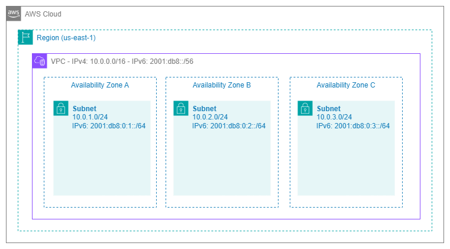
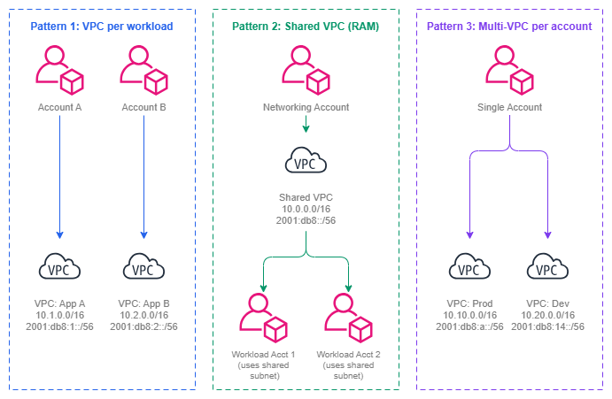

# Amazon VPC {#amazon-vpc}

!!! info "前提条件"
    このセクションは、[始める前に](aws-prerequisites.md)と [AWS Organizations](organizations.md) の内容を理解していることを前提としています。AWS ネットワーキングの基礎を初めて学ぶ方は、先にそれらのページをご確認ください。

Amazon Virtual Private Cloud (VPC) は、AWS 内に論理的に分離されたネットワークです。ネットワーク接続を必要とするすべてのコンピューティングリソース、データベース、コンテナ、および Lambda 関数は VPC 内で動作します。VPC はサブネットの単なるコンテナではありません。VPC は、その上位に位置するすべてのネットワーキング上の意思決定を形作る、基盤となるセキュリティ境界、IP アドレスドメイン、そしてルーティングコンテキストです。VPC の設計を誤ると、事前の計画で回避できたはずの CIDR の競合、接続性の制限、運用上の摩擦に何年も悩まされることになります。

VPC はリージョン内のすべてのアベイラビリティーゾーンにまたがり、IP アドレッシング、ルーティング、ネットワークゲートウェイを完全に制御できます。また、すべての接続サービス (Transit Gateway、Cloud WAN、VPC Peering、PrivateLink、VPC Lattice) のアタッチメントポイントとして機能します。VPC の設計は、実現可能な接続パターン、成長に利用できるアドレス空間、そしてワークロードを互いにどれだけクリーンに分離できるかを直接決定します。

/// caption
VPC アーキテクチャ — [Drawio ソース](../assets/foundation/vpc-architecture.drawio)
///

## 主要機能 {#key-capabilities}

*   :material-ip-network: **IPv4 および IPv6 アドレッシング**

    ---

    プライマリ IPv4 CIDR ブロック（`/16` ～ `/28`）を定義し、最大 4 つのセカンダリ CIDR を追加できます。デュアルスタック運用のために `/56` の IPv6 CIDR をオプションで割り当てることも可能です。

*   :material-shield-lock: **ネットワーク分離**

    ---

    各 VPC はハードな分離境界を形成します。VPC 間のトラフィックには明示的な接続設定（ピアリング、Transit Gateway、Cloud WAN、または VPC Lattice）が必要です。暗黙的なクロス VPC ルーティングは存在しません。

*   :material-routes: **ルートテーブルとゲートウェイ**

    ---

    サブネットごとのルートテーブルがトラフィックフローを制御します。インターネットゲートウェイ、NAT ゲートウェイ、Transit Gateway アタッチメント、および VPC エンドポイントが各種宛先への接続を提供します。

*   :material-chart-timeline-variant: **VPC Flow Logs**

    ---

    VPC、サブネット、または ENI レベルで IP トラフィックのメタデータをキャプチャします。セキュリティ分析、トラブルシューティング、およびコンプライアンス監査に不可欠です。

*   :material-dns: **DNS 解決**

    ---

    VPC+2 アドレスで Amazon 提供の DNS（Route 53 Resolver）が利用できます。プライベートホストゾーン、Resolver エンドポイント、およびフォワーディングルールにより、ハイブリッド DNS アーキテクチャを実現できます。

*   :material-share-variant: **VPC 共有（AWS RAM）**

    ---

    Organization 内のアカウント間でサブネットを共有できます。複数のアカウントがネットワークインフラを重複させることなく、同一の VPC にリソースをデプロイできます。

## VPC 設計パターン {#vpc-design-patterns}

VPC の設計は、一律に決まるものではありません。適切なパターンは、組織のアカウント戦略、チームの自律性要件、コンプライアンス境界、および運用成熟度によって異なります。本番 AWS 環境では 3 つの主要パターンが主流であり、多くの組織はそれらを組み合わせて使用しています。

/// caption
VPC 設計パターン — [Drawio ソース](../assets/foundation/vpc-design-patterns.drawio)
///

### ワークロードごとの VPC（アプリケーション・環境ごとに 1 つの VPC） {#vpc-per-workload-one-vpc-per-application-per-environment}

成熟したマルチアカウント環境で最も一般的なパターンです。各アプリケーションチームは自身のアカウントに専用の VPC を所有し、ワークロードに合わせたサイズで構成します。共有サービスへの接続は、Transit Gateway または Cloud WAN アタッチメントを通じて行われます。

**適用場面:** チームがネットワーク設定（セキュリティグループ、NACL、ルートテーブル）を自律的に管理する必要がある場合。ワークロードごとにコンプライアンス要件が異なる場合。ある VPC の設定ミスが他の VPC に影響しないよう、障害範囲(blast radius)を分離したい場合。

**トレードオフ:** VPC が増えるほど、Transit Gateway または Cloud WAN のアタッチメント数、調整が必要な CIDR 割り当て数、ルートテーブルのエントリ数も増加します。IPAM と自動プロビジョニングによって管理は可能ですが、ツール整備への先行投資が必要です。

### AWS RAM を使った共有 VPC {#shared-vpcs-via-aws-ram}

ネットワークチームが VPC を作成し、[AWS Resource Access Manager](https://docs.aws.amazon.com/ram/latest/userguide/what-is.html) を通じて特定のサブネットをワークロードアカウントと共有します。ワークロードアカウントは VPC 自体を管理することなく、共有サブネットにリソース（EC2、RDS、Lambda）をデプロイできます。

**適用場面:** アカウントごとのネットワーク管理オーバーヘッドを最小限に抑えつつ、ネットワークを一元管理したい場合。チームがルートテーブルやゲートウェイを管理する必要がない場合。多数の小規模 VPC ではなく、少数の大規模 VPC を運用する場合。中央プラットフォームチームがすべてのネットワークを管理する組織でよく見られます。

**トレードオフ:** 同一 VPC を共有するワークロード間の分離が弱くなります。異なるアカウントのリソースが同じネットワークを共有するため、セキュリティグループの管理がより重要になります。VPC 内での最も粗い分離境界は、サブネットレベルの NACL となります。

### アカウントごとのマルチ VPC {#multi-vpc-per-account}

1 つのアカウントに、異なる用途（本番、ステージング、分離されたワークロード）の複数の VPC を含む構成です。アカウントレベルの分離とネットワークレベルの分離が混在するため、成熟した環境ではあまり一般的ではありません。

**適用場面:** マルチアカウント戦略をまだ採用していない小規模組織。概念実証(PoC)環境。組織のポリシーによってアカウント数の増加が制限されている状況。

**トレードオフ:** アカウントを分離することで得られるセキュリティと請求の分離が失われます。すべての VPC が同一の IAM 境界を共有するため、ある VPC のワークロードで認証情報が侵害された場合、同一アカウント内の他の VPC のリソースにアクセスされる可能性があります。

***重要な考え方:*** *VPC の設計パターンは、アカウント戦略に従うべきであり、その逆ではありません。ワークロードと環境ごとに 1 つのアカウントを使用する（AWS 推奨のアプローチ）場合、アカウントごとに 1 つの VPC が自然なデフォルトとなります。ネットワークをプラットフォームアカウントに集約する場合は、RAM を使った共有 VPC によって重複を削減できます。VPC パターンは、組織モデルの結果として決まるものです。*

## ベストプラクティス {#best-practices}

### CIDR のサイジングと計画 {#cidr-sizing-and-planning}

#### 本番 VPC には /16 から始め、/20 より小さくしない {#start-with-16-for-production-vpcs-and-never-go-smaller-than-20}

`/16` は 65,536 アドレスを提供します。これは、成長への対応、すべてのアベイラビリティーゾーンにまたがる複数のサブネット層、そして IP を大量に消費するサービス(VPC CNI を使用した EKS ポッド、Lambda ENI、awsvpc モードの ECS タスク)を収容するのに十分な量です。小さく始めることは効率的に見えますが、後になって拡張が困難な状況を招きます。

`/16` のコストは、プライベートアドレス範囲からのアドレス空間の消費であり、金銭的なコストではありません。適切に計画されたトップレベルプール(例: `10.0.0.0/8`)で [IPAM](ipam.md) を使用している場合、256 個の `/16` ブロックが利用可能です。これはほとんどの組織にとって十分な量です。オンプレミスとの重複により RFC 1918 アドレス空間が制約されている場合は、本番環境の最小値として `/20` を使用し、最初からセカンダリ CIDR を計画してください。

#### セカンダリ CIDR は場当たり的な対処としてではなく、戦略的に使用する {#use-secondary-cidrs-strategically-not-as-a-band-aid}

セカンダリ CIDR ブロックを使用すると、VPC を再作成せずにアドレス空間を拡張できます。これは計画的な成長(新しいサブネット層の追加、新しいアベイラビリティーゾーンのサポート)には有効ですが、初期割り当てが小さすぎた場合の修正パターンとして使うべきではありません。セカンダリ CIDR を追加するたびにルーティングの複雑さが増し、ルートテーブル、セキュリティグループ、NACL が追加の範囲を考慮しなければなりません。

セカンダリ CIDR の最適な用途は、非 RFC 1918 範囲(EKS ポッドネットワーキング用の 100.64.0.0/10)や、既存の IPv4 のみの VPC に IPv6 を追加する場合です。プライマリ CIDR が小さすぎたためにセカンダリ CIDR を積み重ねることは避けてください。それは、適切なサイズの新しい VPC を作成してマイグレーションすべきサインです。

#### 同じリージョン内の将来の VPC のために CIDR 空間を予約する {#reserve-cidr-space-for-future-vpcs-in-the-same-region}

CIDR を割り当てる際は、現在の VPC だけを計画するのではなく、ルート集約が可能な状態を維持できるよう、同じリージョン内の将来の VPC のために連続したブロックを予約してください。本番 VPC が `10.1.0.0/16` でステージング VPC が `10.2.0.0/16` であれば、`10.1.0.0/15` をサマリールートとしてオンプレミスにアドバタイズできます。`/8` 全体にわたってランダムに CIDR を割り当てると、集約が不可能になり、あらゆる場所でルートテーブルが肥大化します。

***重要なポイント:*** *CIDR の計画は VPC レベルの決定ではなく、組織レベルの決定です。[Amazon VPC IPAM](ipam.md) を使用して割り当てルールを適用し、重複を防ぎ、アドレス空間全体の唯一の情報源を維持してください。スプレッドシートによる手動管理は、VPC が 10 個を超えると破綻します。*

### IPv6 の導入 {#ipv6-adoption}

#### 新しい VPC では最初からデュアルスタックを有効にする {#enable-dual-stack-from-day-one-on-new-vpcs}

すべての新しい VPC は、IPv4 CIDR と Amazon が提供する `/56` IPv6 CIDR の両方で作成する必要があります。追加コストはゼロ(IPv6 アドレッシングは無料)であり、既存の VPC に IPv6 を後から追加するには、すべてのサブネット、セキュリティグループ、ルートテーブル、NACL を更新する必要があり、VPC の運用期間が長いほど作業量が増大します。

デュアルスタックは、IPv6 をすぐに使用しなければならないことを意味しません。ワークロードの準備が整ったときに、マイグレーションプロジェクトなしでオプションを利用できることを意味します。EKS、Lambda、ALB などのサービスはすでに IPv6 をネイティブにサポートしています。傾向は明らかです。IPv6 の採用は加速しており、今日 IPv6 なしで作成された VPC は、その運用期間中に IPv6 が必要になるでしょう。

#### NAT への依存を減らすために東西トラフィックに IPv6 を使用する {#use-ipv6-for-east-west-traffic-to-reduce-nat-dependency}

IPv6 アドレスは設計上グローバルに一意でパブリックにルーティング可能ですが、それはパブリックにアクセス可能であることを意味しません。Egress-only インターネットゲートウェイは、インバウンドをブロックしながらアウトバウンド IPv6 トラフィックを許可します。AWS 内のサービス間通信では、IPv4 変換を必要としないトラフィックに対して、IPv6 は NAT ゲートウェイ(および GB あたりのコスト)を不要にします。

### VPC フローログ {#vpc-flow-logs}

#### フローログはサブネットや ENI レベルではなく、VPC レベルで有効にする {#enable-flow-logs-at-the-vpc-level-not-the-subnet-or-eni-level}

VPC レベルのフローログは、単一の設定で VPC 内のすべてのトラフィックをキャプチャします。サブネットレベルまたは ENI レベルのログは、ピンポイントのトラブルシューティングには有用ですが、主要なオブザーバビリティの仕組みとして使うべきではありません。可視性にギャップが生じ、リソースごとの管理が必要になります。

長期保存と Athena を使ったコスト効率の高いクエリのために S3 にフローログを送信し、リアルタイムアラートのためにオプションで CloudWatch Logs にも送信してください。カスタムログ形式では、セキュリティ調査やトラフィック分析に不可欠な `vpc-id`、`subnet-id`、`instance-id`、`tcp-flags`、`traffic-path` などのフィールドを含めることができます。

#### フローログはトラブルシューティングだけでなく、セキュリティにも活用する {#use-flow-logs-for-security-not-just-troubleshooting}

フローログはデバッグツールとして扱われることが多いですが、セキュリティコントロールとしても同様に価値があります。予期しないトラフィックパターンの検出、既知の悪意ある IP と通信しているリソースの特定、NACL とセキュリティグループが意図通りに機能していることの検証、そしてネットワークトラフィックのログ記録を要求するコンプライアンスフレームワークの監査証跡の提供などに活用できます。

***重要なポイント:*** *VPC フローログは、VPC で実際に流れているトラフィックを把握するための唯一のネイティブな仕組みです。セキュリティグループと NACL は許可されるものを定義し、フローログは実際に何が起きているかを教えてくれます。すべてのアカウントのすべての VPC で、最初から有効にしてください。*

### DNS の設定 {#dns-configuration}

#### すべての VPC で DNS ホスト名と DNS 解決を有効にする {#enable-dns-hostnames-and-dns-resolution-on-every-vpc}

`enableDnsHostnames` と `enableDnsSupport` はすべての VPC で `true` に設定する必要があります。これらを無効にすると、リソースがパブリック DNS ホスト名を受け取れなくなり、Route 53 プライベートホストゾーンが解決されなくなり、VPC エンドポイントが正しく機能しなくなります。どちらの設定も無効にする正当な本番環境上の理由はありません。

#### ハイブリッド DNS には Route 53 Resolver エンドポイントを使用する {#use-route-53-resolver-endpoints-for-hybrid-dns}

VPC がオンプレミスの DNS 名を解決する必要がある場合、またはオンプレミスネットワークが AWS プライベートホストゾーン名を解決する必要がある場合は、Route 53 Resolver のインバウンドおよびアウトバウンドエンドポイントをデプロイしてください。これにより、EC2 上で動作する自己管理型 DNS フォワーダー(BIND、Unbound)が不要になり、Organization 全体で RAM を通じて共有される Route 53 Resolver ルールとネイティブに統合されます。

### VPC 設計とアカウント戦略の整合 {#vpc-design-and-account-strategy-alignment}

#### ワークロードアカウントごとに 1 つの VPC がデフォルトパターン {#one-vpc-per-workload-account-is-the-default-pattern}

各ワークロードが独自のアカウントを持つマルチアカウント戦略(AWS が推奨するアプローチ)では、各アカウントにそのワークロードの環境用の VPC を 1 つだけ含める必要があります。これにより、1 対 1 のクリーンなマッピングが実現します。1 アカウント = 1 ワークロード = 1 VPC = 1 CIDR 割り当て = 1 つの Transit Gateway または Cloud WAN アタッチメントです。

このパターンは分離を最大化し(アカウントレベルの IAM 境界 + VPC レベルのネットワーク境界)、IPAM 割り当てを簡素化し(OU ごとに 1 つのプール、アカウントごとに 1 つの割り当て)、接続ガバナンスをシンプルにします(アカウントの OU メンバーシップに基づくアタッチメントの承認)。

#### チームの自律性よりも集中管理が重要な場合は共有 VPC(RAM)を使用する {#use-shared-vpcs-ram-when-centralized-control-outweighs-team-autonomy}

共有 VPC は、中央のプラットフォームチームがすべてのネットワーキングを管理し、ワークロードチームが VPC レベルの構成に一切関与すべきでない場合に適しています。これは、ネットワーク変更に変更諮問委員会の承認が必要な規制業界や、ワークロードチームがネットワーキングの専門知識を持たないアプリケーション開発者である組織でよく見られます。

トレードオフは現実的です。ワークロードチームは、自分たちが所有していない共有サブネットのセキュリティグループを変更できず、カスタムルートテーブルエントリを作成できず、VPC エンドポイントを追加できません。すべてのネットワーク変更はプラットフォームチームを通じて行われます。組織がチームの自律性とセルフサービスを重視する場合は、自動プロビジョニングを伴うワークロードごとの VPC パターンの方が通常は適しています。

***重要なポイント:*** *ワークロードごとの VPC と共有 VPC の選択は、根本的には技術的な決定ではなく、組織設計の決定です。「プラットフォームの責任」と「チームの責任」の境界をどこに置くかを反映しています。どちらのパターンも技術的には機能します。問題は、どちらの運用モデルが組織に適しているかです。*

### ネットワーク分離とセキュリティ境界 {#network-isolation-and-security-boundaries}

#### VPC を単なるアドレス空間としてではなく、トラスト境界として扱う {#treat-vpcs-as-trust-boundaries-not-just-address-spaces}

VPC は、別アカウントを除いて AWS が提供する最も強力なネットワーク分離プリミティブです。明示的に接続を作成しない限り(ピアリング、Transit Gateway アタッチメント、VPC Lattice アソシエーション、PrivateLink エンドポイント)、トラフィックは VPC 境界を越えません。トラストドメインを中心に VPC 境界を設計してください。ネットワークレベルで互いを信頼するリソースは同じ VPC に属し、異なるトラストレベルのリソースは別々の VPC に属します。

この原則は、PCI スコープのワークロードを非 PCI ワークロードと VPC を共有させるのではなく、専用の VPC(理想的には専用のアカウント)に配置すべきであることを意味します。管理プレーン(CI/CD、モニタリング、踏み台ホスト)はデータプレーンとは別の VPC に配置する必要があります。分離はコストがかかりません。VPC のコストはゼロですが、トラスト境界を越えた侵害のコストはそうではありません。

#### 複数のサブネット層を使用するが、数は管理可能な範囲に抑える {#use-multiple-subnet-tiers-but-keep-the-number-manageable}

クラシックな 3 層モデル(パブリック、プライベート、データ)はほとんどのワークロードに対応します。既存の層とは異なる、真のルーティングまたはアクセス制御要件がある場合にのみ層を追加してください。一般的な追加例としては、Transit Gateway または Cloud WAN アタッチメント ENI 専用の層、VPC エンドポイント用の層、ファイアウォールエンドポイント用の層などがあります。組織的な理由(チームごとに 1 層)で層を作成することは避けてください。それは別々の VPC を使うべき場面です。

## カスタム VPC とデフォルト VPC の使い分け {#when-to-use-custom-vpcs-vs-default-vpcs}

デフォルト VPC の存在目的はただ一つ、AWS を使い始めたばかりのユーザーがネットワークを理解しなくてもリソースを起動できるようにすることです。デフォルト VPC は `172.31.0.0/16` の CIDR、すべてのアベイラビリティーゾーンにパブリックサブネット、インターネットゲートウェイ、そしてすべてのトラフィックをインターネットへ送るルートテーブルがあらかじめ設定されています。この構成は、本番ワークロードに求められる要件とは正反対です。

| 判断基準 | デフォルト VPC | カスタム VPC |
| --- | --- | --- |
| **CIDR の制御** | `172.31.0.0/16` に固定 — 他の VPC やオンプレミスネットワークと競合する可能性が高い | CIDR を自由に選択でき、IPAM で管理された重複しないアドレス空間を実現できる |
| **サブネット構成** | すべてのサブネットがパブリック(パブリック IP の自動割り当てが有効) | パブリック、プライベート、分離の各ティアを適切なルーティングとともに定義できる |
| **インターネットへの露出** | インターネットゲートウェイが接続済みで、すべてのサブネットに IGW へのデフォルトルートが存在する | 明示的に作成しない限りインターネットゲートウェイは存在しない |
| **接続性** | CIDR の競合なしに Transit Gateway や Cloud WAN トポロジーへ統合することは実質的に不可能 | 最初から接続アーキテクチャへの参加を前提に設計できる |
| **セキュリティ体制** | リソースにデフォルトでパブリック IP が割り当てられる — 最小権限ネットワーキングの原則に違反する | リソースはデフォルトでプライベート — パブリックに公開するには明示的な操作が必要 |
| **DNS** | 標準の Amazon DNS | プライベートホストゾーン、Resolver ルール、カスタム DHCP オプションを完全に制御できる |
| **コンプライアンス** | 管理されたネットワーク境界を要求するほとんどのコンプライアンスフレームワーク(PCI DSS、HIPAA、SOC 2)を満たせない | 文書化・監査可能な構成でコンプライアンス要件を満たすよう設計できる |

**ルールはシンプルです。** すべてにカスタム VPC を使用してください。デフォルト VPC は削除するか無視してください。組織が [AWS Organizations](organizations.md) を使用している場合は、デフォルト VPC でのリソース作成を拒否する SCP をデプロイしてください(`ec2:CreateDefaultVpc` の拒否、および VPC がデフォルトである場合の `ec2:RunInstances` の拒否)。これにより、組織全体でデフォルト VPC が誤って使用されることを防げます。

デフォルト VPC の唯一許容できる用途は、本番ネットワークへの接続もコンプライアンス要件もないサンドボックスアカウントでの簡単な実験です。それでも、アカウント払い出しプロセスで作成されたカスタム VPC の方が望ましいです。良い習慣と一貫したツール活用を最初から身につけられるからです。

***重要な洞察:*** *デフォルト VPC は学習のための便宜的な機能であり、本番環境の基盤ではありません。デフォルト VPC で起動されたリソースは、いずれ適切に設計されたカスタム VPC へ移行する必要が生じます。最初からカスタム VPC を使用することで、その移行作業を完全に回避できます。*

## Amazon VPC と他のサービスの組み合わせ {#combining-amazon-vpc-with-other-services}

VPC は、AWS におけるすべての接続サービスおよびアプリケーションネットワーキングサービスのアタッチメントポイントです。VPC の設計上の決定が各サービスにどのような影響を与えるかを理解することで、後々アーキテクチャを制約するような問題を回避できます。

| 組み合わせ | VPC が提供するもの | 他のサービスが提供するもの | VPC 設計上の考慮点 |
| --- | --- | --- | --- |
| **VPC + Transit Gateway** | 指定サブネット内のアタッチメント ENI、TGW を指すルートテーブルエントリ | VPC、VPN、Direct Connect 間のリージョンレベルのハブアンドスポークルーティング | TGW アタッチメント ENI 専用のサブネット層を確保する。アベイラビリティーゾーン数(1 AZ あたり 1 ENI)に合わせてサブネットをサイジングする。 |
| **VPC + AWS Cloud WAN** | コアネットワークアタッチメント ENI、タグによるセグメントメンバーシップ | セグメンテーションを備えたグローバルなポリシー駆動型ネットワーク管理 | アタッチメントの自動承認のために、セグメントメタデータのタグを VPC に付与する。セグメントごとのルート集約を可能にする CIDR を計画する。 |
| **VPC + VPC Peering** | ピアリング接続の 2 つのエンドポイント、ピア CIDR 向けのルートテーブルエントリ | 帯域幅のボトルネックなしの直接ポイントツーポイント接続 | ピアリングする VPC 間で CIDR が重複しないようにする。ピアリングは推移的ルーティングをサポートしない。 |
| **VPC + Amazon VPC Lattice** | サービスネットワークの VPC アソシエーション(Lattice データプレーンを VPC 内に配置) | IAM 認証を備えたアプリケーション層のサービス間通信 | VPC 間での CIDR 調整は不要。Lattice は IP レベルのルーティングとは独立して動作する。 |
| **VPC + AWS PrivateLink** | サービスを利用するための指定サブネット内のインターフェイスエンドポイント(ENI)、またはサービスを公開するための NLB バックエンドのエンドポイントサービス | AWS サービスへのプライベートアクセスおよびクロスアカウントのサービス公開 | 利用するエンドポイント数に合わせてエンドポイントサブネットをサイジングする。各インターフェイスエンドポイントはアベイラビリティーゾーンごとに 1 つの ENI を作成する。 |
| **VPC + VPC Flow Logs** | 監視対象のトラフィックソース | セキュリティおよびトラブルシューティングのための全 IP トラフィックのメタデータキャプチャ | 包括的なカバレッジのために VPC レベルで有効化する。マルチ VPC 環境向けに S3 バケットおよび CloudWatch ロググループの構造を計画する。 |
| **VPC + Route 53 Resolver** | DNS 解決コンテキスト(VPC+2 リゾルバー) | ハイブリッド DNS フォワーディング、プライベートホストゾーン解決、Resolver ルール | DNS ホスト名と DNS サポートを有効化する。共有サービス VPC に Resolver エンドポイントをデプロイし、RAM 経由でルールを共有する。 |
| **VPC + AWS Network Firewall** | 専用サブネット内のファイアウォールエンドポイント、トラフィックをそこへ誘導するルートテーブル | ステートフルおよびステートレスなトラフィックの検査とフィルタリング | ファイアウォールエンドポイント専用のサブネット層を確保する。トラフィックが宛先に到達する前にファイアウォールを経由するようにルートテーブルを調整する。 |
| **VPC + NAT gateway** | パブリックサブネット内の Elastic Network Interface と Elastic IP | プライベートサブネットからのアウトバウンド IPv4 インターネットアクセス | NAT ゲートウェイはパブリックサブネットに配置する(冗長性のためにアベイラビリティーゾーンごとに 1 つ)。NAT ゲートウェイの ENI と将来の拡張を考慮してサブネットをサイジングする。 |

***重要なポイント:*** *ほぼすべての接続サービスは、特定のサブネット内の ENI を通じて VPC にアタッチされます。つまり、サブネット設計では、アプリケーションワークロードだけでなく、Transit Gateway ENI、PrivateLink エンドポイント、ファイアウォールエンドポイント、NAT ゲートウェイ、Resolver エンドポイントも考慮する必要があります。インフラストラクチャコンポーネント向けのサブネット層を最初から計画しておかなければ、最も重要なサブネットで IP アドレス空間が枯渇してしまいます。*

## 計画時に考慮すべき VPC の制限とクォータ {#vpc-limits-and-quotas-to-plan-around}

VPC の制限を理解することで、設計上の行き詰まりを防ぐことができます。

* **リージョンあたりの VPC 数**: デフォルト 5、数百まで引き上げ可能。ワークロードごとに VPC を作成するパターンを採用する場合は、事前に上限緩和をリクエストしてください。
* **VPC あたりの CIDR ブロック数**: 5(プライマリ 1 + セカンダリ 4)。プライマリ CIDR は余裕を持って設計してください。拡張の機会は 4 回しかありません。
* **VPC あたりのサブネット数**: デフォルト 200。過剰なサブネット階層を作成しない限り、制約になることはほとんどありません。
* **ルートテーブルのエントリ数**: デフォルトでルートテーブルあたり 50、最大 1,000 まで引き上げ可能。VPC ピアリング接続が多い場合や特定のルートを追加する場合に関係してきます。
* **VPC あたりのセキュリティグループ数**: デフォルト 2,500。多数のワークロードアカウントを持つ共有 VPC では制約になる場合があります。
* **リージョンあたりのネットワークインターフェイス数**: デフォルト 5,000。PrivateLink エンドポイント、EKS ポッド、または `awsvpc` モードの ECS タスクが多い VPC で関係してきます。
* **IPv4 CIDR ブロックのサイズ**: `/16`(最大)〜 `/28`(最小)。単一の CIDR では `/16` より大きな VPC を作成することはできません。

## ドキュメント {#documentation}

*   :material-file-document: **Amazon VPC ユーザーガイド**

    ---

    VPC の作成、CIDR 管理、サブネット、ルートテーブル、ゲートウェイ、セキュリティを網羅した完全なサービスドキュメントです。

    [:octicons-arrow-right-24: ドキュメント](https://docs.aws.amazon.com/vpc/latest/userguide/what-is-amazon-vpc.html)

*   :material-ip-network: **VPC CIDR ブロック**

    ---

    プライマリおよびセカンダリ CIDR ブロック、IPv6 の割り当て、アドレス空間管理に関する詳細なガイダンスです。

    [:octicons-arrow-right-24: CIDR ブロック](https://docs.aws.amazon.com/vpc/latest/userguide/vpc-cidr-blocks.html)

*   :material-shield-check: **VPC セキュリティのベストプラクティス**

    ---

    セキュリティグループ、NACL、Flow Logs、ネットワーク分離パターンに関する AWS のガイダンスです。

    [:octicons-arrow-right-24: セキュリティ](https://docs.aws.amazon.com/vpc/latest/userguide/vpc-security-best-practices.html)

*   :material-swap-vertical: **IPv6 への移行**

    ---

    既存の VPC への IPv6 追加、サブネット・ルートテーブル・セキュリティグループの更新に関するステップバイステップのガイダンスです。

    [:octicons-arrow-right-24: IPv6 移行](https://docs.aws.amazon.com/vpc/latest/userguide/vpc-migrate-ipv6.html)

*   :material-share-variant: **VPC 共有**

    ---

    AWS RAM を使用してアカウント間で VPC サブネットを共有する方法と、権限・制限・ベストプラクティスについて説明します。

    [:octicons-arrow-right-24: VPC 共有](https://docs.aws.amazon.com/vpc/latest/userguide/vpc-sharing.html)

*   :material-post: **ハイパースケール VPC ネットワークの設計**

    ---

    大規模な VPC 設計パターン、CIDR 戦略、マルチアカウントアーキテクチャに関する AWS ブログ記事です。

    [:octicons-arrow-right-24: ブログ記事](https://aws.amazon.com/blogs/networking-and-content-delivery/designing-hyperscale-amazon-vpc-networks/)

## VPC とその他の基盤コンポーネントとの関係 {#how-vpc-relates-to-the-rest-of-the-foundation}

Amazon VPC は、他のすべての基盤コンポーネントが接続する中心的な構成要素です。[CIDR 計画](cidr.md)は VPC が使用するアドレス空間を決定します。[サブネット戦略](subnets.md)は VPC 内でそのアドレス空間をどのように分割するかを決定します。[IPAM 設定](ipam.md)は割り当てを管理し、競合を防ぎます。[Organizations 構造](organizations.md)は誰がどこで VPC を作成できるかを決定します。

**その他の基盤トピックとの関係:**

* **[CIDR 計画](cidr.md)**: VPC のプライマリおよびセカンダリ CIDR は CIDR 計画から導出されます。VPC レベルでの CIDR 計画の不備は、ルーティングの競合、ピアリングの制限、経路集約の失敗へと連鎖します。
* **[サブネット](subnets.md)**: サブネットは VPC の CIDR をアベイラビリティーゾーンとティアに分割します。サブネット設計は VPC の CIDR サイズによって制約されます。VPC のサイズが小さすぎると、サブネットの選択肢が限られます。
* **[IPAM](ipam.md)**: IPAM プールは VPC への CIDR を自動的に割り当て、重複を防ぎ、組織標準を強制します。すべての VPC は手動選択ではなく IPAM プールから CIDR を取得すべきです。
* **[リージョンとアベイラビリティーゾーン](regions-azs.md)**: VPC は厳密に 1 つのリージョンに存在し、そのすべてのアベイラビリティーゾーンにまたがります。リージョン戦略は、必要な VPC の数と配置場所を決定します。
* **[AWS Organizations](organizations.md)**: Organizations は、VPC を作成できる主体(SCP)、VPC の共有方法(RAM)、および VPC の接続サービスへのアタッチ方法(Cloud WAN アタッチメントポリシー)を管理します。

**接続性との関係:**

* **[AWS 内の接続性](../connectivity/within-aws.md)**: すべての Transit Gateway アタッチメント、Cloud WAN アタッチメント、および VPC ピアリング接続は VPC で終端します。VPC 設計は接続アーキテクチャを実現または制約します。
* **[ハイブリッド & マルチクラウド](../connectivity/hybrid-multicloud.md)**: Direct Connect および VPN トラフィックは VPC を通じて AWS に入ります。これらの接続をホストする VPC は、通常、集中管理されたネットワーキングアカウントに配置されます。
* **[インターネット接続](../connectivity/internet.md)**: インターネットゲートウェイ、NAT ゲートウェイ、および Egress-Only インターネットゲートウェイは VPC レベルの構成要素です。VPC のサブネットティアは、どのリソースがどのようにインターネットにアクセスできるかを決定します。

**アプリケーションネットワーキングとの関係:**

* **[ロードバランシング](../application-networking/load-balancing.md)**: ALB および NLB は VPC サブネットにデプロイされます。サブネットのサイジングとティア設計は、ロードバランサーの ENI とスケーリング動作を考慮する必要があります。
* **[サービス間通信](../application-networking/service-to-service.md)**: VPC Lattice はサービスネットワークアソシエーションを通じて VPC と関連付けられます。PrivateLink エンドポイントは VPC サブネット内の IP アドレスを消費します。
