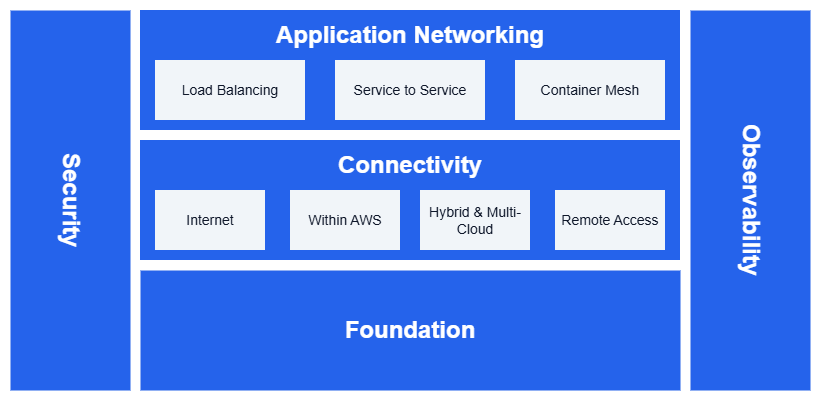

# はじめに {#introduction}

AWS ネットワーキングのベストプラクティスに関するリファレンスアーキテクチャです。

エンタープライズ AWS ネットワークは、相互に連携する 5 つの柱で構成されています。

* **基盤 (Foundation)** - AWS Organizations、Amazon VPC、サブネット、Amazon VPC IP Address Manager を使用して構築されるコアインフラストラクチャ。他のすべての要素の土台となります。
* **接続性 (Connectivity)** - インターネットゲートウェイ、AWS Transit Gateway、AWS Direct Connect、および VPN サービスを通じた通信
* **アプリケーションネットワーキング (Application Networking)** - Elastic Load Balancing によるトラフィック分散、Amazon VPC Lattice によるサービス間通信、およびコンテナネットワーキング
* **セキュリティ (Security)** - AWS Network Firewall、AWS PrivateLink、Amazon Route 53 Resolver DNS Firewall による保護とネットワーク分離
* **オブザーバビリティ (Observability)** - すべてのサービスにわたる監視とトラブルシューティング機能

/// caption
AWS ネットワークリファレンスアーキテクチャ
///

## はじめ方 {#getting-started}

目的が明確な場合は、**[デシジョンマップ](decisions.md)** から始めてください。AWS ネットワーキングに関するよくある質問を、推奨サービス・パターン・トレードオフに直接マッピングしています。

または、基盤 (Foundation) から始めて基本を理解したうえで、具体的なネットワーキング要件に応じて各柱を探索してください。

*   :material-network: **基盤 (Foundation)**

    ---

    VPC、サブネット、ルーティング、コアインフラストラクチャコンポーネントなど、
    AWS ネットワーキングの基本概念を解説します。

    ---

    [:octicons-arrow-right-24: 基盤 (Foundation)](foundation/)

*   :material-lan-connect: **接続性 (Connectivity)**

    ---

    インターネットアクセス、AWS 内の接続性、ハイブリッド・マルチクラウドの
    ネットワーキングソリューションを解説します。

    ---

    [:octicons-arrow-right-24: 接続性 (Connectivity)](connectivity/)

*   :material-application: **アプリケーションネットワーキング (Application Networking)**

    ---

    モダンアプリケーション向けのロードバランシング、サービス間通信、
    コンテナメッシュネットワーキングを解説します。

    ---

    [:octicons-arrow-right-24: アプリケーションネットワーキング (Application Networking)](application-networking/)

*   :material-lock-outline: **セキュリティ (Security)**

    ---

    多層防御戦略、アクセス制御、脅威保護によって
    AWS ネットワークを保護します。

    ---

    [:octicons-arrow-right-24: セキュリティ (Security)](security/)

*   :material-monitor-eye: **オブザーバビリティ (Observability)**

    ---

    ネットワークパフォーマンスの監視、接続性の問題のトラブルシューティング、
    AWS ネットワークの可視化を実現します。

    ---

    [:octicons-arrow-right-24: オブザーバビリティ (Observability)](observability/)

## コントリビュート {#contribute}

[問題の報告](community/report-a-correction.md)、[新しいベストプラクティスの提案](community/new-best-practice.md)、または[コンテンツの投稿](community/making-a-pull-request.md)を通じて、このガイドの改善にご協力ください。すべての人のために包括的な AWS ネットワーキングリソースを作成するコミュニティ主導の取り組みに参加しましょう。
