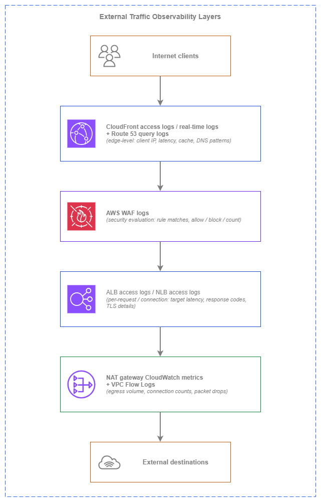

# 外部トラフィックモニタリング {#external-traffic-monitoring}

!!! info "前提条件"
    このセクションは、[インターネット接続](../connectivity/internet.md)、[ロードバランシング](../application-networking/load-balancing.md)、および[アウトバウンド制御](../security/outbound.md)に精通していることを前提としています。AWS ネットワーキングの基礎を初めて学ぶ方は、先にそれらのトピックを確認してください。

外部トラフィックモニタリングは、AWS 環境とパブリックインターネットの境界を越えるすべてのフローに対する可視性を提供します。対象は、アプリケーションに到達するクライアントからのインバウンドトラフィックと、外部サービスに接続するワークロードからのアウトバウンドトラフィックの両方です。これは、内部モニタリングでは答えられない問いに答えるオブザーバビリティレイヤーです。実際のクライアントがアプリケーションをどのように体験しているか、エッジでの実際のレイテンシはどの程度か、ワークロードはどの外部宛先を呼び出しているか、そしてエグレスコストはどこに発生しているか、といった問いに答えます。

課題はデータソースの不足ではありません。AWS は CDN エッジから NAT ゲートウェイまで、あらゆるレイヤーでロギングを提供しています。課題は、どのデータソースがどの問いに答えるかを把握すること、リアルタイム分析がバッチ処理に対してコストを正当化できる場面を見極めること、そして単一の外部フローの全体像を構築するためにレイヤー間でシグナルを相関させる方法を理解することです。このページはオブザーバビリティレイヤーごとに、エッジから内側に向かって整理されており、必要なログとメトリクスの組み合わせを決定するアーキテクチャ上の意思決定を解説します。

基本原則は**レイヤード外部オブザーバビリティ**です。各レイヤーは上下のレイヤーでは捉えられない情報を収集し、その組み合わせによって冗長な収集なしにフルパスの可視性を実現します。

/// caption
外部トラフィックオブザーバビリティレイヤー — [Drawio ソース](../assets/observability/external-traffic-layers.drawio)
///

各レイヤーは異なる情報を収集します。CloudFront ログはクライアントがエッジで体験した内容（キャッシュヒットまたはミス、エッジレイテンシ、プロトコルバージョン）を示します。AWS WAF ログはどのリクエストが評価され、どのようなセキュリティ判断が下されたかを示します。ALB/NLB ログはロードバランサーとターゲット間で何が起きたか（ターゲットの応答時間、バックエンドエラー）を示します。NAT ゲートウェイメトリクスと VPC フローログは、ワークロードがアウトバウンドで送信した内容とそのコストを示します。単一のレイヤーだけでは全体像を把握できません。組み合わせることで初めて全体像が見えます。

## 主要な機能 {#key-capabilities}

*   :material-cloud-download: **CloudFront アクセスログとリアルタイムログ**

    ---

    すべてのクライアントリクエストに対するエッジレベルの可視性: レイテンシー、キャッシュステータス (ヒット/ミス/エラー)、クライアント IP (IPv4 および IPv6)、HTTP プロトコルバージョン、TLS バージョン、地理的分布。リアルタイムログは数秒以内に Kinesis Data Streams へ配信され、ライブダッシュボードに活用できます。

*   :material-scale-balance: **ALB および NLB アクセスログ**

    ---

    クライアント IP、リクエスト詳細、レスポンスコード、ターゲット処理時間、TLS ハンドシェイクメタデータを含む、リクエスト単位 (ALB) または接続単位 (NLB) のログ。ロードバランサーとターゲット間で何が起きているかを把握するための、主要なイングレス観測ツールです。

*   :material-shield-alert: **AWS WAF ログ**

    ---

    どのルールが一致したか、実行されたアクション (許可、ブロック、カウント、CAPTCHA)、一致をトリガーしたリクエスト属性を示す、リクエスト単位の評価結果。盲点なくセキュリティ調査や AWS WAF ルールのチューニングを行うために不可欠です。

*   :material-upload-network: **NAT ゲートウェイ CloudWatch メトリクス**

    ---

    処理バイト数、ドロップパケット数、アクティブ接続数、接続試行数、エラー数。エグレスコストの可視化と、予期しないアウトバウンドトラフィックを生成しているワークロードの検出に役立つ主要ツールです。

*   :material-earth: **AWS Global Accelerator フローログ**

    ---

    エニーキャストエントリポイントを使用する L4 ワークロードにおける、クライアントからアクセラレーターへのトラフィックの可視性。アクセラレーターを通過するすべてのフローについて、送信元/宛先 IP、ポート、プロトコル、バイト数、パケット数をキャプチャします。

*   :material-dns: **Route 53 クエリログ**

    ---

    パブリックホストゾーンに対する DNS クエリパターン: どのドメインが、どのリゾルバー IP から、どの程度の量でクエリされているか。偵察の検出、DNS レベルのトラフィック分散の測定、フェイルオーバー動作の検証に役立ちます。

## ベストプラクティス {#best-practices}

### イングレスの可観測性 {#ingress-observability}

#### ALB アクセスログを常に有効化する — これが主要なイングレスデータソース {#always-enable-alb-access-logs-they-are-your-primary-ingress-data-source}

ALB アクセスログは、ロードバランサーに到達するすべてのリクエストを記録します。クライアント IP (IPv4 または IPv6)、リクエスト URL、レスポンスコード、リクエスト処理時間、ターゲット処理時間、リクエストを処理したターゲットが含まれます。ALB からアクセスログに対する追加料金は発生しません。S3 ストレージ料金のみです。運用上の価値と比較すると、コストはごくわずかです。

ALB アクセスログは、CloudWatch メトリクスでは答えられない疑問に答えてくれます。具体的には、どのクライアントがエラーを経験しているか、どのターゲットが遅いか、リクエストレベルでのレイテンシー分布はどのようなものか(平均値だけでなく)、5xx のスパイクが 1 つのターゲットから来ているのかすべてから来ているのかといった疑問です。アクセスログを有効にしていなければ、集計されたメトリクスだけで本番インシデントをデバッグすることになります。

すべての ALB でアクセスログを作成時に有効化してください。クロスアカウント配信を使用して、集中ログ管理アカウントの S3 バケットに配信します(ALB がバケットに直接書き込みます。リージョンの ELB サービスプリンシパルを許可するようにバケットポリシーを設定してください)。Amazon Athena で効率的にクエリできるよう、アカウント、リージョン、日付でログをパーティション分割してください。

***重要なポイント:*** *ALB アクセスログは生成が無料で、ストレージコストはわずかであり、インシデント調査時には代替不可能です。本番 ALB でこれを無効のままにしておく正当な理由はありません。*

#### TLS および接続レベルの可視性のために NLB アクセスログを有効化する {#enable-nlb-access-logs-for-tls-and-connection-level-visibility}

NLB アクセスログは、ALB ログでは取得できない接続レベルの詳細を記録します。TLS ハンドシェイクレイテンシー、ネゴシエートされた TLS 暗号、クライアント証明書の詳細(相互 TLS の場合)、接続時間、接続ごとの転送バイト数が含まれます。個々のリクエストではなく接続パターンを把握する必要がある L4 ワークロードでは、NLB ログが主要なデータソースとなります。

NLB アクセスログはデフォルトで無効になっており、明示的に有効化する必要があります。ALB ログと同様に S3 に配信され、NLB からの追加料金は発生しません。クライアントの接続動作と TLS ネゴシエーションの失敗を把握するために、特に TLS を終端するインターネット向け NLB すべてで有効化してください。

#### ライブの運用可視性のために CloudFront リアルタイムログを使用する {#use-cloudfront-real-time-logs-for-live-operational-visibility}

CloudFront には 2 つのログモードがあります。標準ログ(S3 にバッチ配信、通常数分以内)とリアルタイムログ(数秒以内に Kinesis Data Streams に配信)です。標準ログは、インシデント後の分析やトレンドレポートには十分です。リアルタイムログは、ライブダッシュボード、エラーレートに対するサブミニッツのアラート、またはデプロイ中のキャッシュ動作の変化を即座に把握する必要がある場合に適しています。

コストの差は大きいです。標準ログは無料(S3 ストレージ料金のみ)ですが、リアルタイムログはレコード数とシャード数に基づいた Kinesis Data Streams の料金が発生します。1 時間あたり数百万リクエストを処理するトラフィックの多いディストリビューションでは、リアルタイムログのコストが月額数百ドルに達することがあります。

| ログタイプ | 配信レイテンシー | コスト | ユースケース |
| --- | --- | --- | --- |
| **標準ログ** | 数分(S3 へのバッチ配信) | 無料(S3 ストレージのみ) | インシデント後の分析、トレンドレポート、コンプライアンスアーカイブ |
| **リアルタイムログ** | 数秒(Kinesis Data Streams) | Kinesis シャード時間 + レコードごとの料金 | ライブダッシュボード、サブミニッツのアラート、デプロイ監視 |

秒単位の可視性という運用上の価値が Kinesis のコストを正当化できる場合にリアルタイムログを選択してください。これは通常、キャッシュの設定ミスやオリジン障害を 1 分以内に検出する必要がある、トラフィックが多く収益に直結するディストリビューションに該当します。

#### フルパスのレイテンシー分析のために CloudFront ログと ALB ログを相関させる {#correlate-cloudfront-logs-with-alb-logs-for-full-path-latency-analysis}

CloudFront → ALB → ターゲットを経由する 1 つのクライアントリクエストは、両方のレイヤーでログエントリを生成します。CloudFront ログはクライアントが待機した合計時間(エッジ処理、オリジンフェッチ、ネットワーク転送を含む)を記録します。ALB ログはターゲットが応答するまでの時間を記録します。CloudFront の合計時間と ALB のターゲット処理時間の差が、ネットワークとエッジのオーバーヘッドです。

`x-amz-cf-id` リクエスト ID(CloudFront ログとオリジンに転送される `X-Amz-Cf-Id` ヘッダーの両方に存在)を使用して、レイヤー間のエントリを相関させてください。この相関により、レイテンシーの問題がエッジ(CloudFront 処理、TLS ネゴシエーション)、転送中(エッジとオリジン間のネットワークパス)、またはターゲット(アプリケーション処理時間)のどこにあるかが明らかになります。

#### 完全なクライアント可視性のために IPv6 クライアントアドレスをログに記録する {#log-ipv6-client-addresses-for-complete-client-visibility}

ALB と CloudFront はどちらも、クライアントが IPv6 で接続した場合に実際のクライアント IPv6 アドレスをログに記録します。これは変換またはプロキシされたアドレスではなく、実際のクライアント IP です。デュアルスタックデプロイメントでは、ログ分析でクライアント IP フィールドの IPv4 と IPv6 の両方のアドレスを処理する必要があります。

NLB アクセスログも同様に、デュアルスタックまたは IPv6 専用リスナーの IPv6 クライアントアドレスを記録します。ログのパース、IP ベースの分析、セキュリティ調査ツールが IPv6 アドレス形式をサポートしていることを確認してください。地理的 IP データベースと脅威インテリジェンスフィードは、IPv4 クライアントと同等の分析能力を維持するために IPv6 レンジをカバーしている必要があります。

***重要なポイント:*** *IPv6 クライアントの採用が増えるにつれ、IPv4 アドレスしか処理できないログ分析パイプラインはブラインドスポットを生み出します。SIEM、ダッシュボード、アラートルールで IPv6 サポートを検証してください。*

### セキュリティの可観測性 {#security-observability}

#### すべてのウェブ ACL で AWS WAF ログを有効化する — インシデント時だけでなく常時 {#enable-aws-waf-logging-for-every-web-acl-not-just-during-incidents}

AWS WAF ログは、すべてのリクエストに対する完全な評価結果を記録します。評価されたルール、マッチしたルール、実行されたアクション、マッチをトリガーしたリクエスト属性(ヘッダー、URI、クエリ文字列)が含まれます。このデータは 3 つの目的に不可欠です。誤検知を減らすためのルールのチューニング、事後の攻撃パターンの調査、そして Count から Block に切り替える前に新しいルールが期待どおりに動作することの検証です。

AWS WAF ログは S3、CloudWatch Logs、または Kinesis Data Firehose に配信できます。ほとんどの環境では、コスト効率の高い長期ストレージと Athena ベースの分析のために、集中ログ管理アカウントの S3 に配信してください。CloudWatch Logs は、特定のルールマッチに対するリアルタイムのメトリクスフィルターとアラームが必要な場合にのみ使用してください(GB あたりのインジェストコストは S3 より大幅に高くなります)。

#### Shield Advanced がトリガーされる前に DDoS パターンを検出する {#detect-ddos-patterns-before-shield-advanced-triggers}

CloudFront と ALB のアクセスログには、DDoS イベントに先行する生のシグナルが含まれています。集中した IP レンジからのリクエストレートの急激なスパイク、異常な地理的分布の変化、または異常なリクエストパターン(同一の User-Agent 文字列、繰り返されるパス)などです。これらのパターンをほぼリアルタイムで監視することで、Shield Advanced の自動緩和が発動するしきい値に達する前にアプリケーションレイヤーの攻撃を検出できます。

短い評価期間(1 分間隔)で ALB リクエスト数と 4xx/5xx レートに CloudWatch アラームを設定してください。CloudFront については、クライアント IP プレフィックスごとのリクエストレートを追跡し、異常な集中に対してアラートをトリガーする Kinesis コンシューマーを使用したリアルタイムログを活用してください。これらの早期警告シグナルにより、攻撃が本格化する前に AWS WAF レート制限を強化したり、AWS Shield Response Team に連絡したりする時間を運用チームに与えることができます。

#### Route 53 クエリログを使用して偵察を検出し、フェイルオーバーを検証する {#use-route-53-query-logs-to-detect-reconnaissance-and-validate-failover}

パブリックホストゾーンの Route 53 クエリログは、すべての DNS クエリを記録します。クエリされたドメイン、クエリタイプ、リゾルバー IP、レスポンスコードが含まれます。このデータは偵察パターン(サブドメインの体系的な列挙)を明らかにし、インシデント中に DNS フェイルオーバーが期待どおりに機能していることを検証し、異常検知のためのベースラインクエリボリュームを提供します。

クエリログは us-east-1 リージョンの CloudWatch Logs に配信されます(ホストゾーンがどこからクエリされるかに関わらず)。マルチアカウント環境では、すべてのパブリックホストゾーンでクエリログを設定し、クロスアカウントログサブスクリプションを使用して CloudWatch Logs を集中ログ管理アカウントに転送してください。

### エグレスの可観測性 {#egress-observability}

#### エグレスコストの可視性のために NAT ゲートウェイメトリクスを監視する {#monitor-nat-gateway-metrics-for-egress-cost-visibility}

NAT ゲートウェイの CloudWatch メトリクスは、エグレスコストを把握し管理するための主要なツールです。主要なメトリクスは以下のとおりです。

| メトリクス | 何を明らかにするか | アラートしきい値のガイダンス |
| --- | --- | --- |
| `BytesOutToDestination` | 外部宛先に送信された合計バイト数(エグレス料金) | ベースライン + 割合の偏差 |
| `BytesOutToSource` | ワークロードに返された合計バイト数(レスポンストラフィック) | BytesOut に対する異常な比率はデータダウンロードパターンを示唆 |
| `ConnectionAttemptCount` | 期間ごとに開始された新しい接続数 | スパイクは新しいワークロードの動作または侵害を示す |
| `ActiveConnectionCount` | 同時アクティブ接続数 | AZ ごとの上限 55,000 に近づいている場合はスケーリングが必要 |
| `PacketsDropCount` | NAT ゲートウェイの制限によりドロップされたパケット数 | ゼロ以外の値は調査が必要 |
| `ErrorPortAllocation` | ポート割り当て失敗(ソースポートの枯渇) | ゼロ以外の値 — ワークロードが接続制限を超えている |
| `IdleTimeoutCount` | アイドルタイムアウトにより閉じられた接続数 | 高い値は接続プールの問題を示唆 |

`PacketsDropCount` と `ErrorPortAllocation` に対してしきい値 1 で CloudWatch アラームを設定してください。発生した場合はトラフィックがサイレントにドロップされていることを意味します。月次請求が届く前に予期しないエグレスコストの増加を検知するために、`BytesOutToDestination` にベースライン比の割合しきい値でアラームを設定してください。

#### VPC Flow Logs を使用して予期しないエグレス先を特定する {#use-vpc-flow-logs-to-identify-unexpected-egress-destinations}

VPC Flow Logs は、エグレストラフィックを含むすべてのフローのソースおよび宛先 IP を記録します。NAT ゲートウェイメトリクスが予期しないエグレスボリュームを示している場合、Flow Logs は重要なフォローアップの疑問に答えます。*そのトラフィックはどこに向かっているのか?*

NAT ゲートウェイの ENI またはそれを経由してルーティングするサブネットに Flow Logs を設定してください。`dstaddr` フィールドを使用して外部宛先 IP を特定し、DNS クエリログと相関させて IP をドメイン名にマッピングしてください。この組み合わせにより、どのワークロードがどの外部サービスを呼び出しているか、どれだけのデータを転送しているかが明らかになります。これはコスト配分とセキュリティ調査の両方に不可欠です。

#### L4 イングレスパターンのために Global Accelerator フローログを追跡する {#track-global-accelerator-flow-logs-for-l4-ingress-patterns}

AWS Global Accelerator フローログは、ALB アクセスログが L7 に提供するのと同じ可視性を L4 トラフィックに提供します。アクセラレーターを通過するすべてのフローのソースおよび宛先 IP、ポート、プロトコル、バイト数、パケット数が含まれます。本番トラフィックを処理するすべての Global Accelerator アクセラレーターでフローログを有効化してください。

フローログは S3 に配信され、VPC Flow Logs と同じ形式に従うため、既存のログ分析パイプラインと互換性があります。クライアントの地理的分布を把握し、接続の異常を検出し、エンドポイントグループごとのトラフィックボリュームを測定するために活用してください。

### マルチアカウントのログアーキテクチャ {#multi-account-logging-architecture}

#### すべての外部トラフィックログを専用のログ管理アカウントに集中化する {#centralize-all-external-traffic-logs-in-a-dedicated-logging-account}

マルチアカウント環境では、すべてのアカウントからの外部トラフィックログを、相関分析、長期保持、クロスアカウント調査のために集中ログ管理アカウントに集約する必要があります。ログ管理アカウントはアクセスが制限されたアカウントであり、アプリケーションチームは変更できません。これによりログの整合性と保持コンプライアンスが確保されます。

各ログタイプのクロスアカウント配信を設定してください。

| ログソース | クロスアカウント配信メカニズム |
| --- | --- |
| **ALB/NLB アクセスログ** | 各リージョンの ELB サービスプリンシパルを許可する S3 バケットポリシー |
| **CloudFront 標準ログ** | CloudFront サービスプリンシパルを許可する S3 バケットポリシー |
| **CloudFront リアルタイムログ** | ログ管理アカウントの Kinesis Data Streams(またはクロスアカウント IAM を使用した同一アカウント) |
| **AWS WAF ログ** | ログ管理アカウントの S3 への Kinesis Data Firehose、または直接 S3 配信 |
| **VPC Flow Logs** | リソースポリシーを使用した S3 または CloudWatch Logs へのクロスアカウント配信 |
| **Route 53 クエリログ** | 集中管理された宛先への CloudWatch Logs クロスアカウントサブスクリプションフィルター |
| **Global Accelerator フローログ** | Global Accelerator サービスプリンシパルを許可する S3 バケットポリシー |

#### 効率的なクエリのためにログをパーティション分割する {#partition-logs-for-efficient-querying}

大規模な外部トラフィックログは 1 日あたりテラバイト単位のデータを生成します。適切なパーティション分割がなければ、Athena クエリはデータセット全体をスキャンし、保持期間に比例してコストが増加します。すべてのログバケットを以下でパーティション分割してください。

* **アカウント ID** — アカウントごとのコスト配分とスコープを絞った調査を可能にする
* **リージョン** — ほとんどのクエリの地理的スコープに一致する
* **年/月/日/時** — 関連するパーティションのみをスキャンする時間範囲を絞ったクエリを可能にする

ALB と CloudFront のログはすでに日付ベースのプレフィックスで配信されます。バケット構造のトップレベルプレフィックスとしてアカウント ID を追加してください。新しいデータが到着しても手動でパーティションを管理しなくて済むよう、Athena パーティションプロジェクションを使用してください。

***重要なポイント:*** *外部トラフィックログの保存コストは、非効率なクエリのコストと比べれば取るに足りません。パーティション分割とプロジェクションに最初から投資してください。それがログを実際にクエリ可能にするか、単なるアーカイブにするかを決定します。*

### コスト管理 {#cost-management}

#### 各データソースのコストプロファイルを把握する {#understand-the-cost-profile-of-each-data-source}

外部トラフィック監視のコストは、有効にするデータソースとその消費方法によって桁違いに異なります。

| データソース | 生成コスト | ストレージ/配信コスト | 分析コスト |
| --- | --- | --- | --- |
| **ALB アクセスログ** | 無料 | S3 ストレージのみ(GB/月あたり) | Athena クエリごとのスキャン |
| **NLB アクセスログ** | 無料 | S3 ストレージのみ | Athena クエリごとのスキャン |
| **CloudFront 標準ログ** | 無料 | S3 ストレージのみ | Athena クエリごとのスキャン |
| **CloudFront リアルタイムログ** | 無料 | Kinesis Data Streams シャード時間 + レコードごとの料金 | コンシューマーコンピューティング(Lambda、KDA) |
| **AWS WAF ログ(S3)** | 無料 | S3 ストレージのみ | Athena クエリごとのスキャン |
| **AWS WAF ログ(CloudWatch)** | 無料 | CloudWatch Logs GB あたりのインジェスト + ストレージ | CloudWatch Insights クエリ |
| **NAT ゲートウェイメトリクス** | 無料(含まれる) | N/A(CloudWatch デフォルト保持) | CloudWatch ダッシュボード/アラームコスト |
| **VPC Flow Logs(S3)** | GB あたりの段階的インジェスト([料金](https://aws.amazon.com/cloudwatch/pricing/)) | S3 ストレージ | Athena クエリごとのスキャン |
| **Route 53 クエリログ** | 無料 | CloudWatch Logs インジェスト + ストレージ | CloudWatch Insights クエリ |

最もコストが高い項目は、大量の VPC Flow Logs(生成料金)と CloudFront リアルタイムログ(Kinesis 料金)です。VPC Flow Logs については、必要なフィールドのみを取得するカスタム形式を使用し、完全なキャプチャが不要な場合は拒否されたトラフィックまたは特定の ENI との間のトラフィックのみをキャプチャするようにフィルタリングしてください。

#### デフォルトはバッチ分析とし、リアルタイムは正当化できる場合のみ使用する {#use-batch-analysis-as-the-default-real-time-only-where-justified}

リアルタイムログ分析(CloudFront リアルタイムログ → Kinesis → Lambda/KDA、または AWS WAF ログ → CloudWatch Logs → メトリクスフィルター)は、バッチ分析(ログ → S3 → オンデマンド Athena)よりも大幅にコストが高くなります。以下の用途にはデフォルトでバッチ分析を使用してください。

* インシデント後の調査
* 週次/月次のトレンドレポート
* コスト配分とチャージバック
* コンプライアンスおよび監査クエリ

リアルタイム分析は以下の用途に限定してください。

* デプロイ中のライブ運用ダッシュボード
* エラーレートスパイクに対するサブミニッツのアラート
* 秒単位が重要なアクティブなインシデント対応
* DDoS 検出と自動応答トリガー

## 各データソースの使い分け {#when-to-use-each-data-source}

各データソースは、それぞれ異なる問いに答えます。適切な組み合わせは、何を知りたいか、またどれだけ迅速に知る必要があるかによって決まります。

**CloudFront アクセスログ**が適しているケース:

* クライアント体験に関するメトリクス(レイテンシー、キャッシュヒット率、エッジでのエラー率)が必要な場合
* クライアントトラフィックの地理的分布を把握したい場合
* キャッシュの動作を理解し、キャッシュポリシーを最適化したい場合
* エッジレベルの問題(TLS ネゴシエーションの失敗、HTTP プロトコルエラー)を調査している場合

**ALB アクセスログ**が適しているケース:

* ターゲットの動作をリクエスト単位で可視化したい場合(どのターゲットがどのリクエストを処理し、どれだけ時間がかかったか)
* 5xx エラーをデバッグし、ロードバランサーのエラーとターゲットのエラーを区別する必要がある場合
* セキュリティ調査のために、クライアント IP と特定のリクエストを紐付けたい場合
* リクエストレベルでレイテンシーのパーセンタイル分析を行いたい場合

**NLB アクセスログ**が適しているケース:

* L4 ワークロードの接続レベルの可視性が必要な場合(接続時間、接続あたりのバイト数)
* TLS ハンドシェイクの失敗や暗号スイートのネゴシエーション問題をデバッグしている場合
* キャパシティプランニングのために接続パターンを把握したい場合

**AWS WAF ログ**が適しているケース:

* ブロックされたリクエストが正当なものかどうか(誤検知)を調査している場合
* 実際のマッチデータをもとに AWS WAF ルールをチューニングしたい場合
* 時系列で攻撃パターンを相関分析し、持続的な脅威を特定したい場合
* 各リクエストに対して行われたセキュリティ判断の監査証跡が必要な場合

**NAT ゲートウェイメトリクス**が適しているケース:

* アウトバウンドのコスト可視化とトレンド把握が必要な場合
* 予期しないアウトバウンドトラフィック量を検出したい場合
* 接続数の上限やポート枯渇を監視したい場合
* アウトバウンドコストに影響するワークロードの動作変化を早期に検知したい場合

**Route 53 クエリログ**が適しているケース:

* インシデント発生時に DNS フェイルオーバーの動作を検証したい場合
* サブドメインの列挙や偵察行為を検出したい場合
* 異常検知のためにクエリ量のベースラインを把握したい場合
* エンドポイント間の DNS レベルのトラフィック分散を理解したい場合

**Global Accelerator フローログ**が適しているケース:

* L4 ワークロードにおけるクライアントからアクセラレーターへのトラフィックを可視化したい場合
* アクセラレーターエンドポイントの配置最適化のために、クライアントの地理的分布を分析したい場合
* アクセラレーターエンドポイントのキャパシティプランニングのためにフローレベルのデータが必要な場合

## 外部トラフィックモニタリングと他のサービスの組み合わせ {#combining-external-traffic-monitoring-with-other-services}

| 組み合わせ | 外部トラフィックモニタリングが提供するもの | 他のサービスが提供するもの |
| --- | --- | --- |
| **ALB アクセスログ + Amazon Athena** | S3 内のリクエスト単位のログデータ | パーティションプルーニングによるコスト効率の高い SQL ベースのアドホッククエリ分析 |
| **CloudFront リアルタイムログ + Kinesis Data Streams + Lambda** | リアルタイムのリクエスト単位のエッジデータ | ライブダッシュボード、異常検知、自動応答のためのストリーム処理 |
| **AWS WAF ログ + Amazon OpenSearch Service** | リクエスト単位のセキュリティ評価データ | セキュリティ調査のための全文検索、可視化、および相関分析 |
| **NAT ゲートウェイメトリクス + CloudWatch Alarms + SNS** | 送信ボリュームと接続メトリクス | 運用チームへのしきい値ベースのアラートと通知ルーティング |
| **VPC Flow Logs + Amazon Athena** | 送信先を含むフロー単位のネットワークデータ | 送信先分析、コスト配賦、およびセキュリティ調査クエリ |
| **Route 53 クエリログ + CloudWatch Logs Insights** | パブリックゾーンの DNS クエリパターン | パターン分析、異常検知、およびフェイルオーバー検証クエリ |
| **ALB アクセスログ + AWS Security Hub** | 攻撃のリクエストレベルの証跡 | セキュリティ検出結果の一元集約とコンプライアンスレポート |
| **CloudFront ログ + Amazon QuickSight** | クライアントエクスペリエンスとキャッシュパフォーマンスデータ | ステークホルダー向けレポートのビジネスインテリジェンスダッシュボード |
| **全ログソース + AWS Glue + S3** | 全レイヤーからの生ログデータ | クロスレイヤー相関のためのスキーマ検出、ETL、およびデータレイク整理 |

## クライアントエクスペリエンスのモニタリング {#client-experience-monitoring}

外部トラフィックログは、実際のクライアントがアプリケーションをどのように体験しているかを知る唯一の情報源です。ターゲットに対する CloudWatch メトリクスはサーバーサイドの健全性を示しますが、外部トラフィックログはクライアントサイドの実態を示します。

### ALB ログからのレイテンシーパーセンタイル {#latency-percentiles-from-alb-logs}

ALB アクセスログには、`target_processing_time`（ターゲットが応答するまでの時間）、`request_processing_time`（ALB が転送前に費やした時間）、`response_processing_time`（ALB がレスポンス送信に費やした時間）が含まれます。これらのフィールドを使用してレイテンシーパーセンタイル（p50、p95、p99）を計算することで、最も遅いクライアントが直面するテールレイテンシーの実態を把握できます。これは平均ベースの CloudWatch メトリクスでは見えない情報です。

Athena を使用して ALB ログをクエリし、ターゲットグループ別、ターゲット別、または URL パス別にパーセンタイルを計算します。p99 が p50 の 10 倍になっている場合は、一部のリクエストが低速なパスに到達していることを示しており、コールドキャッシュ、特定のターゲット、または特定のリクエストパターンが原因であることが多いです。

### CloudFront ログからのキャッシュヒット率 {#cache-hit-ratios-from-cloudfront-logs}

CloudFront ログには `x-edge-result-type` フィールドが含まれており、各リクエストがキャッシュから提供されたか（Hit）、オリジンから取得されたか（Miss）、またはエラーが発生したかを示します。キャッシュヒット率は、Hit または RefreshHit として提供されたリクエストの割合をリクエスト総数に対して計算します。

キャッシュヒット率の低下は、オリジンへの負荷とクライアントのレイテンシーを直接増加させます。このメトリクスは、デプロイ後（新しいキャッシュビヘイビアや無効化によってヒット率が急落する可能性があります）、TTL 変更後、およびトラフィックパターンの変化時にモニタリングしてください。コンソールの CloudFront 組み込みキャッシュ統計は集計ビューを提供しますが、ログベースの分析ではパス別および地域別の詳細な内訳を確認できます。

### IPv6 クライアント採用状況のトラッキング {#ipv6-client-adoption-tracking}

CloudFront と ALB のログはどちらもクライアントの IP バージョンを記録します。IPv6 と IPv4 でそれぞれ到着するリクエストの割合を追跡することで、IPv6 クライアントの採用状況を経時的に測定できます。このデータは IPv6 専用インフラストラクチャに関する意思決定に役立ちます（IPv6 クライアントが一定の閾値に達した時点で、IPv4 インフラストラクチャはデフォルトではなくレガシーパスとなります）。

## ドキュメント {#documentation}

*   :material-file-document: **CloudFront アクセスログ**

    ---

    CloudFront ディストリビューションの標準ログおよびリアルタイムログ。ログフィールド、配信設定、S3/Kinesis のセットアップを含みます。

    [:octicons-arrow-right-24: CloudFront ログのドキュメント](https://docs.aws.amazon.com/AmazonCloudFront/latest/DeveloperGuide/AccessLogs.html)

*   :material-file-document: **ALB アクセスログ**

    ---

    Application Load Balancer のリクエスト単位のログ。ログフォーマット、S3 への配信、クロスアカウント設定を含みます。

    [:octicons-arrow-right-24: ALB アクセスログのドキュメント](https://docs.aws.amazon.com/elasticloadbalancing/latest/application/load-balancer-access-logs.html)

*   :material-file-document: **NLB アクセスログ**

    ---

    Network Load Balancer の接続レベルのログ。TLS メタデータおよび接続タイミングフィールドを含みます。

    [:octicons-arrow-right-24: NLB アクセスログのドキュメント](https://docs.aws.amazon.com/elasticloadbalancing/latest/network/load-balancer-access-logs.html)

*   :material-file-document: **AWS WAF ログ**

    ---

    AWS WAF の評価結果をリクエスト単位で S3、CloudWatch Logs、または Kinesis Data Firehose に記録。ログフィールドのリファレンスとフィルタリングを含みます。

    [:octicons-arrow-right-24: AWS WAF ログのドキュメント](https://docs.aws.amazon.com/waf/latest/developerguide/logging.html)

*   :material-currency-usd: **CloudWatch の料金**

    ---

    メトリクス、アラーム、ログの取り込み、および Logs Insights クエリの料金。リアルタイムモニタリングのコストに直結します。

    [:octicons-arrow-right-24: CloudWatch の料金](https://aws.amazon.com/cloudwatch/pricing/)

*   :material-file-document: **NAT ゲートウェイのモニタリング**

    ---

    NAT ゲートウェイで利用可能な CloudWatch メトリクス。ディメンション、統計情報、推奨アラームを含みます。

    [:octicons-arrow-right-24: NAT ゲートウェイの CloudWatch メトリクス](https://docs.aws.amazon.com/vpc/latest/userguide/vpc-nat-gateway-cloudwatch.html)

## 関連ページ {#related-pages}

**他のオブザーバビリティトピックとの関係:**

* **[内部トラフィックモニタリング](internal-traffic.md)**: AWS 環境内のイーストウエストトラフィックの可視性について説明します。外部トラフィックモニタリングは、インターネット境界を越えるノースサウストラフィックを扱います。
* **[AWS サービスモニタリング](service-monitoring.md)**: AWS ネットワーキングサービス自体のヘルスとパフォーマンスモニタリングについて説明します。外部トラフィックモニタリングは、これらのサービスが生成するデータを活用します。
* **[通知](notifications.md)**: アラートと通知ルーティングについて説明します。外部トラフィックモニタリングは、通知が処理するシグナルを生成します。

**コネクティビティとの関係:**

* **[インターネット接続](../connectivity/internet.md)**: イングレスおよびエグレスアーキテクチャ(集中型と分散型、IPv4 と IPv6)を定義します。外部トラフィックモニタリングは、そのアーキテクチャが本番環境でどのように機能するかを可視化します。

**アプリケーションネットワーキングとの関係:**

* **[ロードバランシング](../application-networking/load-balancing.md)**: ALB と NLB は、イングレストラフィックのデータプレーンであると同時に、外部トラフィックオブザーバビリティを支えるアクセスログのソースでもあります。

**セキュリティとの関係:**

* **[アウトバウンドコントロール](../security/outbound.md)**: 許可されるエグレストラフィックを定義します。外部トラフィックモニタリング(NAT ゲートウェイメトリクス、VPC Flow Logs)は、これらのコントロールが機能していることを検証し、ポリシーのギャップを明らかにします。
