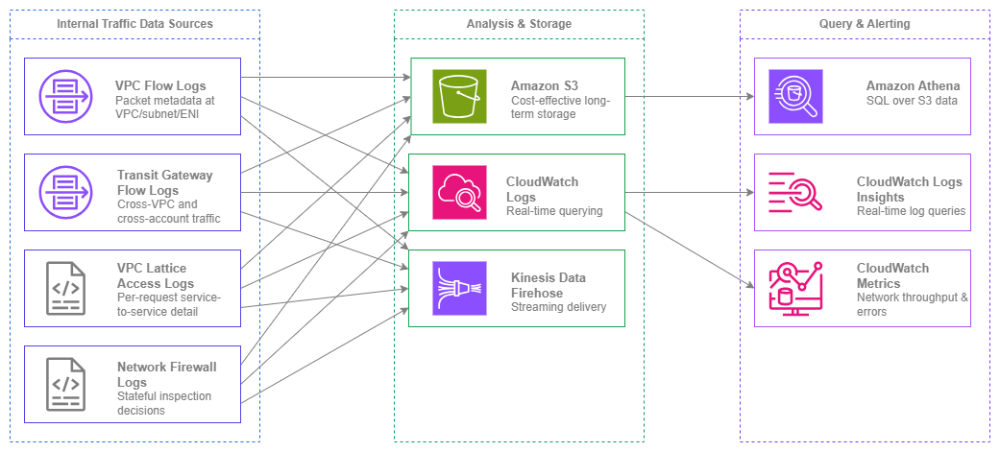

# 内部トラフィックモニタリング {#internal-traffic-monitoring}

!!! info "前提条件"
    このセクションでは、[Amazon VPC](../foundation/vpc.md)、[サブネット](../foundation/subnets.md)、および [AWS 内の接続性](../connectivity/within-aws.md) に関する知識を前提としています。AWS ネットワーキングの基礎を初めて学ぶ方は、先にそれらのトピックを確認してください。

内部リソース間のトラフィックフローを把握することは、AWS におけるネットワークセキュリティ、コスト最適化、およびトラブルシューティングの基盤となります。セキュリティグループと NACL は*許可される*内容を定義しますが、内部トラフィックモニタリングは*実際に何が起きているか*を教えてくれます。これがなければ、ラテラルムーブメント(横方向の移動)の検出も、予期しないクロス AZ データ転送コストの特定も、「つながらない」という事実の先にあるトラブルシューティングも、すべて手探りになってしまいます。

AWS における内部トラフィックモニタリングは単一のツールではなく、階層的なアプローチです。VPC Flow Logs はネットワーク層でパケットレベルのメタデータを提供します。Transit Gateway Flow Logs はクロス VPC の可視性を一元化します。VPC Lattice アクセスログはリクエスト単位のアプリケーション層の詳細を記録します。Network Firewall ログはステートフルインスペクションの判断を記録します。各データソースはそれぞれ異なる問いに答えるものであり、本番環境ではそのほとんどを連携させて運用する必要があります。

このページは、内部トラフィックの可視化を構築する際に直面するデータソースと意思決定を中心に構成されています。具体的には、何を有効化するか、データをどこに送るか、コスト効率よくクエリする方法、そして複数のソースをどのように相関させるかについて説明します。


/// caption
内部トラフィックモニタリングのソース — [Drawio ソース](../assets/observability/internal-traffic-sources.drawio)
///

## 主要機能 {#key-capabilities}

<div class="grid cards" markdown>

*   :material-lan: **VPC フローログ**

    ---

    VPC、サブネット、または ENI レベルで IP トラフィックのメタデータをキャプチャします。カスタムログフォーマットには、送信元/送信先、ポート、プロトコル、TCP フラグ、トラフィックパス、フロー方向など 40 以上のフィールドが含まれます。IPv4 と IPv6 の両方をサポートします。

*   :material-transit-connection-variant: **Transit Gateway フローログ**

    ---

    Transit Gateway を通過するすべてのトラフィック(VPC 間、アカウント間、ハイブリッド)を一元的に可視化します。1 つの設定で組織全体の可視性を確保でき、VPC ごとの設定は不要です。

*   :material-swap-horizontal: **VPC Lattice アクセスログ**

    ---

    呼び出し元 ID、ターゲット ID、レイテンシー、レスポンスコード、認証ポリシーの判定結果を含むリクエスト単位のログです。サービス間トラフィックをアプリケーション層で可視化します。

*   :material-shield-check: **Network Firewall ログ**

    ---

    ステートフルインスペクションによるアラートログとフローログです。許可、拒否、またはアラートをトリガーした内容を、完全な 5 タプル情報とルールグループの帰属情報とともに記録します。

*   :material-database-search: **Amazon Athena**

    ---

    S3 に保存されたフローログを SQL で照会します。パーティション分割されたテーブルと事前構築済みのクエリパターンを活用した、大規模なフローログデータ分析に推奨されるツールです。

*   :material-chart-line: **CloudWatch メトリクスと Logs Insights**

    ---

    リアルタイムのネットワークメトリクス(NetworkIn/Out、NAT ゲートウェイのバイト数、Transit Gateway のバイト数)と、CloudWatch Logs に配信されたフローログのインタラクティブなログ照会機能を提供します。

</div>

## ベストプラクティス {#best-practices}

### 基盤としての VPC Flow Logs {#vpc-flow-logs-as-the-foundation}

#### すべてのアカウントのすべての VPC で VPC Flow Logs を有効にする {#enable-vpc-flow-logs-on-every-vpc-in-every-account}

VPC Flow Logs は、内部トラフィック監視において最も重要なツールです。サブネットレベルや ENI レベルではなく、VPC レベルで有効にすることで、単一の設定で VPC 内のすべてのトラフィックをキャプチャできます。サブネットレベルおよび ENI レベルのログは、ピンポイントのトラブルシューティングには有効ですが、主要な監視手段として使用すると、カバレッジに漏れが生じます。

マルチアカウント環境では、アカウント払い出しプロセスの一部として Flow Logs をデプロイしてください。新しい VPC はすべて、ログアーカイブアカウントの集中管理された S3 バケットに配信する形で、Flow Logs が自動的に有効化されるべきです。これにより、どのチームが作成した VPC であっても、可視性のない状態で運用されることを防げます。

***重要なポイント:*** *VPC Flow Logs は本番環境においてオプションではありません。アプリケーションログのネットワーク版に相当するものであり、これがなければセキュリティインシデントの調査、接続性の問題のトラブルシューティング、実際のトラフィックパターンの把握ができません。*

#### より豊富なメタデータを得るためにカスタムログ形式を使用する {#use-custom-log-format-for-richer-metadata}

デフォルトの Flow Log 形式でキャプチャされるフィールドは 14 個のみです。カスタム形式では 40 以上のフィールドをサポートしており、本番環境での分析に不可欠です。デフォルトに加えて、最低限以下のフィールドを含めてください。

| フィールド | 重要な理由 |
| --- | --- |
| `traffic-path` | トラフィックが通過したパス(IGW、VGW、Transit Gateway、VPC Peering など)を識別 — コスト配分に不可欠 |
| `flow-direction` | ENI レベルでの受信(ingress)と送信(egress)を区別 |
| `pkt-src-addr` / `pkt-dst-addr` | NAT 変換前の元の送信元/宛先 — NAT ゲートウェイを経由するトラフィックで必須 |
| `tcp-flags` | SYN のみのフロー(接続試行)、RST(拒否された接続)、FIN(正常なクローズ)を識別 |
| `sublocation-type` / `sublocation-id` | 特定の Wavelength Zone またはローカルゾーンを識別 |
| `type` | IPv4 または IPv6 — IPv6 トラフィックパターンのフィルタリングと分析に使用 |
| `az-id` | アベイラビリティゾーン ID — クロス AZ トラフィックと関連コストの特定に不可欠 |

`type` フィールドは IPv6 の可視性において特に重要です。Flow Logs は IPv4 と IPv6 の両方のトラフィックを同じログストリームでキャプチャします。`type` フィールドを使用してフィルタリングし、採用率を分析し、IPv6 に移行済みのワークロードを特定してください。

#### コスト効率の高いストレージと分析のために Flow Logs を S3 に配信する {#deliver-flow-logs-to-s3-for-cost-effective-storage-and-analysis}

配信先には S3、CloudWatch Logs、Kinesis Data Firehose の 3 つの選択肢があります。常時稼働のプライマリ Flow Log 設定には、S3 への配信を選択してください。コストの差は大きく、以下のとおりです。

| 配信先 | 取り込みコスト | ストレージコスト | クエリ方法 |
| --- | --- | --- | --- |
| **S3** | GB 単位の取り込み(段階的、[VPC Flow Logs の料金](https://aws.amazon.com/cloudwatch/pricing/)を参照) | S3 ストレージ料金(GB/月) | Athena(スキャン TB 単位) |
| **CloudWatch Logs** | GB 単位の取り込み(S3 の約 2 倍) | GB/月の保持料金 | Logs Insights(スキャン GB 単位) |
| **Kinesis Data Firehose** | GB 単位の配信 + 配信先コスト | 配信先に依存 | 配信先に依存 |

月間 100 GB の Flow Log データを生成する VPC の場合、S3 への配信コストは CloudWatch Logs の約半分です。数十の VPC にわたるスケールでは、この差は大きく積み重なります。

CloudWatch Logs は、特定のトラフィックパターン(例: 機密サブネットへの拒否フロー)に対するリアルタイムアラートが必要な場合にのみ、*セカンダリ*の配信先として使用してください。コストを抑えるために、保持期間は短く(7〜14 日)設定してください。

#### 効率的な Athena クエリのために S3 の Flow Log データをパーティション分割する {#partition-flow-log-data-in-s3-for-efficient-athena-queries}

S3 に配信する場合は、次の構造で Hive 互換のパーティション分割を使用してください: `{bucket}/{prefix}/AWSLogs/{account-id}/vpcflowlogs/{region}/{year}/{month}/{day}/`。これはデフォルトの配信構造であり、Athena のパーティションプロジェクションを有効にすることで、新しいパーティションが追加されるたびに `MSCK REPAIR TABLE` を実行する必要がなくなります。

パーティションプロジェクションを有効にして Athena テーブルを作成してください。

```sql
CREATE EXTERNAL TABLE vpc_flow_logs (
  version int,
  account_id string,
  interface_id string,
  srcaddr string,
  dstaddr string,
  srcport int,
  dstport int,
  protocol bigint,
  packets bigint,
  bytes bigint,
  start bigint,
  end_time bigint,
  action string,
  log_status string,
  vpc_id string,
  subnet_id string,
  tcp_flags int,
  type string,
  pkt_srcaddr string,
  pkt_dstaddr string,
  az_id string,
  flow_direction string,
  traffic_path int
)
PARTITIONED BY (
  `date` string,
  region string,
  account_id_partition string
)
ROW FORMAT DELIMITED FIELDS TERMINATED BY ' '
LOCATION 's3://your-flow-logs-bucket/AWSLogs/'
TBLPROPERTIES (
  'projection.enabled' = 'true',
  'projection.date.type' = 'date',
  'projection.date.range' = '2024/01/01,NOW',
  'projection.date.format' = 'yyyy/MM/dd',
  'projection.date.interval' = '1',
  'projection.date.interval.unit' = 'DAYS',
  'projection.region.type' = 'enum',
  'projection.region.values' = 'us-east-1,us-west-2,eu-west-1',
  'projection.account_id_partition.type' = 'enum',
  'projection.account_id_partition.values' = '111111111111,222222222222'
);
```

このアプローチにより、Athena は指定したパーティションのみをスキャンするため、クエリ時間とコストの両方を大幅に削減できます。

### クロス VPC の可視性のための Transit Gateway Flow Logs {#transit-gateway-flow-logs-for-cross-vpc-visibility}

#### 組織全体のトラフィック可視性のために Transit Gateway Flow Logs を有効にする {#enable-transit-gateway-flow-logs-for-organization-wide-traffic-visibility}

Transit Gateway Flow Logs は、Transit Gateway レベルでトラフィックをキャプチャします。VPC 間、アカウント間、または AWS ネットワークとオンプレミス間を通過するすべてのパケットが対象です。これにより、すべてのアカウントで VPC Flow Log を個別に設定することなく、クロス VPC トラフィックの単一の集中ビューが得られます。

これは、すべてのワークロードアカウントで VPC Flow Logs を有効にする直接アクセスが得られない場合があるマルチアカウント環境で特に有効です。Transit Gateway Flow Logs は Transit Gateway を所有するネットワーキングアカウントで設定されるため、ネットワーキングチームはワークロードアカウントの設定に関わらず、すべてのクロス VPC トラフィックパターンを把握できます。

#### 許可されていないクロス VPC 通信を検出するために Transit Gateway Flow Logs を使用する {#use-transit-gateway-flow-logs-to-detect-unauthorized-cross-vpc-communication}

Transit Gateway のルートテーブルとアタッチメントは、何が通信*できる*かを定義します。Transit Gateway Flow Logs は、何が実際に通信*している*かを示します。この 2 つを比較することで、以下を特定できます。

* 分離されるべき VPC 間のトラフィック(例: 本番環境から開発環境)
* 特定の VPC ペア間の予期しないトラフィック量(データ漏洩の可能性)
* ルートテーブルの設定ミスを示すトラフィックパターン(予期しないパスを通るトラフィック)

***重要なポイント:*** *Transit Gateway Flow Logs は、個々の VPC すべてに Flow Logs を設定することなく、組織内のすべてのクロス VPC トラフィックを単一ペインで把握できる唯一のネイティブな方法です。数百のアカウントを管理するネットワーキングチームにとって、クロス VPC の可視性の出発点となります。*

### 配信先の選択 {#choosing-delivery-destinations}

#### ユースケースに合わせた配信先を選択する {#match-the-delivery-destination-to-the-use-case}

S3、CloudWatch Logs、Kinesis Data Firehose の選択は好みの問題ではなく、データをどのように活用するかによって決まります。

| ユースケース | 推奨配信先 | 理由 |
| --- | --- | --- |
| 長期保持とコンプライアンス | S3 | 最低のストレージコスト、アーカイブ用ライフサイクルポリシー、アドホッククエリ用 Athena |
| トラフィックパターンのリアルタイムアラート | CloudWatch Logs | メトリクスフィルターとアラームがログ配信から数分以内に発火 |
| セキュリティインシデント調査 | S3 + Athena | 数か月分のデータに対する SQL クエリ、高速な結果のためのパーティションプルーニング |
| SIEM またはサードパーティツールへのストリーミング | Kinesis Data Firehose | Splunk、Datadog、またはカスタムコンシューマーへのリアルタイム配信 |
| コスト最適化された日次レポート | S3 + Athena スケジュールクエリ | スケジュールに従ってクエリを実行し、結果をレポートテーブルに保存 |

ほとんどの組織では、すべての Flow Logs のプライマリ配信先として S3 を使用し、リアルタイムアラートが必要な VPC またはアカウントにのみ CloudWatch Logs をセカンダリ配信先として使用すべきです。

#### 専用のログアーカイブアカウントに Flow Log 配信を集約する {#centralize-flow-log-delivery-in-a-dedicated-log-archive-account}

マルチアカウント環境では、すべての Flow Logs をログアーカイブアカウントの集中管理された S3 バケットに配信してください。これにより以下が実現します。

* すべてのアカウントにわたるセキュリティ調査のための単一の場所
* 組織全体に適用される一貫した保持ポリシー
* ロールを切り替えることなくクロスアカウントの Athena クエリが可能
* コンプライアンス監査の簡素化(ログの完全性を証明するバケットが 1 つ)

バケットポリシーを使用してクロスアカウントの Flow Log 配信を設定し、Flow Logs サービス(`delivery.logs.amazonaws.com`)が組織内の任意のアカウントから書き込めるようにしてください。`aws:PrincipalOrgID` 条件を使用して、アクセスを自組織のみに制限してください。

### Network Firewall ログの分析 {#network-firewall-log-analysis}

#### Network Firewall でアラートログとフローログの両方を有効にする {#enable-both-alert-and-flow-logs-on-network-firewall}

AWS Network Firewall は 2 種類のログを生成します。アラートログ(アラートまたはドロップアクションを持つステートフルルールに一致したトラフィック)とフローログ(ステートフルエンジンによって評価されたすべてのトラフィック)です。両方を有効にしてください。

アラートログはブロックまたはフラグが立てられた内容を示します。フローログは通過が許可された内容を示します。この 2 つを組み合わせることで、ファイアウォールの判断に対する完全な可視性が得られます。フローログがなければ、問題しか見えません。正当なトラフィックが正しく流れているかの確認や、検査されるべきなのにルールに一致していないトラフィックの特定ができません。

#### 完全なコンテキストを得るために Network Firewall ログと VPC Flow Logs を相関させる {#correlate-network-firewall-logs-with-vpc-flow-logs-for-full-context}

Network Firewall ログには 5 タプル(送信元 IP、宛先 IP、送信元ポート、宛先ポート、プロトコル)が含まれますが、サブネット ID、インスタンス ID、ENI ID などの VPC レベルのコンテキストが欠けています。VPC Flow Logs がそのコンテキストを提供します。この 2 つを相関させることで、どの特定のリソースがトラフィックを開始したか、どのパスを通ったか、ファイアウォールがどのような判断を下したかという完全な全体像が得られます。

タイムスタンプと 5 タプルを相関キーとして使用してください。これらのフィールドで Flow Log テーブルと Network Firewall ログテーブルを結合する Athena クエリが、インシデント調査において最も効果的なアプローチです。

### IPv6 トラフィックの可視性 {#ipv6-traffic-visibility}

#### IPv4 と IPv6 に同じ Flow Logs を使用する — 個別の設定は不要 {#use-the-same-flow-logs-for-ipv4-and-ipv6-no-separate-configuration-needed}

VPC Flow Logs は IPv4 と IPv6 の両方のトラフィックを同じログストリームでキャプチャします。IPv6 用に個別の Flow Log 設定は必要ありません。カスタムログ形式の `type` フィールドが IPv4(`3`)と IPv6(`6`)のフローを区別します。

フィルタリングを有効にするために、カスタムログ形式に `type` フィールドを含めてください。一般的なユースケースは以下のとおりです。

* VPC 全体の IPv6 採用率を追跡する(type=6 と type=3 のフローの比率)
* IPv6 に移行済みのワークロードを特定し、IPv4 を使用しなくなったことを検証する
* IPv6 がまだ意図的にデプロイされていない VPC での予期しない IPv6 トラフィックを検出する

#### カスタムログ形式に IPv6 固有のフィールドを含める {#include-ipv6-specific-fields-in-your-custom-log-format}

デュアルスタック VPC を使用する場合は、カスタム形式に `pkt-srcaddr` と `pkt-dstaddr` を含めてください。これらのフィールドは、変換前の元のパケットアドレスを示します。トラフィックが NAT64 やその他の変換メカニズムを経由する場合に不可欠です。標準の `srcaddr`/`dstaddr` フィールドは ENI での変換後のアドレスを示しますが、`pkt-srcaddr`/`pkt-dstaddr` はネットワーク上の実際のアドレスを示します。

### コスト最適化 {#cost-optimization}

#### Flow Log 収集をスケールアップする前にコストモデルを理解する {#understand-the-cost-model-before-scaling-flow-log-collection}

Flow Log のコストには、取り込み、ストレージ、分析の 3 つの要素があります。スケールが大きくなると、これらは積み重なります。

* **取り込み**: ログを配信先に配信するための GB 単位の料金。S3 が最も安価(段階的な GB 単位の料金)で、CloudWatch Logs は S3 の約 2 倍です。現在の値は [CloudWatch の料金](https://aws.amazon.com/cloudwatch/pricing/)を参照してください。
* **ストレージ**: S3 Standard は GB/月単位で課金されます。S3 Intelligent-Tiering またはライフサイクルルールを使用して、90 日後に古いログを Glacier に移動してください。
* **分析**: Athena はスキャン TB 単位で課金されます。パーティション分割とカラム型フォーマット(Firehose 経由の Parquet)により、スキャン量を大幅に削減できます。

月間 1 TB の Flow Logs を生成する 100 VPC 環境では、S3 への配信コストは CloudWatch Logs の取り込みコストの約半分です。1 年間では、S3 アプローチで大幅なコスト削減が可能であり、保持する履歴が増えるほどその差は広がります。

#### 可視性を損なわずにデータ量を削減するために集約間隔を使用する {#use-aggregation-intervals-to-reduce-volume-without-losing-visibility}

Flow Logs は 1 分間隔と 10 分間隔の集約をサポートしています。10 分間隔では生成されるデータが大幅に少なくなり(フローがより長いウィンドウで集約される)、取り込みとストレージの両方のコストが削減されます。一般的な可視性とコンプライアンスには 10 分間隔を使用し、トラフィック異常のほぼリアルタイムな検出が必要な VPC にのみ 1 分間隔を使用してください。

#### より安価な Athena クエリのために Flow Logs を Parquet 形式に変換する {#convert-flow-logs-to-parquet-format-for-cheaper-athena-queries}

Athena はスキャン TB 単位で課金されます。Parquet 形式はカラム型で圧縮されており、生のテキストログと比較してスキャン量を 80〜90% 削減できます。Kinesis Data Firehose のフォーマット変換機能を使用して、Flow Logs を Parquet 形式で直接 S3 に配信してください。これにより取り込みコストはわずかに増加しますが(Firehose の処理料金)、継続的な Athena クエリコストを大幅に削減できます。これは数か月にわたって繰り返しクエリするデータにとって重要です。

***重要なポイント:*** *最も安価な Flow Log は、一度もクエリしないものです。コンプライアンスとインシデント対応のためにすべてを S3 に配信しつつ、定期的にクエリするデータには Parquet 変換とパーティション分割に投資してください。データエンジニアリングへの初期投資は、スケールにおいて数週間以内に元が取れます。*

## 各データソースの使い分け {#when-to-use-each-data-source}

内部トラフィック監視ツールはそれぞれ異なる問いに答えます。問いに対して適切でないツールを使うと、時間とコストを無駄にします。

| 問い | 最適なデータソース | 理由 |
| --- | --- | --- |
| 「このインスタンスはどの IP と通信しているか?」 | VPC Flow Logs (ENI レベル) | 送信元/送信先を含むインターフェイスごとのトラフィックメタデータを提供する |
| 「VPC A と VPC B の間でトラフィックは流れているか?」 | Transit Gateway Flow Logs | VPC ごとの設定不要で、クロス VPC のトラフィックを一元的に把握できる |
| 「Service A が Service B から 500 エラーを受け取るのはなぜか?」 | VPC Lattice Access Logs | レスポンスコード、レイテンシー、アイデンティティを含むリクエスト単位の詳細を確認できる |
| 「ファイアウォールが過去 1 時間にブロックした内容は?」 | Network Firewall Alert Logs | ルールの帰属情報とともに、すべてのドロップ/アラートアクションを記録する |
| 「この VPC が生成するクロス AZ トラフィックはどれくらいか?」 | VPC Flow Logs + `az-id` フィールド | `az-id` フィールドにより、各フローの発生元 Availability Zone を特定できる |
| 「どのアカウントが最も多くの VPC 間トラフィックを生成しているか?」 | Transit Gateway Flow Logs | すべての Transit Gateway トラフィックに対してアカウントレベルの帰属情報を提供する |
| 「このリクエストは認証ポリシーで許可されたか?」 | VPC Lattice Access Logs | 認証ポリシーの判定結果 (allow/deny) とプリンシパルがログに含まれる |
| 「このインスタンスの総ネットワークスループットは?」 | CloudWatch Metrics (NetworkIn/Out) | ログ解析不要の事前集計済みメトリクスを利用できる |
| 「この VPC で IPv6 トラフィックは流れているか?」 | VPC Flow Logs + `type` フィールド | `type=6` でフィルタリングすることで IPv6 フローを抽出できる |

VPC Lattice アクセスログと VPC Flow Logs は代替関係ではなく、相互補完的なものです。Lattice ログは*アプリケーション層で何が起きたか*(どのサービスがどのサービスを呼び出し、どのアイデンティティで、どのようなレスポンスが返ったか)を示します。Flow Logs は*ネットワーク層で何が起きたか*(どの IP がパケットをやり取りし、何バイト転送され、セキュリティグループによってトラフィックが許可または拒否されたか)を示します。VPC Lattice を経由するサービス間トラフィックについては、リクエストからパケットまでの完全な可視性を得るために、両方を併用してください。

## 内部トラフィックモニタリングと他のサービスの組み合わせ {#combining-internal-traffic-monitoring-with-other-services}

| 組み合わせ | 内部トラフィックモニタリングが提供するもの | 他のサービスが提供するもの |
| --- | --- | --- |
| **Flow Logs + Amazon GuardDuty** | カスタム分析用の生トラフィックメタデータ | Flow Logs をデータソースとして使用した自動脅威検出(DNS ベース、ポートプローブ、クリプトマイニング) |
| **Flow Logs + AWS Security Hub** | セキュリティ検出結果のエビデンス | 複数ソースの検出結果を集約したセキュリティ態勢の可視化 |
| **Flow Logs + Amazon Detective** | インシデント調査用の過去のトラフィックデータ | インシデント対応時のエンティティ関係をグラフベースで可視化 |
| **Flow Logs + AWS Cost Explorer** | コスト配分のためのトラフィック量データ | データ転送料金を含むサービス別コスト内訳 |
| **Transit Gateway Flow Logs + AWS Network Manager** | フローごとのトラフィック詳細 | Transit Gateway および Cloud WAN のトポロジー可視化とルート分析 |
| **VPC Lattice Logs + AWS X-Ray** | 認証判定を含むネットワークレベルのリクエストログ | レイテンシー分析のためのサービス間分散トレーシング |
| **Network Firewall Logs + AWS Firewall Manager** | ファイアウォールごとの検査判定 | アカウント横断的な集中ファイアウォールポリシー管理 |
| **Flow Logs + Amazon CloudWatch** | フローごとの詳細レコード | ネットワーク健全性の集約メトリクス、ダッシュボード、アラーム |

***重要なポイント:*** *内部トラフィックモニタリングのデータは、他のサービスに連携することで最大の価値を発揮します。GuardDuty は Flow Logs を自動的に取り込み、Detective は調査グラフに活用し、Cost Explorer はデータ転送料金と関連付けます。まずデータソースを有効化し、その上に分析サービスを重ねていくことで、セキュリティおよびオペレーションツール全体にわたって複合的な価値が生まれます。*

## マルチアカウントデプロイパターン {#multi-account-deployment-patterns}

### 集中ログ集約 {#centralized-log-aggregation}

AWS Organizations 環境では、集中ログアーキテクチャを次のように展開します。

1. **ログアーカイブアカウント** — すべての Flow Logs の配信先となる S3 バケットを所有する
2. **ネットワーキングアカウント** — Transit Gateway Flow Logs および Network Firewall ログを所有する
3. **ワークロードアカウント** — VPC Flow Logs をクロスアカウントで集中バケットに配信する
4. **セキュリティアカウント** — 集中データに対して Athena クエリおよび CloudWatch ダッシュボードを実行する

`aws:PrincipalOrgID` 条件を使用して、組織内の任意のアカウントから Flow Log を受け入れるよう S3 バケットポリシーを設定します。新しいアカウントが追加されても自動的にスケールするため、アカウントごとにバケットポリシーを更新する必要はありません。

### クロスアカウント Flow Log 配信 {#cross-account-flow-log-delivery}

VPC Flow Logs はネイティブで S3 へのクロスアカウント配信をサポートしています。送信元アカウントの Flow Log は、ログアーカイブアカウント内の宛先 S3 バケット ARN を指定します。バケットポリシーは、組織 ID を条件として `delivery.logs.amazonaws.com` への書き込み権限を付与します。バケットポリシー以外に、追加の IAM ロールやクロスアカウントの信頼関係は必要ありません。

CloudWatch Logs への配信をクロスアカウントで行う場合、受信アカウントに CloudWatch Logs の宛先を作成し、送信元アカウントを許可するリソースポリシーを設定する必要があります。この方法は管理が複雑になるため、大規模な集中ログ基盤には一般的に推奨されません。代わりに S3 を使用してください。

### 組織全体の可視性を実現する Transit Gateway Flow Logs {#transit-gateway-flow-logs-for-org-wide-visibility}

Transit Gateway Flow Logs は、Transit Gateway を所有するアカウント(通常はネットワーキングアカウント)で設定します。ハブアンドスポーク構成では、すべてのクロス VPC トラフィックが Transit Gateway を経由するため、これらのログは単一の設定ポイントから組織全体のクロス VPC 可視性を提供します。すべてのワークロードアカウントで VPC Flow Logs を有効化して適切に配信する構成と比べ、大幅にシンプルです。

ただし、Transit Gateway Flow Logs がキャプチャするのは Transit Gateway を*通過する*トラフィックのみです。単一 VPC 内のトラフィック(サブネット間、ENI 間)は可視化されません。VPC 内部の可視性を確保するには、引き続き VPC Flow Logs が必要です。

## ドキュメント {#documentation}

<div class="grid cards" markdown>

*   :material-file-document: **VPC Flow Logs ドキュメント**

    ---

    Flow Log の設定、カスタムログフォーマットフィールド、配信先、および IAM 権限に関する完全ガイド。

    [:octicons-arrow-right-24: ドキュメント](https://docs.aws.amazon.com/vpc/latest/userguide/flow-logs.html)

*   :material-file-document: **Transit Gateway Flow Logs**

    ---

    クロスアカウント配信を含む、Transit Gateway Flow Logs の設定およびフィールドリファレンス。

    [:octicons-arrow-right-24: ドキュメント](https://docs.aws.amazon.com/vpc/latest/tgw/tgw-flow-logs.html)

*   :material-database-search: **Athena を使用した Flow Logs のクエリ**

    ---

    Flow Log 分析のための Athena テーブル定義、パーティションプロジェクションの設定、およびクエリ例。

    [:octicons-arrow-right-24: Athena との統合](https://docs.aws.amazon.com/athena/latest/ug/vpc-flow-logs.html)

*   :material-swap-horizontal: **VPC Lattice アクセスログ**

    ---

    VPC Lattice サービスネットワークのアクセスログ設定、フィールドリファレンス、および配信オプション。

    [:octicons-arrow-right-24: ドキュメント](https://docs.aws.amazon.com/vpc-lattice/latest/ug/monitoring-access-logs.html)

*   :material-shield-check: **Network Firewall ロギング**

    ---

    アラートおよびフローログの設定、ログタイプ、ならびに S3 および CloudWatch Logs との統合。

    [:octicons-arrow-right-24: ドキュメント](https://docs.aws.amazon.com/network-firewall/latest/developerguide/firewall-logging.html)

*   :material-currency-usd: **VPC Flow Logs の料金**

    ---

    配信先 (S3、CloudWatch Logs、Kinesis Data Firehose) 別のボリュームティアを含む、Flow Log インジェストの詳細料金。

    [:octicons-arrow-right-24: 料金](https://aws.amazon.com/cloudwatch/pricing/)

</div>

## 関連するオブザーバビリティページ {#related-observability-pages}

* **[外部トラフィックモニタリング](external-traffic.md)** — AWS リソースとインターネット間のトラフィックの可視性を扱います。NAT ゲートウェイログ、ALB アクセスログ、CloudFront ログなどが含まれます。
* **[AWS サービスモニタリング](service-monitoring.md)** — ネットワーキングサービス自体のヘルスとパフォーマンスモニタリングを扱います（Transit Gateway メトリクス、NAT ゲートウェイの CloudWatch メトリクス、VPC エンドポイントメトリクスなど）。
* **[通知](notifications.md)** — ここで説明するモニタリングデータを基盤としたアラートおよび通知パターンを扱います。

**基盤との関係:**

* **[Amazon VPC](../foundation/vpc.md)**: VPC Flow Logs は VPC レベルで設定されます。VPC の設計（CIDR、サブネット、ルートテーブル）によって、可視化できるトラフィックパターンとその解釈方法が決まります。
* **[サブネット](../foundation/subnets.md)**: Flow Logs に記録されるサブネット ID により、トラフィックの発生元となる階層（パブリック、プライベート、データ）を特定できます。これはセキュリティ分析において不可欠な情報です。

**接続性との関係:**

* **[AWS 内の接続性](../connectivity/within-aws.md)**: Transit Gateway Flow Logs は、Transit Gateway および Cloud WAN が VPC 間でルーティングするトラフィックの可視性を提供します。VPC Flow Logs の `traffic-path` フィールドは、フローが使用した接続サービスを識別します。
