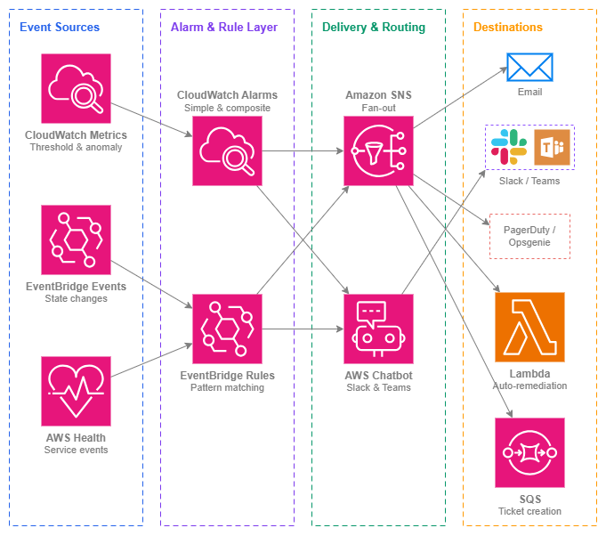

# 通知 {#notifications}

!!! info "前提条件"
    このセクションは、[AWS サービスのモニタリング](service-monitoring.md)と [AWS Organizations](../foundation/organizations.md) に精通していることを前提としています。AWS ネットワーキングのオブザーバビリティとマルチアカウントガバナンスが初めての方は、先にそれらのトピックをご確認ください。

どれほど優れたモニタリングも、アラートを誰も確認しなければ意味がありません。通知は、問題の検出と適切な担当者による対応の間にあるギャップを埋める役割を果たします。ネットワーキングの領域では特にその重要性が高く、VPN トンネルのダウン、Direct Connect の BGP セッションのフラップ、Network Firewall によるトラフィックのドロップは、そのパスに依存するすべてのワークロードに影響を与えます。5 分間の一時的な障害が 2 時間のアウテージに発展するかどうかは、ほぼ常に「通知が対応可能な担当者に届くまでの速さ」によって決まります。

このページでは、通知パイプラインをエンドツーエンドで解説します。問題を示すメトリクスやイベントから始まり、その重要性を判断するアラームやルール、そして適切なタイミングで適切なチームに届けるデリバリーメカニズムまでを網羅します。基本原則は**シグナル対ノイズ比の最適化**です。モニタリングにおける最大の運用上の失敗は、誤検知や優先度の低いノイズが多すぎてチームがアラートを無視するようになる「アラート疲れ」です。

マルチアカウントの AWS 環境における通知には、意図的なアーキテクチャ設計が必要です。イベントはワークロードアカウントで発生しますが、ネットワーキングチームは通常、集中管理されたモニタリングアカウントから運用します。クロスアカウントのイベント転送、集中型アラームの集約、および Organization 全体のヘルスイベントの可視化は、オプション機能ではなく、本番ネットワークにおけるベースラインです。

/// caption
通知パイプライン — [Drawio ソース](../assets/observability/notification-pipeline.drawio)
///

## 主要機能 {#key-capabilities}

*   :material-bell-alert: **CloudWatch アラーム**

    ---

    静的しきい値、異常検出バンド、数式を使用したメトリクスベースのアラート。コンポジットアラームは複数のアラーム状態を単一の実行可能なシグナルに集約し、一時的な単一メトリクスのスパイクによるノイズを低減します。

*   :material-lightning-bolt: **Amazon EventBridge**

    ---

    状態変化に対するイベント駆動型通知: VPN トンネルのアップ/ダウン、Direct Connect 接続状態、Network Firewall アラート、BGP セッションのフラップ。パターンマッチングルールにより、ポーリング不要でイベントを任意のターゲットにルーティングします。

*   :material-email-fast: **Amazon SNS**

    ---

    メール、SMS、HTTPS エンドポイント(PagerDuty、Opsgenie)、Lambda 関数、SQS キューへのファンアウト配信。SNS はアラームソースと通知先を結ぶ汎用的なグルーです。

*   :material-heart-pulse: **AWS Health ダッシュボード & API**

    ---

    お客様のリソースに影響する AWS サービスイベントをプロアクティブに把握: Direct Connect のスケジュールメンテナンス、リージョンのパフォーマンス低下、VPN エンドポイントのローテーション計画など。組織全体の Health イベントは全メンバーアカウントにわたって集約されます。

*   :material-chat: **AWS Chatbot**

    ---

    CloudWatch アラームと EventBridge 通知を Slack チャンネルおよび Microsoft Teams に直接配信します。インタラクティブ機能により、チームはチャットインターフェースからアラームの確認、スヌーズ、ランブックの実行が可能です。

*   :material-set-merge: **コンポジットアラーム**

    ---

    複数のアラームを単一の親アラームに集約し、条件の組み合わせによって実際の問題が確認された場合にのみ発火します。複雑なネットワークトポロジにおけるアラート疲弊を解消するための主要なツールです。

## ベストプラクティス {#best-practices}

### アラーム設計 {#alarm-design}

#### すべてではなく、重要なことにアラームを設定する {#alarm-on-what-matters-not-on-everything}

アクションを必要とせずに発火するアラームは、チームがアラームを無視するよう訓練してしまいます。アラームを作成する前に、「これが午前 3 時に発火したら、誰が何をするか？」という問いに答えてください。答えが「明日確認する」であれば、それは P1 アラームではなく、ダッシュボードのメトリクスや日次レポートの項目です。

ネットワーキングにおいて重要なアラームは、トラフィックが影響を受けているか、受けようとしていることを示すものです。具体的には、トンネルのダウン、BGP セッションの喪失、NAT ゲートウェイの ErrorPortAllocation の急増、Network Firewall による正当なトラフィックのドロップ、Transit Gateway によるパケットのブラックホール化などが該当します。「VPN トンネルの受信バイト数」のようなメトリクスはダッシュボードには有用ですが、ゼロに低下しない限りアラームを設定する価値はほとんどありません(ゼロになった場合、状態が「UP」を示していてもトンネルは実質的に停止しています)。

***重要な洞察:*** *チームが日常的にアラームを無視しているなら、それはモニタリングの問題ではなく、アラーム設計の問題です。すべてのアラームには明確なオーナーと定義された対応アクションが必要です。*

#### 明確なしきい値がないメトリクスには異常検出を使用する {#use-anomaly-detection-for-metrics-without-obvious-thresholds}

一部のネットワーキングメトリクスには、自然な静的しきい値がありません。Transit Gateway で処理されるバイト数の「正常値」は、時刻、曜日、ビジネスの季節性によって異なります。CloudWatch の異常検出は期待される動作のモデルを構築し、メトリクスが設定可能なバンド幅を超えて逸脱した場合にアラームを発します。これは、DDoS トラフィックパターンの検出、ルーティング変更後の予期しないトラフィックシフト、または静的しきい値では検知できない緩やかな劣化の検出に特に有効です。

#### 明確なルーティングを持つ重大度ティアを実装する {#implement-severity-tiers-with-distinct-routing}

すべての問題がページングに値するわけではありません。明確な重大度ティアを定義し、各ティアを異なる方法でルーティングします。

| 重大度 | 基準 | ルーティング | 対応時間 |
| --- | --- | --- | --- |
| **P1 — 重大** | トラフィックがドロップしている、接続が失われている、フェイルオーバーが発生していない | PagerDuty/Opsgenie ページ、Slack ウォールームチャンネル | 即時(5 分以内) |
| **P2 — 高** | 冗長性が低下している、残りパスが 1 つ、容量が上限に近づいている | Slack 通知、オンコールへのメール | 営業時間内(4 時間以内) |
| **P3 — 情報** | 計画メンテナンス、軽微なメトリクス逸脱、フェイルオーバー成功 | Slack チャンネル、日次ダイジェストメール | 翌営業日 |

各 CloudWatch アラームと EventBridge ルールを正確に 1 つの重大度ティアにマッピングします。ティアを決定できない場合、そのアラームはおそらく 2 つに分割する必要があります。1 つは重大な条件用、もう 1 つは情報提供用の条件用です。

### コンポジットアラーム {#composite-alarms}

#### コンポジットアラームを使用して、ページングの前に実際の問題を確認する {#use-composite-alarms-to-confirm-real-problems-before-paging}

単一のメトリクスがしきい値を超えることは、多くの場合問題ではありません。AWS 側のメンテナンス中に VPN トンネルが一時的にフラッピングすることは想定内です。しかし、同じ接続の*両方の*トンネルが同時にダウンしている場合、それは実際の障害です。コンポジットアラームを使用すると、「アラーム A とアラーム B の両方が ALARM 状態にある場合のみアラームを発する」というロジックを表現できます。

コンポジットアラームが有効なネットワーキングパターン:

* 同じ接続の**両方の VPN トンネルがダウン**(片方のトンネルダウンは P2、両方ダウンは P1)
* **NAT ゲートウェイエラーとパケットドロップの増加**(エラー単独では一時的な場合があるが、ドロップとの組み合わせで影響を確認)
* **BGP セッションダウンとバックアップパスのトラフィックなし**(BGP ダウン単独では、トラフィックがバックアップに正常に切り替わった可能性がある)
* **複数の Transit Gateway アタッチメントが異常**(1 つのアタッチメントのフラッピングは局所的だが、複数は広範な問題を示唆)

#### コンポジットアラームを使用する場合は子アラームのアクションを抑制する {#suppress-child-alarm-actions-when-using-composite-alarms}

コンポジットアラームを作成する際は、子アラームの通知アクションに `ActionsEnabled: false` を設定します。通知のトリガーはコンポジットアラームのみに任せます。これにより、重複したアラート(各子アラームからのものとコンポジットからのもの)を防ぎ、チームが手動で関連付けなければならない 3 つの個別アラートではなく、組み合わせた条件を説明する単一のコンテキスト付き通知を受け取れるようになります。

### 状態変化のための EventBridge {#eventbridge-for-state-changes}

#### インフラストラクチャの状態変化通知には EventBridge ルールを使用する {#use-eventbridge-rules-for-infrastructure-state-change-notifications}

CloudWatch アラームはメトリクスベースです。EventBridge は*イベント*、つまりメトリクスのしきい値にきれいにマッピングされない個別の状態変化を処理します。ネットワーキングにおいて最も重要な EventBridge パターンは次のとおりです。

* **VPN トンネル状態変化**: `source: aws.vpn`、`detail-type: "VPN Tunnel Status Change"`
* **Direct Connect 接続状態変化**: `source: aws.directconnect`、`detail-type: "Direct Connect Connection State Change"`
* **Direct Connect 仮想インターフェース状態変化**: BGP セッションのアップ/ダウンイベント
* **Network Firewall アラート**: EventBridge に転送されたステートフルルールマッチイベント
* **Transit Gateway アタッチメント状態変化**: アタッチメントの available/failing/deleting
* **AWS Health イベント**: スケジュールされたメンテナンス、リソースに影響するサービス問題

EventBridge ルールはイベントパターンにマッチし、ターゲット(SNS、Lambda、SQS、Step Functions)にルーティングします。これは「メトリクスがしきい値を超えた」ではなく、「何かが状態を変化させた」という通知に適したメカニズムです。

#### イベントをクロスアカウントで集中モニタリングアカウントに転送する {#forward-events-cross-account-to-a-centralized-monitoring-account}

マルチアカウント環境では、ネットワーキングイベントはリソースを所有するアカウント(Transit Gateway と Direct Connect の集中ネットワーキングアカウント、VPC レベルのイベントはワークロードアカウント)で発生します。[EventBridge クロスアカウントイベント転送](https://docs.aws.amazon.com/eventbridge/latest/userguide/eb-cross-account.html)を設定して、通知ルール、SNS トピック、Chatbot 設定が存在する集中モニタリングアカウントにネットワーキングイベントを送信します。

このパターンにより、すべてのアカウントで通知インフラストラクチャを重複させることを避け、ネットワーキングチームが Organization 全体のすべてのネットワークイベントを単一のビューで確認できるようになります。各アカウントのデフォルトイベントバスで Organization レベルの EventBridge ルールを使用して、ネットワーキングパターンにマッチするイベントをモニタリングアカウントのイベントバスに転送します。

***重要な洞察:*** *イベント生成ではなく、通知ロジックを集中化します。イベントはリソースが存在する場所で発生すべきですが、ルーティングの決定と配信設定は 1 か所に集約します。*

### AWS Health イベント {#aws-health-events}

#### プロアクティブな認識のために Organization 全体の Health イベントをサブスクライブする {#subscribe-to-organization-wide-health-events-for-proactive-awareness}

AWS Health イベントは、スケジュールされたメンテナンス(Direct Connect 回線のメンテナンスウィンドウ、VPN エンドポイントのローテーション)、サービス問題(リージョンでのネットワーキング低下)、アカウント固有の通知について通知します。[AWS Organizations Health](https://docs.aws.amazon.com/health/latest/ug/aggregate-events.html) を使用すると、管理アカウントまたは委任管理者からすべてのメンバーアカウントのイベントを確認できます。

ネットワーキングサービス(`directconnect`、`vpn`、`ec2`、`networkfirewall`、`transitgateway`)の Health イベントにマッチする EventBridge ルールを作成し、ネットワーキングチームの Slack チャンネルにルーティングします。スケジュールされた Direct Connect メンテナンスウィンドウを 14 日前に把握することで、メンテナンスが発生する*前に*フェイルオーバーパスを検証でき、午前 2 時にバックアップパスが機能しないことを発見するような事態を避けられます。

### 通知ルーティング {#notification-routing}

#### アラームを全員ではなく、対応を担当するチームにルーティングする {#route-alarms-to-the-team-that-owns-the-response-not-to-everyone}

よくあるアンチパターンは、すべてのネットワークアラームをすべてのエンジニアに送信する単一の SNS トピックです。これはアラート疲れを確実に引き起こします。代わりに、チームごと、重大度ごとに個別の SNS トピックを作成します。

* `networking-p1-critical` → ネットワーキングチームの PagerDuty ローテーション
* `networking-p2-high` → Slack の #network-ops チャンネル
* `networking-p3-info` → Slack の #network-notifications チャンネル(デフォルトでミュート)
* `workload-team-a-network` → チーム A 自身の VPC リソースのアラーム用チャンネル

アプリケーションチームは、対応できない共有インフラストラクチャではなく、*自分たちの*ワークロードのネットワーク健全性(自分たちの VPC エンドポイント、ロードバランサーの健全性)に関する通知を受け取るべきです。ネットワーキングチームは共有インフラストラクチャ(Transit Gateway、Direct Connect、Network Firewall)に関する通知を受け取ります。

### 自動修復 {#automated-remediation}

#### 既知の障害モードへの自動対応には EventBridge → Lambda を使用する {#use-eventbridge-lambda-for-automated-response-to-known-failure-modes}

一部のネットワークイベントには、明確に定義された安全な自動対応があります。

* **VPN トンネルダウン** → Lambda が CloudFormation スタックの更新をトリガーして事前共有キーをローテーションし、トンネルを再確立する
* **NAT ゲートウェイの ErrorPortAllocation** → Lambda が追加の NAT ゲートウェイをプロビジョニングし、ルートテーブルを更新する
* **Direct Connect 接続ダウン** → Lambda がバックアップ VPN パスがアクティブであることを確認し、そうでない場合はチケットを作成する
* **Network Firewall ルールグループの更新失敗** → Lambda が以前のルールグループバージョンにロールバックする

自動修復は人間の対応の代替ではなく、時間を稼ぐファーストレスポンダーです。Lambda は修復アクションを実行する*に加えて*、常にチケットを作成するか通知を送信し、チームが何が起きたかを把握して修正を確認できるようにする必要があります。

***重要な洞察:*** *3 回以上経験したイベントへの対応を自動化します。同じ障害モードを 3 回手動で修復したなら、4 回目は自動化すべきです。*

### コストの認識 {#cost-awareness}

#### 大規模な Organization での通知コストを把握する {#understand-notification-costs-at-scale}

個々の通知コストは無視できる程度ですが、大規模な Organization では積み重なります。

| コンポーネント | コスト | スケールに関する考慮事項 |
| --- | --- | --- |
| CloudWatch アラーム | アラームごと/月(標準)またはアラームごと/月(異常検出) — [CloudWatch 料金](https://aws.amazon.com/cloudwatch/pricing/)を参照 | コストはアカウント全体のアラーム数に比例して増加 |
| EventBridge ルール | マッチした 100 万イベントごと | ネットワーキングイベントでは通常無視できる程度 |
| SNS 通知 | 100 万メール配信ごと、SMS は 100 件ごと | メールは実質無料、SMS は大規模なオンコールローテーションでは積み重なる |
| AWS Chatbot | 追加料金なし | Slack/Teams への配信は無料 |

実際のコストリスクは通知サービス自体ではなく、誰も確認しない何百ものアラームを作成することです。未使用のアラームはコストがかかり、さらに悪いことに、重要なアラームからのシグナルを希薄化します。アラームを四半期ごとに監査してください。アラームが 6 か月間発火していない場合、しきい値が間違っているか、そのアラームが不要である可能性があります。

## 通知と他のサービスの組み合わせ {#combining-notifications-with-other-services}

| 組み合わせ | 通知が提供するもの | 他のサービスが提供するもの |
| --- | --- | --- |
| **CloudWatch Alarms + CloudWatch Metrics** | しきい値の評価、状態管理、通知のトリガー | ネットワーキングサービス (VPN、Direct Connect、NAT ゲートウェイ、Transit Gateway) からの基盤となるメトリクスデータ |
| **EventBridge + AWS Health** | 通知ターゲットへのルールマッチングとルーティング | プロアクティブなサービスイベント情報 (メンテナンス、障害、アドバイザリ) |
| **SNS + PagerDuty/Opsgenie** | HTTPS エンドポイントへのファンアウト配信 | オンコールローテーション、エスカレーションポリシー、インシデント管理ワークフロー |
| **AWS Chatbot + Slack/Teams** | インタラクティブなアクションを伴うフォーマット済みアラームの配信 | チームコミュニケーション、確認応答、チャットからのランブック実行 |
| **EventBridge + Lambda** | コンピューティングターゲットへのイベントルーティング | 自動修復ロジック (フェイルオーバー、スケーリング、チケット作成) |
| **CloudWatch + AWS Organizations** | 集中監視アカウントへのクロスアカウントアラーム集約 | アカウント構造、委任管理、組織全体の Health イベント |
| **Composite Alarms + Simple Alarms** | アラーム状態に対するブール論理によるノイズ削減 | リソースごと、または条件ごとの個別メトリクス評価 |

## ドキュメント {#documentation}

*   :material-file-document: **Amazon CloudWatch Alarms**

    ---

    メトリクスアラーム、異常検出アラーム、複合アラームの作成、およびアラームアクションの設定に関する完全なドキュメント。

    [:octicons-arrow-right-24: ドキュメント](https://docs.aws.amazon.com/AmazonCloudWatch/latest/monitoring/AlarmThatSendsEmail.html)

*   :material-file-document: **Amazon EventBridge ユーザーガイド**

    ---

    イベントパターン、ルール、ターゲット、クロスアカウントイベント配信、および AWS サービスとの統合。

    [:octicons-arrow-right-24: ドキュメント](https://docs.aws.amazon.com/eventbridge/latest/userguide/eb-what-is.html)

*   :material-file-document: **Amazon SNS 開発者ガイド**

    ---

    トピックの作成、サブスクリプション管理、メッセージフィルタリング、および Email・SMS・HTTPS・Lambda・SQS へのメッセージ配信。

    [:octicons-arrow-right-24: ドキュメント](https://docs.aws.amazon.com/sns/latest/dg/welcome.html)

*   :material-file-document: **AWS Health ユーザーガイド**

    ---

    組織全体のヘルスイベント、EventBridge との統合、および Health API を使用したプログラムによるアクセス。

    [:octicons-arrow-right-24: ドキュメント](https://docs.aws.amazon.com/health/latest/ug/what-is-aws-health.html)

*   :material-chat: **AWS Chatbot 管理者ガイド**

    ---

    Slack および Microsoft Teams との統合設定、チャンネル権限、およびインタラクティブなアラーム管理。

    [:octicons-arrow-right-24: ドキュメント](https://docs.aws.amazon.com/chatbot/latest/adminguide/what-is.html)

*   :material-currency-usd: **CloudWatch の料金**

    ---

    アラームの料金体系（標準、高解像度、異常検出、複合）、メトリクスのコスト、および無料利用枠の詳細。

    [:octicons-arrow-right-24: 料金](https://aws.amazon.com/cloudwatch/pricing/)

## 関連する可観測性ページ {#related-observability-pages}

* **[AWS サービスのモニタリング](service-monitoring.md)** — このページで取り上げる通知パイプラインに入力されるメトリクスとヘルスチェック
* **[内部トラフィックのモニタリング](internal-traffic.md)** — 異常ベースのネットワークアラームに使用する生データを提供する VPC Flow Logs とトラフィックミラーリング
* **[外部トラフィックのモニタリング](external-traffic.md)** — DDoS および不正利用の通知を駆動するインターネット向けトラフィックの可視性

**基盤との関係:**

* **[AWS Organizations](../foundation/organizations.md)** — 組織構造により、クロスアカウントのイベント転送トポロジーと集中モニタリングアカウントの配置が決まります

**接続性との関係:**

* **[ハイブリッド & マルチクラウド](../connectivity/hybrid-multicloud.md)** — Direct Connect および VPN の状態変化イベントは、設定すべき最も重要なネットワーキング通知です
* **[AWS 内の接続性](../connectivity/within-aws.md)** — Transit Gateway および Cloud WAN のアタッチメントの健全性が、複合アラームの設計を左右します
