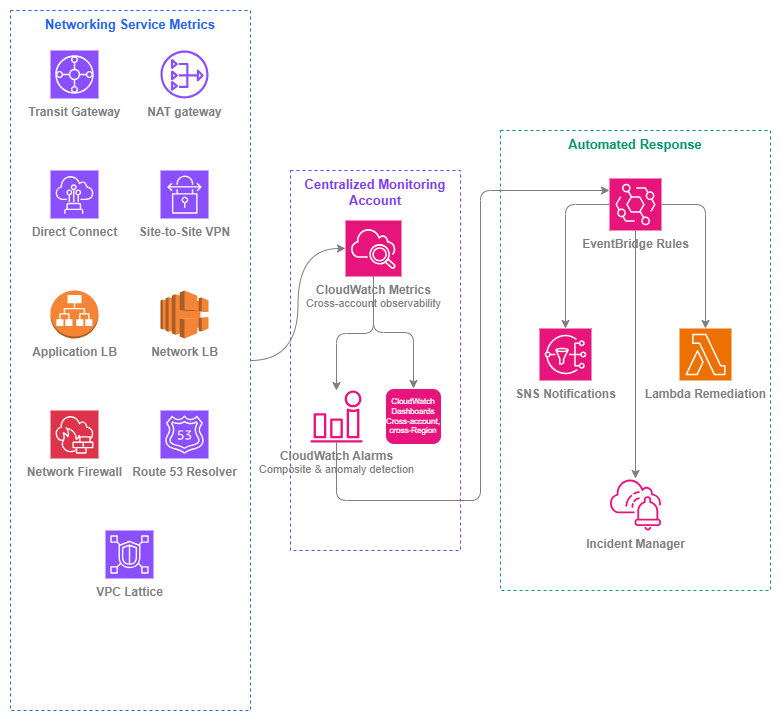

# AWS サービスのモニタリング {#aws-services-monitoring}

!!! info "前提条件"
    このセクションは、[AWS 内の接続性](../connectivity/within-aws.md)、[ロードバランシング](../application-networking/load-balancing.md)、および [ハイブリッド & マルチクラウド](../connectivity/hybrid-multicloud.md) に精通していることを前提としています。AWS ネットワーキングの基礎を初めて学ぶ方は、先にそれらのトピックを確認してください。

ネットワークトラフィックのモニタリング（[内部トラフィック](internal-traffic.md)および[外部トラフィック](external-traffic.md)で解説）は、ネットワーク上を流れるものを把握するためのものです。一方、ネットワーキング*サービス自体*のモニタリングは、そのトラフィックを運ぶインフラストラクチャが正常かどうかを確認するためのものです。ブラックホールドロップが発生している Transit Gateway、ポート割り当てを使い果たしている NAT ゲートウェイ、状態が不安定に切り替わる Direct Connect 接続——これらはサービスレベルの障害であり、トラフィックのモニタリングだけではユーザーへの影響が出るまで検知できません。

このページでは、AWS ネットワーキングサービスの運用上の健全性に焦点を当てます。具体的には、重要な CloudWatch メトリクス、初日から設定すべきアラーム、そしてモニタリングシグナルを修復アクションに変換する自動化パターンについて説明します。目標は、ネットワーキングプレーンの劣化を障害になる前に検知し、可能な限り自動的に対応することです。

マルチアカウントの AWS 環境におけるサービスモニタリングには、意図的なアーキテクチャが必要です。メトリクスはリソースを所有するアカウントに存在しますが、ネットワーキングチームはすべてのアカウントとリージョンにわたる統合ビューを必要とします。ここで紹介するパターンは、クロスアカウントの CloudWatch ダッシュボードとネットワーキングイベント用の共有 EventBridge バスを備えた、集中型モニタリングアカウントを前提としています。

/// caption
サービスモニタリングスタック — [Drawio ソース](../assets/observability/service-monitoring-stack.drawio)
///

## サービス別の重要メトリクス {#critical-metrics-by-service}

すべての CloudWatch メトリクスにアラームを設定する必要はありません。以下の表は、実際の運用上の問題を示すメトリクスを示しています。最初の本番ワークロードがサービスを経由する前に、初日からアラームを設定すべきメトリクスです。

### Transit Gateway {#transit-gateway}

| メトリクス | 重要な理由 | アラーム条件 |
| --- | --- | --- |
| `PacketDropCountBlackhole` | どこにも到達しないルートへトラフィックが送信されています。ルートテーブルエントリの欠落または設定ミスを示します。 | 2 回連続して > 0 |
| `PacketDropCountNoRoute` | 宛先に一致するルートが存在しません。ルート伝播の欠落またはアタッチメントのデタッチが原因であることが多いです。 | 2 回連続して > 0 |
| `BytesIn` / `BytesOut` | ベースラインスループット。急激な低下は接続断を示し、持続的な増加はキャパシティプランニングの必要性を示します。 | 異常検出バンド (標準偏差 2) |
| `AttachmentCount` | リージョンごとのクォータ (デフォルト 5,000) に対するアタッチメントの増加を追跡します。 | クォータの 80% 超 |

### NAT ゲートウェイ {#nat-gateway}

| メトリクス | 重要な理由 | アラーム条件 |
| --- | --- | --- |
| `ErrorPortAllocation` | NAT ゲートウェイが単一の宛先への 55,000 同時接続を使い果たしています。ワークロードは新しい接続を確立できなくなります。 | 1 期間で > 0 |
| `PacketsDropCount` | NAT ゲートウェイの処理制限によりパケットがドロップされています。ゲートウェイが過負荷状態であることを示します。 | 3 期間にわたって継続的に > 0 |
| `ActiveConnectionCount` | 接続テーブルの使用率を追跡します。キャパシティプランニングおよび接続リークの検出に役立ちます。 | 異常検出、または期待ベースラインの 80% 超 |
| `BytesOutToDestination` | データ処理量はコストと直接相関します。予期しないスパイクは、ルーティングの設定ミスまたはデータ漏洩を示します。 | 異常検出バンド |
| `ConnectionEstablishedCount` | 新規接続のレート。急激なスパイクはスキャンや設定ミスのリトライロジックを示す可能性があります。 | 異常検出バンド |

***重要なポイント:*** *`ErrorPortAllocation` は NAT ゲートウェイで最も重要な単一メトリクスです。このアラームが発火した時点で、すでに接続が失敗しています。直ちにアラームを設定し、複数の NAT ゲートウェイの使用または宛先の分散を検討してください。*

### Direct Connect {#direct-connect}

| メトリクス | 重要な理由 | アラーム条件 |
| --- | --- | --- |
| `ConnectionState` | バイナリ値: 物理接続が稼働中かダウン中かを示します。状態変化は光ファイバーの切断、ルーター障害、またはメンテナンスイベントを示します。 | 1 期間で状態 != 1 (稼働中) |
| `VirtualInterfaceBpsEgress` / `VirtualInterfaceBpsIngress` | VIF ごとのスループット。ポートキャパシティに近づいている場合は、キャパシティの追加またはトラフィックのシフトが必要です。 | 5 分間にわたってポート速度の 80% 超が継続 |
| `ConnectionBpsEgress` / `ConnectionBpsIngress` | 接続の集計スループット。 | 5 分間にわたってポート速度の 80% 超が継続 |
| `ConnectionLightLevelTx` / `ConnectionLightLevelRx` | 光信号強度。光レベルの低下は、障害が発生する前に物理的な問題を予測します。 | 光学タイプの許容 dBm 範囲外 |

### Site-to-Site VPN {#site-to-site-vpn}

| メトリクス | 重要な理由 | アラーム条件 |
| --- | --- | --- |
| `TunnelState` | バイナリ値: IPsec トンネルが稼働中かダウン中かを示します。各 VPN 接続には冗長性のために 2 つのトンネルがあります。 | いずれかのトンネル状態が 2 回連続して = 0 |
| `TunnelDataIn` / `TunnelDataOut` | トンネルごとのスループット。非対称なトラフィックは、ルーティングの問題、またはトンネル障害により残りのトンネルにトラフィックが集中していることを示す可能性があります。 | 異常検出; トラフィックが期待される場合にゼロトラフィックでアラート |

***重要なポイント:*** *両方のトンネルがダウンした場合だけでなく、単一のトンネルがダウンした場合にもアラームを設定してください。単一トンネルの障害は冗長性なしで稼働していることを意味し、次の障害が停止につながります。*

### Application Load Balancer {#application-load-balancer}

| メトリクス | 重要な理由 | アラーム条件 |
| --- | --- | --- |
| `HealthyHostCount` | ヘルスチェックに合格しているターゲットの数を追跡します。数が減少している場合はキャパシティが縮小しています。 | ターゲットグループごとの期待最小値未満 |
| `UnHealthyHostCount` | ヘルスチェックに失敗しているターゲット。ゼロ以外の値はアプリケーションまたはその依存関係に問題があることを示します。 | 2 期間にわたって継続的に > 0 |
| `HTTPCode_ELB_5XX_Count` | ALB 自体が生成したエラー (ターゲットではなく)。キャパシティ枯渇や正常なターゲットがないなど、ALB レベルの問題を示します。 | 3 期間にわたって継続的に > 0 |
| `TargetResponseTime` | ALB からターゲットへの P99 レイテンシ。ここでの低下はすべてのリクエストに影響します。 | 異常検出、または SLA しきい値超 |
| `RejectedConnectionCount` | ALB が最大接続数に達したために拒否された接続。サブネットのサイズ不足、または ALB スケーリングを超えるトラフィックスパイクを示します。 | 1 期間で > 0 |
| `RequestCount` | ベースライントラフィック量。異常検出および他のメトリクスとの相関に役立ちます。 | 異常検出バンド |

### Network Load Balancer {#network-load-balancer}

| メトリクス | 重要な理由 | アラーム条件 |
| --- | --- | --- |
| `HealthyHostCount` / `UnHealthyHostCount` | ALB と同様 — ターゲットの可用性を追跡します。 | ALB と同じしきい値 |
| `TCP_ELB_Reset_Count` | NLB が生成した TCP リセット (ターゲットではなく)。アイドルタイムアウトの不一致または接続追跡の問題を示します。 | 異常検出; 持続的な増加 |
| `ProcessedBytes` | 総スループット。コストおよびキャパシティ使用率と直接相関します。 | 異常検出バンド |
| `NewFlowCount` | 新規 TCP/UDP フローのレート。急激なスパイクは DDoS または設定ミスのクライアントを示す可能性があります。 | 異常検出バンド |
| `UnHealthyHostCount` (アベイラビリティゾーンごと) | AZ ごとのヘルス状態。クロスゾーン負荷分散がオフの場合 (NLB のデフォルト) に重要です。 | 単一のアベイラビリティゾーンで > 0 |

### AWS Network Firewall {#aws-network-firewall}

| メトリクス | 重要な理由 | アラーム条件 |
| --- | --- | --- |
| `DroppedPackets` | ファイアウォールルールによって明示的にドロップされたパケット。通常の運用では想定内ですが、急激なスパイクは攻撃またはルールの設定ミスによる正当なトラフィックのブロックを示します。 | 異常検出バンド |
| `PassedPackets` | 通過を許可されたパケット。突然ゼロに低下した場合は、トラフィックがファイアウォールに到達していない (ルーティングの問題) か、ファイアウォールがダウンしていることを意味します。 | 2 期間でベースライン未満 |
| `ReceivedPackets` | ファイアウォールに入る総パケット数。キャパシティプランニングのベースライン。 | 異常検出バンド |
| `Packets` (ルールグループごと) | ルールグループごとのヒット数。どのルールがアクティブか、および新しいルールが期待どおりにマッチしているかを識別します。 | 一致が期待されるルールのゼロヒットを監視 |

### Route 53 Resolver {#route-53-resolver}

| メトリクス | 重要な理由 | アラーム条件 |
| --- | --- | --- |
| `InboundQueryVolume` | オンプレミスまたはピアリングされたネットワークから到着する DNS クエリ。スパイクは DNS 増幅攻撃または設定ミスのリゾルバーを示す可能性があります。 | 異常検出バンド |
| `OutboundQueryVolume` | オンプレミスまたは外部リゾルバーに転送される DNS クエリ。低下は転送ルールの問題を示します。 | 3 期間でベースライン未満 |
| `FirewallRuleGroupQueryVolume` | DNS Firewall ルールによって評価されたクエリ。DNS レイヤーのセキュリティ適用を追跡します。 | 期待されるベースラインを監視 |

### VPC Lattice {#vpc-lattice}

| メトリクス | 重要な理由 | アラーム条件 |
| --- | --- | --- |
| `RequestCount` | サービスネットワークを通じた総リクエスト数。キャパシティおよびコスト追跡のベースライン。 | 異常検出バンド |
| `HTTPCode_Target_4XX_Count` | ターゲットでのクライアントエラー。件数の増加は API コントラクトの問題または認証失敗を示します。 | 異常検出バンド |
| `HTTPCode_Target_5XX_Count` | ターゲットでのサーバーエラー。バックエンドのヘルス問題の直接的な指標。 | 2 期間でしきい値超 |
| `TargetResponseTime` | VPC Lattice からターゲットへのレイテンシ。低下はサービスネットワーク上のすべてのコンシューマーに影響します。 | SLA しきい値超または異常検出 |

## ベストプラクティス {#best-practices}

### アラーム設計 {#alarm-design}

#### しきい値だけでなく、状態変化に対してアラームを設定する {#alarm-on-state-changes-not-just-thresholds}

多くのネットワーキングサービスには、バイナリ状態のメトリクス(トンネルの up/down、接続の active/inactive、BGP セッションの established/idle など)があります。これらには、しきい値ベースのアラームではなく、状態変化アラームが適しています。VPN トンネルが up から down に遷移した場合、トラフィック量に関わらず即座に対応が必要です。トラフィックメトリクスに障害が反映されるのを待つのではなく、状態値そのものでトリガーするアラームを設定してください(例: 1 評価期間で `TunnelState < 1`)。

Direct Connect では `ConnectionState` の遷移を監視します。VPN では、トンネルごとに個別の `TunnelState` を監視します。ALB/NLB では、エラー率が上昇するのを待つのではなく、`HealthyHostCount` が期待する最小値を下回った時点でアラームを設定します。

#### コンポジットアラームを使用してノイズを削減する {#use-composite-alarms-to-reduce-noise}

個々のメトリクスアラームはノイズを生み出します。Transit Gateway のルートテーブル更新中に `PacketDropCountNoRoute` が一時的にスパイクするのは想定内の動作です。しかし、同じパス上の NAT ゲートウェイで `ErrorPortAllocation` の増加を伴う持続的なスパイクが発生した場合は、実際の問題です。

[コンポジットアラーム](https://docs.aws.amazon.com/AmazonCloudWatch/latest/monitoring/Create_Composite_Alarm.html)は、AND/OR ロジックで複数のアラーム状態を組み合わせます。複数のシグナルが問題を確認した場合にのみ通知するよう設定してください。

* Transit Gateway: `PacketDropCountBlackhole > 0` AND `BytesOut` の異常(一時的なルーティング更新ではなく、トラフィックへの影響を確認)
* NAT ゲートウェイ: `ErrorPortAllocation > 0` AND `ActiveConnectionCount` がベースラインを超過(ポート枯渇が監視アーティファクトではなく、実際の負荷によるものであることを確認)
* ロードバランサー: `UnHealthyHostCount > 0` AND `HealthyHostCount < 最小値`(単一ターゲットのサイクリングではなく、実際のキャパシティ損失を確認)

***重要なポイント:*** *コンポジットアラームは、無視される監視システムと実際に対応される監視システムの違いを生み出します。対応不要なアラートが発火するたびに、チームはアラートを無視するよう訓練されてしまいます。*

#### 静的しきい値の代わりに異常検出を使用する {#use-anomaly-detection-instead-of-static-thresholds}

静的しきい値は、トラフィックパターンの変化に合わせて常にチューニングが必要です。CloudWatch の[異常検出](https://docs.aws.amazon.com/AmazonCloudWatch/latest/monitoring/CloudWatch_Anomaly_Detection.html)は、期待される動作のモデルを構築し、メトリクスが学習済みパターンから逸脱した場合にアラートを発します。これは特に以下の場合に効果的です。

* Transit Gateway および NAT ゲートウェイの `BytesIn`/`BytesOut`(トラフィックは日次/週次パターンに従う)
* ALB および VPC Lattice の `RequestCount`(アプリケーショントラフィックには予測可能なサイクルがある)
* NLB の `NewFlowCount`(接続レートはビジネスアクティビティと相関する)

異常検出は標準アラームと同じコストでありながら、トラフィックの増加、季節的なパターン、ベースラインのシフトに自動的に適応します。ほとんどのネットワーキングメトリクスには、バンド幅として標準偏差 2 を使用してください。実際の異常を検出するのに十分な精度を保ちつつ、通常の変動による誤検知を避けられます。

#### クォータに達する前に監視する {#monitor-quotas-before-you-hit-them}

すべてのネットワーキングサービスにはクォータがあります。クォータに静かに達してしまうと、新しい VPN 接続の作成不可、Transit Gateway アタッチメントの追加不可、NAT ゲートウェイの Elastic IP 追加不可といった障害が発生し、サービス問題のように見えますが、実際にはキャパシティ制限が原因です。

[AWS Service Quotas](https://docs.aws.amazon.com/servicequotas/latest/userguide/intro.html) と CloudWatch の統合を使用して、使用率 80% でアラームを設定してください。

| サービス | 監視するクォータ | デフォルト上限 |
| --- | --- | --- |
| Transit Gateway | TGW あたりのアタッチメント数 | 5,000 |
| Transit Gateway | ルートテーブルあたりのルート数 | 10,000 |
| NAT ゲートウェイ | アベイラビリティーゾーンあたりの NAT ゲートウェイ数 | 5 |
| VPN | VGW/TGW あたりの VPN 接続数 | 10 / 20 |
| Direct Connect | 接続あたりの仮想インターフェイス数 | 50 |
| ALB | ALB あたりのルール数 | 100 |
| NLB | ターゲットグループあたりのターゲット数 | 500 (IP) / 500 (インスタンス) |
| Network Firewall | ファイアウォールポリシーあたりのルールグループ数 | 20 |

### マルチアカウント監視アーキテクチャ {#multi-account-monitoring-architecture}

#### 集中監視アカウントをデプロイする {#deploy-a-centralized-monitoring-account}

マルチアカウント環境では、ネットワーキングリソースは共有サービスアカウント、ワークロードアカウント、接続アカウントに分散しています。ネットワーキングチームには、単一のガラス窓(シングルペインオブグラス)が必要です。

[CloudWatch クロスアカウントオブザーバビリティ](https://docs.aws.amazon.com/AmazonCloudWatch/latest/monitoring/CloudWatch-Unified-Cross-Account.html)を使用して、すべてのソースアカウントのメトリクス、ログ、トレースを参照できる監視アカウントを指定します。AWS Organizations レベルでこれを設定することで、新しいアカウントが自動的に登録されます。

監視アカウントには以下をホストします。

* すべてのネットワーキングサービスの健全性を表示するクロスアカウントダッシュボード
* 任意のソースアカウントのメトリクスを評価する集中アラーム
* すべてのアカウントからネットワーキングイベントを集約する EventBridge ルール

#### ネットワーキングチーム向けのクロスリージョンダッシュボードを構築する {#build-cross-region-dashboards-for-the-networking-team}

単一の CloudWatch ダッシュボードで複数のリージョンのメトリクスを表示できます。アカウントやリージョンではなく、サービスタイプ別に整理されたダッシュボードを構築してください。

* **Transit Gateway ダッシュボード**: すべてのリージョンにわたる全 TGW メトリクス(アタッチメントごとのドリルダウン付き)
* **ハイブリッド接続ダッシュボード**: すべての Direct Connect および VPN メトリクス(接続状態と使用率を表示)
* **ロードバランサーダッシュボード**: すべてのワークロードアカウントにわたる ALB および NLB の健全性
* **DNS ダッシュボード**: Route 53 Resolver のクエリ量と DNS Firewall のアクティビティ

各ダッシュボードはデフォルトで過去 3 時間を表示し、トレンド分析のために 1 週間までズームアウトできるようにします。

***重要なポイント:*** *ダッシュボードは AWS アカウントやリージョンではなく、ネットワーキングの関心事(接続性の健全性、キャパシティ、セキュリティ)で整理してください。ネットワーキングチームはアカウント境界ではなく、パスとサービスの観点で考えます。*

### IPv6 監視の考慮事項 {#ipv6-monitoring-considerations}

#### デュアルスタックのメトリクスを個別に監視する {#monitor-dual-stack-metrics-separately}

いくつかのネットワーキングサービスは、IPv4 と IPv6 のトラフィックパスで異なるメトリクスを報告します。デュアルスタックを運用する場合:

* **ALB/NLB**: `IPv6ProcessedBytes` と `IPv6RequestCount` を IPv4 の対応するメトリクスとは別に監視します。IPv4 トラフィックが支配的な場合、IPv6 パスの障害は集計メトリクスに現れません。
* **NAT ゲートウェイ**: NAT64 メトリクス(IPv6 から IPv4 への変換に対応する `BytesOutToDestination`)は、標準 NAT とは異なる障害モードを追跡します。両方のパスを監視してください。
* **VPC Lattice**: デュアルスタックのサービスネットワークは IPv4 と IPv6 の両方のトラフィックを運びます。IPv6 固有のルーティング問題を検出するために、プロトコルごとのエラー率を監視してください。

#### IPv6 固有のヘルスチェックを設定する {#configure-ipv6-specific-health-checks}

IPv6 ヘルスチェックをサポートするサービス(ALB、NLB)では、ターゲットがデュアルスタックの場合、両方のプロトコルでヘルスチェックを設定します。IPv4 ヘルスチェックが通過しても、IPv6 パスが正常であることは保証されません。アドレスファミリーごとに異なるセキュリティグループ、NACL、またはルーティングが適用される場合があります。

### コスト効率の高い監視 {#cost-effective-monitoring}

#### メトリクス数式を使用してアラーム数を削減する {#use-metric-math-to-reduce-alarm-count}

CloudWatch はアラームごとに月額料金が発生します。すべての NAT ゲートウェイや Transit Gateway アタッチメントに個別のアラームを作成する代わりに、[メトリクス数式](https://docs.aws.amazon.com/AmazonCloudWatch/latest/monitoring/using-metric-math.html)を使用して集計してください。

* リージョン内のすべての NAT ゲートウェイの `ErrorPortAllocation` を合計して単一のアラームにする
* すべてのターゲットグループにわたる総ターゲット数に対する `UnHealthyHostCount` の比率を計算する
* `PacketDropCountBlackhole + PacketDropCountNoRoute` を単一の「ルーティング障害」メトリクスとして計算する

これにより、カバレッジを維持しながらアラーム数(およびコスト)を削減できます。最も重要な個別リソース(プライマリ Direct Connect 接続、本番 ALB など)にのみ、リソースごとのアラームを作成してください。

#### コストモデルを理解する {#understand-the-cost-model}

| CloudWatch コンポーネント | 料金の考慮事項 |
| --- | --- |
| 標準メトリクス | 無料(サービスに含まれる) |
| カスタムメトリクス | メトリクスごと/月(段階的 — [CloudWatch 料金](https://aws.amazon.com/cloudwatch/pricing/)を参照) |
| アラーム(標準) | アラームごと/月 |
| アラーム(高解像度) | アラームごと/月(標準より高い) |
| 異常検出アラーム | アラームごと/月 |
| コンポジットアラーム | アラームごと/月(最高アラーム階層) |
| ダッシュボード | ダッシュボードごと/月(最初の 3 つは無料) |
| クロスアカウントオブザーバビリティ | メトリクスの追加料金なし |

数十のアラーム、複数のダッシュボード、異常検出アラームを持つ典型的なマルチアカウントのネットワーキング設定では、CloudWatch のコストはネットワーキングサービス自体と比較して無視できる程度です。ただし、カスタムメトリクスの過剰な計装による予期しない請求を避けるために、コストモデルを理解しておく価値はあります。

#### カスタムメトリクスよりも組み込みメトリクスを優先する {#prefer-built-in-metrics-over-custom-metrics}

すべてのネットワーキングサービスは、追加コストなしで CloudWatch にメトリクスを公開します。Lambda 関数や CloudWatch エージェントでカスタムメトリクスを構築する前に、組み込みメトリクスがすでにニーズを満たしていないか確認してください。カスタムメトリクスはメトリクスごとに月額料金が発生し、複数のアカウントにわたって数百のリソースを監視する場合、コストはすぐに積み上がります。

### 自動修復 {#automated-remediation}

#### 自動応答に EventBridge を使用する {#use-eventbridge-for-automated-response}

CloudWatch アラームは状態を遷移させます。[EventBridge](https://docs.aws.amazon.com/eventbridge/latest/userguide/eb-what-is.html) はそれらの遷移をキャプチャし、自動アクションにルーティングします。一般的なネットワーキング修復パターンを以下に示します。

| トリガー | 自動アクション |
| --- | --- |
| VPN `TunnelState` → 両方のトンネルで 0 | バックアップ VPN または Direct Connect パスへのフェイルオーバーをトリガー |
| NAT ゲートウェイ `ErrorPortAllocation` > 0 | 追加の NAT ゲートウェイをプロビジョニングしてルートテーブルを更新することでスケールアウト |
| ALB `HealthyHostCount` < 最小値 | Auto Scaling のステップスケーリングをトリガー、またはオンコールに通知 |
| Direct Connect `ConnectionState` → down | Route 53 ヘルスチェックを更新して VPN バックアップにフェイルオーバー |
| Transit Gateway `PacketDropCountBlackhole` > 0 | 診断 Lambda を実行して影響を受けるルートを特定し通知 |
| Network Firewall `DroppedPackets` のスパイク | パケットサンプルをキャプチャしてインシデントチケットを作成 |

#### ネットワーキングサービスのヘルスチェックを設計する {#design-health-checks-for-networking-services}

CloudWatch メトリクスに加えて、アクティブなヘルスチェックによりエンドツーエンドのパス可用性を検証します。ネットワーキングレイヤーを検査する合成チェックを設計してください。

* **VPN パス検証**: VPC 内の Lambda が 60 秒ごとに VPN トンネルを通じてオンプレミスエンドポイントに ICMP または TCP プローブを送信します。障害は `TunnelState` メトリクスとは独立してアラームをトリガーします(`TunnelState` は IKE/IPsec の状態のみを反映し、実際のデータプレーン転送は反映しません)。
* **NAT ゲートウェイ検証**: プライベートサブネット内の Lambda が外部エンドポイントに HTTPS リクエストを送信します。障害は NAT ゲートウェイまたはインターネットゲートウェイの問題を示します。
* **Transit Gateway パス検証**: スポーク VPC A 内の Lambda が Transit Gateway を通じてスポーク VPC B の既知のエンドポイントにリクエストを送信します。アタッチメントの状態だけでなく、ルーティングを検証します。
* **Direct Connect パス検証**: オンプレミスのプローブが既知の VPC エンドポイントにトラフィックを送信します。物理的な接続状態だけでなく、BGP ルーティングを含むフルパスを検証します。

***重要なポイント:*** *CloudWatch メトリクスはサービスが健全であることを示します。合成ヘルスチェックはパスがエンドツーエンドで機能していることを示します。両方が必要です。ルーティングが壊れた健全なサービスは、依然として障害を意味します。*

## サービスモニタリングと他のサービスの組み合わせ {#combining-service-monitoring-with-other-services}

| 組み合わせ | サービスモニタリングが提供するもの | 他のサービスが提供するもの |
| --- | --- | --- |
| **サービスモニタリング + VPC Flow Logs** | ネットワークサービスのヘルス状態（稼働/停止、エラー率、キャパシティ） | 実際のトラフィックパターン、送信元/送信先のペア、許可/拒否されたフロー |
| **サービスモニタリング + AWS CloudTrail** | ランタイムの運用メトリクス | API レベルの監査証跡（誰がいつどの設定を変更したか） |
| **サービスモニタリング + AWS Network Manager** | サービスごとのメトリクスアラームとダッシュボード | グローバルネットワーク全体のトポロジー可視化とルート分析 |
| **サービスモニタリング + AWS Health Dashboard** | リソース固有のメトリクスとアラーム | AWS 側のサービスイベント、メンテナンス通知、およびリージョン障害情報 |
| **サービスモニタリング + Amazon DevOps Guru** | 明示的に定義したアラームしきい値と異常バンド | 明示的に計測していない関連リソース全体にわたる ML 駆動の異常検知 |
| **サービスモニタリング + AWS Trusted Advisor** | リアルタイムの運用ヘルス | クォータ使用率、セキュリティ、コスト最適化に関する定期チェック |
| **サービスモニタリング + Notifications** | メトリクス収集とアラーム評価 | アラートルーティング、エスカレーション、オンコール連携（[Notifications](notifications.md) を参照） |

## ドキュメント {#documentation}

*   :material-file-document: **CloudWatch クロスアカウントオブザーバビリティ**

    ---

    AWS Organization 全体のメトリクス、ログ、トレースを一元的に確認できる集中監視アカウントをセットアップします。

    [:octicons-arrow-right-24: ドキュメント](https://docs.aws.amazon.com/AmazonCloudWatch/latest/monitoring/CloudWatch-Unified-Cross-Account.html)

*   :material-file-document: **CloudWatch 異常検出**

    ---

    手動でしきい値を調整することなく、変化するトラフィックパターンに自動適応する ML ベースの異常検出アラームを設定します。

    [:octicons-arrow-right-24: ドキュメント](https://docs.aws.amazon.com/AmazonCloudWatch/latest/monitoring/CloudWatch_Anomaly_Detection.html)

*   :material-file-document: **CloudWatch 複合アラーム**

    ---

    複数のアラーム状態を 1 つの複合アラームに統合し、ノイズを低減して確実な問題のみを通知します。

    [:octicons-arrow-right-24: ドキュメント](https://docs.aws.amazon.com/AmazonCloudWatch/latest/monitoring/Create_Composite_Alarm.html)

*   :material-file-document: **CloudWatch アラーム向け EventBridge ルール**

    ---

    EventBridge ルールを通じて、アラーム状態の変化を自動修復アクションにルーティングします。

    [:octicons-arrow-right-24: ドキュメント](https://docs.aws.amazon.com/eventbridge/latest/userguide/eb-service-event.html)

*   :material-currency-usd: **CloudWatch 料金**

    ---

    メトリクス、アラーム、ダッシュボード、クロスアカウントオブザーバビリティのコストモデルを確認します。

    [:octicons-arrow-right-24: 料金](https://aws.amazon.com/cloudwatch/pricing/)

*   :material-file-document: **AWS Service Quotas**

    ---

    CloudWatch との統合によりサービスクォータの使用状況を監視し、上限に達する前に引き上げをリクエストします。

    [:octicons-arrow-right-24: ドキュメント](https://docs.aws.amazon.com/servicequotas/latest/userguide/intro.html)

## 関連するオブザーバビリティページ {#related-observability-pages}

* **[内部トラフィックモニタリング](internal-traffic.md)** — VPC フローログとトラフィックミラーリングを取り上げ、ネットワーク内を流れるトラフィックを把握する方法を解説します。本ページのサービスヘルスビューを補完する内容です。
* **[外部トラフィックモニタリング](external-traffic.md)** — AWS とインターネット間のトラフィック監視を取り上げます。CloudFront およびエッジサービスのメトリクスも含みます。
* **[通知](notifications.md)** — アラートのルーティング、エスカレーションポリシー、インシデント管理ツールとの統合を取り上げます。サービスモニタリングがシグナルを生成し、通知が適切な担当者へ届けます。

**他のセクションとの関係:**

* **[AWS 内の接続性](../connectivity/within-aws.md)**: 本ページが監視対象とする Transit Gateway、Cloud WAN、VPC Peering の各サービスを取り上げます。
* **[ハイブリッド & マルチクラウド](../connectivity/hybrid-multicloud.md)**: Direct Connect および Site-to-Site VPN のアーキテクチャを取り上げます。本ページではそれらの運用監視を扱います。
* **[ロードバランシング](../application-networking/load-balancing.md)**: ALB、NLB、GWLB のアーキテクチャとベストプラクティスを取り上げます。本ページではそれらのヘルスメトリクスとアラームを扱います。
