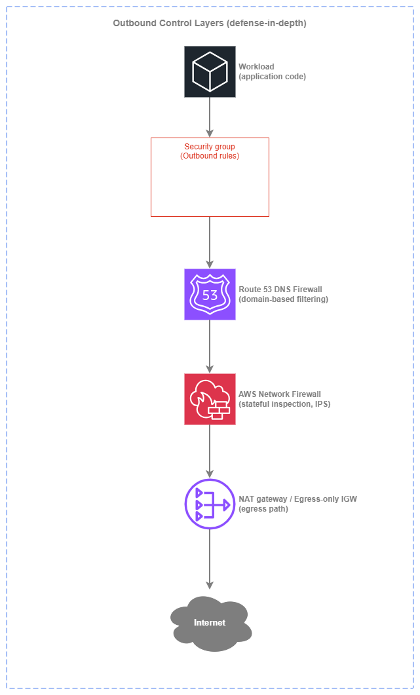

# アウトバウンドコントロール {#outbound-controls}

!!! info "前提条件"
    このセクションでは、[Amazon VPC](../foundation/vpc.md)、[サブネット](../foundation/subnets.md)、[インターネット接続](../connectivity/internet.md)、および[境界コントロール](perimeter-inbound.md)に関する知識を前提としています。AWS ネットワーキングの基礎を初めて学ぶ方は、先にそれらのトピックをご確認ください。

アウトバウンドコントロールは、ワークロードがインターネット上のどこにアクセスできるか、およびトラフィックが環境外に出る前にどのようにフィルタリングされるかを決定します。[インターネット接続](../connectivity/internet.md)のページでは、エグレスが発生する*場所*（集中型か分散型か、IPv4 か IPv6 か）というアーキテクチャ上の選択を扱っています。このページでは、セキュリティの観点から「*何*を許可するか」「*どのように*それを強制するか」「なぜエグレスに対する多層防御がイングレスと同様に重要なのか」に焦点を当てます。

基本原則はシンプルです。**アウトバウンドはデフォルト拒否、例外のみ許可**です。ほとんどの本番ワークロードが到達する必要があるのは、特定の AWS サービスエンドポイント、少数のサードパーティ API、OS パッケージリポジトリなど、小規模かつ明確に定義された外部宛先に限られます。それ以外はすべて不要な攻撃対象領域です。制限のないエグレスパスは、データ漏洩、コマンド＆コントロール(C2)コールバック、サプライチェーン侵害の最も一般的な要因となります。アウトバウンドコントロールは、そのパスを閉じるために存在します。

AWS はエグレスフィルタリングのために複数のレイヤーを提供しており、それぞれがスタックの異なるレベルで動作します。適切なアプローチは、どれか一つを選ぶことではなく、あるコントロールのギャップを次のコントロールで補えるよう、それらを重ねて使用することです。


/// caption
アウトバウンドコントロールレイヤー — [Drawio ソース](../assets/security/outbound-layers.drawio)
///

各レイヤーはそれぞれ固有の機能を追加します。セキュリティグループはインスタンスレベルでポートとプロトコルの制限を適用し、DNS Firewall は接続が試みられる前に未承認ドメインの名前解決をブロックし、Network Firewall はプロトコル違反や既知の悪意あるシグネチャについて実際のトラフィックを検査し、エグレスパス（NAT ゲートウェイまたはエグレス専用 IGW）はトラフィックの出口を制御します。これらが組み合わさることで、各レイヤーが前のレイヤーでは検出できなかったものを補足するパイプラインを形成します。

## 主要な機能 {#key-capabilities}

<div class="grid cards" markdown>

*   :material-shield-lock: **セキュリティグループ（アウトバウンドルール）**

    ---

    エグレス制御の第一防衛線。ステートフルなルールにより、ワークロードがアクセスできるポート、プロトコル、宛先 CIDR またはプレフィックスリストを制限します。コストはゼロで、ENI レベルで適用され、トラフィックがネットワークに到達する前に評価されます。

*   :material-dns: **Route 53 DNS Firewall**

    ---

    DNS 解決レイヤーでのドメインベースのアウトバウンドフィルタリング。ドメイン名によるブロックまたは許可を行い、既知の不正な宛先や未承認の宛先へのワークロードの名前解決を防ぐ、最もコスト効率が高く高速な手段です。アカウントまたは組織内のすべての VPC に適用されます。

*   :material-fire: **AWS Network Firewall（エグレスルール）**

    ---

    アウトバウンドトラフィックに対するステートフルなディープパケットインスペクション。SNI/Host ヘッダーによるドメインフィルタリング、Suricata 互換の IPS シグネチャ、プロトコル対応のルールグループを備えます。完全なトラフィックインスペクションが必要な環境向けの高機能オプションです。

*   :material-lan-connect: **VPC エンドポイント（AWS PrivateLink）**

    ---

    AWS サービストラフィックのエグレスを完全に排除します。S3 および DynamoDB 向けのゲートウェイエンドポイントは無料で、インターフェイスエンドポイントは API 呼び出しを NAT パスから外し、AWS ネットワーク内に留めます。フィルターではなく、経路そのものを除去する手段です。

*   :material-server-network: **AWS Network Firewall プロキシ（プレビュー）**

    ---

    アウトバウンド Web トラフィック向けのマネージド型明示的フォワードプロキシ。PreDNS、PreRequest、PostResponse の各フェーズでルールを評価します。アプリケーション対応のエグレス制御を必要とする組織において、自己ホスト型の Squid やプロキシフリートを置き換えます。

*   :material-shield-account: **AWS Firewall Manager**

    ---

    AWS Organization 内のすべてのアカウントにわたって、DNS Firewall ルール、Network Firewall ポリシー、セキュリティグループルールを一元管理するポリシー管理サービス。マルチアカウントのエグレスガバナンスを実現するコントロールプレーンです。

</div>

## エグレスの多層防御 {#defense-in-depth-for-egress}

上記の各レイヤーは代替関係にあるのではなく、相互補完的なものです。それぞれが異なる種類の脅威を捕捉し、適切に組み合わせることでコスト対カバレッジ比が大幅に向上します。

### レイヤー 1: セキュリティグループ（無料・常時有効） {#layer-1-security-groups-free-always-on}

セキュリティグループのアウトバウンドルールはベースラインとなる防御です。すべての ENI に適用され、追加コストは不要で、トラフィックがインスタンスを離れる前に評価されます。ただし、IP アドレスとポートを対象に動作するため、ドメイン名には対応していません。CDN を経由するサービスや動的 IP が一般的な現代の環境では、IP ベースのフィルタリングだけではアウトバウンド制御として不十分です。

**セキュリティグループが捕捉できるもの**: 本来使用すべきでないポートやプロトコルへの接続試行（外向きの SSH、Web サーバーからの外向き SMTP、任意のハイポートなど）。また、他のセキュリティグループのインバウンドルールと組み合わせることで、ラテラルムーブメント（横方向の移動）の抑制にも効果があります。

**セキュリティグループが捕捉できないもの**: 侵害されたワークロードがポート 443 で C2 サーバーに接続するケース。これは正規の HTTPS トラフィックと同じポートを使用します。`api.legitimate-vendor.com` と `evil-c2.attacker.com` がそれぞれ異なる IP アドレスに解決されても、どちらもポート 443 を使用している場合、セキュリティグループはこれらを区別できません。

### レイヤー 2: Route 53 DNS Firewall（低コスト・高カバレッジ） {#layer-2-route-53-dns-firewall-low-cost-high-coverage}

DNS Firewall は名前解決レイヤーで動作します。VPC の Route 53 Resolver からの DNS クエリをインターセプトし、応答を返す前にドメインリストと照合します。ドメインがブロックされた場合、ワークロードは接続先の IP アドレスを取得できないため、接続が開始される前に遮断されます。

これはコストに対して最も高い価値を持つエグレス制御です。DNS Firewall の料金は処理されたクエリ数に基づいており（100 万クエリあたり数分の 1 セント）、実際のトラフィックを検査するコストと比べて桁違いに安価です。攻撃者は自身のインフラに到達するために DNS 解決を必要とするため、データ窃取や C2 通信パターンの大部分を捕捉できます。

**DNS Firewall が捕捉できるもの**: 既知の悪意あるドメインの解決、DNS トンネリング（マネージド型脅威インテリジェンスのドメインリストを使用）、許可リストモードで動作している場合のリスト外ドメインの解決。

**DNS Firewall が捕捉できないもの**: ハードコードされた IP アドレスへのトラフィック（DNS 解決が不要）、VPC リゾルバーを迂回する DNS over HTTPS、および正規ドメインを経由した情報窃取（例: 正規の `s3.amazonaws.com` エンドポイントを通じて攻撃者が管理する S3 バケットにデータをアップロードするケース）。

***重要なポイント:*** *DNS Firewall はすべての VPC で最初に導入すべきエグレス制御です。最低コストで最も広い脅威対象領域をカバーし、エグレスが集中型か分散型かに関わらず機能します。*

### レイヤー 3: AWS Network Firewall（フル検査） {#layer-3-aws-network-firewall-full-inspection}

Network Firewall はデータパス上に配置され、実際のトラフィックを検査します。TLS ClientHello の SNI フィールドや HTTP の Host ヘッダーを照合してドメイン名でフィルタリングし、Suricata 互換の IPS シグネチャを適用して既知の悪意あるパターンを検出し、プロトコルの準拠性を強制できます。このレイヤーは DNS Firewall では捕捉できないものを検出します。具体的には、ハードコードされた IP アドレスへの接続、プロトコルレベルの異常、パケットストリームを分析して初めて可視化されるトラフィックパターンです。

**Network Firewall が捕捉できるもの**: DNS 解決を経由しない IP アドレスへのアウトバウンド接続、未承認ドメインへの TLS 接続（SNI 検査による）、プロトコル違反、既知のエクスプロイトシグネチャ、振る舞いベースの IPS ルールに一致するトラフィック。

**Network Firewall のコスト**: エンドポイントの時間課金とトラフィック処理の GB 単位課金が発生します。テラバイト規模のアウトバウンドトラフィックを処理する集中型エグレス VPC では、Network Firewall のコストは無視できません。だからこそ、最初のレイヤーとして DNS Firewall が重要なのです。未承認の宛先をトラフィック発生前にブロックすることで、フル検査が必要なトラフィック量を削減できます。

### レイヤー 4: VPC エンドポイント（経路の排除） {#layer-4-vpc-endpoints-path-elimination}

VPC エンドポイントはトラフィックをフィルタリングするのではなく、エグレス経路から完全に除外します。VPC エンドポイントを経由した S3、DynamoDB、その他の AWS サービスへのトラフィックは、NAT ゲートウェイを通過せず、Network Firewall のエグレスルールにも到達せず、AWS ネットワークの外に出ることもありません。これにより、コストの削減（NAT 処理料金の不要化）、攻撃対象領域の縮小（インターネット経路の排除）、そして検査レイヤーが処理すべきトラフィック量の削減が実現します。

***重要なポイント:*** *最も安全なアウトバウンドトラフィックとは、インターネットに到達しないトラフィックです。エグレスフィルターを調整する前に、ワークロードが使用するすべての AWS サービスに対して VPC エンドポイントを導入してください。*

## ベストプラクティス {#best-practices}

### ドメインベースのフィルタリング {#domain-based-filtering}

#### アウトバウンド制御にはIP ベースのフィルタリングよりドメインベースのフィルタリングを優先する {#prefer-domain-based-filtering-over-ip-based-filtering-for-outbound-controls}

IP アドレスは、インターネット上の宛先を識別するための安定した識別子ではありません。CDN は IP を頻繁にローテーションし、SaaS プロバイダーはテナント間で IP を共有し、クラウドサービスは動的な IP プールを使用します。IP のアローリストは継続的なメンテナンスが必要であり、プロバイダーがインフラを変更した際に気づかないまま機能しなくなります。ドメイン名こそが、人間とアプリケーションが実際に使用する安定した識別子です。

DNS Firewall と Network Firewall はどちらもドメインベースのフィルタリングをサポートしています。DNS Firewall は名前解決の時点でブロックします(最も低コストで高速)。Network Firewall は TLS の SNI フィールドまたは HTTP の Host ヘッダーに対してマッチングを行います(ハードコードされた IP によるバイパス試行を検出)。両方を組み合わせて使用してください。DNS Firewall をプライマリのドメインフィルターとして、Network Firewall をエンフォースメントのバックストップとして活用します。

| フィルタリング方式 | 強み | 弱み |
| --- | --- | --- |
| **IP ベース(セキュリティグループ、NACL)** | コストゼロ、常に利用可能、追加サービス不要 | IP は変化する、CDN は IP を共有する、SaaS 宛先のメンテナンスが不可能 |
| **DNS でのドメインベース(DNS Firewall)** | 低コスト、接続開始前に防止、全プロトコルをカバー | ハードコードされた IP、DNS-over-HTTPS、IP リテラル URL によるバイパスが可能 |
| **TLS でのドメインベース(Network Firewall SNI)** | IP の解決方法に関わらず接続を検出 | TLS トラフィックのみ対応、検査コストが発生、暗号化されたペイロードは不可視 |
| **明示的プロキシ(Network Firewall Proxy)** | リクエストレベルの完全な可視性、URL パスフィルタリング、レスポンス検査 | アプリケーション設定が必要、プレビューサービス、運用の複雑さが増す |

#### 機密性の高いワークロードには DNS Firewall をアローリストモードで使用する {#use-dns-firewall-in-allow-list-mode-for-sensitive-workloads}

機密データを扱うワークロードや規制環境で動作するワークロードには、許可するドメインの明示的なアローリストを設定し、それ以外をすべてブロックするよう DNS Firewall を構成します。これはデフォルトの動作を逆転させるものです。既知の悪意あるドメインをブロックする(脅威インテリジェンスの継続的な追跡が必要)のではなく、既知の安全なドメインのみを許可し、残りをすべて拒否します。

アローリストモードは運用負荷が高くなります。新しい外部依存関係が生じるたびにルールの更新が必要になるためです。しかし、情報漏洩リスクのカテゴリ全体を排除できます。変更管理システムを通じてアプリケーションチームがドメインの追加をリクエストできるセルフサービスプロセスと組み合わせて運用してください。

#### 脅威インテリジェンスにはマネージドドメインリストを導入する {#deploy-managed-domain-lists-for-threat-intelligence}

AWS は DNS Firewall 向けに[マネージドドメインリスト](https://docs.aws.amazon.com/Route53/latest/DeveloperGuide/resolver-dns-firewall-managed-domain-lists.html)を提供しており、既知のマルウェアドメイン、ボットネットの C2 インフラ、新たに観測されたドメインをカバーしています。特定のワークロードでアローリストモードを運用している場合でも、すべての VPC でこれらをベースラインのブロックリストとして有効化してください。マネージドリストは AWS の脅威インテリジェンスによって更新されるため、チームによるメンテナンスは不要です。

### データ漏洩防止 {#data-exfiltration-prevention}

#### DNS Firewall で DNS トンネリングをブロックする {#block-dns-tunneling-with-dns-firewall}

DNS トンネリングは、通常の DNS トラフィックに見せかけてデータを DNS クエリにエンコードし、情報を外部に持ち出す手法です。DNS Firewall のマネージド脅威リストには既知のトンネリングドメインが含まれており、異常なクエリパターンを検出できます。すべての VPC でベースラインとして `AWSManagedDomainsMalwareDomainList` と `AWSManagedDomainsAggregateThreatList` を有効化してください。

#### S3 アクセスを承認済みバケットのみに制限する {#restrict-s3-access-to-authorized-buckets-only}

一般的な情報漏洩の手口として、正規の AWS 認証情報を使用して攻撃者が管理する S3 バケットにデータをアップロードする方法があります。S3 ゲートウェイエンドポイントの VPC エンドポイントポリシーを使用すると、VPC からアクセス可能なバケットを制限し、組織のバケットのみへのアクセスに限定できます。これは DNS Firewall や Network Firewall では提供できない制御です。なぜなら、このトラフィックは正規の AWS エンドポイントを使用するためです。

```json
{
  "Statement": [
    {
      "Sid": "RestrictToOrgBuckets",
      "Effect": "Deny",
      "Principal": "*",
      "Action": "s3:*",
      "Resource": "*",
      "Condition": {
        "StringNotEquals": {
          "aws:ResourceOrgID": "o-your-org-id"
        }
      }
    }
  ]
}
```

#### AWS サービストラフィックには VPC エンドポイントポリシーと DNS Firewall を組み合わせる {#combine-vpc-endpoint-policies-with-dns-firewall-for-aws-service-traffic}

VPC エンドポイントポリシーは、エンドポイントを通じて*何ができるか*(どのバケット、どの KMS キー)を制御します。DNS Firewall は、ワークロードが AWS サービスへの非エンドポイントパスを解決*できるかどうか*を制御します。両者を組み合わせることで、AWS サービストラフィックがプライベートパスに留まり、承認済みリソースのみにスコープされることを保証します。

***重要なポイント:*** *データ漏洩防止には、DNS 解決、ネットワークパス、API 認可という複数のレイヤーでの制御が必要です。単一のサービスですべてのベクターをカバーすることはできません。*

### マルチアカウントガバナンス {#multi-account-governance}

#### クロスアカウントの DNS Firewall ルールには AWS Firewall Manager を使用する {#use-aws-firewall-manager-for-cross-account-dns-firewall-rules}

マルチアカウント環境では、DNS Firewall のルールをすべてのアカウントのすべての VPC で一貫して適用する必要があります。アカウントごとに手動でルールをデプロイする方法はスケールせず、設定のドリフトを引き起こします。[AWS Firewall Manager](https://docs.aws.amazon.com/waf/latest/developerguide/fms-chapter.html) は、ポリシーが定義された後に作成されたアカウントの VPC を含む、スコープ内のすべての VPC に DNS Firewall ルールグループの関連付けを自動的に適用します。

Firewall Manager の DNS Firewall ポリシーは優先順位の設定をサポートしているため、中央のベースライン(マネージド脅威リスト、組織全体のブロック)と、アカウントレベルまたは VPC レベルの追加ルールを競合なく重ねて適用できます。

#### Firewall Manager を通じて Network Firewall ポリシーを一元管理する {#centralize-network-firewall-policy-through-firewall-manager}

AWS Network Firewall を使用する環境(集中型エグレス VPC または VPC ごとの分散型を問わず)では、Firewall Manager がファイアウォールポリシーを一元管理します。ルールグループは一度定義するだけで、スコープ内のすべてのファイアウォールエンドポイントに適用されます。これにより、新しい VPC やアカウントが自動的に組織のエグレス検査ベースラインを継承します。

#### 中央チームとアプリケーションチームでルールの所有権を分離する {#separate-rule-ownership-between-central-and-application-teams}

マルチアカウントのエグレスガバナンスにおける実践的なモデル:

| ルールレイヤー | オーナー | スコープ | 例 |
| --- | --- | --- | --- |
| **ベースラインブロックリスト** | 中央セキュリティチーム | 全 VPC、全アカウント | マネージド脅威ドメインリスト、既知の悪意ある CIDR |
| **組織アローリスト** | 中央セキュリティチーム | 全 VPC、全アカウント | 共有 SaaS ベンダー、OS アップデートリポジトリ、共通 API |
| **ワークロード固有ルール** | アプリケーションチーム | 単一 VPC またはアカウント | アプリケーション固有のサードパーティ API、パートナーエンドポイント |

Firewall Manager の優先順位設定により、このレイヤー構造が機能します。中央のルールが最初に評価され、アプリケーションチームのルールはベースラインを上書きすることなく上位に重ねて適用されます。

### IPv6 エグレスセキュリティ {#ipv6-egress-security}

#### IPv6 トラフィックにセキュリティグループのアウトバウンドルールを適用する {#apply-security-group-outbound-rules-for-ipv6-traffic}

[エグレス専用インターネットゲートウェイ](https://docs.aws.amazon.com/vpc/latest/userguide/egress-only-internet-gateway.html)は、アウトバウンドの IPv6 トラフィックを許可し、未要請のインバウンドをブロックします。これは NAT ゲートウェイの一方向動作に相当する IPv6 版です。ただし、アウトバウンドトラフィックのフィルタリングは行いません。セキュリティグループが最初の制御手段となります。IPv4 と同様に、ワークロードが実際に必要とするポートとプロトコルのみに IPv6 アウトバウンドルールを制限してください。

よくある間違いは、デフォルトの `0.0.0.0/0` と `::/0` のアウトバウンドルールをそのままにしておくことです。デフォルトの全許可アウトバウンドルールを削除し、ワークロードの実際のエグレス要件に合わせた明示的なルールに置き換えてください。

#### IPv4 と IPv6 で DNS Firewall を同一の方法で使用する {#use-dns-firewall-identically-for-ipv4-and-ipv6}

DNS Firewall は名前解決レイヤーで動作し、プロトコルに依存しません。接続が IPv4 と IPv6 のどちらを使用するかに関わらず、ドメインの解決をブロックします。DNS Firewall のルールは、追加設定なしで両方のアドレスファミリーに等しく適用されます。

#### マネージドな NAT66 が存在しないことを理解する {#understand-that-there-is-no-managed-nat66}

AWS は IPv6 向けのマネージド NAT を提供していません。IPv6 エグレスは常に分散型(VPC ごとのエグレス専用インターネットゲートウェイ)であり、IPv4 のように共有エグレス VPC を通じて集中化することはできません。これは以下を意味します。

* IPv6 エグレスの検査は VPC ごと(各 VPC に Network Firewall エンドポイントを配置)、または DNS レイヤー(エグレストポロジーに関わらず一元管理される DNS Firewall)で行う必要があります。
* 検査のためにすべてのエグレスを集中型 NAT ゲートウェイ経由でルーティングする IPv6 版の仕組みは存在しません。
* 単一の物理的な検査ポイントを必要とする組織にとって、これは IPv6 採用計画における考慮事項となります。

***重要なポイント:*** *IPv6 エグレスセキュリティは、セキュリティグループと DNS Firewall をプライマリ制御として依存します。エグレス専用 IGW は方向性(アウトバウンドのみ)を提供しますが、フィルタリングは行いません。セキュリティ体制をこれ単体に依存させてはなりません。*

### コスト最適化 {#cost-optimization}

#### Network Firewall より先に DNS Firewall をデプロイする {#deploy-dns-firewall-before-network-firewall}

DNS Firewall のコストは 100 万クエリあたり数セントの端数程度です。Network Firewall はエンドポイントごとに時間単位の料金と GB 単位の処理料金が発生します。DNS レイヤーで未承認のドメインを先にブロックすることで、Network Firewall が検査する必要があるトラフィックの発生を防ぎます。エグレストラフィックが多い環境では、この順序付けにより Network Firewall の処理コストを大幅に削減できます。

| サービス | 料金モデル | 主なコスト要因 |
| --- | --- | --- |
| **セキュリティグループ** | 無料 | なし |
| **Route 53 DNS Firewall** | 処理された 100 万クエリあたり | クエリ量(通常は無視できる程度) |
| **AWS Network Firewall** | エンドポイント時間単位 + 処理 GB 単位 | ファイアウォールエンドポイントを通過するトラフィック量 |
| **NAT ゲートウェイ** | 時間単位 + 処理 GB 単位 | すべての IPv4 エグレストラフィック量 |
| **VPC エンドポイント(インターフェイス型)** | 時間単位 + 処理 GB 単位 | AWS API コール量 |
| **VPC エンドポイント(ゲートウェイ型)** | 無料 | なし |

#### VPC エンドポイントを使用して NAT ゲートウェイの処理料金を削減する {#use-vpc-endpoints-to-reduce-nat-gateway-processing-charges}

NAT ゲートウェイを経由する S3、DynamoDB、その他の AWS サービスへの API コールはすべて処理料金が発生します。S3 と DynamoDB 向けのゲートウェイエンドポイントは無料であり、そのトラフィックを NAT パスから完全に除外します。トラフィックの多いサービス(ECR、CloudWatch Logs、STS、KMS)向けのインターフェイスエンドポイントは、多くの場合、数日以内に NAT 料金の節約分でコストを回収できます。

#### Network Firewall のデプロイを適切なサイズに調整する {#right-size-network-firewall-deployment}

Network Firewall はエンドポイントごとに時間単位の料金が発生します。分散型モデルでは、ファイアウォールエンドポイントを持つすべての VPC がその時間単位のコストを負担します。すべての VPC が完全なトラフィック検査を必要とするわけではありません。インターネットエグレスのないワークロードや、DNS Firewall とセキュリティグループで完全にカバーされているワークロードには、Network Firewall エンドポイントは不要です。Network Firewall は、機密データを扱う VPC や、DNS Firewall 単体ではカバーできない複雑なエグレス要件を持つ VPC に限定して使用してください。

## 各アウトバウンド制御の使い分け {#when-to-use-each-outbound-control}

各制御は、エグレス問題の異なる側面に対処します。どれか一つを選ぶのではなく、ワークロードのリスクプロファイルと予算に合った組み合わせを検討することが重要です。

**セキュリティグループ（アウトバウンドルール）** が適切な選択肢となる場合:

* エグレスにポートおよびプロトコルの制限が必要な場合（常に — これはベースライン）
* ワークロードの宛先が IP 範囲またはプレフィックスリストで識別できる場合
* コストゼロ・レイテンシーゼロのエグレス制御が必要な場合

セキュリティグループ**単独では不十分**な場合:

* 宛先が IP ではなくドメイン名で識別される場合（DNS Firewall を使用）
* 実際にアウトバウンドで流れているトラフィックの可視性が必要な場合（Network Firewall または VPC Flow Logs を使用）

**Route 53 DNS Firewall** が適切な選択肢となる場合:

* セキュリティグループを超えた最もコスト効率の高いエグレス制御が必要な場合
* ワークロードがドメイン名で外部サービスにアクセスする場合（大多数のケース）
* 組織全体でのドメインブロックまたは許可リストが必要な場合
* DNS トンネリングを防止したい場合

DNS Firewall **単独では不十分**な場合:

* ワークロードがハードコードされた IP に接続する場合（Network Firewall を使用）
* ペイロードインスペクションや IPS シグネチャが必要な場合（Network Firewall を使用）
* ドメインだけでなく URL パスでフィルタリングする必要がある場合（Network Firewall Proxy を使用）

**AWS Network Firewall** が適切な選択肢となる場合:

* アウトバウンドトラフィックのステートフルインスペクション（IPS、プロトコル強制）が必要な場合
* コンプライアンス要件として、詳細なメタデータを含むすべてのアウトバウンド接続のログが必要な場合
* DNS をバイパスするハードコードされた IP への接続を検出しなければならない場合
* DNS Firewall のバックストップとして SNI によるドメインフィルタリングが必要な場合

Network Firewall が**適切でない**場合:

* DNS Firewall だけでドメインフィルタリングのニーズを満たせる場合（コストを避けるため）
* ワークロードにインターネットエグレスがない場合（インスペクション対象のトラフィックがない）
* エンドポイント時間あたりの料金が予算上の制約で許容できない場合（DNS Firewall をプライマリとして使用）

**VPC エンドポイント** が適切な選択肢となる場合:

* ワークロードが AWS サービスを呼び出す場合（常に — 使用するサービスのエンドポイントをデプロイ）
* NAT ゲートウェイの処理コストを削減したい場合
* セキュリティポリシーで AWS API トラフィックをインターネット経路から外すことが求められる場合

**AWS Network Firewall Proxy（プレビュー）** が適切な選択肢となる場合:

* 明示的なフォワードプロキシのセマンティクス（URL レベルのフィルタリング、リクエスト/レスポンスインスペクション）が必要な場合
* 現在、自己ホスト型の Squid またはプロキシフリートを運用している場合
* アプリケーション対応のエグレス制御が必要な場合（ドメインレベルだけでなく）

## アウトバウンド制御と他のサービスの組み合わせ {#combining-outbound-controls-with-other-services}

| 組み合わせ | アウトバウンド制御が提供するもの | 他のサービスが提供するもの |
| --- | --- | --- |
| **DNS Firewall + VPC Endpoints** | インターネット向けトラフィックのドメインベースブロッキング | AWS サービストラフィックのパス排除(エンドポイントで解決された名前は DNS Firewall に到達しない) |
| **DNS Firewall + Network Firewall** | DNS 解決時の第一段階ドメインフィルタリング(低コスト・高速) | 実際のトラフィックの第二段階検査(ハードコードされた IP、IPS シグネチャ、プロトコル違反を検出) |
| **Network Firewall + NAT gateway** | トラフィックが外部に出る前のステートフル検査 | IPv4 のアドレス変換とエグレスパス |
| **Security Groups + DNS Firewall** | ENI レベルでのポート/プロトコル制限 | DNS 解決時のドメインベース制限 |
| **Firewall Manager + DNS Firewall** | 集中ポリシー定義と自動デプロイ | VPC ごとの DNS クエリフィルタリング |
| **Firewall Manager + Network Firewall** | アカウント横断的な集中ルールグループ管理 | VPC ごとまたは集中 VPC でのトラフィック検査 |
| **VPC Endpoints + Endpoint Policies** | AWS サービストラフィックのプライベートパス | 認可スコープ設定(組織バケットや特定の KMS キーへの制限) |
| **DNS Firewall + CloudWatch** | ドメインフィルタリングとブロッキング | ブロックされたクエリのアラート通知、エグレスパターンのダッシュボード |

## 集中型と分散型のエグレス検査 {#centralized-vs-decentralized-egress-inspection}

[インターネット接続](../connectivity/internet.md)のページでは、接続性の観点から集中型と分散型のエグレスにおけるアーキテクチャ上のトレードオフを説明しています。セキュリティの観点では、**検査をどこで行うか**が重要な問いとなります。

| 観点 | 分散型検査 | 集中型検査 |
| --- | --- | --- |
| **検査の配置** | VPC ごとの Network Firewall エンドポイント、VPC ごとの DNS Firewall(集中管理) | 共有エグレス VPC 内の単一 Network Firewall |
| **ポリシーの一貫性** | Firewall Manager によって実現 — 同一のルールグループをすべての場所に適用 | 単一の検査ポイントによって実現 — すべてのトラフィックが 1 つのファイアウォールを通過 |
| **IPv6 サポート** | 自然に機能する(IPv6 エグレスは設計上 VPC ごと) | IPv6 は集中化できない(マネージド NAT66 が存在しない)ため、IPv6 検査は常に VPC ごとになる |
| **障害ドメイン** | ファイアウォールの問題は 1 つの VPC にのみ影響 | ファイアウォールの問題がすべての利用 VPC に影響 |
| **スケール時のコスト** | VPC ごとのエンドポイント時間が累積 | エンドポイントは 1 セットだが、すべてのフローに Transit Gateway / Cloud WAN の処理コストが発生 |
| **可視性** | VPC ごとのフローログおよびファイアウォールログ | すべてのエグレストラフィックを一元的に把握 |
| **最適なユースケース** | 小規模環境、チームの自律性、デュアルスタックワークロード | 専任のセキュリティ運用チームを持つ大規模環境、IPv4 中心のトラフィック、単一検査ポイントを義務付けるコンプライアンス要件 |

***重要なポイント:*** *集中型と分散型のどちらの検査方式も、Firewall Manager を通じて管理することで均一なポリシーを実現できます。違いは、データプレーンが分散している(VPC ごとのエンドポイント)か集中している(共有エグレス VPC)かという点です。選択の基準はポリシーの一貫性ではなく、運用モデルとコストに置いてください — どちらの方式でも一貫性は実現できます。*

## ドキュメント {#documentation}

<div class="grid cards" markdown>

*   :material-file-document: **Route 53 DNS Firewall**

    ---

    マネージドドメインリストとカスタムルールを含む、VPC からの DNS クエリに対するドメインベースのフィルタリング。

    [:octicons-arrow-right-24: DNS Firewall ドキュメント](https://docs.aws.amazon.com/Route53/latest/DeveloperGuide/resolver-dns-firewall.html)

*   :material-file-document: **AWS Network Firewall**

    ---

    Suricata 互換の IPS、ドメインフィルタリング、プロトコルインスペクションを備えたマネージドステートフルファイアウォール。

    [:octicons-arrow-right-24: Network Firewall ドキュメント](https://docs.aws.amazon.com/network-firewall/latest/developerguide/what-is-aws-network-firewall.html)

*   :material-file-document: **AWS Firewall Manager**

    ---

    AWS WAF、Network Firewall、DNS Firewall、セキュリティグループを対象とした、AWS Organizations 全体の一元的なセキュリティポリシー管理。

    [:octicons-arrow-right-24: Firewall Manager ドキュメント](https://docs.aws.amazon.com/waf/latest/developerguide/fms-chapter.html)

*   :material-file-document: **VPC エンドポイント (AWS PrivateLink)**

    ---

    インターネットゲートウェイ、NAT、パブリック IP を必要とせずに AWS サービスへプライベート接続。

    [:octicons-arrow-right-24: PrivateLink ドキュメント](https://docs.aws.amazon.com/vpc/latest/privatelink/what-is-privatelink.html)

*   :material-currency-usd: **NAT ゲートウェイの料金**

    ---

    VPC エンドポイントと DNS Firewall を第一線のコントロールとして採用するコスト面の根拠となる、時間単位および GB 単位の処理料金。

    [:octicons-arrow-right-24: NAT ゲートウェイの料金](https://aws.amazon.com/vpc/pricing/)

*   :material-post: **AWS Network Firewall プロキシ (プレビュー)**

    ---

    リクエストレベルのルール評価を備えた、アウトバウンド Web トラフィック向けのマネージド明示的フォワードプロキシ。

    [:octicons-arrow-right-24: アナウンス](https://aws.amazon.com/about-aws/whats-new/2025/11/aws-network-firewall-proxy-preview/)

</div>

## 関連ページ {#related-pages}

**他のセキュリティトピックとの関係:**

* **[境界コントロール](perimeter-inbound.md)**: インバウンドトラフィックのフィルタリングを扱います。これはネットワークセキュリティのもう一方の側面です。アウトバウンドコントロールは境界コントロールを補完し、完全なセキュリティ体制を形成します。
* **[ネットワークセグメンテーション](segmentation.md)**: ワークロード間のeast-westトラフィックを制御します。アウトバウンドコントロールは、環境外へ出るnorth-southトラフィックを処理します。

**接続性との関係:**

* **[インターネット接続](../connectivity/internet.md)**: 集中型と分散型のエグレスの設計上の選択、NAT ゲートウェイのモード、IPv6 エグレスパスを扱います。このページでは、それらの接続パターンの上にセキュリティコントロールを重ねています。
* **[AWS 内の接続](../connectivity/within-aws.md)**: Transit Gateway と Cloud WAN は、集中型エグレスインスペクションのパターンが選択された場合に、それを実現するトランジットレイヤーです。

**基盤との関係:**

* **[Amazon VPC](../foundation/vpc.md)**: VPC はアウトバウンドコントロールが機能する境界です。セキュリティグループ、ルートテーブル、VPC エンドポイントはすべて VPC レベルの構成要素です。
* **[サブネット](../foundation/subnets.md)**: サブネットの設計によって、NAT ゲートウェイ、Network Firewall エンドポイント、およびエグレス専用 IGW の配置場所が決まります。
