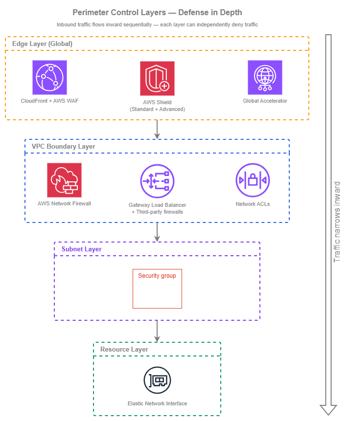

# 境界制御 {#perimeter-controls}

!!! info "前提条件"
    このセクションでは、[Amazon VPC](../foundation/vpc.md)、[サブネット](../foundation/subnets.md)、および[インターネット接続](../connectivity/internet.md)に関する知識を前提としています。AWS ネットワークの基礎を初めて学ぶ方は、先にそれらのトピックをご確認ください。

境界制御は、不正なインバウンドアクセスからネットワークの境界を保護します。AWS において、境界は単一のエッジファイアウォールではなく、グローバルエッジネットワークから個々の Elastic Network Interface まで、スタックの異なるレベルで動作する多層制御の組み合わせです。各レイヤーはそれぞれ固有の役割を担っており、すべてのレイヤーを組み合わせることで多層防御(Defense in Depth)が実現されます。単一のレイヤーのみに依存することは設計上の欠陥であり、あるレイヤーの設定ミスを別のレイヤーで検出できるよう、制御を重複させることが目標です。

重要なアーキテクチャ上の判断は、どの境界制御を使用するかではなく(複数を同時に使用することになります)、アカウントと VPC をまたいでどのように整理するかです。マルチアカウント環境では、AWS Firewall Manager を通じた一元的なポリシー管理によって一貫したベースラインが確保される一方、適用ポイント自体はワークロード VPC 全体に分散されます。このポリシー定義と適用の分離こそが、運用上のボトルネックを生じさせることなく境界セキュリティをスケーラブルにする仕組みです。

このページでは、インバウンドトラフィックを保護する制御について説明します。アウトバウンドフィルタリングとエグレス制御については、[アウトバウンド制御](outbound.md)を参照してください。ワークロード間の内部セグメンテーションについては、[ネットワークセグメンテーション](segmentation.md)を参照してください。

/// caption
境界制御レイヤー — [Drawio ソース](../assets/security/perimeter-layers.drawio)
///

トラフィックはこれらのレイヤーを順番に通過してインバウンド方向に流れます。インターネットからのリクエストは、まずエッジ(CloudFront、Shield、Global Accelerator)に到達し、次に VPC に入って Network Firewall または GWLB ベースの検査で評価され、サブネット境界の Network ACL を通過し、最終的にターゲットリソースの ENI にアタッチされたセキュリティグループに到達します。各レイヤーは独立してトラフィックを拒否できるため、あるレイヤーでブロックされたパケットは、それ以降のレイヤーには到達しません。

## 主要な機能 {#key-capabilities}

*   :material-shield-lock: **セキュリティグループ — ステートフル、インスタンスレベル**

    ---

    VPC 内のすべての ENI に対する主要なアクセス制御メカニズムです。ステートフル評価により、戻りトラフィックは自動的に許可されます。ルールは CIDR ブロック、プレフィックスリスト、または他のセキュリティグループを参照でき、IP 管理なしでアイデンティティベースのアクセスパターンを実現します。

*   :material-wall: **ネットワーク ACL — ステートレス、サブネットレベル**

    ---

    サブネット境界における多層防御の粗いレイヤーです。ステートレス評価のため、インバウンドとアウトバウンドの両方のトラフィックを明示的に許可する必要があります。NACL は広範な拒否ルールのセーフティネットとして使用し、主要なアクセス制御には使用しないでください。

*   :material-web: **AWS WAF — L7 アプリケーション保護**

    ---

    CloudFront、ALB、API Gateway、AppSync での HTTP/HTTPS リクエストを検査します。マネージドルールグループは OWASP Top 10、ボット制御、IP レピュテーションをカバーします。カスタムルールはアプリケーション固有のロジックとレート制限に対応します。

*   :material-shield-alert: **AWS Shield — DDoS 保護**

    ---

    Shield Standard はすべてのパブリック向け AWS エンドポイントで自動的かつ無料で適用されます。Shield Advanced は、上位ティアのワークロード向けにリアルタイムの可視性、DDoS レスポンスチームへのアクセス、コスト保護、プロアクティブエンゲージメントを追加します。

*   :material-fire: **AWS Network Firewall — マネージド VPC インスペクション**

    ---

    VPC レベルでのステートフルおよびステートレスなパケット検査を提供します。Suricata 互換の IPS ルール、ドメインフィルタリング、プロトコル検出をサポートします。専用サブネット内にファイアウォールエンドポイントとしてデプロイし、VPC ルートテーブルと統合します。

*   :material-server-network: **Gateway Load Balancer — サードパーティアプライアンスの挿入**

    ---

    GENEVE カプセル化を使用して、サードパーティのファイアウォールアプライアンス(Palo Alto、Fortinet、Check Point)をトラフィックパスに透過的に挿入します。組織が特定のベンダー機能を必要とする場合、または既存のアプライアンス投資がある場合に使用します。

## ベストプラクティス {#best-practices}

### セキュリティグループ {#security-groups}

#### ワークロードのアイデンティティを基準にセキュリティグループを設計する（IP アドレスではなく） {#design-security-groups-around-workload-identity-not-ip-addresses}

セキュリティグループは、ソースとして他のセキュリティグループを参照する機能をサポートしています。これはセキュリティグループの最も強力な機能であり、最も活用されていない機能でもあります。`10.0.1.0/24`（何でも含まれる可能性があるサブネット CIDR）を許可する代わりに、`sg-frontend` セキュリティグループを許可します。これにより、「この IP 範囲があの IP 範囲に到達できる」ではなく、「フロントエンド層がバックエンド層に到達できる」というアイデンティティベースのアクセスモデルが実現します。インスタンスがスケール、移動、または置き換えられても、ルールを更新することなくアクセスモデルが維持されます。

実際には、目的別のセキュリティグループ（`sg-web-alb`、`sg-app-tier`、`sg-database`、`sg-cache`）を作成し、互いを参照するルールを記述することを意味します。ALB セキュリティグループはインターネットからのインバウンド HTTPS を許可し、アプリ層セキュリティグループは `sg-web-alb` からのインバウンドトラフィックのみを許可し、データベースセキュリティグループは `sg-app-tier` からのインバウンドのみを許可します。CIDR 管理も、インスタンスが変更された際のルール更新も不要です。

#### 最小権限を適用する — デフォルトで拒否し、明示的に許可する {#apply-least-privilege-deny-by-default-allow-explicitly}

セキュリティグループはデフォルトですべてのインバウンドトラフィックを拒否します（ルールなし = アクセスなし）。追加するすべてのルールは明示的な許可です。これが正しいメンタルモデルです。ゼロアクセスから始め、ワークロードが必要とするものだけを開放します。よくある違反には、パブリック向けロードバランサーの 80/443 以外のポートで `0.0.0.0/0` を許可すること、特定のセキュリティグループのみがアクセスを必要とする場合に VPC CIDR 全体を許可すること、Systems Manager Session Manager を使用する代わりに SSH/RDP を広い範囲に開放したままにすることが含まれます。

***重要なポイント:*** *セキュリティグループはプライマリアクセスコントロールです — NACL でも Network Firewall でもありません。セキュリティグループの設計を正しく行えば、他のレイヤーは補完的なコントロールではなく安全網となります。*

#### アプリケーション間で共有グループを使用せず、ワークロードごとに個別のセキュリティグループを作成する {#create-separate-security-groups-per-workload-not-shared-groups-across-applications}

すべてのリソースに適用される単一の「内部はすべて許可」セキュリティグループは、マイクロセグメンテーションの目的を損ないます。各ワークロード（またはワークロード層）は、その層が必要とするものだけにスコープされたルールを持つ独自のセキュリティグループを持つべきです。共有セキュリティグループは、無関係なワークロード間に暗黙的な信頼関係を生み出します。あるワークロードが侵害されると、攻撃者はそのグループを共有するすべてのものへのアクセスを継承します。

例外は共通インフラストラクチャです。VPC エンドポイント用の共有セキュリティグループ（VPC CIDR からの HTTPS を許可）や、監視エージェント用のセキュリティグループ（監視システムがメトリクスをスクレイプできるよう許可）は、アクセスパターンが真に共有されているため合理的です。

#### 明示的な IPv6 ルールを追加する — セキュリティグループは IPv6 トラフィックに IPv4 ルールを継承しない {#add-explicit-ipv6-rules-security-groups-do-not-inherit-ipv4-rules-for-ipv6-traffic}

セキュリティグループは IPv4 と IPv6 を完全に別個のルールセットとして扱います。ポート 443 で `0.0.0.0/0` を許可するルールは、ポート 443 で `::0/0` を**許可しません**。VPC がデュアルスタックで、ワークロードが IPv6 トラフィックを受け入れる場合、明示的な IPv6 ルールを追加する必要があります。これは最も一般的な IPv6 セキュリティのギャップです。チームがサブネットでデュアルスタックを有効にし、リソースが IPv6 アドレスを取得しますが、セキュリティグループに IPv6 インバウンドルールがないため、IPv6 トラフィックは静かにドロップされ、チームは接続のデバッグに何時間も費やします。

逆に、ワークロードが IPv6 トラフィックを受け入れるべきで**ない**場合、セキュリティグループに IPv6 ルールがないことが保護となります。ルールが偶然存在しないことに依存するのではなく、意図的にこれを確認してください。

#### 共有 CIDR セットにはマネージドプレフィックスリストを使用する {#use-managed-prefix-lists-for-shared-cidr-sets}

複数のセキュリティグループが同じ CIDR セット（企業オフィスの範囲、パートナーネットワーク、監視インフラストラクチャ）を参照する必要がある場合、グループ間で CIDR エントリを重複させる代わりに[マネージドプレフィックスリスト](https://docs.aws.amazon.com/vpc/latest/userguide/managed-prefix-lists.html)を使用します。プレフィックスリストは RAM を通じてアカウント間で共有可能で、アトミックに更新され（リストを参照するすべてのセキュリティグループが同時に変更を受け取る）、リストに含まれる CIDR の数に関わらず単一のルールエントリとしてカウントされます。

### ネットワーク ACL {#network-acls}

#### NACL はプライマリアクセスコントロールとしてではなく、粗いセーフティネットとして使用する {#use-nacls-as-a-coarse-safety-net-not-as-primary-access-control}

NACL はステートレスです — リターントラフィックのエフェメラルポート範囲を含む、インバウンドとアウトバウンドの両方のルールを記述する必要があります。これにより、きめ細かいアクセスコントロールのために運用上のコストが高くなります。NACL の価値は広範な拒否レイヤーとしてです。サブネットと通信すべきでないことがわかっている CIDR 範囲全体をブロックします（既知の不正 IP 範囲、禁輸国、パブリックサブネットに到達すべきでない内部範囲）。

デフォルトの NACL は両方向のすべてのトラフィックを許可します。これは意図的なものです — セキュリティグループがプライマリコントロールです。セキュリティグループが表現できないサブネットレベルの拒否ルールが必要な場合にのみ NACL を変更します（セキュリティグループには拒否機能がありません）。

#### IPv6 NACL エントリを明示的に追加する {#add-ipv6-nacl-entries-explicitly}

セキュリティグループと同様に、NACL は IPv4 と IPv6 を別個のルールセットとして扱います。デフォルトの NACL には `0.0.0.0/0` と `::/0` の両方に対する全許可ルールが含まれていますが、カスタム NACL は両方のアドレスファミリーに対して空の状態から始まります。デュアルスタックサブネット用のカスタム NACL を作成する場合、両方のアドレスファミリーのエフェメラルポート範囲を含む、IPv4 と IPv6 の両方のトラフィックに対するルールを追加する必要があります。IPv6 NACL ルールの欠落は、セキュリティグループルールの欠落に次いで 2 番目に多い IPv6 接続の問題です。

#### NACL ルールセットを小さく監査可能な状態に保つ {#keep-nacl-rule-sets-small-and-auditable}

NACL はルール番号順に評価され、最初に一致したものが適用されます。数十のルールを持つ複雑な NACL 設定は、理解と監査が困難になります。NACL に 10〜15 以上のカスタムルールがある場合、セキュリティグループまたは Network Firewall に属するアクセスコントロールに使用している可能性が高いです。NACL は広範な拒否パターンに集中させてください。既知の不正範囲を拒否し、サブネットに現れるべきでないプロトコルを拒否し、きめ細かい許可ロジックはセキュリティグループに任せます。

***重要なポイント:*** *NACL が存在する理由は一つです。セキュリティグループが拒否できないトラフィックを拒否するためです。セキュリティグループは許可のみです — より広いルールで許可される特定の IP をブロックすることはできません。NACL はそのギャップを埋めます。NACL に許可ルールを記述しているなら、間違ったツールを使用しています。*

### AWS WAF {#aws-waf}

#### インターネット向けのすべての L7 エンドポイントに AWS WAF をデプロイする {#deploy-aws-waf-on-every-internet-facing-l7-endpoint}

AWS WAF はすべての CloudFront ディストリビューション、パブリック向け ALB、および API Gateway ステージにアタッチする必要があります。AWS WAF WebACL のコスト（WebACL 月額 + 100 万リクエストあたりの料金 — [AWS WAF 料金](https://aws.amazon.com/waf/pricing/)を参照）は、アプリケーション層の攻撃がオリジンに到達するコストと比べて無視できるほど小さいです。AWS Firewall Manager を使用して、すべてのアカウントにベースライン WebACL を自動的にデプロイします — これにより、アプリケーションチームが覚えていなくても新しいリソースが保護されます。

#### AWS マネージドルールグループから始め、カスタムルールを重ねる {#start-with-aws-managed-rule-groups-then-layer-custom-rules}

AWS マネージドルールは一般的な脅威に対する即時のカバレッジを提供します。コアルールセット（CRS）は OWASP Top 10 をカバーし、既知の不正入力ルールグループは一般的なエクスプロイトパターンをブロックし、IP レピュテーションリストは既知の悪意あるソースからのトラフィックをブロックします。これらは AWS によって管理され、自動的に更新されます。これらをベースラインとして開始し、カウントモードで 1〜2 週間誤検知を監視してから、ブロックモードに切り替えます。

カスタムルールはアプリケーション固有のロジックのために重ねます。IP またはセッションごとのレート制限、サービスを提供していない地域のジオブロッキング、期待されるパターンのヘッダー検証、アプリケーションの実際のニーズに合ったリクエストサイズ制約などです。

#### レートベースルールを大量アプリケーション層攻撃に対する最初の防衛線として使用する {#use-rate-based-rules-as-your-first-line-against-volumetric-application-layer-attacks}

レートベースルールは、5 分間のウィンドウ内でしきい値を超える単一 IP（または他のキー）からのリクエストをスロットリングします。アプリケーションの正当なトラフィックパターンを反映したレート制限を設定します — 単一クライアントが 5 分間に 2,000 リクエスト以上送信すべきでない場合、そこにしきい値を設定します。これにより、クレデンシャルスタッフィング、スクレイピング、アプリケーション層 DDoS がバックエンドリソースを消費する前に検出されます。

レートベースルールは IP 以外のカスタムキーをサポートします。ヘッダー値、クエリ文字列、Cookie、またはラベル名前空間でレート制限できます。これにより、単一 IP がしきい値を下回るが、ボットネットからの集計が圧倒的な分散攻撃を処理できます。

#### AWS WAF は IPv4 と IPv6 の両方を透過的に処理する {#aws-waf-handles-both-ipv4-and-ipv6-transparently}

IP アドレスでマッチする AWS WAF ルールは、IP セットで IPv4 CIDR と IPv6 CIDR の両方を受け入れます。レートベースルールは IPv4 と IPv6 のソースを独立して追跡します。IPv6 に対して別途設定は必要ありません — AWS WAF は基盤となる IP バージョンに関わらず、すべての HTTP/HTTPS トラフィックを評価します。これは、セキュリティグループや NACL とは異なり、IPv6 が追加設定を必要としない領域の一つです。

### AWS Shield {#aws-shield}

#### Shield Standard が自動的に提供するものを理解する {#understand-what-shield-standard-gives-you-automatically}

Shield Standard はすべての AWS アカウントで追加コストなしで有効になっています。すべてのパブリック向けエンドポイント（CloudFront、Route 53、Global Accelerator、ALB、NLB、Elastic IP）を一般的な L3/L4 DDoS 攻撃（SYN フラッド、UDP リフレクション、DNS 増幅）から保護します。何も設定する必要はありません。このベースライン保護が、ほとんどの AWS ワークロードが大量 DDoS 攻撃の成功を経験しない理由です。

#### ビジネスクリティカルなインターネット向けワークロードには Shield Advanced にアップグレードする {#upgrade-to-shield-advanced-for-business-critical-internet-facing-workloads}

Shield Advanced（組織ごとの月額サブスクリプション + 攻撃中のデータ転送料金 — [Shield 料金](https://aws.amazon.com/shield/pricing/)を参照）は、高価値ターゲットにとって重要な機能を追加します。Shield コンソールでのリアルタイム攻撃の可視性、複雑な攻撃中の手動緩和のための AWS DDoS レスポンスチーム（DRT）へのアクセス、コスト保護（攻撃中に発生したスケーリング料金のクレジット）、攻撃が検出されたときに AWS が連絡するプロアクティブエンゲージメントなどです。DRT はアクティブなインシデント中にあなたに代わって AWS WAF ルールを記述してデプロイすることもできます。

Shield Advanced は、ダウンタイムのコストがサブスクリプションコストを超える場合に正当化されます — 通常、収益を生み出す Web アプリケーション、金融サービス API、および数分の利用不能が測定可能なビジネスへの影響を持つ SaaS プラットフォームです。

#### Shield Advanced をすべての関連リソースに関連付ける {#associate-shield-advanced-with-all-related-resources}

Shield Advanced の保護はリソースごとです。アプリケーションが CloudFront → ALB → EC2 を使用している場合、CloudFront ディストリビューションと ALB の両方に Shield Advanced を関連付けます。CloudFront のみを保護すると、DNS 名が発見可能な場合に ALB が直接攻撃にさらされます。Firewall Manager を使用して、すべてのアカウントで条件に一致する新しいリソースに Shield Advanced を自動的に関連付けます。

***重要なポイント:*** *Shield Standard は DDoS 攻撃の大部分を静かに処理します。Shield Advanced は DDoS 保護を得るためのものではありません — すでに持っています。自動緩和だけでは対処できない高度または持続的な攻撃中の可視性、専門家の対応、コスト保護を得るためのものです。*

### AWS Network Firewall {#aws-network-firewall}

#### VPC 境界でのステートフル L3/L4 インスペクションに Network Firewall をデプロイする {#deploy-network-firewall-for-stateful-l3l4-inspection-at-the-vpc-boundary}

AWS Network Firewall は、インターネットゲートウェイとワークロードサブネットの間で管理されたステートフルおよびステートレスインスペクションを提供します。Suricata 互換の IPS/IDS ルール、ドメインベースのフィルタリング（特定の FQDN へのトラフィックの許可/拒否）、TLS Server Name Indication（SNI）インスペクション、プロトコル検出をサポートします。専用サブネットにファイアウォールエンドポイントをデプロイし、VPC イングレスルーティングを使用してトラフィックをそれらを通じて誘導します。

インバウンドインスペクションの典型的なデプロイメントは、インターネットゲートウェイとロードバランサーをホストするパブリックサブネットの間にファイアウォールエンドポイントを配置します。IGW エッジルートテーブルは受信トラフィックを同じアベイラビリティーゾーンのファイアウォールエンドポイントに誘導し、ファイアウォールエンドポイントのサブネットルートテーブルはインスペクション済みトラフィックをワークロードサブネットに転送します。Network Firewall がイングレスおよびエグレスパスのどこに適合するかの完全なアーキテクチャコンテキスト（集中型と VPC ごとの配置、コストのトレードオフ、Transit Gateway または AWS Cloud WAN との統合）については、[インターネット接続](../connectivity/internet.md)を参照してください。

#### 集中型インスペクションと VPC ごとのインスペクションを意図的に選択する {#choose-between-centralized-and-per-vpc-inspection-deliberately}

2 つのデプロイメントモデルが存在し、適切な選択はトラフィックパターンと運用モデルによって異なります。

| 要素 | 集中型インスペクション（共有 VPC） | VPC ごとのインスペクション |
| --- | --- | --- |
| **トラフィックパス** | すべてのトラフィックが Transit Gateway 経由で中央インスペクション VPC を通過 | 各 VPC が独自のファイアウォールエンドポイントを持つ |
| **コストモデル** | 1 セットのファイアウォールエンドポイント + すべてのフローに対する Transit Gateway データ処理 | VPC ごとのファイアウォールエンドポイント時間（トランジットデータ処理なし） |
| **ポリシー管理** | 1 か所で適用される単一のルールグループ | Firewall Manager 経由で各 VPC にデプロイされる同じルールグループ |
| **影響範囲** | 中央ファイアウォールの設定ミスがすべての VPC に影響 | VPC ごとの設定ミスはそのワークロードのみに影響 |
| **最適なケース** | クロス VPC トラフィックが多い少数の VPC、または Transit Gateway がすでにパスにある場合 | 独立したトラフィックパターンを持つ多数の VPC、またはトランジットデータ処理コストを最小化する場合 |

多くのワークロード VPC を持つほとんどのマルチアカウント環境では、**Firewall Manager を通じて集中管理される VPC ごとのインスペクション**が推奨パターンです。すべてのインバウンドフローに対する Transit Gateway データ処理料金を回避し、影響範囲をワークロードごとに保ち、集中管理されたルールグループを通じて均一なポリシーを提供します。

#### 大量の単純なフィルタリングにはステートレスルールを、プロトコル対応インスペクションにはステートフルルールを使用する {#use-stateless-rules-for-high-volume-simple-filtering-and-stateful-rules-for-protocol-aware-inspection}

Network Firewall はまずステートレスルールを評価し（高速、パケットごと、接続追跡なし）、次にトラフィックをステートフルエンジンに渡します（接続対応、プロトコル対応、Suricata ルール）。広範な拒否パターン（CIDR 範囲全体のブロック、不正パケットのドロップ、プロトコルによるレート制限）にはステートレスルールを使用し、プロトコル対応インスペクション（HTTP ホストヘッダーマッチング、TLS SNI フィルタリング、IPS シグネチャ）にはステートフルルールを使用します。

この分離はコストにとって重要です。ステートレスルールは高スループットでの評価コストが低くなります。単純な拒否ロジックをステートレスレイヤーに移すことで、ステートフルエンジンが処理する必要があるトラフィック量が減少します。

### Gateway Load Balancer とサードパーティファイアウォール {#gateway-load-balancer-and-third-party-firewalls}

#### 組織が特定のベンダー機能を必要とする場合に GWLB を使用する {#use-gwlb-when-your-organization-requires-specific-vendor-capabilities}

Gateway Load Balancer は、GENEVE カプセル化を使用して、サードパーティのファイアウォールアプライアンス（Palo Alto Networks、Fortinet、Check Point、Cisco）を VPC トラフィックパスに透過的に挿入します。アプライアンスは NAT なしで元のパケットヘッダー（送信元 IP、宛先 IP、プロトコル）を確認し、トラフィックをインスペクションまたは変更し、転送のために GWLB に返します。これは、組織が既存のベンダー関係を持っている場合、特定の製品を義務付けるコンプライアンス要件がある場合、または Network Firewall が提供しない機能（高度な脅威インテリジェンスフィード、アプリケーション ID ベースのポリシー、オンプレミスファイアウォールとの統合管理）が必要な場合に適切な選択です。

#### Network Firewall エンドポイントと同じパターンで GWLB エンドポイントをデプロイする {#deploy-gwlb-endpoints-in-the-same-pattern-as-network-firewall-endpoints}

VPC ルーティング統合は同一です。GWLB エンドポイントは専用サブネットに配置され、VPC ルートテーブルがトラフィックをそれらを通じて誘導します。違いは、GWLB が AWS 管理のインスペクションエンジンではなく、アプライアンスインスタンスのターゲットグループ（あなたが管理する）にトラフィックを転送することです。つまり、アプライアンスフリートの可用性、パッチ適用、スケーリング、ライセンスを所有することになります — Network Firewall が排除する運用上のオーバーヘッドです。

#### コストモデルを慎重に検討する {#consider-the-cost-model-carefully}

GWLB はエンドポイントごとの時間料金と GB ごとのデータ処理料金が発生します。それに加えて、ファイアウォールアプライアンスを実行する EC2 インスタンス（またはマーケットプレイス AMI）、そのライセンス、フリートを管理する運用コストを支払います。すでにベンダーにコミットしており、オンプレミスでそれらのアプライアンスを実行している組織にとって、GWLB はその投資を AWS に拡張します。既存のベンダーコミットメントのない組織にとって、Network Firewall はほぼ常により費用対効果が高く、運用上もシンプルです。

***重要なポイント:*** *GWLB は Network Firewall の競合製品ではありません — サードパーティアプライアンスのデプロイメントメカニズムです。AWS 管理のインスペクション（Network Firewall）が必要か、ベンダー固有のインスペクション（GWLB + アプライアンス）が必要かに基づいて選択します。多くの組織は両方を使用します。標準的な VPC インスペクションには Network Firewall を、ベンダー固有の機能を必要とする特殊なワークロードには GWLB を使用します。*

### AWS Firewall Manager {#aws-firewall-manager}

#### クロスアカウントの境界ポリシーの単一ペインとして Firewall Manager を使用する {#use-firewall-manager-as-the-single-pane-for-cross-account-perimeter-policy}

Firewall Manager はファイアウォールではありません — Organization 内のすべてのアカウントにセキュリティグループルール、AWS WAF WebACL、Shield Advanced の関連付け、Network Firewall ポリシー、DNS Firewall ルールをデプロイして適用するポリシー管理サービスです。Firewall Manager がなければ、各アカウントチームがこれらのコントロールを独立して設定する必要があり、ドリフト、ギャップ、一貫性のないベースラインにつながります。

Firewall Manager には、すべての機能が有効な AWS Organizations と委任管理者アカウント（通常はセキュリティまたはネットワーキングアカウント）が必要です。設定が完了すると、ポリシーは新しいアカウントと新しいリソースが作成されるときに自動的に適用されます — 手動のオンボーディング手順は不要です。

#### アプリケーションチームが弱体化できないベースラインポリシーを定義する {#define-baseline-policies-that-application-teams-cannot-weaken}

Firewall Manager はセキュリティグループに対して 2 つの適用モードをサポートします。**監査**（非準拠グループを報告するが変更しない）と**自動修復**（非準拠グループを自動的にコンプライアンスに準拠させる）です。ベースラインルール（例：「いかなるセキュリティグループも `0.0.0.0/0` からの SSH を許可してはならない」）には自動修復を使用します。AWS WAF については、アプリケーションチームが削除できないベースライン WebACL をデプロイしながら、その上に独自のルールを追加できるようにします。

これにより、階層化された所有権モデルが生まれます。セキュリティチームがベースラインを所有し（Firewall Manager を通じて管理）、アプリケーションチームがベースラインが確立するガードレール内でワークロード固有のルールを所有します。

#### セキュリティ予算に Firewall Manager のコストを考慮する {#account-for-firewall-manager-costs-in-your-security-budget}

Firewall Manager はポリシーごと、リージョンごとに料金が発生します（[Firewall Manager 料金](https://aws.amazon.com/firewall-manager/pricing/)を参照）。5 つのポリシーを 4 つのリージョンにわたって持つ場合、Firewall Manager だけでも大幅に積み重なります。基盤となるサービスのコスト（AWS WAF WebACL、Network Firewall エンドポイント、Shield Advanced サブスクリプション）は別途発生します。このコストは、手動ポリシー管理が非現実的な 10 以上のアカウントを持つ組織には正当化されますが、手動設定が管理可能な 2〜3 アカウントの小規模組織にはコスト効果がない場合があります。

### IPv6 境界の考慮事項 {#ipv6-perimeter-considerations}

#### IPv6 セキュリティを IPv4 の拡張としてではなく、別個の明示的な設定として扱う {#treat-ipv6-security-as-a-separate-explicit-configuration-not-an-extension-of-ipv4}

最も危険な IPv6 セキュリティの姿勢は偶発的なものです。VPC がデュアルスタックで、リソースが IPv6 アドレスを受け取りますが、セキュリティグループ、NACL、ファイアウォールルールが IPv4 のみをカバーしています。この状態では、IPv6 トラフィックが設定したすべてのコントロールをバイパスします。修正は簡単ですが、規律が必要です。

* **セキュリティグループ**: 明示的な IPv6 ルールを追加します（パブリックには `::/0`、内部には特定の IPv6 プレフィックス）。IPv4 ルールは IPv6 トラフィックには適用されません。
* **NACL**: エフェメラルポート範囲を含む、インバウンドとアウトバウンドの両方に IPv6 エントリを追加します。カスタム NACL は IPv6 ルールなしで始まります。
* **Network Firewall**: IP アドレスを参照するステートフルルールには IPv4 と IPv6 の両方のバリアントが必要です。ドメインベースのルール（SNI、HTTP ホスト）は IP バージョンに関わらず機能します。
* **AWS WAF**: 両方のアドレスファミリーを透過的に処理します — 別途設定は不要です。

#### デュアルスタック VPC での意図しない IPv6 露出を監査する {#audit-for-unintended-ipv6-exposure-in-dual-stack-vpcs}

サブネットで IPv6 を有効にすると、そのサブネット内のすべての ENI が IPv6 アドレスを受け取ることができます（サブネット設定によって異なります）。セキュリティグループに IPv6 インバウンドルールがない場合、トラフィックはブロックされます — しかし、誰かが影響を理解せずに `::/0` ルールを追加すると、そのリソースは IPv6 インターネット全体から到達可能になります。Firewall Manager のセキュリティグループ監査ポリシーを使用して、Organization 全体で過度に許可的な IPv6 ルールを検出します。

## 各境界制御をいつ使用するか {#when-to-use-each-perimeter-control}

各制御は異なるレイヤーで動作し、異なる目的を果たします。これらは互いの代替ではなく、補完的な関係にあります。ただし、どの制御が主要な防御となるかを理解することで、設定の労力を最も重要な箇所に集中できます。

**Security Groups** が主要な制御として適切な場合:

* リソースごとのアクセス制御が必要な場合(常に必要)
* トラフィックパターンを「送信元 X がポート Y の宛先に到達できる」という形式で表現できる場合
* 戻りトラフィックのルールを管理せずにステートフルな評価が必要な場合

Security Groups は**常に必須**です。どのアーキテクチャでも省略できません。

**Network ACLs** を追加するのが適切な場合:

* サブネットレベルで特定の CIDR 範囲を明示的に拒否する必要がある場合
* コンプライアンス要件により、Security Groups に加えて独立した第 2 の制御レイヤーが求められる場合
* Security Groups では許可してしまう、侵害された内部リソースからのトラフィックをブロックする必要がある場合

NACL は、きめ細かいアクセス制御(Security Groups を使用)やアプリケーションレイヤーのフィルタリング(AWS WAF を使用)には**適していません**。

**AWS WAF** が適切な選択肢となる場合:

* HTTP/HTTPS リクエストのコンテンツ(ヘッダー、ボディ、URI、クエリ文字列)を検査する必要がある場合
* レート制限、ボット検出、またはジオブロッキングが必要な場合
* ワークロードが CloudFront、ALB、API Gateway、または AppSync の前段に配置されている場合

AWS WAF は、L3/L4 トラフィックの検査(Network Firewall を使用)や HTTP 以外のプロトコルには**適していません**。

**AWS Network Firewall** が適切な選択肢となる場合:

* IPS/IDS 機能を備えたステートフルな L3/L4 検査が必要な場合
* HTTP 以外のトラフィックに対してドメインベースのフィルタリング(TLS SNI 検査)が必要な場合
* VPC 境界でのプロトコル検出やディープパケットインスペクションが必要な場合

Network Firewall は、HTTP 固有のロジック(AWS WAF を使用)や、ベンダー固有のアプライアンス機能が必要な場合(GWLB を使用)には**適していません**。

**Gateway Load Balancer + サードパーティファイアウォール**が適切な選択肢となる場合:

* コンプライアンスや運用の一貫性のために、組織が特定のファイアウォールベンダーを義務付けている場合
* Network Firewall では利用できない機能(アプリケーション ID ポリシー、高度な脅威フィード、オンプレミスとの統合管理)が必要な場合
* 既存のベンダーライセンスと運用ノウハウがある場合

GWLB は、既存のベンダー要件がない場合には**適していません**。そのような場合は Network Firewall の方がシンプルで運用コストも低くなります。

**AWS Shield Advanced** が適切な選択肢となる場合:

* インターネット向けワークロードが収益を生み出しており、数分のダウンタイムでも測定可能なコストが発生する場合
* 複雑な攻撃の緩和に DDoS Response Team へのアクセスが必要な場合
* 攻撃中のスケーリング費用に対するコスト保護が必要な場合
* プロアクティブなエンゲージメントが必要な場合(攻撃検知時に AWS から連絡を受ける)

Shield Advanced は、Shield Standard による自動的な L3/L4 保護で十分であり、断続的な性能低下のコストが許容できるワークロードには**不要**です。

## 境界制御と他のサービスの組み合わせ {#combining-perimeter-controls-with-other-services}

| 組み合わせ | 境界制御が提供するもの | 他のサービスが提供するもの | 組み合わせて使用する場面 |
| --- | --- | --- | --- |
| **Security Groups + VPC Lattice** | ターゲットの ENI ごとのアクセス制御 | IAM 認証ポリシーによるサービスレベルの認証・認可 | 常に — Lattice がサービス間認証を処理する場合でも、セキュリティグループは有効なまま |
| **AWS WAF + CloudFront** | L7 リクエストインスペクション、レート制限、ジオブロッキング | グローバルエッジ配信、TLS 終端、キャッシュ、VPC Origins によるオリジン分離 | インターネット向けのすべての L7 ワークロード — CloudFront の AWS WAF がリージョンに到達する前にトラフィックを検査 |
| **AWS WAF + API Gateway** | リクエストフィルタリング、IP ブロッキング、レート制限 | API 管理、スロットリング、リクエスト検証、認可 | CloudFront ではなく API Gateway がエントリポイントとなる API ファーストのワークロード |
| **Network Firewall + Transit Gateway** | ステートフル/ステートレスな VPC トラフィックインスペクション | VPC 間およびハイブリッドルーティング | すべてのトラフィックがインスペクション VPC を経由する集中インスペクションモデル |
| **Network Firewall + VPC ingress routing** | ワークロードサブネットに到達する前のインバウンドトラフィックインスペクション | IGW エッジルートテーブルがトラフィックをファイアウォールエンドポイントへ誘導 | インターネット向けインバウンドトラフィックの VPC ごとのインスペクション |
| **Shield Advanced + AWS WAF** | DDoS 防御、DRT アクセス、コスト保護 | アプリケーション層攻撃の緩和、自動レート制限 | Shield Advanced は攻撃中に DRT 経由で AWS WAF に緊急ルールをデプロイするよう指示可能 |
| **GWLB + Network Firewall** | 特定のワークロード向けサードパーティアプライアンスによるインスペクション | 標準ワークロード向け AWS マネージドインスペクション | 一部のトラフィックにベンダー固有の機能が必要で、残りは AWS ネイティブを使用する組織 |
| **Firewall Manager + すべての境界制御** | 集中ポリシーのデプロイとコンプライアンス監視 | 各リソースでの個別制御の適用 | 手動のポリシー管理によってドリフトが生じる、10 アカウント以上のマルチアカウント環境 |
| **Security Groups + managed prefix lists** | ENI ごとのアクセス制御 | RAM 経由で共有・一元管理された CIDR セット | 複数アカウントにまたがる複数のセキュリティグループが同じ送信元/送信先 CIDR を必要とする場合 |
| **NACLs + Security Groups** | サブネットレベルの広範な拒否ルール | リソースごとのきめ細かい許可ルール | 多層防御 — NACL はサブネットに到達すべきでないものを拒否し、セキュリティグループは各リソースに到達すべきものを許可 |

## コスト面の考慮事項 {#cost-implications}

境界制御はコストが大きく異なるため、コストモデルを理解することで、冗長な検査に過剰投資することなく、適切にレイヤーを重ねることができます。

| サービス | コストモデル | 月額コストの目安 (リージョンあたり) | コスト最適化の手段 |
| --- | --- | --- | --- |
| **Security Groups** | 無料 | 無料 | 不要 — 常に使用する |
| **Network ACLs** | 無料 | 無料 | 不要 — 適切な場所で常に使用する |
| **AWS WAF** | WebACL ごと + ルールごと + 100 万リクエストごと ([料金](https://aws.amazon.com/waf/pricing/)) | 一般的なワークロードでは低〜中程度 | ルールを統合し、多数のカスタムルールよりマネージドルールグループ (定額) を活用する |
| **AWS Shield Standard** | 無料 (自動適用) | 無料 | 不要 — 常に有効 |
| **AWS Shield Advanced** | 組織単位の月額サブスクリプション + 攻撃時のデータ転送料 ([料金](https://aws.amazon.com/shield/pricing/)) | 固定費として相応のコスト | 1 つのサブスクリプションで Organization 内の全アカウントをカバー |
| **AWS Network Firewall** | エンドポイント稼働時間ごと + 処理 GB ごと ([料金](https://aws.amazon.com/network-firewall/pricing/)) | VPC あたり中〜高程度 | 大量の単純なフィルタリングにはステートレスルールを使用し、マルチ AZ を効率的に活用してエンドポイント数を最小化する |
| **Gateway Load Balancer** | エンドポイント稼働時間ごと + 処理 GB ごと + アプライアンスコスト ([料金](https://aws.amazon.com/elasticloadbalancing/pricing/)) | デプロイあたり高コスト | アプライアンスフリートを適切なサイズに調整し、ターゲットアプライアンスに Auto Scaling グループを使用する |
| **AWS Firewall Manager** | ポリシーごと・リージョンごと ([料金](https://aws.amazon.com/firewall-manager/pricing/)) | ポリシー数とリージョン数に応じてスケール | 可能な限りポリシーを統合し、小規模な組織では手動管理の方がコストを抑えられるか評価する |

***重要なポイント:*** *Security Groups と NACL は無料です。AWS WAF は提供する保護に対して低コストです。Network Firewall と GWLB はコストの高いレイヤーです。「すべてを検査する」という一律のアプローチではなく、GB あたりの処理コストに見合う検査価値がある箇所にのみデプロイしてください。L7 には AWS WAF を、L3/L4 には Security Groups をコスト効率の高いベースラインとして使用し、より深い検査が必要な場合にのみ Network Firewall または GWLB を追加してください。*

## ドキュメント {#documentation}

*   :material-file-document: **セキュリティグループのドキュメント**

    ---

    ステートフルトラッキングおよびコネクショントラッキングのタイムアウトを含む、セキュリティグループルール、制限、および動作に関する完全なリファレンス。

    [:octicons-arrow-right-24: Security Groups](https://docs.aws.amazon.com/vpc/latest/userguide/vpc-security-groups.html)

*   :material-file-document: **AWS WAF デベロッパーガイド**

    ---

    WebACL、ルールグループ、マネージドルール、および CloudFront・ALB・API Gateway との統合を網羅した AWS WAF の完全ドキュメント。

    [:octicons-arrow-right-24: AWS WAF](https://docs.aws.amazon.com/waf/latest/developerguide/waf-chapter.html)

*   :material-file-document: **AWS Network Firewall デベロッパーガイド**

    ---

    マネージドファイアウォールインスペクションのためのアーキテクチャ、デプロイパターン、ルールグループの設定、および VPC ルーティング統合。

    [:octicons-arrow-right-24: Network Firewall](https://docs.aws.amazon.com/network-firewall/latest/developerguide/what-is-aws-network-firewall.html)

*   :material-shield-check: **AWS Shield ドキュメント**

    ---

    Shield Standard の自動保護と、DRT エンゲージメントおよびコスト保護を含む Shield Advanced の機能。

    [:octicons-arrow-right-24: AWS Shield](https://docs.aws.amazon.com/waf/latest/developerguide/shield-chapter.html)

*   :material-file-document: **AWS Firewall Manager ドキュメント**

    ---

    AWS WAF、Shield、セキュリティグループ、Network Firewall、および DNS Firewall に対するクロスアカウントポリシー管理。

    [:octicons-arrow-right-24: Firewall Manager](https://docs.aws.amazon.com/waf/latest/developerguide/fms-chapter.html)

*   :material-currency-usd: **AWS Network Firewall の料金**

    ---

    Network Firewall のデプロイコストを計画するためのエンドポイント時間単位の料金と GB あたりのデータ処理料金。

    [:octicons-arrow-right-24: Pricing](https://aws.amazon.com/network-firewall/pricing/)

## 関連ページ {#related-pages}

**他のセキュリティトピックとの関係:**

* **[アウトバウンド制御](outbound.md)**: 境界制御はインバウンドの境界を保護し、アウトバウンド制御はネットワークから出るトラフィックを管理します。多くのサービス (Network Firewall、セキュリティグループ) は双方向を制御しますが、このページではインバウンドの観点を扱います。
* **[ネットワークセグメンテーション](segmentation.md)**: 境界制御は外部境界を保護し、セグメンテーションは内部ワークロード間のトラフィックを制御します。セキュリティグループは両方の目的に使用されます。境界制御 (ロードバランサーへのインターネットトラフィックを許可) としても、セグメンテーション制御 (バックエンドからデータベースへの通信を制限) としても機能します。

**基盤トピックとの関係:**

* **[Amazon VPC](../foundation/vpc.md)**: VPC はほとんどの境界制御が適用されるネットワーク境界です。VPC の設計 (サブネット階層、ルートテーブル) は、Network Firewall エンドポイントおよび GWLB エンドポイントを配置できる場所を直接決定します。
* **[サブネット](../foundation/subnets.md)**: サブネット階層の設計では、専用のファイアウォールサブネットを考慮する必要があります。NACL はサブネットレベルで適用されるため、サブネット境界がステートレスな拒否ルールの適用ポイントとなります。

**接続性トピックとの関係:**

* **[インターネット接続](../connectivity/internet.md)**: インターネット接続はイングレスおよびエグレスのパターンを扱い、このページはそれらのパターンを保護するセキュリティ制御を扱います。この 2 つのページは補完的な関係にあります。アーキテクチャについてはインターネット接続を、その上に重ねるセキュリティ制御についてはこのページをご参照ください。

**アプリケーションネットワーキングトピックとの関係:**

* **[ロードバランシング](../application-networking/load-balancing.md)**: ロードバランサーは境界制御の主要なターゲットです。ALB/NLB のセキュリティグループ、ALB の AWS WAF、ロードバランサーサブネットの前段に配置する Network Firewall の検査などが該当します。
