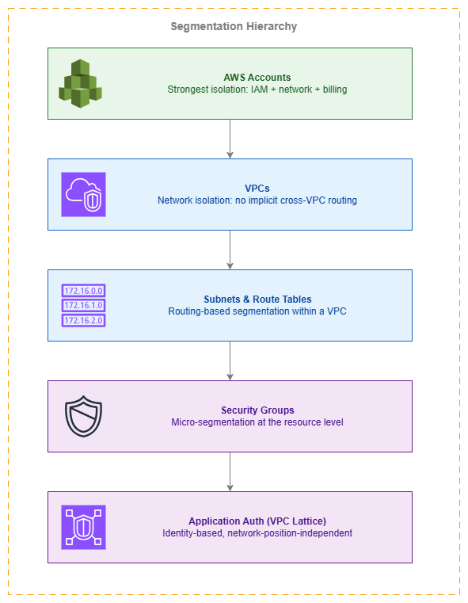

# ネットワークセグメンテーション {#network-segmentation}

!!! info "前提条件"
    このセクションでは、[Amazon VPC](../foundation/vpc.md)、[AWS Organizations](../foundation/organizations.md)、[AWS 内の接続性](../connectivity/within-aws.md)、および[境界コントロール](perimeter-inbound.md)に関する知識を前提としています。AWS ネットワーキングの基礎を初めて学ぶ方は、先にそれらのトピックを確認してください。

ネットワークセグメンテーションは任意の選択肢ではありません。侵害が「もし発生したら」ではなく「発生したとき」の爆発半径(blast radius)を限定する、根本的なセキュリティコントロールです。すべての AWS ネットワークは、アカウントレベルの分離からリソースごとのセキュリティグループに至るまで、複数のレイヤーでセグメント化される必要があります。問いかけるべきは「セグメント化すべきか?」ではなく、「何層のセグメンテーションが必要か、そして各層をどのメカニズムで強制するか?」です。

AWS はそれぞれ異なる強制特性、運用オーバーヘッド、コストを持つ 5 つの独立したレイヤーでセグメンテーションを提供します。最も強固な境界は上位(アカウント)にあり、最も細粒度のコントロールは下位(アプリケーション層の認証)にあります。適切に設計されたネットワークは複数のレイヤーを同時に活用します — ネットワークアーキテクチャに適用された多層防御(defense in depth)です。

このページはセグメンテーション階層に沿って構成されています。最も強固な分離境界(アカウント)から最も細粒度のコントロール(ID ベースのアプリケーション認証)へと順に説明します。各レイヤーは多層防御を強化するものであり、単一のレイヤーだけでは十分ではありません。


/// caption
セグメンテーション階層 — [Drawio ソース](../assets/security/segmentation-hierarchy.drawio)
///

<div class="grid cards" markdown>

*   :material-shield-account: **アカウントレベルの分離**

    ---

    AWS アカウントは最も強固な分離境界を提供します — IAM プリンシパル、ネットワーク名前空間、請求がそれぞれ独立しています。あるアカウントで侵害されたワークロードは、明示的なクロスアカウントアクセスなしに別のアカウントのリソースへ到達できません。

*   :material-lan-disconnect: **VPC の分離**

    ---

    VPC 間には暗黙のルーティングが存在しません。VPC 間の通信には明示的な接続性(ピアリング、Transit Gateway、Cloud WAN)が必要です。これにより、VPC はアカウント内の自然なトラスト境界となります。

*   :material-chart-pie: **Cloud WAN セグメント**

    ---

    リージョンをまたいだポリシー駆動型のネットワークセグメンテーションです。セグメントはルーティングレイヤーでどの VPC が通信できるかを定義し、ネットワークポリシードキュメントを通じて一元的に強制されます。

*   :material-security: **セキュリティグループによるマイクロセグメンテーション**

    ---

    参照ベースのルールによるリソースごとのトラフィックフィルタリングです。セキュリティグループを使用すると、IP アドレスや CIDR ブロックを管理することなく「サービス A はサービス B と通信できる」というルールを定義できます。

*   :material-shield-lock: **ID ベースのセグメンテーション**

    ---

    VPC Lattice の認証ポリシーは、ネットワーク上の位置ではなく呼び出し元の ID(IAM プリンシパル)に基づいてアクセスを強制します。ワークロードのアクセス権限は、どの VPC やサブネットで実行されているかに関わらず、ワークロードに追従します。

*   :material-eye: **セグメント間のインスペクション**

    ---

    AWS Network Firewall またはサードパーティのアプライアンスを、Cloud WAN のサービスインサーションまたは Transit Gateway のルーティングを通じてセグメント間に挿入し、トラスト境界でのディープパケットインスペクションを提供します。

</div>

## アカウントレベルの分離 — 最強の境界 {#account-level-isolation-the-strongest-boundary}

AWS アカウントは、利用可能な最も強力なセグメンテーションメカニズムです。各アカウントは、完全に独立した IAM 名前空間、ネットワーク名前空間、および請求エンティティです。アカウント間には暗黙的な接続性はなく、IAM プリンシパルの共有もなく、リソースクォータの共有もありません。

これが、マルチアカウントアーキテクチャが本番 AWS 環境のデフォルト推奨となっている理由です。異なる信頼レベルのワークロードを別々のアカウントに配置することで、あるアカウントの IAM プリンシパルが完全に侵害された場合でも、別のアカウントのリソースに直接アクセスすることはできません。

***重要なポイント:*** *アカウントレベルの分離は無料であり、ネットワーク設定も不要で、最強の爆発半径(blast-radius)封じ込めを提供します。最初のセグメンテーション判断として活用してください。*

### OU ベースのセグメンテーションパターン {#ou-based-segmentation-patterns}

AWS Organizations の OU は、セグメンテーション境界に自然にマッピングされます。

| OU 構造 | セグメンテーションの目的 | 例 |
| --- | --- | --- |
| **Security OU** | セキュリティツール(GuardDuty、Security Hub、ログアーカイブ)をワークロードアカウントから分離する | ワークロードの侵害が監査証跡の改ざんを防ぐ |
| **Infrastructure OU** | 共有ネットワーキング(Transit Gateway、Cloud WAN、DNS)を一元管理する | ネットワークチームが接続性を制御し、ワークロードチームはルーティングを変更できない |
| **Workloads / Prod OU** | 本番環境と非本番環境を分離する | 異なるコンプライアンス制御、異なるネットワーク検査ルール |
| **Workloads / Dev OU** | 実験用の低信頼環境 | 緩やかなセグメンテーション、本番セグメントへの接続なし |
| **Sandbox OU** | 実験用の完全分離 | 他の OU への接続なし。SCP により VPC ピアリングや TGW アタッチメントを禁止 |
| **Compliance OU** | 規制対象ワークロード(PCI、HIPAA)専用アカウント | 厳格な検査、専用 VPC、監査対応済み構成 |

### コストへの影響 {#cost-implications}

アカウントレベルのセグメンテーションは無料です。アカウントの作成に費用はかからず、アカウントごとのネットワーキング料金もなく、分離のためのデータ転送コストもありません(分離されたアカウントはデフォルトで接続性を持たないため)。コストが発生するのは、Transit Gateway アタッチメント、Cloud WAN アタッチメント、または VPC ピアリングを通じてアカウントを*接続する*ときです。これにより、アカウントは最もコスト効率の高いセグメンテーション境界となります。

## VPC レベルのセグメンテーション {#vpc-level-segmentation}

アカウント内において、VPC はネットワークレベルの分離を提供します。同一アカウント内の 2 つの VPC には暗黙的なルーティングが存在しないため、接続するにはピアリング、Transit Gateway アタッチメント、Cloud WAN アタッチメントなどの明示的な操作が必要です。

同一アカウント内のワークロードが以下の点で異なる場合は、VPC を分けて使用してください。

* **信頼レベル** — 管理プレーン VPC とデータプレーン VPC
* **接続要件** — インターネットアクセスが必要な VPC と、完全にプライベートである必要がある VPC
* **コンプライアンス範囲** — 厳格な検査を伴う PCI スコープの VPC と汎用 VPC
* **ライフサイクルまたはチームのオーナーシップ** — 異なるチームがそれぞれの VPC を独立して管理する

### VPC セグメンテーションにおける IPv6 の考慮事項 {#ipv6-considerations-for-vpc-segmentation}

VPC セグメンテーションは IPv6 トラフィックにも同様に適用されます。分離のために VPC を分ける場合は、以下の点を確認してください。

* 各 VPC に独自の IPv6 CIDR 割り当てがある(IPAM または Amazon 提供のもの)
* ルートテーブルが、分離すべき VPC 間に意図せず IPv6 接続を作成していない
* セキュリティグループに明示的な IPv6 ルールが含まれている — IPv4 ルールのみのセキュリティグループは、ENI に IPv6 アドレスが割り当てられている場合、IPv6 フィルタリングを提供しない

***重要なポイント:*** *セキュリティグループはステートフルですが、デフォルトではプロトコルを区別しません。リソースに IPv6 アドレスを割り当てる場合は、セキュリティグループに IPv6 ルールを明示的に追加する必要があります。IPv4 ルールが自動的に IPv6 に反映されることはありません。*

## サブネットとルートテーブル — ルーティングベースのセグメンテーション {#subnets-and-route-tables-routing-based-segmentation}

VPC 内では、サブネットとルートテーブルを組み合わせることでルーティングベースのセグメンテーションを実現します。同じ VPC を共有していても、異なるサブネットに配置されたリソースは、それぞれ異なるルーティング動作(パブリック・プライベート・アイソレート)を持つことができます。

主なセグメンテーションパターンは以下のとおりです。

| サブネット層 | ルートテーブルの動作 | ユースケース |
| --- | --- | --- |
| **パブリック** | インターネットゲートウェイへのルート | ロードバランサー、踏み台ホスト、NAT ゲートウェイ |
| **プライベート** | NAT ゲートウェイへのルート(またはインターネットルートなし) | アプリケーションワークロード、データベース |
| **アイソレート** | VPC 外へのルートなし | 機密データストア、コンプライアンス対象リソース |
| **ファイアウォール** | Network Firewall エンドポイント経由のルート | VPC に出入りするトラフィックのインスペクション層 |

ルートテーブルは IP ルーティング層でセグメンテーションを強制します。アイソレートサブネット内のリソースは、ルートが存在しないため物理的にインターネットへ到達できません。これはセキュリティグループの拒否ルールよりも強力です。フィルタリング層ではなくルーティング層で機能するためです。

## セキュリティグループ — マイクロセグメンテーション {#security-groups-micro-segmentation}

セキュリティグループは、AWS において最も細粒度のネットワークセグメンテーションを提供します。ENI 単位(実質的にはリソース単位)でトラフィックをフィルタリングします。セキュリティグループを単なるファイアウォールではなくセグメンテーションツールとして機能させる重要な特徴が、**参照ベースのルール**です。

### ワークロードセグメンテーションのための参照ベースルール {#reference-based-rules-for-workload-segmentation}

CIDR ブロックからのトラフィックを許可する代わりに、別のセキュリティグループからのトラフィックを許可します。

```yaml
# Allow traffic from the web tier security group
SecurityGroupIngress:
  - IpProtocol: tcp
    FromPort: 8080
    ToPort: 8080
    SourceSecurityGroupId: sg-web-tier
```

これにより、「Web 層のリソースのみがポート 8080 でアプリケーション層に到達できる」という論理的なセグメンテーション境界が生まれます。このルールは、ワークロードがどのサブネットや IP アドレスを使用していても適用されます。Web 層をスケールアウト(インスタンスの追加や IP アドレスの変更)しても、セグメンテーションルールは正しく機能し続けます。

### デュアルスタックのセキュリティグループルール {#dual-stack-security-group-rules}

セキュリティグループでは、IPv4 と IPv6 のトラフィックに対して個別のルールが必要です。よくある間違いは、IPv4 のインバウンドルールを追加しながら IPv6 を忘れることです。これにより、意図した制限なしに IPv6 でリソースにアクセスできてしまいます(あるいはその逆で、許可すべき IPv6 をブロックしてしまう場合もあります)。

```yaml
# Correct: explicit rules for both address families
SecurityGroupIngress:
  - IpProtocol: tcp
    FromPort: 443
    ToPort: 443
    CidrIp: 10.0.0.0/8          # IPv4 corporate range
  - IpProtocol: tcp
    FromPort: 443
    ToPort: 443
    CidrIpv6: 2001:db8:cafe::/48  # IPv6 corporate range
```

参照ベースのルール(送信元セキュリティグループ)を使用する場合、そのセキュリティグループのメンバーからの IPv4 と IPv6 の両方のトラフィックにルールが適用されるため、ルールを重複して定義する必要はありません。これも、CIDR ベースのルールよりも参照ベースのルールを優先すべき理由の一つです。

***重要なポイント:*** *参照ベースのセキュリティグループルールは、推奨されるマイクロセグメンテーションの仕組みです。IP アドレッシングからセグメンテーションを切り離し、IPv4 と IPv6 の両方に自動的に対応し、ワークロードが増加してもルールを更新することなくスケールできます。*

## Cloud WAN セグメント — ポリシー駆動型ネットワークセグメンテーション {#cloud-wan-segments-policy-driven-network-segmentation}

AWS Cloud WAN セグメントは、マルチリージョン全体のネットワークにわたって、ルーティングレイヤーでネットワークセグメンテーションを提供します。各セグメントは独立したルーティングドメインであり、異なるセグメントにアタッチされた VPC は、ネットワークポリシー内のセグメント共有またはサービス挿入ルールを通じて明示的に許可しない限り、相互通信できません。

セグメントは以下のニーズがある場合に適切なツールです。

* 複数リージョンにわたる一貫したセグメンテーションポリシー
* 個々のアカウントオーナーが回避できない集中管理型の適用
* アタッチメントメタデータ(タグ、アカウント、リージョン)に基づいたセグメントの自動割り当て
* サービス挿入によるセグメント間インスペクション

### Cloud WAN セグメントと Transit Gateway ルートテーブルの比較 {#cloud-wan-segments-vs-transit-gateway-route-tables}

どちらもルーティングドメインベースのセグメンテーションを提供しますが、スコープと管理モデルが異なります。

| 比較軸 | Cloud WAN セグメント | Transit Gateway ルートテーブル |
| --- | --- | --- |
| **スコープ** | グローバル(マルチリージョン、単一ポリシー) | リージョン単位(TGW ごと) |
| **管理** | 宣言型ネットワークポリシー | TGW ごとの手動ルートテーブル設定 |
| **自動化** | タグベースのアタッチメント受け入れ | 手動またはカスタム自動化 |
| **サービス挿入** | 組み込みのポリシー構成 | インスペクション VPC を経由した手動ルーティング |
| **コスト** | コアネットワークエッジ + アタッチメント + データ処理 | TGW アタッチメント + データ処理 |
| **最適な用途** | アカウント数 10 以上、マルチリージョン、または集中ガバナンスが必要な組織 | 単一リージョン、小規模環境、または Cloud WAN への移行期間中 |

新規のマルチアカウント展開では、Cloud WAN セグメントが推奨アプローチです。既存の Transit Gateway 環境では、TGW と Cloud WAN をピアリングして段階的に移行できます(移行ガイダンスについては [AWS 内の接続性](../connectivity/within-aws.md) を参照してください)。

### ネットワークセグメンテーション適用のコストへの影響 {#cost-implications-of-network-segmentation-enforcement}

アカウントと VPC によるセグメンテーションは無料であり、分離がデフォルトの状態です。コストが発生するのは、セグメントを接続してルーティングレイヤーでポリシーを適用する場合です。

| メカニズム | コストの構成要素 | 適用タイミング |
| --- | --- | --- |
| **アカウント/VPC 分離** | 無料 | 常時(分離がデフォルト) |
| **Transit Gateway ルートテーブル** | アタッチメント時間単位 + GB あたりデータ処理 | リージョン単位のセグメンテーション |
| **Cloud WAN セグメント** | コアネットワークエッジ時間単位 + アタッチメント時間単位 + GB あたりデータ処理 | マルチリージョンまたはポリシー駆動型セグメンテーション |
| **Network Firewall(インスペクション)** | ファイアウォールエンドポイント時間単位 + GB あたりデータ処理 | セグメント間インスペクション |
| **セキュリティグループ** | 無料 | 常時 |
| **VPC Lattice 認証ポリシー** | リクエスト単位の料金(Lattice データ処理に含まれる) | アプリケーションレイヤーのセグメンテーション |

***重要なポイント:*** *最も安価なセグメンテーションが最も強力です。アカウントと VPC の分離にはコストがかかりません。まず適切なアカウント構造に投資し、セグメント間の接続が必要な場合にのみ、ルーティングレイヤーのセグメンテーション(Cloud WAN/TGW)を追加してください。*

## VPC Lattice によるアイデンティティベースのセグメンテーション {#identity-based-segmentation-with-vpc-lattice}

従来のネットワークセグメンテーションは「ネットワークパケット X はネットワークエンドポイント Y に到達できるか？」という問いに答えるものです。一方、アイデンティティベースのセグメンテーションは異なる問いに答えます。「プリンシパル A はサービス B を呼び出す権限があるか？」という問いです。VPC Lattice の認証ポリシーは、このアプリケーション層のセグメンテーションを実現します。

### ネットワークセグメンテーションだけでは不十分なケース {#when-network-segmentation-is-not-enough}

ネットワークセグメンテーションは、次のような状況では限界を迎えます。

* 複数のサービスが同じ VPC またはサブネットを共有している場合（コンテナ化された環境では一般的）
* 正当なビジネス上の理由から、サービスがセグメント境界を越えて通信する必要がある場合
* ネットワーク単位ではなく、サービス単位のアクセス制御が必要な場合
* ワークロードがネットワーク上の位置を移動する場合（オートスケーリング、コンテナオーケストレーション）

このような場合、VPC Lattice の認証ポリシーによるアイデンティティベースのセグメンテーションを使用することで、ネットワーク上の位置に関わらずワークロードに追従する、より細かい粒度の制御が可能になります。

### ゼロトラストパターン {#zero-trust-patterns}

VPC Lattice の認証ポリシーは、ネットワークの位置ではなく検証済みのアイデンティティに基づいてアクセスを判断する、ゼロトラストネットワーキングパターンを実現します。

```json
{
  "Version": "2012-10-17",
  "Statement": [
    {
      "Effect": "Allow",
      "Principal": {
        "AWS": "arn:aws:iam::111122223333:role/OrderService"
      },
      "Action": "vpc-lattice-svcs:Invoke",
      "Resource": "arn:aws:vpc-lattice:us-east-1:444455556666:service/svc-payments/*",
      "Condition": {
        "StringEquals": {
          "vpc-lattice-svcs:RequestMethod": "POST"
        }
      }
    }
  ]
}
```

このポリシーは「アカウント 111122223333 の OrderService ロールのみが、ペイメントサービスに POST できる」ということを意味します。OrderService がどの VPC、サブネット、または IP アドレスから実行されているかは問いません。これは、ネットワークの設定ミスによって回避できないセグメンテーションです。

***重要なポイント:*** *ネットワークセグメンテーションとアイデンティティベースのセグメンテーションは、競合するものではなく補完し合うものです。インフラストラクチャ層での影響範囲を限定するためにネットワークセグメンテーションを使用し、アプリケーション層での最小権限を強制するためにアイデンティティベースのセグメンテーションを使用してください。*

## セグメント間インスペクションのためのサービス挿入 {#service-insertion-for-inter-segment-inspection}

セグメント間で通信が必要な場合、脅威対策・コンプライアンス・ポリシー適用を目的として、そのトラフィックをインスペクションする必要があります。AWS Cloud WAN のサービス挿入と Transit Gateway ルーティングはいずれも、AWS Network Firewall またはサードパーティアプライアンスを実行するインスペクション VPC を経由してセグメント間トラフィックを誘導する構成をサポートしています。

### Cloud WAN サービス挿入パターン {#cloud-wan-service-insertion-pattern}

Cloud WAN ネットワークポリシーにインスペクションルールを定義し、特定のセグメント間のトラフィックをインスペクション VPC 経由でルーティングします。

```json
{
  "segment-actions": [
    {
      "action": "send-via",
      "segment": "production",
      "via": {
        "network-function-groups": ["inspection-firewalls"]
      },
      "when-sent-to": {
        "segments": ["hybrid", "shared-services"]
      }
    }
  ]
}
```

この設定により、`production` セグメントから `hybrid` または `shared-services` 宛てのすべてのトラフィックがインスペクションファイアウォールを経由するよう強制されます。これは手動のルートテーブル操作ではなく、ネットワークポリシーレベルで適用されます。

### AWS PrivateLink — 選択的な公開によるセグメンテーション {#aws-privatelink-segmentation-through-selective-exposure}

AWS PrivateLink は異なるセグメンテーションモデルを提供します。ネットワークを接続してからトラフィックをフィルタリングするのではなく、ネットワークレベルの接続性を一切持たせずに特定のサービスのみを境界を越えて公開します。コンシューマー VPC にはプロバイダーのサービスに到達する ENI が付与されますが、プロバイダーネットワーク内のそれ以外のリソースには到達できません。

これはフィルタリングによるセグメンテーションではなく、設計によるセグメンテーションです。以下のケースで PrivateLink の使用を検討してください。

* ネットワークレベルのアクセスを一切付与せずに、単一のサービスを別のアカウントに公開したい場合
* プロバイダーとコンシューマーが特定のサービス以外で IP レベルの接続性を持つべきでない場合
* VPC ピアリングを使用せずにサードパーティやパートナーにサービスを公開する必要がある場合

## ベストプラクティス {#best-practices}

### セグメンテーションをトップダウンで設計する {#design-segmentation-top-down}

#### アカウント境界から始め、レイヤーを追加する {#start-with-account-boundaries-then-add-layers}

セグメンテーション階層は、上位(アカウント)から下位に向けて設計します。最もよくある失敗は、すべてを単一のアカウントと VPC に配置したまま、セキュリティグループと NACL から設計を始めることです。これは階層を逆転させており、最も弱く運用上の複雑さが高いコントロールに依存しながら、最も強力でコストの低いコントロールを無視することになります。

正しい順序:

1. **アカウント** — 信頼レベル、コンプライアンス範囲、チームのオーナーシップによってワークロードを分離する
2. **VPC** — アカウント内で、接続要件とライフサイクルによって分離する
3. **Cloud WAN セグメント / TGW ルートテーブル** — ルーティングレイヤーでどの VPC が通信できるかを制御する
4. **サブネットとルートテーブル** — VPC 内で、ルーティング要件(パブリック/プライベート/分離)によって分離する
5. **セキュリティグループ** — 参照ベースのルールによるリソース単位のマイクロセグメンテーション
6. **VPC Lattice 認証ポリシー** — サービス単位のアイデンティティベースのアクセス制御

各レイヤーが多層防御を強化します。あるレイヤーで障害が発生した場合(例: セキュリティグループの設定ミス)、上位のレイヤー(ワークロードが別アカウントの分離された VPC に存在すること)によって封じ込められます。

#### セグメンテーションをコンプライアンス要件に合わせる {#align-segmentation-with-compliance-requirements}

コンプライアンスフレームワーク(PCI DSS、HIPAA、SOC 2)は、規制対象ワークロードに対してネットワークセグメンテーションを義務付けていることが多くあります。コンプライアンス範囲をセグメンテーション境界にマッピングしてください。

| コンプライアンス要件 | セグメンテーションアプローチ |
| --- | --- |
| **PCI DSS CDE の分離** | 専用アカウント + 専用 VPC + 必須インスペクション付き Cloud WAN セグメント |
| **HIPAA PHI の保護** | 専用アカウント + 分離サブネット + 認可済みロールへのアクセスを制限するセキュリティグループ |
| **SOC 2 環境の分離** | 本番環境と非本番環境を別々の OU に分離 + インスペクションなしのクロス OU 接続を禁止 |
| **データレジデンシー** | リージョン間のデータフローを防止するリージョン固有の Cloud WAN セグメント |

***重要なポイント:*** *コンプライアンス主導のセグメンテーションは、アカウントと OU の境界にマッピングされている場合に監査が容易になります。監査担当者にとって、「すべての PCI ワークロードが PCI OU に存在する」ことを確認する方が、「すべての PCI ワークロードに正しいセキュリティグループルールが設定されている」ことを確認するよりもはるかに簡単です。*

### マイクロセグメンテーションを効果的に実装する {#implement-micro-segmentation-effectively}

#### ワークロードロールごとに 1 つのセキュリティグループを使用する {#use-one-security-group-per-workload-role}

各論理ワークロードロール(Web 層、アプリケーション層、データベース層、監視エージェント)に専用のセキュリティグループを割り当てます。マイクロセグメンテーションの目的を損なう「内部すべて許可」の共有セキュリティグループは避けてください。

#### CIDR ベースのルールより参照ベースのルールを優先する {#prefer-reference-based-rules-over-cidr-based-rules}

参照ベースのルール(送信元/送信先のセキュリティグループ)は保守性が高く、IPv4/IPv6 を自動的に処理し、ルールを更新せずにスケールできます。CIDR ベースのルールは、外部ネットワーク(オンプレミスの範囲、パートナーの CIDR)を参照する場合や、クロス VPC 参照が不可能な場合にのみ使用してください。

#### セキュリティグループのルールを定期的に監査する {#audit-security-group-rules-regularly}

セキュリティグループはルールが蓄積されていきます。未使用のルールは攻撃対象領域を拡大します。VPC フローログとセキュリティグループの使用状況分析を活用して、トラフィックを通過させていないルールを特定し、削除してください。

### セグメンテーションを一元的に適用する {#enforce-segmentation-centrally}

#### SCP を使用してセグメンテーションのバイパスを防止する {#use-scps-to-prevent-segmentation-bypass}

Service Control Policies(SCP)を使用することで、ワークロードアカウントが VPC ピアリング接続、Transit Gateway アタッチメント、またはセグメンテーション設計をバイパスするその他の接続を作成することを防止できます。ネットワーキングチームが接続を管理し、ワークロードチームはそれを利用する形にします。

直接 VPC ピアリングを拒否する SCP の例(トラフィックを集中管理ネットワーク経由に強制):

```json
{
  "Version": "2012-10-17",
  "Statement": [
    {
      "Sid": "DenyVPCPeering",
      "Effect": "Deny",
      "Action": [
        "ec2:CreateVpcPeeringConnection",
        "ec2:AcceptVpcPeeringConnection"
      ],
      "Resource": "*"
    }
  ]
}
```

#### ネットワーク接続を専用アカウントに集約する {#centralize-network-connectivity-in-a-dedicated-account}

Transit Gateway、Cloud WAN コアネットワーク、および共有インスペクション VPC は、Infrastructure OU 内の専用ネットワーキングアカウントに配置します。AWS RAM を通じてワークロードアカウントへ接続を共有します。これにより、ネットワーキングチームがセグメンテーションの適用に対する制御を維持できます。

### IPv6 セグメンテーションを計画する {#plan-for-ipv6-segmentation}

#### 両方のアドレスファミリーに同一のセグメンテーションを適用する {#apply-identical-segmentation-to-both-address-families}

IPv4 に適用するすべてのセグメンテーションコントロールは、IPv6 にも同様に適用する必要があります。これには以下が含まれます。

* セキュリティグループルール(IPv6 CIDR には個別のルールが必要。参照ベースのルールは両方を自動的にカバー)
* ネットワーク ACL(使用する場合 — IPv6 の個別ルールが必要)
* ルートテーブル(IPv6 ルートは個別のエントリ)
* Network Firewall ルール(IPv6 ルールグループを含める必要あり)
* Cloud WAN ルーティング(ネットワークポリシーでのデュアルスタックサポート)

#### IPv6 をセグメンテーションのバイパスに利用させない {#avoid-ipv6-as-a-segmentation-bypass}

よくある脆弱性として、ワークロードに IPv6 アドレスが割り当てられているにもかかわらず、セキュリティグループに IPv4 ルールしか含まれていないケースがあります。これにより、事実上セグメンテーションされていない IPv6 ネットワークが生まれます。デュアルスタック VPC 内のすべてのセキュリティグループを監査し、IPv6 ルールが意図したセグメンテーションポスチャと一致していることを確認してください。

## セグメンテーションと他のサービスの組み合わせ {#combining-segmentation-with-other-services}

| 組み合わせ | セグメンテーションが提供するもの | 他のサービスが提供するもの |
| --- | --- | --- |
| **セグメンテーション + AWS Network Firewall** | セグメント間の分離（ルーティングレイヤー） | セグメント境界でのディープパケットインスペクション、IDS/IPS、ドメインフィルタリング |
| **セグメンテーション + VPC Lattice** | ネットワークレイヤーでの影響範囲の封じ込め | ネットワーク上の位置に依存しない、アプリケーションレイヤーの ID ベースアクセス制御 |
| **セグメンテーション + AWS PrivateLink** | セグメント間のネットワークレベル接続の排除 | ルーティングを開放せずにセグメント境界を越えた選択的なサービス公開 |
| **セグメンテーション + AWS Cloud WAN** | セグメント定義と分離ポリシー | グローバルな適用、アタッチメントの自動化、サービス挿入のオーケストレーション |
| **セグメンテーション + AWS Organizations SCPs** | アカウント間のネットワークレベル分離 | セグメンテーション回避を防ぐ IAM レベルの制御（ピアリングの拒否、TGW アタッチメントの拒否） |
| **セグメンテーション + VPC Flow Logs** | トラフィック境界の適用 | セグメント境界で流れている（または拒否されている）トラフィックの可視化 |
| **セグメンテーション + AWS Firewall Manager** | 一貫したセグメンテーションの意図 | アカウント横断でのセキュリティグループポリシーの一元的な適用 |

## ドキュメント {#documentation}

<div class="grid cards" markdown>

*   :material-file-document: **VPC セキュリティのベストプラクティス**

    ---

    セキュリティグループ、NACL、および VPC レベルのセキュリティコントロールを網羅した AWS 公式ドキュメントです。

    [:octicons-arrow-right-24: VPC セキュリティ](https://docs.aws.amazon.com/vpc/latest/userguide/vpc-security-best-practices.html)

*   :material-file-document: **AWS Cloud WAN セグメント**

    ---

    Cloud WAN ネットワークポリシーにおけるセグメントの作成と管理に関するドキュメントです。

    [:octicons-arrow-right-24: Cloud WAN セグメント](https://docs.aws.amazon.com/vpc/latest/cloudwan/cloudwan-policy-segments.html)

*   :material-file-document: **VPC のセキュリティグループ**

    ---

    デュアルスタック構成を含む、セキュリティグループのルール、制限、および動作に関する完全なリファレンスです。

    [:octicons-arrow-right-24: セキュリティグループ](https://docs.aws.amazon.com/vpc/latest/userguide/vpc-security-groups.html)

*   :material-file-document: **Amazon VPC Lattice 認証ポリシー**

    ---

    VPC Lattice 認証ポリシーを使用してサービスのアイデンティティベースのアクセス制御を設定する方法を説明します。

    [:octicons-arrow-right-24: 認証ポリシー](https://docs.aws.amazon.com/vpc-lattice/latest/ug/auth-policies.html)

*   :material-post: **Cloud WAN によるマルチアカウントネットワークの構築**

    ---

    マルチアカウント環境における Cloud WAN を使ったセグメンテーションパターンを解説したアーキテクチャウォークスルーです。

    [:octicons-arrow-right-24: ブログ記事](https://aws.amazon.com/blogs/networking-and-content-delivery/category/networking-content-delivery/aws-cloud-wan/)

*   :material-file-document: **AWS Network Firewall デプロイメントモデル**

    ---

    セグメント間のトラフィック検査に向けた Network Firewall のデプロイに関するリファレンスアーキテクチャです。

    [:octicons-arrow-right-24: デプロイメントモデル](https://docs.aws.amazon.com/network-firewall/latest/developerguide/architectures.html)

</div>

## 関連ページ {#related-pages}

**基礎トピックとの関係:**

* **[Amazon VPC](../foundation/vpc.md)**: VPC はアカウント内における主要なネットワークレベルのセグメンテーション境界です。このページは VPC 分離の概念を基に構成されています。
* **[AWS Organizations](../foundation/organizations.md)**: アカウントおよび OU の構造が、最も強固なセグメンテーション境界を定義します。Organization の設計はセグメンテーションに関する意思決定です。
* **[サブネット](../foundation/subnets.md)**: サブネット設計とルートテーブルの設定により、VPC 内のルーティングベースのセグメンテーションを実装します。

**接続性トピックとの関係:**

* **[AWS 内の接続性](../connectivity/within-aws.md)**: Cloud WAN セグメントと Transit Gateway ルートテーブルについては、そちらで詳しく説明しています。このページでは、接続性の仕組みではなく、セグメンテーションの特性に焦点を当てています。

**その他のセキュリティトピックとの関係:**

* **[境界コントロール](perimeter-inbound.md)**: 境界コントロールはネットワークエッジを保護し、セグメンテーションは内部トラフィックフローを制御します。どちらも必要です。
* **[アウトバウンドコントロール](outbound.md)**: アウトバウンドフィルタリングはセグメントごとに適用できます(セグメントによって異なるエグレスルールを設定可能)。
