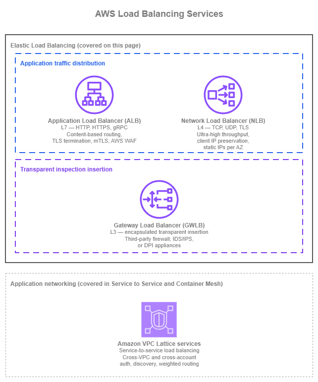

# 로드 밸런싱 {#load-balancing}

!!! info "사전 요구 사항"
    이 섹션은 [Amazon VPC](../foundation/vpc.md), [서브넷](../foundation/subnets.md), 그리고 [AWS 내부 연결](../connectivity/within-aws.md) 및 [인터넷 연결](../connectivity/internet.md) 페이지에서 다루는 연결 패턴에 대한 이해를 전제로 합니다. AWS 네트워킹 기초가 처음이라면 해당 주제를 먼저 검토하세요.

AWS Elastic Load Balancing은 세 가지 관리형 서비스를 통해 여러 대상에 트래픽을 분산합니다. Application Load Balancer(ALB)는 최대 100개의 리스너 규칙에 걸쳐 콘텐츠 기반 라우팅을 지원하는 L7 HTTP/HTTPS/gRPC용이며, Network Load Balancer(NLB)는 가용 영역별 정적 IP와 밀리초 미만의 지연 시간으로 초당 수백만 건의 연결을 처리하는 L4 TCP/UDP/TLS용입니다. Gateway Load Balancer(GWLB)는 GENEVE 캡슐화를 사용하여 서드파티 방화벽 어플라이언스를 투명하게 삽입하는 용도입니다. 이 세 서비스는 서로 대체 가능하지 않습니다. 각각은 서로 다른 트래픽 유형과 아키텍처 내 역할을 위해 설계되었습니다.

이 페이지는 세 가지 Elastic Load Balancing 서비스를 애플리케이션 아키텍처의 구성 요소로 다룹니다. 각 서비스의 기능, 올바른 구성 방법, 다른 서비스 대신 선택해야 하는 경우, 그리고 다른 AWS 서비스와 결합하는 방법을 설명합니다.

[Amazon VPC Lattice](https://docs.aws.amazon.com/vpc-lattice/latest/ug/what-is-vpc-lattice.html) 서비스 *역시* 관리형 상태 확인 및 가중치 기반 라우팅을 통해 대상 간에 트래픽을 로드 밸런싱합니다. VPC Lattice의 로드 밸런싱 기능을 포함한 전체 내용은 [서비스 간 연결](service-to-service.md) 및 [컨테이너 메시](container-mesh.md) 페이지에서 다룹니다. VPC Lattice의 가치는 로드 밸런싱을 훨씬 넘어 크로스 VPC 및 크로스 계정 서비스 검색, IAM 기반 인증, 서비스 간 연결로 확장되기 때문입니다. 이 페이지는 세 가지 Elastic Load Balancing 서비스에 집중하며, VPC Lattice에 대한 언급은 해당 서비스가 적합한 위치를 가리키는 참조일 뿐 심층적인 설명은 아닙니다.

/// caption
로드 밸런싱 서비스 — [Drawio 소스](../assets/application-networking/load-balancing-services.drawio)
///

Application Load Balancer(ALB)와 Network Load Balancer(NLB)는 애플리케이션 트래픽을 대상에 분산합니다. Gateway Load Balancer(GWLB)는 근본적으로 다른 역할을 수행합니다. 서드파티 네트워크 어플라이언스(방화벽, 침입 탐지, 심층 패킷 검사) 플릿을 데이터 경로에 투명하게 삽입합니다. GWLB를 ALB나 NLB와 동등한 서비스로 취급하는 것이 가장 흔한 혼동의 원인이므로, 이 페이지에서는 해당 차이점을 명확히 설명합니다. Amazon VPC Lattice는 해당 서비스도 트래픽을 로드 밸런싱하기 때문에 위 다이어그램에 참조로 표시되어 있지만, 주요 범위는 단일 워크로드에 대한 ELB 방식의 로드 밸런싱이 아닌 서비스 간 애플리케이션 네트워킹입니다. 그렇기 때문에 다이어그램에서 별도 그룹으로 표시되며, 이 섹션의 다른 곳에서 전체 내용을 다룹니다.

## Application Load Balancer (ALB) {#application-load-balancer-alb}

[Application Load Balancer](https://docs.aws.amazon.com/elasticloadbalancing/latest/application/introduction.html)는 L7에서 동작합니다. TLS를 종료하고, HTTP/HTTPS 및 gRPC를 디코딩하며, 호스트 헤더, 경로, HTTP 메서드, 쿼리 문자열, 소스 IP 등 요청 자체의 속성을 기반으로 각 요청을 라우팅합니다. 대상은 대상 그룹에 등록되며 EC2 인스턴스, IP 주소, 또는 AWS Lambda 함수가 될 수 있습니다. ALB는 워크로드 VPC 내에 위치하며, 운영 관리 없이 수평으로 확장되고, [AWS WAF](https://docs.aws.amazon.com/waf/latest/developerguide/waf-chapter.html), Amazon CloudFront, AWS Global Accelerator, AWS Certificate Manager, Auto Scaling, 컨테이너 서비스(Amazon ECS, Amazon EKS)와 기본적으로 통합됩니다.

### 주요 기능 {#key-capabilities}

*   :material-router-network: **콘텐츠 기반 라우팅**

    ---

    리스너 규칙이 호스트 헤더, 경로, 메서드, 쿼리 문자열, 소스 IP, 또는 사용자 정의 헤더를 기준으로 요청을 라우팅하므로, 단일 ALB가 하나의 DNS 이름으로 여러 서비스를 처리할 수 있습니다.

*   :material-key-variant: **TLS 및 상호 TLS**

    ---

    ACM 발급 인증서를 사용하여 워크로드 VPC 엣지에서 TLS를 종료하고, 패스스루 또는 검증 모드의 상호 TLS를 통해 X.509 인증서로 클라이언트를 인증합니다.

*   :material-shield-bug: **AWS WAF 통합**

    ---

    ALB에 리전 AWS WAF 웹 ACL을 직접 연결하여 요청 계층에서 관리형 규칙 그룹, 사용자 정의 규칙, 속도 제한을 적용하고, AWS Firewall Manager를 통해 중앙에서 관리합니다.

*   :material-trending-up: **자동 대상 가중치(Automatic Target Weights)**

    ---

    이상 감지 기능이 5xx, TCP, 또는 TLS 오류를 높은 비율로 반환하는 대상을 식별하고, (가중 랜덤 알고리즘과 함께) 해당 대상으로의 트래픽을 전환하여 헬스 체크를 통과하는 그레이 장애를 완화합니다.

*   :material-package-variant-closed: **다양한 기본 대상 유형**

    ---

    동일 리전 내 EC2 인스턴스, 프라이빗 IP, Lambda 함수로 라우팅하며, Auto Scaling, ECS, EKS 컨트롤러를 통해 대상 그룹을 관리합니다.

*   :material-internet: **듀얼 스택 및 IPv6**

    ---

    듀얼 스택(IPv4 + IPv6) 리스너 또는 IPv6 전용 리스너를 실행하여 변환 없이 네이티브 IPv6 클라이언트에 도달하고, 워크로드 요구에 따라 IPv4 또는 IPv6로 백엔드에 연결합니다.

### Application Load Balancer 모범 사례 {#application-load-balancer-best-practices}

#### 수명 주기를 소유하는 주체에 따라 대상 유형 선택 {#choose-target-type-by-what-owns-the-lifecycle}

ALB 대상 그룹은 세 가지 대상 유형(인스턴스, IP, Lambda)을 지원하며, 적합한 유형은 대상의 수명 주기를 제어하는 주체에 따라 결정됩니다. 아래 표는 가장 일반적인 워크로드 유형을 정리한 것입니다.

| 워크로드 | 대상 유형 | 비고 |
| --- | --- | --- |
| Auto Scaling 그룹의 EC2 | 인스턴스 | Auto Scaling 그룹이 인스턴스를 자동으로 등록 및 등록 해제합니다. |
| Auto Scaling 경로 외부의 워크로드(피어링된 VPC, Direct Connect 또는 VPN을 통한 하이브리드, 수동 관리 IP) | IP | VPC 경계를 넘을 수 있는 유일한 대상 유형이며, 인스턴스 대상은 동일 VPC 내에서만 사용 가능합니다. |
| Lambda 함수 | Lambda | ALB가 함수를 직접 호출합니다. 저트래픽 엔드포인트, 단순 API, 또는 HTTP 프론트 도어를 이벤트 기반 백엔드에 연결할 때 유용합니다. |
| Fargate의 ECS, 또는 `awsvpc` 모드의 EC2 ECS | IP | 각 태스크가 자체 ENI를 가지며, ECS가 태스크 IP를 대상 그룹에 등록합니다. |
| `bridge` 또는 `host` 모드의 EC2 ECS | 인스턴스 | 로드 밸런서가 호스트로 라우팅하고, 호스트의 포트 매핑이 컨테이너로 전달합니다. |
| [AWS Load Balancer Controller](https://docs.aws.amazon.com/eks/latest/userguide/aws-load-balancer-controller.html)를 통한 EKS | IP (기본값) | Amazon VPC CNI 플러그인을 통해 파드 IP로 직접 라우팅합니다. Fargate 파드에 필수이며, `kube-proxy` 홉을 피할 수 있어 신규 클러스터에 권장됩니다. 레거시 `NodePort` 모델은 인스턴스 대상을 사용하지만 더 이상 기본값이 아닙니다. |

단일 대상 그룹에서 대상 유형을 혼합하는 것은 지원되지 않으므로, 대상 그룹당 하나의 유형을 선택하세요.

#### 로드 밸런서가 아닌 애플리케이션에 맞게 헬스 체크 설계 {#design-health-checks-for-the-application-not-the-load-balancer}

헬스 체크는 ALB가 대상이 트래픽을 처리할 준비가 되었는지 판단하는 유일한 신호입니다. 잘못 구성된 헬스 체크는 비정상 대상을 순환에 유지하거나(무음 오류), 정상 대상을 제외시킵니다(예방 가능한 장애). 애플리케이션이 실제로 보장할 수 있는 내용에 맞게 체크를 구성하세요.

* **전용 헬스 체크 경로를 사용**하여 애플리케이션의 핵심 의존성(캐시, 데이터베이스 연결, 다운스트림 서비스 가용성)을 검증하고, 대상이 실제 요청을 처리할 수 있을 때만 성공을 반환하도록 합니다. 의존성을 확인하지 않는 경로에서 반환되는 `200 OK`는 거짓 신호입니다.
* **인터벌과 임계값을 애플리케이션의 복구 시간에 맞게 조정**합니다. 기본값(30초 인터벌, 정상 5회/비정상 2회 임계값)은 많은 워크로드에 적합하지만, 워밍업에 60초가 필요한 느린 시작 컨테이너는 안정 상태의 EC2 인스턴스와 다른 설정이 필요합니다.
* **가능하면 헬스 체크 프로토콜을 리스너 프로토콜과 일치**시킵니다(HTTPS 리스너에는 HTTPS 헬스 체크). 이렇게 하면 실제 트래픽과 동일한 TLS 경로를 체크합니다. 대상이 TLS를 직접 종료할 수 없지만 리스너가 종료하는 경우에만 HTTP를 사용하세요.

#### 워크로드에 맞는 라우팅 알고리즘 사용 {#use-the-routing-algorithm-the-workload-needs}

ALB는 대상 그룹 수준에서 세 가지 라우팅 알고리즘을 지원합니다. 라운드 로빈은 대부분의 워크로드에 적합하며, 일치하는 워크로드 요구 없이 다른 알고리즘으로 전환하면 이점 없이 잡음만 늘리기 쉽습니다.

| 알고리즘 | 사용 시점 | 비고 |
| --- | --- | --- |
| **라운드 로빈** *(기본값)* | 대상이 상태 비저장이고 동질적이며, 요청 처리 시간이 균일하고, 트래픽을 대략 균등하게 분산할 수 있는 경우 | 대부분의 HTTP/HTTPS 워크로드에 적합한 시작점입니다. |
| **최소 미처리 요청** | 요청당 처리 시간이 크게 다른 경우(가변 지연 백엔드, 혼합 워크로드 대상) | 진행 중인 요청이 가장 적은 대상으로 새 요청을 라우팅하므로, 느린 대상에 요청이 쌓이지 않습니다. |
| **가중 랜덤** | 워크로드가 그레이 장애에 민감하여 자동 대상 가중치(ATW)를 통한 이상 완화가 필요하거나, 라운드 로빈과 다른 확률적 분산이 필요한 경우 | ATW 활성화에 필수입니다. ATW는 5xx, TCP, 또는 TLS 오류를 높은 비율로 반환하는 대상으로부터 트래픽을 자동으로 전환합니다. |

#### 워크로드에 필요한 경우 이상 완화 및 동시성 제어 사용 {#use-anomaly-mitigation-and-concurrency-control-where-the-workload-needs-them}

두 가지 대상 그룹 수준 기능이 일반 로드 밸런싱을 넘어선 트래픽 조정을 처리하며, 각각 다른 문제를 해결합니다.

| 기능 | 사용 시점 | 동작 방식 | 제약 사항 |
| --- | --- | --- | --- |
| **자동 대상 가중치(ATW)** | 대상이 헬스 체크를 통과하지만 5xx, TCP, 또는 TLS 오류를 높은 비율로 반환하는 경우(CPU 과부하, 의존성 장애, 잠재적 버그로 인한 그레이 장애) | 이상 감지는 정상 대상이 3개 이상인 HTTP/HTTPS 대상 그룹에서 자동으로 활성화됩니다. 실제 트래픽 전환을 활성화하려면 **가중 랜덤** 라우팅 알고리즘을 활성화하세요. | 에이전트 불필요. 기존 대상 그룹에서 작동합니다. |
| **[Target Optimizer](https://docs.aws.amazon.com/elasticloadbalancing/latest/application/target-group-register-targets.html#register-targets-target-optimizer)** | 대상에 고유한 동시성 제한이 있는 경우(LLM 추론 엔드포인트, 장기 실행 동기 태스크). 대상 자체에서의 큐잉이 로드 밸런서에서의 큐잉보다 더 심각한 장애 모드를 유발하는 경우 | AWS가 게시한 Rust 에이전트(Docker 이미지 `public.ecr.aws/aws-elb/target-optimizer/target-control-agent`)가 각 대상에서 인라인으로 실행되어 준비 상태를 신호하며, 동시 요청 수를 1~1000개(기본값 1)로 제한합니다. | 대상 그룹 생성 시 활성화해야 하며, 이후에는 추가할 수 없습니다. |

ATW는 *어떤* 대상이 트래픽을 받는지를 제어하고, Target Optimizer는 각 대상이 *동시에 처리하는* 요청 수를 제어합니다. 두 기능은 상호 보완적이며, 워크로드에서 함께 사용할 수 있습니다.

#### ALB에서 TLS를 종료하고 ACM 발급 인증서 사용 {#terminate-tls-at-the-alb-and-use-acm-issued-certificates}

ALB는 [AWS Certificate Manager](https://docs.aws.amazon.com/acm/latest/userguide/acm-overview.html)가 관리하는 인증서를 사용하여 추가 비용 없이 자동 갱신과 함께 TLS를 종료합니다. L7 워크로드의 기본값으로 사용하세요.

* **대상 자체에서 자체 관리 인증서를 교체하는 대신 ACM에서 애플리케이션별 인증서를 발급**합니다.
* **워크로드의 컴플라이언스 기준이 엔드투엔드 TLS를 요구하는 경우에만 오리진으로 재암호화**합니다. 대부분의 L7 트래픽은 ALB에서 종료되고 ALB에서 대상까지는 HTTP를 사용합니다.
* **인증서로 클라이언트를 인증하는 워크로드에는 [상호 TLS](https://docs.aws.amazon.com/elasticloadbalancing/latest/application/mutual-authentication.html)를 사용**합니다. 백엔드 서비스가 자체 인증 결정을 위해 전체 클라이언트 인증서 체인이 필요한 경우 `passthrough` 모드를, ALB 자체가 CA 번들을 사용하여 X.509 인증을 수행해야 하는 경우 `verify` 모드를 선택합니다. mTLS에서는 TLS 세션 재개가 지원되지 않으므로 연결 속도 예산에 반영하세요.

#### 가용 영역 복원력 계획 {#plan-for-availability-zone-resilience}

* **프로덕션 환경에서는 ALB를 최소 두 개, 이상적으로는 세 개의 가용 영역에서 실행**합니다. ALB 자체는 활성화된 가용 영역 전반에서 고가용성을 제공하며, 제한 요소는 서브넷 크기와 대상이 실제로 실행되는 가용 영역입니다.
* **교차 영역 로드 밸런싱은 ALB 수준에서 기본적으로 활성화**되어 있으며(올바른 설정입니다). 클라이언트가 가용 영역에 어떻게 분산되든 관계없이 대상 활용률을 균등하게 합니다. 대상 그룹별로 재정의할 수 있지만, 기본값이 거의 모든 워크로드에 적합합니다.
* **프로덕션 ALB에 Amazon Application Recovery Controller(ARC)를 통해 [영역 이동(zonal shift)](https://docs.aws.amazon.com/elasticloadbalancing/latest/application/zonal-shift.html)을 활성화**합니다. 영역 이동을 사용하면 실제 또는 의심되는 가용 영역 이벤트 발생 시 헬스 체크나 라우팅 규칙을 변경하지 않고도 몇 초 만에 로드 밸런서의 DNS에서 가용 영역을 드레인할 수 있습니다. AZ에 영향을 미치는 이벤트에서 자동 활성화를 위해 `zonal autoshift`(AWS 내부 텔레메트리가 가용 영역 장애를 감지할 때 AWS가 대신 영역 이동을 트리거하는 ARC 기능)를 구성합니다. `zonal autoshift` 기능은 실제 이동이 실행되기 전에 하나의 가용 영역 없이도 애플리케이션이 정상적으로 실행되는지 검증하기 위해 주간 연습 실행 구성이 필요합니다.

#### IPv6를 일급 옵션으로 계획 {#plan-ipv6-as-a-first-class-option}

ALB는 듀얼 스택 리스너(IPv4 및 IPv6 모두)와 IPv6 전용 리스너를 지원합니다. 두 옵션 모두 IPv4-IPv6 변환 없이 네이티브 IPv6 클라이언트에 도달하므로, NAT의 비용과 복잡성을 피하고 애플리케이션이 원래 클라이언트를 IPv6 주소로 식별할 수 있습니다.

* **워크로드에 IPv4 전용이어야 할 특별한 이유가 없다면 신규 ALB에는 기본적으로 듀얼 스택을 사용**합니다. 듀얼 스택은 기존 IPv4 클라이언트와 향후 IPv6 클라이언트를 투명하게 처리합니다.
* **전체 클라이언트 집단이 IPv6를 지원하고 워크로드가 IPv4 클라이언트를 처리할 필요가 없는 경우 IPv6 전용 리스너를 사용**합니다. 이는 IPv6 우선 VPC의 내부 전용 ALB에서 가장 일반적입니다.
* **대상이 리스너가 사용하는 IP 버전을 지원하는지 확인**합니다. ALB에서 대상으로의 트래픽은 대상 그룹에서 선언한 프로토콜을 사용합니다. IPv4 전용 대상을 처리하는 IPv6 전용 리스너의 경우 ALB가 프로토콜 브리징을 수행하지만, 예측 가능한 동작을 위해 가능하면 엔드투엔드에서 IP 버전을 일치시키는 것이 좋습니다.

#### 애플리케이션 코드를 대체하는 ALB의 HTTP 계층 기능 활용 {#use-albs-http-layer-features-where-they-replace-application-code}

ALB는 종종 애플리케이션 수준의 작업을 대체하는 여러 HTTP 계층 기능을 제공합니다.

* **[Amazon Cognito](https://docs.aws.amazon.com/elasticloadbalancing/latest/application/listener-authenticate-users.html) 또는 OIDC 호환 ID 공급자를 통한 내장 사용자 인증**. 모든 백엔드 서비스에 인증 코드를 추가하지 않고도 사람 사용자 액세스를 제어하기 위해 내부 ALB에 사용합니다. 업스트림 API 게이트웨이, ID 인식 프록시, 또는 서비스 메시가 이미 ID를 적용하고 있는 경우에는 건너뜁니다.
* **HTTP/2는 클라이언트-ALB 연결에 기본적으로 활성화**되어 있습니다. 그대로 유지하세요. HTTP/3의 경우 ALB 앞에 CloudFront에서 종료합니다. ALB 자체는 HTTP/3을 직접 종료하지 않습니다.
* **요청 파싱 공격에 대한 완화**는 `routing.http.desync_mitigation_mode = defensive`를 통해 기본적으로 활성화되어 있으며, 프론트엔드와 백엔드 HTTP 파서 간의 모호성을 악용하는 잘못된 형식의 요청을 차단합니다. `monitor`(로그만) 또는 `strictest`(더 공격적)를 요구하는 특정 트래픽 패턴을 검증하지 않았다면 기본값을 유지하세요.
* **고정 세션(Sticky sessions)**은 ALB 생성 또는 애플리케이션 생성 쿠키를 통해 클라이언트를 동일한 대상으로 반복 라우팅합니다. 애플리케이션이 캐시나 데이터베이스로 외부화되지 않은 인메모리 세션 상태를 유지하는 경우에만 사용합니다. 상태 비저장 애플리케이션은 고정 세션을 활성화하지 않아야 합니다. 부하가 집중되고 복구가 느려집니다.

#### 깔끔한 배포를 위한 대상 수명 주기 세부 조정 {#sub-tune-target-lifecycle-for-clean-deployments}

대상 그룹 속성은 ALB가 대상을 드레인하고 시작하는 방식을 제어하며, 이는 배포 품질에 직접적인 영향을 미칩니다.

* **등록 해제 지연**(기본값 300초)을 애플리케이션이 처리하는 가장 긴 예상 요청에 맞게 설정합니다. 단기 HTTP 요청의 경우 30~60초로 낮춰 배포가 지연되지 않도록 합니다. 롱 폴링이나 스트리밍 연결의 경우 그에 맞게 늘립니다.
* **콜드 스타트에 민감한 대상에는 슬로우 스타트 모드를 사용**합니다. 새 대상은 즉시 전체 순환에 추가되는 대신 슬로우 스타트 윈도우(최대 15분) 동안 선형적으로 증가하는 트래픽 비율을 받습니다. JIT 컴파일, 캐시 워밍, 또는 전체 용량에 도달하기 위해 짧은 준비 시간이 필요한 대상에 사용합니다.
* **블루/그린 및 카나리 릴리스에는 가중 대상 그룹을 결합**합니다. 하나의 리스너 규칙 뒤에 두 개의 대상 그룹을 두고 가중치를 점진적으로 이동(90/10 → 50/50 → 0/100)하면 DNS TTL 대기 없이 제어된 트래픽 전환이 가능합니다.

#### 올바른 기본값으로 ALB 운영 {#operate-the-alb-with-the-right-defaults}

| 설정 | 기본값 | 권장 사항 |
| --- | --- | --- |
| 삭제 방지 | 비활성화 | 프로덕션에서는 **활성화**. 비용은 없으며 실수로 인한 삭제를 방지합니다. |
| S3로 액세스 로그 | 비활성화 | 요청 수준 포렌식이 필요한 워크로드에서는 **활성화**. ALB는 추가 비용 없음, S3 스토리지 비용만 적용됩니다. |
| 유휴 타임아웃(`idle_timeout.timeout_seconds`) | 60초 | 장기 연결(서버 전송 이벤트, 롱 폴링)에는 늘리고, 일반적인 요청/응답에는 60초로 유지합니다. |
| 서브넷 크기 | — | 가용 영역 서브넷당 최소 `/27`, 여유 IP 8개 확보. 좁은 `/28` 서브넷은 스케일 이벤트 중 소진되어 5xx 오류를 유발합니다. |

### Application Load Balancer 사용 시점 {#when-to-use-application-load-balancer}

ALB는 HTTP, HTTPS, 또는 gRPC를 사용하고 요청 수준 라우팅 결정의 이점을 누리는 모든 워크로드의 기본 로드 밸런서입니다. 다음과 같은 경우 ALB를 선택하세요.

* 애플리케이션이 HTTP/HTTPS 기반인 경우: 웹 애플리케이션, REST API, 마이크로서비스.
* 단일 인터넷 진입점을 여러 백엔드 서비스로 분산하기 위해 콘텐츠 기반 라우팅(호스트 헤더, 경로, 메서드)이 필요한 경우.
* ACM 인증서와 통합된 AWS WAF를 통한 관리형 TLS 종료가 필요한 경우.
* 상호 TLS 인증 또는 mTLS로 보호된 내부 API가 필요한 경우.
* Amazon Cognito 또는 OIDC 호환 ID 공급자를 통한 내장 사용자 인증이 필요한 경우.
* 대상이 이기종(EC2, 컨테이너, Lambda, IP 대상을 통한 온프레미스)인 경우.
* 자동 대상 가중치를 통한 그레이 장애 완화 또는 Target Optimizer를 통한 엄격한 대상별 동시성 제어가 필요한 경우.

워크로드가 비HTTP인 경우(NLB 사용), HTTP 디코딩 없이 초저지연 L4 포워딩이 필요한 경우(NLB 사용), 또는 서드파티 방화벽의 투명한 삽입이 필요한 경우(GWLB 사용)에는 ALB가 적합하지 않습니다.

### Application Load Balancer와 다른 서비스 결합 {#combining-application-load-balancer-with-other-services}

* **글로벌 엣지 캐싱, 엣지 TLS 종료, HTTP/3 지원, 엣지 AWS WAF를 위해 [Amazon CloudFront](https://docs.aws.amazon.com/AmazonCloudFront/latest/DeveloperGuide/Introduction.html)로 ALB를 프론트**합니다. [CloudFront VPC Origins](https://docs.aws.amazon.com/AmazonCloudFront/latest/DeveloperGuide/private-content-vpc-origins.html)를 사용하여 ALB를 공개 IP 노출 없이 프라이빗으로 유지합니다.
* **CloudFront가 앞에 없는 경우 L7 보호를 위해 ALB에 직접 [AWS WAF](https://docs.aws.amazon.com/waf/latest/developerguide/waf-chapter.html)를 사용**합니다. [AWS Firewall Manager](https://docs.aws.amazon.com/waf/latest/developerguide/fms-chapter.html)를 통해 규칙 세트를 중앙에서 적용합니다.
* **기본 대상 그룹 등록을 통해 Auto Scaling, Amazon ECS, Amazon EKS와 통합**하여 로드 밸런서의 대상 목록이 실제 용량을 반영하도록 합니다.
* **API Gateway 의존성 없이 HTTP 프론트 도어 뒤의 서버리스 백엔드를 위해 Lambda 대상을 사용**합니다.
* **DNS 기반 트래픽 전환 없이 블루/그린 및 카나리 릴리스를 위해 가중 대상 그룹을 사용**합니다.
* **가용 영역 이벤트 중 빠른 AZ 수준 트래픽 드레인을 위해 [Amazon Application Recovery Controller](https://docs.aws.amazon.com/r53recovery/latest/dg/what-is-route53-recovery.html)와 결합**하여 영역 이동(운영자 트리거) 및 `zonal autoshift`(AWS 트리거, 연습 실행 구성 필요)를 활성화합니다.

### 설명서 {#documentation}

*   :material-file-document: **Application Load Balancer 설명서**

    ---

    리스너, 리스너 규칙, 대상 그룹, 헬스 체크, 상호 TLS, 자동 대상 가중치, Target Optimizer, IPv6, 요금을 포함한 전체 서비스 설명서입니다.

    [:octicons-arrow-right-24: 설명서](https://docs.aws.amazon.com/elasticloadbalancing/latest/application/introduction.html)

## Network Load Balancer (NLB) {#network-load-balancer-nlb}

[Network Load Balancer](https://docs.aws.amazon.com/elasticloadbalancing/latest/network/introduction.html)는 L4에서 동작합니다. TCP, UDP, TLS, QUIC 및 TCP_UDP, TCP_QUIC 복합 프로토콜을 HTTP 인식 디코딩 없이 지원합니다. 기본적으로 인스턴스 유형 대상은 항상 클라이언트 소스 IP를 보존하며, IP 유형 대상은 UDP/TCP_UDP/QUIC/TCP_QUIC 프로토콜에서 이를 보존합니다(일반 TCP/TLS는 명시적으로 활성화한 경우에만 클라이언트 IP를 보존합니다). NLB는 TLS 종료를 지원하고, 초저지연 및 매우 높은 처리량을 위해 설계되었으며, 가용 영역(Availability Zone)별로 정적 IP를 노출합니다(안정적인 공인 주소를 위한 선택적 Elastic IP 포함). 이를 통해 클라이언트는 특정 주소를 허용 목록에 추가할 수 있습니다. 대상은 워크로드 배포 방식에 따라 인스턴스, IP 주소, 또는 Application Load Balancer로 대상 그룹에 등록됩니다.

### 주요 기능 {#key-capabilities}

*   :material-flash: **매우 높은 처리량의 L4 포워딩**

    ---

    HTTP 디코딩 없이 TCP 및 UDP를 포워딩하며, 갑작스러운 트래픽 급증과 HTTP 계층이 지연을 유발하거나 애플리케이션을 중단시키는 프로토콜을 위해 설계되었습니다.

*   :material-eye-outline: **클라이언트 소스 IP 보존**

    ---

    기본적으로 인스턴스 대상과 UDP/TCP_UDP/QUIC/TCP_QUIC 대상은 원래 클라이언트 IP를 확인할 수 있으므로, 백엔드 보안 그룹과 애플리케이션 로직이 실제 클라이언트 주소를 활용할 수 있습니다.

*   :material-ip-network: **가용 영역별 정적 및 Elastic IP**

    ---

    각 NLB는 활성화된 가용 영역별로 안정적인 IP를 보유합니다(퍼블릭 NLB의 경우 선택적 Elastic IP 포함). 특정 주소를 허용 목록에 추가해야 하는 클라이언트와 고정 L4 엔드포인트를 가리키는 DNS 레코드에 적합합니다.

*   :material-shield-key-outline: **L4에서의 TLS 종료**

    ---

    TLS 상위 프로토콜이 HTTP가 아니거나 대상이 TLS를 직접 종료할 수 없는 경우, ACM 인증서를 사용하여 NLB에서 TLS를 종료합니다.

*   :material-shield-account: **NLB 자체의 보안 그룹**

    ---

    NLB에 직접 보안 그룹을 연결하여 개별 대상의 보안 그룹 할당량을 소비하지 않고 로드 밸런서에 접근할 수 있는 클라이언트를 제어합니다. 보안 그룹은 NLB 생성 시 할당해야 합니다.

*   :material-internet: **듀얼 스택 및 IPv6 전용 리스너**

    ---

    IPv6 대상과 함께 듀얼 스택 또는 IPv6 전용 리스너를 실행합니다. UDP 지원을 포함하여 IPv4 경로와 동일한 L4 의미 체계로 네이티브 IPv6 클라이언트에 도달합니다.

### Network Load Balancer 모범 사례 {#network-load-balancer-best-practices}

#### 대상이 위치한 곳에 따라 대상 유형 선택 {#choose-target-type-by-where-targets-live}

NLB 대상 그룹은 세 가지 대상 유형(인스턴스, IP, ALB-as-target)을 지원하며, 적합한 유형은 대상의 위치와 등록 방식에 따라 결정됩니다. 아래 표는 가장 일반적인 워크로드 형태를 정리한 것입니다.

| 워크로드 | 대상 유형 | 참고 사항 |
| --- | --- | --- |
| NLB와 동일한 VPC 내 Auto Scaling 그룹의 EC2 | 인스턴스 | Auto Scaling 그룹이 인스턴스를 자동으로 등록 및 등록 해제합니다. |
| 피어링된 VPC의 대상, 공유 VPC를 통한 다른 계정의 대상, Direct Connect 또는 VPN을 통한 온프레미스 대상 | IP | VPC 경계를 넘을 수 있는 유일한 대상 유형입니다. 인스턴스 대상은 동일 VPC 내에서만 사용 가능합니다. |
| Fargate의 ECS, 또는 `awsvpc` 모드의 EC2 기반 ECS | IP | 각 태스크는 자체 ENI를 가집니다. |
| `bridge` 또는 `host` 모드의 EC2 기반 ECS | 인스턴스 | 로드 밸런서가 호스트로 라우팅합니다. |
| AWS Load Balancer Controller를 통한 EKS | IP (기본값) | Amazon VPC CNI 플러그인을 통해 파드 IP로 직접 라우팅합니다. Fargate 파드에 필수이며 신규 클러스터에 권장됩니다. 레거시 `NodePort` 모델은 인스턴스 대상을 사용하지만 더 이상 기본값이 아닙니다. 컨트롤러는 `LoadBalancer` 유형의 `Service` 리소스와 Kubernetes Gateway API의 `TCPRoute`, `UDPRoute`, `TLSRoute` 리소스에서 NLB를 프로비저닝합니다. |
| L4 진입점(정적 IP 또는 PrivateLink 노출)과 L7 라우팅이 모두 필요한 워크로드 | ALB-as-target | NLB가 ALB 대상 그룹으로 포워딩합니다. 동일한 워크로드에 NLB 수준 기능(정적 IP, PrivateLink 프런트)과 ALB 수준 라우팅 규칙이 모두 필요한 경우 사용합니다. |

#### 프로토콜에 맞는 헬스 체크 설계 {#design-health-checks-for-the-protocol}

NLB 헬스 체크는 대상 그룹 수준에서 이루어지며 각 대상을 독립적으로 프로브합니다. 애플리케이션이 신뢰성 있게 응답할 수 있는 헬스 체크 프로토콜을 선택하세요.

* **TCP/UDP/TLS 대상 그룹에서 대상이 HTTP를 지원하는 경우, 리스너가 L4이더라도 HTTP 또는 HTTPS 프로브를 사용하세요.** 대상의 의존성을 검사하는 전용 `/health` 경로에 대한 HTTP 프로브는 TCP 전용 프로브(포트가 열려 있는지만 확인)보다 훨씬 풍부한 신호를 제공합니다.
* **대상이 HTTP 헬스 엔드포인트를 노출하지 않는 경우 TCP 프로브를 사용하세요.** TCP 성공은 "포트가 연결을 수락한다"는 의미일 뿐 "애플리케이션이 준비되었다"는 의미가 아님을 인식하세요. TCP 헬스 체크는 실제 준비 상태를 반영하는 메트릭에 대한 애플리케이션 수준 알람과 함께 사용하세요.
* **애플리케이션의 복구 시간에 맞게 간격과 임계값을 조정하세요.** NLB 헬스 체크는 기본적으로 30초 간격, 정상 임계값 5회/비정상 임계값 2회로 설정됩니다. 이는 많은 워크로드에 적합하지만, 시작이 느린 백엔드나 단일 실패로 대상을 로테이션에서 제외해서는 안 되는 프로토콜에는 적합하지 않습니다.

#### 가용 영역 복원력 계획 {#plan-for-availability-zone-resilience}

NLB의 가용 영역 동작은 ALB보다 더 세밀합니다. 교차 영역 로드 밸런싱이 기본적으로 **비활성화**되어 있으며, 영역별 트래픽 분산이 설계의 일부입니다. 최소 두 개의 가용 영역에 NLB를 배포하고, 교차 영역, 가용 영역 DNS 어피니티, 영역 이동을 하나의 연결된 의사결정 집합으로 다루세요.

* **교차 영역 로드 밸런싱은 기본적으로 비활성화**되어 있어 클라이언트 트래픽이 도착한 가용 영역 내에 유지됩니다(교차 영역 데이터 전송 요금 없음, 낮은 지연). 단점은 분산이 클라이언트가 가용 영역에 얼마나 고르게 분포되어 있는지에 따라 달라진다는 것입니다.

  | 설정 | 사용 시기 |
  | --- | --- |
  | **비활성화** *(기본값)* | 클라이언트 분산이 가용 영역 전반에 걸쳐 대략 균일하고, 비용 또는 지연 측면에서 영역 로컬리티가 중요한 경우. |
  | **활성화** | 분산이 불균일하거나(단일 AZ 호출자가 지배적), 도착 가용 영역에 관계없이 모든 대상이 동등한 트래픽을 받아야 하는 경우. 교차 영역 NLB-대상 트래픽에는 교차 AZ 데이터 전송 요금이 발생합니다. |

  경로의 양쪽 모두 영역 내에 유지되어야 하는 경우, 교차 영역 비활성화와 [가용 영역 DNS 어피니티](https://docs.aws.amazon.com/elasticloadbalancing/latest/network/edit-load-balancer-attributes.html)(Route 53 Resolver가 클라이언트 자신의 가용 영역에 있는 NLB IP를 반환)를 함께 사용하세요. 단일 풀이 아닌 가용 영역별로 대상이 확장되도록 계획하세요.

* **프로덕션 NLB에는 Amazon Application Recovery Controller(ARC)를 통해 [영역 이동](https://docs.aws.amazon.com/elasticloadbalancing/latest/network/zonal-shift.html)을 활성화하세요.** 운영자가 트리거하는 영역 이동은 손상된 AZ의 IP를 DNS에서 제거하여 새 연결이 정상 가용 영역으로 이동합니다(기존 연결은 종료될 때 드레이닝됩니다). AWS 내부 텔레메트리가 가용 영역 장애를 감지할 때 AWS가 자동으로 활성화하는 `zonal autoshift`를 구성하세요. 이를 위해서는 실제 이동이 발생하기 전에 하나의 가용 영역 없이도 애플리케이션이 정상적으로 실행됨을 검증하는 주간 연습 실행 구성이 필요합니다.

* **`ZonalHealthStatus` CloudWatch 메트릭에 대한 알람을 설정하세요.** NLB는 영역 헬스 체크에 실패하면(정상 대상 없음, 구성된 최솟값 미충족, 또는 활성 영역 이동) 해당 영역의 DNS 레코드를 제거합니다. 이를 조기에 감지하면 영역 문제가 고객 대면 장애로 이어지는 것을 방지할 수 있습니다.

#### 클라이언트 IP 보존에 대한 신중한 결정 {#be-deliberate-about-client-ip-preservation}

NLB는 인스턴스 대상과 UDP/TCP_UDP/QUIC/TCP_QUIC 대상 그룹에 대해 기본적으로 클라이언트 소스 IP를 보존하며, IP 대상 TCP 및 TLS 대상 그룹에 대해서는 기본적으로 비활성화합니다. 이를 유지할지 여부는 NLB에서 가장 중요한 설계 결정 중 하나입니다.

* **클라이언트 IP 보존이 활성화된 경우, 대상 보안 그룹은 실제 클라이언트 IP 범위를 허용해야 합니다.** 이는 소스 IP로 인증하는 애플리케이션 로직에는 유리하지만, 보안 그룹이 실제 클라이언트 네트워크를 반영해야 한다는 사실을 잊는 운영자에게는 흔한 함정입니다.
* **클라이언트 IP 보존은** Transit Gateway / AWS Cloud WAN, Gateway Load Balancer 엔드포인트, 또는 AWS PrivateLink를 통해 트래픽이 흐를 때 **작동하지 않습니다.** 이러한 경로에서 대상의 소스 IP는 항상 NLB의 프라이빗 IP입니다. 이러한 경로에서 원래 클라이언트 IP가 필요한 경우, 대상 그룹에서 [Proxy Protocol v2](https://docs.aws.amazon.com/elasticloadbalancing/latest/network/edit-target-group-attributes.html#proxy-protocol)를 활성화하세요. 애플리케이션은 클라이언트 IP를 복원하기 위해 Proxy Protocol 헤더를 파싱해야 합니다.
* **일부 레거시 인스턴스 유형은 클라이언트 IP 보존을 지원하지 않습니다.** 해당 인스턴스는 클라이언트 IP 보존이 비활성화된 IP 대상으로 등록하고, 애플리케이션에 클라이언트 IP가 필요한 경우 Proxy Protocol v2를 사용하세요.
* **클라이언트 IP 보존은 AWS PrivateLink 인그레스에 영향을 미치지 않습니다.** 설정에 관계없이 소스 IP는 항상 NLB의 프라이빗 IP입니다.

#### NLB에 보안 그룹을 사용하고 생성 시 규칙을 기억하세요 {#use-security-groups-on-the-nlb-and-remember-the-at-creation-rule}

NLB는 로드 밸런서에 직접 연결된 보안 그룹을 지원하므로, 대상별 보안 그룹 규칙 할당량을 소비하지 않고 NLB에 접근할 수 있는 대상을 제어할 수 있습니다.

* **NLB 생성 시 보안 그룹을 연결하세요.** 보안 그룹은 생성 후 기존 NLB에 추가할 수 없습니다. 처음에 연결하지 않은 경우 NLB를 재생성해야 합니다.
* **대상 보안 그룹의 소스로 NLB의 보안 그룹을 사용하세요.** 이렇게 하면 대상이 NLB의 트래픽만 수락합니다. 모든 대상에서 모든 클라이언트 IP를 허용 목록에 추가하는 것보다 더 깔끔합니다.
* **NLB의 아웃바운드 규칙에서 헬스 체크 트래픽을 허용하세요.** 헬스 체크 연결은 NLB에서 시작되어 아웃바운드 규칙을 따라 대상에 도달합니다. 아웃바운드 규칙이 헬스 체크 포트의 대상으로의 트래픽을 허용하지 않으면 모든 대상이 비정상으로 표시됩니다.
* **PrivateLink 소비자가 직접 클라이언트와 동일한 액세스 정책을 적용받아야 하는지 결정하세요.** 기본적으로 PrivateLink에서 시작된 트래픽은 NLB의 인바운드 보안 그룹 규칙을 우회합니다. 인터페이스 VPC 엔드포인트를 통해 NLB에 접근하는 소비자를 직접 클라이언트와 동일한 보안 그룹으로 필터링하려면 PrivateLink 트래픽에 인바운드 규칙을 적용하는 옵션을 활성화하세요.

#### NLB의 TLS 종료는 L4 TLS가 요구 사항인 경우에만 사용 {#use-tls-termination-on-nlb-only-when-l4-tls-is-the-requirement}

NLB는 ACM 인증서를 사용하여 로드 밸런서에서 TLS를 종료하는 TLS 리스너를 지원합니다. 다음과 같은 경우에 사용하세요.

* TLS 상위 프로토콜이 HTTP가 아닌 경우(일부 데이터베이스 프로토콜, 커스텀 바이너리 프로토콜, MQTT-over-TLS).
* 대상이 TLS를 직접 종료할 수 없고 관리형 인증서 워크플로가 필요한 경우.

워크로드가 HTTPS인 경우 ALB에서 종료하세요. ALB의 HTTP 인식 종료는 운영이 더 간단하고, 복호화된 요청에 대한 콘텐츠 기반 라우팅을 지원하며, AWS WAF와 통합됩니다. 이 중 어느 것도 NLB에서는 사용할 수 없습니다.

#### 애플리케이션 코드를 대체하는 NLB의 L4 기능 활용 {#use-nlbs-l4-features-where-they-replace-application-code}

NLB의 여러 L4 수준 기능은 그렇지 않으면 추가 코드나 추가 컴포넌트가 필요한 문제를 해결합니다.

* **연결 유휴 타임아웃**은 TCP 흐름에 대해 기본적으로 350초이며 60초에서 6000초 사이로 구성할 수 있습니다. 장기 TCP 연결(데이터베이스 동기화, 영구 메시지 버스)의 경우 NLB가 애플리케이션이 여전히 열려 있다고 예상하는 세션을 종료하지 않도록 값을 높이세요. UDP 흐름은 고정 120초 유휴 타임아웃(구성 불가)을 가집니다. TLS 리스너는 고정 350초 유휴 타임아웃(구성 불가)을 가집니다.
* **QUIC 및 TCP_QUIC 리스너**는 내장 TLS, 연결 설정을 위한 더 적은 왕복, 네트워크 간 연결 마이그레이션을 갖춘 QUIC 네이티브 워크로드를 지원합니다. 워크로드가 QUIC 네이티브인 경우(일부 HTTP/3 구현, 현대적인 전송 계층 애플리케이션) 사용하세요.
* **TCP 대상 그룹의 고정 세션**(소스 IP 어피니티)은 클라이언트를 반복적으로 동일한 대상으로 라우팅합니다. 애플리케이션이 캐시나 데이터베이스에 외부화되지 않은 소스 IP별 인메모리 상태를 유지하는 경우에만 사용하세요.
* **소스 IP 보존이 필요한 IPv6 UDP 리스너의 경우, NLB에서 IPv6 소스 NAT 접두사를 활성화하세요.** 이 기능 없이는 UDP IPv6 소스 IP를 대상까지 보존할 수 없습니다. 이는 IPv4 클라이언트 IP 보존 동작의 IPv6 동등 기능입니다.
* **클라이언트가 허용 목록에 추가하는 퍼블릭 NLB에는 Elastic IP를 사용하세요.** Elastic IP는 NLB 재생성 후에도 유지되지만 임시 공인 IP는 그렇지 않습니다. 계획되지 않은 NLB 재생성은 이전 주소를 허용 목록에 추가한 모든 클라이언트를 중단시킵니다.

#### 깔끔한 배포를 위한 대상 수명 주기 조정 {#tune-target-lifecycle-for-clean-deployments}

* **등록 해제 지연**(기본값 300초)을 예상되는 가장 긴 연결에 맞게 설정하세요. 짧은 TCP 요청의 경우 낮추세요. 장기 TCP 연결의 경우 높이거나, 배포가 중단되지 않도록 비정상 대상에 대한 연결 종료를 활성화하세요.
* **비정상 대상에 대한 연결 종료를 활성화하세요.** 워크로드가 헬스 체크에 실패한 대상으로의 진행 중인 연결을 연결이 자체적으로 닫힐 때까지 기다리는 대신 즉시 끊어야 하는 경우에 사용합니다.
* **비정상 드레이닝 간격**을 사용하여 NLB가 대상을 완전히 비정상으로 표시하기 전에 대기하는 시간을 제어하세요. 이를 통해 애플리케이션이 일시적인 문제에서 복구할 기회를 얻습니다.

#### 올바른 기본값으로 NLB 운영 {#operate-the-nlb-with-the-right-defaults}

| 설정 | 기본값 | 권장 사항 |
| --- | --- | --- |
| 삭제 방지 | 비활성화 | 프로덕션에서는 **활성화**. 비용은 없으며 실수로 인한 삭제를 방지합니다. |
| S3로 액세스 로그 | 비활성화 | 흐름 수준 포렌식이 필요한 워크로드에서는 **활성화**. NLB는 추가 요금이 없으며 S3 스토리지 비용만 적용됩니다. |
| 교차 영역 로드 밸런싱 | 비활성화 | 위에서 언급한 지연 및 교차 영역 비용 이유로 기본값인 **비활성화** 유지. 특정 워크로드에 필요한 경우 대상 그룹별로 재정의하세요. |
| 영역 이동 | 비활성화 | 프로덕션 NLB에서는 **활성화**. 하나의 가용 영역 없이도 애플리케이션이 실행될 수 있음을 검증하는 연습 실행 구성과 함께 `zonal autoshift`를 설정하세요. |
| 서브넷당 보조 IP 주소 | 0 | 매우 높은 규모에서 포트 할당 오류로 대상 추가가 불가능한 경우에만 늘리세요. 한번 높이면 줄일 수 없습니다. |

### Network Load Balancer 사용 시기 {#when-to-use-network-load-balancer}

다음과 같은 경우 NLB가 적합한 로드 밸런서입니다.

* 워크로드가 L4 — TCP, UDP, HTTPS가 아닌 TLS, 또는 QUIC인 경우.
* HTTP 인식 처리 없이 초저지연 포워딩이 필요한 경우.
* 애플리케이션이 엔드투엔드로 소스 IP로 클라이언트를 인증하고 클라이언트 IP 보존이 필요한 경우.
* 클라이언트가 로드 밸런서를 허용 목록에 추가할 수 있도록 가용 영역별 정적 IP(또는 안정적인 공인 주소를 위한 Elastic IP)가 필요한 경우.
* 프로토콜이 로드 밸런서를 투명하게 통과해야 하는 경우 — 게임, 음성, 비디오, 실시간 금융 거래, 커스텀 바이너리 프로토콜, 또는 HTTP/3 / QUIC 워크로드.
* [인터페이스 VPC 엔드포인트 서비스](https://docs.aws.amazon.com/vpc/latest/privatelink/configure-endpoint-service.html) 앞에서 NLB가 지원되는 로드 밸런서인 AWS PrivateLink를 통해 서비스를 노출해야 하는 경우.

NLB는 요청 수준 라우팅이나 AWS WAF 통합이 필요한 HTTP/HTTPS 워크로드(ALB 사용)나 투명한 검사 어플라이언스 삽입(GWLB 사용)에는 적합하지 않습니다.

### Network Load Balancer와 다른 서비스 결합 {#combining-network-load-balancer-with-other-services}

* **대륙 전반에 분산된 클라이언트를 위해 [AWS Global Accelerator](https://docs.aws.amazon.com/global-accelerator/latest/dg/what-is-global-accelerator.html)로 NLB를 프런트하세요.** Global Accelerator의 애니캐스트 IP는 인터넷 경로 변동성을 줄이고, NLB는 리전 내 L4 진입점으로 유지됩니다. 원래 클라이언트 IP가 대상에 도달할 수 있도록 Global Accelerator 엔드포인트에서 클라이언트 IP 보존을 활성화하세요.
* **[AWS PrivateLink](https://docs.aws.amazon.com/vpc/latest/privatelink/what-is-privatelink.html)를 통해 NLB를 노출하여** VPC 피어링이나 Transit Gateway 없이 계정 및 리전 전반의 소비자 VPC에서 서비스에 접근할 수 있게 하세요. NLB는 PrivateLink 엔드포인트 서비스 뒤에서 지원되는 로드 밸런서입니다. 소비자는 인터페이스 VPC 엔드포인트를 통해 연결합니다.
* **VPC 간 및 계정 간 프라이빗 TCP 리소스 액세스가 목표인 경우, PrivateLink 엔드포인트 서비스의 대안으로 VPC Lattice VPC 리소스를 사용하세요.** VPC 리소스는 유지 관리할 NLB가 필요 없으며 겹치는 CIDR을 기본적으로 지원합니다.
* **워크로드에 정적 IP 또는 PrivateLink 노출을 위한 NLB와 HTTP 인식 라우팅을 위한 ALB가 모두 실제로 필요한 경우, NLB와 ALB-as-target을 결합하여 L4-then-L7 패턴을 구현하세요.** 이는 소수의 사용 사례에 해당하며, 교차 VPC HTTPS 인그레스를 위한 우회 방법이 아닙니다.
* **네이티브 대상 그룹 등록을 통해 Auto Scaling, Amazon ECS, Amazon EKS와 통합하세요.**
* **[Amazon Application Recovery Controller](https://docs.aws.amazon.com/r53recovery/latest/dg/what-is-route53-recovery.html)와 함께 사용하여** 가용 영역 이벤트 중 빠른 AZ 수준 트래픽 드레이닝을 위한 영역 이동(운영자 트리거)과 `zonal autoshift`(AWS 트리거, 연습 실행 구성 필요)를 활성화하세요.

### 문서 {#documentation}

*   :material-file-document: **Network Load Balancer 문서**

    ---

    TCP/UDP/TLS/QUIC 리스너, 대상 그룹, 클라이언트 IP 보존, Proxy Protocol, 보안 그룹, 가용 영역 DNS 어피니티, 영역 이동 및 요금을 포함한 전체 서비스 문서입니다.

    [:octicons-arrow-right-24: 문서](https://docs.aws.amazon.com/elasticloadbalancing/latest/network/introduction.html)

## Gateway Load Balancer (GWLB) {#gateway-load-balancer-gwlb}

[Gateway Load Balancer](https://docs.aws.amazon.com/elasticloadbalancing/latest/gateway/introduction.html)는 ALB 및 NLB와 구조적으로 다릅니다. 애플리케이션 트래픽을 대상에 분산하는 용도가 아니라, 이미 다른 경로로 흐르는 트래픽의 데이터 경로에 **서드파티 네트워크 어플라이언스(방화벽, 침입 탐지 및 방지 시스템, 딥 패킷 검사)를 투명하게 삽입**하기 위한 서비스입니다. 어플라이언스는 GWLB 뒤에 위치하고, 소비자 VPC는 [GWLB 엔드포인트](https://docs.aws.amazon.com/vpc/latest/privatelink/gateway-load-balancer-endpoints.html)(PrivateLink 기반 구성 요소)를 통해 연결됩니다. 로드 밸런서는 트래픽을 캡슐화하여 어플라이언스가 원본 패킷을 투명하게 수신하고, 반환 경로 스티키니스(return-path stickiness)에 필요한 메타데이터도 함께 전달합니다. 원본 소스와 목적지는 보존되고, 어플라이언스는 직접 주소 지정 없이 트래픽을 확인하며, 소비자 VPC의 라우팅 테이블이 GWLB 엔드포인트를 통해 트래픽을 전달합니다.

GWLB는 실제로 삽입할 서드파티 어플라이언스가 있을 때만 선택하세요. AWS 네이티브 L4 방화벽 검사가 필요하다면, GWLB가 필요 없는 관리형 대안인 [AWS Network Firewall](https://docs.aws.amazon.com/network-firewall/latest/developerguide/what-is-aws-network-firewall.html)을 사용하세요.

### 주요 기능 {#key-capabilities}

*   :material-eye-off-outline: **캡슐화를 통한 투명한 어플라이언스 삽입**

    ---

    어플라이언스는 GWLB 뒤에 위치하며, 원본 소스와 목적지가 그대로 유지된 상태로 트래픽을 투명하게 확인합니다. GWLB는 포트 6081에서 `GENEVE` 헤더로 각 패킷을 래핑하여 어플라이언스에 전달하고 반환 경로를 복원하므로, 애플리케이션 설정이 아닌 소비자의 라우팅 테이블이 트래픽을 검사 경로로 유도합니다.

*   :material-link-variant: **구성 가능한 플로우 스티키니스 및 유휴 타임아웃**

    ---

    어플라이언스의 세션 모델에 맞게 5-튜플(기본값), 3-튜플, 또는 2-튜플로 플로우를 해시합니다. 5-튜플 스티키니스를 사용하면 TCP 유휴 타임아웃을 60~6000초 범위에서 구성할 수 있으며, 3-튜플과 2-튜플은 기본값인 350초로 고정됩니다.

*   :material-domain-plus: **관리형 스케일링 및 다중 AZ 어플라이언스 플릿**

    ---

    여러 가용 영역에 걸쳐 GWLB 뒤에 어플라이언스를 배포합니다. 대상 그룹 상태 확인이 서비스 상태를 결정하고, Auto Scaling이 플릿 크기를 조정합니다. 교차 영역 로드 밸런싱과 Transit Gateway/AWS Cloud WAN 어플라이언스 모드는 동서(east-west) 트래픽 및 AZ 불균형 시나리오를 처리합니다.

*   :material-hub-outline: **PrivateLink 기반 GWLB 엔드포인트**

    ---

    소비자 VPC는 가용 영역당 하나의 GWLB 엔드포인트를 통해 검사 레이어에 접근합니다. 이 PrivateLink 구성 요소는 VPC 라우팅 테이블과 통합되어 모든 플로우를 검사 경로로 유도할 수 있습니다.

### Gateway Load Balancer 모범 사례 {#gateway-load-balancer-best-practices}

#### 어플라이언스, GWLB, 클라이언트의 타임아웃을 일치시키세요 {#tune-timeouts-so-the-appliance-the-gwlb-and-the-client-agree}

GWLB가 어플라이언스보다 먼저 연결 테이블에서 플로우를 제거하면, 반환 경로 패킷이 다른 어플라이언스로 해시될 수 있으며 이는 상태 기반 검사에 치명적입니다. 세 측면 모두 일치하도록 유지하세요.

| 플로우 유형 | GWLB 유휴 타임아웃 | 구성 가능 여부 | 비고 |
| --- | --- | --- | --- |
| TCP | 350초(기본값) | **가능**, 60~6000초 — 단, 5-튜플 플로우 스티키니스에서만 가능합니다. 3-튜플 및 2-튜플 스티키니스는 기본값으로 고정됩니다. | 어플라이언스의 세션 타임아웃을 GWLB 타임아웃에 맞추세요. 많은 방화벽 벤더의 기본값은 3600초인데, 이는 치명적입니다. 어플라이언스가 GWLB가 이미 종료한 세션을 유지하면서 반환 패킷을 잘못된 대상으로 전송합니다. |
| 비TCP(UDP, ICMP) | 120초 | 불가 | 애플리케이션 레벨에서 킵얼라이브를 구현하세요. OS는 UDP 타이머를 유지하지 않습니다. |

TCP의 경우, GWLB 유휴 타임아웃보다 낮은 값으로 애플리케이션 또는 OS에서 킵얼라이브를 설정하여(Linux에서 `net.ipv4.tcp_keepalive_time = 60` 또는 GWLB 타임아웃보다 낮은 다른 값) 유휴 연결이 종단 간 유지되도록 하세요. 워크로드에 장기 플로우(데이터베이스 동기화, 영구 메시지 버스)가 있는 경우 GWLB TCP 유휴 타임아웃을 신중하게 조정하세요. 값을 높이면 연결 테이블에 오래된 항목이 남을 가능성도 높아집니다.

#### 가용 영역 복원력을 계획하세요 {#plan-for-availability-zone-resilience}

GWLB 뒤에 단일 AZ 어플라이언스를 배포하면 검사에 단일 장애 지점이 생깁니다. GWLB의 교차 영역 로드 밸런싱은 기본적으로 **비활성화**되어 있으며, 이는 일반적으로 올바른 설정입니다. 가용 영역 장애를 격리하여 장애가 발생한 가용 영역이 교차 영역 라우팅 뒤에 숨지 않도록 합니다.

* **GWLB 뒤에 최소 두 개의 가용 영역에 어플라이언스를 배포**하고, 단순한 인터페이스 핑이 아닌 어플라이언스의 실제 검사 경로를 확인하는 상태 확인을 구성하세요.
* **트래픽 부하가 가변적인 경우 어플라이언스 플릿에 Auto Scaling을 사용**하세요. GWLB 대상 그룹 상태가 서비스 상태를 결정하고, Auto Scaling은 선택한 워크로드 신호를 기반으로 어플라이언스 용량을 추가하거나 제거합니다.
* **교차 영역 로드 밸런싱은 기본적으로 비활성화 상태를 유지**하여, 완전히 장애가 발생한 가용 영역이 정상 가용 영역 뒤에 숨지 않고 검사에서 오프라인 상태가 되도록 하세요. 워크로드가 엄격한 영역 격리보다 서비스 지속을 우선시한다고 결정했고, 교차 영역 트래픽을 흡수할 수 있도록 어플라이언스 크기를 조정한 경우에만 활성화하세요.

#### 원암 또는 투암 어플라이언스 배포 방식을 선택하세요 {#choose-one-arm-or-two-arm-appliance-deployment}

GWLB 뒤의 서드파티 어플라이언스는 원암(one-arm) 또는 투암(two-arm) 모드로 실행됩니다. 선택에 따라 어플라이언스 구성과 주변 라우팅이 달라집니다.

| 모드 | 사용 시기 | 비고 |
| --- | --- | --- |
| **원암** *(기본 시작점)* | 일반적인 동서 및 남북 트래픽 검사. | 인그레스와 이그레스 트래픽 모두에 단일 어플라이언스 인터페이스를 사용합니다. 배포가 간단하고 대부분의 어플라이언스 벤더에서 지원합니다. |
| **투암** | 어플라이언스 벤더 또는 사용 사례에서 요구하는 경우(일부 SSL/TLS 인터셉션, 명시적인 내부/외부 정책 적용). | 별도의 인바운드 및 아웃바운드 인터페이스를 사용합니다. 크기 조정과 라우팅에 더 많은 요소가 필요하므로, 어플라이언스에서 명시적으로 요구하는 경우에만 선택하세요. |

아키텍처 결정(공유 VPC의 중앙 집중식 검사 vs. 워크로드 VPC별 분산 검사)은 배포 모드 결정과 독립적입니다.

#### 소비자 VPC의 가용 영역별로 GWLB 엔드포인트를 배치하세요 {#place-gwlb-endpoints-per-availability-zone-in-the-consumer-vpc}

GWLB 엔드포인트는 PrivateLink 기반이며 소비자 VPC의 가용 영역당 하나씩 배포됩니다. 엔드포인트는 소비자의 라우팅 테이블이 검사 경로로 트래픽을 유도하기 위해 지정하는 대상입니다.

* **모든 소비자 VPC의 가용 영역마다 GWLB 엔드포인트를 하나씩 배포**하세요(중앙 집중식 설계의 경우 검사 VPC에 배포). 라우팅은 각 가용 영역의 트래픽을 로컬 엔드포인트로 유도하여 불필요한 교차 AZ 홉을 방지해야 합니다.
* **라우팅을 신중하게 계획**하세요. GWLB 엔드포인트를 통해 트래픽을 유도하는 라우팅 테이블 변경이 검사를 실현하는 핵심입니다. 라우팅 테이블 업데이트가 불완전하면 일부 플로우가 검사를 우회하게 되며, 이는 감사에서 놓치기 쉬운 보안 취약점입니다.

#### 캡슐화 MTU 및 패킷 처리를 계획하세요 {#plan-for-the-encapsulation-mtu-and-packet-handling}

GWLB는 포트 6081에서 `GENEVE`로 IP 트래픽을 캡슐화하며, 이로 인해 모든 패킷에 68바이트가 추가됩니다. 두 가지 결과를 계획해야 합니다.

* **어플라이언스 MTU를 최소 8568바이트로 설정**하세요. GWLB 인터페이스는 최대 8500바이트의 패킷을 지원하며, 68바이트의 `GENEVE` 헤더를 포함하면 어플라이언스는 최대 8568바이트의 패킷을 수용해야 합니다. 그렇지 않으면 패킷이 별다른 알림 없이 폐기됩니다.
* **비대칭 플로우를 방지**하세요. GWLB는 초기 패킷을 확인한 플로우만 지원합니다. 응답은 GWLB를 통해 반환되지만 초기 패킷이 그렇지 않은 플로우는 지원되지 않으며 네트워크 성능이 저하됩니다. 플로우의 양방향이 동일한 GWLB를 통과하도록 라우팅을 설계하세요.
* **경로 MTU 검색(Path MTU Discovery) 미지원을 계획**하세요. GWLB는 ICMP "목적지 도달 불가: 단편화 필요" 메시지를 생성하지 않으며 IP 단편화를 지원하지 않습니다. GWLB를 통한 패킷 크기 협상을 위해 경로 MTU 검색에 의존하는 호스트와 애플리케이션은 예상하는 신호를 받지 못합니다. 경로 전체에서 MTU를 명시적으로 설정하세요.

#### IPv6를 신중하게 계획하세요 {#plan-ipv6-deliberately}

GWLB는 `ipv4` 및 `dualstack` IP 주소 유형을 지원합니다. 듀얼 스택 모드에서는 클라이언트가 IPv4와 IPv6 모두로 로드 밸런서에 접근할 수 있지만, 어플라이언스로 전송되는 캡슐화 패킷은 클라이언트 트래픽이 IPv4인지 IPv6인지에 관계없이 **항상 IPv4 `GENEVE` 헤더로 래핑**됩니다. 이로 인해 몇 가지 선택이 필요합니다.

* **소비자 VPC에 IPv6 워크로드가 있는 경우 듀얼 스택을 사용**하세요. VPC와 서브넷에 IPv6 CIDR 블록이 필요하고, 소비자 서브넷 라우팅 테이블과 NACL이 IPv6를 허용해야 합니다.
* **어플라이언스의 예상 캡슐화와 일치시키세요**. 어플라이언스는 데이터 플레인에서 여전히 IPv4 `GENEVE`를 수신합니다. 즉, 어플라이언스의 IPv6 인식은 캡슐화 전송이 아닌 캡슐화된 페이로드에 적용됩니다.
* **GWLB 생성 후에는 서브넷을 제거할 수 없습니다**. 서브넷을 미리 선택하세요. 변경이 필요하면 GWLB를 재생성해야 합니다.

#### 올바른 기본값으로 GWLB를 운영하세요 {#operate-the-gwlb-with-the-right-defaults}

| 설정 | 기본값 | 권장 사항 |
| --- | --- | --- |
| 삭제 방지 | 비활성화 | 프로덕션 환경에서는 **활성화**. 비용은 없으며 실수로 인한 삭제를 실질적으로 방지합니다. |
| 교차 영역 로드 밸런싱 | 비활성화 | 위에서 설명한 AZ 격리 이유로 기본값인 **비활성화** 상태를 유지하세요. 워크로드가 엄격한 영역 격리보다 서비스 지속을 우선시한다고 결정한 경우에만 재정의하세요. |
| 가용 영역당 서브넷 크기 | — | 서브넷당 최소 8개의 여유 IP. 생성 후에는 서브넷을 제거할 수 없으며, 변경하려면 GWLB를 재생성해야 합니다. |
| 네트워크 ACL | — | 애플리케이션 서버와 GWLB 엔드포인트가 동일한 서브넷에 있는 경우, 애플리케이션 서버에서 엔드포인트로의 트래픽에 NACL 규칙이 평가됩니다. 비프로덕션 환경에서 먼저 NACL 변경 사항을 테스트하세요. |

### Gateway Load Balancer와 다른 서비스 결합 {#combining-gateway-load-balancer-with-other-services}

* **[AWS Transit Gateway](https://docs.aws.amazon.com/vpc/latest/tgw/what-is-transit-gateway.html)(어플라이언스 모드 활성화) 또는 [AWS Cloud WAN](https://docs.aws.amazon.com/vpc/latest/cloudwan/what-is-cloudwan.html)과 GWLB를 결합**하여 VPC 간, VPC-온프레미스 간, 또는 인터넷 이그레스 트래픽의 중앙 집중식 검사를 구현하세요. 검사 VPC는 TGW 또는 Cloud WAN 어태치먼트 뒤에 위치하고, 스포크 VPC는 TGW 또는 Cloud WAN을 통해 라우팅됩니다.
* **GWLB와 서드파티 방화벽으로 인터넷 인그레스를 앞단에 배치**하여 [인바운드 트래픽 검사](https://docs.aws.amazon.com/whitepapers/latest/building-scalable-secure-multi-vpc-network-infrastructure/inspecting-inbound-traffic-fa.html)를 구현하세요. 인터넷 게이트웨이에서 오는 트래픽이 GWLB 엔드포인트를 통해 어플라이언스로 전달되고, 어플라이언스가 플로우를 검사한 후 워크로드의 NLB 또는 ALB에 도달합니다.
* **중앙 집중식 이그레스 VPC에서 NAT 게이트웨이와 결합**하여 검사 후 NAT 이그레스를 구현하세요. 어플라이언스는 원본 VPC 소스 IP로 트래픽을 확인하고, 검사 후에 NAT가 수행됩니다.

### 문서 {#documentation}

*   :material-file-document: **Gateway Load Balancer 문서**

    ---

    대상 그룹, 플로우 스티키니스, 유휴 타임아웃, `GENEVE` 캡슐화, MTU 처리, GWLB 엔드포인트, 요금을 포함한 전체 서비스 문서입니다.

    [:octicons-arrow-right-24: 문서](https://docs.aws.amazon.com/elasticloadbalancing/latest/gateway/introduction.html)

## 로드 밸런싱 스택 구성 {#building-your-load-balancing-stack}

AWS에서의 로드 밸런싱은 계층적 선택입니다. 각 역할에 맞는 로드 밸런서를 선택하세요. L7 애플리케이션 트래픽에는 ALB, L4 애플리케이션 트래픽에는 NLB, 서드파티 검사 어플라이언스를 삽입해야 할 때만 GWLB를 사용합니다.

/// caption
로드 밸런싱 스택 — [Drawio 소스](../assets/application-networking/load-balancing-stack.drawio)
///

### 신규 환경 {#new-environments}

처음부터 로드 밸런싱을 구축하는 조직은 확장성과 유지 관리성을 갖춘 패턴으로 시작할 수 있습니다.

1. **HTTP, HTTPS, gRPC의 기본값으로 ALB 사용**. 워크로드당 ALB 하나, ACM 발급 인증서, 듀얼 스택 리스너, 리스너의 콘텐츠 기반 라우팅 규칙, L7 보호를 위한 AWS WAF 연결(AWS Firewall Manager를 통한 중앙 관리), 글로벌 엣지 캐싱을 위한 CloudFront 전면 배치(VPC Origins를 통해 ALB를 프라이빗으로 유지).
2. **신중한 교차 영역 선택을 통한 L4 워크로드에 NLB 사용**. 클라이언트 분산이 균일하고 영역 격리가 중요한 경우 교차 영역 로드 밸런싱 비활성화, 클라이언트 분산이 불균일하거나 모든 대상이 동일한 트래픽을 수신해야 하는 경우 활성화. NLB 생성 시 보안 그룹 연결. 보안 그룹 영향을 고려하여 클라이언트 IP 보존 여부 결정. 클라이언트가 허용 목록에 등록하는 퍼블릭 NLB에는 Elastic IP 사용.
3. **대상의 진실 공급원(source of truth)으로 Auto Scaling, Amazon ECS, Amazon EKS 활용**. 워크로드의 수명 주기가 대상 그룹 멤버십을 결정하도록 하고, 대상을 수동으로 관리하지 마세요. EKS 사용자는 AWS Load Balancer Controller를 통해 ALB와 NLB를 사용할 수 있습니다(인그레스, `LoadBalancer` 타입의 Service, 또는 Gateway API 리소스 모두 하나의 컨트롤러로 관리).
4. **처음부터 애플리케이션 인식 헬스 체크 적용**. 대상의 실제 의존성을 검증하는 경로를 프로브하고, 워크로드의 복구 특성에 맞게 간격과 임계값을 조정하세요. 잘못 구성된 헬스 체크는 예방 가능한 프로덕션 장애의 가장 흔한 원인 중 하나입니다.
5. **삽입할 서드파티 어플라이언스가 있을 때만 GWLB 사용**. AWS 네이티브 L4 검사에는 AWS Network Firewall이 관리형 대안입니다. GWLB가 적합한 선택인 경우, 처음부터 멀티 AZ로 배포하고, 동서 검사를 위해 Transit Gateway 또는 AWS Cloud WAN Appliance Mode를 활성화하며, GWLB, 어플라이언스, 클라이언트 간 타임아웃을 일치시키세요.
6. **신규 VPC에서 ALB와 NLB에 IPv6를 일급 객체로 적용**. 기본적으로 듀얼 스택 리스너 사용, 클라이언트 환경이 완전히 IPv6를 지원하는 경우 IPv6 전용 사용.
7. **생성 시점부터 프로덕션 기본값 설정**: 삭제 방지 활성화, S3에 액세스 로그 저장, ARC를 통한 영역 이동(zonal shift) 활성화(`zonal autoshift` 및 애플리케이션이 하나의 가용 영역 없이도 정상 실행될 수 있는 연습 실행 구성 포함).

### 기존 환경 {#existing-environments}

기존 로드 밸런서를 운영 중인 조직은 교체할 필요 없이 현재 작동하는 패턴을 유지할 수 있습니다.

1. **기존 ALB**는 역할을 유지합니다. 새로운 VPC 호스팅 L7 워크로드에는 CloudFront VPC Origins를 도입하고, 아직 연결되지 않은 곳에 AWS WAF를 추가하며(Firewall Manager를 통한 중앙 관리), 그레이 장애(gray-failure) 사례가 있는 워크로드에는 Automatic Target Weights를 활성화하고, ARC를 통한 영역 이동을 활성화하세요.
2. **보안 그룹이 없는 기존 NLB**는 계속 운영할 수 있으며, 대상 측 보안 그룹이 여전히 액세스 제어를 담당합니다. 신규 NLB 및 재생성되는 NLB는 보안 그룹을 연결하여 생성해야 합니다. 프로덕션 NLB에는 ARC를 통한 영역 이동을 활성화하세요.
3. **기존 GWLB 배포**는 계속 작동합니다. 동서 검사 경로에 Transit Gateway 또는 AWS Cloud WAN Appliance Mode가 활성화되어 있는지, GWLB·어플라이언스·워크로드 간 타임아웃이 일치하는지, 어플라이언스 MTU가 최소 8568바이트인지, 모든 소비 VPC의 가용 영역별로 GWLB 엔드포인트가 배포되어 있는지 재검증하세요.
4. **Classic Load Balancer**는 레거시 선택입니다. 기회가 될 때 ALB(HTTP/HTTPS용) 또는 NLB(L4용)로 마이그레이션을 계획하세요. CLB는 지원되지만 새로운 기능을 제공받지 못하며, 신규 워크로드의 대상이 되어서는 안 됩니다.
5. **기존 로드 밸런서의 IPv6 도입**은 리스너별 결정 사항입니다. ALB와 NLB는 기존 IPv4 리스너를 중단하지 않고 새 리스너에서 듀얼 스택으로 전환할 수 있으며, 워크로드별로 전환 계획을 수립하세요.
