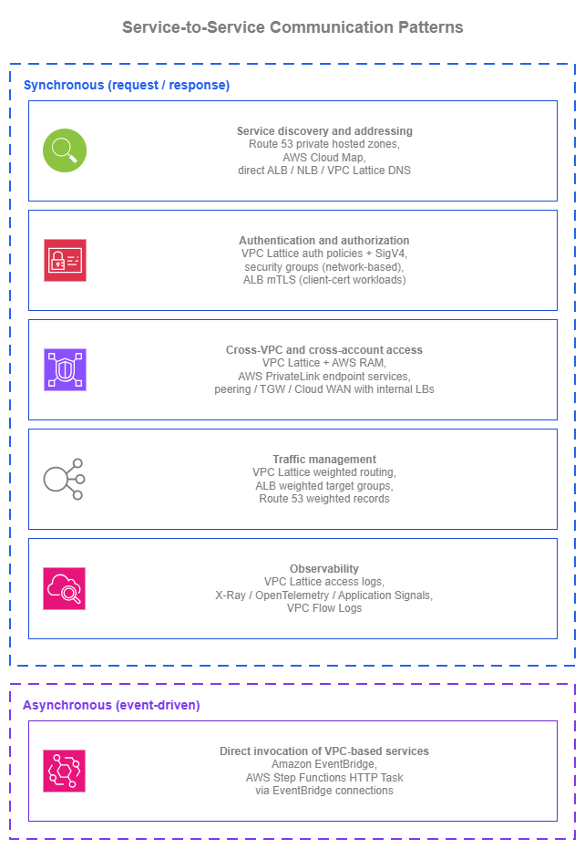

# 서비스 간 통신 {#service-to-service}

!!! info "사전 요구 사항"
    이 섹션은 [Amazon VPC](../foundation/vpc.md), [서브넷](../foundation/subnets.md), [AWS 내부 연결](../connectivity/within-aws.md) 페이지의 연결 패턴(특히 Amazon VPC Lattice), 그리고 [로드 밸런싱](load-balancing.md) 페이지에 대한 이해를 전제로 합니다. 서비스 간 통신은 이러한 기본 요소들을 기반으로 구성됩니다.

AWS에서의 서비스 간 통신은 다섯 가지 아키텍처 관심사를 포괄합니다. 첫째, 검색(discovery) — 소비자가 Route 53 프라이빗 호스팅 영역 또는 Amazon VPC Lattice DNS를 통해 공급자를 찾는 방법, 둘째, 인증(authentication) — VPC Lattice 인증 정책을 활용한 IAM 기반 SigV4 서명 또는 ALB의 상호 TLS, 셋째, 크로스 VPC 연결(cross-VPC reach) — CIDR 조율 없이 RAM을 통해 공유되는 VPC Lattice 서비스 네트워크 또는 TCP용 PrivateLink 엔드포인트 서비스, 넷째, 트래픽 관리(traffic management) — DNS TTL 단위(분)가 아닌 초 단위로 대상 그룹 간 트래픽을 전환하는 VPC Lattice 가중치 기반 라우팅, 다섯째, 관측성(observability) — 모든 요청에 대해 호출자 ID와 인증 결정을 포함하는 VPC Lattice 액세스 로그입니다. 핵심 질문은 "ALB냐 NLB냐?"가 아니라 "소비자는 공급자를 어떻게 찾는가?", "서비스들은 서로를 어떻게 인증하는가?", "새 버전을 안전하게 배포하려면 어떻게 해야 하는가?"입니다.

이 페이지는 **패턴 중심**으로 구성되어 있습니다. 아래의 각 패턴은 여러 AWS 지원 옵션을 제공하며, 올바른 선택은 전체 아키텍처에 따라 달라집니다. 페이지 전반에 걸쳐 염두에 두어야 할 핵심 질문은 **네트워킹 레이어를 얼마나 직접 관리할 것인가?** 입니다.

각 패턴의 옵션은 개별 빌딩 블록(Amazon Route 53, AWS PrivateLink, ALB / NLB, IAM, CloudWatch, AWS WAF)을 조합하여 구성할 수 있으며, 이 경우 애플리케이션 또는 플랫폼 팀이 통합을 직접 담당합니다. *또는* [Amazon VPC Lattice](https://docs.aws.amazon.com/vpc-lattice/latest/ug/what-is-vpc-lattice.html)를 통해 처리할 수도 있는데, 이는 검색, 인증, 크로스 VPC 연결, 트래픽 관리, 관측성을 단일 관리형 애플리케이션 네트워킹 레이어로 통합하여 연결 복잡성을 추상화합니다. 두 가지 방식 모두 유효합니다.

Amazon VPC Lattice의 연결 측면에 대한 심층적인 내용(서비스 네트워크, 연결 모델, 네트워크 팀 관점의 모범 사례)은 [AWS 내부 연결](../connectivity/within-aws.md) 페이지에서 다루며, 이 페이지는 애플리케이션 팀이 패턴을 *활용하는* 방법에 초점을 맞춥니다.

/// caption
서비스 간 통신 패턴 — [Drawio 소스](../assets/application-networking/s2s-patterns.drawio)
///

## 동기식 서비스 간 패턴 {#synchronous-service-to-service-patterns}

동기식 서비스 간 통신(서비스가 요청을 보내고 응답을 기다리는 방식)은 일반적인 워크로드 내에서 가장 흔한 형태의 서비스 상호작용입니다. 아래 패턴들은 일관되게 제기되는 설계 질문들을 다룹니다. 소비자가 공급자를 찾는 방법, 양측이 인증하는 방법, 호출이 VPC 및 계정 경계를 넘는 방법, 새 버전을 안전하게 배포하는 방법, 그리고 운영자가 상황을 파악하는 방법이 이에 해당합니다.

### 서비스 디스커버리 및 주소 지정 {#service-discovery-and-addressing}

하드코딩된 IP는 실제 환경에서 살아남지 못합니다. 대상은 확장되고, 인스턴스는 교체되며, 가용 영역은 장애가 발생하고, 이름 뒤에 있는 서비스가 마이그레이션될 수 있습니다. 서비스 디스커버리는 두 가지 질문에 답합니다. 서비스 이름이 주어졌을 때 소비자가 지금 당장 사용해야 할 주소는 무엇인지, 그리고 구현이 변경되더라도 그 이름을 어떻게 안정적으로 유지하는지입니다.

AWS에서 올바른 패턴은, 아래 어떤 옵션을 선택하든 관계없이, **항상 Amazon Route 53 레코드로 소비자 대면 이름을 추상화하는 것**입니다. 애플리케이션은 `payments.internal.example.com`을 호출하며, 로드 밸런서 DNS 이름을 직접 사용하거나 Amazon VPC Lattice 관리형 DNS 이름을 직접 사용하지 않습니다. Route 53 별칭 레코드는 친숙한 이름을 현재 서비스를 실제로 지원하는 대상(내부 ALB, NLB, Amazon VPC Lattice 서비스, EC2 인스턴스)으로 확인하며, 구현을 변경하는 것은 소비자 측 조율 작업이 아닌 Route 53 레코드 변경으로 처리됩니다.

| 옵션 | 사용 시기 |
| --- | --- |
| **별칭 레코드를 사용하는 Amazon Route 53 프라이빗 호스팅 영역** | 애플리케이션 코드가 친숙한 내부 이름(`payments.internal.example.com`)을 호출하면, Route 53 별칭 레코드가 현재 지원 대상으로 확인합니다. 별칭 레코드는 내부 ALB, NLB, Amazon VPC Lattice 서비스에 대해 일급(first-class) 지원을 제공합니다. 구현이 변경되더라도(EC2에서 ECS로, AWS PrivateLink 엔드포인트 서비스에서 Amazon VPC Lattice 서비스로), 별칭 레코드만 변경하면 되며 애플리케이션 코드는 수정할 필요가 없습니다. 단일 내부 DNS 컨트롤 플레인으로 계정 간에 소유하고 공유할 수 있습니다. |
| **AWS Cloud Map** | 디스커버리 레이어에 사용자 정의 속성 필터링(배포 단계, 용량, 색상)이 있는 서비스 인스턴스 레지스트리가 필요하거나, Amazon ECS 서비스 디스커버리의 태스크별 자동 등록을 사용하는 경우. ECS는 태스크 IP를 AWS Cloud Map에 자동으로 등록 및 등록 해제하며, 소비자는 서비스 이름(DNS)으로 쿼리하거나 속성(API)으로 필터링할 수 있습니다. ECS가 아니거나 속성 필터링이 필요 없는 경우에는 Route 53 프라이빗 호스팅 영역이 더 간단합니다. |
| **ALB, NLB, 또는 Amazon VPC Lattice 서비스로의 직접 DNS** | 소비자가 AWS 할당 DNS 이름(`internal-foo-1234.elb.us-east-1.amazonaws.com` 또는 `my-service.7d67968.vpc-lattice-svcs.us-east-1.on.aws`)을 직접 호출할 수 있는 단일 팀, 단일 VPC의 간단한 설정. 작동하지만 소비자를 공급자의 특정 인스턴스에 종속시킵니다. 워크로드가 성장하면 Route 53 별칭으로 전환하는 것이 좋습니다. |

#### 대규모 프라이빗 호스팅 영역 관리 {#manage-private-hosted-zones-at-scale}

[Amazon Route 53 Profiles](https://docs.aws.amazon.com/Route53/latest/DeveloperGuide/profiles.html)는 프라이빗 호스팅 영역, Resolver 전달 규칙, DNS Firewall 규칙 그룹을 AWS RAM을 통해 배포되는 단일 공유 가능 객체로 묶습니다. Profile은 네트워크 또는 플랫폼 계정에 존재하며 조직 전체의 소비자 VPC에 공유됩니다.

멀티 계정 환경에서 대규모로 작업할 때의 주요 결정 사항은 **Profile이 참조하는 프라이빗 호스팅 영역이 어디에 있는지, 그리고 누가 영역을 추가할 수 있는지**입니다.

| 소유권 모델 | 프라이빗 호스팅 영역 위치 | 애플리케이션 팀의 레코드 추가 방법 |
| --- | --- | --- |
| **중앙 집중식** | 네트워크 또는 플랫폼 계정이 Profile이 참조하는 모든 프라이빗 호스팅 영역을 소유합니다. | 중앙 IaC 리포지토리에 대한 PR, Service Catalog 제품, 또는 중앙 계정에 대한 범위가 좁은 위임된 IAM 역할을 통해 추가합니다. |
| **분산형** | 각 애플리케이션 팀이 자체 계정에서 프라이빗 호스팅 영역을 소유합니다. 플랫폼 팀은 해당 애플리케이션 계정에 관리자 권한(세분화된 제어)으로 Profile을 공유하여 팀이 자체 영역을 추가할 수 있도록 합니다. | 각 팀이 자체 영역을 직접 관리하고 Profile에 추가합니다. |

대부분의 환경은 **하이브리드** 방식으로 귀결됩니다. 교차 인프라용 플랫폼 소유 영역(`aws.internal`, `db.internal`), 비즈니스 도메인별 팀 소유 영역(`payments.app.internal`, `inventory.app.internal`)이 모두 하나(또는 몇 개)의 중앙 소유 Profile에 의해 참조되고, 읽기 전용 공유를 통해 VPC에서 사용됩니다.

#### 서비스 디스커버리 모범 사례 {#service-discovery-best-practices}

* **Amazon Route 53 Profiles를 사용하여 멀티 계정 환경 전반에 프라이빗 호스팅 영역, Resolver 전달 규칙, DNS Firewall 규칙 그룹을 배포하세요**. OU 수준에서 공유하면 새 계정이 자동으로 구성을 상속받습니다. Profiles 없이는 멀티 계정 DNS가 사용자 정의 교차 계정 연결 자동화로 변하지만, Profiles를 사용하면 일급 작업이 됩니다.
* **조직의 운영 방식에 따라 중앙 집중식과 분산형 프라이빗 호스팅 영역 소유권(또는 두 방식의 하이브리드) 중 하나를 신중하게 결정하세요**. 애플리케이션 팀을 위한 위임된 변경 경로가 있는 플랫폼 소유 방식, 또는 공유 관리자 Profile을 통한 플랫폼 집계가 있는 팀 소유 방식 중 선택합니다.
* **항상 로드 밸런서와 Amazon VPC Lattice 서비스 앞에 Route 53 별칭 레코드를 배치하세요**. 별칭 레코드는 ALB, NLB, Amazon VPC Lattice 서비스에 대해 일급 지원을 제공하며, 추가 CNAME 홉 없이 AWS DNS 시간에 확인되고 Route 53 호스팅 영역 내에서 무료입니다. 별칭을 사용하면 소비자가 인식하지 못하는 상태에서 구현을 변경할 수 있습니다.
* **AWS Cloud Map은 특정 형태가 워크로드와 일치할 때만 사용하세요**. Amazon ECS 서비스 디스커버리의 태스크별 자동 등록, 또는 속성 필터링 디스커버리(`deployment_color = blue`)가 필요한 경우입니다. 그 외의 경우에는 Route 53이 더 간단합니다.
* **애플리케이션 코드에 하드코딩된 IP와 로드 밸런서 또는 Amazon VPC Lattice DNS 이름을 직접 사용하지 마세요**. 둘 다 소비자를 공급자의 특정 인스턴스에 종속시키며, Route 53 별칭 간접 참조가 모든 변경을 안전하게 만드는 요소입니다.

#### 서비스 디스커버리 문서 {#service-discovery-documentation}

*   :material-file-document: **Amazon Route 53 프라이빗 호스팅 영역**

    ---

    하나 이상의 VPC 내부에서 AWS 리소스에 대한 별칭 레코드를 포함한 내부 DNS 권한 있는 네임 서비스.

    [:octicons-arrow-right-24: 문서](https://docs.aws.amazon.com/Route53/latest/DeveloperGuide/hosted-zones-private.html)

*   :material-file-document: **Amazon Route 53 별칭 레코드**

    ---

    추가 DNS 홉 없이 AWS 리소스(ALB, NLB, Amazon VPC Lattice 서비스, CloudFront, S3)로 확인되는 일급 레코드.

    [:octicons-arrow-right-24: 문서](https://docs.aws.amazon.com/Route53/latest/DeveloperGuide/resource-record-sets-choosing-alias-non-alias.html)

*   :material-file-document: **Amazon Route 53 Profiles**

    ---

    프라이빗 호스팅 영역, Resolver 전달 규칙, DNS Firewall 규칙 그룹을 AWS RAM을 통해 멀티 계정 환경에 배포되는 단일 공유 가능 객체로 묶습니다.

    [:octicons-arrow-right-24: 문서](https://docs.aws.amazon.com/Route53/latest/DeveloperGuide/profiles.html)

*   :material-file-document: **AWS Cloud Map**

    ---

    DNS 및 API 디스커버리, 사용자 정의 속성, Amazon ECS 서비스 디스커버리 통합을 갖춘 서비스 인스턴스 레지스트리.

    [:octicons-arrow-right-24: 문서](https://docs.aws.amazon.com/cloud-map/latest/dg/what-is-cloud-map.html)

*   :material-file-document: **Amazon ECS 서비스 디스커버리**

    ---

    네이티브 컨테이너 서비스 디스커버리를 위해 AWS Cloud Map에 Amazon ECS 서비스를 태스크별로 자동 등록.

    [:octicons-arrow-right-24: 문서](https://docs.aws.amazon.com/AmazonECS/latest/developerguide/service-discovery.html)

### 요청 인증 및 권한 부여 {#request-authentication-and-authorization}

요청에 응답하는 서비스는 두 가지를 알아야 합니다. 누가 호출하는지, 그리고 그 호출자가 호출할 권한이 있는지입니다. 전통적인 네트워크 접근 방식(보안 그룹과 헤더의 공유 시크릿)은 소규모 환경에서는 작동하지만, 서비스가 팀, VPC, 계정에 걸쳐 확장되면 더 이상 확장되지 않습니다. 아래 옵션들은 **무엇을** 인증하는지(네트워크 소스 대 암호화 ID 대 애플리케이션 제공 인증서)와 **얼마나 많은 인증 컨트롤 플레인을 직접 운영하는지**에서 차이가 있습니다.

| 옵션 | 인증 대상 | 운영 항목 |
| --- | --- | --- |
| **Amazon VPC Lattice 인증 정책 + AWS SigV4 / SigV4A** | 호출자의 IAM 자격 증명(EC2 인스턴스 프로파일, Amazon ECS 태스크 역할, Amazon EKS 파드 IAM 역할, Lambda 실행 역할). 각 소비자는 자체 역할로 요청에 서명하며, Amazon VPC Lattice는 서비스의 인증 정책에 대해 요청을 평가하여 허용 또는 거부하고, 호출자의 자격 증명은 액세스 로그에 기록됩니다. | 각 Amazon VPC Lattice 서비스의 IAM 기반 정책. 서명은 소비자 측 AWS SDK에서 이루어지며, 교체할 공유 시크릿이 없습니다. |
| **보안 그룹 + 프라이빗 연결(네트워크 기반 인증)** | 서비스에 도달할 수 있는 네트워크 소스(일반적으로 보안 그룹 식별자 또는 CIDR). 요청에 서명할 수 없는 TCP 서비스에 필요하며, 소비자가 IP 기반 액세스만 알고 있는 레거시 워크로드에 적합한 답입니다. | 모든 소비자/공급자 쌍의 보안 그룹 규칙. 보안 그룹은 "무엇이 호출할 수 있는지"에 답하지, "누가"에는 답하지 않습니다. 동일한 보안 그룹 식별자로 실행되는 서로 다른 애플리케이션은 구별할 수 없습니다. |
| **상호 TLS(mTLS)** | TLS 핸드셰이크 중에 제공되는 클라이언트 X.509 인증서. Application Load Balancer에서 사용 가능(ALB는 TLS를 종료하고 `passthrough` 또는 `verify` 모드에서 클라이언트 인증서를 검증)하며, Amazon VPC Lattice TLS 패스스루 리스너에서도 사용 가능(Amazon VPC Lattice는 TLS를 종료하지 않고 SNI에서 암호화된 흐름을 라우팅하며, 그 뒤의 애플리케이션 또는 로드 밸런서가 mTLS를 종료). Amazon VPC Lattice TLS 패스스루 경로는 해당 리스너에서 인증 정책을 익명 주체로 제한하는 대신 종단 간 암호화를 유지합니다. | 클라이언트 인증서 수명 주기(발급, 교체, 폐기). 대규모에서는 실질적인 운영 오버헤드가 있지만, B2B 통합, IoT, mTLS가 계약 또는 규정 준수 요구 사항인 워크로드에 적합합니다. |
| **공유 API 키, 베어러 토큰, HTTP 기본 인증** | 헤더의 정적 시크릿. 수동으로 교체되는 하나의 시크릿에 신뢰를 집중시킵니다. | 수동 교체, 배포, 폐기. IAM 서명 요청이 옵션인 환경에서는 서비스 간 통신에 사용하지 마세요. |

네 가지 옵션은 깔끔하게 계층화됩니다. 보안 그룹은 여전히 *무엇이 도달할 수 있는지*를 제어하고, Amazon VPC Lattice 인증 정책은 *어떤 IAM 자격 증명이 호출할 수 있는지*를 제어하며, mTLS(ALB 또는 Amazon VPC Lattice TLS 패스스루를 통해)는 *어떤 클라이언트 인증서가 제공되는지*를 제어합니다. 이들은 서로를 대체하지 않습니다. 질문은 어떤 조합이 워크로드에 맞는지입니다.

#### 인증 및 권한 부여 모범 사례 {#authentication-and-authorization-best-practices}

* **소비자가 가능한 경우 AWS SigV4 / SigV4A로 서비스 간 요청에 서명하세요**. EC2, Amazon ECS, Amazon EKS, Lambda의 AWS SDK는 소비자가 IAM 역할로 실행될 때 자동으로 서명합니다.
* **소비자 자격 증명에 IAM 역할을 종단 간 사용하세요**. EC2 인스턴스 프로파일, Amazon ECS 태스크 역할, Amazon EKS 파드 IAM 역할(IAM Roles for Service Accounts 또는 Amazon EKS Pod Identity를 통해), Lambda 실행 역할. 공유 IAM 사용자나 공유 자격 증명을 피하세요. CloudTrail 및 Amazon VPC Lattice 액세스 로그의 감사 추적은 각 호출자가 자체 역할을 가질 때만 유용합니다.
* **심층 방어를 위해 네트워크 기반 인증과 자격 증명 기반 인증을 결합하세요**, 대안으로 사용하지 마세요. 보안 그룹은 서비스 또는 서비스 네트워크에 도달할 수 있는 네트워크 소스를 제한하고, 자격 증명 기반 인증은 서비스를 호출할 수 있는 주체를 강제합니다. 잘못 구성된 보안 그룹이 있어도 자격 증명 기반 인증이 게이트로 남아 있고, 잘못 구성된 인증 정책이 있어도 네트워크 소스 제한이 유지됩니다. 두 계층은 단일 잘못된 구성의 장애 반경을 줄입니다.
* **별도의 인증 메커니즘이 아닌, 서비스 표면에 맞는 자격 증명 평가 지점을 선택하세요**. SigV4 서명 요청과 IAM 자격 증명은 AWS 서비스 간 트래픽에서 일관된 자격 증명 기반 메커니즘입니다. 평가 지점은 소비자 서비스 앞에 있는 것에 따라 다릅니다.

  | 서비스 표면 | 자격 증명 평가 지점 |
  | --- | --- |
  | Amazon VPC Lattice 서비스 | 서비스 또는 서비스 네트워크의 인증 정책(SigV4 서명 요청 평가). |
  | Amazon API Gateway REST 또는 HTTP API | IAM 권한 부여자(SigV4 서명 요청 평가). |
  | 직접 AWS 서비스 호출(DynamoDB, S3, KMS 등) | AWS SDK가 SigV4로 서명하고, AWS 서비스가 IAM에 대해 평가. |
  | AWS AppSync, IAM 인증이 있는 AWS 네이티브 API | 동일한 SigV4 + IAM 메커니즘, 서비스에서 평가. |

* **계약상 실제로 필요한 경우에만 mTLS를 사용하세요**. 명명된 클라이언트와의 B2B 통합, 인증서를 자격 증명으로 제공하는 IoT 디바이스, 또는 mTLS를 의무화하는 규정 준수 기준. 클라이언트 인증서 수명 주기는 어느 경우든 실질적인 작업입니다. mTLS를 일반적인 서비스 간 패턴으로 사용하지 마세요.
* **서비스 간 통신에 공유 API 키, 베어러 토큰, HTTP 기본 인증을 사용하지 마세요**. 교체 시 취약하고, 호출자별 감사가 어려우며, IAM 서명 대안이 자격 증명 수명 주기를 IAM으로 이미 관리하면서 동일한 문제를 해결합니다.
* **소비자가 요청에 서명하도록 업데이트될 때까지, 요청이 이미 가지고 있는 내용과 일치하는 조건으로 Amazon VPC Lattice 인증 정책을 작성하세요**(소스 VPC, HTTP 메서드, 경로, 헤더). 이렇게 하면 애플리케이션 변경을 기다리지 않고도 즉시 액세스 로그, 명시적 허용/거부 결정, 작동하는 컨트롤 플레인을 얻을 수 있습니다. 소비자가 서명을 채택함에 따라 주체 기반 조건으로 강화하세요.

#### 인증 및 권한 부여 문서 {#authentication-and-authorization-documentation}

*   :material-file-document: **Amazon VPC Lattice 인증 정책**

    ---

    서비스 수준의 IAM 기반 액세스 제어: 주체, 조건, 요청 속성, SigV4 / SigV4A 서명.

    [:octicons-arrow-right-24: 문서](https://docs.aws.amazon.com/vpc-lattice/latest/ug/auth-policies.html)

*   :material-file-document: **AWS Signature Version 4(SigV4)**

    ---

    SDK 클라이언트가 IAM 자격 증명으로 API 호출 및 Amazon VPC Lattice 서비스 요청을 인증하는 데 사용하는 AWS 요청 서명 표준.

    [:octicons-arrow-right-24: 문서](https://docs.aws.amazon.com/IAM/latest/UserGuide/reference_sigv-create-signed-request.html)

*   :material-file-document: **Application Load Balancer 상호 TLS**

    ---

    `passthrough` 및 `verify` 모드를 사용하는 ALB의 클라이언트 X.509 인증서 인증.

    [:octicons-arrow-right-24: 문서](https://docs.aws.amazon.com/elasticloadbalancing/latest/application/mutual-authentication.html)

*   :material-file-document: **Amazon VPC Lattice TLS 패스스루 리스너**

    ---

    Amazon VPC Lattice에서 TLS를 종료하지 않고 SNI 기반으로 TLS 및 mTLS 트래픽을 라우팅하여 애플리케이션까지 종단 간 암호화를 유지.

    [:octicons-arrow-right-24: 문서](https://docs.aws.amazon.com/vpc-lattice/latest/ug/tls-listeners.html)

*   :material-file-document: **VPC 보안 그룹**

    ---

    ENI, ALB, NLB, Amazon VPC Lattice 서비스 네트워크 연결에 대한 네트워크 수준 액세스 제어.

    [:octicons-arrow-right-24: 문서](https://docs.aws.amazon.com/vpc/latest/userguide/vpc-security-groups.html)

### 안전한 배포를 위한 트래픽 관리 {#traffic-management-for-safe-deployments}

소비자를 중단하지 않고 서비스의 새 버전을 릴리스하는 것은 서비스 간 아키텍처의 반복적인 테스트 중 하나입니다. 네트워킹 레이어가 대부분의 작업을 처리할 수 있습니다. 새 버전으로 소량의 트래픽을 전환하고, 관찰하고, 늘리고, 반복합니다. 아래 옵션들은 트래픽 전환 결정이 **어디서** 이루어지는지와 **얼마나 빨리** 적용되는지에서 차이가 있습니다.

| 옵션 | 전환 위치 | 변경 속도 |
| --- | --- | --- |
| **Amazon VPC Lattice 가중치 기반 라우팅** | Amazon VPC Lattice 서비스 내부, 대상 그룹 간. 가중치는 혼합 컴퓨팅 유형으로 라우팅할 수 있습니다. EC2, Amazon ECS, Amazon EKS, Lambda가 서로 다른 대상 그룹을 통해 동일한 Amazon VPC Lattice 서비스를 지원할 수 있습니다. | 초 단위. Amazon VPC Lattice 서비스의 가중치 라우팅 변경이 트래픽을 전환하며, DNS TTL이 관여하지 않습니다. |
| **ALB 가중치 기반 대상 그룹** | ALB 리스너 규칙 내부, 해당 ALB 뒤의 대상 그룹 간. 동일한 리스너 규칙 내 전환이지만 다른 로드 밸런서입니다. | 초 단위. 리스너 규칙 변경이 빠르게 전파됩니다. |
| **Route 53 가중치 기반 레코드** | DNS 레이어에서, DNS 엔드포인트 간. 워크로드가 로드 밸런싱 레이어에서 통합할 수 없는 엔드포인트에 실제로 분산되어 있을 때 적합합니다(멀티 리전 액티브-액티브, ALB에서 VPC Lattice로의 마이그레이션). | 느림. 소비자의 DNS TTL에 따라 다릅니다. 리전 내 서비스 간 트래픽에는 적합하지 않은 도구입니다. |

#### 트래픽 관리 모범 사례 {#traffic-management-best-practices}

* **DNS 레이어가 아닌 로드 밸런싱 레이어에서 트래픽을 전환하세요**. Amazon VPC Lattice 가중치 기반 라우팅과 ALB 가중치 기반 대상 그룹은 트래픽 분배를 초 단위로 변경하지만, DNS 기반 전환은 모든 소비자의 TTL이 만료될 때까지 기다려야 합니다.
* **버전 릴리스뿐만 아니라 컴퓨팅 마이그레이션에도 가중치 기반 라우팅을 사용하세요**. EC2에서 Amazon ECS로, 또는 Amazon ECS에서 Lambda로 워크로드를 이동하는 것은 하나의 서비스 내에서 Amazon VPC Lattice 가중치로 수행할 수 있습니다(소비자 측 변경 없음).
* **가중치 기반 라우팅을 상태 확인 및 관측성과 결합하여** 오류율이 높아질 때 잘못된 새 버전의 가중치가 자동으로 줄어들거나(또는 롤백되도록) 하세요. 대상 그룹별 상태 확인과 액세스 로그가 신호를 제공하고, 새 대상 그룹의 CloudWatch 경보가 루프를 닫습니다.
* **로드 밸런싱 레이어에서 통합할 수 없는 DNS 엔드포인트 간에만 Route 53 가중치 기반 레코드를 사용하세요**. 일반적으로 멀티 리전 액티브-액티브입니다. 솔루션 간 마이그레이션(ALB에서 VPC Lattice로)을 수행할 때도 이 옵션을 사용하세요.

#### 트래픽 관리 문서 {#traffic-management-documentation}

*   :material-file-document: **Amazon VPC Lattice 리스너 규칙 및 가중치 기반 대상 그룹**

    ---

    컴퓨팅 유형 간을 포함하여 Amazon VPC Lattice 서비스 내 대상 그룹 간 가중치 기반 라우팅.

    [:octicons-arrow-right-24: 문서](https://docs.aws.amazon.com/vpc-lattice/latest/ug/listeners.html)

*   :material-file-document: **ALB 가중치 기반 대상 그룹**

    ---

    블루/그린 및 카나리 배포를 위한 ALB 리스너 규칙 내 가중치 기반 라우팅.

    [:octicons-arrow-right-24: 문서](https://docs.aws.amazon.com/elasticloadbalancing/latest/application/lb-target-group-weights.html)

*   :material-file-document: **Route 53 가중치 기반 라우팅**

    ---

    단일 로드 밸런서가 모든 대상을 커버하지 않는 교차 리전 또는 교차 플랫폼 전환에 적합한 엔드포인트 간 DNS 레이어 가중치 기반 라우팅.

    [:octicons-arrow-right-24: 문서](https://docs.aws.amazon.com/Route53/latest/DeveloperGuide/routing-policy-weighted.html)

### 서비스 간 트래픽 관측성 {#observability-for-service-to-service-traffic}

서비스 간 트래픽은 기본적으로 운영자에게 보이지 않습니다. 모든 내부 요청이 기록되는 중앙 위치가 없기 때문입니다. 관측성이 중요한 이유는 서비스 간 인시던트가 보통 "서비스 A가 실패하고 있는데, 어떤 다운스트림 호출이 원인인지 모르겠다"로 시작하기 때문입니다.

신호의 세 가지 레이어는 다음과 같습니다. **네트워크 수준**(연결이 허용되었고 완료되었는지), **요청 수준**(요청, 응답, 지연 시간, 그리고 프론트 도어가 IAM을 평가할 때 호출 주체가 포함된 요청별 로그), **애플리케이션 수준**(이 사용자 대면 작업의 호출 그래프는 무엇이었고, 지연 시간은 어디에 있었는지). 각 레이어는 서로 다른 질문에 답하며, 건강한 서비스 간 환경은 세 가지 모두를 사용합니다.

| 레이어 | 소스 | 알 수 있는 내용 |
| --- | --- | --- |
| **네트워크 수준** | VPC Flow Logs | IP 수준 연결이 허용되었는지와 얼마나 많은 데이터가 흘렀는지. 보안 그룹/NACL 디버깅에 유용하지만, 자격 증명이나 요청 의미론은 표시하지 않습니다. |
| **요청 수준** | Amazon VPC Lattice 액세스 로그(자격 증명 인식), [Application Load Balancer 액세스 로그](https://docs.aws.amazon.com/elasticloadbalancing/latest/application/load-balancer-access-logs.html) | 소스, 대상, 지연 시간, 응답 코드, 타임스탬프가 포함된 요청별 로그. Amazon VPC Lattice 액세스 로그는 추가로 소스 IAM 주체와 인증 정책 결정을 포함하지만, ALB 액세스 로그는 포함하지 않습니다(프론트 도어가 IAM을 평가하지 않음). 서비스 간 인시던트를 특정 요청에, 그리고 (Amazon VPC Lattice 경로의 경우) 특정 호출자 및 권한 부여 결과에 매핑하는 신호입니다. |
| **애플리케이션 수준** | AWS X-Ray, OpenTelemetry, [Application Signals](https://docs.aws.amazon.com/AmazonCloudWatch/latest/monitoring/CloudWatch-Application-Signals.html) | 서비스 경계를 넘는 분산 추적. 요청별 호출 그래프와 지연 시간 예산. "시간이 어디서 소비되었고 왜?"에 유용합니다. |

#### 관측성 모범 사례 {#observability-best-practices}

* **트래픽이 로드 밸런서 또는 트랜짓 네트워크 플러밍을 통과할 때 세 가지 레이어를 모두 사용하세요**. 연결 디버깅을 위한 네트워크 수준, 감사 및 요청별 분류를 위한 요청 수준, 지연 시간 및 호출 그래프 분석을 위한 애플리케이션 수준 추적. **Amazon VPC Lattice 트래픽의 경우 네트워크 수준 로그는 선택 사항입니다**. 트래픽은 Amazon VPC Lattice 데이터 플레인을 통해 소비자와 공급자 VPC 간에 직접 흐르므로, VPC Flow Logs는 Transit Gateway, AWS Cloud WAN, 또는 피어링을 통해 홉하는 트래픽에 비해 가치가 낮습니다. 일반적인 VPC 관측성을 위해 활성화 상태를 유지하되, 요청 수준 및 애플리케이션 수준 레이어가 운영 부담을 담당합니다.
* **모든 서비스 네트워크에 대해 첫날부터 Amazon VPC Lattice 액세스 로그를 활성화하고**, 내부 서비스를 지원하는 모든 로드 밸런서에 대해 **ALB 액세스 로그를 활성화하세요**. 둘 다 제공하는 가시성에 비해 비용이 저렴하며, 인시던트 발생 후에 필요할 때 소급하여 재생성하기 어렵습니다.
* **네트워크 수준만이 아닌 서비스 수준 계측을 사용하세요**. 분산 추적과 Application Signals는 액세스 로그만으로는 얻을 수 없는 호출 그래프와 지연 시간 예산을 제공합니다. 두 가지를 함께 사용하는 것이 운영적으로 건강한 서비스 간 트래픽의 기반입니다.
* **VPC Flow Logs를 기본 신호가 아닌 디버깅 폴백으로 취급하세요**. "연결이 대상 IP에 도달하고 있는가?" 디버깅에는 유용하지만 애플리케이션 인식 관측성을 대체하지 않습니다.

#### 관측성 문서 {#observability-documentation}

*   :material-file-document: **Amazon VPC Lattice 액세스 로그**

    ---

    인증 정책 결정을 포함하여 Amazon S3, Amazon CloudWatch Logs, 또는 Amazon Data Firehose로의 요청별 액세스 로깅.

    [:octicons-arrow-right-24: 문서](https://docs.aws.amazon.com/vpc-lattice/latest/ug/monitoring-access-logs.html)

*   :material-file-document: **Application Load Balancer 액세스 로그**

    ---

    클라이언트 IP, 요청, 응답 코드, 지연 시간, 대상 세부 정보가 포함된 Amazon S3로의 요청별 액세스 로깅.

    [:octicons-arrow-right-24: 문서](https://docs.aws.amazon.com/elasticloadbalancing/latest/application/load-balancer-access-logs.html)

*   :material-file-document: **AWS X-Ray**

    ---

    요청별 호출 그래프 분석을 통한 서비스 경계를 넘는 분산 추적.

    [:octicons-arrow-right-24: 문서](https://docs.aws.amazon.com/xray/latest/devguide/aws-xray.html)

*   :material-file-document: **Amazon CloudWatch Application Signals**

    ---

    내장 서비스 맵, 요청 속도, 지연 시간, 오류 지표를 갖춘 서비스 수준 모니터링.

    [:octicons-arrow-right-24: 문서](https://docs.aws.amazon.com/AmazonCloudWatch/latest/monitoring/CloudWatch-Application-Signals.html)

*   :material-file-document: **VPC Flow Logs**

    ---

    Amazon S3 및 Amazon CloudWatch Logs에서 사용 가능한 ENI, 서브넷, VPC에 대한 네트워크 수준 트래픽 캡처.

    [:octicons-arrow-right-24: 문서](https://docs.aws.amazon.com/vpc/latest/userguide/flow-logs.html)

### 교차 VPC 및 교차 계정 서비스 액세스 {#cross-vpc-and-cross-account-service-access}

단일 VPC 내의 동기식 서비스 간 통신은 간단합니다. VPC 및 계정 경계를 넘을 때, 운영 모델을 결정하는 질문은 "어떤 연결 옵션을 선택하는가?"(그것은 [AWS 내부](../connectivity/within-aws.md) 페이지의 질문)가 아니라, **교차 계정 연결이 서비스와 얼마나 함께 묶여 있는가**입니다.

Amazon VPC Lattice 서비스는 교차 VPC 및 교차 계정 네트워킹을 서비스와 *함께* 제공합니다. 서비스 네트워크의 AWS RAM 공유는 VPC 피어링, AWS Transit Gateway, AWS Cloud WAN, 또는 CIDR 조율 없이 소비자 VPC에 도달 가능성을 제공합니다. 애플리케이션 팀이 서비스를 게시하면, 연결은 게시된 내용의 일부입니다.

[AWS PrivateLink 엔드포인트 서비스](https://docs.aws.amazon.com/vpc/latest/privatelink/configure-endpoint-service.html)도 피어링이나 CIDR 조율 없이 교차 VPC 및 교차 계정 도달 가능성을 해결하지만, 쌍별 구성으로 처리합니다. 공급자는 NLB와 엔드포인트 서비스를 배포하고, 각 소비자는 자체 VPC에 인터페이스 VPC 엔드포인트를 생성하며, 공급자가 연결을 수락합니다. 이는 소수의 명명된 소비자 VPC에 대해서는 깔끔하게 작동하지만, "많은 공급자, 많은 소비자, 많은 환경"이 수백 개의 유지 관리해야 할 엔드포인트 연결로 변하면 더 이상 확장되지 않습니다. 워크로드의 형태가 진정으로 "소수의 소비자에게 노출되는 하나의 TCP 서비스"인 경우 AWS PrivateLink 엔드포인트 서비스를 사용하고, 대규모 일반 서비스 간 트래픽에는 Amazon VPC Lattice 서비스가 더 적합합니다.

나머지 옵션(VPC 피어링, AWS Transit Gateway, AWS Cloud WAN)은 서비스 노출 프리미티브가 아닌 연결 프리미티브입니다. 애플리케이션 팀은 내부 ALB 또는 NLB를 통해 서비스를 노출하고, 소비자의 VPC가 기반 연결을 통해 공급자의 VPC로 IP 라우팅을 갖추고 있다는 것에 의존하며, 인증 및 관측성은 별도로 계층화됩니다.

| 아키텍처 | 서비스와 함께 묶인 항목 | 별도로 운영되는 항목 |
| --- | --- | --- |
| **Amazon VPC Lattice 서비스 + AWS RAM 공유** | 교차 VPC 및 교차 계정 도달 가능성, 서비스 디스커버리, IAM 기반 인증 정책, 가중치 기반 라우팅, 액세스 로그. CIDR이 겹칠 수 있으며, 피어링이나 트랜짓 게이트웨이가 필요 없습니다. | Amazon VPC Lattice 서비스 네트워크 설계 자체(서비스별 작업이 아닌 공유 플랫폼 인프라). |
| **AWS PrivateLink 엔드포인트 서비스** | 피어링 없이 소비자별 엔드포인트 연결을 통한 교차 VPC 및 교차 계정 TCP 도달 가능성. | 공급자 VPC의 NLB, 엔드포인트 서비스, 소비자별 인터페이스 VPC 엔드포인트, 각 새 소비자에 대한 연결 수락 프로세스. 소비자 VPC 수에 비례하여 선형적으로 확장됩니다. |
| **기존 연결을 통한 내부 ALB / NLB** | 애플리케이션 팀이 소유하는 로드 밸런서. | 연결 레이어(VPC 피어링, AWS Transit Gateway, AWS Cloud WAN), 인증 레이어(보안 그룹, 애플리케이션 또는 다른 프론트 도어 서비스의 IAM), 관측성 레이어(액세스 로그, 추적). |

이러한 옵션의 연결 측면 처리는 [AWS 내부](../connectivity/within-aws.md) 페이지에 있습니다.

## 비동기 서비스 간 패턴 {#asynchronous-service-to-service-patterns}

모든 서비스 간 상호작용이 요청/응답 방식인 것은 아닙니다. 운영 측면에서 가장 건강한 패턴 중 상당수는 비동기 방식입니다. 즉, 프로듀서가 이벤트나 메시지를 게시하고 다음 작업으로 넘어가면, 소비자는 준비가 됐을 때 반응합니다. 비동기 통신은 버퍼링을 통해 트래픽 급증을 흡수하고, 프로듀서와 소비자 간의 배포 주기를 분리하며, 느린 다운스트림 호출이 업스트림 호출자를 차단하는 동기식 장애 모드를 제거합니다.

이 페이지는 이벤트 기반 아키텍처 가이드가 아닌 *네트워킹* 모범 사례 가이드입니다. 핵심 비동기 구성 요소([Amazon EventBridge](https://docs.aws.amazon.com/eventbridge/latest/userguide/eb-what-is.html), [Amazon SNS](https://docs.aws.amazon.com/sns/latest/dg/welcome.html), [Amazon SQS](https://docs.aws.amazon.com/AWSSimpleQueueService/latest/SQSDeveloperGuide/welcome.html), [Amazon Kinesis](https://docs.aws.amazon.com/streams/latest/dev/introduction.html), [AWS Step Functions](https://docs.aws.amazon.com/step-functions/latest/dg/welcome.html))는 각각 독자적인 심층 문서를 갖춘 AWS 서비스입니다. 이 페이지에서 다루는 네트워킹 관련 질문은 더 좁습니다. 비동기 워크플로우가 **VPC 내의 동기식 서비스**(EC2, Amazon ECS, Amazon EKS의 프라이빗 API 또는 내부 로드 밸런서 뒤에 있는 서비스)를 호출해야 할 때, 그 호출을 어떻게 수행해야 할까요?

### 동기 방식 대신 비동기 방식을 선택하는 경우 {#when-to-choose-asynchronous-over-synchronous}

다음과 같은 상황에서 비동기 패턴을 선택하세요.

* 프로듀서가 동일한 실행 내에서 응답을 필요로 하지 않는 경우. "주문 완료" 이벤트를 게시하고 다운스트림의 "확인 이메일 발송" 서비스가 이를 처리하도록 하는 서비스는 차단할 필요가 없습니다.
* 작업의 도착 속도가 급격히 변하고, 소비자가 즉시 확장될 수 없는 경우. 큐가 버스트를 흡수하고 소비자는 지속 가능한 속도로 처리합니다.
* 여러 소비자가 동일한 이벤트를 필요로 하는 경우. Amazon EventBridge, Amazon SNS, Amazon Kinesis는 모두 프로듀서가 수신자를 알지 못해도 하나의 이벤트가 여러 소비자에게 전달되도록 합니다.
* 작업이 장시간 실행되는 경우. AWS Step Functions 워크플로우는 동기식 타임아웃이 구조를 제약하지 않고도 재시도, 분기, 사람 개입 단계를 포함한 다단계 프로세스를 오케스트레이션할 수 있습니다.

비동기 통신이 항상 정답은 아닙니다. 소비자가 계속 진행하기 전에 결과가 실제로 필요한 경우(주문 결제, 로그인 검증, 설정 조회 등)에는 요청/응답 방식이 적합합니다. 두 패턴은 건강한 아키텍처에서 공존합니다.

### Amazon EventBridge 및 AWS Step Functions에서 VPC 기반 서비스 호출 {#calling-vpc-based-services-from-amazon-eventbridge-and-aws-step-functions}

지속적으로 제기되는 네트워킹 질문이 있습니다. "비동기 프로듀서(Amazon EventBridge 규칙, AWS Step Functions 워크플로우)가 있고, 소비자는 EC2, Amazon ECS, 또는 Amazon EKS에서 실행 중인 HTTP 서비스입니다. 프로듀서는 어떻게 프라이빗 엔드포인트에 도달할 수 있을까요?"

과거에는 Lambda를 릴레이로 사용하는 방식이 답이었습니다. Amazon EventBridge 규칙이 VPC에 배포된 Lambda 함수를 호출하고, 해당 함수가 프라이빗 엔드포인트로 HTTP 호출을 수행하는 방식이었습니다. 이 방식은 작동했지만, 네트워크 계층을 연결하기 위해서만 존재하는 관리형 컴포넌트가 추가되었고, 자체적인 확장, 오류 처리, 관측성 영역이 생겼습니다.

그러나 **Amazon EventBridge와 AWS Step Functions는 모두 [EventBridge의 프라이빗 API 연결](https://docs.aws.amazon.com/eventbridge/latest/userguide/connection-private.html)을 통해 VPC 내 프라이빗 엔드포인트와 직접 통합됩니다**. 이 통합은 프라이빗 엔드포인트를 나타내는 래퍼로 [Amazon VPC Lattice 리소스 구성](https://docs.aws.amazon.com/vpc-lattice/latest/ug/resource-configuration.html)을 사용합니다. 리소스 구성은 *모든* 프라이빗 API를 가리킬 수 있습니다. 이 통합은 소비자 서비스가 Amazon VPC Lattice를 전반적으로 도입했는지 여부와 관계없이 작동합니다. 리소스 구성은 비동기 프로듀서와 프라이빗 리소스 사이의 얇은 연결 고리 역할만 합니다.

EventBridge가 연결을 생성하면, EventBridge 서비스 자체가 소유한 Amazon VPC Lattice 서비스 네트워크와 리소스 구성 간의 리소스 연결을 관리합니다. 해당 서비스 네트워크를 직접 운영할 필요가 없으며, EventBridge가 이를 제공합니다. 크로스 계정도 지원됩니다. 한 계정의 연결이 프라이빗 API가 실제로 위치한 다른 계정의 리소스 구성을 대상으로 할 수 있습니다.

이를 통해 가능한 두 가지 주요 패턴은 다음과 같습니다.

* **프라이빗 API 대상을 사용하는 Amazon EventBridge 규칙**. 프로듀서가 Amazon EventBridge 버스에 이벤트를 게시하면, Amazon EventBridge 규칙이 일치하는 이벤트를 프라이빗 API를 가리키는 리소스 구성으로의 연결을 통해 라우팅합니다. 프라이빗 API는 AWS 백본을 통해 이벤트 페이로드가 담긴 HTTP POST를 수신하고 처리하며, 프로듀서는 이 과정을 알 필요가 없습니다.
* **프라이빗 API 대상을 사용하는 AWS Step Functions HTTP 태스크**. AWS Step Functions 상태 머신의 HTTP 태스크가 Amazon EventBridge 연결을 사용하여 오케스트레이션의 일부로 프라이빗 HTTPS 엔드포인트를 호출합니다. 다단계 워크플로우가 중간에 프라이빗 서비스를 동기적으로 호출해야 할 때 사용합니다(예: 주문 처리 프로세스를 오케스트레이션하면서 계속 진행하기 전에 프라이빗 재고 서비스를 호출해야 하는 상태 머신).

#### 비동기-동기 연동 문서 {#async-to-sync-documentation}

*   :material-file-document: **Amazon EventBridge의 프라이빗 API 대상 연결**

    ---

    Amazon VPC Lattice 리소스 구성에 대한 연결을 통해 Amazon EventBridge 규칙에서 VPC 내 프라이빗 API 대상을 직접 호출합니다.

    [:octicons-arrow-right-24: 문서](https://docs.aws.amazon.com/eventbridge/latest/userguide/connection-private.html)

*   :material-file-document: **AWS Step Functions HTTP 태스크**

    ---

    Amazon EventBridge 연결을 통한 프라이빗 엔드포인트를 포함하여 AWS Step Functions 워크플로우에서 HTTPS API를 호출합니다.

    [:octicons-arrow-right-24: 문서](https://docs.aws.amazon.com/step-functions/latest/dg/call-https-apis.html)

*   :material-file-document: **Amazon VPC Lattice 리소스 구성**

    ---

    Amazon EventBridge 및 AWS Step Functions가 VPC 기반 서비스에 도달하기 위해 사용하는 프라이빗 엔드포인트(DNS 이름, IP, ARN)의 리소스 표현입니다.

    [:octicons-arrow-right-24: 문서](https://docs.aws.amazon.com/vpc-lattice/latest/ug/resource-configuration.html)

## 서비스 간 통신을 위한 IPv6 {#ipv6-for-service-to-service-communication}

서비스 간 트래픽은 처음부터 듀얼 스택으로 구성하는 것이 좋습니다. 이 페이지의 모든 동기 패턴은 IPv6를 지원하며, 내부 트래픽에 IPv6를 도입하면 동서(east-west) 통신에서 NAT 게이트웨이 의존성(및 GB당 비용)을 제거할 수 있습니다.

**서비스 간 옵션별 IPv6 지원 현황:**

| 구성 요소 | IPv6 지원 | 비고 |
| --- | --- | --- |
| **Amazon VPC Lattice** | 듀얼 스택(IPv4, IPv6 또는 둘 다) | 서비스 및 대상 그룹이 듀얼 스택을 지원합니다. 소비자는 NAT 없이 IPv6를 통해 공급자에 접근할 수 있습니다. |
| **Application Load Balancer** | 듀얼 스택 및 IPv6 전용 리스너 | 내부 ALB는 듀얼 스택을 지원하며, 백엔드 대상은 IPv6가 될 수 있습니다. |
| **Network Load Balancer** | 듀얼 스택 및 IPv6 전용 리스너 | 내부 NLB는 TCP/UDP/TLS에 대해 IPv6 대상을 지원합니다. |
| **Route 53 프라이빗 호스팅 영역** | AAAA 레코드 | 듀얼 스택 ALB 및 VPC Lattice 서비스에 대한 별칭 레코드는 IPv6 지원 소비자에게 IPv6 주소로 확인됩니다. |
| **AWS PrivateLink** | 듀얼 스택 인터페이스 엔드포인트 | 인터페이스 VPC 엔드포인트는 IPv4 및 IPv6 주소 지정을 지원합니다. |
| **보안 그룹** | IPv4 및 IPv6 규칙 분리 | 보안 그룹은 명시적인 IPv6 규칙이 필요합니다. IPv4 규칙은 IPv6 트래픽에 적용되지 않습니다. |

**듀얼 스택 서비스 간 통신 모범 사례:**

* **VPC Lattice 서비스를 듀얼 스택으로 구성**하면 IPv6 전용 서브넷의 소비자가 NAT64 없이 접근할 수 있습니다. 이는 파드에 IPv6 주소만 있는 IPv6 모드로 실행되는 EKS 클러스터에서 특히 중요합니다.
* **Route 53 프라이빗 호스팅 영역의 모든 내부 서비스에 A 레코드와 함께 AAAA 별칭 레코드를 추가**하세요. IPv6 지원 소비자는 자동으로 AAAA 레코드를 우선 사용합니다.
* **모든 서비스 엔드포인트에서 두 주소 체계 모두에 대해 보안 그룹을 업데이트**하세요. 흔한 실수 중 하나는 ALB의 보안 그룹이 포트 443에서 `10.0.0.0/8`을 허용하지만 IPv6 규칙이 없어 IPv6 소비자가 연결 거부를 받는 경우입니다.
* **동서 트래픽에 IPv6를 사용하여 NAT 게이트웨이 비용을 절감**하세요. VPC Lattice 또는 피어링을 통한 VPC 간 서비스 간 호출은 양쪽 모두 IPv6를 지원하는 경우 NAT가 필요하지 않습니다. 이를 통해 내부 트래픽 경로에서 GB당 NAT 게이트웨이 처리 요금이 제거됩니다.

***핵심 인사이트:*** *서비스 간 통신에서 IPv6는 주로 비용 최적화 수단입니다. 동서 트래픽 경로에서 NAT 게이트웨이를 제거합니다. 기능은 IPv4와 동일합니다. 동일한 인증 정책, 동일한 가중치 기반 라우팅, 동일한 액세스 로그를 사용합니다. 차이점은 서비스 간 IPv6 트래픽에는 NAT 처리 요금이 발생하지 않는다는 것입니다.*

## 크로스 VPC 서비스 접근의 비용 고려사항 {#cost-considerations-for-cross-vpc-service-access}

서비스 간 연결 옵션 선택은 트래픽 볼륨에 따라 확장되는 중요한 비용 영향을 미칩니다. 아래 표는 각 크로스 VPC 접근 패턴의 비용 모델을 비교합니다.

| 패턴 | 고정 비용 | GB당 비용 | 비용 증가 요인 |
| --- | --- | --- | --- |
| **Amazon VPC Lattice** | 서비스 네트워크 또는 서비스에 대한 시간당 요금 없음 | 처리된 데이터 GB당 요금 ([Lattice 요금](https://aws.amazon.com/vpc/lattice/pricing/)) | 요청 볼륨 및 페이로드 크기 |
| **AWS PrivateLink 엔드포인트 서비스** | AZ당 엔드포인트 시간당 요금 | 처리된 데이터 GB당 요금 ([PrivateLink 요금](https://aws.amazon.com/privatelink/pricing/)) | 소비자 VPC 수 × 가용 영역 수, 그리고 트래픽 볼륨 |
| **Transit Gateway + 내부 ALB/NLB** | 연결(attachment) 시간당 요금 ([TGW 요금](https://aws.amazon.com/transit-gateway/pricing/)) | TGW 데이터 처리 GB당 요금 | 연결된 VPC 수, 그리고 TGW를 통과하는 모든 트래픽(서비스 트래픽만이 아님) |
| **VPC Peering + 내부 ALB/NLB** | 무료(시간당 요금 없음, 데이터 처리 요금 없음) | 크로스 AZ인 경우 표준 크로스 AZ GB당 요금만 적용 | 크로스 AZ 트래픽만 해당; 동일 AZ는 무료 |
| **VPC Lattice + IPv6 (NAT 없음)** | 시간당 요금 없음 | Lattice 처리 GB당 요금(NAT 처리 요금 없음) | 요청 볼륨; 소비자 측의 NAT 게이트웨이 GB당 요금 제거 |

**비용이 결정을 좌우하는 경우:**

* **낮은 트래픽 볼륨, 다수의 소비자**: VPC Lattice가 유리 — 소비자당 고정 비용이 없으며, GB당 요금도 경쟁력 있음.
* **높은 트래픽 볼륨, 소수의 소비자**: VPC Peering + 내부 LB가 유리 — 데이터 처리 요금이 없음. 단, 피어링 연결 관리와 CIDR 비중복이 트레이드오프.
* **중간 트래픽, 중간 규모의 소비자**: 소비자 수가 적을 때 PrivateLink가 비용 효율적(낮은 트래픽에서는 AZ당 시간당 요금이 지배적인 비용).
* **다른 트래픽을 위해 이미 Transit Gateway 운영 중**: TGW를 통한 서비스 간 트래픽의 한계 비용은 GB당 처리 요금뿐 — 연결 비용은 이미 지불됨. 단, TGW가 서비스 간 통신만을 위해 존재한다면 VPC Lattice가 더 저렴함.

***핵심 인사이트:*** *가장 저렴한 크로스 VPC 서비스 접근 경로는 두 가지 변수에 따라 달라집니다: 소비자 VPC 수와 트래픽 양. VPC Lattice의 고정 비용 제로는 다수 소비자, 중간 트래픽 패턴에서 가장 저렴하게 만듭니다. VPC Peering의 처리 비용 제로는 고트래픽, 소수 소비자 패턴에서 가장 저렴하게 만듭니다. Transit Gateway의 GB당 요금은 서비스 간 통신 전용으로는 가장 비싼 옵션이지만, 다른 연결 요구사항을 위해 이미 배포된 경우가 많습니다.*

## 서비스 간 스택 구성 {#building-your-service-to-service-stack}

서비스 간 아키텍처는 연결성([Within AWS](../connectivity/within-aws.md) 페이지에서 다룸)과 애플리케이션 코드 사이의 계층입니다. 위에서 설명한 패턴들은 개별 AWS 서비스를 조합하거나, 단일 관리형 인터페이스인 Amazon VPC Lattice를 통해 구현할 수 있습니다. 두 방식 모두 유효하며, 많은 환경에서 워크로드별로 이 둘을 혼합하여 사용합니다.

/// caption
서비스 간 스택 — [Drawio 소스](../assets/application-networking/s2s-stack.drawio)
///

### 신규 환경 {#new-environments}

서비스 간 통신을 처음부터 구축하는 조직은 첫날부터 일관된 스택으로 시작할 수 있습니다.

1. **Amazon Route 53 프라이빗 호스팅 영역을 중앙 DNS 제어 플레인으로 사용**합니다. 네트워크 또는 플랫폼 팀이 소유하며, Amazon Route 53 Profiles를 통해 계정 전반에 배포합니다(AWS RAM을 통해 OU 수준에서 공유). 모든 내부 서비스는 친숙한 이름(`payments.internal.example.com`)으로 게시되며, 별칭(alias) 레코드가 현재 백엔드 대상으로 확인됩니다. 애플리케이션 코드는 로드 밸런서의 DNS 이름이나 Amazon VPC Lattice 관리형 DNS 이름을 직접 호출하지 않습니다.
2. **소비자 ID에는 IAM 역할을 엔드투엔드로 사용하고, 심층 방어를 위해 보안 그룹을 추가로 적용**합니다. EC2 인스턴스 프로파일, Amazon ECS 태스크 역할, Amazon EKS 파드 IAM 역할, Lambda 실행 역할을 통해 AWS SDK가 SigV4로 요청에 자동 서명합니다. ID 기반 인증(Amazon VPC Lattice 인증 정책, Amazon API Gateway IAM 권한 부여자, AWS SDK의 내장 SigV4 평가)은 누가 무엇을 호출할 수 있는지 강제하며, 보안 그룹은 어떤 네트워크 소스가 서비스에 접근할 수 있는지를 계속 제어합니다. 이 두 계층은 단일 잘못된 구성으로 인한 피해 범위를 줄여줍니다.
3. **워크로드별로 네트워킹 계층을 얼마나 직접 운영할지 결정**합니다. Amazon VPC Lattice 서비스는 서비스 검색, 인증, 가중치 기반 라우팅, 크로스 VPC 연결, 액세스 로그를 하나의 관리형 인터페이스로 제공합니다. 패턴별 대안은 개별 서비스(Route 53, AWS PrivateLink, ALB, IAM, CloudWatch)를 통해 동일한 결과를 얻을 수 있지만, 통합 운영 비용이 발생합니다. 두 방식 모두 유효하므로, 기본값에 따르지 말고 의도적으로 선택하세요.
4. **이벤트 기반 통신에는 Amazon EventBridge를 사용하고, 처음부터 프라이빗 API에 직접 연결**합니다. 처음부터 EventBridge의 프라이빗 API 연결을 사용하고, 프라이빗 API는 Amazon VPC Lattice 리소스 구성으로 래핑합니다(리소스 구성은 내부 ALB, EC2 인스턴스, Amazon EKS 서비스, 온프레미스 엔드포인트, 또는 Amazon VPC Lattice 서비스를 가리킬 수 있습니다). Lambda 릴레이는 사용하지 않습니다.
5. **프라이빗 서비스 호출을 포함하는 다단계 워크플로에는 AWS Step Functions를 사용**합니다. Amazon EventBridge 연결을 활용한 HTTP 태스크가 현대적인 통합 방식이며, 서비스 간 직접 통신과 동일한 인증 정책 방식을 함께 적용합니다.
6. **처음부터 요청 수준 액세스 로그와 분산 트레이싱을 적용**합니다. Amazon VPC Lattice 액세스 로그(Amazon VPC Lattice가 경로에 있는 경우 ID 인식), ALB 액세스 로그(ALB 앞단의 모든 내부 서비스), 그리고 모든 서비스에 걸친 애플리케이션 수준 트레이스(X-Ray, OpenTelemetry, 또는 Application Signals)를 활용합니다.

### 기존 환경 {#existing-environments}

기존 서비스 간 패턴을 운영 중인 조직은 모든 것을 한꺼번에 변경할 필요가 없는 작동 중인 아키텍처를 보유하고 있습니다.

1. **AWS PrivateLink 엔드포인트 서비스**는 계속 작동합니다. 다음에 새로 추가하는 크로스 VPC 또는 크로스 계정 동기 서비스는 Amazon VPC Lattice로 온보딩하고, 기존 엔드포인트 서비스는 수정할 때마다 점진적으로 마이그레이션합니다. 기존 대상을 Amazon VPC Lattice 대상 그룹으로 등록하고, 새 Amazon VPC Lattice 서비스 DNS 이름을 노출한 뒤(동일한 Route 53 별칭 뒤에), 가중치 기반 라우팅을 통해 소비자를 전환합니다. 마이그레이션 단계는 [Within AWS](../connectivity/within-aws.md) 페이지에 문서화되어 있습니다.
2. **내부 ALB 및 NLB**는 아직 Amazon VPC Lattice의 인증 및 가중치 기반 라우팅 기능이 필요하지 않은 워크로드에 그대로 유지됩니다. 워크로드가 Amazon VPC Lattice를 도입할 때, 기존 로드 밸런서를 대상 그룹으로 Amazon VPC Lattice 서비스에 연결합니다. 소비자 대면 인터페이스는 Route 53 별칭(이제 Amazon VPC Lattice 서비스가 백엔드)이 되며, 백엔드를 재플랫폼할 필요가 없습니다.
3. **애플리케이션 코드에 하드코딩된 IP, 로드 밸런서 DNS 이름, Amazon VPC Lattice DNS 이름**은 호출 코드를 수정할 때 별칭 레코드를 사용하는 Route 53 친숙한 이름으로 이전해야 합니다. 간접 참조를 수정하기 위해 작동 중인 호출을 중단하지 마세요. 어차피 변경이 필요한 다음 작업 시에 함께 수정하세요.
4. **Amazon EventBridge 또는 AWS Step Functions에서 프라이빗 엔드포인트로의 Lambda 릴레이 패턴**은 편의에 따라 Amazon EventBridge 연결을 프라이빗 API에 직접 연결하는 방식으로 교체할 수 있습니다. 기존 릴레이는 계속 작동하며, 새로운 통합은 직접 경로를 사용해야 합니다.
5. **서비스 간 인증을 위한 API 키 및 공유 시크릿**은 기존 환경에서 가장 취약한 패턴입니다. 소비자 코드를 업데이트할 때 IAM 서명 요청으로 교체하는 계획을 수립하되, 시크릿이 유출될 경우 피해 범위가 가장 큰 호출부터 시작하세요.
