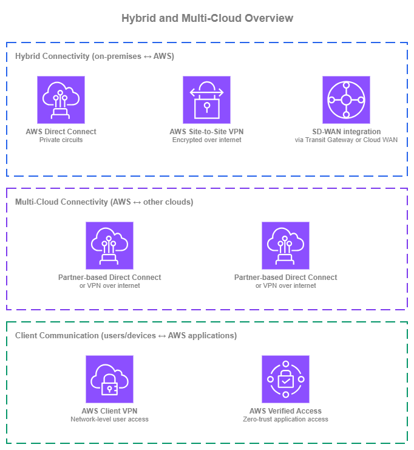
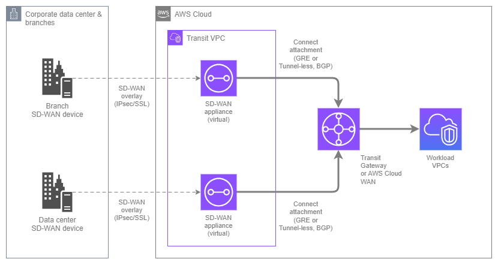
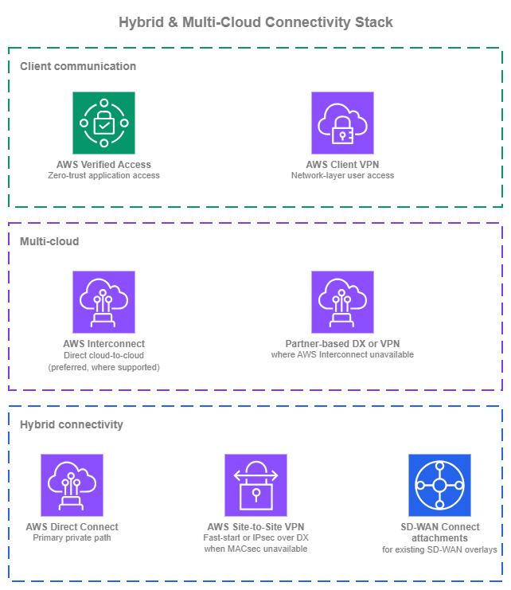

# 하이브리드 및 멀티 클라우드 연결 {#hybrid-and-multi-cloud-connectivity}

!!! info "사전 요구 사항"
    이 섹션은 [Amazon VPC](../foundation/vpc.md), [CIDR 계획](../foundation/cidr.md), [AWS Organizations](../foundation/organizations.md), 그리고 [AWS 내부 연결](within-aws.md) 서비스(특히 AWS Transit Gateway 및 AWS Cloud WAN)에 대한 이해를 전제로 합니다. AWS 네트워킹 기초가 처음이라면 해당 주제를 먼저 검토하세요.

AWS를 외부 네트워크에 연결하는 것은 두 가지 별개의 과제를 포함하며, 단일 서비스만으로 해결되는 경우는 거의 없습니다. **하이브리드 연결(Hybrid Connectivity)**은 전용 회선, 암호화된 VPN, 또는 SD-WAN 오버레이를 통해 온프레미스 데이터 센터와 지사를 AWS에 연결합니다. **멀티 클라우드 연결(Multi-Cloud Connectivity)**은 여러 클라우드 공급자에 걸친 워크로드를 위해 AWS와 다른 퍼블릭 클라우드를 연결합니다.

/// caption
하이브리드 및 멀티 클라우드 개요 — [Drawio 소스](../assets/connectivity/hybrid-overview.drawio)
///

온프레미스 연결의 경우, [AWS Direct Connect](https://aws.amazon.com/directconnect/)는 전용 회선을 통해 안정적이고 예측 가능한 대역폭을 제공하는 프라이빗 연결로, 대부분의 프로덕션 하이브리드 배포의 기반이 됩니다. [AWS Site-to-Site VPN](https://aws.amazon.com/vpn/site-to-site-vpn/)은 인터넷을 통한 암호화 연결을 제공하며, 전용 회선이 필요하지 않거나 레이어 3 암호화를 위해 Direct Connect를 보완하는 용도로 활용됩니다. **SD-WAN 통합**은 Transit Gateway Connect 또는 AWS Cloud WAN Connect 어태치먼트를 사용하여 서드파티 SD-WAN 오버레이를 AWS 네트워크 플레인에 연결합니다.

멀티 클라우드의 경우, [AWS Interconnect](https://docs.aws.amazon.com/interconnect/latest/userguide/what-is-interconnect.html)가 권장 옵션입니다. 이는 코로케이션에서의 크로스 커넥트, 파트너 조율, 또는 수동 라우터 구성 없이 AWS VPC와 다른 클라우드 공급자 네트워크 간에 직접적인 프라이빗 연결을 생성하는 관리형 서비스입니다. 기존 대안(파트너 기반 Direct Connect 크로스 커넥트 또는 클라우드 간 Site-to-Site VPN)은 AWS Interconnect가 아직 해당 리전 쌍 또는 클라우드 쌍을 지원하지 않는 경우에도 유효하지만, 운영 부담이 더 큽니다.

대부분의 조직은 이러한 서비스를 동시에 두 가지 이상 사용합니다. 목표는 각 서비스가 가장 큰 가치를 제공하는 곳에 적절히 활용하는 것입니다. 이러한 서비스를 결합한 권장 아키텍처는 이 페이지 하단의 [하이브리드 및 멀티 클라우드 스택 구축](#building-your-hybrid-and-multi-cloud-stack)을 참조하세요.

## AWS Direct Connect를 통한 온프레미스 프라이빗 연결 {#private-on-premises-connectivity-with-aws-direct-connect}

[AWS Direct Connect](https://docs.aws.amazon.com/directconnect/latest/UserGuide/Welcome.html)는 온프레미스 네트워크와 AWS 간에 프라이빗 전용 네트워크 연결을 제공합니다. 트래픽은 Direct Connect 위치에 프로비저닝된 물리적 회선을 통해 흐르며 공용 인터넷을 완전히 우회하므로, 대역폭이 예측 가능하고 지연 시간이 일정하며 AWS에서의 데이터 전송 비용이 인터넷 경유 방식보다 저렴합니다. Direct Connect는 대부분의 프로덕션 하이브리드 배포의 기반이 되며, 하이브리드 트래픽을 종료하는 모든 AWS 네트워크 서비스(가상 프라이빗 게이트웨이, Transit Gateway, AWS Cloud WAN)와 통합됩니다.

**주요 기능**:

*   :material-fiber: **전용 연결 및 호스팅 연결**

    ---

    1 Gbps, 10 Gbps, 100 Gbps의 전용 연결은 Direct Connect 위치에서 AWS로부터 직접 제공됩니다. 더 낮은 속도(50 Mbps~25 Gbps)의 호스팅 연결은 해당 위치에 이미 용량을 프로비저닝한 Direct Connect 파트너를 통해 제공됩니다.

*   :material-lan: **가상 인터페이스(VIF)**

    ---

    단일 물리적 연결이 VLAN 태그가 지정된 여러 가상 인터페이스를 전달합니다. **프라이빗 VIF**는 VPC 리소스에 연결됩니다(가상 프라이빗 게이트웨이 또는 Direct Connect 게이트웨이를 통해). **Transit VIF**는 Transit Gateway 또는 AWS Cloud WAN 코어 네트워크에 연결됩니다(Direct Connect 게이트웨이를 통해). **퍼블릭 VIF**는 프라이빗 링크를 통해 AWS 퍼블릭 서비스 엔드포인트에 연결됩니다.

*   :material-router-network: **Direct Connect 게이트웨이**

    ---

    전 세계에 분산된 BGP 라우트 리플렉터입니다. 단일 Direct Connect 게이트웨이를 모든 AWS 리전(중국 제외)의 가상 프라이빗 게이트웨이, Transit Gateway 또는 AWS Cloud WAN 코어 네트워크와 연결할 수 있으므로, 여러 회선을 프로비저닝하지 않고도 하나의 물리적 연결로 여러 리전에 도달할 수 있습니다.

*   :material-transit-transfer: **SiteLink**

    ---

    AWS 리전을 거치지 않고 AWS 글로벌 백본을 통해 두 Direct Connect 위치 간에 트래픽을 라우팅합니다. AWS 네트워크를 통한 경로가 WAN보다 짧거나 안정적인 경우, 온프레미스 사이트 간 연결에 유용합니다.

*   :material-shield-check: **MACsec 암호화**

    ---

    IEEE 802.1AE MACsec은 지원되는 10 Gbps 및 100 Gbps 연결에서 사용자 라우터와 AWS Direct Connect 라우터 간의 트래픽을 레이어 2에서 암호화합니다. 컴플라이언스 요건상 전용 회선 자체에 링크 계층 암호화가 필요한 경우에 유용합니다.

*   :material-ip-network: **듀얼 스택 지원**

    ---

    프라이빗, Transit, 퍼블릭 VIF 모두 IPv4 및 IPv6 BGP 세션을 지원합니다. 듀얼 스택은 VIF별로 구성되므로 동일한 물리적 연결에서 IPv4와 IPv6를 함께 운용할 수 있습니다.

### AWS Direct Connect 모범 사례 {#aws-direct-connect-best-practices}

#### 연결 수준뿐만 아니라 위치 및 공급자 수준에서 복원력을 설계하세요 {#design-for-resiliency-at-the-location-and-provider-level-not-just-at-the-connection-level}

단일 전용 연결은 100 Gbps라 하더라도 하나의 Direct Connect 위치를 통과하는 하나의 회선에 불과합니다. 프로덕션 하이브리드 트래픽의 경우, Resiliency Toolkit의 **최대 복원력(maximum resiliency)** 모델을 따르세요. 즉, 서로 다른 공급자로부터 제공되고 서로 다른 온프레미스 라우터에 종료되는, 서로 다른 두 위치에 걸쳐 최소 두 개의 연결을 구성해야 합니다. 이를 통해 위치, 공급자, 크로스 커넥트, 디바이스가 단일 장애 지점이 되는 상황을 방지할 수 있습니다.

단일 위치 장애 시 성능 저하를 허용할 수 있는 워크로드라면, **높은 복원력(high resiliency)** 모델(하나 이상의 공급자를 통해 두 위치에 걸쳐 두 개의 연결)이 합리적인 절충안입니다. **개발/테스트** 단일 연결 모델은 결국 프로덕션 트래픽을 처리하게 되는 환경에는 거의 적합하지 않습니다.

#### Direct Connect 게이트웨이를 연결 지점으로 사용하세요 {#use-a-direct-connect-gateway-as-the-attach-point}

Direct Connect 게이트웨이는 무료로 제공되는 전 세계 분산 리소스로, VIF와 AWS 네트워크 서비스(가상 프라이빗 게이트웨이, Transit Gateway 또는 AWS Cloud WAN 코어 네트워크) 간의 BGP 연결 지점 역할을 합니다. 단일 Direct Connect 게이트웨이를 여러 리전의 연결 지점과 연결하면, 목적지별로 리전 전용 VIF를 프로비저닝하지 않고도 하나의 물리적 연결로 모든 리전의 워크로드에 도달할 수 있습니다.

또한 마이그레이션이 간소화됩니다. 워크로드를 리전 간에 이동하거나 Transit Gateway에서 AWS Cloud WAN으로 전환할 때 VIF를 재프로비저닝하는 대신 Direct Connect 게이트웨이를 재연결하면 됩니다. 아울러 BGP 컨트롤 플레인이 데이터 경로에서 분리되므로, BGP 재수렴이 정상 경로의 트래픽을 중단시키지 않습니다.

#### 각 워크로드에 적합한 VIF 유형을 선택하세요 {#choose-the-right-vif-type-for-each-workload}

Direct Connect는 각각 다른 사용 사례에 적합한 세 가지 VIF 유형을 제공합니다. 모든 곳에 하나의 유형을 기본으로 사용하는 것보다 워크로드별로 올바른 유형을 선택하는 것이 더 중요합니다.

* **Transit VIF**는 온프레미스 연결을 AWS 네트워크 전반으로 확장하는 기본 선택입니다. Direct Connect 게이트웨이를 통해 Transit Gateway 또는 AWS Cloud WAN 코어 네트워크에 종료되는 단일 Transit VIF는 허브가 라우팅하는 모든 VPC에 도달할 수 있으며, VIF 수를 줄이고 라우팅을 중앙에서 관리할 수 있습니다.
* **프라이빗 VIF**를 특정 VPC에 연결하는 방식은 전용 경로가 필요한 워크로드에 적합합니다. 지속적인 고처리량 데이터 전송, 허브의 데이터 처리 오버헤드를 피해야 하는 지연 시간에 민감한 트래픽, 또는 연결 지점을 공유할 수 없는 컴플라이언스 요건이 있는 경우가 해당됩니다.
* **퍼블릭 VIF**는 Direct Connect 경로를 통해 AWS 퍼블릭 서비스 엔드포인트(예: Amazon S3 또는 Amazon DynamoDB)를 직접 사용하는 경우에 적합한 선택입니다.

대부분의 프로덕션 환경에서는 세 가지를 모두 운용합니다. 백본으로 하나 이상의 Transit VIF, 요구 사항이 까다로운 소수의 워크로드에 프라이빗 VIF, AWS 퍼블릭 엔드포인트 트래픽이 많은 경우(가장 일반적인 사례는 S3) 퍼블릭 VIF를 사용합니다.

#### 여러 Direct Connect 경로에서 트래픽 엔지니어링을 위해 BGP 속성을 활용하세요 {#use-bgp-attributes-for-traffic-engineering-across-multiple-direct-connect-paths}

여러 Direct Connect 연결이 있는 경우, BGP 속성을 통해 트래픽 흐름을 제어할 수 있습니다. 기본 경로와 보조 경로 지정, 회선 간 부하 분산, 대칭적인 리턴 트래픽 등이 가능합니다. 지원되는 속성은 **Local Preference 커뮤니티**(AWS에서 수신한 경로에 적용, 값이 높을수록 우선), **AS_PATH 프리펜딩**(광고하는 경로에 적용, 경로가 길수록 낮은 우선순위), **MED**(광고하는 경로에 적용, AS_PATH가 동일할 때 값이 낮을수록 우선), **최장 프리픽스 매치**(항상 위의 속성보다 우선)입니다.

Direct Connect 게이트웨이에 종료되는 VIF의 경우, 온프레미스 측 구성은 온프레미스 라우터에서 이루어집니다. VIF와 Direct Connect 게이트웨이 자체에는 구성 가능한 BGP 정책 설정이 없으므로, 트래픽 엔지니어링은 주로 온프레미스에서 수행됩니다. AWS Cloud WAN 배포의 경우, Cloud WAN [라우팅 정책](https://docs.aws.amazon.com/network-manager/latest/cloudwan/cloudwan-routing-policies.html)이 AWS 측 제어 지점을 추가합니다. 온프레미스 라우터에서만 처리하는 것이 아니라, 정책을 통해 Cloud WAN 세그먼트와 Direct Connect 게이트웨이 연결 간의 경로에서 BGP 속성을 필터링, 요약, 조작할 수 있습니다.

#### 1초 미만의 페일오버를 위해 BFD를 활성화하세요 {#enable-bfd-for-sub-second-failover}

BGP 홀드 타이머만으로는 기본적으로 약 90초(30초 킵얼라이브 간격의 3배) 후에 장애 발생 이웃을 감지합니다. 이는 대부분의 프로덕션 하이브리드 워크로드에 너무 긴 시간입니다. [양방향 포워딩 감지(BFD)](https://docs.aws.amazon.com/directconnect/latest/UserGuide/enable_bfd.html)는 BGP 세션과 함께 경량 활성 상태 확인을 실행하며, 포워딩 경로에 장애가 발생하는 즉시 세션을 종료합니다. 일반적으로 약 1초 이내에 처리됩니다.

AWS는 모든 Direct Connect BGP 세션에서 비동기 BFD를 자동으로 활성화하며, 감지 타이머는 300ms, 멀티플라이어는 3(세션 다운 선언까지 약 900ms)으로 설정됩니다. 온프레미스 측에서는 협상을 완료하기 위해 온프레미스 라우터에서 호환 가능한 타이머로 BFD를 활성화해야 합니다. 양쪽 모두에서 BFD가 활성화되지 않으면, 연결, VIF 또는 피어 디바이스 문제 발생 시 페일오버가 여전히 BGP 홀드 타이머에 의존하게 되어 중단 시간이 1초 미만이 아닌 수십 초가 됩니다.

BFD는 다중 회선 또는 액티브/패시브 설계에서 특히 중요합니다. 이러한 설계의 핵심 목적이 빠른 페일오버이기 때문입니다. 개통 검증 과정에서 모든 세션의 BFD 상태를 확인하고, BGP 세션 상태를 알람으로 모니터링하는 것과 동일하게 BFD 상태도 알람으로 설정하세요.

#### 처음부터 IPv6를 계획하세요 {#plan-ipv6-from-the-start}

모든 VIF 유형은 IPv6 BGP 세션을 지원합니다. 현재 온프레미스 호스트가 IPv4 전용이더라도, 처음부터 각 VIF에 IPv4와 함께 IPv6를 구성하세요. AWS 측은 듀얼 스택을 지원하며, 어려운 부분은 온프레미스 전환입니다. AWS 측을 미리 준비해 두면 온프레미스 네트워크가 준비되었을 때 VIF 구성을 다시 열지 않고도 IPv6를 도입할 수 있습니다.

#### BGP 및 VIF 지표를 적극적으로 모니터링하세요 {#monitor-bgp-and-vif-metrics-actively}

Direct Connect는 BGP 세션 상태, 연결 상태, VIF별 인그레스 및 이그레스 바이트와 패킷에 대한 CloudWatch 지표를 게시합니다. BGP 세션 상태 플래핑과 예상치 못한 트래픽 비대칭(BGP가 균형을 맞춰야 할 때 하나의 VIF가 형제 VIF보다 현저히 많거나 적은 트래픽을 처리하는 경우)에 대해 알람을 설정하세요. BGP 상태 변화를 빠르게 감지하는 것이 페일오버가 사용자에게 보이지 않게 처리되는지, 아니면 5분간의 중단을 초래하는지를 결정합니다.

### AWS Direct Connect 사용 시기 {#when-to-use-aws-direct-connect}

다음 중 하나라도 해당되는 경우 Direct Connect가 적합한 선택입니다.

* 하이브리드 워크로드에 공용 인터넷이 보장할 수 없는 예측 가능한 대역폭 또는 지연 시간이 필요한 경우.
* AWS에서 대용량 데이터를 전송하며 인터넷 이그레스 요금 대신 더 저렴한 Direct Connect 이그레스 요금을 원하는 경우.
* 민감한 트래픽이 공용 인터넷을 통과하는 것을 금지하는 컴플라이언스 요건이 있는 경우.
* 새로운 프로덕션 하이브리드 아키텍처를 구축하는 경우. 높은 복원력으로 가는 길은 단일 Direct Connect에 VPN 폴백을 결합하는 것이 아니라, 여러 위치와 공급자에 걸쳐 여러 Direct Connect 연결을 구성하는 것입니다.

다음의 경우에는 Direct Connect가 **적합하지 않습니다**. 연결이 몇 주가 아닌 며칠 내에 필요한 경우(프로비저닝에는 크로스 커넥트 및 공급자 조율이 필요), 트래픽 볼륨이 낮아 VPN 비용과 성능이 허용 가능한 경우, 또는 연결이 단기간만 필요한 경우(예: VPN 처리량으로 충분한 일회성 데이터 마이그레이션).

### AWS Direct Connect와 다른 하이브리드 네트워킹 서비스의 조합 {#combining-aws-direct-connect-with-other-hybrid-networking-services}

| 조합 | AWS Direct Connect 담당 | 다른 서비스 담당 |
| --- | --- | --- |
| **Direct Connect + Site-to-Site VPN** | AWS로의 프라이빗 경로 | MACsec을 사용할 수 없는 경우(예: 10 Gbps 미만의 호스팅 연결 또는 레이어 3 암호화가 필요한 컴플라이언스 기준) Direct Connect 위에 IPsec 오버레이 |
| **Direct Connect + SD-WAN (TGW/Cloud WAN Connect 경유)** | 온프레미스 SD-WAN 어플라이언스와 AWS 간의 기반 전송 | SD-WAN 솔루션이 제공하는 오버레이 |
| **Direct Connect + AWS Interconnect (멀티 클라우드)** | 온프레미스 하이브리드 경로 | AWS와 다른 공급자 간의 클라우드 간 경로. 두 경로는 Direct Connect 게이트웨이를 공유할 수 있음 |

### 문서 {#documentation}

*   :material-file-document: **AWS Direct Connect 문서**

    ---

    연결, 가상 인터페이스, Direct Connect 게이트웨이, SiteLink, MACsec을 다루는 전체 서비스 문서입니다.

    [:octicons-arrow-right-24: 문서](https://docs.aws.amazon.com/directconnect/latest/UserGuide/Welcome.html)

*   :material-file-document-outline: **Resiliency Toolkit**

    ---

    AWS의 권장 복원력 모델(개발, 높은 복원력, 최대 복원력)과 이를 구현하기 위한 안내 워크플로입니다.

    [:octicons-arrow-right-24: 문서](https://docs.aws.amazon.com/directconnect/latest/UserGuide/resilency_toolkit.html)

*   :material-post: **AWS Direct Connect 블로그 게시물**

    ---

    AWS Networking and Content Delivery 블로그의 아키텍처 안내, 기능 발표 및 구현 가이드입니다.

    [:octicons-arrow-right-24: 블로그 게시물](https://aws.amazon.com/blogs/networking-and-content-delivery/category/networking-content-delivery/aws-direct-connect/)

*   :material-currency-usd: **AWS Direct Connect 요금**

    ---

    전용 연결 및 호스팅 연결의 포트 시간당 요금과 일반적으로 인터넷 이그레스보다 저렴한 데이터 전송 아웃 요금입니다.

    [:octicons-arrow-right-24: 요금](https://aws.amazon.com/directconnect/pricing/)

## AWS Site-to-Site VPN을 통한 암호화된 온프레미스 연결 {#encrypted-on-premises-connectivity-with-aws-site-to-site-vpn}

[AWS Site-to-Site VPN](https://docs.aws.amazon.com/vpn/latest/s2svpn/VPC_VPN.html)은 공용 인터넷을 통해 온프레미스 네트워크와 AWS 간에 암호화된 IPsec 연결을 제공합니다. 각 VPN 연결은 이중화를 위해 별도의 AWS 엔드포인트에서 종료되는 두 개의 IPsec 터널로 구성되며, 정적 라우팅과 BGP를 이용한 동적 라우팅을 모두 지원합니다. Site-to-Site VPN은 VPC에 연결된 가상 프라이빗 게이트웨이, Transit Gateway, 또는 AWS Cloud WAN 코어 네트워크에서 종료될 수 있습니다.

Site-to-Site VPN은 하이브리드 연결을 구성하는 가장 빠른 방법입니다. 전용 회선이 필요하지 않은 사이트의 기본 경로로, 데이터 마이그레이션과 같이 단기간 연결이 필요한 경우에, 그리고 MACsec을 사용할 수 없고 레이어 3 암호화가 필요할 때 Direct Connect 위에 IPsec 오버레이로 일반적으로 활용됩니다.

**주요 기능**:

*   :material-shield-key: **연결당 두 개의 터널을 제공하는 IPsec 암호화**

    ---

    모든 VPN 연결은 별도의 가용 영역에 있는 엔드포인트에서 종료되는 두 개의 IPsec 터널을 제공합니다.

*   :material-speedometer: **Standard 및 Large 터널 대역폭**

    ---

    Standard 터널은 터널당 최대 1.25 Gbps를 제공합니다. Large 터널은 터널당 최대 5 Gbps를 제공하여, 고처리량 워크로드에서 복잡한 ECMP 본딩이 필요 없습니다. Large 터널은 Transit Gateway VPN 및 AWS Cloud WAN VPN 연결에서 사용할 수 있습니다.

*   :material-office-building-marker: **다수의 원격 사이트를 위한 VPN Concentrator**

    ---

    다수의 저대역폭(100 Mbps 미만) VPN 연결을 단일 연결로 집계하는 Transit Gateway 연결로, Concentrator당 최대 100개 사이트와 5 Gbps 집계 대역폭을 지원합니다. AWS에서 여러 가상 집선 장치를 관리해야 했던 수십 개의 지사(소매, 숙박, 의료)를 보유한 분산형 기업을 위해 설계되었습니다.

*   :material-rocket-launch: **Accelerated VPN**

    ---

    VPN 트래픽을 AWS Global Accelerator 및 AWS 엣지 네트워크를 통해 라우팅하여, AWS 리전에서 멀리 떨어진 고객의 지터를 줄이고 처리량을 향상시킵니다. Transit Gateway VPN 연결에서 사용할 수 있습니다.

*   :material-router: **Direct Connect를 통한 프라이빗 IP VPN**

    ---

    공용 인터넷 대신 Direct Connect 연결을 통해 도달 가능한 프라이빗 IP 주소에서 VPN을 종료합니다. 터널 엔드포인트를 인터넷에 노출하지 않고 Direct Connect 회선 위에 IPsec 암호화를 적용하려는 경우에 유용합니다.

*   :material-network: **BGP를 이용한 동적 라우팅**

    ---

    각 터널의 BGP를 통해 온프레미스 라우터가 AWS 프리픽스를 동적으로 학습하고 온프레미스 프리픽스를 AWS에 광고할 수 있습니다. BGP를 지원하지 않는 디바이스에는 정적 라우팅이 지원되지만, 복잡하지 않은 토폴로지를 제외한 모든 환경에서는 BGP를 강력히 권장합니다.

*   :material-ip-network: **듀얼 스택 지원**

    ---

    VPN 터널은 IPv4 또는 IPv6 내부 주소를 지원합니다. 듀얼 스택 통신을 위해서는 각 프로토콜에 대해 별도의 VPN 터널이 필요합니다.

### AWS Site-to-Site VPN 모범 사례 {#aws-site-to-site-vpn-best-practices}

#### 다양한 ISP 경로와 동적 라우팅을 사용하는 다중 VPN 연결 활용 {#use-multiple-vpn-connections-with-diverse-isp-paths-and-dynamic-routing}

모든 VPN 연결은 두 개의 IPsec 터널을 제공하지만, 두 터널 모두 동일한 연결 내의 AWS 엔드포인트에서 종료됩니다. 프로덕션 환경의 복원력을 위해 **두 개 이상의 VPN 연결**을 프로비저닝하고, 서로 다른 온프레미스 라우터에서 종료하며, 각 라우터가 **서로 다른 ISP**를 통해 AWS에 연결되도록 구성하여 단일 공급자 장애로 두 경로가 동시에 중단되지 않도록 합니다. 모든 터널에서 BGP를 사용하면 AWS가 경로를 자동으로 학습하고 장애 조치를 수행하며, 세션 상태를 통해 도달 가능성을 보고하고, BGP 속성으로 트래픽을 제어할 수 있습니다. 정적 라우팅은 이러한 기능을 모두 사용할 수 없으므로 프로덕션 환경에는 거의 적합하지 않습니다. 온프레미스 디바이스가 BGP를 지원하지 않는 경우, 이를 우회하는 방법을 찾기보다 디바이스를 교체하는 것이 올바른 해결책입니다.

#### VPN을 가상 프라이빗 게이트웨이가 아닌 Transit Gateway 또는 AWS Cloud WAN에서 종료 {#terminate-vpn-on-transit-gateway-or-aws-cloud-wan-not-virtual-private-gateways}

가상 프라이빗 게이트웨이에 연결된 VPN은 정확히 하나의 VPC에만 도달할 수 있습니다. Transit Gateway 또는 AWS Cloud WAN 코어 네트워크에 연결된 VPN은 허브가 라우팅하는 모든 VPC에 도달할 수 있으며, 라우팅 테이블 또는 네트워크 정책을 통해 세분화가 적용됩니다. VPC가 두 개 이상인 환경에서는 Transit Gateway 또는 AWS Cloud WAN에서 VPN을 종료하세요.

이를 통해 Large 터널(터널당 5 Gbps), Accelerated VPN, 다중 VPN 연결에 걸친 ECMP도 활성화할 수 있으며, 이러한 기능은 가상 프라이빗 게이트웨이 VPN에서는 사용할 수 없습니다.

#### 다수의 저대역폭 사이트에는 VPN Concentrator 활용 {#use-vpn-concentrator-for-many-low-bandwidth-sites}

[VPN Concentrator](https://docs.aws.amazon.com/vpc/latest/tgw/tgw-vpn-concentrator-attachments.html)는 다수의 지사 사용 사례를 해결합니다. 즉, 사이트 수는 많지만 각 사이트의 대역폭 요구는 낮은 경우, 사이트별로 전용 VPN 연결을 프로비저닝하면 Transit Gateway 연결이 과도하게 늘어나고 워크로드에 맞지 않는 연결당 비용이 발생합니다. VPN Concentrator 연결은 최대 100개 사이트(각 100 Mbps 미만)를 단일 Transit Gateway 연결로 집계하며, Concentrator당 5 Gbps 집계 대역폭과 Transit Gateway당 최대 5개의 Concentrator를 지원합니다.

저대역폭 프로파일에 해당하는 원격 사이트가 약 25개 이상인 경우(소매 체인, 호텔, 의료 지사, 분산된 현장 사무소) VPN Concentrator를 활용하세요. Concentrator는 BGP 전용 라우팅을 실행하고 AZ 이중화 엔드포인트를 제공하므로, 운영 측면에서는 사이트별 연결을 개별 관리하는 대신 일관된 라우팅 정책과 보안 규칙이 모든 연결 사이트에 적용되는 단일 연결처럼 보입니다. 사이트 수가 적거나 100 Mbps 이상의 대역폭이 필요한 사이트에는 표준 Site-to-Site VPN 연결을 사용하세요.

#### 원거리 사이트에는 Accelerated VPN 활용 {#use-accelerated-vpn-for-distant-sites}

AWS 리전에서 멀리 떨어진 지사나 데이터 센터의 경우, Accelerated VPN은 공용 인터넷 대신 AWS Global Accelerator 엣지 네트워크를 통해 트래픽을 라우팅합니다. 지터 및 처리량 개선 효과는 지연 시간에 민감하거나 대역폭에 민감한 하이브리드 워크로드에서 의미 있게 나타나며, 연결별 토글로 간단히 활성화할 수 있습니다.

Accelerated VPN은 AWS 리전이 사이트와 다른 대륙에 있거나, 사이트와 리전 간의 인터넷 라우팅이 역사적으로 불안정한 경우에 가장 큰 효과를 발휘합니다.

#### 처음부터 IPv6 계획 수립 {#plan-ipv6-from-the-start}

VPN 터널은 IPv4 또는 IPv6 내부 주소를 지원하지만, 단일 터널은 하나의 프로토콜만 전달합니다. 두 프로토콜이 모두 필요한 경우, 동일한 연결 구성 내에서 IPv4용 터널 하나와 IPv6용 터널 하나를 생성하여 듀얼 스택을 프로비저닝하고, 대역폭 및 터널 수 계획에 이를 반영하세요.

#### 터널 상태, BGP 세션 모니터링 및 Site-to-Site VPN 로그 활성화 {#monitor-tunnel-state-bgp-sessions-and-enable-site-to-site-vpn-logs}

CloudWatch는 터널별로 `TunnelState`, `TunnelIpAddress`, BGP 세션 상태 지표를 게시합니다. 터널 상태 전환 및 BGP 세션 플랩 횟수에 대한 알람을 설정하세요. 단일 터널 다운은 주기적으로 발생할 수 있으며(AWS는 터널 엔드포인트에 대한 계획된 유지 관리를 수행합니다), 동일한 연결의 두 터널이 몇 분 이상 모두 다운된 경우는 장애 상황입니다.

모든 연결에서 [Site-to-Site VPN 로그](https://docs.aws.amazon.com/vpn/latest/s2svpn/monitoring-logs.html)를 활성화하세요. 이 로그는 IKE 협상, IPsec 터널 설정, 데드 피어 감지, BGP 라우팅 활동을 캡처하며, 협상 실패나 세션 불안정 문제를 해결하는 데 필요한 정보를 제공합니다. 로그 없이는 터널 연결 실패를 진단할 때 일반적으로 온프레미스 디바이스의 로그만 확인해야 하지만, 로그를 활성화하면 통신의 양쪽 내용을 한 곳에서 확인할 수 있습니다.

### AWS Site-to-Site VPN 사용 시기 {#when-to-use-aws-site-to-site-vpn}

Site-to-Site VPN은 다음 중 하나에 해당하는 경우에 적합합니다.

* 지금 당장 하이브리드 연결이 필요하고 Direct Connect 프로비저닝에 더 많은 시간이 소요되는 경우.
* 사이트 규모가 작거나 원격지에 있어 Direct Connect 회선의 비용과 물리적 프로비저닝이 정당화되지 않는 경우.
* MACsec을 사용할 수 없거나(10 Gbps 미만의 호스팅 연결) 컴플라이언스상 레이어 3 암호화가 필요하여 Direct Connect 위에 암호화 오버레이가 필요한 경우.
* 인터넷 기반 암호화 처리량으로 충분한 일회성 데이터 마이그레이션과 같이 연결이 단기간인 경우.
* 개별적으로는 현실적인 수보다 더 많은 Direct Connect 회선이 필요한 다수의 소규모 지사를 연결하는 경우(이 규모에서는 일반적으로 VPN Concentrator가 적합한 도구입니다).

Site-to-Site VPN은 공용 인터넷이 보장할 수 없는 수준의 예측 가능한 지연 시간이 필요한 경우, 인터넷 이그레스 비용이 과도해질 정도의 대용량 데이터를 전송하는 경우, 또는 컴플라이언스상 암호화 오버레이가 아닌 물리적 전용 회선이 명시적으로 요구되는 경우에는 **적합하지 않습니다**.

### AWS Site-to-Site VPN과 다른 하이브리드 네트워킹 서비스의 조합 {#combining-aws-site-to-site-vpn-with-other-hybrid-networking-services}

| 조합 | Site-to-Site VPN 역할 | 다른 서비스 역할 |
| --- | --- | --- |
| **VPN + AWS Direct Connect** | MACsec을 사용할 수 없거나 레이어 3 암호화가 필요할 때 Direct Connect 위에 IPsec 오버레이 제공 | AWS로의 프라이빗 경로 제공 |

### 문서 {#documentation}

*   :material-file-document: **AWS Site-to-Site VPN 문서**

    ---

    터널 구성, BGP, Transit Gateway 및 AWS Cloud WAN 연결, Large 터널, Accelerated VPN을 다루는 전체 서비스 문서입니다.

    [:octicons-arrow-right-24: 문서](https://docs.aws.amazon.com/vpn/latest/s2svpn/VPC_VPN.html)

*   :material-file-document-outline: **Accelerated VPN**

    ---

    Accelerated VPN을 활성화하는 방법과 원거리 사이트의 처리량을 개선하는 시기에 대한 문서입니다.

    [:octicons-arrow-right-24: 문서](https://docs.aws.amazon.com/vpn/latest/s2svpn/accelerated-vpn.html)

*   :material-file-document-multiple-outline: **하이브리드 연결 백서**

    ---

    하이브리드 연결을 위한 Site-to-Site VPN, Direct Connect, SD-WAN 아키텍처를 다루는 AWS 백서입니다.

    [:octicons-arrow-right-24: 백서](https://docs.aws.amazon.com/whitepapers/latest/hybrid-connectivity/hybrid-connectivity.html)

*   :material-post: **AWS Site-to-Site VPN 블로그 게시물**

    ---

    AWS 네트워킹 및 콘텐츠 전송 블로그의 아키텍처 패턴, 기능 발표 및 구현 가이드입니다.

    [:octicons-arrow-right-24: 블로그 게시물](https://aws.amazon.com/blogs/networking-and-content-delivery/category/networking-content-delivery/aws-vpn/aws-site-to-site-vpn/)

*   :material-currency-usd: **AWS Site-to-Site VPN 요금**

    ---

    연결 시간당 요금과 데이터 전송 비용으로 구성되며, Standard 및 Large 터널과 Accelerated VPN에 대한 별도 요금이 적용됩니다.

    [:octicons-arrow-right-24: 요금](https://aws.amazon.com/vpn/pricing/)

## SD-WAN과 AWS Transit Gateway 및 AWS Cloud WAN 통합 {#sd-wan-integration-with-aws-transit-gateway-and-aws-cloud-wan}

이 섹션은 이미 지사와 데이터 센터 전반에 SD-WAN을 운영 중이며, AWS를 해당 오버레이의 정식 사이트로 참여시키려는 조직을 위한 내용입니다. SD-WAN 벤더는 오버레이 자체(경로 선택, WAN 최적화, 사이트 간 암호화, 오케스트레이션)를 담당하고, AWS는 오버레이를 AWS 네트워크 플레인으로 연결하는 접속 지점을 제공합니다.

통합 메커니즘은 [AWS Transit Gateway](https://docs.aws.amazon.com/vpc/latest/tgw/tgw-connect.html) 또는 [AWS Cloud WAN](https://docs.aws.amazon.com/network-manager/latest/cloudwan/cloudwan-connect-attachment.html)의 **Connect 어태치먼트(Connect attachments)**입니다. Connect 어태치먼트는 여러 Connect 피어를 포함하며, 각 피어는 SD-WAN 어플라이언스와 AWS 간의 동적 라우팅을 위해 BGP를 사용합니다. BGP는 모든 SD-WAN 벤더가 지원하는 표준 컨트롤 플레인입니다. 터널 프로토콜, 언더레이, 지원되는 랜딩 서비스는 Transit Gateway와 AWS Cloud WAN 간에 차이가 있으며, 이러한 차이가 통합 설계 방향을 결정합니다. 이어지는 섹션에서 각각을 다룹니다.

/// caption
SD-WAN 통합 — [Drawio 소스](../assets/connectivity/sdwan-integration.drawio)
///

**통합 구성 요소**:

*   :material-hub: **Transit Gateway와 AWS Cloud WAN의 차이점**

    ---

    두 서비스 모두 BGP를 사용하는 Connect 어태치먼트를 지원하지만, 지원되는 **터널 프로토콜**과 **언더레이**에 차이가 있습니다. Transit Gateway Connect는 GRE만 지원하며 VPC와 Direct Connect 언더레이를 모두 지원합니다. AWS Cloud WAN Connect는 GRE와 **Tunnel-less Connect**(캡슐화 오버헤드를 제거하는 고성능 옵션)를 지원하며, 언더레이는 반드시 VPC 어태치먼트여야 합니다. Direct Connect Gateway는 지원되지 않습니다. 기존 AWS 네트워크 백본에 맞는 랜딩 서비스를 선택하세요.

*   :material-tunnel: **GRE와 Tunnel-less Connect**

    ---

    GRE는 SD-WAN 어플라이언스와 AWS 측 사이의 터널에서 BGP 및 데이터 트래픽을 캡슐화합니다. Tunnel-less Connect(AWS Cloud WAN 전용)는 캡슐화를 완전히 생략하므로 BGP가 어플라이언스와 Cloud WAN 사이에서 직접 실행됩니다. Tunnel-less는 GRE 오버헤드를 제거하여 일반적으로 피어당 더 높은 처리량을 제공합니다.

*   :material-router-wireless: **VPC 또는 Direct Connect 언더레이(Transit Gateway 전용)**

    ---

    Transit Gateway Connect의 경우, 언더레이는 VPC(SD-WAN 가상 어플라이언스가 EC2 인스턴스로 실행되는 환경) 또는 Direct Connect 연결(SD-WAN 어플라이언스가 온프레미스에 있으며 Direct Connect Gateway를 통해 Direct Connect로 AWS와 피어링하는 환경)이 될 수 있습니다. 적합한 선택은 SD-WAN 어플라이언스를 어디에 배치할지에 따라 달라집니다. AWS Cloud WAN Connect는 현재 VPC 언더레이만 지원합니다.

*   :material-chart-pie: **SD-WAN 트래픽을 AWS 환경별로 세그먼트 분리**

    ---

    Transit Gateway 라우팅 테이블 또는 AWS Cloud WAN 세그먼트를 사용하면 SD-WAN 트래픽 클래스(프로덕션, 비프로덕션, 게스트, IoT)를 AWS 내부의 별도 라우팅 도메인에 매핑할 수 있습니다. 이를 위해서는 여러 Connect 피어(세그먼트당 하나)를 사용하거나, 벤더가 적절한 AWS 세그먼트에 매핑하는 SD-WAN 측 캡슐화가 필요합니다.

*   :material-ip-network: **듀얼 스택 지원**

    ---

    Connect 어태치먼트는 동일한 GRE 터널에서 IPv4 및 IPv6 BGP 세션을 지원하므로, 별도의 터널을 프로비저닝하지 않고도 SD-WAN 오버레이와 AWS 네트워크 간에 IPv4 및 IPv6 경로를 전파할 수 있습니다.

### SD-WAN 네트워크와 AWS 통합을 위한 모범 사례 {#best-practices-for-integrating-sd-wan-networks-with-aws}

#### SD-WAN 어플라이언스 위치에 따라 언더레이 선택 {#choose-the-underlay-based-on-where-the-sd-wan-appliance-lives}

SD-WAN 벤더가 AWS 내부에서 가상 어플라이언스를 실행하도록 권장하는 경우(일반적인 패턴), Transit Gateway 또는 AWS Cloud WAN에서 VPC 기반 Connect 어태치먼트를 사용하세요. 트랜짓 VPC에 어플라이언스를 배포하고, VPC를 선택한 서비스에 연결한 다음, 그 위에 Connect 어태치먼트를 추가합니다. SD-WAN 오버레이는 인터넷 또는 Direct Connect를 통해 온프레미스 디바이스를 어플라이언스에 연결합니다.

SD-WAN 어플라이언스가 온프레미스에 유지되면서 AWS와 직접 피어링하는 경우, Direct Connect 언더레이(Direct Connect Gateway 경유)를 사용하는 Transit Gateway Connect 어태치먼트를 사용하세요. 온프레미스 SD-WAN 디바이스는 Direct Connect 회선을 통해 Transit Gateway에 GRE 피어를 설정합니다. 이 방식은 AWS 내 가상 어플라이언스 계층을 완전히 제거하지만, SD-WAN이 종료되는 모든 위치에 Direct Connect가 필요합니다. 이 패턴은 현재 Transit Gateway 전용이며, AWS Cloud WAN Connect는 Direct Connect Gateway 언더레이를 지원하지 않습니다.

#### 세그먼트별 Connect 피어 이중화 설계 {#design-for-connect-peer-redundancy-per-segment}

Connect 어태치먼트는 최대 4개의 Connect 피어를 지원하며, 각 피어는 2개의 BGP 세션을 가집니다. 이중화를 위해 연결당 최소 2개의 Connect 피어를 프로비저닝하고, 서로 다른 SD-WAN 어플라이언스 또는 서로 다른 온프레미스 디바이스에 종료되도록 구성하세요. AWS는 모든 Connect 피어에서 두 BGP 세션을 모두 구성할 것을 강력히 권장합니다. 단일 세션만 운영하면 AWS 유지 관리 이벤트 중 BGP 컨트롤 플레인 장애에 대한 보호가 제거됩니다.

SD-WAN 트래픽을 여러 AWS 환경(예: 동일한 Connect 어태치먼트를 통한 프로덕션과 비프로덕션)으로 세그먼트 분리하는 경우, 각 세그먼트는 일반적으로 경로가 적절히 필터링된 자체 Connect 피어가 필요합니다.

#### 멀티 리전 SD-WAN에는 Transit Gateway 라우팅 테이블 대신 AWS Cloud WAN 세그먼트 사용 {#use-aws-cloud-wan-segments-instead-of-transit-gateway-route-tables-for-multi-region-sd-wan}

단일 리전 SD-WAN 랜딩의 경우, 라우팅 테이블 세그먼트를 사용하는 Transit Gateway Connect가 잘 작동합니다. 여러 AWS 리전에 랜딩하는 글로벌 SD-WAN 배포의 경우, 정책 기반 세그먼트로 구성된 AWS Cloud WAN Connect 어태치먼트가 운영 측면에서 더 간단합니다. 세그먼트 분리가 네트워크 정책의 일부로 리전 전반에 일관되게 적용되므로, 개별 Transit Gateway 라우팅 테이블을 리전별로 관리할 필요가 없습니다.

기존 Transit Gateway Connect 배포는 점진적으로 마이그레이션할 수 있습니다. AWS Cloud WAN은 Transit Gateway와 피어링하므로, 다른 트래픽이 AWS Cloud WAN으로 이동하는 동안 SD-WAN 연결은 Transit Gateway에 유지할 수 있습니다.

#### BGP 프리픽스 수를 관리 가능한 수준으로 유지 {#keep-bgp-prefix-counts-manageable}

Connect 피어는 IPsec VPN보다 더 많은 프리픽스 수를 지원하며(수천 개의 프리픽스를 사용하는 멀티프로토콜 BGP도 가능), SD-WAN 오버레이는 종종 모든 지사 서브넷을 별도의 프리픽스로 광고하여 수가 빠르게 증가합니다. 가능한 경우 SD-WAN 측에서 요약하고, CloudWatch를 통해 AWS 측의 수신 경로 수를 모니터링하세요. 피어당 한도에 근접하는 상황은 광고 폭풍이 발생하기 전까지 놓치기 쉽습니다.

AWS Cloud WAN에 SD-WAN을 랜딩하는 경우, [라우팅 정책](https://docs.aws.amazon.com/network-manager/latest/cloudwan/cloudwan-routing-policies.html)을 통해 AWS 측에서도 요약할 수 있습니다. Connect 어태치먼트에 광고되는 프리픽스를 집계하거나, AWS Cloud WAN 네트워크에 도착하거나 떠나는 경로를 필터링할 수 있습니다. 이는 SD-WAN 오케스트레이터가 소스에서 깔끔하게 요약할 수 없거나, 서로 다른 세그먼트가 지사 프리픽스 공간에 대해 다른 뷰가 필요한 경우에 유용합니다.

#### 처음부터 IPv6 계획 수립 {#plan-ipv6-from-the-start}

모든 Connect 피어에서 처음부터 IPv4와 함께 IPv6 BGP 세션을 구성하세요. SD-WAN 벤더들은 점점 더 IPv6를 지원하고 있으며, AWS 측은 기본적으로 듀얼 스택을 지원합니다. 나중에 IPv6를 추가하려면 SD-WAN 오케스트레이터와의 조율이 필요한데, Connect 피어가 이미 듀얼 스택으로 구성되어 있으면 이 과정이 훨씬 수월합니다.

### 문서 {#documentation}

*   :material-file-document: **Transit Gateway Connect 문서**

    ---

    Connect 어태치먼트, Connect 피어, GRE 및 BGP 구성, VPC 또는 Direct Connect 언더레이에 대한 전체 문서입니다.

    [:octicons-arrow-right-24: 문서](https://docs.aws.amazon.com/vpc/latest/tgw/tgw-connect.html)

*   :material-file-document-outline: **AWS Cloud WAN Connect 어태치먼트**

    ---

    글로벌 SD-WAN 배포를 위해 AWS Cloud WAN 및 정책 기반 세그먼트와 함께 Connect 어태치먼트를 사용하는 방법입니다.

    [:octicons-arrow-right-24: 문서](https://docs.aws.amazon.com/network-manager/latest/cloudwan/cloudwan-connect-attachment.html)

## 멀티 클라우드 연결 {#multi-cloud-connectivity}

워크로드가 여러 퍼블릭 클라우드에 걸쳐 운영되는 사례가 늘고 있습니다. 한 클라우드에는 데이터베이스, 다른 클라우드에는 분석 플랫폼, 그리고 AWS에서 실행되는 애플리케이션이 두 클라우드를 모두 사용하는 식입니다. 과거에는 AWS VPC를 다른 클라우드의 VPC에 연결하려면 직접 경로를 구성해야 했습니다. 코로케이션 시설까지 Direct Connect를 프로비저닝하고, 상대 클라우드의 동등한 서비스와 크로스 커넥트를 연결하고, 양쪽의 물리적 구성과 BGP 구성을 직접 유지 관리해야 했습니다. [AWS Interconnect](https://docs.aws.amazon.com/interconnect/latest/userguide/what-is-interconnect.html)는 AWS와 피어 클라우드가 엔드 투 엔드로 프로비저닝하고 유지 관리하는 관리형 직접 클라우드 간 연결을 제공함으로써 이러한 방식을 바꿉니다.

이 섹션에서는 모든 멀티 클라우드 옵션을 다룹니다. 지원되는 경우 AWS Interconnect를 기본 선택으로 권장하며, AWS Interconnect가 아직 해당 리전 쌍이나 다른 클라우드를 지원하지 않는 경우를 위한 파트너 기반 대안도 함께 설명합니다.

### AWS Interconnect를 통한 직접 클라우드 간 연결 {#direct-cloud-to-cloud-connectivity-with-aws-interconnect}

AWS Interconnect는 AWS VPC와 다른 클라우드 공급자의 VPC 사이에 프라이빗 고속 연결을 생성하는 완전 관리형 서비스입니다. 현재 AWS Interconnect - Multi-cloud는 특정 AWS 리전과 Google Cloud 리전 쌍 간의 연결을 지원합니다. 지원 범위는 계속 확장되고 있으므로, 현재 지원되는 리전 목록은 [AWS Interconnect 문서](https://docs.aws.amazon.com/interconnect/latest/userguide/what-is-interconnect.html)를 참조하세요. AWS 측에서는 Interconnect가 Direct Connect Gateway에 연결되고, 이 게이트웨이가 Transit Gateway, AWS Cloud WAN 코어 네트워크, 또는 가상 프라이빗 게이트웨이와 연결됩니다. 상대 클라우드 측에서는 해당 클라우드의 동등한 구성 요소에 서비스가 연결됩니다.

코로케이션에서 직접 구성하는 방식과 달리, AWS Interconnect는 물리적 크로스 커넥트, BGP 구성, VLAN 프로비저닝을 추상화합니다. AWS 리전, 피어 클라우드의 리전, 필요한 대역폭, 공급자를 선택하면 AWS와 공급자가 양쪽을 자동으로 프로비저닝합니다. 재프로비저닝 없이 용량을 늘리거나 줄일 수 있습니다.

**주요 기능**:

*   :material-cloud-sync: **AWS ↔ 다른 클라우드 직접 연결**

    ---

    단일 관리 객체(*인터커넥트*)가 AWS Direct Connect Gateway를 피어 클라우드의 연결 지점에 연결합니다. 트래픽은 AWS 글로벌 백본을 통해 공급자로 전달되며 중간 인터넷 홉 없이 직접 핸드오프됩니다.

*   :material-shield-lock-outline: **기본 MACsec 암호화**

    ---

    모든 물리적 링크는 AWS 라우터와 공급자 라우터 사이에서 IEEE 802.1AE MACsec으로 암호화됩니다. 암호화가 활성화된 경우에만 트래픽이 흐르므로 암호화되지 않은 경로는 존재하지 않습니다.

*   :material-check-all: **기본 제공 최대 복원력**

    ---

    모든 Interconnect는 독립적인 전원과 네트워킹을 갖춘 물리적으로 분리된 최소 두 개의 시설에 걸쳐 이중화 디바이스로 프로비저닝됩니다. 멀티 클라우드 연결은 ECMP 로드 밸런싱을 사용하는 4개 연결 모델을 채택하므로, 계획된 유지 관리나 디바이스 장애 시에도 최소 하나의 링크가 유지됩니다.

*   :material-speedometer: **탄력적 대역폭**

    ---

    크로스 커넥트를 재프로비저닝하거나 공급자와 조율하지 않고도 용량을 늘리거나 줄일 수 있습니다.

*   :material-router-network: **AWS 연결 지점으로서의 Direct Connect Gateway**

    ---

    Interconnect의 AWS 측은 Direct Connect Gateway에 연결되며, 이 게이트웨이는 Transit Gateway, AWS Cloud WAN 코어 네트워크, 또는 가상 프라이빗 게이트웨이와 연결됩니다. 동일한 Direct Connect Gateway가 온프레미스 Direct Connect와 멀티 클라우드 Interconnect를 모두 앵커링할 수 있으므로, 두 경로가 하나의 글로벌 라우팅 구성 요소를 공유합니다.

*   :material-clock-fast: **빠른 프로비저닝**

    ---

    Interconnect는 일반적으로 AWS와 공급자 간의 생성-수락 워크플로를 통해 몇 분 내에 프로비저닝됩니다. 크로스 커넥트 티켓, BGP 구성, VLAN 협상이 필요 없습니다.

#### AWS Interconnect 모범 사례 {#aws-interconnect-best-practices}

##### 지원되는 리전 쌍 및 공급자에 대해 AWS Interconnect를 기본 선택으로 사용 {#use-aws-interconnect-as-the-default-for-supported-region-pairs-and-providers}

AWS Interconnect가 필요한 AWS 리전과 피어 클라우드 리전을 지원하는 경우, 기본 선택이 되어야 합니다. 파트너 기반 Direct Connect 대안과 비교했을 때 운영상의 차이는 상당합니다. 크로스 커넥트 불필요, 라우터에서의 BGP 불필요, 용량 변경 시 공급자 조율 불필요, 그리고 모든 링크에 기본 MACsec 암호화가 적용됩니다.

대안을 고려해야 하는 주된 이유는 지원 범위입니다. AWS Interconnect - Multi-cloud는 현재 AWS와 Google Cloud 간 연결을 지원하며 확장 중입니다. 아직 지원 목록에 없는 리전 쌍이나 AWS Interconnect가 아직 지원하지 않는 클라우드 쌍의 경우, 파트너 기반 방식이나 인터넷 기반 VPN이 선택지로 남습니다.

##### AWS Cloud WAN을 사용하여 AWS 리전과 Interconnect 리전 분리 {#use-aws-cloud-wan-to-decouple-aws-region-from-interconnect-region}

AWS Interconnect가 가상 프라이빗 게이트웨이 또는 Transit Gateway에 연결된 Direct Connect Gateway로 연결되는 경우, 접근 가능한 Interconnect는 해당 AWS 리전에 "로컬"입니다. 즉, 한 AWS 리전의 Transit Gateway는 해당 AWS 리전과 쌍을 이루는 Google Cloud 리전과 연결된 Interconnect에만 도달할 수 있습니다. Direct Connect Gateway가 **AWS Cloud WAN**에 연결된 경우, 글로벌 네트워크의 모든 Core Network Edge가 해당 Direct Connect Gateway의 모든 Interconnect에 도달할 수 있으므로, 하나의 Interconnect가 코어 네트워크에 참여하는 모든 AWS 리전의 워크로드를 지원할 수 있습니다.

피어 클라우드 측은 다른 이야기입니다. Interconnect가 쌍을 이루는 Google Cloud 리전은 Interconnect 자체에 의해 고정됩니다. 특정 Google Cloud 리전에 도달하려면 AWS Cloud WAN이 AWS 측에서 무엇을 하든 관계없이 해당 리전을 위한 Interconnect가 여전히 필요합니다.

##### 처음부터 IPv6 계획 {#plan-ipv6-from-the-start}

AWS Interconnect는 Direct Connect Gateway에 대한 IPv4 및 IPv6 BGP 세션을 모두 지원합니다. 처음부터 Interconnect에서 IPv4와 함께 IPv6를 활성화하여, 피어 클라우드의 IPv6 지원이 워크로드 측에서 따라잡을 때 전송 계층이 준비되어 있도록 하세요.

#### AWS Interconnect 사용 시기 {#when-to-use-aws-interconnect}

다음과 같은 경우 AWS Interconnect가 적합한 선택입니다.

* AWS와 다른 클라우드 공급자 간에 프라이빗하고 예측 가능한 연결이 필요하며, 필요한 AWS 및 피어 클라우드 리전이 지원되는 경우.
* IPsec 터널을 직접 운영하고 유지 관리하지 않고 암호화된 클라우드 간 트래픽을 원하는 경우.
* 코로케이션에서 크로스 커넥트를 프로비저닝하고 두 클라우드 공급자 및 시설 간에 BGP와 VLAN 구성을 조율하는 운영 부담을 피하고 싶은 경우.
* 코로케이션에서 정적 용량을 약정하는 대신, 멀티 클라우드 워크로드가 발전함에 따라 대역폭을 유연하게 조정할 계획인 경우.

### 기타 멀티 클라우드 옵션 {#other-multi-cloud-options}

AWS Interconnect를 사용할 수 없는 경우(지원되지 않는 클라우드, 지원되지 않는 리전 쌍, 또는 코로케이션의 기존 약정), 두 가지 검증된 패턴이 유효한 대안으로 남아 있습니다.

#### 파트너 기반 AWS Direct Connect를 통한 다른 클라우드 연결 {#partner-based-aws-direct-connect-to-another-cloud}

오랫동안 사용되어 온 패턴입니다. 피어 클라우드의 동등한 서비스(Google Cloud Partner Interconnect, Microsoft Azure ExpressRoute, Oracle FastConnect)도 수용하는 Direct Connect 위치에서 AWS Direct Connect 연결을 프로비저닝하고, 크로스 커넥트를 주문하거나 가상 인터커넥션 파트너의 패브릭을 사용하여 두 클라우드를 연결하고, 각 측에서 BGP를 구성하여 클라우드 간에 프리픽스를 광고합니다.

이 방식은 AWS Interconnect가 아직 지원하지 않는 리전 및 클라우드 쌍에서 프라이빗 고대역폭 연결을 제공하며, 이미 Direct Connect 회선과 코로케이션 거점을 보유하고 있어 동일한 시설을 확장하여 두 번째 클라우드를 연결하려는 경우에 적합한 선택이 될 수 있습니다.

AWS Interconnect와 비교한 트레이드오프:

* **관리해야 할 물리적 및 논리적 크로스 커넥트**. 두 클라우드와 시설, 즉 세 당사자가 관여합니다.
* **양쪽의 BGP 구성**. 경로가 엔드 투 엔드로 관리되지 않으므로 BGP를 직접 구성하고, 세션을 유지하고, 결합된 동작을 디버깅해야 합니다.
* **암호화는 사용자 책임**. 코로케이션 시설의 크로스 커넥트는 기본적으로 MACsec으로 암호화되지 않습니다. 컴플라이언스상 암호화가 필요한 경우 크로스 커넥트 위에 IPsec을 실행해야 하며, 이는 AWS Interconnect가 피하는 터널 오버헤드를 다시 도입합니다.
* **용량 변경에 더 많은 시간 소요**. 대역폭 확장은 일반적으로 콘솔에서 조정하는 것이 아니라 크로스 커넥트를 재프로비저닝해야 합니다.

이 패턴은 AWS Interconnect가 해당 클라우드 또는 리전 쌍을 지원하지 않고, 트래픽 볼륨이나 지연 시간 요구 사항이 인터넷 기반 대안을 허용하지 않는 경우에 적합한 선택입니다.

#### 클라우드 간 AWS Site-to-Site VPN {#aws-site-to-site-vpn-between-clouds}

가장 간단한 멀티 클라우드 옵션이며, 때로는 소량 또는 단기 워크로드에 유일한 옵션이기도 합니다. AWS Transit Gateway 또는 AWS Cloud WAN 코어 네트워크에서 피어 클라우드의 VPN 게이트웨이로 Site-to-Site VPN을 구성합니다. BGP가 터널 위에서 실행되어 클라우드 간에 프리픽스를 전달합니다.

인터넷 기반 VPN은 설정이 빠르고(물리적 프로비저닝 불필요), 소량 워크로드에 비용이 저렴하며, 광범위하게 지원됩니다. 다만 인터넷 기반이므로 성능이 공용 인터넷 상태에 따라 달라지며, 양쪽에서 IPsec 처리량을 소비합니다.

AWS Interconnect를 사용할 수 없고 워크로드가 인터넷 기반 성능을 허용하는 경우, 또는 파트너 기반 Direct Connect 설정을 정당화하기 어려운 소량 클라우드 간 트래픽에 사용하세요.

#### 멀티 클라우드 옵션 비교 {#comparing-the-multi-cloud-options}

| 항목 | AWS Interconnect | 파트너 기반 Direct Connect | 클라우드 간 Site-to-Site VPN |
| --- | --- | --- | --- |
| 전송 | AWS 글로벌 백본, 피어 클라우드로 직접 핸드오프 | 코로케이션 시설의 전용 크로스 커넥트 | 공용 인터넷 |
| 관리 모델 | AWS와 공급자가 완전 관리 | 세 당사자에 걸쳐 BGP, VLAN, 크로스 커넥트를 직접 관리 | 양쪽에서 BGP와 IPsec을 직접 관리 |
| 암호화 | 기본 MACsec | 사용자 책임 (일반적으로 IPsec 오버레이) | 인터넷 위의 IPsec |
| 프로비저닝 시간 | 분 단위 | 수일~수주 | 분 단위 |
| 용량 변경 | 탄력적, 온디맨드 | 크로스 커넥트 재프로비저닝 필요 | 각 클라우드에서 탄력적 |
| 현재 지원 범위 | AWS ↔ Google Cloud, 확장 중 | 모든 주요 클라우드, 코로케이션 거점에 따라 다름 | 모든 주요 클라우드 |
| 최적 사용 사례 | 지원되는 클라우드 쌍 및 리전, 프로덕션 멀티 클라우드 워크로드 | AWS Interconnect가 아직 지원하지 않는 클라우드 쌍 및 리전, 기존 코로케이션 배포 | AWS Interconnect가 아직 지원하지 않는 클라우드 쌍 또는 리전의 소량 또는 단기 워크로드 |

### 문서 {#documentation}

*   :material-file-document: **AWS Interconnect 문서**

    ---

    Multi-cloud 및 라스트 마일 서비스, 개념, 연결 지점, 지원 리전 쌍을 모두 다루는 완전한 서비스 문서입니다.

    [:octicons-arrow-right-24: 문서](https://docs.aws.amazon.com/interconnect/latest/userguide/what-is-interconnect.html)

*   :material-currency-usd: **AWS Interconnect 요금**

    ---

    대역폭 티어별 시간당 요금과 데이터 전송 요금이 부과됩니다. 파트너 기반 대안과 달리 공유 크로스 커넥트 비용이 관리형 서비스에 포함됩니다.

    [:octicons-arrow-right-24: 요금](https://aws.amazon.com/interconnect/multicloud/pricing/)

## 하이브리드 및 멀티 클라우드 스택 구성 {#building-your-hybrid-and-multi-cloud-stack}

실제 하이브리드 및 멀티 클라우드 아키텍처는 이러한 서비스들을 조합하여 구성하며, 각 서비스는 가장 큰 가치를 제공하는 계층에서 동작합니다.

이 페이지에서 다루는 서비스들은 서로 경쟁하는 대안이 아니라 상호 보완적인 계층입니다.

/// caption
하이브리드 및 멀티 클라우드 스택 — [Drawio 소스](../assets/connectivity/hybrid-stack.drawio)
///

### 신규 환경 {#new-environments}

하이브리드 및 멀티 클라우드 연결을 처음부터 구축하는 조직은 처음부터 가장 잘 확장되는 패턴을 채택할 수 있습니다.

1. **온프레미스 경로 및 복원력**: Direct Connect Gateway를 통해 Transit Gateway 또는 AWS Cloud WAN 코어 네트워크에 연결되는 AWS Direct Connect를 구성하되, Resiliency Toolkit의 최대 복원력 모델(여러 위치 및 공급자에 걸친 다중 연결)에 맞게 설계합니다. 복원력은 단일 Direct Connect에 VPN 폴백을 결합하는 방식이 아닌, 다중 Direct Connect 연결을 통해 확보합니다.
2. **가치를 더하는 곳에 VPN 활용**: 아직 Direct Connect가 없는 빠른 시작 사이트, 단기 연결, 또는 MACsec을 사용할 수 없을 때 Direct Connect 위에 IPsec 오버레이로 활용하기 위해 동일한 Transit Gateway 또는 AWS Cloud WAN에 AWS Site-to-Site VPN을 구성합니다.
3. **멀티 클라우드**: 지원되는 경우 온프레미스 Direct Connect와 동일한 Direct Connect Gateway를 공유하는 AWS Interconnect를 사용합니다. AWS Interconnect 커버리지가 아직 제공되지 않는 경우에만 클라우드 간 파트너 기반 Direct Connect 또는 Site-to-Site VPN을 사용합니다.
4. **SD-WAN 통합**: 조직이 이미 지사 전반에 SD-WAN을 운영하고 있으며 해당 오버레이를 AWS까지 확장하려는 경우, Transit Gateway Connect 또는 AWS Cloud WAN Connect 어태치먼트를 사용합니다.
5. **애플리케이션 액세스**: AWS Verified Access 및 AWS Client VPN 가이드는 [원격 액세스](remote-access.md)를 참조하세요.

### 기존 환경 {#existing-environments}

확립된 하이브리드 패턴을 운영 중인 조직은 교체할 필요 없이 활용 가능한 기반을 이미 갖추고 있습니다.

1. **AWS Direct Connect**는 계속해서 기반으로 유지됩니다. 회선이 Transit Gateway 또는 AWS Cloud WAN이 아닌 가상 프라이빗 게이트웨이에 연결되어 있다면, 환경이 성장함에 따라 Direct Connect Gateway를 통해 허브로 통합하는 것을 검토하세요.
2. **AWS Site-to-Site VPN**은 완전히 지원됩니다. 처리량이 높은 사이트에는 Large 터널을, 리전에서 멀리 떨어진 사이트에는 Accelerated VPN을 고려하세요.
3. **다른 클라우드로의 파트너 기반 Direct Connect**는 계속 작동하며, 그 자체를 위해 제거할 필요는 없습니다. 새로운 멀티 클라우드 쌍을 구성하거나 기존 크로스 커넥트 갱신 시점에 AWS Interconnect 도입을 검토하세요.
4. **Transit Gateway Connect의 SD-WAN 통합**은 멀티 리전 관리 복잡성이 증가할 때 AWS Cloud WAN으로 점진적으로 마이그레이션할 수 있습니다. AWS Cloud WAN은 기존 Transit Gateway와 피어링되므로 SD-WAN 트래픽을 한 번에 모두 이전할 필요가 없습니다.
5. **AWS Client VPN**은 마이그레이션 중에 AWS Verified Access와 공존할 수 있습니다. 권장 마이그레이션 경로는 [원격 액세스](remote-access.md)를 참조하세요.
