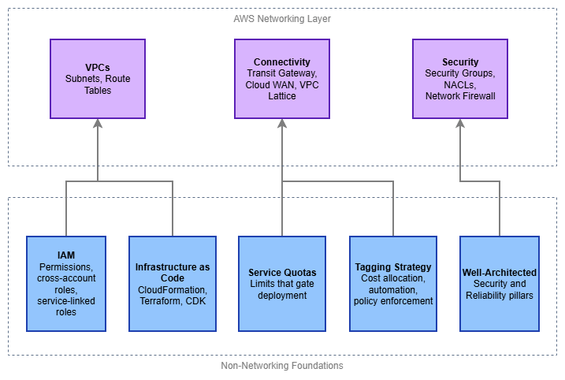

# 시작하기 전에 {#before-you-start}

AWS 네트워킹은 독립적으로 존재하지 않습니다. 모든 VPC, 라우팅 테이블, Transit Gateway 연결은 계정 내에 존재하며, IAM 정책의 적용을 받고, 서비스 할당량의 제한을 받으며, 코드를 통해 배포되어야 합니다. 단 하나의 CIDR 블록도 건드리기 전에 이러한 비(非)네트워킹 기반을 올바르게 구축해 두면, 나중에 수정하기 가장 어려운 유형의 문제들을 예방할 수 있습니다. 예를 들어 계정 간 공유를 차단하는 권한 오류, 프로덕션 배포 중 할당량 소진, 비용 귀속을 불가능하게 만드는 태그 없는 리소스, 그리고 조용히 드리프트되는 수동 구성 등이 이에 해당합니다.

이 페이지에서는 네트워킹 레이어 아래에 위치하는 사전 요구 사항을 다룹니다. 이 중 어느 것도 네트워킹에 특화된 내용은 아니지만, 모두 실제 운영 환경에서 네트워크 아키텍처가 동작하는 방식에 영향을 미칩니다.

/// caption
비(非)네트워킹 기반 — [Drawio 소스](../assets/foundation/prerequisites-layers.drawio)
///

## Identity and Access Management (IAM) {#identity-and-access-management-iam}

IAM은 AWS의 모든 것을 관장하는 컨트롤 플레인입니다. VPC 생성, Transit Gateway 어태치먼트, AWS RAM을 통한 리소스 공유 등 모든 API 호출은 IAM이 승인하는 작업입니다. IAM 기반이 취약하면 네트워킹 자동화가 진단하기 어려운 방식으로 실패합니다. 예를 들어 계정 간 리소스 공유가 자동으로 거부되거나, 서비스 연결 역할에 권한이 누락되거나, 지나치게 제한적인 SCP로 인해 배포 파이프라인이 차단될 수 있습니다.

**네트워킹 관점에서 특히 중요한 사항:**

* **계정 간 역할 및 신뢰 정책** — 멀티 계정 네트워킹은 예외가 아닌 표준입니다. Transit Gateway 공유, Route 53 Resolver 규칙 연결, VPC Lattice 서비스 네트워크, AWS RAM 공유는 모두 계정 간 IAM 신뢰를 필요로 합니다. 현재 작업 중인 계정만이 아니라, 실제로 사용할 리소스 공유 패턴을 지원하도록 역할 신뢰 정책을 설계하세요.
* **서비스 연결 역할(Service-Linked Roles)** — AWS Transit Gateway, Amazon VPC Lattice, AWS Network Firewall과 같은 서비스는 서비스 연결 역할을 자동으로 생성합니다. 이 역할에는 서비스 운영에 필요한 특정 권한이 포함됩니다. 서비스 연결 역할이 존재한다는 것, 처음 사용 시 생성된다는 것, 그리고 `iam:CreateServiceLinkedRole`을 차단하는 SCP나 권한 경계가 서비스 프로비저닝을 중단시킬 수 있다는 점을 반드시 이해하세요.
* **서비스 제어 정책(SCPs)** — AWS Organizations 환경에서 SCP는 모든 계정의 최대 권한 경계를 설정합니다. 흔한 실수 중 하나는 `ec2:*` 작업을 제한하는 SCP를 배포하면서, VPC, 서브넷, 라우팅 테이블, 보안 그룹, ENI 작업이 모두 `ec2:` 네임스페이스에 속한다는 사실을 간과하는 것입니다. SCP를 네트워킹 작업에 대해 명시적으로 테스트하세요.
* **네트워크 리소스에 대한 조건 키** — IAM은 `ec2:Vpc`, `ec2:Subnet`, `aws:RequestedRegion`과 같은 조건 키를 지원하여 특정 네트워크 경계로 권한 범위를 제한할 수 있습니다. 이를 활용하면 잘못된 VPC나 리전에 리소스가 실수로 생성되는 것을 방지할 수 있습니다.

***핵심 인사이트:*** *네트워킹에서 가장 흔한 IAM 실패는 "단일 리소스에 대한 권한 거부"가 아닙니다. 개발 환경(동일 계정)에서는 정상 동작하다가 운영 환경(다른 계정, 다른 Organization)에서 깨지는 계정 간 신뢰 관계가 진짜 원인입니다. 계정 간 IAM 경로를 초기에 테스트하세요.*

## 코드형 인프라(Infrastructure as Code) {#infrastructure-as-code}

네트워킹 인프라는 거의 항상 코드로 관리되며, 그럴 만한 이유가 있습니다. 네트워크 리소스는 수명이 길고, 상호 의존적이며, 여러 팀이 공유합니다. 콘솔에서 수동으로 생성한 VPC는 누군가 이를 복제하거나, 감사하거나, 특정 라우트가 존재하는 이유를 파악해야 하는 순간 부채가 됩니다. AWS 코드형 인프라의 세 가지 주요 도구는 **AWS CloudFormation**, **Terraform**, **AWS CDK**이며, 각각 운영 모델이 다릅니다.

**도구 선택 기준:**

* **AWS CloudFormation** — AWS 네이티브 서비스로, AWS Organizations(다중 계정 배포를 위한 StackSets), 드리프트 감지, 변경 세트와 긴밀하게 통합됩니다. 환경이 AWS 전용이고 배포 오케스트레이션을 AWS가 관리하길 원할 때 가장 적합합니다. CloudFormation이 기본적으로 지원하지 않는 작업을 위한 사용자 지정 리소스를 포함하여 네트워킹 리소스를 폭넓게 지원합니다.
* **Terraform** — 프로바이더 기반, 상태 파일 방식으로 멀티 클라우드를 지원합니다. AWS 프로바이더는 네트워킹 리소스를 포괄적으로 다룹니다. 팀이 이미 Terraform을 사용 중이거나, 여러 클라우드에 걸쳐 리소스를 관리해야 하거나, HCL의 선언적 스타일을 선호할 때 가장 적합합니다. 상태 파일 관리가 필요합니다(S3 + DynamoDB 잠금과 같은 원격 백엔드 사용 권장).
* **AWS CDK** — 내부적으로 CloudFormation을 생성하지만, TypeScript, Python, Java, Go, C# 등 범용 프로그래밍 언어로 인프라를 정의할 수 있습니다. 팀이 범용 프로그래밍 언어를 선호하고 재사용 가능한 컨스트럭트를 구축하고자 할 때 가장 적합합니다. `aws-ec2` 모듈은 VPC, 서브넷, 라우팅을 위한 L2 컨스트럭트를 제공하며, 합리적인 기본값으로 일반적인 패턴을 처리합니다.

**네트워킹 IaC에서 중요한 패턴:**

* **네트워크 인프라와 워크로드 인프라를 분리** — VPC, Transit Gateway 어태치먼트, 라우팅 테이블 등 네트워크 리소스는 애플리케이션 리소스와 변경 주기가 다릅니다. 워크로드 배포가 공유 네트워크 인프라를 실수로 수정하지 않도록 별도의 스택 또는 상태 파일로 배포하세요.
* **출력 및 크로스 스택 참조 활용** — 네트워킹 스택은 워크로드 스택이 사용하는 값(VPC ID, 서브넷 ID, 라우팅 테이블 ID)을 생성합니다. CloudFormation 내보내기, Terraform 원격 상태 데이터 소스, 또는 SSM Parameter Store를 통해 이 값들을 명확하게 내보내세요.
* **CIDR 블록 파라미터화** — CIDR 범위를 절대 하드코딩하지 마세요. 파라미터로 전달하거나 IPAM에서 조회하세요. 이것이 템플릿을 여러 환경에서 재사용 가능하게 만드는 핵심입니다.
* **임시 환경으로 테스트** — 테스트 계정에서 전체 네트워크 스택을 구동하고, 연결성을 검증한 후 삭제하세요. 이를 통해 할당량 문제, IAM 신뢰 오류, 라우팅 오류를 프로덕션에 반영되기 전에 발견할 수 있습니다.

***핵심 인사이트:*** *도구보다 규율이 더 중요합니다. 하나를 선택하고 일관되게 사용하며, 프로덕션 계정의 네트워크 리소스에 대한 수동 콘솔 변경을 절대 허용하지 마세요. 코드와 실제 상태 간의 드리프트는 성숙한 AWS 환경에서 네트워킹 장애의 가장 큰 단일 원인입니다.*

## 서비스 할당량 {#service-quotas}

AWS는 네트워킹 리소스에 기본 한도를 적용하며, 그 값은 예상보다 낮은 경우가 많습니다. 리전당 VPC 기본값 5개는 넉넉해 보이지만, 각 계정에 VPC가 최소 하나씩 필요한 멀티 계정 랜딩 존을 운영하다 보면 금세 부족해집니다. 라우팅 테이블당 기본 라우트 50개도 VPC 60개와 피어링하기 전까지는 충분해 보입니다. 프로덕션 배포 중 할당량 소진은 충분히 예방할 수 있는 장애입니다.

**네트워킹 팀이 가장 자주 마주치는 할당량:**

| 리소스 | 기본 한도 | 중요한 이유 |
|----------|:---:|---|
| 리전당 VPC 수 | 5 | 공유 서비스 계정에서 멀티 계정 환경은 금방 한도에 도달 |
| VPC당 서브넷 수 | 200 | 대부분 문제없으나, 다수의 계층을 가진 대규모 멀티 AZ 설계에서 근접 가능 |
| 라우팅 테이블당 라우트 수 | 50 | Transit Gateway 및 VPC 피어링은 목적지마다 라우트 항목 하나씩 소비 |
| ENI당 보안 그룹 수 | 5 | 세분화된 보안 그룹 규칙을 사용하는 마이크로서비스 아키텍처에서 한도 도달 |
| VPC당 VPC 피어링 연결 수 | 50 | 메시 토폴로지에서 한도에 도달; Transit Gateway가 해결책 |
| Transit Gateway 연결 수 | 5,000 | 수백 개의 계정을 보유한 대규모 조직에서 근접 가능 |
| RAM 공유당 참여자 수 | 5,000 | 대규모 Transit Gateway 및 VPC Lattice 공유 시 해당 |

**할당량 관리 모범 사례:**

* **설계 전 할당량 감사** — 사용할 모든 리전에서 `aws service-quotas list-service-quotas --service-code ec2` 및 `--service-code vpc` 명령을 실행하세요. 기본값과 아키텍처의 리소스 수를 비교하세요.
* **선제적으로 증가 요청** — 할당량 증가 요청은 처리까지 몇 시간에서 며칠이 걸릴 수 있습니다. 배포 실패 후가 아니라 환경 프로비저닝 단계에서 미리 제출하세요.
* **CloudWatch에서 적용된 할당량 모니터링** — Service Quotas는 사용률 지표를 게시합니다. 한도에 도달하기 전에 증가를 요청할 시간을 확보할 수 있도록 사용률 80%에서 알람을 설정하세요.
* **IaC에서 할당량 고려** — Terraform 또는 CloudFormation 템플릿이 할당량에 근접하는 리소스를 생성하는 경우 이를 문서화하세요. 더 나아가 배포 전 사전 검사를 추가하세요.

***핵심 인사이트:*** *할당량은 버그가 아니라 가드레일입니다. 그러나 기본값은 공유 서비스 계정이나 네트워킹 계정이 아닌 단일 워크로드 계정을 가정하고 설정되어 있습니다. 할당량 계획을 사후 작업이 아닌 아키텍처 설계의 일부로 다루세요.*

## IPv6 준비 상태 {#ipv6-readiness}

IPv6는 미래의 고려 사항이 아니라 현대 AWS 네트워킹의 현재 요구 사항입니다. 모든 새 VPC는 처음부터 듀얼 스택으로 구성해야 하며, 네트워킹 이외의 기반 요소들도 이를 지원할 준비가 되어 있어야 합니다. IPv6 준비 상태의 실패는 미묘하게 나타납니다. IPv6가 활성화된 VPC에 IPv4 규칙만 있는 보안 그룹이 있거나, `::/0` 항목 없이 라우팅 테이블을 생성하는 IaC 템플릿이 있거나, IPv6 트래픽을 조용히 차단하는 NACL이 있는 경우가 그 예입니다.

**사전 요구 사항에서 IPv6 준비 상태가 의미하는 것:**

* **보안 그룹에 명시적인 IPv6 규칙 필요** — IPv4 규칙은 IPv6 트래픽에 자동으로 적용되지 않습니다. 포트 443에서 `0.0.0.0/0`을 허용하는 보안 그룹이 포트 443에서 `[::]/0`을 허용하지는 않습니다. IaC 템플릿의 모든 보안 그룹에는 두 프로토콜 패밀리가 모두 포함되어야 합니다.
* **NACL에서 IPv6 허용 필요** — 기본 NACL은 모든 트래픽(IPv4 및 IPv6)을 허용하지만, 사용자 지정 NACL에는 명시적인 IPv6 항목이 필요합니다. 인바운드에서 `0.0.0.0/0`을 허용하는 사용자 지정 NACL은 IPv6 인바운드를 허용하지 않습니다.
* **IaC 템플릿에 처음부터 듀얼 스택 포함 필요** — VPC 템플릿은 IPv4 CIDR과 Amazon 제공 IPv6 `/56`을 모두 할당해야 합니다. 서브넷 템플릿은 IPv4 CIDR과 IPv6 `/64`를 모두 할당해야 합니다. 라우팅 테이블에는 `0.0.0.0/0`과 `::/0` 항목이 모두 필요합니다. 기존 템플릿에 IPv6를 나중에 추가하는 것은 처음부터 포함하는 것보다 훨씬 많은 작업이 필요합니다.
* **`ec2:` 작업을 참조하는 IAM 정책** — IPv6 관련 작업(예: `ec2:AssignIpv6Addresses`)이 `ec2:*` 작업을 제한하는 SCP 또는 권한 경계에 의해 의도치 않게 차단되지 않아야 합니다.
* **DNS 확인** — 애플리케이션은 듀얼 스택 DNS 응답(A 레코드와 함께 제공되는 AAAA 레코드)을 처리할 수 있어야 합니다. DNS가 IPv6 주소를 반환할 때 애플리케이션 코드, 헬스 체크, 모니터링 도구가 올바르게 작동하는지 테스트하세요.

***핵심 인사이트:*** *가장 흔한 IPv6 실패는 "VPC가 지원하지 않는다"가 아니라 "보안 그룹에 IPv4 규칙만 있다"입니다. 처음부터 IaC 템플릿, 보안 그룹 모듈, NACL 기준선에 IPv6를 포함하면 이 유형의 문제 전체가 사라집니다.*

## 태깅 전략 {#tagging-strategy}

태그는 메타데이터이지만, AWS 네트워킹에서는 비용 할당, 자동화 타겟팅, 정책 적용을 위한 핵심 메커니즘이기도 합니다. 태그가 없는 VPC는 비용을 귀속시킬 수 없고, 자동화가 안정적으로 타겟팅할 수 없으며, 컴플라이언스 규칙도 평가할 수 없습니다. 수백 개의 VPC와 수천 개의 서브넷이 존재하는 멀티 계정 네트워킹 환경에서 일관된 태깅은 운영 가시성과 혼돈을 가르는 기준이 됩니다.

**네트워크 리소스를 위한 최소 실행 가능 태깅 표준:**

* **`Environment`** — `production`, `staging`, `development`. 자동화 동작을 제어합니다(예: 프로덕션 리소스 자동 삭제 방지).
* **`Owner`** — 리소스를 담당하는 팀. Transit Gateway 연결이 용량을 소비하고 있을 때 담당자를 파악해야 하는 경우에 필수적입니다.
* **`CostCenter`** — 청구 할당을 위한 태그. 네트워크 리소스(NAT 게이트웨이, Transit Gateway 연결, VPC 엔드포인트)는 반드시 귀속되어야 하는 상당한 비용을 발생시킵니다.
* **`ManagedBy`** — `cloudformation`, `terraform`, `cdk`, 또는 `manual`. 리소스 관리 방식과 수정 가능 여부를 식별합니다.
* **`Name`** — 설명적이고 일관성 있게 작성합니다. `{env}-{region}-{purpose}-{type}` 형식의 명명 규칙을 사용하세요(예: `prod-use1-shared-tgw`).

**적용 메커니즘:**

* **AWS Organizations 태그 정책** — 조직 수준에서 필수 태그와 허용 값을 정의합니다. 비준수 리소스는 플래그 처리됩니다(적용 모드에 따라 차단될 수도 있습니다).
* **SCP 기반 적용** — 요청에 필수 태그가 포함되지 않은 경우 `ec2:CreateVpc`, `ec2:CreateSubnet` 및 기타 네트워킹 작업을 거부합니다.
* **AWS Config 규칙** — `required-tags` 규칙이 기존 리소스를 평가하고 수정이 필요한 비준수 항목에 플래그를 지정합니다.

***핵심 인사이트:*** *태깅은 사후가 아닌 리소스 생성 시점에 적용하세요. 수백 개의 네트워크 리소스에 소급하여 태그를 붙이는 작업은 번거롭고 오류가 발생하기 쉽습니다. 리소스 생성 시 태그를 요구하는 SCP 또는 IAM 정책 조건을 적용하는 것이 분기별 태깅 수정 작업보다 훨씬 비용 효율적입니다.*

## AWS Well-Architected Framework {#aws-well-architected-framework}

Well-Architected Framework는 네트워킹 결정이 따라야 할 아키텍처 원칙을 제공합니다. 두 가지 핵심 원칙이 네트워크 아키텍처와 직접적으로 관련됩니다: **보안(Security)**과 **안정성(Reliability)**. 세 번째 원칙인 **비용 최적화(Cost Optimization)**는 Transit Gateway, NAT 게이트웨이, VPC 엔드포인트를 대규모로 운영할 때 매우 중요해집니다.

**보안 원칙 — 네트워킹에 적용되는 사항:**

* **심층 방어(Defense in depth)** — 보안 제어를 계층화합니다: ENI 수준의 보안 그룹, 서브넷 수준의 NACL, VPC 경계의 Network Firewall 또는 GWLB, 애플리케이션 엣지의 AWS WAF. 단일 계층만으로는 충분하지 않습니다.
* **네트워크 접근 최소 권한** — 기본 거부(default-deny) 보안 그룹, 명시적 라우팅 테이블 항목, 그리고 가능한 모든 곳에서 퍼블릭 엔드포인트 대신 PrivateLink를 사용합니다.
* **공격 표면 축소** — 기본적으로 프라이빗 서브넷을 사용하고, AWS 서비스 접근에는 VPC 엔드포인트를 활용하며, 명시적으로 필요한 경우가 아니면 퍼블릭 IP를 할당하지 않습니다.

**안정성 원칙 — 네트워킹에 적용되는 사항:**

* **기본적으로 다중 AZ 구성** — 모든 네트워킹 구성 요소(NAT 게이트웨이, Network Firewall 엔드포인트, 로드 밸런서)는 여러 가용 영역에 걸쳐 배포해야 합니다. 단일 AZ 네트워킹은 그 위에 있는 모든 것에 대한 단일 장애 지점이 됩니다.
* **장애 반경 제한** — 여러 VPC와 계정을 사용하여 장애를 격리합니다. 한 VPC에서 발생한 잘못된 라우팅 설정이 다른 VPC로 전파되어서는 안 됩니다.
* **장애 모드 테스트** — 가용 영역 장애, Transit Gateway 연결 손실, DNS 확인 실패를 시뮬레이션합니다. 무엇이 중단되고 어떻게 복구되는지 파악해 두어야 합니다.

**비용 최적화 원칙 — 네트워킹에 적용되는 사항:**

* **데이터 전송 요금 이해** — AZ 간, 리전 간, Transit Gateway 처리, NAT 게이트웨이 처리, VPC 엔드포인트 시간당 요금이 모두 누적됩니다. 불필요한 데이터 이동을 최소화하는 방향으로 설계합니다.
* **NAT 비용 절감을 위한 VPC 엔드포인트 활용** — VPC 엔드포인트를 통해 S3, DynamoDB 및 기타 AWS 서비스로 전송되는 트래픽은 NAT 게이트웨이 처리 요금을 완전히 피할 수 있습니다.
* **연결 방식 적정화** — 두 개의 VPC에 VPC 피어링으로 충분하다면 Transit Gateway를 배포하지 않습니다. 단일 리전 Transit Gateway로 토폴로지를 커버할 수 있다면 AWS Cloud WAN을 배포하지 않습니다.

***핵심 인사이트:*** *Well-Architected는 구축 후에 완료하는 체크리스트가 아니라, 설계 과정에서 적용하는 원칙의 집합입니다. 첫 번째 네트워크 다이어그램을 그리기 전에, 그린 후가 아니라 그 전에 보안 및 안정성 원칙을 검토하세요.*

---

## 문서 {#documentation}

*   :material-shield-account: **IAM 사용자 가이드**

    ---

    ID 및 액세스 관리 기초, 정책, 역할, 계정 간 액세스 패턴.

    [:octicons-arrow-right-24: IAM 문서](https://docs.aws.amazon.com/IAM/latest/UserGuide/introduction.html)

*   :material-code-braces: **AWS CloudFormation**

    ---

    StackSets, 드리프트 감지, 변경 세트를 포함한 AWS 네이티브 코드형 인프라.

    [:octicons-arrow-right-24: CloudFormation 문서](https://docs.aws.amazon.com/AWSCloudFormation/latest/UserGuide/Welcome.html)

*   :material-terraform: **Terraform AWS 프로바이더**

    ---

    모든 네트워킹 리소스를 다루는 HashiCorp의 AWS 프로바이더 문서.

    [:octicons-arrow-right-24: Terraform AWS 프로바이더](https://registry.terraform.io/providers/hashicorp/aws/latest/docs)

*   :material-gauge: **서비스 할당량**

    ---

    AWS 서비스 한도를 조회하고 관리하며 증가를 요청합니다.

    [:octicons-arrow-right-24: 서비스 할당량 문서](https://docs.aws.amazon.com/servicequotas/latest/userguide/intro.html)

*   :material-tag-multiple: **태깅 모범 사례**

    ---

    AWS 태깅 전략, 태그 정책 및 적용 메커니즘.

    [:octicons-arrow-right-24: 태깅 문서](https://docs.aws.amazon.com/tag-editor/latest/userguide/tagging.html)

*   :material-check-decagram: **Well-Architected Framework**

    ---

    보안, 안정성, 성능, 비용, 운영 우수성에 걸친 아키텍처 모범 사례.

    [:octicons-arrow-right-24: Well-Architected Framework](https://docs.aws.amazon.com/wellarchitected/latest/framework/welcome.html)

## 다음 단계 {#next-steps}

이러한 기반이 마련되면, 다음 순서에 따라 기반(Foundation) 주제를 학습하세요:

1. **[AWS Organizations](organizations.md)** — 네트워크 리소스의 공유 및 격리 방식을 관리하는 멀티 계정 구조
2. **[Amazon VPC](vpc.md)** — 다른 모든 것이 구축되는 기반이 되는 격리된 가상 네트워크
3. **[리전 및 가용 영역](regions-azs.md)** — 지리적 분산과 안정성을 높이는 멀티 AZ 패턴
4. **[CIDR 계획](cidr.md)** — 대규모 환경에서 충돌을 방지하는 IP 주소 할당 전략
5. **[서브넷](subnets.md)** — VPC 내 네트워크 세분화
6. **[IPAM](ipam.md)** — 멀티 계정 환경을 위한 중앙 집중식 IP 주소 관리
