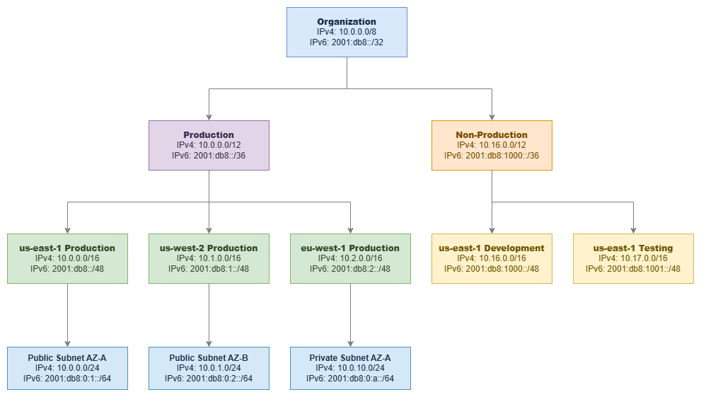

# CIDR 블록을 활용한 IP 주소 계획 {#ip-address-planning-with-cidr-blocks}

!!! info "사전 요구 사항"
    이 섹션은 [시작하기 전에](aws-prerequisites.md), [Amazon VPC](vpc.md), [리전 및 가용 영역](regions-azs.md)에 대한 기본 지식을 전제로 합니다. AWS 네트워킹 기초가 처음이라면 해당 페이지를 먼저 검토하세요.

IP 주소 계획은 AWS 배포 초기에 내리는 결정 중 나중에 쉽게 변경할 수 없는 가장 중요한 결정입니다. 모든 VPC, 모든 서브넷, 모든 피어링 연결, 모든 하이브리드 링크, 모든 라우팅 테이블은 생성 시점에 선택한 CIDR 블록에 의해 제약을 받습니다. 올바르게 설계하면 네트워크가 수년간 깔끔하게 확장됩니다. 잘못 설계하면 주소 범위 중복, 주소 공간 고갈, 그리고 두 VPC가 동일한 범위를 공유하는 탓에 가능해야 할 연결이 불가능한 상황을 수년간 해결하며 보내게 됩니다.

CIDR(Classless Inter-Domain Routing, 클래스 없는 도메인 간 라우팅) 표기법은 IP 주소 계획의 언어입니다. 이는 구식 클래스 기반 체계(클래스 A, B, C)를 가변 길이 프리픽스로 대체하여 필요한 크기에 맞게 주소 공간을 정밀하게 분할할 수 있게 합니다. VPC, Transit Gateway, Cloud WAN, Direct Connect, VPN 등 모든 AWS 네트워킹 서비스는 CIDR을 사용합니다. CIDR을 완전히 이해하는 것은 선택이 아닌 필수입니다.

/// caption
계층적 CIDR 할당 — [Drawio 소스](../assets/foundation/cidr-hierarchy.drawio)
///

***핵심 인사이트:*** *조직 → 환경 → 리전 → VPC → 서브넷으로 이어지는 계층적 CIDR 할당은 단순히 깔끔한 정리 정돈이 아닙니다. 이를 통해 경로 요약(route summarization)이 가능해지고, 방화벽 규칙이 단순해지며, 라우팅 테이블을 읽는 누구에게나 네트워크 토폴로지가 명확하게 전달됩니다.*

## CIDR 표기법 이해하기 {#understanding-cidr-notation}

CIDR 표기법은 IP 주소 범위를 `IP_ADDRESS/PREFIX_LENGTH` 형식으로 나타냅니다.

**예시**: `10.0.0.0/16`

* **IP 주소**: `10.0.0.0` — 네트워크 주소(범위의 시작점)
* **프리픽스 길이**: `/16` — 네트워크 부분에서 고정된 비트 수(나머지 비트는 호스트에 사용 가능)
* **주소 범위**: `10.0.0.0` ~ `10.0.255.255` (65,536개 주소)
* **서브넷 마스크**: `255.255.0.0`

프리픽스 길이는 블록에 포함된 주소 수를 결정합니다. `/16`은 2^(32-16) = 65,536개의 주소를 가집니다. 프리픽스가 짧을수록 더 많은 주소를, 길수록 더 적은 주소를 포함합니다. 프리픽스를 1씩 늘릴 때마다 주소 공간은 절반으로 줄어듭니다.

### 일반적인 CIDR 블록 크기 {#common-cidr-block-sizes}

| CIDR | 주소 수 | 서브넷 내 사용 가능* | 일반적인 용도 |
|------|---------|---------------------|--------------|
| /16  | 65,536  | 65,531              | 엔터프라이즈 환경을 위한 대형 VPC, 서브넷 확장에 최대 여유 공간 확보 |
| /20  | 4,096   | 4,091               | 중형 VPC, 부서별 또는 단일 워크로드 VPC |
| /24  | 256     | 251                 | 표준 서브넷 크기, 밀도와 관리 편의성의 균형 |
| /26  | 64      | 59                  | 방화벽 엔드포인트, NAT 게이트웨이, TGW 연결용 소형 서브넷 |
| /28  | 16      | 11                  | 최소 VPC 또는 서브넷 크기, 특정 서비스 전용 |

*AWS는 각 서브넷에서 IP 주소 5개를 예약합니다(처음 4개와 마지막 1개).

### RFC 1918 사설 주소 범위 {#rfc-1918-private-address-ranges}

VPC에 사용할 수 있는 사설 IP 범위는 다음과 같습니다.

| 범위 | CIDR | 주소 수 | 권장 사항 |
|------|------|---------|----------|
| 10.0.0.0 – 10.255.255.255 | 10.0.0.0/8 | 16,777,216 | **대부분의 조직에 권장.** 가장 큰 연속 공간으로, 계층적 주소 할당을 깊이 있게 지원합니다. |
| 172.16.0.0 – 172.31.255.255 | 172.16.0.0/12 | 1,048,576 | 보조 범위로 적합. 온프레미스 네트워크에서 이미 사용 중인 경우가 많습니다. |
| 192.168.0.0 – 192.168.255.255 | 192.168.0.0/16 | 65,536 | 프로덕션 AWS 환경에서는 사용을 피하세요. 멀티 계정 환경에 비해 너무 작으며, 가정용 네트워크와 VPN 클라이언트에서 흔히 사용되어 주소 충돌이 발생할 수 있습니다. |

### AWS 워크로드를 위한 추가 범위 {#additional-ranges-for-aws-workloads}

RFC 1918 외에도 AWS VPC는 다음 범위를 지원합니다.

* **100.64.0.0/10** (캐리어 등급 NAT 범위): VPC CNI 사용자 지정 네트워킹 기능을 사용하는 EKS 파드 네트워킹에 유용합니다. 파드는 이 범위에서 IP를 할당받으므로, 노드 및 기타 리소스를 위한 기본 RFC 1918 공간을 보존할 수 있습니다. RFC 1918 공간이 소진된 경우에도 활용됩니다.
* **RFC 6815 공간** (`198.19.0.0/16`): 다른 범위가 소진되었을 때 VPC의 보조 CIDR로 사용할 수 있습니다.

***핵심 인사이트:*** *`100.64.0.0/10` 범위는 EKS 중심 환경을 위한 전략적 도구입니다. 단일 EKS 클러스터는 파드에 수천 개의 IP 주소를 소비할 수 있습니다. 커스텀 네트워킹을 통해 파드 네트워킹을 `100.64.0.0/10`에 할당하면, 기본 VPC CIDR을 노드, 로드 밸런서 및 기타 인프라에 온전히 활용할 수 있습니다.*

## 모범 사례 {#best-practices}

### CIDR 할당 전략 {#cidr-allocation-strategy}

#### 경로 요약을 위한 연속적 할당 {#allocate-contiguously-for-route-summarization}

좋은 CIDR 계획의 가장 중요한 특성은 동일한 논리 그룹 내의 할당이 **연속적**이어야 한다는 것입니다. us-east-1의 모든 프로덕션 VPC가 `10.0.0.0/12` 범위 안에 있다면, 각 VPC에 대한 개별 `/16` 경로 대신 온프레미스 네트워크에 단일 `/12` 경로 요약(route summarization)을 광고할 수 있습니다. 이것이 중요한 이유는 다음과 같습니다.

* 라우팅 테이블에는 크기 제한이 있습니다(Transit Gateway는 10,000개의 경로를 지원하지만, 온프레미스 라우터는 훨씬 적게 지원할 수 있습니다).
* 경로 수가 적을수록 장애 후 수렴 속도가 빨라집니다.
* 경로 요약은 방화벽 규칙을 단순화합니다. VPC별 항목 대신 하나의 규칙으로 전체 환경을 커버할 수 있습니다.
* 온프레미스로의 BGP 광고가 더 깔끔하고 안정적입니다.

**잘못된 할당** (비연속적, 요약 불가):

* 프로덕션 VPC 1: `10.0.0.0/16`
* 개발 VPC: `10.1.0.0/16`
* 프로덕션 VPC 2: `10.5.0.0/16`

**올바른 할당** (연속적, `10.0.0.0/12`로 요약 가능):

* 프로덕션 VPC 1: `10.0.0.0/16`
* 프로덕션 VPC 2: `10.1.0.0/16`
* 프로덕션 VPC 3: `10.2.0.0/16`

#### 프로덕션 VPC는 /16으로 시작하기 {#start-with-16-for-production-vpcs}

`/16`은 65,536개의 주소와 256개의 `/24` 서브넷을 생성할 수 있는 공간을 제공합니다. 멀티 AZ 배포(3개 이상의 가용 영역 × 여러 서브넷 계층), EKS 파드 밀도, 향후 성장, 그리고 VPC CIDR을 생성 후 축소할 수 없다는 사실을 고려하면 이 크기가 과도해 보이지 않습니다. `/16`의 비용은 0입니다(VPC의 IP 주소는 Elastic IP나 퍼블릭 IPv4를 사용하기 전까지 무료입니다). 하지만 공간이 부족해지면 고통스러운 마이그레이션이 필요합니다.

규모에 대해 확신이 있는 비프로덕션 워크로드의 경우, `/20`(4,096개 주소)이 합리적인 선택입니다. 격리된 단일 목적 VPC(검사 VPC, Transit Gateway 연결 VPC)의 경우 `/24` 또는 `/28`으로도 충분할 수 있습니다.

***핵심 인사이트:*** *VPC의 기본 CIDR 블록은 축소할 수 없습니다. 나중에 보조 CIDR을 추가할 수 있지만, 보조 CIDR에는 제한이 있습니다. 기존 CIDR과 겹칠 수 없고, 일부 서비스는 이를 완전히 지원하지 않으며, 운영 복잡성이 증가합니다. 기본 CIDR을 처음부터 올바르게 설정하는 것이 나중에 수정하는 것보다 항상 비용이 적게 듭니다.*

#### 연결 가능성이 있는 VPC 간 CIDR 블록 중복 금지 {#never-overlap-cidr-blocks-across-vpcs-you-might-connect}

CIDR 블록이 겹치는 VPC는 VPC 피어링, Transit Gateway, 또는 Cloud WAN을 통해 연결할 수 없습니다. 이는 절대적인 제약 사항으로, 네트워크 계층에서 우회 방법이 없습니다. VPC A가 `10.0.0.0/16`을 사용하고 VPC B가 `10.0.5.0/24`를 사용한다면, `10.0.5.0/24`가 `10.0.0.0/16` 범위 안에 포함되기 때문에 이 두 VPC는 피어링하거나 Transit Gateway 라우팅 테이블을 공유할 수 없습니다.

중복 문제를 해결하는 유일한 방법은 PrivateLink(ENI를 사용하며 라우팅 가능한 연결이 필요 없음) 또는 VPC Lattice(애플리케이션 계층에서 동작)입니다. 하지만 이는 서비스 수준의 솔루션이지 네트워크 수준의 연결이 아닙니다. VPC 간 IP 수준 라우팅이 필요한 경우(대부분의 조직이 그렇습니다), CIDR 중복은 치명적입니다.

이는 아직 생성하지 않은 VPC를 포함하여 전체 조직에 적용됩니다. 할당 계획에서 미래 계정과 리전을 위한 주소 공간을 미리 예약해 두세요.

#### 처음부터 하이브리드 연결 계획하기 {#plan-for-hybrid-connectivity-from-day-one}

AWS 환경이 온프레미스 네트워크, 기업 데이터 센터, 또는 다른 클라우드와 연결될 가능성이 조금이라도 있다면, 처음부터 모든 환경에 걸쳐 CIDR 할당을 조율해야 합니다. CIDR 중복으로 인한 하이브리드 연결 실패는 워크로드의 IP 재할당이 필요하기 때문에 수정 비용이 가장 많이 드는 네트워킹 실수 중 하나입니다. 이 과정은 DNS, 애플리케이션 구성, 방화벽 규칙, 모니터링 시스템 모두에 영향을 미칩니다.

이를 위해 다음이 필요합니다.

1. **AWS CIDR을 할당하기 전에 모든 온프레미스 IP 범위를 문서화하세요.** 지사, 파트너 네트워크, 인수한 회사 네트워크, 원격 접속 VPN 풀을 포함하세요. 모르고 있는 범위가 바로 중복될 범위입니다.
2. **온프레미스 할당과 절대 충돌하지 않는 AWS용 비중복 공간을 예약하세요.** 명확한 분리(예: 온프레미스는 `10.128.0.0/9`, AWS는 `10.0.0.0/9`)는 모호함을 없애줍니다.
3. **온프레미스 주소를 관리하는 네트워크 팀과 조율하세요.** 6개월 후에 데이터 센터 범위와 겹치는 것이 발견된 일방적인 AWS CIDR 결정은 VPC 재생성을 강제합니다.
4. **VPN 클라이언트 풀을 고려하세요.** 원격 접속 VPN 클라이언트는 AWS와 온프레미스 네트워크 모두와 겹치지 않는 IP 범위가 필요합니다. 많은 조직이 클라이언트 VPN 풀로 `172.16.0.0/12`를 사용합니다.
5. **인수합병을 계획하세요.** 회사가 다른 조직을 인수하면, 그들의 네트워크 범위가 여러분의 문제가 됩니다. 일반적인 기업 할당과 충돌할 가능성이 낮은 공간을 예약해 두세요.

일반적인 패턴: `10.0.0.0/8`을 할당하되 온프레미스는 `10.128.0.0/9`, AWS는 `10.0.0.0/9`를 사용합니다. 이렇게 하면 각 환경에 800만 개의 주소가 주어지며 중복 위험이 없습니다. 기존 온프레미스 할당이 `10.0.0.0/8` 전체에 분산되어 있는 조직의 경우, AWS에 `172.16.0.0/12`를 사용하거나 네트워크 팀과 협력하여 `10.x` 공간에서 사용되지 않는 부분을 찾으세요.

***핵심 인사이트:*** *가장 흔한 하이브리드 연결 실패는 Direct Connect 구성 오류나 BGP 잘못된 구성이 아닙니다. 워크로드가 이미 실행 중인 후에 발견되는 CIDR 중복입니다. AWS 할당을 하기 전에 "임시" 랩 네트워크와 잊혀진 지사를 포함한 모든 기존 범위를 문서화하세요.*

#### 멀티 리전 할당 전략 설계 {#design-a-multi-region-allocation-strategy}

조직 할당 내에서 각 리전에 전용 블록을 할당하세요. 이를 통해 리전별 경로 요약이 가능하고 확장 시 리전 간 중복을 방지할 수 있습니다.

**멀티 리전 구성 예시** (AWS용 `10.0.0.0/9` 내):

| 리전 | CIDR 블록 | 용도 |
|--------|-----------|---------|
| us-east-1 | 10.0.0.0/12 | 기본 리전 |
| us-west-2 | 10.16.0.0/12 | DR / 보조 리전 |
| eu-west-1 | 10.32.0.0/12 | 유럽 워크로드 |
| ap-southeast-1 | 10.48.0.0/12 | 아시아 태평양 워크로드 |
| 예약 | 10.64.0.0/10 | 향후 리전 |

각 `/12`는 리전당 1,048,576개의 주소를 제공합니다. 이는 16개의 `/16` VPC 또는 256개의 `/20` VPC에 충분한 양입니다. 예약된 블록은 기존 할당을 재구성하지 않고도 새 리전으로 확장할 수 있도록 보장합니다.

Direct Connect 또는 VPN을 통해 온프레미스에 경로를 광고할 때, 리전별 할당을 사용하면 개별 VPC 프리픽스 대신 리전당 단일 경로 요약(예: us-east-1 전체에 대해 `10.0.0.0/12`)을 광고할 수 있습니다. 이를 통해 온프레미스 라우팅 테이블을 작게 유지하고 BGP 세션을 안정적으로 유지할 수 있습니다.

***핵심 인사이트:*** *전체 주소 공간의 최소 50%를 향후 성장을 위해 예약하세요. 조직은 3~5년 후에 필요한 VPC, 계정, 리전의 수를 지속적으로 과소평가합니다. 주소 공간은 무료이지만, 부족해지는 것은 그렇지 않습니다.*

#### IPv4와 함께 IPv6 계획하기 {#plan-ipv6-alongside-ipv4}

AWS VPC에서 IPv6는 IPv4와 다르게 작동하며 별도의 계획이 필요합니다.

* **VPC 수준**: 각 VPC는 `/56` IPv6 CIDR을 받습니다(256개의 `/64` 서브넷 사용 가능). Amazon 제공 주소를 사용하거나 자체 IP를 가져올 수 있습니다(BYOIP).
* **서브넷 수준**: 각 서브넷은 VPC의 `/56`에서 `/64`를 받습니다. 이는 고정값으로, 다른 서브넷 프리픽스 길이를 선택할 수 없습니다.
* **NAT 불필요**: IPv6 주소는 전역적으로 고유합니다. 이그레스 전용 인터넷 게이트웨이(egress-only IGW)는 NAT 없이 아웃바운드 전용 인터넷 접속을 제공합니다.
* **듀얼 스택**: 대부분의 조직은 전환 기간 동안 IPv6 전용보다는 듀얼 스택(IPv4 + IPv6)으로 운영합니다.
* **주소 고갈 우려 없음**: 단일 `/56`은 4,722,366,482,869,645,213,696개의 주소를 제공합니다. IPv6에서 고갈은 계획 요소가 아닙니다.

**IPv6 CIDR 소스 옵션:**

| 소스 | 사용 사례 | 고려 사항 |
|--------|----------|---------------|
| Amazon 제공 | 대부분의 워크로드 기본값 | Amazon 풀에서 주소가 할당되며, 연결 해제 시 변경됨 |
| BYOIP (자체 IP 가져오기) | 기존 IPv6 할당이 있는 기업 | RIR 등록 및 ROA 필요; 주소 이식성 제공 |
| IPAM 관리 Amazon 풀 | 일관된 할당이 필요한 멀티 계정 | Amazon 풀에서 할당하되 거버넌스를 위해 IPAM을 통해 관리 |

IPv6 계획은 한 가지 측면에서 IPv4보다 단순합니다. 주소 공간이 너무 방대하여 고갈이 우려되지 않습니다. 복잡성은 보안 그룹, NACL, 라우팅 테이블, 방화벽 규칙이 IPv6 트래픽 경로를 고려하도록 보장하는 데 있습니다. 많은 조직이 IPv6 서브넷이 기본적으로 인터넷 라우팅 가능하다는 점을 간과합니다. 이그레스 전용 인터넷 게이트웨이(egress-only IGW)는 아웃바운드 접속을 제공하지만, 적절한 보안 그룹 규칙 없이는 퍼블릭 IPv6 주소를 가진 리소스가 인터넷에서 접근 가능합니다.

**IPv6 계획 체크리스트:**

* VPC를 생성하기 전에 Amazon 제공 vs BYOIP를 결정하세요(나중에 변경하려면 연결 해제가 필요합니다).
* IPv6 규칙을 포함하도록 모든 보안 그룹을 업데이트하세요(IPv4 규칙은 IPv6 트래픽에 자동으로 적용되지 않습니다).
* IPv6 경로(`::/0`을 인터넷 게이트웨이 또는 이그레스 전용 인터넷 게이트웨이(egress-only IGW)로)를 라우팅 테이블에 구성하세요.
* NACL이 필요한 흐름에 대해 IPv6 트래픽을 허용하는지 확인하세요.
* 애플리케이션과 DNS 확인이 듀얼 스택을 올바르게 처리하는지 검증하세요.

#### 보조 CIDR은 전략적으로 사용하고 의존하지 않기 {#use-secondary-cidrs-strategically-not-as-a-crutch}

AWS는 VPC당 최대 5개의 IPv4 CIDR 블록(기본 1개 + 보조 4개)을 허용합니다. 보조 CIDR은 다음 용도에 유용합니다.

* **EKS 파드 네트워킹**: 파드 IP 공간으로 `100.64.0.0/16`을 보조 CIDR로 추가
* **인수합병**: 임시 주소 공간이 필요한 새로 인수한 회사의 워크로드 통합
* **점진적 마이그레이션**: 적절한 IP 재할당을 계획하는 동안 비중복 공간 추가

보조 CIDR은 적절한 초기 계획의 **대체재가 아닙니다**. 복잡성이 증가합니다. 라우팅 테이블에 각 CIDR에 대한 항목이 필요하고, 일부 서비스는 여러 CIDR을 일관성 없이 처리하며, VPC당 여러 범위를 관리하는 운영 오버헤드가 수백 개의 VPC에 걸쳐 누적됩니다.

***핵심 인사이트:*** *VPC에 보조 CIDR을 정기적으로 추가하고 있다면, 초기 할당이 너무 작았던 것입니다. 보조 CIDR은 설계 패턴이 아닌 비상 탈출구로 취급하세요.*

#### 일반적인 CIDR 계획 실수 피하기 {#avoid-common-cidr-planning-mistakes}

| 실수 | 문제점 | 예방책 |
|---------|-------------|------------|
| 프로덕션에 `192.168.0.0/16` 사용 | 홈 네트워크, VPN 클라이언트, 많은 온프레미스 환경과 중복됨 | AWS 프로덕션에는 `10.0.0.0/8` 사용 |
| "공간 절약"을 위해 `/24` VPC 할당 | 서브넷 용량이 빠르게 소진됨; 멀티 AZ나 EKS를 위한 공간 없음 | 프로덕션은 기본 `/16`, 비프로덕션은 최소 `/20` |
| 향후 리전을 위한 예약 공간 없음 | 확장 시 비연속적 할당 강제 | 전체 할당의 50% 이상 예약 |
| 온프레미스 범위 무시 | 발견된 중복이 하이브리드 연결을 차단함 | AWS 할당 전에 모든 기존 범위 문서화 |
| 조율 없는 팀별 할당 | 팀이 독립적으로 중복 범위를 선택함 | IPAM 또는 공유 레지스트리를 통해 할당 중앙화 |
| VPC CIDR을 변경 가능한 것으로 취급 | 기본 CIDR은 제거할 수 없으며 VPC 재생성을 강제함 | 처음부터 기본 CIDR을 영구적인 것으로 계획 |

## CIDR 계획과 다른 서비스의 결합 {#combining-cidr-planning-with-other-services}

CIDR 계획은 독립적인 활동이 아닙니다. CIDR 계획은 다른 모든 네트워킹 서비스를 직접적으로 가능하게 하거나 제약합니다. 주소 할당에 관한 결정은 이후에 채택하는 모든 연결 패턴에 파급 효과를 미칩니다. 잘 설계된 CIDR 계획은 Transit Gateway 라우팅 테이블을 깔끔하게 유지하고, Direct Connect BGP 광고를 단순하게 만들며, Cloud WAN 세그먼트 라우팅을 예측 가능하게 합니다. 반면 잘못 설계된 계획은 모든 계층에서 우회 방법을 강요합니다.

아래 표는 CIDR 결정이 주요 AWS 네트워킹 서비스와 어떻게 상호작용하는지 보여줍니다.

| 조합 | CIDR 계획이 제공하는 것 | 다른 서비스가 제공하는 것 |
|---|---|---|
| **CIDR + IPAM** | 계층적 할당 체계, 크기 표준, 예약 범위 | 자동화된 할당 적용, 중복 방지, 컴플라이언스 감사, 멀티 계정 거버넌스 |
| **CIDR + Transit Gateway** | 라우팅 테이블을 공유할 수 있는 중복 없는 VPC 범위, 경로 요약을 위한 연속 블록 | 리전 허브 앤 스포크 라우팅, 중앙화된 이그레스, 공유 서비스 연결 |
| **CIDR + Direct Connect / 하이브리드** | 온프레미스와 절대 중복되지 않는 AWS 범위, BGP 광고를 위한 요약 가능한 블록 | 전용 프라이빗 연결, 예측 가능한 대역폭, 데이터 전송 비용 절감 |
| **CIDR + VPC 피어링** | 피어링된 VPC 간 엄격하게 중복 없는 범위(부분 중복 불허) | 대역폭 병목 없는 직접 저지연 연결 |
| **CIDR + Cloud WAN** | 세그먼트 경계에 맞춰 정렬된 리전별 연속 할당, 라우팅 정책을 위한 요약 가능한 프리픽스 | 글로벌 정책 기반 네트워크, 세그먼트 격리, 서비스 삽입, 멀티 리전 라우팅 |
| **CIDR + EKS (VPC CNI)** | 파드 네트워킹을 위한 보조 CIDR(`100.64.0.0/10`), 노드에 맞게 크기가 조정된 기본 CIDR | VPC 네이티브 보안 그룹 및 네트워크 정책을 갖춘 파드 수준 네트워킹 |

가장 흔한 실패 패턴은 새로운 서비스를 도입하려는 시점에서야 CIDR 제약을 발견하는 것입니다. 예를 들어, Transit Gateway를 배포한 후 서로 다른 계정의 두 VPC가 팀별로 독립적으로 할당한 결과 동일한 `10.0.0.0/16` 범위를 사용하고 있다는 사실을 발견하는 경우가 있습니다. 또는 Direct Connect를 구성한 후 AWS 범위가 아무도 문서화하지 않은 지사 사무소 서브넷과 중복된다는 것을 깨닫는 경우도 있습니다. 이는 Transit Gateway나 Direct Connect의 문제가 아니라, 배포 시점에 드러나는 CIDR 계획 문제입니다.

***핵심 인사이트:*** *이후에 도입하는 모든 네트워킹 서비스는 여러분의 CIDR 계획으로부터 혜택을 받거나 제약을 받게 됩니다. 적절한 할당 체계를 수립하는 데 투자하는 30분은 Transit Gateway, Direct Connect, Cloud WAN 배포 전반에 걸친 수백 시간의 우회 작업을 절약해 줍니다.*

## 서브넷 CIDR 계획 {#subnet-cidr-planning}

VPC 내에서 서브넷 설계는 워크로드의 격리 방식, 각 가용 영역에서 실행할 수 있는 리소스 수, 그리고 라우팅 테이블이 트래픽 흐름을 제어하는 방식을 결정합니다. 서브넷 CIDR은 VPC의 CIDR 블록에서 분할되며, 서로 겹칠 수 없습니다.

모든 서브넷은 VPC CIDR의 연속된 일부를 사용합니다. AWS는 각 서브넷에서 5개의 주소를 예약합니다: 네트워크 주소, VPC 라우터(`.1`), DNS 서버(`.2`), 향후 사용을 위해 예약된 주소(`.3`), 그리고 브로드캐스트 주소(마지막 IP)입니다. 따라서 `/24` 서브넷은 256개가 아닌 251개의 사용 가능한 주소를 제공합니다.

**3개 가용 영역에 걸친 `/16` VPC의 권장 서브넷 레이아웃:**

| 서브넷 계층 | AZ-A | AZ-B | AZ-C | 크기 | 용도 |
|-------------|------|------|------|------|---------|
| 퍼블릭 | 10.0.0.0/24 | 10.0.1.0/24 | 10.0.2.0/24 | /24 (251개 사용 가능) | 로드 밸런서, NAT 게이트웨이, 배스천 호스트 |
| 프라이빗 (애플리케이션) | 10.0.10.0/24 | 10.0.11.0/24 | 10.0.12.0/24 | /24 (251개 사용 가능) | 애플리케이션 서버, 컨테이너, Lambda |
| 프라이빗 (데이터) | 10.0.20.0/24 | 10.0.21.0/24 | 10.0.22.0/24 | /24 (251개 사용 가능) | RDS, ElastiCache, OpenSearch |
| 프라이빗 (예비) | 10.0.30.0/24 | 10.0.31.0/24 | 10.0.32.0/24 | /24 (251개 사용 가능) | 향후 사용, 추가 계층 |
| TGW/방화벽 | 10.0.250.0/28 | 10.0.250.16/28 | 10.0.250.32/28 | /28 (11개 사용 가능) | Transit Gateway ENI, 방화벽 엔드포인트 |

**서브넷 크기 결정 지침:**

* `/24`는 대부분의 워크로드에 적합한 표준 서브넷 크기입니다. 가용 영역당 251개의 사용 가능한 주소를 제공하며, 대부분의 애플리케이션 계층을 충분히 수용합니다.
* 파드가 기본 CIDR을 사용하는 경우 EKS 워커 노드 서브넷에는 `/20` 이상을 사용하세요(각 노드는 파드 용량에 비례하여 IP를 소비합니다).
* 소수의 ENI만 호스팅하는 인프라 서브넷(Transit Gateway 연결, Network Firewall 엔드포인트, NAT 게이트웨이)에는 `/28`을 사용하세요.
* 번호 체계에 간격을 두세요(위에서 `.2.0`에서 `.10.0`으로 건너뛰는 것을 참고). 이렇게 하면 기존 번호를 변경하지 않고도 새로운 서브넷 계층을 삽입할 수 있습니다.

**서브넷 설계 원칙:**

* **가용 영역 간 일관성 유지**: 모든 가용 영역은 동일한 크기의 동일한 서브넷 계층을 가져야 합니다. 이를 통해 가용 영역 간 용량 차이 없이 워크로드를 페일오버할 수 있습니다.
* **계층별 별도 라우팅 테이블**: 퍼블릭 서브넷은 인터넷 게이트웨이로 라우팅하고, 프라이빗 서브넷은 NAT를 통해 라우팅하거나 내부에 머뭅니다. 단일 라우팅 테이블에 계층을 혼합하면 보안 위험이 발생합니다.
* **최소 3개의 가용 영역 계획**: 2개로 시작하더라도 처음부터 3개의 가용 영역을 위한 서브넷 체계를 설계하세요. 처음부터 계획했다면 일관된 체계로 세 번째 가용 영역을 나중에 추가하는 것은 간단합니다.
* **인프라 서브넷을 위한 공간 예약**: Transit Gateway 연결, Network Firewall 엔드포인트, Gateway Load Balancer 엔드포인트는 각각 가용 영역당 하나의 서브넷이 필요합니다. `/28`만 있으면 되지만 모든 가용 영역에 존재해야 합니다.

***핵심 인사이트:*** *서브넷 체계의 번호 간격은 낭비되는 공간이 아니라 미래를 대비한 설계입니다. 처음 세 계층에 10.0.0.0/24, 10.0.1.0/24, 10.0.2.0/24를 사용하는 VPC는 그 사이에 새로운 계층을 삽입할 여지가 없습니다. 간격이 있는 체계(0, 10, 20, 30)를 사용하면 기존 서브넷을 방해하지 않고 5, 15, 25에 새로운 계층을 추가할 수 있습니다.*

## 문서 {#documentation}

*   :material-file-document: **VPC CIDR 블록**

    ---

    VPC CIDR 블록 구성, 제한 사항 및 지원 범위에 관한 공식 문서입니다.

    [:octicons-arrow-right-24: 문서](https://docs.aws.amazon.com/vpc/latest/userguide/vpc-cidr-blocks.html)

*   :material-file-document: **서브넷 크기 조정**

    ---

    서브넷 CIDR 블록의 작동 방식, 예약된 주소 및 크기 조정 시 고려 사항을 설명합니다.

    [:octicons-arrow-right-24: 문서](https://docs.aws.amazon.com/vpc/latest/userguide/configure-subnets.html#subnet-sizing)

*   :material-file-document: **서브넷 CIDR 예약**

    ---

    특정 서비스의 전용 사용 등 특정 사용 사례를 위해 서브넷 CIDR 공간의 일부를 예약합니다.

    [:octicons-arrow-right-24: 문서](https://docs.aws.amazon.com/vpc/latest/userguide/subnet-cidr-reservation.html)

*   :material-book-open-variant: **확장 가능한 멀티 VPC 네트워크 구축**

    ---

    대규모 IP 주소 계획, 멀티 계정 전략 및 연결 패턴을 다루는 AWS 백서입니다.

    [:octicons-arrow-right-24: 백서](https://docs.aws.amazon.com/whitepapers/latest/building-scalable-secure-multi-vpc-network-infrastructure/welcome.html)

*   :material-post: **하이퍼스케일 VPC 네트워크 설계**

    ---

    대규모 CIDR 계획, 주소 공간 관리 및 성장 전략에 관한 블로그 게시물입니다.

    [:octicons-arrow-right-24: 블로그 게시물](https://aws.amazon.com/blogs/networking-and-content-delivery/designing-hyperscale-amazon-vpc-networks/)

*   :material-book-open-variant: **RFC 1918 - 사설 주소 할당**

    ---

    VPC CIDR 계획에 사용되는 사설 IPv4 주소 범위를 정의하는 기본 RFC입니다.

    [:octicons-arrow-right-24: RFC 1918](https://datatracker.ietf.org/doc/html/rfc1918)

---

## 관련 기반 주제 {#related-foundation-topics}

이 페이지는 CIDR 계획 원칙을 다룹니다. 관련 기반 주제는 다음을 참조하세요.

* **[Amazon VPC](vpc.md)** — VPC 설계 패턴, 다중 AZ 아키텍처, 그리고 VPC 구조가 CIDR 계획을 기반으로 구성되는 방식
* **[서브넷](subnets.md)** — CIDR 할당 내의 서브넷 계층, 라우팅 테이블 설계, 네트워크 ACL
* **[AWS IPAM](ipam.md)** — CIDR 할당 자동화, 중복 방지, 조직 전반에 걸친 정책 적용
* **[리전 및 가용 영역](regions-azs.md)** — 리전 선택이 다중 리전 CIDR 할당 전략에 미치는 영향
* **[AWS Organizations](organizations.md)** — CIDR 계층 구조가 반영해야 할 계정 구조
