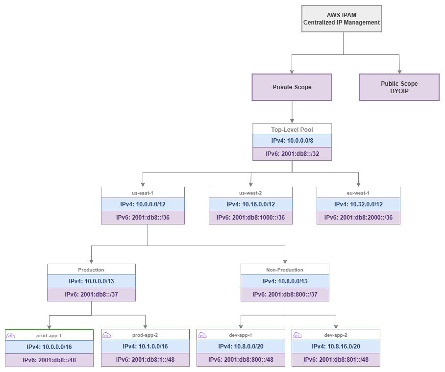

# IP 주소 관리(IPAM) {#ip-address-management-ipam}

!!! info "사전 요구 사항"
    이 섹션은 [시작하기 전에](aws-prerequisites.md), [AWS Organizations](organizations.md), [Amazon VPC](vpc.md), [CIDR 계획](cidr.md)에 대한 이해를 전제로 합니다. AWS 네트워킹 기반이 처음이라면 해당 페이지를 먼저 검토하세요.

AWS IPAM(IP Address Management)은 조직의 IP 주소 공간을 위한 컨트롤 플레인입니다. 스프레드시트, Confluence 페이지, 암묵적 지식을 대체하여 AWS Organization 내 모든 계정과 리전에 걸쳐 IP 주소를 계획, 할당, 추적, 모니터링하는 중앙 집중식 정책 기반 시스템을 제공합니다. IPAM 없이는 IP 주소 관리가 조율의 병목으로 전락합니다. 팀은 CIDR 블록을 요청하는 티켓을 제출하고, 네트워킹 엔지니어는 수동으로 중복 여부를 확인하며, 다음에 생성할 VPC가 기존 VPC와 충돌하지 않는다는 확신을 아무도 갖지 못합니다. IPAM은 할당을 자동화하고, 중복을 방지하며, 감사 가능한 체계를 제공함으로써 이러한 마찰을 제거합니다.

이 서비스는 풀(pool)의 계층 구조를 통해 동작합니다. 풀은 리전, 환경, 사업부별로 구성된 CIDR 범위의 집합이며, 크기, 태깅, 위치 제약을 적용하는 할당 규칙을 포함합니다. 팀이 VPC를 생성할 때 적절한 풀에서 CIDR을 요청하면, IPAM은 조직 표준을 준수하는 중복 없는 할당을 보장합니다. 티켓도, 수동 확인도, 스프레드시트 업데이트도 필요하지 않습니다.


/// caption
IPAM 풀 계층 구조 — [Drawio 소스](../assets/foundation/ipam-pool-hierarchy.drawio)
///

## 주요 기능 {#key-capabilities}

<div class="grid cards" markdown>

*   :material-ip-network: **계층적 풀 관리**

    ---

    리전, 환경, 워크로드 유형별로 IP 주소 공간을 중첩 풀로 구성합니다. 풀은 상위 풀의 제약 조건을 상속하고 모든 수준에서 할당 규칙을 적용합니다.

*   :material-shield-check: **중복 방지**

    ---

    모든 할당은 전체 풀 계층 구조에 대해 검증됩니다. IPAM은 두 VPC가 충돌하는 CIDR 블록을 받지 않도록 보장하여, 멀티 계정 환경에서 가장 흔히 발생하는 네트워킹 실수를 원천 차단합니다.

*   :material-chart-pie: **사용률 모니터링**

    ---

    모든 풀, 리전, 계정에 걸쳐 할당되고 사용 중이며 사용 가능한 주소 공간을 실시간으로 파악할 수 있습니다. 풀이 고갈에 가까워지면 알림을 발송합니다.

*   :material-tag-check: **할당 규칙**

    ---

    모든 할당에 대해 최소 및 최대 CIDR 크기, 필수 태그, 로케일 제한을 적용합니다. 규칙을 통해 팀이 부적절한 크기의 블록을 요청하거나 허가되지 않은 리전에 배포하는 것을 방지합니다.

*   :material-account-multiple: **Organizations 통합**

    ---

    IPAM 관리를 네트워킹 계정에 위임하고, RAM을 통해 조직 전체에 풀을 공유하며, 모든 멤버 계정의 컴플라이언스를 자동으로 모니터링합니다.

*   :material-clipboard-check: **컴플라이언스 감사**

    ---

    지속적인 모니터링을 통해 할당 규칙을 위반하거나, 관리형 풀과 중복되거나, 필수 태그가 누락된 수동 할당 CIDR을 가진 VPC를 탐지합니다.

</div>

## AWS IPAM을 사용해야 하는 경우 {#when-to-use-aws-ipam}

AWS 환경이 한 명의 엔지니어가 머릿속으로 추적할 수 있는 규모를 넘어서는 순간, IPAM은 필수가 됩니다. 그 임계점은 대부분의 팀이 예상하는 것보다 훨씬 낮습니다.

**IPAM을 사용해야 하는 경우:**

* 여러 계정에 걸쳐 5~10개 이상의 VPC를 운영하는 경우. 수동 추적은 금방 한계에 부딪히며, CIDR 중복이 한 번 발생하면(수정하려면 VPC를 재생성해야 함) 수년치 IPAM 비용을 훌쩍 넘어서는 손실이 발생합니다.
* 여러 팀이 독립적으로 VPC를 생성하는 경우. 중앙화된 할당 체계 없이는 팀들이 서로 충돌하거나 온프레미스 네트워크와 충돌하는 CIDR을 선택하게 됩니다.
* VPC 간 또는 온프레미스 네트워크와의 연결이 필요한 경우. CIDR이 겹치면 해당 VPC 간에 Transit Gateway, Cloud WAN, VPC Peering을 사용할 수 없게 됩니다.
* 컴플라이언스 프레임워크에서 IP 주소 거버넌스 및 감사 추적을 증명해야 하는 경우.
* Infrastructure as Code로 VPC 프로비저닝을 계획하는 경우. IPAM 풀은 CloudFormation 및 Terraform과 직접 통합되어, 충돌 없는 완전 자동화 VPC 생성을 지원합니다.

**IPAM 도입을 미룰 수 있는 경우:**

* 하이브리드 연결 없이 단일 계정에서 VPC를 1~2개만 운영하는 경우. 이 경우에도 초기에 IPAM을 설정해 두면 나중에 소급 적용하는 수고를 덜 수 있습니다.
* 프로덕션 네트워크와 절대 연결되지 않을 격리된 샌드박스 계정만 운영하는 경우.

***핵심 인사이트:*** *IPAM을 사용하지 않을 때의 비용은 재앙이 닥치기 전까지는 눈에 보이지 않습니다. CIDR 중복은 VPC 피어링을 시도하거나, Transit Gateway에 연결하거나, 하이브리드 연결을 구성할 때 비로소 발견됩니다. 그 시점에서 유일한 해결책은 VPC를 재생성하고 워크로드를 마이그레이션하는 것뿐입니다. IPAM은 중복으로 인한 운영 중단에 비하면 극히 저렴한 비용으로 제공되는 보험입니다.*

## 모범 사례 {#best-practices}

### 풀 계층 구조 설계 {#pool-hierarchy-design}

#### 풀은 조직 → 리전 → 환경 → 워크로드 순으로 하향식으로 설계하세요 {#design-pools-top-down-organization-region-environment-workload}

풀 계층 구조는 조직의 구조를 반영하고, 주소 공간을 어떻게 관리할지를 나타내야 합니다. 최상위에 전체 프라이빗 범위를 두고, 리전별로 세분화(경로 요약 가능)한 다음, 환경별로 나누고(격리 적용), 선택적으로 워크로드 유형별로 구분(서로 다른 크기 규칙 적용)합니다.

일반적인 엔터프라이즈를 위한 잘 설계된 계층 구조 예시:

* **최상위 풀**: `10.0.0.0/8` — 전체 프라이빗 주소 공간
* **리전 풀**: 리전당 `/12` — 각 리전에 1,048,576개의 주소 제공(수천 개의 VPC에 충분)
* **환경 풀**: 리전 내 환경당 `/13` 또는 `/14` — 프로덕션과 비프로덕션 분리
* **워크로드 풀** (선택 사항): 워크로드 유형당 `/16` 이상 — EKS 클러스터와 일반 VPC에 서로 다른 할당 규칙 적용

이 구조는 모든 계층에서 경로 요약을 가능하게 합니다. 온프레미스 네트워크는 모든 VPC에 대한 개별 라우트를 관리하는 대신, us-east-1 전체에 대해 `10.0.0.0/12`로 라우팅할 수 있습니다. 이러한 요약은 온프레미스 라우터의 라우팅 테이블 크기를 줄이고 방화벽 규칙을 단순화합니다.

#### 리전 풀은 넉넉하게 크기를 설정하세요 — 주소 공간은 희소 자원이 아닙니다 {#size-regional-pools-generously-address-space-is-not-a-scarce-resource}

IPAM에서 가장 흔한 실수는 리전 풀을 너무 작게 만드는 것입니다. `/16` 리전 풀은 `/24` VPC 256개 또는 `/20` VPC 16개만 수용합니다. 수십 개의 계정에 걸쳐 프로덕션, 스테이징, 개발, 샌드박스 환경을 고려하면 이것으로는 부족합니다.

최상위 풀이 `/8`이라면 리전 풀에는 `/12`를 사용하세요. 이렇게 하면 각 리전에 `/16` 블록 16개 또는 `/20` 블록 256개가 제공되어 수년간의 성장에 충분합니다. 더 작은 최상위 범위(예: 나머지가 온프레미스에서 사용 중이어서 `10.0.0.0/10`)로 제한된 경우에도 리전당 최소 `/14`를 할당하세요.

풀을 크게 설정하는 비용은 없습니다 — 풀에서 사용되지 않는 주소 공간은 비용이 발생하지 않습니다. 반면 너무 작게 설정하면 하위의 모든 VPC를 재할당해야 하는 풀 재구성이 필요합니다.

#### 프로덕션과 비프로덕션을 위한 별도의 풀 브랜치를 만드세요 {#create-separate-pool-branches-for-production-and-non-production}

프로덕션과 비프로덕션 워크로드는 동일한 풀 내의 서로 다른 할당이 아닌, 서로 다른 풀 브랜치에서 주소를 가져와야 합니다. 이 분리를 통해 다음이 가능합니다:

* 서로 다른 할당 규칙 (프로덕션 VPC는 `/16`, 개발 VPC는 `/20`)
* 서로 다른 공유 정책 (프로덕션 풀은 프로덕션 OU에만 공유)
* 독립적인 사용률 모니터링 (프로덕션 풀 소진은 개발 풀 소진과 심각도가 다름)
* 환경별 경로 요약 (프로덕션 트래픽을 다르게 처리하는 방화벽 규칙에 유용)

***핵심 인사이트:*** *풀 계층 구조는 인프라로 표현된 IP 거버넌스 모델입니다. 리전당 하나의 풀로 구성된 평면 계층 구조는 중복 방지만 제공합니다. 깊은 계층 구조는 거버넌스, 요약, 환경 격리, 차별화된 할당 규칙을 제공하며, 이 모든 것이 자동으로 시행됩니다.*

### 할당 규칙 {#allocation-rules}

#### 모든 풀에 최소 및 최대 CIDR 크기를 설정하세요 {#set-minimum-and-maximum-cidr-sizes-on-every-pool}

팀이 할당받는 모든 풀에는 명시적인 크기 제약이 있어야 합니다. 그렇지 않으면 팀이 개발 풀에서 `/16`을 요청(주소 공간 낭비)하거나 프로덕션 워크로드에 `/28`을 요청(즉각적인 확장 문제 발생)할 수 있습니다.

권장 크기 규칙:

| 풀 유형 | 최소 CIDR | 최대 CIDR | 이유 |
| --- | --- | --- | --- |
| 프로덕션 | `/20` | `/16` | 프로덕션 VPC는 성장 여유, 여러 서브넷 계층, IP를 많이 사용하는 서비스(EKS, ECS)를 위한 공간이 필요 |
| 비프로덕션 | `/24` | `/20` | 개발/테스트 VPC는 공간이 덜 필요하지만 기본 서브넷 계층은 수용해야 함 |
| 샌드박스 | `/26` | `/24` | 샌드박스 VPC는 임시적이고 소규모이므로 주소 공간 절약 |
| EKS 워크로드 | `/16` | `/16` | VPC CNI를 사용하는 EKS는 IP를 공격적으로 소비하므로 크기 부족 시 파드 스케줄링 실패 발생 |

#### 모든 할당에 태그를 필수로 지정하세요 {#require-tags-on-every-allocation}

할당 규칙은 CIDR이 부여되기 전에 특정 태그를 요구할 수 있습니다. 최소한 다음을 요구하세요:

* `Environment` (production, staging, development, sandbox)
* `Team` 또는 `CostCenter` (책임 추적용)
* `Application` (추적 가능성 확보용)

필수 태그는 두 가지 역할을 합니다: 할당 시점에 거버넌스를 적용하고(팀은 주소 공간을 받기 전에 VPC를 분류해야 함), 이후 IPAM의 컴플라이언스 모니터링이 태그가 없거나 잘못 태그된 리소스를 식별할 수 있게 합니다.

#### 로케일 제한을 사용하여 리전 간 할당 실수를 방지하세요 {#use-locale-restrictions-to-prevent-cross-region-allocation-mistakes}

각 풀은 특정 AWS 리전으로 제한할 수 있습니다. `us-east-1`로 지정된 풀은 `us-west-2`의 할당 요청을 거부합니다. 이를 통해 팀이 실수로 잘못된 리전 풀에서 할당받아 다른 리전을 위한 주소 공간을 소비하고 요약 전략을 망가뜨리는 흔한 실수를 방지합니다.

최상위 수준 아래의 모든 풀에 로케일을 설정하세요. 최상위 풀은 모든 리전에 걸쳐 있지만, 리전 풀 및 그 하위 풀에는 항상 로케일을 설정해야 합니다.

***핵심 인사이트:*** *할당 규칙은 관료주의가 아닙니다 — 세 가지 가장 비용이 큰 IPAM 실수를 방지하는 가드레일입니다: 공간을 낭비하는 과도한 할당, VPC 재생성이 필요한 부족한 할당, 경로 요약을 망가뜨리는 리전 간 할당.*

### 스코프: 프라이빗 vs. 퍼블릭 {#scopes-private-vs-public}

#### 모든 RFC 1918 및 RFC 6598 주소 관리에는 프라이빗 스코프를 사용하세요 {#use-the-private-scope-for-all-rfc-1918-and-rfc-6598-address-management}

프라이빗 스코프는 내부 IP 주소 공간을 관리하는 곳입니다: RFC 1918 범위(`10.0.0.0/8`, `172.16.0.0/12`, `192.168.0.0/16`)와 RFC 6598 공유 주소 공간(`100.64.0.0/10`, EKS 파드 네트워킹에 일반적으로 사용). 모든 조직에 프라이빗 스코프가 필요하며, 이것이 IPAM의 핵심 사용 사례입니다.

#### 퍼블릭 스코프는 자체 IP 주소(BYOIP)를 가져올 때만 사용하세요 {#use-the-public-scope-only-when-you-bring-your-own-ip-addresses-byoip}

퍼블릭 스코프는 BYOIP 프로세스를 통해 AWS에 등록한 공개 라우팅 가능한 IPv4 주소를 관리합니다. 대부분의 조직에는 이것이 필요하지 않습니다 — AWS가 할당한 퍼블릭 IP와 Elastic IP는 IPAM 외부에서 관리됩니다. 퍼블릭 스코프는 다음과 같은 경우에 관련이 있습니다:

* 이식 가능한 IPv4 주소 블록(ARIN, RIPE 등에서)을 소유하고 AWS에서 사용하려는 경우
* 클라우드 공급자 간에 일관된 퍼블릭 IP 주소를 유지해야 하는 경우
* 조직 소유의 퍼블릭 주소 공간 사용을 의무화하는 컴플라이언스 요구 사항이 있는 경우

퍼블릭 IPv4 블록을 소유하지 않는다면 퍼블릭 스코프는 완전히 무시하세요. AWS가 할당한 주소에는 아무런 가치를 제공하지 않습니다.

### IPv6 풀 관리 {#ipv6-pool-management}

#### 처음부터 IPAM 계층 구조에 IPv6 풀을 포함하세요 {#include-ipv6-pools-in-your-ipam-hierarchy-from-day-one}

IPAM은 IPv4와 함께 IPv6 풀 관리를 지원하며, 풀 계층 구조에는 두 주소 패밀리가 모두 포함되어야 합니다. IPv6 풀은 주소 공간이 방대하여(소진 우려 없음) 할당 모델이 더 단순하지만(Amazon 제공 VPC당 `/56`, BYOIP의 경우 `/48`), 거버넌스는 여전히 중요합니다: 어떤 VPC에 IPv6가 활성화되어 있는지 추적하고, 일관된 할당 소스를 보장하며, 조직 전체의 가시성을 유지해야 합니다.

**IPv6 풀 소스:**

| 소스 | IPAM에서의 작동 방식 | 사용 사례 |
| --- | --- | --- |
| **Amazon 제공 IPv6** | IPAM이 Amazon의 IPv6 풀에서 할당합니다. 각 VPC는 `/56`을 받습니다. 주소는 Amazon 소유이며 연결 해제 시 변경됩니다. | 대부분의 조직의 기본값. RIR 등록 불필요. |
| **BYOIP IPv6** | 자체 IPv6 블록(ARIN, RIPE, APNIC에서)을 IPAM의 퍼블릭 스코프에 프로비저닝한 후 해당 블록에서 풀을 생성합니다. 각 VPC는 해당 블록에서 `/56`을 받습니다. | 주소 이식성이나 환경 간 일관된 프리픽스를 원하는 기존 IPv6 할당을 보유한 조직. |
| **IPAM 풀을 통한 Amazon 제공** | `amazon`을 소스로 하는 IPAM 풀을 생성합니다. IPAM이 Amazon 풀에서 할당을 관리하지만 거버넌스(할당 규칙, 태깅, 컴플라이언스 모니터링)를 제공합니다. | 두 가지 장점 모두 제공: Amazon 제공 주소와 IPAM 거버넌스. IPv6 블록을 소유하지 않지만 중앙 집중식 추적을 원하는 조직에 권장. |

#### IPv6 풀을 IPv4 계층 구조와 병렬로 구성하세요 {#structure-ipv6-pools-parallel-to-your-ipv4-hierarchy}

IPv4 풀 구조를 반영하는 IPv6 풀을 생성하세요: 최상위 → 리전 → 환경. IPv6 소진은 우려 사항이 아니지만, 병렬 구조는 다음을 제공합니다:

* 일관된 거버넌스 (동일한 할당 규칙, 동일한 필수 태그)
* 통합 컴플라이언스 모니터링 (VPC당 두 주소 패밀리에 대한 단일 뷰)
* 명확한 감사 추적 (어떤 VPC에 IPv6가 있는지, 언제 활성화되었는지, 어떤 풀에서 왔는지)

#### IPAM을 사용하여 듀얼 스택 도입을 강제하세요 {#use-ipam-to-enforce-dual-stack-adoption}

IPAM 컴플라이언스 모니터링은 IPv4 할당은 있지만 IPv6 할당이 없는 VPC를 식별할 수 있어, 듀얼 스택 도입 진행 상황을 추적하는 데 유용합니다. 조직이 IPv6 우선으로 전환함에 따라 IPAM은 어떤 VPC에 아직 IPv6 활성화가 필요한지 파악하는 가시성을 제공합니다.

***핵심 인사이트:*** *IPAM의 IPv6 풀 관리는 소진 방지에 관한 것이 아닙니다(그것은 IPv4 문제입니다). 거버넌스와 가시성에 관한 것입니다: 어떤 VPC에 IPv6가 있는지 파악하고, 조직 전체에서 일관된 할당 소스를 보장하며, 듀얼 스택 도입 진행 상황을 추적하는 것입니다. 희소성 우려가 없어도 거버넌스 가치는 동일합니다.*

### 위임된 관리 {#delegated-administration}

#### IPAM을 중앙 집중식 네트워킹 계정에 위임하세요 {#delegate-ipam-to-your-centralized-networking-account}

IPAM은 Organizations 관리 계정이 아닌 전용 네트워킹 계정(또는 공유 서비스 계정)에서 관리해야 합니다. 위임된 관리는 관리 계정을 깔끔하게 유지하면서(Organizations, 청구, SCP만 처리해야 함) 네트워킹 팀에 완전한 IPAM 제어권을 부여합니다.

위임된 관리자 계정은 다음을 수행할 수 있습니다:

* 모든 IPAM 풀 및 할당 규칙 생성 및 관리
* 전체 조직의 컴플라이언스 모니터링
* RAM을 통해 다른 계정과 풀 공유
* 모든 멤버 계정의 IP 주소 사용량 조회

#### 개별 계정이 아닌 OU 수준에서 풀을 공유하세요 {#share-pools-at-the-ou-level-not-individual-accounts}

AWS RAM을 통해 IPAM 풀을 공유할 때는 특정 계정이 아닌 Organizational Unit과 공유하세요. 이렇게 하면 OU에 추가된 새 계정이 수동 개입 없이 자동으로 적절한 풀에 접근할 수 있습니다. 계정 벤딩 프로세스가 올바른 OU에 계정을 생성하면 IPAM 풀 접근이 자동으로 따라옵니다.

공유 구조를 풀 계층 구조와 일치시키세요:

* 프로덕션 OU → 프로덕션 풀 접근
* 개발 OU → 비프로덕션 풀 접근
* 샌드박스 OU → 샌드박스 풀 접근

***핵심 인사이트:*** *위임된 관리 + OU 수준 공유는 팀이 자동으로 올바른 주소 공간을 받는 셀프 서비스 모델을 만듭니다. 네트워킹 팀이 규칙을 한 번 정의하면, 이후의 모든 VPC 생성은 사람의 개입 없이 해당 규칙을 따릅니다.*

### 컴플라이언스 모니터링 {#compliance-monitoring}

#### 조직 전체에 IPAM 컴플라이언스 모니터링을 활성화하세요 {#enable-ipam-compliance-monitoring-across-your-organization}

IPAM은 조직의 모든 VPC를 지속적으로 모니터링하고 다음에 해당하는 VPC에 플래그를 표시합니다:

* 관리되는 풀 할당과 겹치는 CIDR을 가진 경우
* IPAM 풀 외부에서 수동으로 할당된 CIDR로 생성된 경우
* 할당 규칙에 정의된 필수 태그가 없는 경우
* 로케일 제한을 위반하는 경우

이 모니터링은 IPAM 배포 이전에 생성된 VPC, IPAM을 우회한 팀이 생성한 VPC(템플릿에 하드코딩된 CIDR 사용), 최근 조직에 추가된 계정의 VPC를 포착합니다.

#### 컴플라이언스 위반을 높은 우선순위 발견 사항으로 처리하세요 {#treat-compliance-violations-as-high-priority-findings}

비준수 VPC는 시한폭탄입니다. 격리된 상태에서는 잘 작동할 수 있지만, 네트워크에 연결하려는 순간(Transit Gateway, Cloud WAN, 피어링) 중복이 드러납니다. 컴플라이언스 위반을 사전에 해결하세요:

1. 비준수 VPC와 소유자 식별
2. CIDR이 실제로 관리되는 공간과 충돌하는지 확인
3. 충돌하는 경우 준수 CIDR로의 마이그레이션 계획 수립 (VPC 재생성 필요)
4. 충돌하지 않는 경우 CIDR을 IPAM으로 가져와 관리 하에 두기

#### 문제가 발생하기 전에 기존 CIDR을 IPAM으로 가져오세요 {#import-existing-cidrs-into-ipam-before-they-cause-problems}

기존 VPC가 있는 환경에서 IPAM을 도입하는 경우, 해당 CIDR을 풀 계층 구조로 가져오세요. 이렇게 하면 알려진 할당으로 등록되어 향후 할당이 겹치는 것을 방지합니다. 가져오기는 VPC를 변경하지 않습니다 — 단지 IPAM에 "이 공간은 사용 중"이라고 알려줄 뿐입니다.

***핵심 인사이트:*** *IPAM 컴플라이언스 모니터링은 조기 경보 시스템입니다. 모든 비준수 VPC는 잠재적인 연결 실패의 씨앗입니다. 모니터링은 무료(IPAM에 포함)이며, 이를 무시하는 비용은 연결 변경 중 중복을 발견했을 때의 프로덕션 인시던트입니다.*

### Infrastructure as Code와의 통합 {#integration-with-infrastructure-as-code}

#### CloudFormation에서 `Ipv4IpamPoolId`를 사용하여 IPAM 풀을 참조하세요 {#reference-ipam-pools-in-cloudformation-using-ipv4ipampoolid}

CloudFormation은 IPAM 할당 CIDR을 기본적으로 지원합니다. VPC 템플릿에 CIDR을 하드코딩하는 대신 IPAM 풀을 참조하고 IPAM이 겹치지 않는 블록을 할당하도록 하세요:

```yaml
Resources:
  MyVPC:
    Type: AWS::EC2::VPC
    Properties:
      Ipv4IpamPoolId: !Ref IpamPoolId
      Ipv4NetmaskLength: 16
      Tags:
        - Key: Environment
          Value: production
        - Key: Application
          Value: my-app
```

이 방식을 사용하면 VPC 템플릿을 계정과 리전 전반에 걸쳐 재사용할 수 있습니다 — CIDR은 해당 컨텍스트에서 사용 가능한 풀을 기반으로 배포 시점에 결정됩니다.

#### Terraform에서 `aws_vpc_ipam_pool_cidr_allocation` 리소스를 사용하세요 {#use-the-awsvpcipampoolcidrallocation-resource-in-terraform}

Terraform의 AWS 공급자는 `aws_vpc_ipam_pool_cidr_allocation` 데이터 소스와 `aws_vpc`의 `ipv4_ipam_pool_id` 인수를 통해 IPAM을 지원합니다:

```hcl
resource "aws_vpc" "main" {
  ipv4_ipam_pool_id   = var.ipam_pool_id
  ipv4_netmask_length = 16

  tags = {
    Environment = "production"
    Application = "my-app"
  }
}
```

두 방식 모두 IaC 템플릿에서 하드코딩된 CIDR을 제거하며, 이것이 IP 주소 거버넌스를 위해 할 수 있는 가장 효과적인 단일 변경입니다. 템플릿의 하드코딩된 CIDR은 IaC를 사용하는 조직에서 중복의 주요 원인입니다 — 팀이 템플릿을 복사하고 CIDR 변경을 잊어버려 충돌하는 VPC를 생성합니다.

#### 풀 ID를 SSM Parameter Store 또는 Terraform 원격 상태에 저장하세요 {#store-pool-ids-in-ssm-parameter-store-or-terraform-remote-state}

IPAM 풀 ID는 IaC 템플릿과 주소 공간 거버넌스 사이의 다리입니다. AWS Systems Manager Parameter Store(RAM을 통해 계정 간 접근 가능) 또는 Terraform 원격 상태에 저장하여 템플릿이 풀 ID를 하드코딩하지 않고 올바른 풀을 참조할 수 있도록 하세요.

***핵심 인사이트:*** *IPAM 풀 + 해당 풀을 참조하는 IaC 템플릿의 조합이 IP 주소 관리를 수동 조정 문제에서 자동화된 셀프 서비스 기능으로 전환합니다. 팀은 어떤 CIDR을 받을지 알거나 신경 쓰지 않고 VPC를 배포합니다 — 올바르고, 겹치지 않으며, 준수한다는 것만 알면 됩니다.*

### 하이브리드 연결 및 온프레미스 통합 {#hybrid-connectivity-and-on-premises-integration}

#### 온프레미스 CIDR 범위를 비할당 예약으로 IPAM에 가져오세요 {#import-on-premises-cidr-ranges-into-ipam-as-non-allocatable-reservations}

온프레미스 네트워크는 AWS IPAM이 중복을 방지하기 위해 알아야 하는 주소 공간을 차지합니다. 이 범위를 최상위 풀에 수동 할당으로(또는 전용 "온프레미스" 풀에) 가져와 IPAM의 중복 감지가 이를 고려하도록 하세요.

이것은 온프레미스에서 RFC 1918 공간을 사용하는 조직에 매우 중요합니다. 데이터 센터가 `10.0.0.0/16`부터 `10.15.0.0/16`을 사용한다면, AWS 풀이 동일한 공간에서 할당하기 전에 해당 범위를 IPAM에 예약해야 합니다. 이 예약 없이는 IPAM이 새 VPC에 `10.5.0.0/16`을 할당할 수 있으며, 해당 VPC와 온프레미스 간에 라우팅을 시도하는 순간 실패합니다.

#### 하이브리드 요약을 수용하도록 풀 계층 구조를 설계하세요 {#design-your-pool-hierarchy-to-accommodate-hybrid-summarization}

AWS와 온프레미스 간에 라우트를 광고할 때(Direct Connect 또는 VPN을 통해), 경로 요약은 온프레미스 라우팅 테이블을 관리 가능하게 유지합니다. 각 리전 풀의 CIDR이 단일 요약 라우트로 광고될 수 있도록 IPAM 풀 계층 구조를 설계하세요.

예를 들어, us-east-1 리전 풀이 `10.0.0.0/12`라면, 해당 리전의 모든 VPC를 포함하는 단일 `/12` 라우트를 온프레미스에 광고합니다. 이것은 모든 us-east-1 VPC가 해당 `/12` 내에서 할당받는 경우에만 작동하며 — IPAM의 로케일 제한이 이를 보장합니다.

### 피해야 할 일반적인 실수 {#common-mistakes-to-avoid}

#### 실수: 너무 작은 풀 생성 {#mistake-creating-pools-that-are-too-small}

`/16` 리전 풀은 `/20` VPC 16개 또는 단일 `/16` VPC만 지원한다는 것을 깨닫기 전까지는 크게 보입니다. 작은 풀로 시작한 조직은 몇 달 내에 소진에 직면하고 고통스러운 재구성을 겪게 됩니다. 항상 5-10년의 성장을 위한 크기로 풀을 설정하세요.

#### 실수: 리전 계층 구조 없음 (평면 풀 구조) {#mistake-no-regional-hierarchy-flat-pool-structure}

모든 리전에 대한 단일 풀은 경로 요약을 방지하고 로케일 기반 거버넌스를 불가능하게 합니다. 오늘 하나의 리전에서만 운영하더라도 최상위 풀 아래에 리전 풀을 만드세요. 계층 구조가 있으면 두 번째 리전 추가가 간단하지만, 나중에 이를 소급 적용하려면 기존 VPC를 재할당해야 합니다.

#### 실수: 리프 풀에 할당 규칙 없음 {#mistake-no-allocation-rules-on-leaf-pools}

할당 규칙이 없는 풀은 단순한 CIDR 컨테이너입니다 — 중복을 방지하지만 거버넌스는 적용하지 않습니다. 팀은 어떤 크기든 요청하고, 태그를 건너뛰고, 어떤 리전에서든 배포할 수 있습니다. 팀이 직접 할당받는 모든 풀에 규칙을 추가하세요.

#### 실수: 컴플라이언스 모니터링 활성화 전에 기존 VPC를 가져오지 않음 {#mistake-not-importing-existing-vpcs-before-enabling-compliance-monitoring}

기존 VPC CIDR을 먼저 가져오지 않고 컴플라이언스 모니터링을 활성화하면, 기존의 모든 VPC가 비준수로 표시됩니다. 이는 경보 피로를 유발하고 진정으로 문제가 있는 VPC와 레거시 VPC를 구별하는 것을 불가능하게 합니다. 먼저 가져온 다음 모니터링을 활성화하세요.

#### 실수: 풀을 너무 광범위하게 공유 {#mistake-sharing-pools-too-broadly}

프로덕션 풀을 모든 계정(개발 및 샌드박스 포함)과 공유하면 어떤 계정이든 프로덕션 주소 공간을 소비할 수 있습니다. 해당 풀을 사용해야 하는 OU에만 풀을 공유하세요. 이것은 거버넌스이지 제한이 아닙니다 — 올바른 팀이 올바른 주소 공간을 받도록 보장합니다.

***핵심 인사이트:*** *모든 IPAM 실수는 동일한 근본 원인을 가집니다: IP 주소 관리를 지속적인 거버넌스 시스템이 아닌 일회성 설정으로 취급하는 것입니다. IPAM은 풀 계층 구조, 할당 규칙, 공유 정책이 일관된 시스템으로 함께 설계될 때 가장 잘 작동합니다 — 문제가 발생할 때마다 점진적으로 추가하는 방식이 아닌.*

## IPAM과 다른 서비스의 결합 {#combining-ipam-with-other-services}

IPAM은 IP 주소 공간을 사용하거나 관리하는 모든 서비스와 통합되는 거버넌스 계층입니다. 이러한 통합을 이해하면 일관된 주소 관리 전략을 수립하는 데 도움이 됩니다.

| 조합 | IPAM이 제공하는 것 | 다른 서비스가 제공하는 것 | 통합 패턴 |
| --- | --- | --- | --- |
| **IPAM + Organizations** | 모든 멤버 계정에 걸친 중앙 집중식 IP 거버넌스 | 계정 구조, OU, SCP, 위임 관리 | 네트워킹 계정에 IPAM 관리자 위임, OU 수준에서 풀 공유, 조직 전체 컴플라이언스 모니터링 |
| **IPAM + RAM** | 풀 정의 및 할당 규칙 | 계정 간 리소스 공유 | 멤버 계정이 네트워킹 팀의 개입 없이 CIDR을 할당할 수 있도록 OU와 IPAM 풀 공유 |
| **IPAM + Transit Gateway** | 연결된 모든 VPC에 걸친 비중복 CIDR | 리전 허브 앤 스포크 라우팅 | IPAM이 TGW에 연결된 모든 VPC에 고유한 CIDR을 보장하여 TGW 라우팅 테이블에서 경로 요약 가능 |
| **IPAM + Cloud WAN** | 리전별 요약을 통한 충돌 없는 주소 공간 | 글로벌 정책 기반 네트워크 백본 | 리전 풀이 Cloud WAN 세그먼트와 정렬되고, 세그먼트별로 요약된 경로 광고 |
| **IPAM + VPC** | VPC 생성 시 자동화된 CIDR 할당 | 할당된 CIDR을 사용하는 네트워크 구성 요소 | VPC가 하드코딩된 CIDR 대신 IPAM 풀 ID를 참조하고, IPAM이 다음 사용 가능한 블록을 할당 |
| **IPAM + CloudFormation / Terraform** | 풀 ID 및 할당 API | 인프라 배포 자동화 | IaC 템플릿이 풀 ID를 참조하고, CIDR은 작성 시점이 아닌 배포 시점에 결정 |

***핵심 인사이트:*** *IPAM은 독립형 서비스가 아닙니다. IPAM은 다른 모든 네트워킹 서비스가 대규모 환경에서 올바르게 작동하도록 만드는 주소 거버넌스 계층입니다. Transit Gateway는 비중복 CIDR을 필요로 하고, Cloud WAN은 요약 가능한 주소 공간에서 이점을 얻으며, VPC 피어링은 주소가 겹치면 실패합니다. IPAM은 프로덕션 환경에서 문제를 발견하기 전에 이러한 전제 조건이 충족됨을 보장하는 서비스입니다.*

## IPAM 요금 및 비용 고려 사항 {#ipam-pricing-and-cost-considerations}

IPAM 요금은 두 가지 기준으로 산정됩니다.

* **활성 IP 주소 모니터링**: 모니터링되는 퍼블릭 IP 주소당 시간당 요금이 부과됩니다. 이는 퍼블릭 스코프 및 BYOIP 주소에 적용됩니다. 조직 내 프라이빗 IP 모니터링은 활성 IPAM이 있는 경우 IP당 추가 요금 없이 포함됩니다.
* **IPAM 인스턴스**: IPAM 인스턴스 자체에 대한 별도 요금은 없습니다. 모니터링 및 감사 기능에 대한 비용만 지불합니다.

프라이빗 주소 공간(RFC 1918)만 사용하는 대부분의 조직에서 IPAM 비용은 최소 수준으로, CIDR 중복 사고 한 건의 운영 비용보다 훨씬 저렴합니다. 이 요금 모델 덕분에 BYOIP를 사용하지 않는 조직에서는 프라이빗 IP 거버넌스에 IPAM을 사실상 무료로 활용할 수 있습니다.

요금은 변경될 수 있으므로 정확한 요율은 [현재 요금 페이지](https://aws.amazon.com/vpc/pricing/)를 확인하세요. 핵심은 IPAM 비용이 절감되는 엔지니어링 시간과 예방되는 장애에 비해 무시할 수 있는 수준이라는 점입니다.

## 문서 {#documentation}

<div class="grid cards" markdown>

*   :material-file-document: **IPAM이란 무엇인가요?**

    ---

    개념, 풀 관리, 할당 규칙, 범위 및 컴플라이언스 모니터링을 다루는 전체 서비스 문서입니다.

    [:octicons-arrow-right-24: 문서](https://docs.aws.amazon.com/vpc/latest/ipam/what-it-is-ipam.html)

*   :material-cog: **IPAM 작동 방식**

    ---

    IPAM 아키텍처, 풀 계층 구조, 할당 메커니즘 및 모니터링 동작에 대한 상세 설명입니다.

    [:octicons-arrow-right-24: 작동 방식](https://docs.aws.amazon.com/vpc/latest/ipam/how-ipam-works.html)

*   :material-school: **IPAM 튜토리얼**

    ---

    풀 생성, 할당 규칙 설정, Organizations와의 공유, 컴플라이언스 모니터링을 위한 단계별 가이드입니다.

    [:octicons-arrow-right-24: 튜토리얼](https://docs.aws.amazon.com/vpc/latest/ipam/ipam-tutorials.html)

*   :material-account-multiple: **AWS Organizations와 IPAM**

    ---

    위임 관리, 계정 간 모니터링 및 조직 전체 컴플라이언스를 구성하는 방법입니다.

    [:octicons-arrow-right-24: Organizations 통합](https://docs.aws.amazon.com/vpc/latest/ipam/choose-single-user-or-orgs-ipam.html)

*   :material-ip-network: **IPAM을 활용한 BYOIP**

    ---

    IPAM의 퍼블릭 범위를 통해 자체 퍼블릭 IPv4 주소 블록을 관리하는 방법입니다.

    [:octicons-arrow-right-24: BYOIP 가이드](https://docs.aws.amazon.com/vpc/latest/ipam/tutorials-byoip-ipam.html)

*   :material-post: **IPAM 출시 블로그 게시물**

    ---

    최초 서비스 발표 당시의 아키텍처 개요 및 사용 사례입니다.

    [:octicons-arrow-right-24: 블로그 게시물](https://aws.amazon.com/blogs/aws/network-address-management-and-auditing-at-scale-with-amazon-vpc-ip-address-manager/)

</div>

## IPAM과 기반의 나머지 요소 간의 관계 {#how-ipam-relates-to-the-rest-of-the-foundation}

IPAM은 [CIDR 계획](cidr.md) 전략과 조직 전반의 실제 [VPC](vpc.md) 배포 사이에 위치하는 거버넌스 계층입니다. IPAM은 여러분이 내린 주소 지정 결정을 시행하고, 여러 팀이 독립적으로 인프라를 관리할 때 필연적으로 발생하는 드리프트(drift)를 방지합니다.

**다른 기반 주제와의 관계:**

* **[CIDR 계획](cidr.md)**: CIDR 계획은 사용할 범위, 세분화 방법, 요약(summarization) 활성화 방법 등 주소 지정 전략을 정의합니다. IPAM은 풀(pool)과 할당 규칙을 통해 해당 전략을 구현하고 시행합니다. CIDR 계획 없이는 IPAM이 시행할 일관된 구조가 없으며, IPAM 없이는 CIDR 계획이 문서상에만 존재하게 됩니다.
* **[Amazon VPC](vpc.md)**: VPC는 IPAM 할당의 주요 소비자입니다. 모든 VPC는 하드코딩된 값이 아닌 IPAM 풀에서 CIDR을 할당받아야 합니다. IPAM의 할당 규칙은 VPC CIDR에 허용되는 크기와 태그를 결정합니다.
* **[서브넷](subnets.md)**: IPAM이 VPC 수준의 CIDR 할당을 관리하는 반면, VPC 내 서브넷 설계는 별도의 관심사입니다. IPAM은 VPC에 충분한 주소 공간이 있음을 보장하고, 서브넷 전략은 해당 공간을 어떻게 분할할지를 결정합니다.
* **[AWS Organizations](organizations.md)**: Organizations는 IPAM이 관리하는 계정 구조를 제공합니다. 위임된 관리(delegated administration), OU 수준의 풀 공유, 계정 간 컴플라이언스 모니터링은 모두 잘 구성된 Organization에 의존합니다.
* **[리전 및 가용 영역](regions-azs.md)**: 리전 전략은 필요한 리전별 풀의 수와 지리적으로 주소 공간이 분산되는 방식을 결정합니다. IPAM의 로케일 제한은 해당 분산을 강제합니다.

**연결성과의 관계:**

* **[AWS 내 연결성](../connectivity/within-aws.md)**: Transit Gateway와 Cloud WAN은 연결된 모든 VPC에 걸쳐 겹치지 않는 CIDR을 요구합니다. IPAM은 이 전제 조건을 보장하는 서비스입니다.
* **[하이브리드 및 멀티 클라우드](../connectivity/hybrid-multicloud.md)**: 온프레미스 CIDR 범위는 AWS 할당이 기존 네트워크와 충돌하지 않도록 IPAM에 가져와야 합니다. Direct Connect 또는 VPN 연결을 사용하는 모든 조직에게 IPAM의 하이브리드 인식 기능은 필수적입니다.
