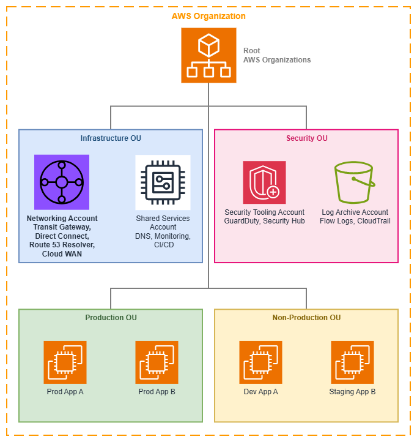

# AWS Organizations 및 계정 구조 {#aws-organizations-and-account-structure}

!!! info "사전 요구 사항"
    이 섹션은 [시작하기 전에](aws-prerequisites.md)에 대한 이해를 전제로 합니다. AWS 네트워킹 기반이 처음이라면 해당 페이지를 먼저 검토하세요.

AWS Organizations는 여러 AWS 계정의 중앙 집중식 관리 및 거버넌스를 가능하게 하며, 확장 가능하고 안전한 네트워크 아키텍처의 기반을 제공합니다. 네트워킹 관점에서 Organizations는 선택적 인프라가 아닙니다. 네트워크 리소스가 공유되는 방식, 보안 경계가 적용되는 방식, 그리고 팀이 연결 혼란을 야기하지 않으면서 독립적으로 운영되는 방식을 결정하는 컨트롤 플레인입니다.

잘 설계된 멀티 계정 전략은 워크로드를 격리하고, 청구를 단순화하며, 중앙 집중식 네트워크 관리를 가능하게 합니다. Organizations 없이는 모든 계정 간 네트워킹 패턴(Transit Gateway 공유, 중앙 집중식 DNS, IPAM 위임, RAM을 통한 리소스 공유)이 수동 신뢰 관계에 의존하게 되어 확장이 불가능하고 일관된 거버넌스를 적용할 수 없습니다.

/// caption
AWS Organizations 구조 — [Drawio 소스](../assets/foundation/organizations-structure.drawio)
///

## 핵심 개념 {#core-concepts}

### 조직 단위(OUs) {#organizational-units-ous}

OU는 비즈니스 구조와 거버넌스 경계를 반영하는 계정의 논리적 그룹입니다. 네트워킹 관점에서 OU는 두 가지 역할을 합니다. 사람이 이해하기 쉽도록 계정을 구성하는 동시에, 자동화된 리소스 공유, 정책 적용, 연결 수락의 범위를 정의합니다.

**주요 기능:**

*   :material-file-tree: **계층적 구조**

    ---

    OU는 조직의 복잡성을 반영하도록 중첩할 수 있습니다. 네트워크 정책(SCP, RAM 공유, IPAM 위임)은 계층 구조의 모든 수준을 대상으로 지정할 수 있습니다.

*   :material-share-variant: **RAM 공유 범위**

    ---

    개별 계정이 아닌 전체 OU와 네트워킹 리소스(Transit Gateway, IPAM 풀, VPC Lattice 서비스 네트워크, Route 53 Resolver 규칙)를 공유합니다. 새로 추가된 계정은 자동으로 액세스 권한을 상속받습니다.

*   :material-tag-check: **연결 자동화**

    ---

    AWS Cloud WAN과 Transit Gateway는 요청 계정의 OU 멤버십을 기반으로 연결을 자동 수락할 수 있어, 네트워킹 팀이 병목 지점이 되는 상황을 방지합니다.

*   :material-shield-lock: **정책 상속**

    ---

    OU에 적용된 SCP는 모든 하위 계정과 중첩된 OU에 연쇄 적용되므로, 계정별 개별 설정 없이도 일관된 거버넌스를 제공합니다.

네트워킹 중심의 일반적인 OU 패턴:

* **인프라 OU**: 중앙화된 네트워킹 계정, 공유 서비스, DNS
* **보안 OU**: 보안 도구, 로그 아카이브, 감사 계정
* **프로덕션 OU**: 엄격한 변경 통제가 적용되는 프로덕션 워크로드 계정
* **비프로덕션 OU**: 완화된 정책이 적용되는 개발, 테스트, 스테이징 계정
* **샌드박스 OU**: 프로덕션 네트워크와 연결이 없는 실험용 계정

### 서비스 제어 정책(SCPs) {#service-control-policies-scps}

SCP는 계정 및 OU 전반에서 사용 가능한 최대 권한을 정의합니다. SCP는 권한을 부여하는 것이 아니라, IAM 정책이 초과할 수 없는 가드레일을 설정합니다. 네트워킹 관점에서 SCP는 선의를 가진 팀이 아키텍처 원칙에 위배되는 연결 패턴을 생성하지 못하도록 막는 적용 메커니즘입니다.

**네트워킹 관련 SCP 패턴:**

* **무단 VPC 생성 방지**: `ec2:CreateVpc`를 VPC를 소유해야 하는 계정으로만 제한하여 섀도 네트워크 생성을 방지합니다.
* **리전 제한 적용**: `ec2:*` 작업을 승인된 리전으로만 제한하여 예상치 못한 위치에 네트워크 리소스가 생성되는 것을 방지합니다.
* **퍼블릭 IP 할당 차단**: 프라이빗 상태를 유지해야 하는 계정에서 퍼블릭 IP 파라미터를 사용하는 `ec2:AssociateAddress` 및 `ec2:RunInstances`를 거부합니다.
* **태깅 적용**: VPC, 서브넷, Transit Gateway 연결에 특정 태그를 요구하여 Cloud WAN 세그먼트 자동 할당을 지원합니다.
* **공유 리소스 보호**: 워크로드 계정이 RAM 리소스 공유를 수정하거나 Transit Gateway에서 분리하는 것을 방지합니다.
* **IPv6를 실수로 차단하지 않기**: `ec2:*` 작업을 제한하는 SCP는 `ec2:AssignIpv6Addresses`, `ec2:AssociateSubnetCidrBlock`(IPv6용), `ec2:CreateEgressOnlyInternetGateway`를 차단해서는 안 됩니다. IPv6 작업에 대해 SCP를 명시적으로 테스트하세요. 흔한 실패 사례는 IPv4 VPC 생성에는 정상 동작하지만 IPv6 CIDR 연결을 조용히 차단하는 SCP입니다.

### 중앙화된 네트워킹 계정 {#centralized-networking-account}

전용 네트워킹 계정은 공유 연결 인프라를 호스팅합니다. 이는 멀티 계정 네트워킹에서 가장 중요한 아키텍처 결정으로, "네트워크"와 "네트워크를 사용하는 워크로드" 사이에 명확한 소유권 경계를 확립합니다.

**네트워킹 계정에 속하는 리소스:**

* AWS Transit Gateway 또는 AWS Cloud WAN 코어 네트워크
* AWS Direct Connect 연결 및 게이트웨이
* Route 53 Resolver 엔드포인트 및 전달 규칙
* 중앙화된 NAT 게이트웨이 또는 이그레스 VPC(중앙화된 이그레스 사용 시)
* Network Firewall 검사 VPC
* IPAM 관리자 위임(IPv6 풀 관리 포함)
* VPN 연결 및 고객 게이트웨이

**비용 가시성 참고 사항:** 네트워킹 계정은 소비 계정 수에 따라 증가하는 비용을 집중시킵니다. Transit Gateway 연결당 시간 요금([Transit Gateway 요금](https://aws.amazon.com/transit-gateway/pricing/) 참조), Cloud WAN 연결 시간, Transit Gateway 또는 Cloud WAN을 통한 GB당 데이터 처리 요금, 중앙화된 이그레스를 위한 NAT 게이트웨이 시간당 및 GB당 요금이 이에 해당합니다. Organizations 통합 결제와 비용 배분 태그를 활용하여 이러한 공유 비용을 트래픽을 발생시키는 워크로드 계정에 귀속시키세요. 이러한 귀속 없이는 조직이 확장됨에 따라 네트워킹 계정의 청구 금액이 불투명하게 증가합니다.

**네트워킹 계정에 속하지 않는 리소스:**

* 애플리케이션 워크로드(EC2, ECS, Lambda)
* 애플리케이션 로드 밸런서
* VPC Lattice 서비스(서비스 소유자 계정에 속함)
* 애플리케이션별 보안 그룹

## 모범 사례 {#best-practices}

### 워크로드 계정보다 네트워킹 계정을 먼저 구성하세요 {#establish-the-networking-account-before-any-workload-accounts}

네트워킹 계정은 관리 계정과 보안 계정 다음으로 가장 먼저 생성해야 합니다. 이후에 생성되는 모든 워크로드 계정은 공유 네트워킹 리소스에 의존하게 되며, 팀들이 이미 자체 연결을 구축한 환경에 중앙 집중식 네트워킹을 사후에 도입하는 것은 처음부터 중앙 집중식으로 시작하는 것보다 훨씬 어렵습니다.

이 원칙이 중요한 이유는, 중앙 집중식 모델이 존재하기 전에 자체 Transit Gateway, VPN 연결, 또는 Direct Connect 게이트웨이를 구축한 팀은 마이그레이션에 저항하기 때문입니다. 자체 연결을 구축하는 계정이 늘어날수록 재작업 비용도 함께 증가합니다. 패턴을 초기에 확립하고, 처음부터 RAM을 통해 리소스를 공유하면 새 계정이 자동으로 연결성을 상속받습니다.

### OU는 조직도가 아닌 거버넌스 경계를 기준으로 설계하세요 {#design-ous-around-governance-boundaries-not-org-charts}

흔히 저지르는 실수 중 하나는 회사의 보고 체계를 OU 계층 구조에 그대로 반영하는 것입니다. OU는 *거버넌스 및 정책 경계*, 즉 동일한 보안 태세, 컴플라이언스 요구 사항, 네트워크 액세스 패턴을 공유하는 계정 그룹을 반영해야 합니다.

네트워킹 관점에서 이는 동일한 수준의 네트워크 액세스, 동일한 SCP 제한, 동일한 RAM 리소스 공유가 필요한 계정들이 같은 OU에 속해야 함을 의미합니다. 예를 들어 "플랫폼 엔지니어링" 팀은 공유 서비스용 인프라 OU와 프로덕션 워크로드용 프로덕션 OU 양쪽에 계정을 가질 수 있습니다. OU는 계정 소유자가 누구인지가 아니라 어떤 정책이 적용되는지를 나타냅니다.

이 설계 원칙은 네트워킹에 직접적인 영향을 미칩니다. RAM 공유, SCP 적용, Cloud WAN 연결 정책이 모두 OU 수준에서 동작하기 때문입니다. OU가 네트워크 거버넌스 경계와 일치하지 않으면 지나치게 광범위한 리소스 공유나 지나치게 복잡한 계정별 예외 처리가 발생합니다.

### SCP를 보안뿐만 아니라 네트워크 아키텍처 적용에도 활용하세요 {#use-scps-to-enforce-network-architecture-not-just-security}

대부분의 조직은 SCP를 보안 가드레일로만 인식합니다. 그러나 네트워킹 측면에서 SCP는 *아키텍처 적용* 수단으로서도 동등하게 중요합니다. SCP는 의도한 네트워크 토폴로지에서 벗어나는 것을 방지합니다.

**아키텍처 적용 SCP 예시:**

* 중앙 집중식 이그레스를 사용해야 하는 계정에서 `ec2:CreateInternetGateway` 거부 — 이는 보안 정책이 아니라 트래픽이 검사 인프라를 통해 흐르도록 보장하는 아키텍처 정책입니다
* IPAM 관리 범위를 벗어난 CIDR 블록으로 `ec2:CreateVpc` 거부 — IP 충돌을 사전에 방지합니다
* `ec2:CreateVpc`에 `network-segment` 태그 필수 지정 — Cloud WAN 연결 자동 수락을 가능하게 합니다
* 워크로드 계정에서 `ec2:CreateTransitGateway` 거부 — Transit Gateway는 네트워킹 계정만 소유해야 합니다

핵심 인사이트: SCP는 네트워크 아키텍처를 자기 적용(self-enforcing) 방식으로 만들어 줍니다. 이탈을 유발하는 API 호출이 Organizations 수준에서 거부되므로, 팀이 의도한 토폴로지에서 실수로든 의도적으로든 벗어날 수 없습니다.

### IPAM 관리를 네트워킹 계정에 위임하세요 {#delegate-ipam-administration-to-the-networking-account}

AWS IPAM은 Organizations를 통한 [위임 관리](https://docs.aws.amazon.com/vpc/latest/ipam/ipam-delegated-admin.html)를 지원합니다. 네트워킹 팀이 관리 계정에 액세스하지 않고도 IP 주소 풀, 할당 규칙, 컴플라이언스 모니터링을 관리할 수 있도록 IPAM을 네트워킹 계정에 위임하세요.

이 위임을 통해 워크로드 계정은 RAM으로 공유된 IPAM 풀에서 CIDR 할당을 요청할 수 있으며, 조직 전체에서 IP 주소 공간이 겹치지 않도록 보장합니다. 이를 설정하지 않으면 계정 수가 일정 규모를 넘어설 때 계정 간 IP 충돌이 불가피하게 발생합니다.

### 리소스는 계정 수준이 아닌 OU 수준에서 공유하세요 {#share-resources-at-the-ou-level-not-the-account-level}

AWS RAM을 통해 네트워킹 리소스(Transit Gateway, IPAM 풀, Route 53 Resolver 규칙, VPC Lattice 서비스 네트워크)를 공유할 때는 개별 계정이 아닌 OU를 대상으로 공유하세요. 이렇게 하면 OU에 새로 추가된 계정이 수동 개입 없이 자동으로 공유 네트워킹 리소스에 대한 액세스를 상속받습니다.

이는 Transit Gateway 및 Cloud WAN 연결에서 특히 중요합니다. 프로덕션 OU에 새 워크로드 계정이 생성되면, 즉시 VPC를 생성하고 공유 Transit Gateway 또는 Cloud WAN 세그먼트에 연결할 수 있어야 합니다. 계정 수준에서 공유하면 누군가 RAM 공유를 업데이트하는 동안 계정 생성과 네트워크 연결 사이에 항상 지연이 발생합니다.

### 관리 계정과 네트워킹을 분리하세요 {#separate-the-management-account-from-networking}

Organization을 소유하는 관리 계정에는 네트워킹 인프라를 호스팅하지 않아야 합니다. 관리 계정은 고유한 보안 속성을 가집니다. SCP의 제한을 받지 않으며 모든 조직 기능에 대한 루트 수준 액세스 권한을 가집니다. 관리 계정은 Organizations 관리, 청구 등 최소한의 용도로만 사용하세요.

관리 계정에 Transit Gateway나 Direct Connect를 호스팅하면 보안 위험(가장 광범위한 권한을 가진 계정이 네트워크도 제어)과 운영 위험(조직 설정 변경이 의도치 않게 네트워크 인프라에 영향을 줄 수 있음)이 동시에 발생합니다.

### OU 구조를 처음부터 네트워크 세분화를 고려하여 계획하세요 {#plan-your-ou-structure-for-network-segmentation-from-day-one}

OU 계층 구조는 네트워크 세분화 전략에 직접적으로 매핑됩니다. AWS Cloud WAN을 사용하는 경우 연결 수락 정책은 OU 멤버십을 참조하여 VPC가 참여할 세그먼트를 결정합니다. 여러 라우팅 테이블을 사용하는 Transit Gateway를 사용하는 경우 OU 범위로 지정된 RAM 공유가 어떤 계정이 어떤 라우팅 테이블에 연결할 수 있는지를 결정합니다.

동일한 OU 내의 계정이 동일한 네트워크 세그먼트, 동일한 검사 수준, 동일한 연결 패턴을 공유하도록 OU를 설계하세요. 이러한 정렬을 통해 네트워크 세분화가 자기 문서화(self-documenting) 방식이 됩니다. OU 구조를 보면 트래픽 흐름을 파악할 수 있습니다.

**피해야 할 안티패턴:** 단일 "Workloads" OU에 모든 워크로드 계정을 배치하는 평면적인 OU 구조를 만든 후, 계정별 RAM 공유나 복잡한 SCP 조건으로 네트워크 액세스를 차별화하려는 방식. 이 접근 방식은 확장성이 없으며 조직 구조와 네트워크 토폴로지 간의 관계를 불투명하게 만듭니다.

### 네트워크 거버넌스를 위해 SCP와 함께 태그 정책을 사용하세요 {#use-tag-policies-alongside-scps-for-network-governance}

[태그 정책](https://docs.aws.amazon.com/organizations/latest/userguide/orgs_manage_policies_tag-policies.html)은 Organization 전체에서 일관된 태그 값을 적용하여 SCP를 보완합니다. SCP가 리소스에 태그가 *존재*하도록 요구할 수 있는 반면, 태그 정책은 태그 *값*이 표준을 준수하도록 보장합니다.

네트워킹에서 이는 매우 중요합니다. 자동화 시스템(Cloud WAN 연결 정책, IPAM 할당 규칙, 비용 배분)이 일관된 태그 값에 의존하기 때문입니다. 한 팀이 VPC에 `environment:prod`로 태그를 지정하고 다른 팀이 `env:production`을 사용하면 자동화가 조용히 실패합니다.

다음을 적용하는 태그 정책을 정의하세요:

* 네트워크 세그먼트 태그의 허용 값 (예: `network-segment`는 `production`, `development`, `shared-services`, `pci` 중 하나여야 함)
* 모든 계정에서 일관된 환경 명명 규칙
* 네트워크 리소스(NAT 게이트웨이, Transit Gateway 연결, VPN 연결)에 대한 필수 비용 배분 태그

### 네트워크 계정 자동 프로비저닝 패턴을 구현하세요 {#implement-a-network-account-vending-pattern}

조직이 확장됨에 따라 각 새 계정에 대한 네트워크 연결을 수동으로 구성하는 것은 병목 현상이 됩니다. AWS Control Tower Account Factory 또는 커스텀 솔루션을 통해 다음을 자동으로 수행하는 계정 자동 프로비저닝 패턴을 구현하세요:

1. 올바른 OU에 계정 생성
2. 적절한 IPAM 풀에서 CIDR 블록 할당
3. 표준 서브넷 레이아웃으로 VPC 생성
4. Transit Gateway 또는 Cloud WAN에 VPC 연결
5. DNS 확인을 위한 Route 53 Resolver 규칙 구성
6. 기본 보안 그룹 및 NACL 적용

이 패턴을 통해 모든 새 계정이 처음부터 올바르고 일관된 네트워킹으로 시작할 수 있습니다. 팀은 네트워킹 팀이 연결을 프로비저닝할 때까지 기다릴 필요가 없으며, 네트워킹 팀은 비표준 구성에 대해 걱정할 필요가 없습니다.

## AWS Organizations 사용 시기 {#when-to-use-aws-organizations}

AWS Organizations는 계정 간 네트워크 연결이 필요한 AWS 계정이 두 개 이상인 모든 환경에 적합한 선택입니다. 실제로 이는 거의 모든 프로덕션 AWS 배포 환경을 의미합니다.

**Organizations를 사용해야 하는 경우:**

* AWS 계정이 2~3개 이상이거나 향후 그렇게 될 예정인 경우
* 서로 다른 계정의 워크로드가 상호 통신해야 하는 경우
* 중앙 집중식 네트워크 인프라(Transit Gateway, Direct Connect, DNS)를 원하는 경우
* 계정 전반에 걸쳐 일관된 보안 정책이 필요한 경우
* 새 계정 생성 시 리소스 공유를 자동화하고 싶은 경우
* 컴플라이언스 요구 사항에 따라 중앙 집중식 거버넌스 및 감사 추적이 필요한 경우

**단일 계정으로 충분한 경우:**

* 개념 증명(PoC) 또는 개인 프로젝트를 진행 중인 경우
* 모든 워크로드가 격리 문제 없이 하나의 계정에서 공존할 수 있는 경우
* 계정 수준 분리에 대한 컴플라이언스 요구 사항이 없는 경우
* 계정 간 네트워킹이 필요 없는 경우(모든 것이 하나의 VPC 또는 단일 계정 내 피어링된 VPC에 있는 경우)

**전환 시점**: 첫 번째 계정과 통신해야 하는 두 번째 계정이 필요해지는 순간 Organizations를 설정하세요. 추가 부담은 미미하며, Organizations 없이 구성된 기존 멀티 계정 환경에 나중에 도입하는 것은 처음부터 시작하는 것보다 훨씬 많은 작업을 필요로 합니다.

**일반적인 마이그레이션 시나리오**: Organizations 없이 여러 계정을 이미 운영 중이라면 마이그레이션 경로는 단순하지만 사전 계획이 필요합니다. 기존 계정을 새 Organization에 초대할 수 있지만, 기존 네트워킹 리소스(Transit Gateway, VPN 연결, Direct Connect)가 자동으로 중앙 집중식 모델로 이전되지는 않습니다. 마이그레이션은 단계적으로 계획하세요. 먼저 Organization과 OU 구조를 수립하고, 다음으로 중앙 집중식 네트워킹 계정을 생성한 후, 공유 네트워킹 리소스를 점진적으로 마이그레이션하고 RAM 공유를 업데이트합니다.

## AWS Organizations와 다른 서비스의 결합 {#combining-aws-organizations-with-other-services}

Organizations는 다른 모든 멀티 계정 네트워킹 서비스가 대규모로 운영될 수 있도록 지원하는 거버넌스 계층입니다. Organizations 없이는 이러한 서비스 각각에 대해 계정별 수동 구성이 필요하며, 이는 확장성이 없습니다.

| 조합 | Organizations가 제공하는 것 | 다른 서비스가 제공하는 것 |
| --- | --- | --- |
| **Organizations + AWS RAM** | 공유 범위(OU 및 계정), 신규 계정에 대한 자동 상속 | Transit Gateway, IPAM 풀, Resolver 규칙, VPC Lattice 서비스 네트워크에 대한 실제 리소스 공유 메커니즘 |
| **Organizations + AWS Transit Gateway** | 연결 거버넌스를 위한 SCP 적용, Transit Gateway에 대한 RAM 공유 범위 | VPC 및 하이브리드 연결 간의 리전 허브 앤 스포크 라우팅 |
| **Organizations + AWS Cloud WAN** | OU 기반 연결 수락 정책, 세그먼트 할당을 위한 SCP 적용 태깅 | 세분화를 통한 글로벌 정책 기반 네트워크 관리 |
| **Organizations + Amazon VPC IPAM** | 위임된 관리, OU 범위 풀 공유, 모든 계정에 걸친 컴플라이언스 모니터링 | IP 주소 계획, 할당 및 충돌 방지 |
| **Organizations + Route 53 Resolver** | OU 전반에 걸친 Resolver 규칙의 RAM 공유, 조직 전체의 일관된 DNS 확인 | VPC와 온프레미스 간의 중앙 집중식 DNS 포워딩 |
| **Organizations + AWS Network Firewall** | 계정이 중앙 집중식 검사를 우회하지 못하도록 하는 SCP 적용 | 상태 저장 트래픽 검사 및 필터링 |
| **Organizations + Amazon VPC Lattice** | OU 수준에서의 서비스 네트워크 RAM 공유, `aws:PrincipalOrgID`에 대한 인증 정책 조건 | 애플리케이션 계층 서비스 간 통신 |
| **Organizations + AWS Control Tower** | 조직 구조 및 계정 팩토리 | 네트워킹 가드레일이 사전 구성된 자동화된 랜딩 존 설정 |

***핵심 인사이트:*** *Organizations는 패킷을 전달하는 서비스가 아닙니다. Organizations는 실제로 패킷을 전달하는 서비스를 생성하고, 공유하고, 연결할 수 있는 주체를 결정하는 서비스입니다. 대규모의 모든 네트워킹 결정은 Organizations가 제공하는 거버넌스 구조를 통해 이루어집니다.*

## 문서 {#documentation}

*   :material-file-document: **AWS Organizations 사용자 가이드**

    ---

    OU, SCP, 위임 관리, 기타 AWS 서비스와의 통합을 포함한 전체 서비스 문서입니다.

    [:octicons-arrow-right-24: 문서](https://docs.aws.amazon.com/organizations/latest/userguide/orgs_introduction.html)

*   :material-book-open-variant: **AWS 환경 구성하기**

    ---

    멀티 계정 전략, OU 설계 패턴, 거버넌스 모범 사례에 관한 AWS 백서입니다.

    [:octicons-arrow-right-24: 백서](https://docs.aws.amazon.com/whitepapers/latest/organizing-your-aws-environment/organizing-your-aws-environment.html)

*   :material-office-building: **랜딩 존 구축**

    ---

    네트워킹, 보안, 거버넌스 기반을 갖춘 멀티 계정 환경 설정을 위한 규범적 지침입니다.

    [:octicons-arrow-right-24: 가이드](https://docs.aws.amazon.com/prescriptive-guidance/latest/migration-aws-environment/building-landing-zones.html)

*   :material-share-variant: **AWS Resource Access Manager**

    ---

    조직 내 계정 및 OU 간 네트워킹 리소스 공유를 위한 문서입니다.

    [:octicons-arrow-right-24: 문서](https://docs.aws.amazon.com/ram/latest/userguide/what-is.html)

*   :material-shield-check: **서비스 제어 정책**

    ---

    SCP 구문, 예시, 상속 동작 방식, 정책 설계 모범 사례를 다룹니다.

    [:octicons-arrow-right-24: 문서](https://docs.aws.amazon.com/organizations/latest/userguide/orgs_manage_policies_scps.html)

*   :material-network: **멀티 VPC 네트워크 인프라**

    ---

    중앙 집중식 네트워킹 패턴을 활용한 확장 가능하고 안전한 멀티 VPC 아키텍처 구축에 관한 AWS 백서입니다.

    [:octicons-arrow-right-24: 백서](https://docs.aws.amazon.com/whitepapers/latest/building-scalable-secure-multi-vpc-network-infrastructure/welcome.html)

## Organizations가 나머지 기반과 맺는 관계 {#how-organizations-relates-to-the-rest-of-the-foundation}

AWS Organizations는 다른 모든 기반 구성 요소 위에 위치하는 거버넌스 계층입니다. [VPC](vpc.md) 설계, [CIDR 계획](cidr.md), [서브넷 전략](subnets.md), [IPAM 구성](ipam.md)은 모두 Organizations가 정의하는 구조 안에서 동작합니다.

**다른 기반 주제와의 관계:**

* **[Amazon VPC](vpc.md)**: Organizations는 어떤 계정이 VPC를 생성할 수 있는지, 어떤 CIDR 범위를 사용할 수 있는지를 결정합니다(SCP 및 IPAM 위임을 통해).
* **[CIDR 계획](cidr.md)**: Organizations를 통해 공유되는 IPAM 풀은 모든 계정에 걸쳐 중복되지 않는 주소 공간을 보장합니다.
* **[서브넷](subnets.md)**: SCP를 통해 서브넷 태깅을 강제하고, 승인된 가용 영역으로만 서브넷 생성을 제한할 수 있습니다.
* **[IPAM](ipam.md)**: Organizations를 통한 IPAM 관리 위임으로 중앙 집중식 IP 거버넌스가 가능합니다.
* **[리전 및 가용 영역](regions-azs.md)**: SCP는 계정이 리소스를 배포할 수 있는 리전을 제한하여, 네트워크의 지리적 범위를 직접적으로 결정합니다.

**Connectivity와의 관계:**

* **[AWS 내부 연결](../connectivity/within-aws.md)**: Transit Gateway와 Cloud WAN은 RAM 공유 및 연결 거버넌스를 위해 Organizations에 의존합니다.
* **[하이브리드 및 멀티 클라우드](../connectivity/hybrid-multicloud.md)**: 중앙 집중식 네트워킹 계정의 Direct Connect 및 VPN 리소스는 RAM을 통해 Organization 전체에 공유됩니다.
* **[인터넷 연결](../connectivity/internet.md)**: 중앙 집중식 이그레스(egress) 패턴은 Organizations를 활용하여 트래픽이 검사 인프라를 통해 흐르도록 강제합니다.
