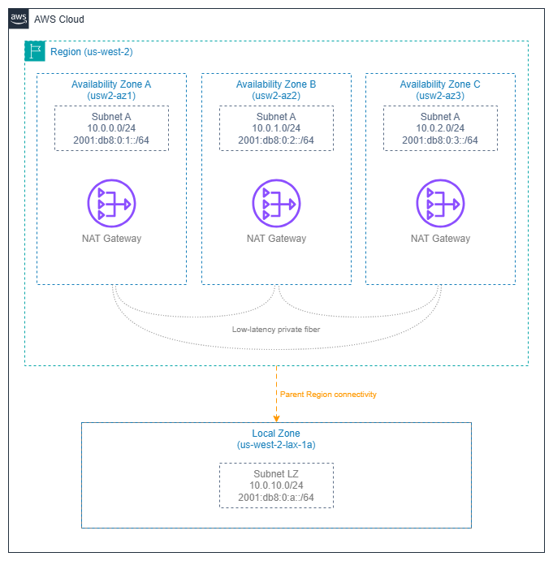

# 리전 및 가용 영역 {#regions-and-availability-zones}

!!! info "사전 요구 사항"
    이 페이지는 [시작하기 전에](aws-prerequisites.md)에서 다루는 개념에 익숙하다는 것을 전제로 합니다. AWS 네트워킹 기초가 처음이라면 해당 페이지를 먼저 검토하세요.

AWS 인프라는 리전(Region)과 가용 영역(Availability Zone, AZ)으로 구성됩니다. 서브넷 레이아웃, NAT 게이트웨이 배치, 로드 밸런서 배포, Direct Connect 종단 등 모든 네트워킹 결정은 리전 및 가용 영역의 동작 방식에 따라 달라집니다. 이 페이지에서는 이러한 결정의 근거가 되는 인프라 컨텍스트를 다룹니다. 즉, 리전 및 가용 영역이 무엇인지, 네트워크 설계에 어떤 영향을 미치는지, 그리고 탄력적이고 비용 효율적인 아키텍처를 만드는 패턴은 무엇인지 살펴봅니다.

가장 흔한 네트워킹 실수는 서비스의 잘못된 구성이 아니라, 리전 및 가용 영역 선택이 서브넷 크기 조정, 트래픽 비용, 장애 반경(blast radius)에 미치는 연쇄적인 영향을 고려하지 않는 것입니다. 이 계층을 깊이 이해하면 그러한 실수를 예방할 수 있습니다.

/// caption
리전 및 가용 영역 — [Drawio 소스](../assets/foundation/regions-azs-layout.drawio)
///

## AWS 리전(Region) {#aws-regions}

AWS 리전은 특정 지리적 영역에 위치한 데이터 센터 클러스터로, AWS 플랫폼의 완전히 독립적인 인스턴스로 운영됩니다. 각 리전은 자체 컨트롤 플레인, 자체 API 엔드포인트, 그리고 자체 서비스 세트를 보유합니다. 복제 또는 전송을 명시적으로 구성하지 않는 한 데이터는 리전 밖으로 나가지 않습니다.

네트워킹 관점에서 리전은 대부분의 인프라 장애에 대한 장애 반경(blast radius) 경계이며, Transit Gateway, NAT 게이트웨이, VPC 엔드포인트와 같은 서비스의 배포 단위입니다. 멀티 리전 아키텍처도 존재하지만, 이를 위해서는 명시적인 리전 간 연결(VPC 피어링, Transit Gateway 피어링, 또는 엣지의 CloudFront/Global Accelerator)이 필요합니다.

***핵심 인사이트:*** *리전 선택은 단순히 지연 시간이나 컴플라이언스 결정이 아닌 네트워킹 결정입니다. 리전 선택에 따라 사용 가능한 Direct Connect 위치, 사용할 수 있는 서비스, 그리고 리전 간 트래픽 비용이 결정됩니다.*

### 네트워킹을 위한 리전 선택 기준 {#region-selection-criteria-for-networking}

| 기준 | 네트워킹에 중요한 이유 | 평가 방법 |
| --- | --- | --- |
| **사용자까지의 지연 시간** | 엣지 서비스(CloudFront, Global Accelerator)가 필요한지, 아니면 리전에서 직접 서비스할 수 있는지를 결정합니다. | 사용자 집단을 기준으로 측정하세요. 지리적 근접성이 낮은 지연 시간을 의미한다고 가정하지 마세요. |
| **Direct Connect 위치** | 모든 리전이 동일한 Direct Connect 파트너 에코시스템을 갖추고 있지는 않습니다. 인근 DX 위치가 없는 리전은 하이브리드 연결 시 지연 시간이 높아집니다. | 하이브리드 워크로드를 위한 리전을 확정하기 전에 [AWS Direct Connect 위치 페이지](https://aws.amazon.com/directconnect/locations/)를 확인하세요. |
| **서비스 가용성** | 신규 네트워킹 서비스(VPC Lattice, Cloud WAN, IPv6 전용 서브넷)는 주요 리전에서 먼저 출시됩니다. 소규모 리전을 선택하면 아키텍처 옵션이 제한될 수 있습니다. | 배포 전에 설계에 포함된 모든 서비스가 대상 리전에서 사용 가능한지 확인하세요. |
| **IPv6 서비스 준비 상태** | 모든 네트워킹 기능이 리전 전반에 걸쳐 IPv6를 동일하게 지원하지는 않습니다. IPv6 전용 서브넷, 듀얼 스택 VPC Lattice, IPv6 Transit Gateway 라우팅은 주요 리전에서 먼저 출시되었습니다. | 대상 리전에서 각 서비스의 IPv6 지원 여부를 확인하세요. IPv6 지원이 부분적인 리전에서의 듀얼 스택 아키텍처는 운영상 불일치를 초래합니다. |
| **리전 간 데이터 전송 비용** | 리전 간 트래픽은 리전 내 트래픽보다 훨씬 비쌉니다. 멀티 리전 설계는 복제 및 API 호출 비용을 반드시 고려해야 합니다. | 예상 리전 간 트래픽 볼륨을 모델링하고 아키텍처 검토 시 비용을 명시적으로 산정하세요. |
| **컴플라이언스 및 데이터 레지던시** | 일부 규정은 데이터를 특정 지리적 경계 내에 유지하도록 요구하며, 이는 다른 요소와 관계없이 리전 선택을 제한합니다. | 규제 제약 사항을 먼저 파악하세요. 이는 다른 모든 기준보다 우선합니다. |

## 가용 영역(Availability Zones) {#availability-zones}

가용 영역은 리전 내에 위치한 하나 이상의 독립된 데이터 센터로, 각각 이중화된 전력, 네트워킹, 연결성을 갖추고 있습니다. 동일 리전 내 가용 영역들은 저지연·고처리량 전용 광섬유(일반적으로 왕복 2ms 미만)로 연결되지만, 물리적으로는 충분히 분리되어 있어 특정 장애(전력망 이상, 홍수, 화재)가 하나의 가용 영역에만 영향을 미칩니다.

모든 리전에는 최소 세 개의 가용 영역이 있습니다. 이는 쿼럼(quorum) 기반 시스템 운영과 단일 가용 영역 장애 발생 시에도 가용성을 유지하면서 충분한 용량 여유를 확보하기 위한 최소 요건입니다.

***핵심 인사이트:*** *가용 영역은 리전 내 장애 격리의 기본 단위입니다. 서브넷, NAT 게이트웨이, 로드 밸런서 노드, 인터페이스 엔드포인트 등 배포하는 모든 네트워킹 리소스는 정확히 하나의 가용 영역에 속합니다. 멀티-AZ 전략은 결국 가용 영역별 서브넷 전략이며, 이를 잘못 설계하면 미사용 용량에 비용을 낭비하거나 정작 필요한 순간에 가용성을 잃게 됩니다.*

### 가용 영역 ID와 가용 영역 이름 {#availability-zone-ids-vs-availability-zone-names}

이는 가용 영역 아키텍처에서 가장 많이 오해되는 부분으로, 계정 간 네트워킹에서 실제 문제를 일으킵니다.

* **가용 영역 이름**(예: `us-east-1a`)은 AWS 계정별로 무작위로 매핑됩니다. 한 계정의 `us-east-1a`와 다른 계정의 `us-east-1a`는 서로 다른 물리적 위치일 수 있습니다.
* **가용 영역 ID**(예: `use1-az1`)는 모든 계정에서 일관되게 동일한 물리 인프라에 매핑됩니다.

| 시나리오 | 가용 영역 이름 또는 ID 중 어느 것을 사용해야 하나요? |
| --- | --- |
| 단일 계정 배포, CloudFormation 템플릿 | 가용 영역 이름 사용 가능 |
| 계정 간 공유 서브넷(AWS RAM) | **가용 영역 ID 필수** |
| 계정 간 Transit Gateway 또는 VPC 피어링 트래픽 분석 | **가용 영역 ID 필수** |
| 파트너 또는 고객 계정과의 배치 조율 | **가용 영역 ID 필수** |
| 계정 간 AZ 간 데이터 전송 비용 분석 | **가용 영역 ID 필수** |

AWS Resource Access Manager를 통해 서브넷을 공유할 때, 공유된 서브넷의 가용 영역은 가용 영역 ID로 식별됩니다. 공유 VPC, 중앙 집중식 이그레스, Transit Gateway 연결 등 계정 간 아키텍처를 구축할 때는 항상 가용 영역 이름이 아닌 가용 영역 ID를 기준으로 설계하십시오.

## 모범 사례 {#best-practices}

### 네트워킹을 위한 다중 AZ 설계 패턴 {#multi-az-design-patterns-for-networking}

#### 모든 상태 저장 네트워킹 리소스를 AZ별로 배포 {#deploy-every-stateful-networking-resource-per-az}

NAT 게이트웨이, 인터페이스 VPC 엔드포인트, 로드 밸런서 노드는 AZ 범위 리소스입니다. 단일 NAT 게이트웨이를 하나의 가용 영역에 배포하고 모든 프라이빗 서브넷을 해당 게이트웨이를 통해 라우팅하면, 단일 장애 지점이 생기는 동시에 다른 가용 영역에서 오가는 모든 패킷에 대해 AZ 간 데이터 전송 요금이 발생합니다.

올바른 패턴:

* 각 퍼블릭 서브넷 계층의 **가용 영역마다 NAT 게이트웨이 하나씩** 배포. 각 가용 영역의 프라이빗 서브넷에 대한 라우팅 테이블은 동일한 가용 영역의 NAT 게이트웨이를 가리킵니다.
* 엔드포인트를 사용하는 워크로드가 있는 **모든 가용 영역에 인터페이스 VPC 엔드포인트 배포**. 특정 가용 영역에 엔드포인트가 없으면 해당 가용 영역의 트래픽이 다른 가용 영역을 거쳐 엔드포인트에 도달하게 되어 지연 시간과 비용이 증가합니다.
* 대상이 존재하는 **모든 가용 영역에서 로드 밸런서 활성화**. 특정 가용 영역이 누락된 ALB 또는 NLB는 비대칭 라우팅과 불균등한 대상 활용률을 초래합니다.

***핵심 인사이트:*** *"AZ별" 패턴은 고정 리소스 비용이 더 높지만(NAT 게이트웨이 1개 대신 3개), AZ 간 데이터 전송 요금을 없애고, 단일 AZ 장애 모드를 제거하며, 장애 반경을 최소화합니다. 모든 프로덕션 워크로드에는 AZ별 패턴이 올바른 선택입니다.*

#### N-1 가용 영역 용량 기준으로 설계 {#size-for-n-1-availability-zone-capacity}

하나의 가용 영역이 손실되더라도 나머지 가용 영역이 과부하되지 않도록 AZ별 용량을 설계하세요. 3개 AZ 배포에서는 각 가용 영역이 피크 부하의 50%를 처리할 수 있어야 합니다(33%가 아닌). 이렇게 해야 장애 발생 시 두 개의 가용 영역이 전체 워크로드를 수용할 수 있습니다.

이 원칙은 다음에 적용됩니다:

* 가용 영역별 Auto Scaling 그룹의 최소 및 희망 인스턴스 수
* NAT 게이트웨이 처리량 여유 공간(각 NAT GW는 최대 100Gbps를 처리하지만, AZ별 이그레스 패턴이 중요합니다)
* 서브넷 IP 주소 용량(하나의 가용 영역이 실패하고 워크로드가 나머지 두 가용 영역에서 재시작될 때, 해당 서브넷에 충분한 IP 여유 공간이 필요합니다)

#### 빠른 가용 영역 대피를 위한 Zonal Shift 사용 {#use-zonal-shift-for-fast-availability-zone-evacuation}

Amazon Application Recovery Controller의 Zonal Shift는 상태가 저하된 가용 영역을 로드 밸런서 DNS에서 수 초 내에 제거하며, 헬스 체크나 라우팅 규칙을 변경할 필요가 없습니다. AWS가 가용 영역 장애를 감지할 때 자동으로 활성화되도록 Zonal Autoshift를 구성하세요. 이는 가용 영역 대피를 위한 가장 빠른 방법으로, 헬스 체크 실패나 수동 개입보다 훨씬 빠릅니다.

### AZ 간 트래픽 비용 관리 {#cross-az-traffic-cost-management}

#### 비용 모델 이해 {#understand-the-cost-model}

대부분의 리전에서 리전 내 AZ 간 데이터 전송은 방향별로 GB당 요금이 부과됩니다(왕복 시 2배). 현재 요금은 [VPC 요금](https://aws.amazon.com/vpc/pricing/)을 참조하세요. 이는 IPv4 및 IPv6 트래픽 모두에 적용되며, 듀얼 스택을 사용해도 AZ 간 비용 모델은 변경되지 않습니다. GB당 요금은 작아 보이지만, 규모가 커지면 네트워킹 비용의 대부분을 차지합니다:

* 가용 영역 간에 1KB 페이로드로 초당 10,000건의 요청을 처리하는 서비스는 월 약 1.7TB의 AZ 간 트래픽을 생성하며, 단일 서비스 쌍에 대해서도 규모가 커질수록 비용이 크게 증가합니다.
* 수십 개의 서비스 간 호출이 있는 마이크로서비스 아키텍처는 월 수백 TB의 AZ 간 트래픽을 쉽게 생성할 수 있습니다.

#### 가용성을 희생하지 않고 AZ 간 트래픽 최소화 {#minimize-cross-az-traffic-without-sacrificing-availability}

목표는 AZ 간 트래픽을 완전히 없애는 것이 아닙니다(그렇게 하면 단일 AZ 배포가 되어 프로덕션에서는 허용되지 않습니다). 목표는 *불필요한* AZ 간 트래픽을 데이터 경로에서 제거하는 것입니다:

* **AZ 인식 서비스 디스커버리 사용** (헬스 체크가 포함된 Cloud Map 또는 VPC Lattice의 내장 가용 영역 어피니티). 로컬에 정상 대상이 있을 때 서비스가 동일 AZ 대상을 우선 선택하도록 합니다.
* **클라이언트가 가용 영역 전반에 걸쳐 대략 균등하게 분산된 경우 NLB의 교차 영역 로드 밸런싱 비활성화**. 이렇게 하면 기본적으로 트래픽이 영역 내에 유지됩니다. ALB는 기본적으로 교차 영역이 활성화되어 있으며, 이는 ALB에 대해 일반적으로 올바른 설정입니다(ALB의 가치는 L7 라우팅에 있지, AZ 어피니티에 있지 않기 때문입니다).
* **애플리케이션 인스턴스가 실행되는 모든 가용 영역에 캐시(ElastiCache, DAX) 배치**. 가용 영역을 넘나드는 캐시 미스는 캐싱의 목적을 무력화합니다.
* **가용 영역 메타데이터가 포함된 VPC Flow Logs 사용**으로 가장 큰 AZ 간 트래픽 흐름을 파악하고 최적화 대상으로 삼습니다.

***핵심 인사이트:*** *AZ 간 비용 최적화는 배포 문제가 아닌 트래픽 엔지니어링 문제입니다. 가용성을 위해 여전히 여러 가용 영역에 배포하되, 가능한 경우 동일 AZ 경로를 우선하도록 트래픽을 라우팅하면 됩니다.*

### 가용 영역 선택은 서브넷 설계에 연쇄적으로 영향을 미침 {#availability-zone-choices-cascade-into-subnet-design}

#### 계층별, 가용 영역별 서브넷 하나씩 {#one-subnet-per-availability-zone-per-tier}

기본 서브넷 패턴은 네트워크 계층(퍼블릭, 프라이빗, 데이터 등)별로 가용 영역마다 서브넷 하나씩입니다. 이는 선택 사항이 아니라 AWS 네트워킹의 작동 방식입니다:

* 서브넷은 정확히 하나의 가용 영역에 존재합니다
* 라우팅 테이블은 가용 영역이 아닌 서브넷과 연결됩니다
* 서브넷에서 시작된 리소스는 해당 서브넷의 AZ에 배치됩니다

3개 AZ, 3개 계층 VPC의 경우 최소 9개의 서브넷이 필요합니다. CIDR 할당을 그에 맞게 계획하세요. 크기 조정 지침은 [CIDR 계획](cidr.md) 및 [서브넷](subnets.md)을 참조하세요.

#### 서브넷 크기는 가용 영역 장애 시나리오를 고려해야 함 {#subnet-sizing-must-account-for-availability-zone-failure-scenarios}

각 가용 영역의 서브넷을 현재 워크로드에 딱 맞게 크기를 조정하면, 가용 영역 장애 복구를 위한 여유 공간이 없습니다. 가용 영역이 실패하고 Auto Scaling이 나머지 가용 영역에서 대체 용량을 시작할 때, 해당 서브넷에 사용 가능한 IP 주소가 있어야 합니다. 각 가용 영역에서 안정 상태 요구 사항의 2배로 서브넷 크기를 조정하거나, 보조 CIDR 범위를 오버플로로 사용하는 더 큰 CIDR 블록을 사용하세요.

### NAT 게이트웨이 배치는 가용 영역 경계를 따름 {#nat-gateway-placement-follows-availability-zone-boundaries}

#### 가용 영역별 NAT 게이트웨이 하나가 프로덕션 패턴 {#one-nat-gateway-per-availability-zone-is-the-production-pattern}

NAT 게이트웨이는 AZ 범위 리소스입니다. 가용 영역별로 하나씩 배포하고 각 가용 영역의 프라이빗 서브넷을 로컬 NAT 게이트웨이로 라우팅하면 다음을 달성할 수 있습니다:

* **장애 격리**: 가용 영역 장애 시 해당 가용 영역의 NAT 게이트웨이만 영향을 받으며, 전체 VPC의 이그레스가 중단되지 않습니다.
* **AZ 간 요금 없음**: 프라이빗 서브넷에서 인터넷으로의 트래픽이 NAT 게이트웨이에 도달할 때까지 동일한 가용 영역 내에 유지되며, 이후 인터넷 게이트웨이(리전 범위이며 AZ 간 요금 없음)를 통해 나갑니다.
* **예측 가능한 처리량**: 각 NAT 게이트웨이가 독립적으로 최대 100Gbps를 처리합니다.

단일 NAT 게이트웨이 패턴(NAT GW 1개, 모든 가용 영역이 해당 게이트웨이로 라우팅)은 가용성보다 비용이 더 중요한 개발 및 테스트 환경에서만 허용됩니다.

### 로드 밸런서 배포 및 가용 영역 인식 {#load-balancer-deployment-and-availability-zone-awareness}

#### 대상이 존재하는 모든 가용 영역 활성화 {#enable-all-availability-zones-where-targets-exist}

ALB 또는 NLB를 생성할 때 운영할 가용 영역을 선택합니다. 로드 밸런서는 선택된 각 가용 영역에 노드를 배치합니다. 3개 가용 영역에 대상이 있지만 로드 밸런서에서 2개 가용 영역만 활성화하면, 세 번째 가용 영역의 대상에 도달할 수 없습니다.

#### 교차 영역 로드 밸런싱의 영향 이해 {#understand-cross-zone-load-balancing-implications}

| 로드 밸런서 | 교차 영역 기본값 | 비용 영향 |
| --- | --- | --- |
| ALB | **켜짐** | ALB-대상 간 트래픽에 추가 AZ 간 요금 없음 |
| NLB | **꺼짐** | 활성화 시 교차 영역 NLB-대상 간 트래픽에 표준 AZ 간 데이터 전송 요금 부과 |
| GWLB | **꺼짐** | 활성화 시 교차 영역 GWLB-어플라이언스 간 트래픽에 표준 AZ 간 데이터 전송 요금 부과 |

ALB의 교차 영역 기본 활성화는 대부분의 워크로드에 올바른 설정입니다. ALB의 가치는 L7 라우팅과 균등한 분산에 있기 때문입니다. NLB의 교차 영역 기본 비활성화는 영역 어피니티의 이점을 원하고 AZ 간 요금을 피하려는 워크로드에 올바른 설정이지만, 대상이 가용 영역 전반에 균등하게 분산되어 있어야 합니다.

## 로컬 존과 Wavelength 존 {#local-zones-and-wavelength-zones}

### 로컬 존 {#local-zones}

AWS 로컬 존(Local Zones)은 상위 리전(parent Region)의 확장으로, 컴퓨팅, 스토리지, 일부 네트워킹 서비스를 최종 사용자에게 더 가까이 배치합니다. 네트워킹 관점에서 살펴보면 다음과 같습니다.

* 로컬 존 서브넷은 상위 리전의 VPC에 속하지만, 로컬 존의 물리적 위치에 존재합니다.
* **로컬 존에서의 인터넷 이그레스(egress)는 로컬 존 자체의 인터넷 게이트웨이를 사용합니다** — 인터넷 액세스를 위해 상위 리전으로 트래픽이 역전송(backhaul)되지 않습니다.
* **로컬 존과 상위 리전 간의 트래픽은 공용 인터넷이 아닌 AWS 백본을 통해 전송됩니다.** 단, 가용 영역 간 트래픽과 유사한 데이터 전송 요금이 발생합니다.
* **모든 네트워킹 서비스가 로컬 존에서 제공되는 것은 아닙니다.** NAT 게이트웨이, Transit Gateway 연결, VPC 엔드포인트는 제공되지 않을 수 있습니다. 특정 로컬 존의 지원 여부는 [로컬 존 기능 페이지](https://aws.amazon.com/about-aws/global-infrastructure/localzones/features/)에서 확인하세요.
* **서브넷 설계**: 기존 VPC 내 로컬 존에 전용 서브넷을 생성합니다. 로컬 존 서브넷의 라우팅 테이블은 상위 리전의 가용 영역 라우팅 테이블과 독립적으로 운영됩니다.

***핵심 인사이트:*** *로컬 존은 특정 대도시 지역에서 한 자릿수 밀리초 수준의 액세스가 필요한 지연 시간에 민감한 워크로드를 위한 것입니다. 상위 리전의 다중 AZ 배포를 대체하는 것이 아니라, 지연 시간에 민감한 계층을 사용자에게 더 가까이 배치하고 나머지 아키텍처는 상위 리전에 유지함으로써 다중 AZ 배포를 보완합니다.*

### Wavelength 존 {#wavelength-zones}

AWS Wavelength는 통신 사업자의 5G 네트워크 내에 컴퓨팅과 스토리지를 내장합니다. 네트워킹 관점에서 살펴보면 다음과 같습니다.

* Wavelength 존은 통신사 네트워크로 오가는 트래픽을 위한 자체 캐리어 게이트웨이를 보유하며, 이 트래픽은 공용 인터넷을 거치지 않습니다.
* Wavelength 존과 상위 리전 간의 트래픽은 AWS 백본을 사용합니다.
* 제공되는 네트워킹 서비스가 제한적입니다. Wavelength 존 내에서는 NAT 게이트웨이, VPC 엔드포인트, Transit Gateway 연결을 사용할 수 없습니다.
* 5G 네트워크에서 리전 가용 영역으로의 홉이 허용할 수 없는 수준의 지연 시간을 유발하는 초저지연 모바일/엣지 워크로드에 Wavelength를 활용하세요.

## 문서 {#documentation}

*   :material-earth: **AWS 글로벌 인프라**

    ---

    모든 AWS 리전, 가용 영역, 로컬 존, Wavelength 존의 인터랙티브 지도와 서비스 가용성 세부 정보를 제공합니다.

    [:octicons-arrow-right-24: 글로벌 인프라](https://aws.amazon.com/about-aws/global-infrastructure/)

*   :material-map-marker-multiple: **리전 및 가용 영역**

    ---

    리전 및 가용 영역 개념, 가용 영역 ID, 프로그래밍 방식으로 사용하는 방법을 다루는 EC2 문서입니다.

    [:octicons-arrow-right-24: 문서](https://docs.aws.amazon.com/AWSEC2/latest/UserGuide/using-regions-availability-zones.html)

*   :material-identifier: **계정 간 조정을 위한 AZ ID**

    ---

    가용 영역 ID 매핑과 일관된 계정 간 리소스 배치를 위해 가용 영역 ID를 사용하는 방법을 설명하는 AWS RAM 문서입니다.

    [:octicons-arrow-right-24: 가용 영역 ID](https://docs.aws.amazon.com/ram/latest/userguide/working-with-az-ids.html)

*   :material-map-marker-radius: **로컬 존 기능**

    ---

    네트워킹 서비스, 인스턴스 유형, 스토리지 옵션을 포함한 각 로컬 존의 서비스 가용성 매트릭스입니다.

    [:octicons-arrow-right-24: 로컬 존](https://aws.amazon.com/about-aws/global-infrastructure/localzones/features/)

*   :material-access-point-network: **Direct Connect 위치**

    ---

    리전별 Direct Connect 위치 전체 목록으로, 리전 선택 시 하이브리드 연결 옵션을 평가하는 데 필수적입니다.

    [:octicons-arrow-right-24: DX 위치](https://aws.amazon.com/directconnect/locations/)

*   :material-cellphone-wireless: **Wavelength 존**

    ---

    Wavelength 존 네트워킹, 캐리어 게이트웨이, 상위 리전 VPC와의 통합에 관한 문서입니다.

    [:octicons-arrow-right-24: Wavelength](https://docs.aws.amazon.com/wavelength/latest/developerguide/what-is-wavelength.html)

---

## 관련 기반 페이지 {#related-foundation-pages}

이 페이지는 리전 및 가용 영역 결정에 대한 인프라 컨텍스트를 제공합니다. 아래 페이지에서는 해당 결정이 특정 리소스 구성에 어떻게 반영되는지를 다룹니다.

* **[VPC](vpc.md)** — 멀티 AZ 아키텍처를 기반으로 하는 VPC 설계 패턴
* **[서브넷](subnets.md)** — AZ별·계층별 서브넷 패턴 및 크기 산정 가이드
* **[CIDR 계획](cidr.md)** — 멀티 AZ 및 AZ 장애 여유분을 고려한 IP 주소 할당
* **[IPAM](ipam.md)** — 리전 및 계정 전반에 걸친 중앙 집중식 IP 주소 관리
* **[AWS Organizations](organizations.md)** — 가용 영역 ID 매핑 및 공유 서브넷과 상호작용하는 계정 구조
