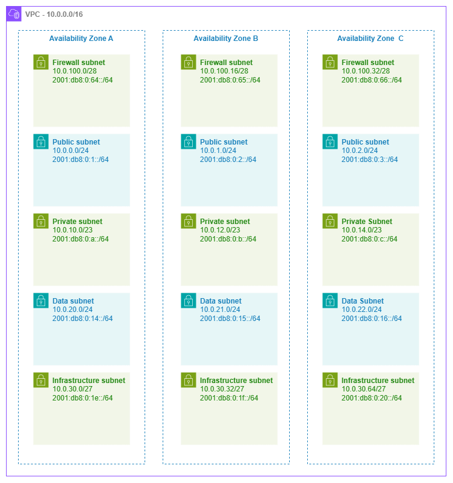

# 서브넷 {#subnets}

!!! info "사전 요구 사항"
    이 섹션은 [시작하기 전에](aws-prerequisites.md), [Amazon VPC](vpc.md), [리전 및 가용 영역](regions-azs.md), [CIDR 계획](cidr.md)에 대한 이해를 전제로 합니다. AWS 네트워킹 기초가 처음이라면 해당 페이지를 먼저 검토하세요.

서브넷은 라우팅 정책과 IP 주소 지정이 만나는 곳입니다. AWS에서 실행하는 모든 리소스 — EC2 인스턴스, ECS 태스크, EKS 파드, Lambda 함수, RDS 데이터베이스, 로드 밸런서, 방화벽 엔드포인트 — 는 서브넷에 배치되며, 해당 서브넷의 라우팅 테이블이 리소스가 접근할 수 있는 대상을 결정합니다. 서브넷 자체는 보안 경계가 아니라 라우팅 도메인입니다. 동일한 VPC 내에서 NACL과 보안 그룹이 동일한 두 서브넷은 사용자가 각각에 서로 다른 라우팅 테이블을 연결하기 전까지 동일하게 동작합니다. "퍼블릭"과 "프라이빗"은 서브넷의 속성이 아니라 라우팅 테이블의 속성이라는 이 구분을 이해하는 것이 서브넷 설계에서 가장 중요한 핵심 개념입니다.

잘 설계된 서브넷 아키텍처는 계층 간 격리, 예측 가능한 IP 소비, 성장을 위한 여유 공간, 그리고 AWS가 제공하는 모든 연결 및 보안 서비스와의 깔끔한 통합을 제공합니다. 반면 잘못 설계된 아키텍처는 IP 고갈 문제를 야기하고, 워크로드 마이그레이션을 강제하며, 방화벽 및 라우팅 정책을 불필요하게 복잡하게 만듭니다.

/// caption
5계층 서브넷 아키텍처 — [Drawio 소스](../assets/foundation/subnet-tiers.drawio)
///

## 서브넷 계층 설계 패턴 {#subnet-tier-design-patterns}

"퍼블릭/프라이빗/데이터" 3계층 모델은 출발점일 뿐, 한계가 아닙니다. 방화벽, Transit Gateway, VPC 엔드포인트, 컨테이너 워크로드를 운영하는 프로덕션 네트워크는 인프라 관심사와 애플리케이션 워크로드를 분리하기 위해 추가 계층을 활용하면 이점이 있습니다.

***핵심 인사이트:*** 각 계층은 레이블이 아니라 라우팅 테이블과 해당 계층이 호스팅하는 리소스 유형으로 정의됩니다. "퍼블릭" 서브넷은 단순히 라우팅 테이블에 인터넷 게이트웨이를 가리키는 `0.0.0.0/0` 경로가 있는 서브넷입니다. "프라이빗" 서브넷은 아웃바운드 트래픽을 NAT 게이트웨이를 통해 라우팅하거나 인터넷 경로가 전혀 없는 서브넷입니다. 서브넷 리소스 자체는 두 경우 모두 동일합니다.

### 5계층 참조 아키텍처 {#five-tier-reference-architecture}

| 계층 | 목적 | 일반적인 CIDR | 라우팅 테이블 패턴 |
| --- | --- | --- | --- |
| **방화벽(Firewall)** | AWS Network Firewall 엔드포인트, GWLB 엔드포인트 | 가용 영역당 `/28` | IGW 및 다른 계층에서 검사를 위한 경로 |
| **퍼블릭(Public)** | ALB, NLB, NAT 게이트웨이, 배스천 호스트 | 가용 영역당 `/24` | `0.0.0.0/0` → 인터넷 게이트웨이(또는 방화벽 엔드포인트) |
| **프라이빗(애플리케이션)** | EC2, ECS 태스크, EKS 파드, Lambda ENI | 가용 영역당 `/23` 또는 `/22` | `0.0.0.0/0` → NAT 게이트웨이(또는 인터넷 경로 없음) |
| **데이터(Data)** | RDS, ElastiCache, OpenSearch, Redshift | 가용 영역당 `/24` | 인터넷 경로 없음; VPC 로컬 및 온프레미스 경로만 허용 |
| **인프라/트랜짓(Infrastructure / Transit)** | TGW ENI, VPC 엔드포인트 ENI, Direct Connect VIF 어태치먼트 | 가용 영역당 `/27` 또는 `/28` | 서비스별 경로만 허용 |

모든 VPC에 5개 계층이 모두 필요한 것은 아닙니다. 단순한 워크로드 VPC는 퍼블릭과 프라이빗 계층만 사용할 수 있습니다. 공유 서비스 VPC는 VPC 엔드포인트를 위한 인프라 서브넷을 추가할 수 있습니다. 검사 VPC는 방화벽 계층이 필요합니다. 현재 배포하는 구성에 맞게 설계하되, 나중에 추가할 수 있는 계층을 위한 CIDR 공간을 미리 확보해 두세요.

## 모범 사례 {#best-practices}

### 서브넷 크기 조정 {#subnet-sizing}

#### 관례가 아닌 워크로드에 맞게 크기를 조정하세요 {#size-for-the-workload-not-for-convention}

"모든 곳에 /24를 사용하라"는 조언은 단순하지만, 일부 계층에는 낭비이고 다른 계층에는 위험할 정도로 작을 수 있습니다. 각 계층은 해당 서브넷에서 실제로 IP를 소비하는 리소스를 기준으로 크기를 결정하세요.

AWS는 모든 서브넷에서 5개의 주소를 예약합니다(네트워크, 라우터, DNS, 향후 사용, 브로드캐스트). 그 외에 실제 크기 결정 요소는 다음과 같습니다.

| 리소스 유형 | IP 소비 패턴 |
| --- | --- |
| EC2 인스턴스 | 인스턴스당 기본 IP 1개 + 멀티홈 워크로드의 경우 추가 ENI |
| ECS 태스크 (awsvpc) | 태스크당 ENI 1개 = 실행 중인 태스크당 IP 1개 |
| EKS 파드 (VPC CNI) | 기본적으로 파드당 IP 1개; 프리픽스 위임 사용 시 슬롯당 `/28` 프리픽스 1개 |
| Lambda (VPC 연결) | 고유한 보안 그룹 + 서브넷 조합당 ENI 1개 (Hyperplane을 통해 호출 간 공유) |
| NAT 게이트웨이 | 게이트웨이당 IP 1개 |
| Network Firewall 엔드포인트 | 가용 영역 엔드포인트당 IP 1개 |
| VPC 엔드포인트 (인터페이스) | 엔드포인트당 가용 영역당 ENI 1개 |
| Transit Gateway 연결 | 가용 영역당 ENI 1개 |

***핵심 인사이트:*** VPC CNI 플러그인을 사용하는 EKS는 AWS에서 IP를 가장 많이 소비합니다. 단일 `m5.xlarge` 노드는 58개의 파드를 호스팅할 수 있으며, 각 파드는 서브넷에서 IP를 하나씩 소비합니다. 하나의 가용 영역에 20개 노드로 구성된 클러스터는 1,160개의 IP를 소비할 수 있으며, 이는 `/24` 서브넷 4개 이상에 해당합니다. EKS를 운영한다면 가용 영역당 프라이빗 서브넷을 `/21` 또는 `/20`으로 크기를 설정하거나, 프리픽스 위임을 활성화하여 ENI 슬롯당 소비를 `/28` 하나로 줄이세요.

#### 계층별 크기 조정 권장 사항 {#sizing-recommendations-by-tier}

| 계층 | 권장 크기 | 근거 |
| --- | --- | --- |
| 방화벽 | `/28` (사용 가능 11개) | Network Firewall은 가용 영역당 엔드포인트를 하나씩 생성하므로 소수의 IP만 필요합니다 |
| 퍼블릭 | `/24` (사용 가능 251개) | ALB는 수평 확장 시 IP를 소비하고 NAT 게이트웨이도 공간이 필요하므로 `/24`가 충분한 여유를 제공합니다 |
| 프라이빗 (비컨테이너) | `/24` (사용 가능 251개) | 표준 EC2 및 Lambda 워크로드에 충분합니다 |
| 프라이빗 (EKS/ECS) | `/22` ~ `/20` (사용 가능 1,019~4,091개) | 컨테이너 워크로드는 IP를 공격적으로 소비하므로 크기가 부족하면 파드 스케줄링 실패가 발생합니다 |
| 데이터 | `/24` (사용 가능 251개) | 데이터베이스 인스턴스는 수가 적지만 오래 유지되므로 `/24`는 넉넉하고 단순합니다 |
| 인프라 | `/27` 또는 `/28` (사용 가능 27개 또는 11개) | TGW 및 VPC 엔드포인트 ENI는 예측 가능하고 수가 적습니다 |

#### 사전에 과도하게 할당하는 대신 보조 CIDR을 사용하세요 {#use-secondary-cidrs-rather-than-over-allocating-upfront}

서브넷 계층이 초기 할당을 초과하여 증가하더라도 서브넷 크기를 조정할 수 없으므로, 더 큰 새 서브넷을 생성하고 리소스를 마이그레이션해야 합니다. 이를 방지하려면 VPC에 보조 CIDR 블록을 추가하는 기능을 활용하세요. 이를 통해 기존 워크로드를 중단하지 않고 다른 CIDR 범위에서 동일한 계층에 추가 서브넷을 생성할 수 있습니다.

### 라우팅 테이블 설계 {#route-table-design}

#### 서브넷당 하나가 아닌 계층당 하나의 라우팅 테이블을 사용하세요 {#one-route-table-per-tier-not-one-per-subnet}

가장 일반적인 라우팅 테이블 패턴은 계층당 하나의 공유 라우팅 테이블을 사용하고, 모든 가용 영역에 걸쳐 해당 계층의 모든 서브넷에 연결하는 것입니다. 이렇게 하면 계층 내 라우팅 정책이 일관되게 유지되고 관리해야 할 라우팅 테이블 수가 줄어듭니다.

| 패턴 | 사용 시기 |
| --- | --- |
| **계층당 라우팅 테이블 하나** | 기본값. 모든 퍼블릭 서브넷이 하나의 라우팅 테이블을 공유하고, 모든 프라이빗 서브넷이 다른 하나를 공유합니다. 단순하고 일관적이며 감사하기 쉽습니다. |
| **계층당 가용 영역당 라우팅 테이블 하나** | 각 가용 영역에 자체 NAT 게이트웨이가 있고 AZ 로컬 이그레스를 원할 때 사용합니다(`0.0.0.0/0` 경로가 동일한 가용 영역의 NAT 게이트웨이를 가리킴). 이는 프라이빗 서브넷의 표준 HA 패턴입니다. |
| **서브넷당 라우팅 테이블 하나** | 드문 경우. 개별 서브넷에 고유한 라우팅이 필요할 때만 사용합니다(예: 특정 서브넷은 방화벽 엔드포인트로 라우팅하고 인접 서브넷은 직접 라우팅). 운영 복잡성이 증가합니다. |

***핵심 인사이트:*** NAT 게이트웨이가 있는 프라이빗 서브넷의 경우, 각 가용 영역의 라우팅 테이블이 동일한 가용 영역의 NAT 게이트웨이를 `0.0.0.0/0`으로 가리키기 때문에 계층당이 아닌 가용 영역당 하나의 라우팅 테이블이 필요합니다. 이렇게 하면 이그레스 트래픽이 AZ 로컬로 유지되고, 가용 영역 간 데이터 전송 비용이 발생하지 않으며, NAT 게이트웨이 장애가 해당 가용 영역에만 영향을 미칩니다.

### 인프라 서브넷 계층 {#infrastructure-subnet-tier}

#### 네트워크 서비스 ENI를 위한 전용 서브넷을 구성하세요 {#dedicate-subnets-for-network-service-enis}

Transit Gateway 연결, VPC 인터페이스 엔드포인트, Network Firewall 엔드포인트, Direct Connect 가상 인터페이스 연결은 모두 서브넷에 ENI를 배치합니다. 이를 애플리케이션 워크로드와 혼합하면 다음과 같은 문제가 발생합니다.

* **IP 어카운팅이 예측 불가능해집니다.** 새 VPC 엔드포인트가 애플리케이션이 사용하는 동일한 풀에서 IP를 소비합니다.
* **라우팅 테이블 충돌.** 인프라 ENI는 동일한 계층의 애플리케이션 워크로드와 다른 라우팅이 필요한 경우가 많습니다.
* **보안 그룹 난립.** 인프라 ENI는 애플리케이션 리소스와 다른 액세스 패턴을 가집니다.

전용 인프라 서브넷(소형 — `/27` 또는 `/28`)은 이 세 가지 문제를 모두 해결합니다. 자체 라우팅 테이블과 필요한 경우 자체 NACL을 가지며, IP 소비가 격리되어 예측 가능합니다.

***핵심 인사이트:*** Transit Gateway 연결은 지정한 서브넷의 가용 영역당 ENI를 하나씩 생성합니다. TGW ENI를 애플리케이션 서브넷에 배치하면 TGW의 라우팅 테이블 항목과 서브넷의 라우팅 테이블이 추론하기 어려운 방식으로 상호작용합니다. 가용 영역당 전용 `/28` 인프라 서브넷은 주소 공간 측면에서 거의 비용이 들지 않으며, 라우팅 혼란의 전체 원인을 제거합니다.

### 네트워크 ACL {#network-acls}

#### NACL은 기본적으로 개방 상태로 유지하고, 특정 컴플라이언스 요구 사항에만 규칙을 추가하세요 {#default-to-open-nacls-add-rules-only-for-specific-compliance-requirements}

NACL은 상태 비저장(stateless) 방식으로 서브넷 수준에서 동작하며, 보안 그룹과 관계없이 서브넷에 들어오고 나가는 모든 트래픽에 적용됩니다. 상태 저장(stateful) 방식으로 인스턴스 수준에서 동작하는 보안 그룹에 비해 투박한 수단입니다.

**NACL이 가치를 더하는 경우:**

* 인스턴스 수준 제어와 독립적인 네트워크 수준 거부 규칙을 요구하는 컴플라이언스 프레임워크(PCI-DSS, HIPAA)
* 서브넷 경계에서 전체 CIDR 범위 차단(예: 알려진 악성 범위의 트래픽이 보안 그룹에 도달하기 전에 거부)
* 보안 그룹이 허용하는 것과 관계없이 소스 CIDR의 명시적 허용 목록이 필요한 데이터 계층 서브넷의 심층 방어

**NACL이 가치 없이 복잡성만 더하는 경우:**

* "혹시 모르니" 서브넷 수준에서 보안 그룹 규칙을 중복 적용하는 경우 — 유지 관리 부담이 두 배가 되고 드리프트가 발생합니다
* 모든 액세스 제어가 이미 보안 그룹, IAM 정책, 서비스 수준 인증으로 처리되는 환경
* 상태 비저장 규칙이 보안 이점을 무효화하는 광범위한 포트 범위를 요구하는 동적 포트 범위(리턴 트래픽의 임시 포트)를 사용하는 워크로드

***핵심 인사이트:*** 기본 VPC NACL은 모든 인바운드 및 아웃바운드 트래픽을 허용합니다. 서브넷 수준에서 제한해야 하는 구체적이고 문서화된 이유가 없다면 그대로 유지하세요. 보안 그룹이 기본 네트워크 액세스 제어 수단이며, NACL은 컴플라이언스 기반의 보조 계층입니다.

### 서브넷 CIDR 예약 {#subnet-cidr-reservations}

#### 특정 리소스 유형을 위한 주소 범위를 예약하세요 {#reserve-address-ranges-for-specific-resource-types}

[서브넷 CIDR 예약](https://docs.aws.amazon.com/vpc/latest/userguide/subnet-cidr-reservation.html)을 사용하면 서브넷 주소 공간의 일부를 특정 리소스 유형(프리픽스 위임, 명시적 할당)을 위해 따로 확보하여 다른 리소스가 해당 IP를 소비하지 못하도록 할 수 있습니다.

**CIDR 예약을 사용해야 하는 경우:**

* 프리픽스 위임을 사용하는 EKS 운영 시 — 파드 IP가 예측 가능한 블록에서 제공되도록 `/28` 프리픽스용 범위를 예약
* 특정 워크로드에 안정적인 IP 범위가 필요한 경우(예: 온프레미스 방화벽이 허용 목록에 등록한 IP 블록)
* 자동 할당 리소스와 수동 할당 ENI 간의 IP 충돌 방지

**CIDR 예약을 건너뛰어도 되는 경우:**

* 서브넷이 단일 워크로드 유형을 호스팅하는 경우(주소 공간 경합 없음)
* 이미 할당을 관리하는 할당 규칙이 있는 IPAM 풀을 사용하는 경우

### IPv6 서브넷 주소 지정 {#ipv6-subnet-addressing}

#### 모든 IPv6 서브넷은 /64입니다 — 이에 맞게 계획하세요 {#every-ipv6-subnet-is-a-64-plan-accordingly}

IPv4에서는 `/28`부터 `/16`까지 서브넷 크기를 선택할 수 있지만, AWS의 IPv6 서브넷은 항상 `/64`입니다. 이는 제한이 아니라 표준입니다. `/64`는 서브넷당 2^64개의 주소를 제공하므로 사실상 무제한입니다. VPC는 Amazon 또는 자체 BYOIP 풀에서 `/56`을 받으며, 이를 통해 256개의 `/64` 서브넷을 구성할 수 있습니다.

설계 시 고려 사항:

* **가변 크기 조정 불가.** "소형" IPv6 서브넷을 만들 수 없습니다. 모든 서브넷은 계층에 관계없이 동일한 `/64`를 받습니다.
* **크기가 아닌 서브넷 수가 제약 조건입니다.** 단일 `/56`에서 256개의 `/64`를 사용할 수 있으므로, 계층 및 가용 영역 레이아웃이 해당 예산 내에 맞도록 계획하세요.
* **듀얼 스택 서브넷은 IPv4 CIDR과 IPv6 /64를 모두 가집니다.** IPv4 CIDR은 워크로드에 맞게 크기를 조정하고, IPv6 측은 자동으로 처리됩니다.
* **IPv6 전용 서브넷**은 IPv4를 완전히 제거합니다. IPv4 연결이 필요 없는 워크로드(내부 마이크로서비스, 배치 처리)에 사용하면 주소 지정이 단순해지고 IPv4 고갈을 방지할 수 있습니다.

***핵심 인사이트:*** VPC당 `/56`은 256개의 서브넷을 제공합니다. 가용 영역 3개 × 계층 5개 = 15개의 서브넷을 운영한다면 256개 중 15개를 사용한 것으로 여유가 충분합니다. 하지만 워크로드별 서브넷이 수십 개인 공유 VPC를 구축하는 경우에는 `/64` 할당을 추적하여 고갈되지 않도록 하세요.

### 컨테이너 및 서버리스 워크로드 고려 사항 {#container-and-serverless-workload-considerations}

#### EKS: 공격적인 IP 소비에 대비해 계획하세요 {#eks-plan-for-aggressive-ip-consumption}

Amazon VPC CNI 플러그인은 기본적으로 모든 파드에 VPC IP 주소를 할당합니다. `m5.xlarge`(ENI 4개 × ENI당 IP 15개 = 최대 파드 58개)에서 노드가 완전히 채워지면 서브넷 IP 58개를 소비합니다. 이를 관리하기 위한 전략은 다음과 같습니다.

* **프리픽스 위임 활성화**: 각 ENI 슬롯이 개별 IP 대신 `/28` 프리픽스(16개 IP)를 받아 더 많은 ENI 슬롯을 소비하지 않고도 노드당 파드 밀도를 높입니다. 소비 패턴이 "파드당 IP 1개"에서 "슬롯당 /28 하나, 파드 간 공유"로 변경됩니다.
* **커스텀 네트워킹 사용**: 노드의 기본 ENI와 다른 서브넷(또는 CIDR 범위)에서 파드 IP를 할당합니다. 이를 통해 노드 서브넷은 보수적으로 크기를 유지하면서 파드에는 훨씬 큰 주소 풀을 제공할 수 있습니다.
* **IPv6 전용 클러스터 고려**: 파드는 `/64` 서브넷에서 IPv6 주소를 받고(사실상 무제한), IPv4 전용 대상에는 NAT64를 사용합니다.

최악의 시나리오는 `/24` 서브넷에서 프리픽스 위임 없이 공격적으로 자동 확장하는 EKS 클러스터입니다. 5개에서 30개 노드로 급증하면 몇 분 만에 서브넷이 고갈될 수 있습니다. 이때 발생하는 파드 스케줄링 실패는 클러스터 문제처럼 보이지만, 실제로는 서브넷 IP 고갈이 원인입니다. 서브넷의 `available IPs` CloudWatch 지표를 모니터링하고 고갈되기 훨씬 전에 알림을 설정하세요.

#### awsvpc 모드의 ECS: 태스크당 ENI 하나 {#ecs-with-awsvpc-mode-one-eni-per-task}

`awsvpc` 네트워크 모드의 모든 ECS 태스크는 VPC IP가 있는 자체 ENI를 받습니다. 고밀도 서비스(가용 영역당 수백 개의 태스크)의 경우 서브넷 크기를 적절히 조정하세요. EKS와 달리 ECS에는 프리픽스 위임에 해당하는 기능이 없으므로 태스크당 IP 하나가 고정입니다.

수백 개의 태스크로 확장되는 ECS 서비스의 경우, 가용 영역당 최대 태스크 수를 계산하고 20%의 여유를 추가하세요. 3개의 가용 영역에 걸쳐 200개의 태스크를 실행하는 서비스는 정상 상태에서 가용 영역당 약 67개의 IP가 필요하지만, 배포 중(최대 200%의 롤링 업데이트)에는 일시적으로 두 배가 필요합니다. `/24`는 이를 충분히 처리할 수 있지만 `/26`은 그렇지 않습니다.

#### VPC의 Lambda: Hyperplane ENI 공유 {#lambda-in-vpc-hyperplane-eni-sharing}

VPC에 연결된 Lambda 함수는 동일한 보안 그룹 및 서브넷 조합을 가진 호출 간에 공유되는 Hyperplane ENI를 사용합니다. 동시 호출당 IP가 하나씩 필요하지 않습니다. 그러나 고유한 (서브넷, 보안 그룹) 쌍마다 최소 하나의 ENI가 생성됩니다. 동일한 서브넷에 서로 다른 보안 그룹을 가진 Lambda 함수가 많으면 ENI 소비가 누적될 수 있습니다.

***핵심 인사이트:*** "VPC의 Lambda가 서브넷을 고갈시킬 것"이라는 일반적인 우려는 구식입니다. 2019년 Hyperplane ENI 모델 도입 이후 Lambda는 호출 간에 ENI를 공유합니다. 실제 소비 요인은 동시성이 아니라 고유한 (서브넷, 보안 그룹) 조합의 수입니다. 액세스 패턴이 허용하는 경우 Lambda 함수를 공유 보안 그룹으로 통합하세요.

### 명명 및 태깅 {#naming-and-tagging}

#### 계층, 가용 영역, 목적을 인코딩하는 일관된 명명 규칙을 사용하세요 {#use-a-consistent-naming-convention-that-encodes-tier-availability-zone-and-purpose}

서브넷 이름은 사람과 자동화 모두가 즉시 파악할 수 있어야 합니다. `{env}-{tier}-{az}` 형식(예: `prod-private-use1a`, `prod-infra-use1b`)을 사용하면 콘솔에서 서브넷을 필터링하고, 태그 조건이 있는 IAM 정책을 작성하며, 규칙에 따라 서브넷을 선택하는 IaC 모듈을 구축할 수 있습니다.

서브넷에는 최소한 다음 태그를 지정하세요.

* `Environment` (prod, staging, dev)
* `Tier` (public, private, data, infrastructure, firewall)
* `Network` 또는 `VPC` (멀티 VPC 계정에서 어떤 VPC인지 식별)
* EKS의 경우: AWS Load Balancer Controller가 자동으로 검색할 수 있도록 적절한 서브넷에 `kubernetes.io/role/elb` 및 `kubernetes.io/role/internal-elb` 태그 지정

### 공유 서브넷 (RAM을 통한 VPC 공유) {#shared-subnets-vpc-sharing-via-ram}

#### 네트워크 관리를 중앙화하기 위해 계정 간에 서브넷을 공유하세요 {#share-subnets-across-accounts-to-centralize-network-management}

AWS Resource Access Manager를 통한 [VPC 공유](https://docs.aws.amazon.com/vpc/latest/userguide/vpc-sharing.html)를 사용하면 중앙 네트워킹 계정이 VPC와 서브넷을 소유하면서 참여 계정이 공유 서브넷에 리소스를 배포할 수 있습니다. 이 패턴은 IP 관리, 라우팅 테이블 제어, 서브넷 수명 주기를 중앙화하면서 애플리케이션 팀에게 워크로드 배포 자율성을 부여합니다.

공유 서브넷의 설계 고려 사항:

* **소유자 계정이 라우팅, NACL, 서브넷 수명 주기를 제어합니다.** 참여 계정은 공유 서브넷의 라우팅 테이블이나 NACL을 수정할 수 없습니다.
* **보안 그룹은 계정별로 관리됩니다.** 각 참여 계정은 공유 서브넷 내에서 자체 보안 그룹을 관리합니다. 계정 간 보안 그룹 참조는 지원되지 않습니다.
* **서브넷 크기는 모든 참여자를 고려해야 합니다.** 여러 계정이 서브넷을 공유하는 경우 IP 소비를 합산하세요. 한 계정에는 충분한 `/24`가 세 계정이 배포하면 부족할 수 있습니다.
* **계정당이 아닌 계층당 별도의 서브넷을 사용하세요.** VPC 공유의 가치는 계정이 인프라를 공유하는 데 있으므로, 컴플라이언스가 요구하지 않는 한 서브넷 수준에서 계정별 격리를 재현하지 마세요.

***핵심 인사이트:*** VPC 공유는 중앙화된 네트워크 제어를 원하는 조직에 가장 운영 효율적인 패턴입니다. 네트워킹 팀이 VPC, 서브넷, 라우팅 테이블, 연결을 관리하고, 애플리케이션 팀은 네트워킹 전문 지식 없이 리소스를 배포합니다. 트레이드오프는 네트워킹 팀이 모든 참여 계정의 총 수요에 맞게 서브넷 크기를 조정해야 한다는 점입니다.

## 서브넷과 다른 서비스의 결합 {#combining-subnets-with-other-services}

서브넷 설계는 독립적으로 존재하지 않습니다. AWS의 모든 연결 및 보안 서비스는 서브넷 아키텍처와 상호작용합니다. 아래 표는 서브넷이 함께 사용되는 서비스들과 어떻게 통합되는지를 정리한 것입니다.

| 조합 | 서브넷 역할 | 설계 고려사항 |
| --- | --- | --- |
| **서브넷 + NAT 게이트웨이** | 퍼블릭 서브넷이 NAT 게이트웨이를 호스팅하며, 프라이빗 서브넷은 `0.0.0.0/0` 트래픽을 NAT 게이트웨이로 라우팅 | 퍼블릭 계층의 각 가용 영역마다 NAT 게이트웨이를 하나씩 배포합니다. 각 프라이빗 서브넷의 라우팅 테이블은 동일 가용 영역의 NAT 게이트웨이를 가리킵니다. ALB와 함께 NAT 게이트웨이 IP를 수용할 수 있도록 퍼블릭 서브넷 크기를 충분히 확보합니다. |
| **서브넷 + Transit Gateway** | 인프라 서브넷이 TGW ENI를 호스팅(가용 영역당 하나) | 전용 `/28` 인프라 서브넷을 사용합니다. TGW ENI는 애플리케이션 라우팅과 충돌하지 않는 별도의 라우팅 테이블이 필요합니다. 어플라이언스 모드는 동일 가용 영역의 ENI를 통해 반환 트래픽을 라우팅합니다. |
| **서브넷 + Network Firewall** | 방화벽 서브넷이 방화벽 엔드포인트를 호스팅하며, 다른 서브넷은 해당 엔드포인트를 통해 트래픽을 라우팅 | 가용 영역마다 전용 `/28` 방화벽 서브넷을 구성합니다. 방화벽 서브넷의 라우팅 테이블은 IGW를 가리키고, IGW의 엣지 라우팅 테이블은 반환 트래픽을 방화벽 엔드포인트로 전달합니다. |
| **서브넷 + VPC 엔드포인트** | 인프라 서브넷이 인터페이스 엔드포인트 ENI를 호스팅 | 인터페이스 엔드포인트는 엔드포인트당 가용 영역마다 ENI를 하나씩 생성합니다. 전용 인프라 서브넷을 사용하면 엔드포인트 ENI를 애플리케이션 IP 풀과 분리할 수 있습니다. 게이트웨이 엔드포인트(S3, DynamoDB)는 서브넷 IP를 소비하지 않으며, 라우팅 테이블 항목으로 동작합니다. |
| **서브넷 + 로드 밸런서** | 인터넷 연결 ALB/NLB에는 퍼블릭 서브넷, 내부 로드 밸런서에는 프라이빗 서브넷 사용 | ALB는 가용 영역당 여유 IP 8개를 포함한 최소 `/27` 서브넷이 필요합니다. NLB는 요구 사항이 적지만 확장을 위한 여유 공간이 여전히 필요합니다. `/28` 서브넷을 로드 밸런서와 다른 리소스가 공유하지 않도록 합니다. |
| **서브넷 + EKS/ECS** | 프라이빗 서브넷이 워커 노드 및 파드/태스크 ENI를 호스팅 | VPC CNI를 사용하는 EKS의 경우 `/22` 이상의 크기로 설정합니다. 커스텀 네트워킹을 활용하여 노드와 파드의 CIDR 범위를 분리합니다. ECS Fargate의 경우 태스크마다 IP가 하나씩 필요하므로, 가용 영역별 최대 태스크 수를 기준으로 계획합니다. |

## 문서 {#documentation}

*   :material-file-document: **VPC 서브넷**

    ---

    CIDR 블록, 라우팅 테이블 연결, 네트워크 ACL을 포함한 서브넷 생성, 구성 및 관리에 대한 전체 문서입니다.

    [:octicons-arrow-right-24: 문서](https://docs.aws.amazon.com/vpc/latest/userguide/configure-subnets.html)

*   :material-ruler: **서브넷 크기 조정**

    ---

    서브넷 CIDR 블록 크기, 예약된 주소 및 크기 조정 고려 사항에 대한 AWS 가이드입니다.

    [:octicons-arrow-right-24: 서브넷 크기 조정](https://docs.aws.amazon.com/vpc/latest/userguide/configure-subnets.html#subnet-sizing)

*   :material-book-lock: **서브넷 CIDR 예약**

    ---

    IP 충돌을 방지하기 위해 특정 할당 유형에 대한 서브넷 주소 공간의 일부를 예약합니다.

    [:octicons-arrow-right-24: CIDR 예약](https://docs.aws.amazon.com/vpc/latest/userguide/subnet-cidr-reservation.html)

*   :material-shield-outline: **네트워크 ACL**

    ---

    인바운드 및 아웃바운드 트래픽 제어를 위한 스테이트리스(Stateless) 서브넷 수준 방화벽 규칙입니다.

    [:octicons-arrow-right-24: 네트워크 ACL](https://docs.aws.amazon.com/vpc/latest/userguide/vpc-network-acls.html)

*   :material-routes: **라우팅 테이블**

    ---

    사용자 지정 라우팅 테이블, 전파 및 우선순위 규칙을 사용하여 각 서브넷의 트래픽 라우팅을 제어합니다.

    [:octicons-arrow-right-24: 라우팅 테이블](https://docs.aws.amazon.com/vpc/latest/userguide/VPC_Route_Tables.html)

*   :material-share-variant: **VPC 공유 (RAM)**

    ---

    중앙 집중식 네트워크 관리를 위해 AWS Resource Access Manager를 사용하여 계정 간에 서브넷을 공유합니다.

    [:octicons-arrow-right-24: 공유 VPC](https://docs.aws.amazon.com/vpc/latest/userguide/vpc-sharing.html)

## 상호 참조 {#cross-references}

**기반 페이지:**

* [Amazon VPC](vpc.md) — VPC 설계 패턴, CIDR 할당, VPC와 서브넷 간의 관계
* [CIDR 계획](cidr.md) — 충돌 없이 VPC와 서브넷 전반에 걸쳐 주소 공간을 계획하는 방법
* [리전 및 가용 영역](regions-azs.md) — 서브넷 분산을 결정하는 가용 영역 배치 전략
* [IPAM](ipam.md) — 대규모 서브넷 CIDR 할당을 위한 자동화된 IP 주소 관리

**연결 페이지:**

* [AWS 내부 연결](../connectivity/within-aws.md) — 인프라 서브넷 설계에 의존하는 Transit Gateway 및 Cloud WAN 패턴
* [인터넷 연결](../connectivity/internet.md) — 퍼블릭 및 방화벽 서브넷 계층을 구성하는 NAT 게이트웨이, 인터넷 게이트웨이, 방화벽 패턴
* [하이브리드 및 멀티클라우드](../connectivity/hybrid-multicloud.md) — 인프라 서브넷에 연결되는 Direct Connect 및 VPN 어태치먼트

**애플리케이션 네트워킹 페이지:**

* [로드 밸런싱](../application-networking/load-balancing.md) — ALB 및 NLB 서브넷 요구 사항과 가용 영역 배치
* [컨테이너 메시](../application-networking/container-mesh.md) — 프라이빗 서브넷 크기 조정을 결정하는 EKS 및 ECS 네트워킹 패턴
