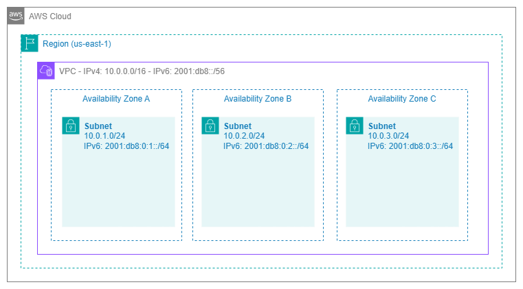
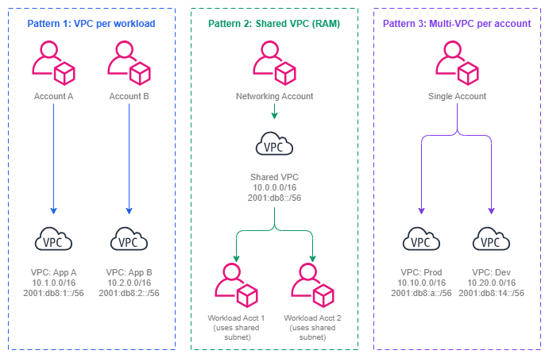

# Amazon VPC {#amazon-vpc}

!!! info "사전 요구 사항"
    이 섹션은 [시작하기 전에](aws-prerequisites.md) 및 [AWS Organizations](organizations.md)에 대한 이해를 전제로 합니다. AWS 네트워킹 기초가 처음이라면 해당 페이지를 먼저 검토하세요.

Amazon Virtual Private Cloud(VPC)는 AWS 내에서 논리적으로 격리된 네트워크입니다. 네트워크 연결이 필요한 모든 컴퓨팅 리소스, 데이터베이스, 컨테이너, Lambda 함수는 VPC 내에서 실행됩니다. VPC는 단순히 서브넷을 담는 컨테이너가 아닙니다. VPC는 그 위에서 이루어지는 모든 네트워킹 결정을 형성하는 근본적인 보안 경계이자 IP 주소 도메인이며 라우팅 컨텍스트입니다. VPC 설계를 잘못하면 사전 계획으로 충분히 피할 수 있었던 CIDR 충돌, 연결 제한, 운영상의 마찰을 수년간 해결하며 보내게 됩니다.

VPC는 리전 내 모든 가용 영역(Availability Zone)에 걸쳐 있으며, IP 주소 지정, 라우팅, 네트워크 게이트웨이에 대한 완전한 제어권을 제공합니다. 또한 모든 연결 서비스(Transit Gateway, Cloud WAN, VPC Peering, PrivateLink, VPC Lattice)의 연결 지점 역할을 합니다. VPC 설계는 가능한 연결 패턴, 성장을 위해 사용 가능한 주소 공간, 그리고 워크로드 간 격리의 명확성을 직접적으로 결정합니다.

/// caption
VPC 아키텍처 — [Drawio 소스](../assets/foundation/vpc-architecture.drawio)
///

## 주요 기능 {#key-capabilities}

*   :material-ip-network: **IPv4 및 IPv6 주소 지정**

    ---

    기본 IPv4 CIDR 블록(`/16` ~ `/28`)을 정의하고, 최대 4개의 보조 CIDR을 추가하며, 듀얼 스택 운영을 위해 선택적으로 `/56` IPv6 CIDR을 할당합니다.

*   :material-shield-lock: **네트워크 격리**

    ---

    각 VPC는 강력한 격리 경계입니다. VPC 간 트래픽은 명시적인 연결(피어링, Transit Gateway, Cloud WAN 또는 VPC Lattice)이 필요합니다. 암묵적인 VPC 간 라우팅은 존재하지 않습니다.

*   :material-routes: **라우팅 테이블 및 게이트웨이**

    ---

    서브넷별 라우팅 테이블이 트래픽 흐름을 제어합니다. 인터넷 게이트웨이, NAT 게이트웨이, Transit Gateway 연결, VPC 엔드포인트를 통해 다양한 대상에 연결할 수 있습니다.

*   :material-chart-timeline-variant: **VPC Flow Logs**

    ---

    VPC, 서브넷 또는 ENI 수준에서 IP 트래픽에 대한 메타데이터를 캡처합니다. 보안 분석, 문제 해결 및 컴플라이언스 감사에 필수적입니다.

*   :material-dns: **DNS 확인**

    ---

    VPC+2 주소에서 Amazon 제공 DNS(Route 53 Resolver)를 사용합니다. 프라이빗 호스팅 존, Resolver 엔드포인트, 전달 규칙을 통해 하이브리드 DNS 아키텍처를 구현할 수 있습니다.

*   :material-share-variant: **VPC 공유(AWS RAM)**

    ---

    조직 내 계정 간에 서브넷을 공유합니다. 여러 계정이 네트워크 인프라를 중복 구성하지 않고도 동일한 VPC에 리소스를 배포할 수 있습니다.

## VPC 설계 패턴 {#vpc-design-patterns}

VPC 설계는 모든 상황에 맞는 단일 정답이 없습니다. 올바른 패턴은 조직의 계정 전략, 팀 자율성 요구사항, 컴플라이언스 경계, 그리고 운영 성숙도에 따라 달라집니다. 프로덕션 AWS 환경에서는 세 가지 주요 패턴이 주로 사용되며, 대부분의 조직은 이를 조합하여 활용합니다.

/// caption
VPC 설계 패턴 — [Drawio 소스](../assets/foundation/vpc-design-patterns.drawio)
///

### 워크로드별 VPC (환경별 애플리케이션당 VPC 하나) {#vpc-per-workload-one-vpc-per-application-per-environment}

성숙한 멀티 계정 환경에서 가장 일반적인 패턴입니다. 각 애플리케이션 팀은 자신의 계정에서 워크로드에 맞게 크기가 조정된 전용 VPC를 소유합니다. 공유 서비스와의 연결은 Transit Gateway 또는 Cloud WAN 연결을 통해 이루어집니다.

**사용 시기:** 팀이 네트워크 구성(보안 그룹, NACL, 라우팅 테이블)에 대한 자율성이 필요한 경우. 워크로드마다 컴플라이언스 요구사항이 다른 경우. 장애 반경(blast radius) 격리가 필요한 경우 — 하나의 VPC에서 발생한 잘못된 구성이 다른 VPC에 영향을 미치지 않아야 할 때.

**트레이드오프:** VPC가 많아질수록 Transit Gateway 또는 Cloud WAN 연결, 조율해야 할 CIDR 할당, 라우팅 테이블 항목도 늘어납니다. IPAM과 자동화된 프로비저닝으로 관리할 수 있지만, 툴링에 대한 사전 투자가 필요합니다.

### AWS RAM을 통한 공유 VPC {#shared-vpcs-via-aws-ram}

네트워킹 팀이 VPC를 생성하고 [AWS Resource Access Manager](https://docs.aws.amazon.com/ram/latest/userguide/what-is.html)를 통해 특정 서브넷을 워크로드 계정과 공유합니다. 워크로드 계정은 VPC 자체를 관리하지 않고도 공유 서브넷에 리소스(EC2, RDS, Lambda)를 배포할 수 있습니다.

**사용 시기:** 계정별 네트워킹 오버헤드를 최소화하면서 중앙 집중식 네트워크 관리를 원하는 경우. 팀이 라우팅 테이블이나 게이트웨이를 관리할 필요가 없는 경우. 소수의 대형 VPC를 운영하는 경우(다수의 소형 VPC 대신). 중앙 플랫폼 팀이 모든 네트워킹을 소유하는 조직에서 일반적으로 사용됩니다.

**트레이드오프:** 동일한 VPC를 공유하는 워크로드 간 격리 수준이 낮아집니다. 서로 다른 계정의 리소스가 동일한 네트워크를 공유하므로 보안 그룹 관리가 더욱 중요해집니다. 서브넷 수준의 NACL이 VPC 내에서 가장 성긴(가장 큰 단위의) 격리 경계입니다.

### 계정당 다중 VPC {#multi-vpc-per-account}

단일 계정에 서로 다른 목적(프로덕션, 스테이징, 격리된 워크로드)을 위한 여러 VPC가 포함됩니다. 계정 수준 격리와 네트워크 수준 격리를 혼용하기 때문에 성숙한 환경에서는 덜 일반적입니다.

**사용 시기:** 아직 멀티 계정 전략을 사용하지 않는 소규모 조직. 개념 증명(PoC) 환경. 조직 정책으로 인해 계정 수 증가가 제한되는 상황.

**트레이드오프:** 별도 계정이 제공하는 보안 및 청구 격리를 잃게 됩니다. 모든 VPC가 동일한 IAM 경계를 공유하므로, 하나의 VPC 워크로드에서 자격 증명이 침해될 경우 동일 계정 내 다른 VPC의 리소스에 잠재적으로 접근할 수 있습니다.

***핵심 인사이트:*** *VPC 설계 패턴은 계정 전략을 따라야 하며, 그 반대가 되어서는 안 됩니다. 환경별 워크로드당 하나의 계정(AWS 권장 방식)을 사용한다면, 계정당 하나의 VPC가 자연스러운 기본값입니다. 플랫폼 계정에서 네트워킹을 중앙화한다면, RAM을 통한 공유 VPC가 중복을 줄여줍니다. VPC 패턴은 조직 모델의 결과물입니다.*

## 모범 사례 {#best-practices}

### CIDR 크기 조정 및 계획 {#cidr-sizing-and-planning}

#### 프로덕션 VPC는 /16으로 시작하고 /20보다 작게 설정하지 않기 {#start-with-16-for-production-vpcs-and-never-go-smaller-than-20}

`/16`은 65,536개의 주소를 제공합니다. 이는 성장 수용, 모든 가용 영역에 걸친 다중 서브넷 계층, 그리고 IP를 많이 소비하는 서비스(VPC CNI를 사용하는 EKS 파드, Lambda ENI, awsvpc 모드의 ECS 태스크)를 충분히 지원합니다. 더 작게 시작하면 효율적으로 느껴지지만, 나중에 고통스러운 확장 시나리오를 초래합니다.

`/16`의 비용은 비용(달러)이 아니라 프라이빗 범위에서의 주소 공간 소비입니다. 잘 계획된 최상위 풀(예: `10.0.0.0/8`)과 함께 [IPAM](ipam.md)을 사용하는 경우, 256개의 `/16` 블록을 사용할 수 있습니다. 대부분의 조직에 충분한 양입니다. 온프레미스 중복으로 인해 RFC 1918 공간이 제한된 경우, 프로덕션 환경의 최솟값으로 `/20`을 사용하고 처음부터 보조 CIDR을 계획하세요.

#### 보조 CIDR은 임시방편이 아닌 전략적으로 활용하기 {#use-secondary-cidrs-strategically-not-as-a-band-aid}

보조 CIDR 블록을 사용하면 VPC를 재생성하지 않고도 주소 공간을 확장할 수 있습니다. 이는 계획된 성장(새 서브넷 계층 추가, 새 가용 영역 지원)에 유용하지만, 초기 할당 부족을 수정하는 패턴이 되어서는 안 됩니다. 보조 CIDR을 추가할 때마다 라우팅 복잡성이 증가합니다. 라우팅 테이블, 보안 그룹, NACL이 추가 범위를 모두 고려해야 합니다.

보조 CIDR의 가장 좋은 활용 사례는 비 RFC 1918 범위(EKS 파드 네트워킹을 위한 100.64.0.0/10)나 기존 IPv4 전용 VPC에 IPv6를 추가하는 경우입니다. 기본 CIDR이 너무 작다는 이유로 보조 CIDR을 계속 추가하는 것은 피하세요. 이는 새롭고 적절한 크기의 VPC를 생성하고 마이그레이션해야 한다는 신호입니다.

#### 동일 리전의 향후 VPC를 위한 CIDR 공간 예약하기 {#reserve-cidr-space-for-future-vpcs-in-the-same-region}

CIDR을 할당할 때 현재 VPC만 계획하지 마세요. 경로 요약이 가능하도록 동일 리전의 향후 VPC를 위한 연속 블록을 예약하세요. 프로덕션 VPC가 `10.1.0.0/16`이고 스테이징 VPC가 `10.2.0.0/16`이라면, `10.1.0.0/15`를 경로 요약으로 온프레미스에 광고할 수 있습니다. `/8` 전체에 걸쳐 무작위로 CIDR을 할당하면 요약이 불가능해지고 모든 곳의 라우팅 테이블이 비대해집니다.

***핵심 인사이트:*** *CIDR 계획은 VPC 수준의 결정이 아니라 조직 수준의 결정입니다. [Amazon VPC IPAM](ipam.md)을 사용하여 할당 규칙을 적용하고, 중복을 방지하며, 전체 주소 공간에 대한 단일 정보 소스를 유지하세요. 수동 스프레드시트 추적은 VPC가 10개를 넘으면 한계에 부딪힙니다.*

### IPv6 도입 {#ipv6-adoption}

#### 새 VPC에는 처음부터 듀얼 스택 활성화하기 {#enable-dual-stack-from-day-one-on-new-vpcs}

모든 새 VPC는 IPv4 CIDR과 Amazon 제공 `/56` IPv6 CIDR을 모두 포함하여 생성해야 합니다. 추가 비용은 없으며(IPv6 주소 지정은 무료), 기존 VPC에 IPv6를 사후 적용하려면 모든 서브넷, 보안 그룹, 라우팅 테이블, NACL을 업데이트해야 합니다. 이 작업은 VPC의 수명이 길수록 더욱 복잡해집니다.

듀얼 스택이 IPv6를 즉시 사용해야 한다는 의미는 아닙니다. 마이그레이션 프로젝트 없이 워크로드가 준비되었을 때 옵션을 사용할 수 있다는 의미입니다. EKS, Lambda, ALB와 같은 서비스는 이미 IPv6를 기본적으로 지원합니다. 추세는 명확합니다. IPv6 도입이 가속화되고 있으며, 오늘 IPv6 없이 생성된 VPC는 수명 내에 IPv6가 필요하게 될 것입니다.

#### 동서 트래픽에 IPv6를 사용하여 NAT 의존성 줄이기 {#use-ipv6-for-east-west-traffic-to-reduce-nat-dependency}

IPv6 주소는 설계상 전역적으로 고유하고 공개적으로 라우팅 가능하지만, 그렇다고 공개적으로 접근 가능하다는 의미는 아닙니다. 이그레스 전용 인터넷 게이트웨이는 인바운드를 차단하면서 아웃바운드 IPv6 트래픽을 허용합니다. AWS 내 서비스 간 통신의 경우, IPv6는 IPv4 변환이 필요 없는 트래픽에 대해 NAT 게이트웨이(및 GB당 비용)가 필요 없게 합니다.

### VPC Flow Logs {#vpc-flow-logs}

#### 서브넷 또는 ENI 수준이 아닌 VPC 수준에서 Flow Logs 활성화하기 {#enable-flow-logs-at-the-vpc-level-not-the-subnet-or-eni-level}

VPC 수준 Flow Logs는 단일 구성으로 VPC 내의 모든 트래픽을 캡처합니다. 서브넷 수준 또는 ENI 수준 로그는 특정 문제 해결에 유용하지만, 기본 관측성 메커니즘이 되어서는 안 됩니다. 이는 가시성의 공백을 만들고 리소스별 관리가 필요합니다.

장기 보존 및 Athena를 통한 비용 효율적인 쿼리를 위해 Flow Logs를 S3로 전송하고, 실시간 알림을 위해 선택적으로 CloudWatch Logs로도 전송하세요. 사용자 지정 로그 형식을 사용하면 보안 조사 및 트래픽 분석에 필수적인 `vpc-id`, `subnet-id`, `instance-id`, `tcp-flags`, `traffic-path`와 같은 필드를 포함할 수 있습니다.

#### Flow Logs를 문제 해결뿐만 아니라 보안에도 활용하기 {#use-flow-logs-for-security-not-just-troubleshooting}

Flow Logs는 종종 디버깅 도구로만 취급됩니다. 하지만 보안 제어로서도 동등하게 가치 있습니다. 예상치 못한 트래픽 패턴 감지, 알려진 악성 IP와 통신하는 리소스 식별, NACL 및 보안 그룹이 의도한 대로 작동하는지 검증, 네트워크 트래픽 로깅을 요구하는 컴플라이언스 프레임워크를 위한 감사 증거 제공 등에 활용할 수 있습니다.

***핵심 인사이트:*** *VPC Flow Logs는 VPC에서 실제로 흐르는 트래픽을 파악하는 유일한 기본 메커니즘입니다. 보안 그룹과 NACL은 허용되는 것을 정의하고, Flow Logs는 실제로 일어나는 일을 알려줍니다. 모든 계정의 모든 VPC에서 처음부터 활성화하세요.*

### DNS 구성 {#dns-configuration}

#### 모든 VPC에서 DNS 호스트 이름 및 DNS 확인 활성화하기 {#enable-dns-hostnames-and-dns-resolution-on-every-vpc}

모든 VPC에서 `enableDnsHostnames`와 `enableDnsSupport`는 모두 `true`로 설정해야 합니다. 이 설정 없이는 리소스가 퍼블릭 DNS 호스트 이름을 받지 못하고, Route 53 프라이빗 호스팅 영역이 확인되지 않으며, VPC 엔드포인트가 올바르게 작동하지 않습니다. 프로덕션 환경에서 이 설정 중 하나라도 비활성화할 유효한 이유는 없습니다.

#### 하이브리드 DNS에는 Route 53 Resolver 엔드포인트 사용하기 {#use-route-53-resolver-endpoints-for-hybrid-dns}

VPC가 온프레미스 DNS 이름을 확인해야 하거나 온프레미스 네트워크가 AWS 프라이빗 호스팅 영역 이름을 확인해야 하는 경우, Route 53 Resolver 인바운드 및 아웃바운드 엔드포인트를 배포하세요. 이는 EC2에서 실행되는 자체 관리형 DNS 포워더(BIND, Unbound)의 필요성을 대체하며, RAM을 통해 조직 전체에 공유되는 Route 53 Resolver 규칙과 기본적으로 통합됩니다.

### VPC 설계 및 계정 전략 정렬 {#vpc-design-and-account-strategy-alignment}

#### 기본 패턴은 워크로드 계정당 하나의 VPC {#one-vpc-per-workload-account-is-the-default-pattern}

각 워크로드가 자체 계정을 갖는 다중 계정 전략(AWS 권장 접근 방식)에서 각 계정은 해당 워크로드 환경을 위한 정확히 하나의 VPC를 포함해야 합니다. 이는 명확한 1:1 매핑을 만듭니다. 하나의 계정 = 하나의 워크로드 = 하나의 VPC = 하나의 CIDR 할당 = 하나의 Transit Gateway 또는 Cloud WAN 연결.

이 패턴은 격리를 극대화하고(계정 수준 IAM 경계 + VPC 수준 네트워크 경계), IPAM 할당을 단순화하며(OU당 하나의 풀, 계정당 하나의 할당), 연결 거버넌스를 간단하게 만듭니다(계정 OU 멤버십 기반 연결 수락).

#### 중앙 집중식 제어가 팀 자율성보다 중요할 때 공유 VPC(RAM) 사용하기 {#use-shared-vpcs-ram-when-centralized-control-outweighs-team-autonomy}

공유 VPC는 중앙 플랫폼 팀이 모든 네트워킹을 관리하고 워크로드 팀이 VPC 수준 구성 요소와 전혀 상호 작용하지 않아야 할 때 적합합니다. 이는 네트워크 변경에 변경 자문 위원회 승인이 필요한 규제 산업이나, 워크로드 팀이 네트워킹 전문 지식 없는 애플리케이션 개발자인 조직에서 일반적입니다.

트레이드오프는 실재합니다. 워크로드 팀은 소유하지 않은 공유 서브넷의 보안 그룹을 수정할 수 없고, 사용자 지정 라우팅 테이블 항목을 생성할 수 없으며, VPC 엔드포인트를 추가할 수 없습니다. 모든 네트워크 변경은 플랫폼 팀을 통해 이루어집니다. 조직이 팀 자율성과 셀프 서비스를 중시한다면, 자동화된 프로비저닝을 갖춘 워크로드당 VPC 패턴이 일반적으로 더 적합합니다.

***핵심 인사이트:*** *워크로드당 VPC와 공유 VPC 중 선택은 근본적으로 기술적 결정이 아닌 조직 설계 결정입니다. 이는 "플랫폼 책임"과 "팀 책임" 사이의 경계를 어디에 둘 것인지를 반영합니다. 두 패턴 모두 기술적으로 작동합니다. 문제는 어떤 운영 모델이 조직에 맞는지입니다.*

### 네트워크 격리 및 보안 경계 {#network-isolation-and-security-boundaries}

#### VPC를 단순한 주소 공간이 아닌 신뢰 경계로 취급하기 {#treat-vpcs-as-trust-boundaries-not-just-address-spaces}

VPC는 별도의 계정을 제외하고 AWS가 제공하는 가장 강력한 네트워크 격리 기본 요소입니다. 명시적으로 연결을 생성하지 않는 한(피어링, Transit Gateway 연결, VPC Lattice 연결, PrivateLink 엔드포인트) VPC 경계를 넘는 트래픽은 없습니다. 신뢰 도메인을 중심으로 VPC 경계를 설계하세요. 네트워크 수준에서 서로 신뢰하는 리소스는 동일한 VPC에 속하고, 신뢰 수준이 다른 리소스는 별도의 VPC에 속합니다.

이 원칙은 PCI 범위 워크로드가 비 PCI 워크로드와 VPC를 공유하지 않고 전용 VPC(이상적으로는 전용 계정)에 있어야 함을 의미합니다. 관리 플레인(CI/CD, 모니터링, 배스천 호스트)은 데이터 플레인과 별도의 VPC에 있어야 합니다. 격리는 저렴합니다. VPC 비용은 없지만, 신뢰 경계를 넘는 침해 비용은 그렇지 않습니다.

#### 다중 서브넷 계층을 사용하되 수를 관리 가능하게 유지하기 {#use-multiple-subnet-tiers-but-keep-the-number-manageable}

클래식 3계층 모델(퍼블릭, 프라이빗, 데이터)은 대부분의 워크로드에 적합합니다. 기존 계층과 다른 진정한 라우팅 또는 액세스 제어 요구 사항이 있을 때만 계층을 추가하세요. 일반적인 추가 사항으로는 Transit Gateway 또는 Cloud WAN 연결 ENI 전용 계층, VPC 엔드포인트 계층, 방화벽 엔드포인트 계층이 있습니다. 조직적 이유(팀당 하나의 계층)로 계층을 만드는 것은 피하세요. 그것이 바로 별도의 VPC가 존재하는 이유입니다.

## 사용자 지정 VPC와 기본 VPC의 사용 시점 {#when-to-use-custom-vpcs-vs-default-vpcs}

기본 VPC(default VPC)는 단 하나의 목적을 위해 존재합니다. 바로 네트워킹을 이해하지 못하는 신규 AWS 사용자가 리소스를 바로 시작할 수 있도록 하는 것입니다. 기본 VPC는 `172.31.0.0/16` CIDR, 모든 가용 영역의 퍼블릭 서브넷, 인터넷 게이트웨이, 그리고 모든 트래픽을 인터넷으로 보내는 라우팅 테이블이 사전 구성되어 있습니다. 이 구성은 프로덕션 워크로드에 필요한 것과 정반대입니다.

| 기준 | 기본 VPC | 사용자 지정 VPC |
| --- | --- | --- |
| **CIDR 제어** | `172.31.0.0/16`으로 고정 — 다른 VPC 및 온프레미스 네트워크와 충돌 가능성 큼 | CIDR을 직접 선택하여 IPAM 관리 기반의 중복 없는 주소 공간 구성 가능 |
| **서브넷 구성** | 모든 서브넷이 퍼블릭(퍼블릭 IP 자동 할당 활성화) | 퍼블릭, 프라이빗, 격리 계층을 적절한 라우팅과 함께 직접 정의 |
| **인터넷 노출** | 인터넷 게이트웨이 연결, 모든 서브넷에 IGW로의 기본 경로 설정 | 명시적으로 생성하지 않는 한 인터넷 게이트웨이 없음 |
| **연결성** | CIDR 충돌 없이 Transit Gateway 또는 Cloud WAN 토폴로지에 통합하기 어려움 | 처음부터 연결 아키텍처에 참여하도록 설계 |
| **보안 태세** | 리소스에 기본적으로 퍼블릭 IP 할당 — 최소 권한 네트워킹 원칙 위반 | 리소스가 기본적으로 프라이빗 — 퍼블릭 노출을 위해 명시적 조치 필요 |
| **DNS** | 표준 Amazon DNS | 프라이빗 호스팅 영역, Resolver 규칙, 사용자 지정 DHCP 옵션 완전 제어 |
| **컴플라이언스** | 제어된 네트워크 경계를 요구하는 대부분의 컴플라이언스 프레임워크(PCI DSS, HIPAA, SOC 2) 충족 불가 | 문서화되고 감사 가능한 구성으로 컴플라이언스 요구사항 충족을 위해 설계 |

**규칙은 단순합니다.** 모든 것에 사용자 지정 VPC를 사용하세요. 기본 VPC는 삭제하거나 무시하세요. 조직에서 [AWS Organizations](organizations.md)를 사용하는 경우, 기본 VPC에서의 리소스 생성을 거부하는 SCP를 배포하세요(`ec2:CreateDefaultVpc` 거부, 그리고 VPC가 기본 VPC인 경우 `ec2:RunInstances` 거부). 이를 통해 전체 조직에서 기본 VPC의 우발적 사용을 방지할 수 있습니다.

기본 VPC의 유일하게 허용 가능한 사용 사례는 프로덕션 네트워크와 연결이 없고 컴플라이언스 요구사항이 없는 샌드박스 계정에서의 빠른 실험입니다. 그런 경우에도 계정 발급 프로세스를 통해 생성된 사용자 지정 VPC가 더 바람직합니다. 좋은 습관과 일관된 도구 사용을 정착시킬 수 있기 때문입니다.

***핵심 인사이트:*** *기본 VPC는 학습을 위한 편의 기능이지, 프로덕션의 기반이 아닙니다. 기본 VPC에서 시작된 모든 리소스는 결국 올바르게 설계된 사용자 지정 VPC로 마이그레이션해야 합니다. 처음부터 사용자 지정 VPC로 시작하여 마이그레이션 자체를 피하세요.*

## Amazon VPC와 다른 서비스 결합 {#combining-amazon-vpc-with-other-services}

VPC는 AWS의 모든 연결 및 애플리케이션 네트워킹 서비스의 연결 지점입니다. VPC 설계 결정이 각 서비스에 미치는 영향을 이해하면, 나중에 아키텍처를 제한하는 제약을 미리 방지할 수 있습니다.

| 조합 | VPC가 제공하는 것 | 다른 서비스가 제공하는 것 | VPC 설계 시 고려 사항 |
| --- | --- | --- | --- |
| **VPC + Transit Gateway** | 지정된 서브넷의 연결 ENI, TGW를 가리키는 라우팅 테이블 항목 | VPC, VPN, Direct Connect 간 리전 허브-앤-스포크 라우팅 | TGW 연결 ENI를 위한 전용 서브넷 계층을 구성합니다. 가용 영역 수에 맞게 서브넷 크기를 조정합니다(가용 영역당 ENI 1개). |
| **VPC + AWS Cloud WAN** | 코어 네트워크 연결 ENI, 태그를 통한 세그먼트 멤버십 | 세분화를 포함한 글로벌 정책 기반 네트워크 관리 | 자동 연결 수락을 위해 VPC에 세그먼트 메타데이터 태그를 지정합니다. 세그먼트별 경로 요약이 가능하도록 CIDR을 계획합니다. |
| **VPC + VPC Peering** | 피어링 연결의 두 엔드포인트, 피어 CIDR에 대한 라우팅 테이블 항목 | 대역폭 병목 없는 직접 지점 간 연결 | 피어링된 VPC 간 CIDR이 겹치지 않도록 합니다. 피어링은 전이적 라우팅을 지원하지 않습니다. |
| **VPC + Amazon VPC Lattice** | 서비스 네트워크 VPC 연결(VPC에 Lattice 데이터 플레인 배치) | IAM 인증을 포함한 애플리케이션 계층 서비스 간 통신 | VPC 간 CIDR 조정이 필요하지 않습니다. Lattice는 IP 수준 라우팅과 독립적으로 동작합니다. |
| **VPC + AWS PrivateLink** | 서비스를 사용하는 지정된 서브넷의 인터페이스 엔드포인트(ENI), 또는 서비스를 노출하는 NLB 기반 엔드포인트 서비스 | AWS 서비스에 대한 프라이빗 액세스 및 계정 간 서비스 노출 | 사용할 엔드포인트 수에 맞게 엔드포인트 서브넷 크기를 조정합니다. 각 인터페이스 엔드포인트는 가용 영역당 ENI를 1개씩 생성합니다. |
| **VPC + VPC Flow Logs** | 모니터링 대상 트래픽 소스 | 보안 및 문제 해결을 위한 모든 IP 트래픽의 메타데이터 캡처 | 포괄적인 적용 범위를 위해 VPC 수준에서 활성화합니다. 멀티 VPC 환경을 위한 S3 버킷 및 CloudWatch 로그 그룹 구조를 계획합니다. |
| **VPC + Route 53 Resolver** | DNS 확인 컨텍스트(VPC+2 리졸버) | 하이브리드 DNS 포워딩, 프라이빗 호스팅 영역 확인, 리졸버 규칙 | DNS 호스트 이름 및 DNS 지원을 활성화합니다. 공유 서비스 VPC에 Resolver 엔드포인트를 배포하고 RAM을 통해 규칙을 공유합니다. |
| **VPC + AWS Network Firewall** | 전용 서브넷의 방화벽 엔드포인트, 트래픽을 방화벽으로 유도하는 라우팅 테이블 | 상태 저장 및 상태 비저장 트래픽 검사 및 필터링 | 방화벽 엔드포인트를 위한 전용 서브넷 계층을 구성합니다. 트래픽이 목적지에 도달하기 전에 방화벽을 통과하도록 라우팅 테이블을 조정합니다. |
| **VPC + NAT gateway** | 퍼블릭 서브넷의 탄력적 네트워크 인터페이스 및 탄력적 IP | 프라이빗 서브넷의 아웃바운드 IPv4 인터넷 액세스 | NAT 게이트웨이를 퍼블릭 서브넷에 배치합니다(복원력을 위해 가용 영역당 1개). NAT 게이트웨이 ENI와 향후 증가를 수용할 수 있도록 서브넷 크기를 조정합니다. |

***핵심 인사이트:*** *거의 모든 연결 서비스는 특정 서브넷의 ENI를 통해 VPC에 연결됩니다. 즉, 서브넷 설계 시 애플리케이션 워크로드뿐만 아니라 Transit Gateway ENI, PrivateLink 엔드포인트, 방화벽 엔드포인트, NAT 게이트웨이, Resolver 엔드포인트까지 고려해야 합니다. 처음부터 인프라 구성 요소를 위한 서브넷 계층을 계획하지 않으면, 가장 중요한 서브넷에서 IP 공간이 부족해질 수 있습니다.*

## 계획 시 고려해야 할 VPC 한도 및 할당량 {#vpc-limits-and-quotas-to-plan-around}

VPC 한도를 이해하면 아키텍처 막다른 상황을 예방할 수 있습니다:

* **리전당 VPC 수**: 기본값 5개, 수백 개까지 증가 가능. VPC-per-workload 패턴을 사용하는 경우 사전에 증가 요청을 하세요.
* **VPC당 CIDR 블록 수**: 5개(기본 CIDR 1개 + 보조 CIDR 4개). 기본 CIDR을 넉넉하게 계획하세요 — 확장 기회는 4번뿐입니다.
* **VPC당 서브넷 수**: 기본값 200개. 과도한 서브넷 계층을 생성하지 않는 한 제약이 되는 경우는 드뭅니다.
* **라우팅 테이블 항목 수**: 라우팅 테이블당 기본값 50개, 최대 1,000개까지 증가 가능. VPC 피어링 연결이 많거나 특정 경로가 많을 때 관련성이 높아집니다.
* **VPC당 보안 그룹 수**: 기본값 2,500개. 워크로드 계정이 많은 공유 VPC에서 제약이 될 수 있습니다.
* **리전당 네트워크 인터페이스 수**: 기본값 5,000개. PrivateLink 엔드포인트, EKS 파드, 또는 awsvpc 모드의 ECS 태스크가 많은 VPC에서 관련성이 높습니다.
* **IPv4 CIDR 블록 크기**: `/16`(최대) ~ `/28`(최소). 단일 CIDR로는 `/16`보다 큰 VPC를 생성할 수 없습니다.

## 문서 {#documentation}

*   :material-file-document: **Amazon VPC 사용 설명서**

    ---

    VPC 생성, CIDR 관리, 서브넷, 라우팅 테이블, 게이트웨이, 보안을 포함한 전체 서비스 문서입니다.

    [:octicons-arrow-right-24: 문서](https://docs.aws.amazon.com/vpc/latest/userguide/what-is-amazon-vpc.html)

*   :material-ip-network: **VPC CIDR 블록**

    ---

    기본 및 보조 CIDR 블록, IPv6 할당, 주소 공간 관리에 대한 상세 안내입니다.

    [:octicons-arrow-right-24: CIDR 블록](https://docs.aws.amazon.com/vpc/latest/userguide/vpc-cidr-blocks.html)

*   :material-shield-check: **VPC 보안 모범 사례**

    ---

    보안 그룹, NACL, Flow Logs, 네트워크 격리 패턴에 관한 AWS 가이드입니다.

    [:octicons-arrow-right-24: 보안](https://docs.aws.amazon.com/vpc/latest/userguide/vpc-security-best-practices.html)

*   :material-swap-vertical: **IPv6로 마이그레이션**

    ---

    기존 VPC에 IPv6를 추가하고, 서브넷, 라우팅 테이블, 보안 그룹을 업데이트하는 단계별 안내입니다.

    [:octicons-arrow-right-24: IPv6 마이그레이션](https://docs.aws.amazon.com/vpc/latest/userguide/vpc-migrate-ipv6.html)

*   :material-share-variant: **VPC 공유**

    ---

    AWS RAM을 사용하여 계정 간에 VPC 서브넷을 공유하는 방법과 권한, 제한 사항, 모범 사례를 설명합니다.

    [:octicons-arrow-right-24: VPC 공유](https://docs.aws.amazon.com/vpc/latest/userguide/vpc-sharing.html)

*   :material-post: **하이퍼스케일 VPC 네트워크 설계**

    ---

    대규모 VPC 설계 패턴, CIDR 전략, 멀티 계정 아키텍처에 관한 AWS 블로그 게시물입니다.

    [:octicons-arrow-right-24: 블로그 게시물](https://aws.amazon.com/blogs/networking-and-content-delivery/designing-hyperscale-amazon-vpc-networks/)

## VPC와 기반의 나머지 구성 요소 간의 관계 {#how-vpc-relates-to-the-rest-of-the-foundation}

Amazon VPC는 다른 모든 기반 구성 요소가 연결되는 중심 구조입니다. [CIDR 계획](cidr.md)은 VPC가 사용하는 주소 공간을 결정합니다. [서브넷 전략](subnets.md)은 VPC 내에서 해당 주소 공간을 어떻게 분할할지 결정합니다. [IPAM 구성](ipam.md)은 할당을 관리하고 충돌을 방지합니다. [Organizations 구조](organizations.md)는 누가 어디에 VPC를 생성할 수 있는지 결정합니다.

**다른 기반 주제와의 관계:**

* **[CIDR 계획](cidr.md)**: VPC의 기본 및 보조 CIDR은 CIDR 계획에서 가져옵니다. VPC 수준에서의 잘못된 CIDR 계획은 라우팅 충돌, 피어링 제한, 요약 실패로 이어집니다.
* **[서브넷](subnets.md)**: 서브넷은 VPC의 CIDR을 가용 영역과 계층에 걸쳐 분할합니다. 서브넷 설계는 VPC의 CIDR 크기에 의해 제약을 받으며, 크기가 부족한 VPC는 서브넷 선택지를 제한합니다.
* **[IPAM](ipam.md)**: IPAM 풀은 VPC에 CIDR을 자동으로 할당하여 중복을 방지하고 조직 표준을 적용합니다. 모든 VPC는 수동 선택이 아닌 IPAM 풀에서 CIDR을 할당받아야 합니다.
* **[리전 및 가용 영역](regions-azs.md)**: VPC는 정확히 하나의 리전에 존재하며 해당 리전의 모든 가용 영역에 걸쳐 있습니다. 리전 전략에 따라 필요한 VPC의 수와 위치가 결정됩니다.
* **[AWS Organizations](organizations.md)**: Organizations는 VPC를 생성할 수 있는 주체(SCP), VPC 공유 방식(RAM), VPC와 연결 서비스의 연동 방식(Cloud WAN 연결 정책)을 관리합니다.

**연결성과의 관계:**

* **[AWS 내부 연결성](../connectivity/within-aws.md)**: 모든 Transit Gateway 연결, Cloud WAN 연결, VPC 피어링 연결은 VPC에서 종료됩니다. VPC 설계는 연결 아키텍처를 가능하게 하거나 제약합니다.
* **[하이브리드 및 멀티 클라우드](../connectivity/hybrid-multicloud.md)**: Direct Connect 및 VPN 트래픽은 VPC를 통해 AWS로 진입합니다. 이러한 연결을 호스팅하는 VPC는 일반적으로 중앙화된 네트워킹 계정에 위치합니다.
* **[인터넷 연결성](../connectivity/internet.md)**: 인터넷 게이트웨이, NAT 게이트웨이, 이그레스 전용 인터넷 게이트웨이는 VPC 수준의 구성 요소입니다. VPC의 서브넷 계층은 어떤 리소스가 어떤 방식으로 인터넷에 접근할 수 있는지 결정합니다.

**애플리케이션 네트워킹과의 관계:**

* **[로드 밸런싱](../application-networking/load-balancing.md)**: ALB와 NLB는 VPC 서브넷에 배포됩니다. 서브넷 크기 조정 및 계층 설계 시 로드 밸런서 ENI와 스케일링 동작을 고려해야 합니다.
* **[서비스 간 통신](../application-networking/service-to-service.md)**: VPC Lattice는 서비스 네트워크 연결을 통해 VPC와 연동됩니다. PrivateLink 엔드포인트는 VPC 서브넷의 IP 주소를 사용합니다.
