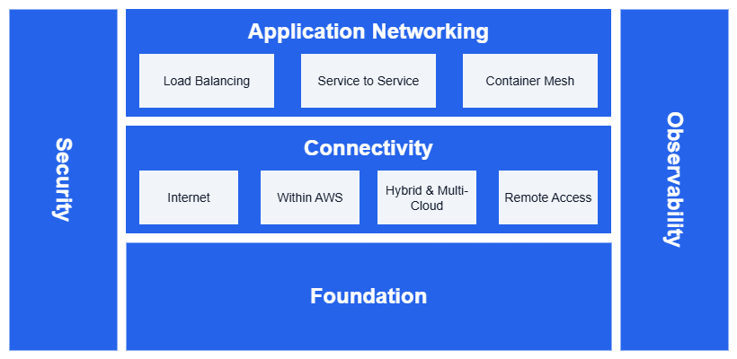

# 소개 {#introduction}

AWS 네트워킹 모범 사례를 위한 참조 아키텍처입니다.

엔터프라이즈 AWS 네트워크는 서로 연결된 다섯 가지 핵심 요소로 구성됩니다.

* **기반(Foundation)** - AWS Organizations, Amazon VPC, 서브넷, Amazon VPC IP Address Manager를 활용하여 구축하는 핵심 인프라로, 모든 요소의 토대가 됩니다.
* **연결(Connectivity)** - 인터넷 게이트웨이, AWS Transit Gateway, AWS Direct Connect, VPN 서비스를 통한 통신
* **애플리케이션 네트워킹(Application Networking)** - Elastic Load Balancing을 통한 트래픽 분산, Amazon VPC Lattice를 통한 서비스 간 통신, 컨테이너 네트워킹
* **보안(Security)** - AWS Network Firewall, AWS PrivateLink, Amazon Route 53 Resolver DNS Firewall을 통한 보호 및 네트워크 격리
* **관측성(Observability)** - 모든 서비스에 걸친 모니터링 및 문제 해결 기능

/// caption
AWS 네트워크 참조 아키텍처
///

## 시작하기 {#getting-started}

달성하려는 목표가 명확하다면 **[의사결정 맵](decisions.md)**에서 시작하세요. 일반적인 AWS 네트워킹 질문을 권장 서비스, 패턴, 트레이드오프에 직접 연결해 줍니다.

또는 기반(Foundation)부터 시작하여 기본 개념을 이해한 후, 특정 네트워킹 요구 사항에 맞게 각 핵심 요소를 탐색하세요.

*   :material-network: **기반(Foundation)**

    ---

    VPC, 서브넷, 라우팅, 핵심 인프라 구성 요소를 포함한 AWS 네트워킹의
    필수 개념을 다룹니다.

    ---

    [:octicons-arrow-right-24: 기반](foundation/)

*   :material-lan-connect: **연결(Connectivity)**

    ---

    인터넷 액세스, AWS 내부 연결, 하이브리드 및 멀티 클라우드
    네트워킹 솔루션을 다룹니다.

    ---

    [:octicons-arrow-right-24: 연결](connectivity/)

*   :material-application: **애플리케이션 네트워킹(Application Networking)**

    ---

    현대적인 애플리케이션을 위한 로드 밸런싱, 서비스 간 통신,
    컨테이너 메시 네트워킹을 다룹니다.

    ---

    [:octicons-arrow-right-24: 애플리케이션 네트워킹](application-networking/)

*   :material-lock-outline: **보안(Security)**

    ---

    심층 방어 전략, 액세스 제어, 위협 방지를 통해
    AWS 네트워크를 보호합니다.

    ---

    [:octicons-arrow-right-24: 보안](security/)

*   :material-monitor-eye: **관측성(Observability)**

    ---

    네트워크 성능을 모니터링하고, 연결 문제를 해결하며,
    AWS 네트워크에 대한 가시성을 확보합니다.

    ---

    [:octicons-arrow-right-24: 관측성](observability/)

## 기여하기 {#contribute}

[이슈 보고](community/report-a-correction.md), [새로운 모범 사례 제안](community/new-best-practice.md), [콘텐츠 기여](community/making-a-pull-request.md)를 통해 모두를 위해 이 가이드를 개선하는 데 도움을 주세요. 포괄적인 AWS 네트워킹 리소스를 만들기 위한 커뮤니티 주도 활동에 함께해 주세요.
