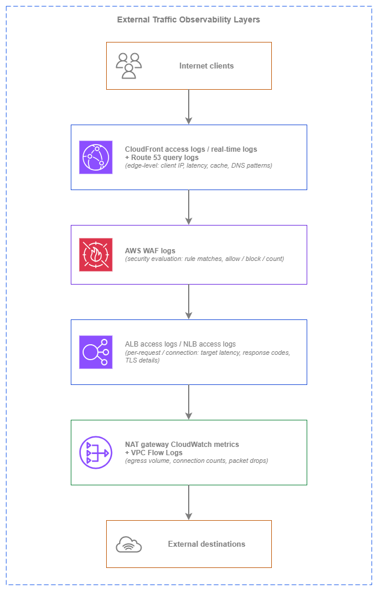

# 외부 트래픽 모니터링 {#external-traffic-monitoring}

!!! info "사전 요구 사항"
    이 섹션은 [인터넷 연결](../connectivity/internet.md), [로드 밸런싱](../application-networking/load-balancing.md), [아웃바운드 제어](../security/outbound.md)에 대한 이해를 전제로 합니다. AWS 네트워킹 기초가 처음이라면 해당 항목을 먼저 검토하세요.

외부 트래픽 모니터링은 AWS 환경과 공용 인터넷 사이의 경계를 통과하는 모든 흐름에 대한 가시성을 다룹니다. 여기에는 애플리케이션에 접근하는 클라이언트로부터의 인그레스(ingress)와 외부 서비스에 접근하는 워크로드로부터의 이그레스(egress)가 모두 포함됩니다. 이는 내부 모니터링으로는 답할 수 없는 질문들에 답해주는 관측성(observability) 계층입니다. 실제 클라이언트가 애플리케이션을 어떻게 경험하고 있는지, 엣지에서의 실제 지연 시간은 얼마인지, 워크로드가 어떤 외부 대상을 호출하고 있는지, 이그레스 비용은 어디서 발생하고 있는지 등을 파악할 수 있습니다.

문제는 데이터 소스의 부족이 아닙니다. AWS는 CDN 엣지부터 NAT 게이트웨이까지 모든 계층에서 로깅을 제공합니다. 진짜 과제는 어떤 데이터 소스가 어떤 질문에 답하는지, 실시간 분석이 배치 처리 대비 비용을 정당화하는 시점은 언제인지, 그리고 단일 외부 흐름의 전체 그림을 구성하기 위해 계층 간 신호를 어떻게 상관 분석할지를 아는 것입니다. 이 페이지는 엣지에서 내부 방향으로 관측성 계층별로 구성되어 있으며, 필요한 로그와 지표의 조합을 결정하는 아키텍처 의사결정을 다룹니다.

핵심 원칙은 **계층화된 외부 관측성**입니다. 각 계층은 상위 및 하위 계층이 볼 수 없는 정보를 캡처하며, 이들의 조합을 통해 중복 수집 없이 전체 경로에 대한 가시성을 확보할 수 있습니다.

/// caption
외부 트래픽 관측성 계층 — [Drawio 소스](../assets/observability/external-traffic-layers.drawio)
///

각 계층은 서로 다른 정보를 캡처합니다. CloudFront 로그는 클라이언트가 엣지에서 경험한 내용(캐시 히트 또는 미스, 엣지 지연 시간, 프로토콜 버전)을 보여줍니다. AWS WAF 로그는 어떤 요청이 평가되었고 어떤 보안 결정이 내려졌는지를 보여줍니다. ALB/NLB 로그는 로드 밸런서와 대상 간에 발생한 일(대상 응답 시간, 백엔드 오류)을 보여줍니다. NAT 게이트웨이 지표와 VPC Flow Logs는 워크로드가 아웃바운드로 전송한 내용과 그 비용을 보여줍니다. 단일 계층만으로는 전체 그림을 파악할 수 없으며, 이들의 조합이 완전한 가시성을 제공합니다.

## 주요 기능 {#key-capabilities}

*   :material-cloud-download: **CloudFront 액세스 로그 및 실시간 로그**

    ---

    모든 클라이언트 요청에 대한 엣지 수준의 가시성: 지연 시간, 캐시 상태(히트/미스/오류), 클라이언트 IP(IPv4 및 IPv6), HTTP 프로토콜 버전, TLS 버전, 지리적 분포. 실시간 로그는 라이브 대시보드를 위해 몇 초 내에 Kinesis Data Streams로 전달됩니다.

*   :material-scale-balance: **ALB 및 NLB 액세스 로그**

    ---

    클라이언트 IP, 요청 세부 정보, 응답 코드, 대상 처리 시간, TLS 핸드셰이크 메타데이터를 포함한 요청별(ALB) 또는 연결별(NLB) 로그. 로드 밸런서와 대상 간에 발생하는 상황을 파악하기 위한 기본 인그레스 관찰 도구입니다.

*   :material-shield-alert: **AWS WAF 로그**

    ---

    어떤 규칙이 일치했는지, 취해진 조치(허용, 차단, 카운트, CAPTCHA), 일치를 트리거한 요청 속성을 보여주는 요청별 평가 결과. 사각지대 없이 보안 조사를 수행하고 AWS WAF 규칙을 튜닝하는 데 필수적입니다.

*   :material-upload-network: **NAT 게이트웨이 CloudWatch 지표**

    ---

    처리된 바이트, 삭제된 패킷, 활성 연결, 연결 시도 횟수, 오류 횟수. 이그레스 비용 가시성 확보 및 예상치 못한 아웃바운드 트래픽을 생성하는 워크로드를 탐지하기 위한 기본 도구입니다.

*   :material-earth: **AWS Global Accelerator 플로우 로그**

    ---

    애니캐스트 진입점을 사용하는 L4 워크로드의 클라이언트-액셀러레이터 트래픽 가시성. 액셀러레이터를 통과하는 모든 플로우의 소스/대상 IP, 포트, 프로토콜, 바이트, 패킷을 캡처합니다.

*   :material-dns: **Route 53 쿼리 로그**

    ---

    퍼블릭 호스팅 영역에 대한 DNS 쿼리 패턴: 어떤 도메인이 쿼리되는지, 어떤 리졸버 IP에서 쿼리되는지, 쿼리 볼륨은 얼마인지. 정찰 탐지, DNS 수준의 트래픽 분산 측정, 장애 조치 동작 검증에 유용합니다.

## 모범 사례 {#best-practices}

### 인그레스 관측성 {#ingress-observability}

#### ALB 액세스 로그를 항상 활성화하세요 — 이것이 기본 인그레스 데이터 소스입니다 {#always-enable-alb-access-logs-they-are-your-primary-ingress-data-source}

ALB 액세스 로그는 로드 밸런서에 도달하는 모든 요청을 캡처합니다. 클라이언트 IP(IPv4 또는 IPv6), 요청 URL, 응답 코드, 요청 처리 시간, 대상 처리 시간, 그리고 요청을 처리한 대상이 기록됩니다. ALB는 액세스 로그에 대해 별도 요금을 부과하지 않으며, S3 스토리지 비용만 지불하면 됩니다. 운영상의 가치에 비하면 비용은 무시할 수 있는 수준입니다.

ALB 액세스 로그는 CloudWatch 지표로는 알 수 없는 질문에 답해 줍니다. 어떤 특정 클라이언트가 오류를 겪고 있는지, 어떤 대상이 느린지, 요청 수준에서의 지연 시간 분포가 어떤지(단순 평균이 아닌), 5xx 급증이 하나의 대상에서 발생하는지 아니면 전체에서 발생하는지를 파악할 수 있습니다. 액세스 로그 없이는 집계된 지표만으로 프로덕션 장애를 디버깅해야 합니다.

모든 ALB에 생성 시점부터 액세스 로그를 활성화하세요. 계정 간 전송을 사용하여 중앙 집중식 로깅 계정의 S3 버킷으로 전달하세요(ALB가 버킷에 직접 쓰며, 해당 리전의 ELB 서비스 주체를 허용하도록 버킷 정책을 구성합니다). Amazon Athena로 효율적으로 쿼리할 수 있도록 계정, 리전, 날짜별로 로그를 파티셔닝하세요.

***핵심 인사이트:*** *ALB 액세스 로그는 생성 비용이 무료이고, 스토리지 비용은 극히 적으며, 장애 조사 시 대체 불가능한 자산입니다. 프로덕션 ALB에서 이를 비활성화할 타당한 이유는 없습니다.*

#### TLS 및 연결 수준 가시성을 위해 NLB 액세스 로그를 활성화하세요 {#enable-nlb-access-logs-for-tls-and-connection-level-visibility}

NLB 액세스 로그는 ALB 로그에서 제공하지 않는 연결 수준의 세부 정보를 캡처합니다. TLS 핸드셰이크 지연 시간, 협상된 TLS 암호, 클라이언트 인증서 세부 정보(상호 TLS의 경우), 연결 지속 시간, 연결당 전송된 바이트 수가 포함됩니다. 개별 요청이 아닌 연결 패턴을 파악해야 하는 L4 워크로드의 경우, NLB 로그가 기본 데이터 소스입니다.

NLB 액세스 로그는 기본적으로 비활성화되어 있으므로 명시적으로 활성화해야 합니다. ALB 로그와 마찬가지로 S3로 전달되며 NLB 추가 요금은 없습니다. 클라이언트 연결 동작과 TLS 협상 실패에 대한 가시성을 유지하기 위해, 모든 인터넷 연결 NLB에서, 특히 TLS를 종료하는 NLB에서 활성화하세요.

#### 실시간 운영 가시성을 위해 CloudFront 실시간 로그를 사용하세요 {#use-cloudfront-real-time-logs-for-live-operational-visibility}

CloudFront는 두 가지 로깅 모드를 제공합니다. 표준 로그(일반적으로 몇 분 내에 S3에 배치 전달)와 실시간 로그(몇 초 내에 Kinesis Data Streams로 전달)입니다. 표준 로그는 사후 분석 및 추세 보고에 충분합니다. 실시간 로그는 라이브 대시보드, 오류율에 대한 1분 미만의 알림, 또는 배포 중 캐시 동작 변경에 대한 즉각적인 가시성이 필요할 때 사용이 정당화됩니다.

비용 차이는 상당합니다. 표준 로그는 무료(S3 스토리지 비용만 지불)인 반면, 실시간 로그는 레코드 수와 샤드 수에 따라 Kinesis Data Streams 요금이 발생합니다. 시간당 수백만 건의 요청을 처리하는 트래픽이 많은 배포의 경우, 실시간 로그 비용이 월 수백 달러에 달할 수 있습니다.

| 로그 유형 | 전달 지연 시간 | 비용 | 사용 사례 |
| --- | --- | --- | --- |
| **표준 로그** | 분 단위(S3에 배치 전달) | 무료(S3 스토리지만 해당) | 사후 분석, 추세 보고, 컴플라이언스 아카이브 |
| **실시간 로그** | 초 단위(Kinesis Data Streams) | Kinesis 샤드-시간 + 레코드당 요금 | 라이브 대시보드, 1분 미만 알림, 배포 모니터링 |

초 단위 가시성의 운영 가치가 Kinesis 비용을 정당화할 때 실시간 로그를 선택하세요. 일반적으로 캐시 잘못된 구성이나 오리진 장애를 1분 이내에 감지해야 하는 트래픽이 많고 매출에 중요한 배포에 해당합니다.

#### 전체 경로 지연 시간 분석을 위해 CloudFront 로그와 ALB 로그를 상관 분석하세요 {#correlate-cloudfront-logs-with-alb-logs-for-full-path-latency-analysis}

CloudFront → ALB → 대상을 통과하는 단일 클라이언트 요청은 두 계층 모두에서 로그 항목을 생성합니다. CloudFront 로그는 클라이언트가 기다린 총 시간(엣지 처리, 오리진 페치, 네트워크 전송 포함)을 캡처합니다. ALB 로그는 대상이 응답하는 데 걸린 시간을 캡처합니다. CloudFront의 총 시간과 ALB의 대상 처리 시간의 차이가 네트워크 및 엣지 오버헤드입니다.

`x-amz-cf-id` 요청 ID(CloudFront 로그와 오리진으로 전달되는 `X-Amz-Cf-Id` 헤더 모두에 존재)를 사용하여 계층 간 항목을 상관 분석하세요. 이 상관 분석을 통해 지연 시간 문제가 엣지(CloudFront 처리, TLS 협상), 전송 중(엣지와 오리진 간 네트워크 경로), 또는 대상(애플리케이션 처리 시간) 중 어디에 있는지 파악할 수 있습니다.

#### 완전한 클라이언트 가시성을 위해 IPv6 클라이언트 주소를 로깅하세요 {#log-ipv6-client-addresses-for-complete-client-visibility}

ALB와 CloudFront 모두 클라이언트가 IPv6으로 연결할 때 실제 클라이언트 IPv6 주소를 로깅합니다. 이는 변환되거나 프록시된 주소가 아닌 실제 클라이언트 IP입니다. 듀얼 스택 배포의 경우, 로그 분석 시 클라이언트 IP 필드에서 IPv4와 IPv6 주소를 모두 처리해야 합니다.

NLB 액세스 로그도 마찬가지로 듀얼 스택 또는 IPv6 전용 리스너에 대한 IPv6 클라이언트 주소를 캡처합니다. 로그 파싱, IP 기반 분석, 보안 조사 도구가 IPv6 주소 형식을 지원하는지 확인하세요. 지리적 IP 데이터베이스와 위협 인텔리전스 피드는 IPv4 클라이언트와 동일한 분석 능력을 유지하기 위해 IPv6 범위를 포함해야 합니다.

***핵심 인사이트:*** *IPv6 클라이언트 도입이 증가함에 따라, IPv4 주소만 처리하는 로그 분석 파이프라인은 사각지대를 만듭니다. SIEM, 대시보드, 알림 규칙에서 IPv6 지원을 검증하세요.*

### 보안 관측성 {#security-observability}

#### 모든 웹 ACL에 대해 AWS WAF 로깅을 활성화하세요 — 장애 발생 시에만이 아니라 항상 {#enable-aws-waf-logging-for-every-web-acl-not-just-during-incidents}

AWS WAF 로그는 모든 요청에 대한 전체 평가 결과를 캡처합니다. 어떤 규칙이 평가되었는지, 어떤 규칙이 일치했는지, 어떤 조치가 취해졌는지, 그리고 일치를 트리거한 요청 속성(헤더, URI, 쿼리 문자열)이 포함됩니다. 이 데이터는 세 가지 목적에 필수적입니다. 오탐을 줄이기 위한 규칙 튜닝, 사후 공격 패턴 조사, 그리고 Count에서 Block으로 전환하기 전에 새 규칙이 예상대로 동작하는지 검증하는 것입니다.

AWS WAF 로그는 S3, CloudWatch Logs, 또는 Kinesis Data Firehose로 전달할 수 있습니다. 대부분의 환경에서는 비용 효율적인 장기 스토리지와 Athena 기반 분석을 위해 중앙 집중식 로깅 계정의 S3로 전달하세요. 특정 규칙 일치에 대한 실시간 지표 필터와 알람이 필요한 경우에만 CloudWatch Logs를 사용하세요(GB당 수집 비용이 S3보다 훨씬 높습니다).

#### Shield Advanced가 트리거되기 전에 DDoS 패턴을 감지하세요 {#detect-ddos-patterns-before-shield-advanced-triggers}

CloudFront와 ALB 액세스 로그에는 DDoS 이벤트에 앞서 나타나는 원시 신호가 포함되어 있습니다. 집중된 IP 범위에서의 갑작스러운 요청 속도 급증, 비정상적인 지리적 분포 변화, 또는 비정상적인 요청 패턴(동일한 User-Agent 문자열, 반복되는 경로)이 그것입니다. 이러한 패턴을 거의 실시간으로 모니터링하면 Shield Advanced의 자동 완화가 활성화되는 임계값에 도달하기 전에 애플리케이션 계층 공격을 감지할 수 있습니다.

짧은 평가 기간(1분 간격)으로 ALB 요청 수와 4xx/5xx 비율에 대한 CloudWatch 알람을 구축하세요. CloudFront의 경우, 클라이언트 IP 접두사별 요청 속도를 추적하고 비정상적인 집중에 대해 알림을 트리거하는 Kinesis 컨슈머와 함께 실시간 로그를 사용하세요. 이러한 조기 경보 신호는 공격이 완전히 전개되기 전에 운영 팀이 AWS WAF 속도 제한을 강화하거나 AWS Shield 대응 팀에 지원을 요청할 시간을 제공합니다.

#### 정찰 감지 및 장애 조치 검증을 위해 Route 53 쿼리 로그를 사용하세요 {#use-route-53-query-logs-to-detect-reconnaissance-and-validate-failover}

퍼블릭 호스팅 영역에 대한 Route 53 쿼리 로그는 모든 DNS 쿼리를 캡처합니다. 쿼리된 도메인, 쿼리 유형, 리졸버 IP, 응답 코드가 포함됩니다. 이 데이터는 정찰 패턴(서브도메인의 체계적인 열거)을 드러내고, 장애 발생 시 DNS 장애 조치가 예상대로 작동하는지 검증하며, 이상 감지를 위한 기준 쿼리 볼륨을 제공합니다.

쿼리 로그는 us-east-1 리전의 CloudWatch Logs로 전달됩니다(호스팅 영역이 어디서 쿼리되는지와 무관하게). 멀티 계정 환경에서는 모든 퍼블릭 호스팅 영역에 쿼리 로깅을 구성하고, 계정 간 로그 구독을 사용하여 CloudWatch Logs를 중앙 집중식 로깅 계정으로 전달하세요.

### 이그레스 관측성 {#egress-observability}

#### 이그레스 비용 가시성을 위해 NAT 게이트웨이 지표를 모니터링하세요 {#monitor-nat-gateway-metrics-for-egress-cost-visibility}

NAT 게이트웨이 CloudWatch 지표는 이그레스 비용을 이해하고 제어하기 위한 기본 도구입니다. 주요 지표:

| 지표 | 드러내는 정보 | 알림 임계값 가이드 |
| --- | --- | --- |
| `BytesOutToDestination` | 외부 대상으로 전송된 총 바이트(이그레스 요금) | 기준선 + 백분율 편차 |
| `BytesOutToSource` | 워크로드로 반환된 총 바이트(응답 트래픽) | BytesOut 대비 비정상적인 비율은 데이터 다운로드 패턴을 시사 |
| `ConnectionAttemptCount` | 기간당 시작된 새 연결 수 | 급증은 새로운 워크로드 동작 또는 침해를 나타냄 |
| `ActiveConnectionCount` | 동시 활성 연결 수 | AZ당 55,000 한도에 근접하면 스케일링 필요 신호 |
| `PacketsDropCount` | NAT 게이트웨이 한도로 인해 드롭된 패킷 | 0이 아닌 값은 조사 필요 |
| `ErrorPortAllocation` | 포트 할당 실패(소스 포트 고갈) | 0이 아닌 값 — 워크로드가 연결 한도 초과 |
| `IdleTimeoutCount` | 유휴 타임아웃으로 닫힌 연결 | 높은 값은 연결 풀링 문제를 시사 |

`PacketsDropCount`와 `ErrorPortAllocation`에 임계값 1로 CloudWatch 알람을 설정하세요 — 발생 시 트래픽이 소리 없이(경고 없이) 드롭되고 있음을 의미합니다. 월별 청구서가 도착하기 전에 예상치 못한 이그레스 비용 증가를 포착하기 위해 `BytesOutToDestination`에 기준선 대비 백분율 임계값으로 알람을 설정하세요.

#### 예상치 못한 이그레스 대상을 식별하기 위해 VPC Flow Logs를 사용하세요 {#use-vpc-flow-logs-to-identify-unexpected-egress-destinations}

VPC Flow Logs는 이그레스 트래픽을 포함하여 모든 플로우의 소스 및 대상 IP를 캡처합니다. 예상치 못한 이그레스 볼륨을 보여주는 NAT 게이트웨이 지표와 결합하면, Flow Logs는 중요한 후속 질문에 답해 줍니다. *그 트래픽은 어디로 가고 있는가?*

NAT 게이트웨이의 ENI 또는 해당 게이트웨이를 통해 라우팅되는 서브넷에 Flow Logs를 구성하세요. `dstaddr` 필드를 사용하여 외부 대상 IP를 식별하고, DNS 쿼리 로그와 상관 분석하여 IP를 도메인 이름으로 매핑하세요. 이 조합을 통해 어떤 워크로드가 어떤 외부 서비스를 호출하고 얼마나 많은 데이터를 전송하는지 파악할 수 있으며, 비용 귀속과 보안 조사 모두에 필수적입니다.

#### L4 인그레스 패턴을 위해 Global Accelerator 플로우 로그를 추적하세요 {#track-global-accelerator-flow-logs-for-l4-ingress-patterns}

AWS Global Accelerator 플로우 로그는 L7에 대해 ALB 액세스 로그가 제공하는 것과 동일한 가시성을 L4 트래픽에 제공합니다. 액셀러레이터를 통한 모든 플로우에 대한 소스 및 대상 IP, 포트, 프로토콜, 바이트, 패킷이 포함됩니다. 프로덕션 트래픽을 처리하는 모든 Global Accelerator 액셀러레이터에서 플로우 로그를 활성화하세요.

플로우 로그는 S3로 전달되며 VPC Flow Logs와 동일한 형식을 따르므로 기존 로그 분석 파이프라인과 호환됩니다. 클라이언트 지리적 분포를 이해하고, 연결 이상을 감지하며, 엔드포인트 그룹별 트래픽 볼륨을 측정하는 데 활용하세요.

### 멀티 계정 로깅 아키텍처 {#multi-account-logging-architecture}

#### 모든 외부 트래픽 로그를 전용 로깅 계정에 중앙 집중화하세요 {#centralize-all-external-traffic-logs-in-a-dedicated-logging-account}

멀티 계정 환경에서는 모든 계정의 외부 트래픽 로그가 상관 분석, 장기 보존, 계정 간 조사를 위해 중앙 집중식 로깅 계정으로 흘러야 합니다. 로깅 계정은 애플리케이션 팀이 수정할 수 없는 제한된 액세스 계정으로, 로그 무결성과 보존 컴플라이언스를 보장합니다.

각 로그 유형에 대해 계정 간 전달을 구성하세요:

| 로그 소스 | 계정 간 전달 메커니즘 |
| --- | --- |
| **ALB/NLB 액세스 로그** | 각 리전의 ELB 서비스 주체를 허용하는 S3 버킷 정책 |
| **CloudFront 표준 로그** | CloudFront 서비스 주체를 허용하는 S3 버킷 정책 |
| **CloudFront 실시간 로그** | 로깅 계정의 Kinesis Data Streams(또는 계정 간 IAM을 사용하는 동일 계정) |
| **AWS WAF 로그** | 로깅 계정의 S3로 Kinesis Data Firehose 전달, 또는 직접 S3 전달 |
| **VPC Flow Logs** | 리소스 정책을 사용하여 S3 또는 CloudWatch Logs로 계정 간 전달 |
| **Route 53 쿼리 로그** | 중앙 집중식 대상으로 CloudWatch Logs 계정 간 구독 필터 |
| **Global Accelerator 플로우 로그** | Global Accelerator 서비스 주체를 허용하는 S3 버킷 정책 |

#### 효율적인 쿼리를 위해 로그를 파티셔닝하세요 {#partition-logs-for-efficient-querying}

대규모 외부 트래픽 로그는 하루에 테라바이트를 생성합니다. 적절한 파티셔닝 없이는 Athena 쿼리가 전체 데이터셋을 스캔하고 비용이 보존 기간에 비례하여 증가합니다. 모든 로그 버킷을 다음 기준으로 파티셔닝하세요:

* **계정 ID** — 계정별 비용 귀속 및 범위가 지정된 조사 가능
* **리전** — 대부분의 쿼리의 지리적 범위와 일치
* **연/월/일/시** — 관련 파티션만 스캔하는 시간 범위 쿼리 가능

ALB와 CloudFront 로그는 이미 날짜 기반 접두사로 전달됩니다. 버킷 구조에서 계정 ID를 최상위 접두사로 추가하세요. 새 데이터가 도착할 때 수동 파티션 관리를 피하기 위해 Athena 파티션 프로젝션을 사용하세요.

***핵심 인사이트:*** *외부 트래픽 로그를 저장하는 비용은 비효율적으로 쿼리하는 비용에 비하면 미미합니다. 파티셔닝과 프로젝션에 미리 투자하세요 — 이것이 로그가 실질적으로 쿼리 가능한지 아니면 단순한 아카이브에 불과한지를 결정합니다.*

### 비용 관리 {#cost-management}

#### 각 데이터 소스의 비용 프로파일을 이해하세요 {#understand-the-cost-profile-of-each-data-source}

외부 트래픽 모니터링 비용은 활성화하는 데이터 소스와 소비 방식에 따라 몇 자릿수 차이가 날 수 있습니다:

| 데이터 소스 | 생성 비용 | 스토리지/전달 비용 | 분석 비용 |
| --- | --- | --- | --- |
| **ALB 액세스 로그** | 무료 | S3 스토리지만 해당(GB/월) | Athena 쿼리당 스캔 |
| **NLB 액세스 로그** | 무료 | S3 스토리지만 해당 | Athena 쿼리당 스캔 |
| **CloudFront 표준 로그** | 무료 | S3 스토리지만 해당 | Athena 쿼리당 스캔 |
| **CloudFront 실시간 로그** | 무료 | Kinesis Data Streams 샤드-시간 + 레코드당 | 컨슈머 컴퓨팅(Lambda, KDA) |
| **AWS WAF 로그(S3)** | 무료 | S3 스토리지만 해당 | Athena 쿼리당 스캔 |
| **AWS WAF 로그(CloudWatch)** | 무료 | CloudWatch Logs GB당 수집 + 스토리지 | CloudWatch Insights 쿼리 |
| **NAT 게이트웨이 지표** | 무료(포함) | 해당 없음(CloudWatch 기본 보존) | CloudWatch 대시보드/알람 비용 |
| **VPC Flow Logs(S3)** | GB당 계층형 수집([요금](https://aws.amazon.com/cloudwatch/pricing/)) | S3 스토리지 | Athena 쿼리당 스캔 |
| **Route 53 쿼리 로그** | 무료 | CloudWatch Logs 수집 + 스토리지 | CloudWatch Insights 쿼리 |

가장 비용이 높은 항목은 대용량의 VPC Flow Logs(생성 요금)와 CloudFront 실시간 로그(Kinesis 요금)입니다. VPC Flow Logs의 경우, 필요한 필드만 캡처하는 사용자 지정 형식을 사용하고, 전체 캡처가 필요하지 않을 때는 거부된 트래픽 또는 특정 ENI로/에서의 트래픽만 캡처하도록 필터링하세요.

#### 기본값으로 배치 분석을 사용하고, 실시간은 정당화될 때만 사용하세요 {#use-batch-analysis-as-the-default-real-time-only-where-justified}

실시간 로그 분석(CloudFront 실시간 로그 → Kinesis → Lambda/KDA, 또는 AWS WAF 로그 → CloudWatch Logs → 지표 필터)은 배치 분석(로그 → S3 → 온디맨드 Athena)보다 비용이 훨씬 높습니다. 다음의 경우 배치 분석을 기본으로 사용하세요:

* 사후 장애 조사
* 주간/월간 추세 보고
* 비용 귀속 및 차지백
* 컴플라이언스 및 감사 쿼리

다음의 경우에만 실시간 분석을 사용하세요:

* 배포 중 라이브 운영 대시보드
* 오류율 급증에 대한 1분 미만 알림
* 초 단위가 중요한 활성 장애 대응
* DDoS 감지 및 자동화된 대응 트리거

## 각 데이터 소스의 사용 시점 {#when-to-use-each-data-source}

각 데이터 소스는 서로 다른 질문에 답합니다. 적절한 조합은 무엇을 알아야 하는지, 그리고 얼마나 빨리 알아야 하는지에 따라 달라집니다.

**CloudFront 액세스 로그**는 다음과 같은 경우에 적합합니다:

* 클라이언트 경험 지표(지연 시간, 캐시 적중률, 엣지에서의 오류율)가 필요한 경우
* 클라이언트 트래픽의 지리적 분포를 파악하려는 경우
* 캐시 동작을 이해하고 캐시 정책을 최적화해야 하는 경우
* 엣지 수준의 문제(TLS 협상 실패, HTTP 프로토콜 오류)를 조사하는 경우

**ALB 액세스 로그**는 다음과 같은 경우에 적합합니다:

* 대상 동작에 대한 요청별 가시성(어떤 대상이 어떤 요청을 처리했는지, 소요 시간)이 필요한 경우
* 5xx 오류를 디버깅하면서 로드 밸런서 오류와 대상 오류를 구분해야 하는 경우
* 보안 조사를 위해 클라이언트 IP와 특정 요청을 연관 지어야 하는 경우
* 요청 수준에서 지연 시간 백분위수 분석이 필요한 경우

**NLB 액세스 로그**는 다음과 같은 경우에 적합합니다:

* L4 워크로드에 대한 연결 수준의 가시성(연결 지속 시간, 연결당 바이트 수)이 필요한 경우
* TLS 핸드셰이크 실패 또는 암호화 협상 문제를 디버깅하는 경우
* 용량 계획을 위해 연결 패턴을 파악해야 하는 경우

**AWS WAF 로그**는 다음과 같은 경우에 적합합니다:

* 차단된 요청이 정상적인 요청인지(오탐) 여부를 조사하는 경우
* 실제 매칭 데이터를 기반으로 AWS WAF 규칙을 튜닝해야 하는 경우
* 시간대별 공격 패턴을 상관 분석하여 지속적인 위협을 식별하는 경우
* 각 요청에 대한 보안 결정의 감사 증거가 필요한 경우

**NAT 게이트웨이 지표**는 다음과 같은 경우에 적합합니다:

* 이그레스 비용 가시성 및 추세 파악이 필요한 경우
* 예상치 못한 아웃바운드 트래픽 볼륨을 감지하는 경우
* 연결 한도 및 포트 고갈을 모니터링해야 하는 경우
* 이그레스 비용에 영향을 미치는 워크로드 동작 변화를 조기에 감지하려는 경우

**Route 53 쿼리 로그**는 다음과 같은 경우에 적합합니다:

* 인시던트 발생 시 DNS 장애 조치 동작을 검증해야 하는 경우
* 서브도메인 열거 또는 정찰 활동을 탐지하는 경우
* 이상 탐지를 위한 기준 쿼리 볼륨을 설정하려는 경우
* 엔드포인트 전반에 걸친 DNS 수준의 트래픽 분산을 파악해야 하는 경우

**Global Accelerator 플로우 로그**는 다음과 같은 경우에 적합합니다:

* L4 워크로드에 대한 클라이언트-액셀러레이터 간 트래픽 가시성이 필요한 경우
* 액셀러레이터 엔드포인트 배치를 위해 클라이언트의 지리적 분포를 분석하는 경우
* 액셀러레이터 엔드포인트의 용량 계획을 위한 플로우 수준 데이터가 필요한 경우

## 외부 트래픽 모니터링과 다른 서비스의 결합 {#combining-external-traffic-monitoring-with-other-services}

| 조합 | 외부 트래픽 모니터링이 제공하는 것 | 다른 서비스가 제공하는 것 |
| --- | --- | --- |
| **ALB 액세스 로그 + Amazon Athena** | S3에 저장된 요청별 로그 데이터 | 비용 효율적인 분석을 위한 파티션 프루닝 기반 SQL 애드혹 쿼리 |
| **CloudFront 실시간 로그 + Kinesis Data Streams + Lambda** | 실시간 요청별 엣지 데이터 | 라이브 대시보드, 이상 탐지 및 자동화된 대응을 위한 스트림 처리 |
| **AWS WAF 로그 + Amazon OpenSearch Service** | 요청별 보안 평가 데이터 | 보안 조사를 위한 전문 검색, 시각화 및 상관 분석 |
| **NAT 게이트웨이 지표 + CloudWatch Alarms + SNS** | 이그레스 볼륨 및 연결 지표 | 임계값 기반 알림 및 운영 팀으로의 알림 라우팅 |
| **VPC Flow Logs + Amazon Athena** | 이그레스 목적지를 포함한 플로우별 네트워크 데이터 | 목적지 분석, 비용 귀속 및 보안 조사 쿼리 |
| **Route 53 쿼리 로그 + CloudWatch Logs Insights** | 퍼블릭 호스팅 영역의 DNS 쿼리 패턴 | 패턴 분석, 이상 탐지 및 장애 조치 검증 쿼리 |
| **ALB 액세스 로그 + AWS Security Hub** | 공격에 대한 요청 수준의 증거 | 중앙화된 보안 결과 집계 및 컴플라이언스 보고 |
| **CloudFront 로그 + Amazon QuickSight** | 클라이언트 경험 및 캐시 성능 데이터 | 이해관계자 보고를 위한 비즈니스 인텔리전스 대시보드 |
| **모든 로그 소스 + AWS Glue + S3** | 모든 계층의 원시 로그 데이터 | 크로스 레이어 상관 분석을 위한 스키마 검색, ETL 및 데이터 레이크 구성 |

## 클라이언트 경험 모니터링 {#client-experience-monitoring}

외부 트래픽 로그는 실제 클라이언트가 애플리케이션을 어떻게 경험하는지 파악할 수 있는 유일한 진실의 원천입니다. 대상(target)에 대한 CloudWatch 지표는 서버 측 상태를 보여주는 반면, 외부 트래픽 로그는 클라이언트 측 실제 상황을 보여줍니다.

### ALB 로그에서 지연 시간 백분위수 분석 {#latency-percentiles-from-alb-logs}

ALB 액세스 로그에는 `target_processing_time`(대상이 응답하는 데 걸린 시간), `request_processing_time`(ALB가 요청을 전달하기 전에 소요한 시간), `response_processing_time`(ALB가 응답을 전송하는 데 소요한 시간)이 포함됩니다. 이 필드를 활용하여 지연 시간 백분위수(p50, p95, p99)를 계산하면, 가장 느린 클라이언트가 경험하는 테일 지연 시간(tail latency)을 파악할 수 있습니다. 이는 평균 기반의 CloudWatch 지표로는 확인하기 어려운 정보입니다.

Athena를 사용하여 ALB 로그를 쿼리하면 대상 그룹별, 대상별, 또는 URL 경로별 백분위수를 계산할 수 있습니다. p99가 p50의 10배에 달한다면, 일부 요청이 느린 경로에 집중되고 있다는 신호입니다. 이는 콜드 캐시, 특정 대상, 또는 특정 요청 패턴이 원인인 경우가 많습니다.

### CloudFront 로그에서 캐시 적중률 분석 {#cache-hit-ratios-from-cloudfront-logs}

CloudFront 로그에는 각 요청이 캐시에서 제공되었는지(Hit), 오리진에서 가져왔는지(Miss), 또는 오류가 발생했는지를 나타내는 `x-edge-result-type` 필드가 포함됩니다. 캐시 적중률은 전체 요청 대비 Hit 또는 RefreshHit으로 처리된 요청의 비율로 계산합니다.

캐시 적중률이 하락하면 오리진 부하와 클라이언트 지연 시간이 직접적으로 증가합니다. 배포 이후(새로운 캐시 동작이나 무효화로 인해 적중률이 급락할 수 있음), TTL 변경 후, 그리고 트래픽 패턴이 변화하는 시점에 이 지표를 모니터링하세요. 콘솔의 CloudFront 내장 캐시 통계는 집계된 뷰를 제공하며, 로그 기반 분석을 통해 경로별 및 지역별 세부 분석이 가능합니다.

### IPv6 클라이언트 도입 현황 추적 {#ipv6-client-adoption-tracking}

CloudFront와 ALB 로그 모두 클라이언트의 IP 버전을 기록합니다. IPv6 대 IPv4로 유입되는 요청 비율을 추적하여 시간 경과에 따른 IPv6 클라이언트 도입 현황을 측정하세요. 이 데이터는 IPv6 전용 인프라 도입 결정에 활용할 수 있습니다. IPv6 클라이언트가 일정 임계값에 도달하면, IPv4 인프라는 기본 경로가 아닌 레거시 경로로 전환됩니다.

## 문서 {#documentation}

*   :material-file-document: **CloudFront 액세스 로그**

    ---

    로그 필드, 전송 구성, S3/Kinesis 설정을 포함한 CloudFront 배포의 표준 및 실시간 로깅.

    [:octicons-arrow-right-24: CloudFront 로깅 문서](https://docs.aws.amazon.com/AmazonCloudFront/latest/DeveloperGuide/AccessLogs.html)

*   :material-file-document: **ALB 액세스 로그**

    ---

    로그 형식, S3 전송, 계정 간 구성을 포함한 Application Load Balancer의 요청별 로깅.

    [:octicons-arrow-right-24: ALB 액세스 로그 문서](https://docs.aws.amazon.com/elasticloadbalancing/latest/application/load-balancer-access-logs.html)

*   :material-file-document: **NLB 액세스 로그**

    ---

    TLS 메타데이터 및 연결 타이밍 필드를 포함한 Network Load Balancer의 연결 수준 로깅.

    [:octicons-arrow-right-24: NLB 액세스 로그 문서](https://docs.aws.amazon.com/elasticloadbalancing/latest/network/load-balancer-access-logs.html)

*   :material-file-document: **AWS WAF 로깅**

    ---

    로그 필드 참조 및 필터링을 포함하여 S3, CloudWatch Logs 또는 Kinesis Data Firehose로 전송되는 요청별 AWS WAF 평가 로깅.

    [:octicons-arrow-right-24: AWS WAF 로깅 문서](https://docs.aws.amazon.com/waf/latest/developerguide/logging.html)

*   :material-currency-usd: **CloudWatch 요금**

    ---

    실시간 모니터링 비용을 결정하는 지표, 경보, 로그 수집 및 Logs Insights 쿼리에 대한 요금 정보.

    [:octicons-arrow-right-24: CloudWatch 요금](https://aws.amazon.com/cloudwatch/pricing/)

*   :material-file-document: **NAT 게이트웨이 모니터링**

    ---

    차원, 통계 및 권장 경보를 포함한 NAT 게이트웨이에서 사용 가능한 CloudWatch 지표.

    [:octicons-arrow-right-24: NAT 게이트웨이 CloudWatch 지표](https://docs.aws.amazon.com/vpc/latest/userguide/vpc-nat-gateway-cloudwatch.html)

## 관련 페이지 {#related-pages}

**다른 관측성(Observability) 주제와의 관계:**

* **[내부 트래픽 모니터링](internal-traffic.md)**: AWS 환경 내 이스트-웨스트(east-west) 트래픽 가시성을 다룹니다. 외부 트래픽 모니터링은 인터넷 경계를 넘나드는 노스-사우스(north-south) 흐름을 처리합니다.
* **[AWS 서비스 모니터링](service-monitoring.md)**: AWS 네트워킹 서비스 자체의 상태 및 성능 모니터링을 다룹니다. 외부 트래픽 모니터링은 해당 서비스에서 생성된 데이터를 활용합니다.
* **[알림](notifications.md)**: 경보 및 알림 라우팅을 다룹니다. 외부 트래픽 모니터링은 알림이 동작하는 기반이 되는 신호를 생성합니다.

**연결성(Connectivity)과의 관계:**

* **[인터넷 연결](../connectivity/internet.md)**: 인그레스 및 이그레스 아키텍처(중앙 집중식 vs. 분산형, IPv4 vs. IPv6)를 정의합니다. 외부 트래픽 모니터링은 해당 아키텍처가 프로덕션 환경에서 어떻게 동작하는지에 대한 가시성을 제공합니다.

**애플리케이션 네트워킹과의 관계:**

* **[로드 밸런싱](../application-networking/load-balancing.md)**: ALB와 NLB는 인그레스 트래픽의 데이터 플레인인 동시에, 외부 트래픽 관측성을 구현하는 액세스 로그의 소스입니다.

**보안과의 관계:**

* **[아웃바운드 제어](../security/outbound.md)**: 허용되는 이그레스 트래픽을 정의합니다. 외부 트래픽 모니터링(NAT 게이트웨이 지표, VPC Flow Logs)은 해당 제어가 올바르게 작동하는지 검증하고 정책 공백을 파악하는 데 활용됩니다.
