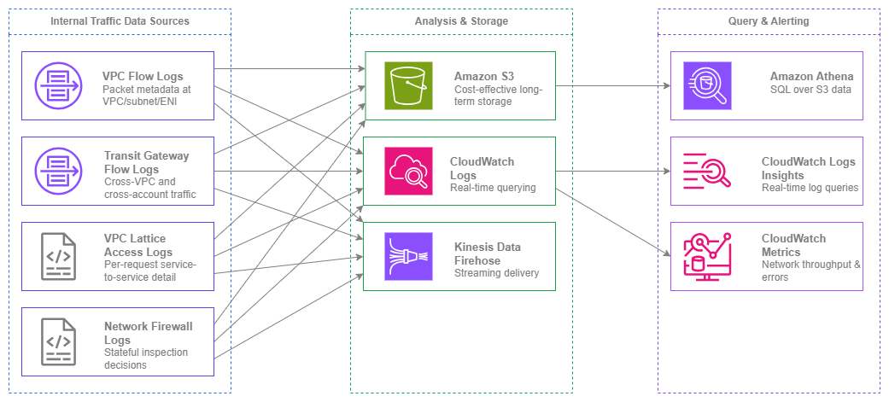

# 내부 트래픽 모니터링 {#internal-traffic-monitoring}

!!! info "사전 요구 사항"
    이 섹션은 [Amazon VPC](../foundation/vpc.md), [서브넷](../foundation/subnets.md), [AWS 내 연결](../connectivity/within-aws.md)에 대한 이해를 전제로 합니다. AWS 네트워킹 기초가 처음이라면 해당 항목을 먼저 검토하세요.

내부 리소스 간에 어떤 트래픽이 흐르는지 파악하는 것은 AWS에서 네트워크 보안, 비용 최적화, 문제 해결의 기반이 됩니다. 보안 그룹과 NACL은 무엇이 *허용*되는지를 정의하지만, 내부 트래픽 모니터링은 실제로 *무슨 일이 일어나고 있는지*를 알려줍니다. 이를 갖추지 않으면 사각지대에서 운영하는 것과 같습니다. 즉, 횡적 이동(lateral movement)을 탐지할 수 없고, 예상치 못한 가용 영역 간 데이터 전송 비용을 식별할 수 없으며, "작동하지 않는다"는 사실 이상으로 연결 장애를 해결할 수 없습니다.

AWS의 내부 트래픽 모니터링은 단일 도구가 아니라 계층적 접근 방식입니다. VPC Flow Logs는 네트워크 계층에서 패킷 수준의 메타데이터를 제공합니다. Transit Gateway Flow Logs는 VPC 간 중앙화된 가시성을 제공합니다. VPC Lattice 액세스 로그는 요청별 애플리케이션 계층 세부 정보를 캡처합니다. Network Firewall 로그는 스테이트풀 검사(stateful inspection) 결정을 기록합니다. 각 데이터 소스는 서로 다른 질문에 답하며, 프로덕션 환경에서는 대부분의 데이터 소스가 함께 작동해야 합니다.

이 페이지는 데이터 소스와 내부 트래픽 가시성을 구축할 때 직면하는 결정들을 중심으로 구성되어 있습니다. 무엇을 활성화할지, 데이터를 어디로 전송할지, 비용 효율적으로 쿼리하는 방법, 그리고 여러 소스 간에 데이터를 상관 분석하는 방법을 다룹니다.


/// caption
내부 트래픽 모니터링 소스 — [Drawio 소스](../assets/observability/internal-traffic-sources.drawio)
///

## 주요 기능 {#key-capabilities}

<div class="grid cards" markdown>

*   :material-lan: **VPC Flow Logs**

    ---

    VPC, 서브넷 또는 ENI 수준에서 IP 트래픽 메타데이터를 캡처합니다. 커스텀 로그 형식은 출발지/목적지, 포트, 프로토콜, TCP 플래그, 트래픽 경로, 흐름 방향 등 40개 이상의 필드를 포함합니다. IPv4 및 IPv6을 모두 지원합니다.

*   :material-transit-connection-variant: **Transit Gateway Flow Logs**

    ---

    Transit Gateway를 통과하는 모든 트래픽(VPC 간, 계정 간, 하이브리드)을 중앙에서 통합 조회합니다. 단일 구성으로 VPC별 별도 설정 없이 조직 전체의 가시성을 확보할 수 있습니다.

*   :material-swap-horizontal: **VPC Lattice 액세스 로그(VPC Lattice Access Logs)**

    ---

    요청별 로그에 호출자 ID, 대상 ID, 지연 시간, 응답 코드, 인증 정책 결정 내용이 포함됩니다. 서비스 간 트래픽에 대한 애플리케이션 계층 가시성을 제공합니다.

*   :material-shield-check: **Network Firewall 로그(Network Firewall Logs)**

    ---

    스테이트풀 검사(stateful inspection)에서 생성되는 알림 및 흐름 로그입니다. 허용, 거부 또는 알림을 트리거한 트래픽을 전체 5-튜플 상세 정보 및 규칙 그룹 귀속 정보와 함께 기록합니다.

*   :material-database-search: **Amazon Athena**

    ---

    S3에 저장된 흐름 로그를 SQL로 쿼리합니다. 파티셔닝된 테이블과 사전 구성된 쿼리 패턴을 활용하여 대규모 흐름 로그 데이터를 분석하는 데 권장되는 도구입니다.

*   :material-chart-line: **CloudWatch 지표 및 Logs Insights**

    ---

    실시간 네트워크 지표(NetworkIn/Out, NAT 게이트웨이 바이트, Transit Gateway 바이트)와 CloudWatch Logs로 전송된 흐름 로그에 대한 대화형 로그 쿼리를 제공합니다.

</div>

## 모범 사례 {#best-practices}

### 기반으로서의 VPC Flow Logs {#vpc-flow-logs-as-the-foundation}

#### 모든 계정의 모든 VPC에서 VPC Flow Logs 활성화 {#enable-vpc-flow-logs-on-every-vpc-in-every-account}

VPC Flow Logs는 내부 트래픽 모니터링 도구 중 가장 중요한 단일 도구입니다. 서브넷이나 ENI 수준이 아닌 VPC 수준에서 활성화하여 단일 구성으로 VPC 내 모든 트래픽을 캡처하세요. 서브넷 수준 및 ENI 수준 로그는 특정 문제 해결에 유용하지만, 기본 메커니즘으로 사용할 경우 커버리지 공백이 발생합니다.

멀티 계정 환경에서는 계정 프로비저닝 프로세스의 일부로 Flow Logs를 배포하세요. 모든 새 VPC는 자동으로 Flow Logs가 활성화되어 로그 아카이브 계정의 중앙화된 S3 버킷으로 전송되어야 합니다. 이를 통해 어떤 팀이 생성했든 관계없이 가시성 없이 운영되는 VPC가 없도록 보장합니다.

***핵심 인사이트:*** *VPC Flow Logs는 프로덕션 환경에서 선택 사항이 아닙니다. 애플리케이션 로깅에 해당하는 네트워크 수준의 기록으로, 이것 없이는 보안 인시던트 조사, 연결 문제 해결, 실제 트래픽 패턴 파악이 불가능합니다.*

#### 더 풍부한 메타데이터를 위한 사용자 정의 로그 형식 사용 {#use-custom-log-format-for-richer-metadata}

기본 Flow Log 형식은 14개 필드만 캡처합니다. 사용자 정의 형식은 프로덕션 분석에 필수적인 40개 이상의 필드를 지원합니다. 기본값 외에 최소한 다음 필드를 포함하세요.

| 필드 | 중요한 이유 |
| --- | --- |
| `traffic-path` | 트래픽이 이동한 경로(IGW, VGW, Transit Gateway, VPC Peering 등)를 식별 — 비용 귀속에 중요 |
| `flow-direction` | ENI 수준에서 인그레스와 이그레스를 구분 |
| `pkt-src-addr` / `pkt-dst-addr` | NAT 변환 이전의 원본 소스/목적지 — 트래픽이 NAT 게이트웨이를 통과할 때 필수 |
| `tcp-flags` | SYN 전용 플로우(연결 시도), RST(거부된 연결), FIN(정상 종료) 식별 |
| `sublocation-type` / `sublocation-id` | 특정 Wavelength Zone 또는 Local Zone 식별 |
| `type` | IPv4 또는 IPv6 — IPv6 트래픽 패턴 필터링 및 분석에 사용 |
| `az-id` | 가용 영역 ID — 가용 영역 간 트래픽 및 관련 비용 식별에 중요 |

`type` 필드는 IPv6 가시성 확보에 특히 중요합니다. Flow Logs는 동일한 로그 스트림에서 IPv4와 IPv6 트래픽을 모두 캡처합니다. `type` 필드를 사용하여 필터링하고, 도입률을 분석하며, IPv6로 마이그레이션된 워크로드를 식별하세요.

#### 비용 효율적인 스토리지 및 분석을 위해 Flow Logs를 S3로 전송 {#deliver-flow-logs-to-s3-for-cost-effective-storage-and-analysis}

전송 옵션은 S3, CloudWatch Logs, Kinesis Data Firehose 세 가지입니다. 상시 활성화된 기본 Flow Log 구성에는 S3로 전송하세요. 비용 차이가 상당합니다.

| 전송 대상 | 수집 비용 | 스토리지 비용 | 쿼리 방법 |
| --- | --- | --- | --- |
| **S3** | GB당 수집 비용(계층형, [VPC Flow Logs 요금](https://aws.amazon.com/cloudwatch/pricing/) 참조) | S3 스토리지 요금(GB/월) | Athena(스캔된 TB당) |
| **CloudWatch Logs** | GB당 수집 비용(S3 요금의 약 2배) | GB/월 보존 비용 | Logs Insights(스캔된 GB당) |
| **Kinesis Data Firehose** | GB당 전송 비용 + 대상 비용 | 대상에 따라 다름 | 대상에 따라 다름 |

월 100GB의 Flow Log 데이터를 생성하는 VPC의 경우, S3 전송 비용은 동일한 데이터에 대한 CloudWatch Logs 비용의 약 절반입니다. 수십 개의 VPC에 걸쳐 규모가 커질수록 이 차이는 더욱 크게 벌어집니다.

CloudWatch Logs는 특정 트래픽 패턴(예: 민감한 서브넷으로의 거부된 플로우)에 대한 실시간 알림이 필요한 경우에만 *보조* 대상으로 사용하세요. 비용 관리를 위해 보존 기간을 짧게(7~14일) 유지하세요.

#### 효율적인 Athena 쿼리를 위해 S3의 Flow Log 데이터 파티셔닝 {#partition-flow-log-data-in-s3-for-efficient-athena-queries}

S3로 전송할 때는 다음 구조로 Hive 호환 파티셔닝을 사용하세요: `{bucket}/{prefix}/AWSLogs/{account-id}/vpcflowlogs/{region}/{year}/{month}/{day}/`. 이는 기본 전송 구조이며 Athena 파티션 프로젝션을 활성화하여 새 파티션이 추가될 때 `MSCK REPAIR TABLE`을 실행할 필요가 없습니다.

파티션 프로젝션을 활성화하여 Athena 테이블을 생성하세요.

```sql
CREATE EXTERNAL TABLE vpc_flow_logs (
  version int,
  account_id string,
  interface_id string,
  srcaddr string,
  dstaddr string,
  srcport int,
  dstport int,
  protocol bigint,
  packets bigint,
  bytes bigint,
  start bigint,
  end_time bigint,
  action string,
  log_status string,
  vpc_id string,
  subnet_id string,
  tcp_flags int,
  type string,
  pkt_srcaddr string,
  pkt_dstaddr string,
  az_id string,
  flow_direction string,
  traffic_path int
)
PARTITIONED BY (
  `date` string,
  region string,
  account_id_partition string
)
ROW FORMAT DELIMITED FIELDS TERMINATED BY ' '
LOCATION 's3://your-flow-logs-bucket/AWSLogs/'
TBLPROPERTIES (
  'projection.enabled' = 'true',
  'projection.date.type' = 'date',
  'projection.date.range' = '2024/01/01,NOW',
  'projection.date.format' = 'yyyy/MM/dd',
  'projection.date.interval' = '1',
  'projection.date.interval.unit' = 'DAYS',
  'projection.region.type' = 'enum',
  'projection.region.values' = 'us-east-1,us-west-2,eu-west-1',
  'projection.account_id_partition.type' = 'enum',
  'projection.account_id_partition.values' = '111111111111,222222222222'
);
```

이 방식을 사용하면 Athena가 지정한 파티션만 스캔하므로 쿼리 시간과 비용이 크게 줄어듭니다.

### VPC 간 가시성을 위한 Transit Gateway Flow Logs {#transit-gateway-flow-logs-for-cross-vpc-visibility}

#### 조직 전체 트래픽 가시성을 위한 Transit Gateway Flow Logs 활성화 {#enable-transit-gateway-flow-logs-for-organization-wide-traffic-visibility}

Transit Gateway Flow Logs는 Transit Gateway 수준에서 트래픽을 캡처합니다. VPC 간, 계정 간, 또는 AWS 네트워크와 온프레미스 간을 이동하는 모든 패킷이 대상입니다. 이를 통해 모든 계정의 VPC Flow Log 구성 없이도 VPC 간 트래픽에 대한 단일 중앙화된 뷰를 제공합니다.

이는 모든 워크로드 계정에서 VPC Flow Logs를 직접 활성화할 수 없는 멀티 계정 환경에서 특히 유용합니다. Transit Gateway Flow Logs는 Transit Gateway를 소유한 네트워킹 계정에서 구성되므로, 네트워킹 팀이 워크로드 계정 구성에 관계없이 모든 VPC 간 트래픽 패턴을 파악할 수 있습니다.

#### 승인되지 않은 VPC 간 통신 감지를 위한 Transit Gateway Flow Logs 활용 {#use-transit-gateway-flow-logs-to-detect-unauthorized-cross-vpc-communication}

Transit Gateway 라우팅 테이블과 어태치먼트는 무엇이 통신할 수 *있는지*를 정의합니다. Transit Gateway Flow Logs는 무엇이 실제로 통신하는지를 보여줍니다. 두 가지를 비교하여 다음을 식별하세요.

* 격리되어야 하는 VPC 간 트래픽(예: 프로덕션에서 개발 환경으로)
* 특정 VPC 쌍 간의 예상치 못한 트래픽 볼륨(잠재적 데이터 유출)
* 잘못 구성된 라우팅 테이블을 나타내는 트래픽 패턴(예상치 못한 경로를 통한 트래픽)

***핵심 인사이트:*** *Transit Gateway Flow Logs는 개별 VPC마다 Flow Logs를 구성하지 않고도 조직 내 모든 VPC 간 트래픽에 대한 단일 창 뷰를 얻을 수 있는 유일한 네이티브 방법입니다. 수백 개의 계정을 관리하는 네트워킹 팀에게 이는 VPC 간 가시성 확보의 출발점입니다.*

### 전송 대상 선택 {#choosing-delivery-destinations}

#### 사용 사례에 맞는 전송 대상 선택 {#match-the-delivery-destination-to-the-use-case}

S3, CloudWatch Logs, Kinesis Data Firehose 중 선택은 선호도의 문제가 아니라 데이터로 무엇을 해야 하는지에 달려 있습니다.

| 사용 사례 | 권장 대상 | 이유 |
| --- | --- | --- |
| 장기 보존 및 컴플라이언스 | S3 | 가장 낮은 스토리지 비용, 아카이브를 위한 수명 주기 정책, 임시 쿼리를 위한 Athena |
| 트래픽 패턴에 대한 실시간 알림 | CloudWatch Logs | 지표 필터 및 알람이 로그 전송 후 몇 분 내에 트리거 |
| 보안 인시던트 조사 | S3 + Athena | 수개월치 데이터에 대한 SQL 쿼리, 빠른 결과를 위한 파티션 프루닝 |
| SIEM 또는 서드파티 도구로 스트리밍 | Kinesis Data Firehose | Splunk, Datadog 또는 커스텀 컨슈머로 실시간 전송 |
| 비용 최적화된 일일 보고 | S3 + Athena 예약 쿼리 | 일정에 따라 쿼리 실행, 결과를 보고 테이블에 저장 |

대부분의 조직은 모든 Flow Logs의 기본 대상으로 S3를 사용하고, 실시간 알림이 필요한 VPC 또는 계정에 한해서만 CloudWatch Logs를 보조 대상으로 사용해야 합니다.

#### 전용 로그 아카이브 계정에서 Flow Log 전송 중앙화 {#centralize-flow-log-delivery-in-a-dedicated-log-archive-account}

멀티 계정 환경에서는 모든 Flow Logs를 로그 아카이브 계정의 중앙화된 S3 버킷으로 전송하세요. 이를 통해 다음을 확보할 수 있습니다.

* 모든 계정에 걸친 보안 조사를 위한 단일 위치
* 조직 전체에 일관되게 적용되는 보존 정책
* 역할 전환 없이 계정 간 Athena 쿼리 가능
* 간소화된 컴플라이언스 감사(로그 완전성 증명을 위한 단일 버킷)

버킷 정책을 사용하여 계정 간 Flow Log 전송을 구성하고, Flow Logs 서비스(`delivery.logs.amazonaws.com`)가 조직 내 모든 계정에서 쓸 수 있도록 허용하세요. `aws:PrincipalOrgID` 조건을 사용하여 액세스를 자신의 조직으로만 제한하세요.

### Network Firewall 로그 분석 {#network-firewall-log-analysis}

#### Network Firewall에서 알림 로그와 플로우 로그 모두 활성화 {#enable-both-alert-and-flow-logs-on-network-firewall}

AWS Network Firewall은 두 가지 로그 유형을 생성합니다. 알림 로그(알림 또는 차단 액션이 있는 스테이트풀 규칙과 일치한 트래픽)와 플로우 로그(스테이트풀 엔진이 평가한 모든 트래픽)입니다. 두 가지 모두 활성화하세요.

알림 로그는 차단되거나 플래그된 항목을 알려줍니다. 플로우 로그는 허용된 항목을 알려줍니다. 두 가지를 함께 사용하면 방화벽의 결정에 대한 완전한 가시성을 확보할 수 있습니다. 플로우 로그 없이는 문제만 볼 수 있을 뿐, 정상 트래픽이 올바르게 흐르고 있는지 확인하거나 검사되어야 하지만 어떤 규칙과도 일치하지 않는 트래픽을 식별할 수 없습니다.

#### 전체 컨텍스트 확보를 위한 Network Firewall 로그와 VPC Flow Logs 상관 분석 {#correlate-network-firewall-logs-with-vpc-flow-logs-for-full-context}

Network Firewall 로그에는 5-튜플(소스 IP, 목적지 IP, 소스 포트, 목적지 포트, 프로토콜)이 포함되지만 서브넷 ID, 인스턴스 ID, ENI ID와 같은 VPC 수준 컨텍스트가 없습니다. VPC Flow Logs가 해당 컨텍스트를 제공합니다. 두 가지를 상관 분석하면 완전한 그림을 얻을 수 있습니다. 어떤 특정 리소스가 트래픽을 시작했는지, 어떤 경로를 통했는지, 방화벽이 어떤 결정을 내렸는지를 파악할 수 있습니다.

타임스탬프와 5-튜플을 상관 관계 키로 사용하세요. 이 필드들을 기준으로 Flow Log와 Network Firewall 로그 테이블을 조인하는 Athena 쿼리가 인시던트 조사에 가장 효과적인 방법입니다.

### IPv6 트래픽 가시성 {#ipv6-traffic-visibility}

#### IPv4와 IPv6 모두 동일한 Flow Logs 사용 — 별도 구성 불필요 {#use-the-same-flow-logs-for-ipv4-and-ipv6-no-separate-configuration-needed}

VPC Flow Logs는 동일한 로그 스트림에서 IPv4와 IPv6 트래픽을 모두 캡처합니다. IPv6를 위한 별도의 Flow Log 구성은 필요하지 않습니다. 사용자 정의 로그 형식의 `type` 필드가 IPv4(`3`)와 IPv6(`6`) 플로우를 구분합니다.

필터링을 활성화하려면 사용자 정의 로그 형식에 `type` 필드를 포함하세요. 일반적인 사용 사례는 다음과 같습니다.

* VPC 전반의 IPv6 도입률 추적(type=6 대 type=3 플로우 비율)
* IPv6로 마이그레이션된 워크로드 식별 및 더 이상 IPv4를 사용하지 않는지 검증
* IPv6가 아직 의도적으로 배포되지 않은 VPC에서 예상치 못한 IPv6 트래픽 감지

#### 사용자 정의 로그 형식에 IPv6 전용 필드 포함 {#include-ipv6-specific-fields-in-your-custom-log-format}

듀얼 스택 VPC를 사용할 때는 사용자 정의 형식에 `pkt-srcaddr`와 `pkt-dstaddr`를 포함하세요. 이 필드들은 변환 이전의 원본 패킷 주소를 보여주며, 트래픽이 NAT64 또는 기타 변환 메커니즘을 통과할 때 필수적입니다. 표준 `srcaddr`/`dstaddr` 필드는 ENI에서 변환 후 주소를 보여주는 반면, `pkt-srcaddr`/`pkt-dstaddr`는 실제 전송된 패킷의 주소를 보여줍니다.

### 비용 최적화 {#cost-optimization}

#### Flow Log 수집 규모 확장 전 비용 모델 이해 {#understand-the-cost-model-before-scaling-flow-log-collection}

Flow Log 비용에는 수집, 스토리지, 분석의 세 가지 구성 요소가 있습니다. 규모가 커지면 이 비용들이 누적됩니다.

* **수집**: 로그를 대상으로 전송하는 GB당 요금. S3가 가장 저렴(계층형 GB당 요금)하며, CloudWatch Logs는 S3 요금의 약 2배입니다. 현재 값은 [CloudWatch 요금](https://aws.amazon.com/cloudwatch/pricing/)을 참조하세요.
* **스토리지**: S3 Standard는 GB/월 요금이 부과됩니다. S3 Intelligent-Tiering을 사용하거나 수명 주기 규칙을 통해 90일 이후 오래된 로그를 Glacier로 이동하세요.
* **분석**: Athena는 스캔된 TB당 요금이 부과됩니다. 파티셔닝과 컬럼형 형식(Firehose를 통한 Parquet)을 사용하면 스캔 볼륨이 크게 줄어듭니다.

월 1TB의 Flow Logs를 생성하는 100개 VPC 환경에서 S3 전송 비용은 수집 측면에서 CloudWatch Logs 비용의 약 절반입니다. 1년 동안 S3 방식을 사용하면 상당한 비용을 절감할 수 있으며, 더 많은 이력을 보존할수록 격차는 더욱 벌어집니다.

#### 가시성 손실 없이 볼륨 줄이기 위한 집계 간격 사용 {#use-aggregation-intervals-to-reduce-volume-without-losing-visibility}

Flow Logs는 1분 및 10분 집계 간격을 지원합니다. 10분 간격은 플로우가 더 긴 윈도우에 걸쳐 집계되어 훨씬 적은 데이터를 생성하므로 수집 및 스토리지 비용이 줄어듭니다. 일반적인 가시성 확보 및 컴플라이언스 목적에는 10분 간격을 사용하세요. 트래픽 이상 징후의 준실시간 감지가 필요한 VPC에만 1분 간격을 사용하세요.

#### 더 저렴한 Athena 쿼리를 위해 Flow Logs를 Parquet 형식으로 변환 {#convert-flow-logs-to-parquet-format-for-cheaper-athena-queries}

Athena는 스캔된 TB당 요금이 부과됩니다. Parquet 형식은 컬럼형이며 압축되어 있어 원시 텍스트 로그 대비 스캔 볼륨을 80~90% 줄여줍니다. 형식 변환 기능이 있는 Kinesis Data Firehose를 사용하여 Flow Logs를 S3에 직접 Parquet 형식으로 전송하세요. 이렇게 하면 수집 비용이 약간 증가하지만(Firehose 처리 요금), 지속적인 Athena 쿼리 비용이 크게 줄어듭니다. 이는 수개월에 걸쳐 반복적으로 쿼리하는 데이터에서 더욱 중요합니다.

***핵심 인사이트:*** *가장 저렴한 Flow Log는 한 번도 쿼리하지 않는 것입니다. 컴플라이언스 및 인시던트 대응을 위해 모든 것을 S3에 전송하되, 정기적으로 쿼리하는 데이터에는 Parquet 변환과 파티셔닝에 투자하세요. 데이터 엔지니어링에 들이는 초기 노력은 규모가 커지면 몇 주 안에 비용을 회수합니다.*

## 각 데이터 소스의 적합한 사용 시나리오 {#when-to-use-each-data-source}

내부 트래픽 모니터링 도구는 각각 서로 다른 질문에 답합니다. 질문에 맞지 않는 도구를 사용하면 시간과 비용이 낭비됩니다.

| 질문 | 최적 데이터 소스 | 이유 |
| --- | --- | --- |
| "이 인스턴스가 통신하는 IP는 무엇인가?" | VPC Flow Logs (ENI 수준) | 인터페이스별 트래픽 메타데이터에 출발지/목적지 정보 포함 |
| "VPC A와 VPC B 사이에 트래픽이 흐르고 있는가?" | Transit Gateway Flow Logs | VPC별 설정 없이 VPC 간 트래픽을 중앙에서 확인 가능 |
| "서비스 A가 서비스 B로부터 500 오류를 받는 이유는?" | VPC Lattice Access Logs | 응답 코드, 지연 시간, ID가 포함된 요청별 상세 정보 제공 |
| "지난 한 시간 동안 방화벽이 차단한 내용은?" | Network Firewall Alert Logs | 규칙 귀속 정보와 함께 모든 차단/경고 동작 기록 |
| "이 VPC에서 발생하는 AZ 간 트래픽 규모는?" | VPC Flow Logs + `az-id` 필드 | `az-id` 필드로 각 플로우가 발생한 가용 영역 식별 가능 |
| "VPC 간 트래픽을 가장 많이 생성하는 계정은?" | Transit Gateway Flow Logs | 모든 Transit Gateway 트래픽에 대한 계정 수준 귀속 정보 제공 |
| "이 요청이 인증 정책에 의해 허가되었는가?" | VPC Lattice Access Logs | 인증 정책 결정(허용/거부) 및 주체(principal) 정보 포함 |
| "이 인스턴스의 전체 네트워크 처리량은?" | CloudWatch Metrics (NetworkIn/Out) | 로그 파싱 없이 사전 집계된 지표 제공 |
| "이 VPC에서 IPv6 트래픽이 흐르고 있는가?" | VPC Flow Logs + `type` 필드 | type=6 필터로 IPv6 플로우만 분리 가능 |

VPC Lattice 액세스 로그와 VPC Flow Logs는 서로 대체 관계가 아닌 상호 보완 관계입니다. Lattice 로그는 *애플리케이션 계층에서 발생한 일*(어떤 서비스가 어떤 서비스를 호출했는지, 어떤 ID로, 응답은 무엇이었는지)을 알려줍니다. Flow Logs는 *네트워크 계층에서 발생한 일*(어떤 IP 간에 패킷이 교환되었는지, 바이트 수, 보안 그룹에 의해 트래픽이 허용 또는 거부되었는지)을 알려줍니다. VPC Lattice를 통해 흐르는 서비스 간 트래픽의 경우, 요청부터 패킷까지 완전한 가시성을 확보하려면 두 도구를 함께 사용하세요.

## 내부 트래픽 모니터링과 다른 서비스의 결합 {#combining-internal-traffic-monitoring-with-other-services}

| 조합 | 내부 트래픽 모니터링이 제공하는 것 | 다른 서비스가 제공하는 것 |
| --- | --- | --- |
| **Flow Logs + Amazon GuardDuty** | 커스텀 분석을 위한 원시 트래픽 메타데이터 | Flow Logs를 데이터 소스로 활용한 자동화된 위협 탐지(DNS 기반, 포트 프로브, 크립토 마이닝) |
| **Flow Logs + AWS Security Hub** | 보안 탐지 결과에 대한 증거 자료 | 여러 소스의 탐지 결과를 통합한 보안 상태 집계 |
| **Flow Logs + Amazon Detective** | 조사를 위한 과거 트래픽 데이터 | 인시던트 대응 시 엔터티 관계의 그래프 기반 시각화 |
| **Flow Logs + AWS Cost Explorer** | 비용 배분을 위한 트래픽 볼륨 데이터 | 데이터 전송 요금을 포함한 서비스별 비용 분류 |
| **Transit Gateway Flow Logs + AWS Network Manager** | 플로우별 트래픽 상세 정보 | Transit Gateway 및 Cloud WAN의 토폴로지 시각화 및 라우트 분석 |
| **VPC Lattice Logs + AWS X-Ray** | 인증 결정이 포함된 네트워크 수준 요청 로깅 | 지연 시간 분석을 위한 서비스 간 분산 추적 |
| **Network Firewall Logs + AWS Firewall Manager** | 방화벽별 검사 결정 내역 | 계정 전반에 걸친 중앙화된 방화벽 정책 관리 |
| **Flow Logs + Amazon CloudWatch** | 플로우별 상세 레코드 | 네트워크 상태를 위한 집계 지표, 대시보드 및 알람 |

***핵심 인사이트:*** *내부 트래픽 모니터링 데이터는 다른 서비스에 공급될 때 가장 큰 가치를 발휘합니다. GuardDuty는 Flow Logs를 자동으로 수집하고, Detective는 이를 조사 그래프에 활용하며, Cost Explorer는 데이터 전송 요금과 연계합니다. 먼저 데이터 소스를 활성화한 후 그 위에 분석 서비스를 계층적으로 구성하세요. 이 데이터는 보안 및 운영 도구 전반에 걸쳐 가치가 누적·증폭됩니다.*

## 멀티 계정 배포 패턴 {#multi-account-deployment-patterns}

### 중앙 집중식 로그 집계 {#centralized-log-aggregation}

AWS Organizations 환경에서는 다음과 같이 중앙 집중식 로깅 아키텍처를 배포합니다.

1. **로그 아카이브 계정**은 모든 Flow Log가 전달되는 S3 버킷을 소유합니다
2. **네트워킹 계정**은 Transit Gateway Flow Log와 Network Firewall 로그를 소유합니다
3. **워크로드 계정**은 VPC Flow Log를 계정 간 방식으로 중앙 집중식 버킷에 전달합니다
4. **보안 계정**은 중앙 집중식 데이터를 대상으로 Athena 쿼리와 CloudWatch 대시보드를 실행합니다

`aws:PrincipalOrgID` 조건을 사용하여 조직 내 모든 계정으로부터 Flow Log 전달을 허용하도록 S3 버킷 정책을 구성하세요. 이렇게 하면 새 계정이 추가될 때 자동으로 확장되며, 계정별로 버킷 정책을 업데이트할 필요가 없습니다.

### 계정 간 Flow Log 전달 {#cross-account-flow-log-delivery}

VPC Flow Log는 기본적으로 S3로의 계정 간 전달을 지원합니다. 소스 계정의 Flow Log는 로그 아카이브 계정에 있는 대상 S3 버킷 ARN을 지정합니다. 버킷 정책은 조직 ID를 조건으로 `delivery.logs.amazonaws.com`에 쓰기 권한을 부여합니다. 버킷 정책 외에 추가적인 IAM 역할이나 계정 간 신뢰 관계는 필요하지 않습니다.

CloudWatch Logs로 전달하는 경우, 계정 간 구성을 위해 수신 계정에 CloudWatch Logs 대상을 생성하고 소스 계정을 허용하는 리소스 정책을 설정해야 합니다. 이 방식은 관리가 더 복잡하므로 대규모 중앙 집중식 로깅에는 일반적으로 권장되지 않으며, 대신 S3를 사용하는 것이 좋습니다.

### 조직 전체 가시성을 위한 Transit Gateway Flow Log {#transit-gateway-flow-logs-for-org-wide-visibility}

Transit Gateway Flow Log는 Transit Gateway를 소유한 계정(일반적으로 네트워킹 계정)에서 구성합니다. 허브 앤 스포크 아키텍처에서 모든 VPC 간 트래픽은 Transit Gateway를 통과하므로, 이 로그는 단일 구성 지점에서 조직 전체의 VPC 간 가시성을 제공합니다. 이는 모든 워크로드 계정에서 VPC Flow Log를 활성화하고 올바르게 전달되도록 보장하는 것보다 훨씬 간단합니다.

단, Transit Gateway Flow Log는 Transit Gateway를 *통과하는* 트래픽만 캡처합니다. 단일 VPC 내 트래픽(서브넷 간, ENI 간)은 확인할 수 없습니다. VPC 내부 가시성을 확보하려면 여전히 VPC Flow Log가 필요합니다.

## 문서 {#documentation}

<div class="grid cards" markdown>

*   :material-file-document: **VPC Flow Logs 문서**

    ---

    Flow Log 구성, 사용자 지정 로그 형식 필드, 전송 대상 및 IAM 권한에 대한 전체 가이드입니다.

    [:octicons-arrow-right-24: 문서](https://docs.aws.amazon.com/vpc/latest/userguide/flow-logs.html)

*   :material-file-document: **Transit Gateway Flow Logs**

    ---

    계정 간 전송을 포함한 Transit Gateway Flow Logs의 구성 및 필드 참조입니다.

    [:octicons-arrow-right-24: 문서](https://docs.aws.amazon.com/vpc/latest/tgw/tgw-flow-logs.html)

*   :material-database-search: **Athena로 Flow Logs 쿼리하기**

    ---

    Flow Log 분석을 위한 사전 구성된 Athena 테이블 정의, 파티션 프로젝션 설정 및 예제 쿼리입니다.

    [:octicons-arrow-right-24: Athena 통합](https://docs.aws.amazon.com/athena/latest/ug/vpc-flow-logs.html)

*   :material-swap-horizontal: **VPC Lattice 액세스 로그**

    ---

    VPC Lattice 서비스 네트워크의 액세스 로그 구성, 필드 참조 및 전송 옵션입니다.

    [:octicons-arrow-right-24: 문서](https://docs.aws.amazon.com/vpc-lattice/latest/ug/monitoring-access-logs.html)

*   :material-shield-check: **Network Firewall 로깅**

    ---

    알림 및 플로우 로그 구성, 로그 유형, S3 및 CloudWatch Logs와의 통합입니다.

    [:octicons-arrow-right-24: 문서](https://docs.aws.amazon.com/network-firewall/latest/developerguide/firewall-logging.html)

*   :material-currency-usd: **VPC Flow Logs 요금**

    ---

    볼륨 티어를 포함한 대상별(S3, CloudWatch Logs, Kinesis Data Firehose) Flow Log 수집에 대한 상세 요금 정보입니다.

    [:octicons-arrow-right-24: 요금](https://aws.amazon.com/cloudwatch/pricing/)

</div>

## 관련 관측성 페이지 {#related-observability-pages}

* **[외부 트래픽 모니터링](external-traffic.md)** — NAT 게이트웨이 로그, ALB 액세스 로그, CloudFront 로그 등 AWS 리소스와 인터넷 간 트래픽에 대한 가시성을 다룹니다.
* **[AWS 서비스 모니터링](service-monitoring.md)** — 네트워킹 서비스 자체의 상태 및 성능 모니터링(Transit Gateway 지표, NAT 게이트웨이 CloudWatch 지표, VPC 엔드포인트 지표)을 다룹니다.
* **[알림](notifications.md)** — 여기서 설명하는 모니터링 데이터를 기반으로 구축된 경보 및 알림 패턴을 다룹니다.

**기반(Foundation)과의 관계:**

* **[Amazon VPC](../foundation/vpc.md)**: VPC Flow Logs는 VPC 수준에서 구성됩니다. VPC 설계(CIDR, 서브넷, 라우팅 테이블)에 따라 어떤 트래픽 패턴이 표시되는지, 그리고 이를 어떻게 해석할지가 결정됩니다.
* **[서브넷](../foundation/subnets.md)**: Flow Logs의 서브넷 ID는 트래픽이 어느 계층(퍼블릭, 프라이빗, 데이터)에서 발생했는지를 식별하며, 보안 분석에 필수적입니다.

**연결성(Connectivity)과의 관계:**

* **[AWS 내 연결성](../connectivity/within-aws.md)**: Transit Gateway Flow Logs는 Transit Gateway와 Cloud WAN이 VPC 간에 라우팅하는 트래픽에 대한 가시성을 제공합니다. VPC Flow Logs의 `traffic-path` 필드는 특정 플로우가 어떤 연결 서비스를 사용했는지를 식별합니다.
