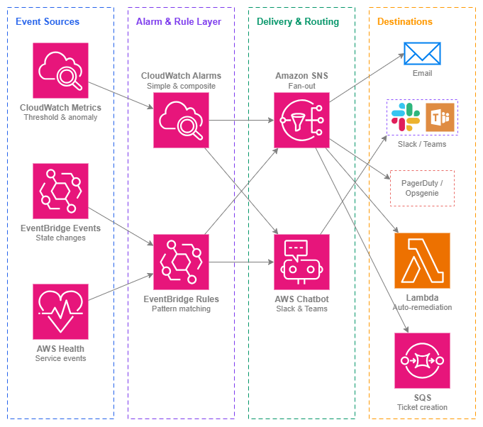

# 알림(Notifications) {#notifications}

!!! info "사전 요구 사항"
    이 섹션은 [AWS 서비스 모니터링](service-monitoring.md) 및 [AWS Organizations](../foundation/organizations.md)에 대한 이해를 전제로 합니다. AWS 네트워킹 관측성(observability)과 멀티 계정 거버넌스가 처음이라면 해당 항목을 먼저 검토하세요.

아무리 훌륭한 모니터링 체계라도 알림을 아무도 확인하지 않는다면 아무런 의미가 없습니다. 알림은 문제를 감지하는 것과 적절한 담당자가 조치를 취하는 것 사이의 간극을 메워 줍니다. 특히 네트워킹 영역에서는 그 중요성이 더욱 높습니다. VPN 터널 다운, Direct Connect BGP 세션 단절, Network Firewall의 트래픽 차단은 해당 경로에 의존하는 모든 워크로드에 영향을 미칩니다. 5분짜리 장애와 2시간짜리 중단의 차이는 거의 항상 알림이 대응 가능한 담당자에게 얼마나 빨리 전달되느냐에 달려 있습니다.

이 페이지에서는 알림 파이프라인을 처음부터 끝까지 다룹니다. 문제를 알리는 지표(metric)나 이벤트에서 시작하여, 해당 이벤트의 중요도를 판단하는 알람(alarm) 또는 규칙(rule)을 거쳐, 적시에 적절한 팀에 도달하는 전달 메커니즘까지 설명합니다. 핵심 원칙은 **신호 대 잡음비(signal over noise)** 입니다. 모니터링에서 가장 큰(제1의) 운영 실패 원인은 알람 피로(alert fatigue)로, 너무 많은 오탐(false positive)이나 낮은 우선순위의 잡음성 알림으로 인해 팀이 알림을 무시하게 되는 현상입니다.

멀티 계정 AWS 환경에서의 알림은 의도적인 아키텍처 설계를 필요로 합니다. 이벤트는 워크로드 계정에서 발생하지만, 네트워킹 팀은 일반적으로 중앙화된 모니터링 계정에서 운영합니다. 계정 간 이벤트 전달, 중앙화된 알람 집계, 그리고 조직 전체의 AWS Health 이벤트 가시성은 선택 사항이 아니라 모든 프로덕션 네트워크의 기본 요건입니다.

/// caption
알림 파이프라인 — [Drawio 소스](../assets/observability/notification-pipeline.drawio)
///

## 주요 기능 {#key-capabilities}

*   :material-bell-alert: **CloudWatch 알람**

    ---

    정적 임계값, 이상 탐지 밴드, 지표 수식을 활용한 지표 기반 알림. 복합 알람(Composite Alarm)은 여러 알람 상태를 단일 실행 가능한 신호로 결합하여 일시적인 단일 지표 급등으로 인한 노이즈를 줄입니다.

*   :material-lightning-bolt: **Amazon EventBridge**

    ---

    상태 변경에 대한 이벤트 기반 알림: VPN 터널 업/다운, Direct Connect 연결 상태, Network Firewall 경고, BGP 세션 플랩. 패턴 매칭 규칙이 폴링 없이 이벤트를 모든 대상으로 라우팅합니다.

*   :material-email-fast: **Amazon SNS**

    ---

    이메일, SMS, HTTPS 엔드포인트(PagerDuty, Opsgenie), Lambda 함수, SQS 큐로의 팬아웃 전달. SNS는 알람 소스와 알림 대상 사이를 연결하는 범용 연결 도구입니다.

*   :material-heart-pulse: **AWS Health 대시보드 및 API**

    ---

    리소스에 영향을 미치는 AWS 서비스 이벤트에 대한 사전 인지: Direct Connect의 예약된 유지 관리, 리전의 성능 저하, 또는 계획된 VPN 엔드포인트 교체. 조직 전체 Health 이벤트는 모든 멤버 계정에 걸쳐 집계됩니다.

*   :material-chat: **AWS Chatbot**

    ---

    CloudWatch 알람 및 EventBridge 알림을 Slack 채널과 Microsoft Teams에 직접 전달합니다. 대화형 인터페이스를 통해 팀이 채팅 창에서 알람을 확인하거나, 일시 중지하거나, 런북을 실행할 수 있습니다.

*   :material-set-merge: **복합 알람**

    ---

    여러 알람을 단일 상위 알람으로 결합하여 조건의 조합이 실제 문제를 확인할 때만 발생하도록 합니다. 복잡한 네트워크 토폴로지에서 알람 피로를 제거하기 위한 핵심 도구입니다.

## 모범 사례 {#best-practices}

### 알람 설계 {#alarm-design}

#### 모든 것이 아닌, 중요한 것에 알람을 설정하세요 {#alarm-on-what-matters-not-on-everything}

조치가 필요 없는데도 발생하는 알람이 쌓이면 팀이 알람을 무시하는 데 익숙해집니다. 알람을 생성하기 전에 "이 알람이 새벽 3시에 발생하면 누군가 무엇을 할 것인가?"라는 질문에 답해 보세요. 답이 "내일 확인하겠다"라면, 그것은 P1 알람이 아닙니다. 대시보드 지표나 일일 보고서 항목으로 처리하면 됩니다.

네트워킹에서 중요한 알람은 트래픽이 영향을 받고 있거나 곧 영향을 받을 것임을 나타내는 알람입니다. 예를 들어 터널 다운, BGP 세션 손실, NAT 게이트웨이 ErrorPortAllocation 급증, Network Firewall의 정상 트래픽 차단, Transit Gateway의 패킷 블랙홀링 등이 해당됩니다. "VPN 터널 수신 바이트"와 같은 지표는 대시보드에 유용하지만, 0으로 떨어지지 않는 한 알람을 설정할 필요는 거의 없습니다. 0으로 떨어진다면 상태가 "UP"으로 표시되더라도 터널이 사실상 죽은 것입니다.

***핵심 인사이트:*** *팀이 알람을 습관적으로 무시한다면, 모니터링 문제가 아니라 알람 설계 문제입니다. 모든 알람에는 명확한 담당자와 정의된 대응 조치가 있어야 합니다.*

#### 명확한 임계값이 없는 지표에는 이상 탐지를 사용하세요 {#use-anomaly-detection-for-metrics-without-obvious-thresholds}

일부 네트워킹 지표에는 자연스러운 정적 임계값이 없습니다. Transit Gateway에서 처리되는 바이트의 "정상" 수준은 시간대, 요일, 비즈니스 계절성에 따라 달라집니다. CloudWatch 이상 탐지는 예상 동작 모델을 구축하고, 지표가 설정 가능한 밴드 폭을 벗어날 때 알람을 발생시킵니다. 이는 DDoS 트래픽 패턴 감지, 라우팅 변경 후 예상치 못한 트래픽 이동, 또는 정적 임계값으로는 감지하기 어려운 점진적 성능 저하를 탐지하는 데 특히 유용합니다.

#### 명확한 라우팅이 있는 심각도 계층을 구현하세요 {#implement-severity-tiers-with-distinct-routing}

모든 문제가 즉각적인 호출을 필요로 하지는 않습니다. 명확한 심각도 계층을 정의하고 각 계층을 다르게 라우팅하세요.

| 심각도 | 기준 | 라우팅 | 대응 시간 |
| --- | --- | --- | --- |
| **P1 — 심각** | 트래픽 드롭, 연결 손실, 페일오버 미발생 | PagerDuty/Opsgenie 호출, Slack 워룸 채널 | 즉시 (5분 이내) |
| **P2 — 높음** | 이중화 저하, 단일 경로만 남음, 용량 한계 근접 | Slack 알림, 온콜 담당자에게 이메일 | 업무 시간 내 (4시간 이내) |
| **P3 — 정보** | 계획된 유지보수, 경미한 지표 편차, 페일오버 성공 | Slack 채널, 일일 다이제스트 이메일 | 다음 영업일 |

각 CloudWatch 알람과 EventBridge 규칙을 정확히 하나의 심각도 계층에 매핑하세요. 계층을 결정하기 어렵다면, 해당 알람을 두 개로 분리해야 할 가능성이 높습니다. 하나는 심각한 조건용, 다른 하나는 정보성 조건용으로 나누세요.

### 복합 알람 {#composite-alarms}

#### 복합 알람을 사용하여 호출 전에 실제 문제를 확인하세요 {#use-composite-alarms-to-confirm-real-problems-before-paging}

단일 지표가 임계값을 초과하는 것만으로는 문제가 아닌 경우가 많습니다. AWS 측 유지보수 중 VPN 터널이 잠시 불안정해지는 것은 예상된 동작입니다. 그러나 하나의 연결에서 *두 터널이 동시에* 다운된다면, 그것은 실제 장애입니다. 복합 알람을 사용하면 "알람 A와 알람 B가 모두 ALARM 상태일 때만 알람 발생"과 같은 논리를 표현할 수 있습니다.

복합 알람이 유용한 네트워킹 패턴:

* 동일 연결에서 **두 VPN 터널 모두 다운** (단일 터널 다운은 P2, 두 터널 모두 다운은 P1)
* **NAT 게이트웨이 오류 AND 패킷 드롭 증가** (오류만으로는 일시적일 수 있지만, 드롭과 결합되면 영향 확인)
* **BGP 세션 다운 AND 백업 경로에 트래픽 없음** (BGP 다운만으로는 트래픽이 백업으로 성공적으로 전환된 것일 수 있음)
* **여러 Transit Gateway 연결이 비정상** (하나의 연결 불안정은 격리된 문제이지만, 여러 개는 더 광범위한 문제를 시사)

#### 복합 알람 사용 시 하위 알람 조치를 억제하세요 {#suppress-child-alarm-actions-when-using-composite-alarms}

복합 알람을 생성할 때, 하위 알람의 알림 조치는 `ActionsEnabled: false`로 설정하세요. 알림 트리거는 복합 알람에서만 발생하도록 하세요. 이렇게 하면 중복 알림(각 하위 알람에서 하나씩, 복합 알람에서 하나)을 방지하고, 팀이 별도로 연관 지어야 하는 세 개의 알림 대신 결합된 조건을 설명하는 단일하고 맥락화된 알림을 받을 수 있습니다.

### 상태 변경을 위한 EventBridge {#eventbridge-for-state-changes}

#### 인프라 상태 변경 알림에는 EventBridge 규칙을 사용하세요 {#use-eventbridge-rules-for-infrastructure-state-change-notifications}

CloudWatch 알람은 지표 기반입니다. EventBridge는 *이벤트*, 즉 지표 임계값에 명확하게 매핑되지 않는 개별 상태 변경을 처리합니다. 네트워킹에서 가장 중요한 EventBridge 패턴은 다음과 같습니다.

* **VPN 터널 상태 변경**: `source: aws.vpn`, `detail-type: "VPN Tunnel Status Change"`
* **Direct Connect 연결 상태 변경**: `source: aws.directconnect`, `detail-type: "Direct Connect Connection State Change"`
* **Direct Connect 가상 인터페이스 상태 변경**: BGP 세션 업/다운 이벤트
* **Network Firewall 알림**: EventBridge로 전달되는 스테이트풀 규칙 매치 이벤트
* **Transit Gateway 연결 상태 변경**: 연결 사용 가능/실패/삭제 중
* **AWS Health 이벤트**: 예약된 유지보수, 리소스에 영향을 미치는 서비스 문제

EventBridge 규칙은 이벤트 패턴을 매칭하여 대상(SNS, Lambda, SQS, Step Functions)으로 라우팅합니다. 이것은 "지표가 임계값을 초과했다"가 아닌 "무언가 상태가 변경되었다" 알림에 적합한 메커니즘입니다.

#### 중앙화된 모니터링 계정으로 이벤트를 계정 간 전달하세요 {#forward-events-cross-account-to-a-centralized-monitoring-account}

멀티 계정 환경에서 네트워킹 이벤트는 리소스를 소유한 계정(Transit Gateway와 Direct Connect의 경우 중앙화된 네트워킹 계정, VPC 수준 이벤트의 경우 워크로드 계정)에서 발생합니다. [EventBridge 계정 간 이벤트 전달](https://docs.aws.amazon.com/eventbridge/latest/userguide/eb-cross-account.html)을 구성하여 네트워킹 이벤트를 알림 규칙, SNS 토픽, Chatbot 구성이 있는 중앙화된 모니터링 계정으로 전송하세요.

이 패턴은 모든 계정에서 알림 인프라를 중복 구성하는 것을 방지하고, 네트워킹 팀이 조직 전체의 모든 네트워크 이벤트를 단일 관제 화면에서 확인할 수 있게 합니다. 각 계정의 기본 이벤트 버스에 조직 수준 EventBridge 규칙을 사용하여 네트워킹 패턴과 일치하는 이벤트를 모니터링 계정의 이벤트 버스로 전달하세요.

***핵심 인사이트:*** *이벤트 생성이 아닌 알림 로직을 중앙화하세요. 이벤트는 리소스가 있는 곳에서 발생해야 하지만, 라우팅 결정과 전달 구성은 한 곳에서 관리해야 합니다.*

### AWS Health 이벤트 {#aws-health-events}

#### 사전 인식을 위해 조직 전체 Health 이벤트를 구독하세요 {#subscribe-to-organization-wide-health-events-for-proactive-awareness}

AWS Health 이벤트는 예약된 유지보수(Direct Connect 회선 유지보수 창, VPN 엔드포인트 교체), 서비스 문제(리전의 네트워킹 성능 저하), 계정별 알림에 대해 알려줍니다. [AWS Organizations Health](https://docs.aws.amazon.com/health/latest/ug/aggregate-events.html)를 사용하면 관리 계정 또는 위임된 관리자로부터 모든 멤버 계정의 이벤트를 확인할 수 있습니다.

네트워킹 서비스(`directconnect`, `vpn`, `ec2`, `networkfirewall`, `transitgateway`)에 대한 Health 이벤트를 매칭하는 EventBridge 규칙을 생성하고 네트워킹 팀의 Slack 채널로 라우팅하세요. 예약된 Direct Connect 유지보수 창을 14일 전에 미리 알면, 새벽 2시에 백업 경로가 작동하지 않는다는 것을 발견하는 대신 유지보수 *전에* 페일오버 경로를 검증할 수 있습니다.

### 알림 라우팅 {#notification-routing}

#### 모든 사람이 아닌, 대응을 담당하는 팀으로 알람을 라우팅하세요 {#route-alarms-to-the-team-that-owns-the-response-not-to-everyone}

흔한 안티패턴은 모든 네트워크 알람을 모든 엔지니어에게 전송하는 단일 SNS 토픽입니다. 이는 알람 피로를 보장합니다. 대신, 팀별 및 심각도별로 별도의 SNS 토픽을 생성하세요.

* `networking-p1-critical` → 네트워킹 팀의 PagerDuty 로테이션
* `networking-p2-high` → Slack #network-ops 채널
* `networking-p3-info` → Slack #network-notifications 채널 (기본적으로 음소거)
* `workload-team-a-network` → 팀 A의 VPC 리소스 알람을 위한 팀 A 전용 채널

애플리케이션 팀은 자신이 조치할 수 없는 공유 인프라가 아닌, *자신의* 워크로드 네트워크 상태(VPC 엔드포인트, 로드 밸런서 상태)에 대한 알림을 받아야 합니다. 네트워킹 팀은 공유 인프라(Transit Gateway, Direct Connect, Network Firewall)에 대한 알림을 받습니다.

### 자동화된 복구 {#automated-remediation}

#### 알려진 장애 모드에 대한 자동화된 대응을 위해 EventBridge → Lambda를 사용하세요 {#use-eventbridge-lambda-for-automated-response-to-known-failure-modes}

일부 네트워크 이벤트에는 잘 정의된 안전한 자동화 대응이 있습니다.

* **VPN 터널 다운** → Lambda가 CloudFormation 스택 업데이트를 트리거하여 사전 공유 키를 교체하고 터널을 재설정
* **NAT 게이트웨이 ErrorPortAllocation** → Lambda가 추가 NAT 게이트웨이를 프로비저닝하고 라우팅 테이블을 업데이트
* **Direct Connect 연결 다운** → Lambda가 백업 VPN 경로가 활성화되어 있는지 확인하고, 그렇지 않으면 티켓 생성
* **Network Firewall 규칙 그룹 업데이트 실패** → Lambda가 이전 규칙 그룹 버전으로 롤백

자동화된 복구는 사람의 대응을 대체하는 것이 아닙니다. 시간을 벌어주는 첫 번째 대응자입니다. Lambda는 복구 조치를 취하는 것 *외에도* 항상 티켓을 생성하거나 알림을 전송해야 합니다. 그래야 팀이 무슨 일이 있었는지 파악하고 수정 사항을 검증할 수 있습니다.

***핵심 인사이트:*** *세 번 이상 경험한 이벤트에 대한 대응을 자동화하세요. 동일한 장애 모드를 세 번 수동으로 복구했다면, 네 번째는 자동화되어야 합니다.*

### 비용 인식 {#cost-awareness}

#### 대규모 환경에서 알림 비용을 이해하세요 {#understand-notification-costs-at-scale}

개별 알림 비용은 미미하지만, 대규모 조직에서는 누적됩니다.

| 구성 요소 | 비용 | 규모 고려 사항 |
| --- | --- | --- |
| CloudWatch 알람 | 알람당/월 (표준) 또는 알람당/월 (이상 탐지) — [CloudWatch 요금](https://aws.amazon.com/cloudwatch/pricing/) 참조 | 비용은 계정 전체의 알람 수에 비례하여 증가 |
| EventBridge 규칙 | 매칭된 이벤트 백만 건당 | 네트워킹 이벤트의 경우 일반적으로 무시할 수 있는 수준 |
| SNS 알림 | 이메일 전송 백만 건당, SMS 100건당 | 이메일은 사실상 무료이지만, 대규모 온콜 로테이션에서는 SMS 비용이 누적됨 |
| AWS Chatbot | 추가 요금 없음 | Slack/Teams 전달 무료 |

실제 비용 위험은 알림 서비스 자체가 아닙니다. 아무도 확인하지 않는 수백 개의 알람을 생성하는 것입니다. 사용되지 않는 알람은 비용이 발생하고, 더 심각하게는 중요한 알람의 신호를 희석시킨다는 점입니다. 분기별로 알람을 감사하세요. 알람이 6개월 동안 발생하지 않았다면, 임계값이 잘못 설정되었거나 해당 알람이 필요하지 않은 것입니다.

## 알림과 다른 서비스 결합하기 {#combining-notifications-with-other-services}

| 조합 | 알림이 제공하는 기능 | 다른 서비스가 제공하는 기능 |
| --- | --- | --- |
| **CloudWatch Alarms + CloudWatch Metrics** | 임계값 평가, 상태 관리, 알림 트리거 | 네트워킹 서비스(VPN, Direct Connect, NAT 게이트웨이, Transit Gateway)의 기반 지표 데이터 |
| **EventBridge + AWS Health** | 알림 대상으로의 규칙 매칭 및 라우팅 | 사전 예방적 서비스 이벤트 정보(유지 관리, 성능 저하, 권고 사항) |
| **SNS + PagerDuty/Opsgenie** | HTTPS 엔드포인트로의 팬아웃 전송 | 온콜 로테이션, 에스컬레이션 정책, 인시던트 관리 워크플로 |
| **AWS Chatbot + Slack/Teams** | 인터랙티브 액션이 포함된 형식화된 알람 전송 | 팀 커뮤니케이션, 확인 응답, 채팅에서의 런북 실행 |
| **EventBridge + Lambda** | 컴퓨팅 대상으로의 이벤트 라우팅 | 자동화된 복구 로직(장애 조치, 스케일링, 티켓 생성) |
| **CloudWatch + AWS Organizations** | 중앙 집중식 모니터링 계정에서의 계정 간 알람 집계 | 계정 구조, 위임된 관리, 조직 전체 Health 이벤트 |
| **Composite Alarms + Simple Alarms** | 알람 상태에 대한 불리언 논리를 통한 노이즈 감소 | 리소스별 또는 조건별 개별 지표 평가 |

## 문서 {#documentation}

*   :material-file-document: **Amazon CloudWatch 알람**

    ---

    지표 알람, 이상 탐지 알람, 복합 알람 생성 및 알람 작업 구성에 관한 전체 문서입니다.

    [:octicons-arrow-right-24: 문서](https://docs.aws.amazon.com/AmazonCloudWatch/latest/monitoring/AlarmThatSendsEmail.html)

*   :material-file-document: **Amazon EventBridge 사용 설명서**

    ---

    이벤트 패턴, 규칙, 대상, 계정 간 이벤트 전달 및 AWS 서비스와의 통합에 관한 문서입니다.

    [:octicons-arrow-right-24: 문서](https://docs.aws.amazon.com/eventbridge/latest/userguide/eb-what-is.html)

*   :material-file-document: **Amazon SNS 개발자 안내서**

    ---

    주제 생성, 구독 관리, 메시지 필터링, 이메일·SMS·HTTPS·Lambda·SQS로의 전달에 관한 문서입니다.

    [:octicons-arrow-right-24: 문서](https://docs.aws.amazon.com/sns/latest/dg/welcome.html)

*   :material-file-document: **AWS Health 사용 설명서**

    ---

    조직 전체 상태 이벤트, EventBridge 통합 및 Health API를 통한 프로그래밍 방식 액세스에 관한 문서입니다.

    [:octicons-arrow-right-24: 문서](https://docs.aws.amazon.com/health/latest/ug/what-is-aws-health.html)

*   :material-chat: **AWS Chatbot 관리자 안내서**

    ---

    Slack 및 Microsoft Teams 통합 구성, 채널 권한 설정, 대화형 알람 관리에 관한 문서입니다.

    [:octicons-arrow-right-24: 문서](https://docs.aws.amazon.com/chatbot/latest/adminguide/what-is.html)

*   :material-currency-usd: **CloudWatch 요금**

    ---

    알람 요금 등급(표준, 고해상도, 이상 탐지, 복합), 지표 비용 및 프리 티어 세부 정보입니다.

    [:octicons-arrow-right-24: 요금](https://aws.amazon.com/cloudwatch/pricing/)

## 관련 관측성 페이지 {#related-observability-pages}

* **[AWS 서비스 모니터링](service-monitoring.md)** — 이 페이지에서 다루는 알림 파이프라인에 데이터를 제공하는 지표 및 상태 확인
* **[내부 트래픽 모니터링](internal-traffic.md)** — 이상 징후 기반 네트워크 알람의 원시 데이터를 제공하는 VPC Flow Logs 및 트래픽 미러링
* **[외부 트래픽 모니터링](external-traffic.md)** — DDoS 및 어뷰징 알림을 구동하는 인터넷 대상 트래픽 가시성

**기반(Foundation)과의 관계:**

* **[AWS Organizations](../foundation/organizations.md)** — 조직 구조는 계정 간 이벤트 전달 토폴로지 및 중앙 집중식 모니터링 계정 배치를 결정합니다

**연결성(Connectivity)과의 관계:**

* **[하이브리드 및 멀티 클라우드](../connectivity/hybrid-multicloud.md)** — Direct Connect 및 VPN 상태 변경 이벤트는 구성해야 할 가장 중요한 네트워킹 알림입니다
* **[AWS 내 연결성](../connectivity/within-aws.md)** — Transit Gateway 및 Cloud WAN 어태치먼트 상태는 복합 알람 설계를 구동합니다
