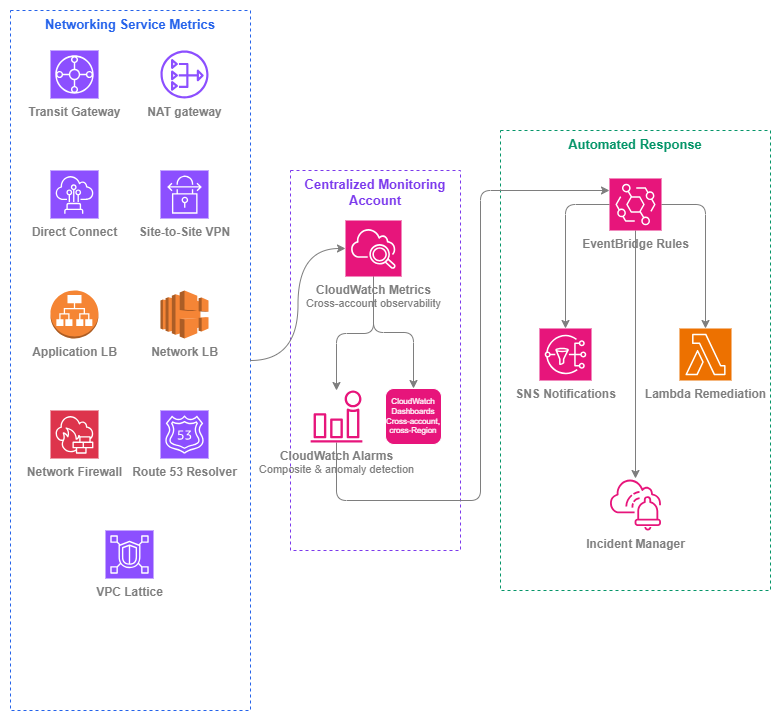

# AWS 서비스 모니터링 {#aws-services-monitoring}

!!! info "사전 요구 사항"
    이 섹션은 [AWS 내부 연결](../connectivity/within-aws.md), [로드 밸런싱](../application-networking/load-balancing.md), [하이브리드 및 멀티 클라우드](../connectivity/hybrid-multicloud.md)에 대한 이해를 전제로 합니다. AWS 네트워킹 기초가 처음이라면 해당 항목을 먼저 검토하세요.

네트워크 트래픽 모니터링([내부 트래픽](internal-traffic.md) 및 [외부 트래픽](external-traffic.md)에서 다룸)은 네트워크를 통해 무엇이 흐르는지 알려줍니다. 네트워킹 *서비스 자체*를 모니터링하면 해당 트래픽을 전달하는 인프라가 정상 상태인지 파악할 수 있습니다. Transit Gateway에서 블랙홀 드롭이 발생하거나, NAT 게이트웨이의 포트 할당이 고갈되거나, Direct Connect 연결이 상태 간에 불안정하게 전환되는 경우 — 이러한 서비스 수준의 장애는 사용자가 영향을 받고 나서야 트래픽 모니터링만으로는 잡힙니다.

이 페이지는 AWS 네트워킹 서비스의 운영 상태에 초점을 맞춥니다. 중요한 CloudWatch 지표, 첫날부터 구성해야 할 알람, 그리고 모니터링 신호를 복구 조치로 전환하는 자동화 패턴을 다룹니다. 목표는 네트워킹 플레인의 성능 저하가 장애로 이어지기 전에 감지하고, 가능한 경우 자동으로 대응하는 것입니다.

멀티 계정 AWS 환경에서의 서비스 모니터링은 신중하게 설계된 아키텍처를 필요로 합니다. 지표는 리소스를 소유한 계정에 존재하지만, 네트워킹 팀은 모든 계정과 리전에 걸친 통합된 뷰가 필요합니다. 여기서 소개하는 패턴은 계정 간 CloudWatch 대시보드와 네트워킹 이벤트를 위한 공유 EventBridge 버스를 갖춘 중앙 집중식 모니터링 계정을 전제로 합니다.

/// caption
서비스 모니터링 스택 — [Drawio 소스](../assets/observability/service-monitoring-stack.drawio)
///

## 서비스별 핵심 지표 {#critical-metrics-by-service}

모든 CloudWatch 지표에 알람을 설정할 필요는 없습니다. 아래 표는 실제 운영 문제를 나타내는 지표, 즉 첫 번째 프로덕션 워크로드가 서비스를 거치기 전, 처음부터 알람을 설정해야 할 지표를 정리한 것입니다.

### Transit Gateway {#transit-gateway}

| 지표 | 중요한 이유 | 알람 조건 |
| --- | --- | --- |
| `PacketDropCountBlackhole` | 트래픽이 목적지가 없는 경로로 전송되고 있습니다. 라우팅 테이블 항목이 누락되었거나 잘못 구성되었음을 나타냅니다. | 연속 2개 기간 동안 > 0 |
| `PacketDropCountNoRoute` | 목적지에 일치하는 경로가 없습니다. 라우팅 전파 누락 또는 분리된 어태치먼트로 인해 자주 발생합니다. | 연속 2개 기간 동안 > 0 |
| `BytesIn` / `BytesOut` | 기준 처리량입니다. 갑작스러운 감소는 연결 손실을 나타내며, 지속적인 증가는 용량 계획이 필요함을 의미합니다. | 이상 탐지 밴드(표준 편차 2) |
| `AttachmentCount` | 리전별 할당량(기본값 5,000)에 대한 어태치먼트 증가를 추적합니다. | 할당량의 80% 초과 |

### NAT 게이트웨이 {#nat-gateway}

| 지표 | 중요한 이유 | 알람 조건 |
| --- | --- | --- |
| `ErrorPortAllocation` | NAT 게이트웨이가 단일 목적지에 대한 55,000개의 동시 연결을 모두 소진했습니다. 워크로드가 새 연결을 수립하지 못하게 됩니다. | 1개 기간 동안 > 0 |
| `PacketsDropCount` | NAT 게이트웨이 처리 한도로 인해 패킷이 드롭되었습니다. 게이트웨이가 과부하 상태임을 나타냅니다. | 3개 기간 동안 지속적으로 > 0 |
| `ActiveConnectionCount` | 연결 테이블 사용률을 추적합니다. 용량 계획 및 연결 누수 탐지에 유용합니다. | 이상 탐지 또는 예상 기준값의 80% 초과 |
| `BytesOutToDestination` | 데이터 처리량은 비용과 직접적으로 연관됩니다. 예상치 못한 급증은 잘못 구성된 라우팅 또는 데이터 유출을 나타냅니다. | 이상 탐지 밴드 |
| `ConnectionEstablishedCount` | 새 연결 속도입니다. 갑작스러운 급증은 스캐닝 또는 잘못 구성된 재시도 로직을 나타낼 수 있습니다. | 이상 탐지 밴드 |

***핵심 인사이트:*** *`ErrorPortAllocation`은 NAT 게이트웨이에서 가장 중요한 단일 지표입니다. 이 알람이 발생하면 이미 연결이 실패하고 있는 상태입니다. 즉시 알람을 설정하고 여러 NAT 게이트웨이 사용 또는 목적지 분산을 고려하세요.*

### Direct Connect {#direct-connect}

| 지표 | 중요한 이유 | 알람 조건 |
| --- | --- | --- |
| `ConnectionState` | 이진값: 물리적 연결이 활성 또는 비활성 상태입니다. 상태 변경은 광케이블 절단, 라우터 장애 또는 유지 관리 이벤트를 나타냅니다. | 1개 기간 동안 상태 != 1(활성) |
| `VirtualInterfaceBpsEgress` / `VirtualInterfaceBpsIngress` | VIF별 처리량입니다. 포트 용량에 근접하면 용량을 추가하거나 트래픽을 이동해야 합니다. | 5분 동안 지속적으로 포트 속도의 80% 초과 |
| `ConnectionBpsEgress` / `ConnectionBpsIngress` | 집계 연결 처리량입니다. | 5분 동안 지속적으로 포트 속도의 80% 초과 |
| `ConnectionLightLevelTx` / `ConnectionLightLevelRx` | 광학 신호 강도입니다. 광 레벨 저하는 물리적 장애가 발생하기 전에 이를 예측합니다. | 광학 유형에 허용되는 dBm 범위를 벗어난 경우 |

### Site-to-Site VPN {#site-to-site-vpn}

| 지표 | 중요한 이유 | 알람 조건 |
| --- | --- | --- |
| `TunnelState` | 이진값: IPsec 터널이 활성 또는 비활성 상태입니다. 각 VPN 연결에는 이중화를 위한 두 개의 터널이 있습니다. | 연속 2개 기간 동안 터널 상태 = 0 |
| `TunnelDataIn` / `TunnelDataOut` | 터널별 처리량입니다. 비대칭 트래픽은 라우팅 문제 또는 나머지 터널에 트래픽이 집중된 터널 장애를 나타낼 수 있습니다. | 이상 탐지; 트래픽이 예상되는 상황에서 트래픽이 0인 경우 알람 |

***핵심 인사이트:*** *두 터널이 모두 다운된 경우가 아니라 단일 터널이 다운될 때 알람을 설정하세요. 단일 터널 장애는 이중화 없이 운영 중임을 의미하며, 다음 장애는 곧 서비스 중단으로 이어집니다.*

### Application Load Balancer {#application-load-balancer}

| 지표 | 중요한 이유 | 알람 조건 |
| --- | --- | --- |
| `HealthyHostCount` | 상태 확인을 통과하는 대상 수를 추적합니다. 감소하는 수치는 용량이 줄어들고 있음을 의미합니다. | 대상 그룹별 예상 최솟값 미만 |
| `UnHealthyHostCount` | 상태 확인에 실패한 대상입니다. 0이 아닌 값은 애플리케이션 또는 종속성에 문제가 있음을 나타냅니다. | 2개 기간 동안 지속적으로 > 0 |
| `HTTPCode_ELB_5XX_Count` | ALB 자체에서 생성된 오류(대상이 아님)입니다. 용량 소진 또는 정상 대상 없음과 같은 ALB 수준의 문제를 나타냅니다. | 3개 기간 동안 지속적으로 > 0 |
| `TargetResponseTime` | ALB에서 대상까지의 P99 지연 시간입니다. 여기서의 성능 저하는 모든 요청에 영향을 미칩니다. | 이상 탐지 또는 SLA 임계값 초과 |
| `RejectedConnectionCount` | ALB가 최대 연결 수에 도달하여 거부된 연결입니다. 서브넷 크기 부족 또는 ALB 스케일링 한도를 초과하는 트래픽 급증을 나타냅니다. | 1개 기간 동안 > 0 |
| `RequestCount` | 기준 트래픽 볼륨입니다. 이상 탐지 및 다른 지표와의 상관 관계 분석에 유용합니다. | 이상 탐지 밴드 |

### Network Load Balancer {#network-load-balancer}

| 지표 | 중요한 이유 | 알람 조건 |
| --- | --- | --- |
| `HealthyHostCount` / `UnHealthyHostCount` | ALB와 동일하게 대상 가용성을 추적합니다. | ALB와 동일한 임계값 |
| `TCP_ELB_Reset_Count` | NLB에서 생성된 TCP 리셋(대상이 아님)입니다. 유휴 타임아웃 불일치 또는 연결 추적 문제를 나타냅니다. | 이상 탐지; 지속적인 증가 |
| `ProcessedBytes` | 총 처리량입니다. 비용 및 용량 사용률과 직접적으로 연관됩니다. | 이상 탐지 밴드 |
| `NewFlowCount` | 새 TCP/UDP 플로우 속도입니다. 갑작스러운 급증은 DDoS 또는 잘못 구성된 클라이언트를 나타낼 수 있습니다. | 이상 탐지 밴드 |
| `UnHealthyHostCount`(가용 영역별) | AZ별 상태입니다. 교차 영역 로드 밸런싱이 비활성화된 경우(NLB 기본값) 중요합니다. | 단일 가용 영역에서 > 0 |

### AWS Network Firewall {#aws-network-firewall}

| 지표 | 중요한 이유 | 알람 조건 |
| --- | --- | --- |
| `DroppedPackets` | 방화벽 규칙에 의해 명시적으로 드롭된 패킷입니다. 정상 운영에서는 예상되는 값이지만, 갑작스러운 급증은 공격 또는 합법적인 트래픽을 차단하는 규칙 잘못 구성을 나타냅니다. | 이상 탐지 밴드 |
| `PassedPackets` | 통과가 허용된 패킷입니다. 갑자기 0으로 떨어지면 트래픽이 방화벽에 도달하지 못하거나(라우팅 문제) 방화벽이 다운된 것입니다. | 2개 기간 동안 기준값 미만 |
| `ReceivedPackets` | 방화벽에 유입되는 총 패킷 수입니다. 용량 계획의 기준값입니다. | 이상 탐지 밴드 |
| `Packets`(규칙 그룹별) | 규칙 그룹별 히트 수입니다. 어떤 규칙이 활성화되어 있는지, 새 규칙이 예상대로 매칭되는지 식별합니다. | 매칭이 예상되는 규칙에서 히트가 0인 경우 모니터링 |

### Route 53 Resolver {#route-53-resolver}

| 지표 | 중요한 이유 | 알람 조건 |
| --- | --- | --- |
| `InboundQueryVolume` | 온프레미스 또는 피어링된 네트워크에서 수신되는 DNS 쿼리입니다. 급증은 DNS 증폭 또는 잘못 구성된 리졸버를 나타낼 수 있습니다. | 이상 탐지 밴드 |
| `OutboundQueryVolume` | 온프레미스 또는 외부 리졸버로 전달되는 DNS 쿼리입니다. 감소는 전달 규칙 문제를 나타냅니다. | 3개 기간 동안 기준값 미만 |
| `FirewallRuleGroupQueryVolume` | DNS 방화벽 규칙에 의해 평가된 쿼리입니다. DNS 계층 보안 적용을 추적합니다. | 예상 기준값 모니터링 |

### VPC Lattice {#vpc-lattice}

| 지표 | 중요한 이유 | 알람 조건 |
| --- | --- | --- |
| `RequestCount` | 서비스 네트워크를 통한 총 요청 수입니다. 용량 및 비용 추적의 기준값입니다. | 이상 탐지 밴드 |
| `HTTPCode_Target_4XX_Count` | 대상에서의 클라이언트 오류입니다. 높은 수치는 API 계약 문제 또는 인증 실패를 나타냅니다. | 이상 탐지 밴드 |
| `HTTPCode_Target_5XX_Count` | 대상에서의 서버 오류입니다. 백엔드 상태 문제의 직접적인 지표입니다. | 2개 기간 동안 임계값 초과 |
| `TargetResponseTime` | VPC Lattice에서 대상까지의 지연 시간입니다. 성능 저하는 서비스 네트워크의 모든 소비자에게 영향을 미칩니다. | SLA 임계값 초과 또는 이상 탐지 |

## 모범 사례 {#best-practices}

### 알람 설계 {#alarm-design}

#### 임계값뿐만 아니라 상태 변화에 대한 알람 설정 {#alarm-on-state-changes-not-just-thresholds}

많은 네트워킹 서비스에는 이진 상태 지표(터널 활성/비활성, 연결 활성/비활성, BGP 세션 설정됨/유휴)가 있습니다. 이러한 지표에는 임계값 기반 알람이 아닌 상태 변화 알람이 필요합니다. VPN 터널이 활성에서 비활성으로 전환되는 것은 트래픽 볼륨과 관계없이 즉각적인 조치가 필요한 상황입니다. 장애가 트래픽 지표에 반영될 때까지 기다리는 대신, 상태 값 자체에서 트리거되는 알람(예: 1회 평가 기간 동안 `TunnelState < 1`)을 구성하세요.

Direct Connect의 경우 `ConnectionState` 전환을 모니터링하고, VPN의 경우 터널별 `TunnelState`를 모니터링하며, ALB/NLB의 경우 오류율이 상승할 때까지 기다리는 대신 `HealthyHostCount`가 예상 최솟값 아래로 떨어지는 것을 모니터링하세요.

#### 복합 알람을 사용하여 노이즈 감소 {#use-composite-alarms-to-reduce-noise}

개별 지표 알람은 노이즈를 발생시킵니다. Transit Gateway 라우팅 테이블 업데이트 중 `PacketDropCountNoRoute`가 잠깐 급증하는 것은 예상된 현상입니다. 그러나 동일 경로의 NAT 게이트웨이에서 `ErrorPortAllocation` 증가와 함께 지속적인 급증이 발생한다면 실제 문제입니다.

[복합 알람](https://docs.aws.amazon.com/AmazonCloudWatch/latest/monitoring/Create_Composite_Alarm.html)은 AND/OR 논리로 여러 알람 상태를 결합합니다. 여러 신호가 문제를 확인할 때만 경고하도록 구성하세요.

* Transit Gateway: `PacketDropCountBlackhole > 0` AND `BytesOut` 이상 감지(일시적인 라우팅 업데이트가 아닌 트래픽이 실제로 영향을 받고 있음을 확인)
* NAT 게이트웨이: `ErrorPortAllocation > 0` AND `ActiveConnectionCount`가 기준선 초과(포트 고갈이 모니터링 아티팩트가 아닌 실제 부하임을 확인)
* 로드 밸런서: `UnHealthyHostCount > 0` AND `HealthyHostCount < 최솟값`(단일 대상 순환이 아닌 실제 용량 손실임을 확인)

***핵심 인사이트:*** *복합 알람은 무시되는 모니터링 시스템과 실제로 조치가 취해지는 모니터링 시스템의 차이를 만듭니다. 조치가 필요 없는데 발생하는 모든 알람은 팀이 알람을 무시하도록 훈련시킵니다.*

#### 정적 임계값 대신 이상 감지 사용 {#use-anomaly-detection-instead-of-static-thresholds}

정적 임계값은 트래픽 패턴이 변화함에 따라 지속적인 조정이 필요합니다. CloudWatch [이상 감지](https://docs.aws.amazon.com/AmazonCloudWatch/latest/monitoring/CloudWatch_Anomaly_Detection.html)는 예상 동작 모델을 구축하고 지표가 학습된 패턴에서 벗어날 때 경고합니다. 이는 다음과 같은 경우에 특히 효과적입니다.

* Transit Gateway 및 NAT 게이트웨이의 `BytesIn`/`BytesOut`(트래픽은 일별/주별 패턴을 따름)
* ALB 및 VPC Lattice의 `RequestCount`(애플리케이션 트래픽은 예측 가능한 주기를 가짐)
* NLB의 `NewFlowCount`(연결 속도는 비즈니스 활동과 상관관계가 있음)

이상 감지는 표준 알람과 동일한 비용이 들지만 트래픽 증가, 계절적 패턴, 기준선 변화에 자동으로 적응합니다. 대부분의 네트워킹 지표에는 표준 편차 2의 밴드 폭을 사용하세요. 실제 이상을 감지할 만큼 충분히 좁으면서도 정상적인 분산 중 오탐을 방지할 만큼 충분히 넓습니다.

#### 할당량 한도에 도달하기 전에 모니터링 {#monitor-quotas-before-you-hit-them}

모든 네트워킹 서비스에는 할당량이 있습니다. 할당량에 조용히 도달하면(새 VPN 연결 없음, 추가 Transit Gateway 연결 없음, NAT 게이트웨이 탄력적 IP 없음) 서비스 문제처럼 보이지만 실제로는 용량 한도인 장애가 발생합니다.

[AWS Service Quotas](https://docs.aws.amazon.com/servicequotas/latest/userguide/intro.html)와 CloudWatch 통합을 사용하여 80% 사용률에서 알람을 설정하세요.

| 서비스 | 모니터링할 할당량 | 기본 한도 |
| --- | --- | --- |
| Transit Gateway | TGW당 연결 수 | 5,000 |
| Transit Gateway | 라우팅 테이블당 경로 수 | 10,000 |
| NAT 게이트웨이 | 가용 영역당 NAT 게이트웨이 수 | 5 |
| VPN | VGW/TGW당 VPN 연결 수 | 10 / 20 |
| Direct Connect | 연결당 가상 인터페이스 수 | 50 |
| ALB | ALB당 규칙 수 | 100 |
| NLB | 대상 그룹당 대상 수 | 500(IP) / 500(인스턴스) |
| Network Firewall | 방화벽 정책당 규칙 그룹 수 | 20 |

### 멀티 계정 모니터링 아키텍처 {#multi-account-monitoring-architecture}

#### 중앙 집중식 모니터링 계정 배포 {#deploy-a-centralized-monitoring-account}

멀티 계정 환경에서 네트워킹 리소스는 공유 서비스 계정, 워크로드 계정, 연결 계정에 분산되어 있습니다. 네트워킹 팀에는 단일 관제 화면이 필요합니다.

[CloudWatch 계정 간 관측성](https://docs.aws.amazon.com/AmazonCloudWatch/latest/monitoring/CloudWatch-Unified-Cross-Account.html)을 사용하여 모든 소스 계정의 지표, 로그, 추적을 볼 수 있는 모니터링 계정을 지정하세요. AWS Organizations 수준에서 이를 구성하면 새 계정이 자동으로 등록됩니다.

모니터링 계정에는 다음이 포함됩니다.

* 모든 네트워킹 서비스 상태를 보여주는 계정 간 대시보드
* 모든 소스 계정의 지표를 평가하는 중앙 집중식 알람
* 모든 계정의 네트워킹 이벤트를 집계하는 EventBridge 규칙

#### 네트워킹 팀을 위한 리전 간 대시보드 구축 {#build-cross-region-dashboards-for-the-networking-team}

단일 CloudWatch 대시보드는 여러 리전의 지표를 표시할 수 있습니다. 계정이나 리전이 아닌 서비스 유형별로 구성된 대시보드를 구축하세요.

* **Transit Gateway 대시보드**: 모든 리전의 모든 TGW 지표, 연결별 드릴다운 포함
* **하이브리드 연결 대시보드**: 모든 Direct Connect 및 VPN 지표, 연결 상태 및 사용률 표시
* **로드 밸런서 대시보드**: 모든 워크로드 계정의 ALB 및 NLB 상태
* **DNS 대시보드**: Route 53 Resolver 쿼리 볼륨 및 DNS Firewall 활동

각 대시보드는 기본적으로 최근 3시간을 표시하고 추세 분석을 위해 1주일로 확대할 수 있어야 합니다.

***핵심 인사이트:*** *AWS 계정이나 리전이 아닌 네트워킹 관심사(연결 상태, 용량, 보안)별로 대시보드를 구성하세요. 네트워킹 팀은 계정 경계가 아닌 경로와 서비스 관점에서 생각합니다.*

### IPv6 모니터링 고려 사항 {#ipv6-monitoring-considerations}

#### 듀얼 스택 지표를 별도로 모니터링 {#monitor-dual-stack-metrics-separately}

여러 네트워킹 서비스는 IPv4와 IPv6 트래픽 경로 간에 다른 지표를 보고합니다. 듀얼 스택을 실행할 때는 다음을 고려하세요.

* **ALB/NLB**: `IPv6ProcessedBytes` 및 `IPv6RequestCount`를 IPv4 대응 지표와 별도로 모니터링하세요. IPv4 트래픽이 지배적인 경우 IPv6 경로의 장애가 집계 지표에 나타나지 않을 수 있습니다.
* **NAT 게이트웨이**: NAT64 지표(`BytesOutToDestination`, IPv6-IPv4 변환용)는 표준 NAT와 다른 장애 모드를 추적합니다. 두 경로를 모두 모니터링하세요.
* **VPC Lattice**: 듀얼 스택 서비스 네트워크는 IPv4와 IPv6 트래픽을 모두 전달합니다. IPv6 특정 라우팅 문제를 감지하려면 프로토콜별 오류율을 모니터링하세요.

#### IPv6 전용 상태 확인 구성 {#configure-ipv6-specific-health-checks}

IPv6 상태 확인을 지원하는 서비스(ALB, NLB)의 경우, 대상이 듀얼 스택일 때 두 프로토콜 모두에 대해 상태 확인을 구성하세요. IPv4 상태 확인이 통과한다고 해서 IPv6 경로가 정상임을 보장하지는 않습니다. 각 주소 패밀리에 서로 다른 보안 그룹, NACL 또는 라우팅이 적용될 수 있습니다.

### 비용 효율적인 모니터링 {#cost-effective-monitoring}

#### 지표 수식을 사용하여 알람 수 감소 {#use-metric-math-to-reduce-alarm-count}

CloudWatch는 알람당 월별 요금을 부과합니다. 모든 NAT 게이트웨이 또는 모든 Transit Gateway 연결에 대해 개별 알람을 생성하는 대신, [지표 수식](https://docs.aws.amazon.com/AmazonCloudWatch/latest/monitoring/using-metric-math.html)을 사용하여 집계하세요.

* 리전의 모든 NAT 게이트웨이에 걸쳐 `ErrorPortAllocation`을 합산하여 단일 알람으로 구성
* 모든 대상 그룹에 걸쳐 전체 대상 수 대비 `UnHealthyHostCount` 비율 계산
* `PacketDropCountBlackhole + PacketDropCountNoRoute`를 단일 "라우팅 장애" 지표로 계산

이렇게 하면 커버리지를 유지하면서 알람 수(및 비용)를 줄일 수 있습니다. 가장 중요한 개별 리소스(기본 Direct Connect 연결, 프로덕션 ALB)에 대해서만 리소스별 알람을 생성하세요.

#### 비용 모델 이해 {#understand-the-cost-model}

| CloudWatch 구성 요소 | 가격 고려 사항 |
| --- | --- |
| 표준 지표 | 무료(서비스에 포함) |
| 사용자 지정 지표 | 지표당/월(계층형 — [CloudWatch 요금](https://aws.amazon.com/cloudwatch/pricing/) 참조) |
| 알람(표준) | 알람당/월 |
| 알람(고해상도) | 알람당/월(표준보다 높음) |
| 이상 감지 알람 | 알람당/월 |
| 복합 알람 | 알람당/월(가장 높은 알람 계층) |
| 대시보드 | 대시보드당/월(처음 3개 무료) |
| 계정 간 관측성 | 지표에 대한 추가 요금 없음 |

수십 개의 알람, 여러 대시보드, 이상 감지 알람을 갖춘 일반적인 멀티 계정 네트워킹 설정의 경우, CloudWatch 비용은 네트워킹 서비스 자체에 비해 미미합니다. 그러나 사용자 지정 지표의 과도한 계측으로 인한 예상치 못한 청구를 방지하기 위해 비용 구조를 이해하는 것은 중요합니다.

#### 사용자 지정 지표보다 기본 제공 지표 선호 {#prefer-built-in-metrics-over-custom-metrics}

모든 네트워킹 서비스는 추가 비용 없이 CloudWatch에 지표를 게시합니다. Lambda 함수나 CloudWatch 에이전트로 사용자 지정 지표를 구축하기 전에, 기본 제공 지표가 이미 필요한 내용을 다루지 않는지 확인하세요. 사용자 지정 지표는 지표당/월 요금이 부과되며, 여러 계정에 걸쳐 수백 개의 리소스를 모니터링할 때 빠르게 누적됩니다.

### 자동화된 복구 {#automated-remediation}

#### 자동화된 대응을 위한 EventBridge 사용 {#use-eventbridge-for-automated-response}

CloudWatch 알람은 상태를 전환합니다. [EventBridge](https://docs.aws.amazon.com/eventbridge/latest/userguide/eb-what-is.html)는 이러한 전환을 캡처하여 자동화된 작업으로 라우팅합니다. 일반적인 네트워킹 복구 패턴은 다음과 같습니다.

| 트리거 | 자동화된 작업 |
| --- | --- |
| 두 터널 모두 VPN `TunnelState` → 0 | 백업 VPN 또는 Direct Connect 경로로 장애 조치 트리거 |
| NAT 게이트웨이 `ErrorPortAllocation` > 0 | 추가 NAT 게이트웨이를 프로비저닝하고 라우팅 테이블을 업데이트하여 스케일 아웃 |
| ALB `HealthyHostCount` < 최솟값 | Auto Scaling 단계 조정 트리거 또는 온콜 담당자에게 알림 |
| Direct Connect `ConnectionState` → 비활성 | VPN 백업으로 장애 조치하도록 Route 53 상태 확인 업데이트 |
| Transit Gateway `PacketDropCountBlackhole` > 0 | 진단 Lambda를 실행하여 영향받는 경로를 식별하고 알림 |
| Network Firewall `DroppedPackets` 급증 | 패킷 샘플 캡처 및 인시던트 티켓 생성 |

#### 네트워킹 서비스를 위한 상태 확인 설계 {#design-health-checks-for-networking-services}

CloudWatch 지표 외에도, 능동적인 상태 확인은 엔드투엔드 경로 가용성을 검증합니다. 네트워킹 계층을 프로브하는 합성 확인을 설계하세요.

* **VPN 경로 검증**: VPC의 Lambda가 60초마다 VPN 터널을 통해 온프레미스 엔드포인트로 ICMP 또는 TCP 프로브를 전송합니다. 장애 시 `TunnelState` 지표(IKE/IPsec 상태만 반영하며 실제 데이터 플레인 포워딩은 반영하지 않음)와 독립적으로 알람을 트리거합니다.
* **NAT 게이트웨이 검증**: 프라이빗 서브넷의 Lambda가 외부 엔드포인트에 HTTPS 요청을 보냅니다. 장애는 NAT 게이트웨이 또는 인터넷 게이트웨이 문제를 나타냅니다.
* **Transit Gateway 경로 검증**: 스포크 VPC A의 Lambda가 Transit Gateway를 통해 스포크 VPC B의 알려진 엔드포인트로 요청을 전송합니다. 연결 상태뿐만 아니라 라우팅을 검증합니다.
* **Direct Connect 경로 검증**: 온프레미스 프로브가 알려진 VPC 엔드포인트로 트래픽을 전송합니다. 물리적 연결 상태뿐만 아니라 BGP 라우팅을 포함한 전체 경로를 검증합니다.

***핵심 인사이트:*** *CloudWatch 지표는 서비스가 정상임을 알려줍니다. 합성 상태 확인은 경로가 엔드투엔드로 작동함을 알려줍니다. 두 가지 모두 필요합니다. 서비스가 정상이더라도 라우팅이 깨져 있으면 장애입니다.*

## 서비스 모니터링과 다른 서비스의 결합 {#combining-service-monitoring-with-other-services}

| 조합 | 서비스 모니터링이 제공하는 것 | 다른 서비스가 제공하는 것 |
| --- | --- | --- |
| **서비스 모니터링 + VPC Flow Logs** | 네트워킹 서비스의 상태(정상/중단, 오류율, 용량) | 실제 트래픽 패턴, 소스/대상 쌍, 허용/거부된 흐름 |
| **서비스 모니터링 + AWS CloudTrail** | 런타임 운영 지표 | API 수준의 감사 추적(누가 어떤 구성을 언제 변경했는지) |
| **서비스 모니터링 + AWS Network Manager** | 서비스별 지표 알람 및 대시보드 | 글로벌 네트워크 전반의 토폴로지 시각화 및 경로 분석 |
| **서비스 모니터링 + AWS Health Dashboard** | 리소스별 지표 및 알람 | AWS 측 서비스 이벤트, 유지 관리 알림 및 리전 이슈 |
| **서비스 모니터링 + Amazon DevOps Guru** | 사용자가 직접 정의한 명시적 알람 임계값 및 이상 범위 | 명시적으로 계측하지 않은 관련 리소스 전반에 걸친 ML 기반 이상 탐지 |
| **서비스 모니터링 + AWS Trusted Advisor** | 실시간 운영 상태 | 할당량 사용률, 보안 및 비용 최적화에 대한 주기적 점검 |
| **서비스 모니터링 + Notifications** | 지표 수집 및 알람 평가 | 알림 라우팅, 에스컬레이션 및 온콜 통합(참조: [Notifications](notifications.md)) |

## 문서 {#documentation}

*   :material-file-document: **CloudWatch 계정 간 관측성**

    ---

    중앙 집중식 모니터링 계정을 설정하여 AWS Organization 전반의 지표, 로그, 트레이스를 확인합니다.

    [:octicons-arrow-right-24: 문서](https://docs.aws.amazon.com/AmazonCloudWatch/latest/monitoring/CloudWatch-Unified-Cross-Account.html)

*   :material-file-document: **CloudWatch 이상 탐지**

    ---

    수동 임계값 조정 없이 변화하는 트래픽 패턴에 자동으로 적응하는 ML 기반 이상 탐지 알람을 구성합니다.

    [:octicons-arrow-right-24: 문서](https://docs.aws.amazon.com/AmazonCloudWatch/latest/monitoring/CloudWatch_Anomaly_Detection.html)

*   :material-file-document: **CloudWatch 복합 알람**

    ---

    여러 알람 상태를 단일 복합 알람으로 결합하여 노이즈를 줄이고 확인된 문제에 대해서만 알림을 받습니다.

    [:octicons-arrow-right-24: 문서](https://docs.aws.amazon.com/AmazonCloudWatch/latest/monitoring/Create_Composite_Alarm.html)

*   :material-file-document: **CloudWatch 알람을 위한 EventBridge 규칙**

    ---

    EventBridge 규칙을 통해 알람 상태 변경을 자동화된 복구 작업으로 라우팅합니다.

    [:octicons-arrow-right-24: 문서](https://docs.aws.amazon.com/eventbridge/latest/userguide/eb-service-event.html)

*   :material-currency-usd: **CloudWatch 요금**

    ---

    지표, 알람, 대시보드 및 계정 간 관측성에 대한 비용 모델을 이해합니다.

    [:octicons-arrow-right-24: 요금](https://aws.amazon.com/cloudwatch/pricing/)

*   :material-file-document: **AWS Service Quotas**

    ---

    CloudWatch 통합을 통해 서비스 할당량 사용률을 모니터링하고 한도에 도달하기 전에 증가를 요청합니다.

    [:octicons-arrow-right-24: 문서](https://docs.aws.amazon.com/servicequotas/latest/userguide/intro.html)

## 관련 관측성 페이지 {#related-observability-pages}

* **[내부 트래픽 모니터링](internal-traffic.md)** — 네트워크를 통해 흐르는 트래픽을 파악하기 위한 VPC Flow Logs 및 트래픽 미러링을 다루며, 이 페이지의 서비스 상태 뷰를 보완합니다.
* **[외부 트래픽 모니터링](external-traffic.md)** — CloudFront 및 엣지 서비스 지표를 포함하여 AWS와 인터넷 간의 트래픽 모니터링을 다룹니다.
* **[알림](notifications.md)** — 경보 라우팅, 에스컬레이션 정책, 인시던트 관리 도구와의 통합을 다룹니다. 서비스 모니터링이 신호를 생성하면, 알림이 이를 적절한 담당자에게 전달합니다.

**다른 섹션과의 관계:**

* **[AWS 내 연결](../connectivity/within-aws.md)**: 이 페이지에서 모니터링하는 Transit Gateway, Cloud WAN, VPC Peering 서비스를 다룹니다.
* **[하이브리드 및 멀티 클라우드](../connectivity/hybrid-multicloud.md)**: Direct Connect 및 Site-to-Site VPN 아키텍처를 다루며, 이 페이지에서는 해당 서비스의 운영 모니터링을 다룹니다.
* **[로드 밸런싱](../application-networking/load-balancing.md)**: ALB, NLB, GWLB 아키텍처 및 모범 사례를 다루며, 이 페이지에서는 해당 서비스의 상태 지표 및 경보를 다룹니다.
