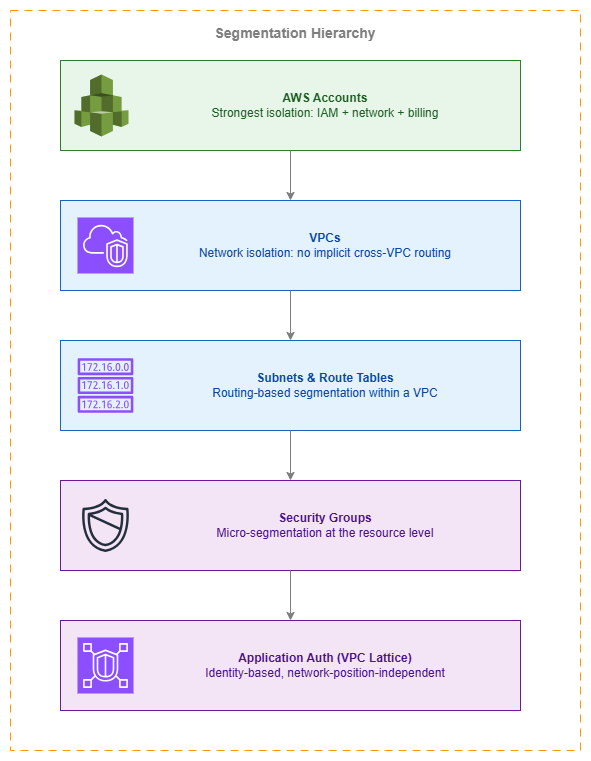

# 네트워크 세분화 {#network-segmentation}

!!! info "사전 요구 사항"
    이 섹션은 [Amazon VPC](../foundation/vpc.md), [AWS Organizations](../foundation/organizations.md), [AWS 내 연결](../connectivity/within-aws.md), [경계 제어](perimeter-inbound.md)에 대한 이해를 전제로 합니다. AWS 네트워킹 기초가 처음이라면 해당 항목을 먼저 검토하세요.

네트워크 세분화는 선택 사항이 아닙니다. 침해 사고가 발생했을 때(발생 여부가 아니라 시기의 문제입니다) 피해 범위를 제한하는 근본적인 보안 제어입니다. 모든 AWS 네트워크는 계정 수준 격리부터 리소스별 보안 그룹에 이르기까지 여러 계층에서 세분화가 적용되어야 합니다. "세분화가 필요한가?"가 아니라 "몇 개의 세분화 계층이 필요하며, 각 계층을 어떤 메커니즘으로 적용할 것인가?"가 핵심 질문입니다.

AWS는 다섯 가지 계층에서 세분화를 제공하며, 각 계층은 서로 다른 적용 특성, 운영 오버헤드, 비용 구조를 가집니다. 가장 강력한 경계는 상위(계정)에 있고, 가장 세밀한 제어는 하위(애플리케이션 계층 인증)에 있습니다. 잘 설계된 네트워크는 여러 계층을 동시에 활용합니다. 이는 네트워크 아키텍처에 심층 방어(Defense in Depth)를 적용하는 것입니다.

이 페이지는 세분화 계층 구조를 기준으로 구성되어 있습니다. 가장 강력한 격리 경계(계정)부터 가장 세밀한 제어(ID 기반 애플리케이션 인증)까지 순서대로 다룹니다. 각 계층은 심층 방어를 강화하며, 어느 단일 계층만으로는 충분하지 않습니다.


/// caption
세분화 계층 구조 — [Drawio 소스](../assets/security/segmentation-hierarchy.drawio)
///

<div class="grid cards" markdown>

*   :material-shield-account: **계정 수준 격리**

    ---

    AWS 계정은 가장 강력한 격리 경계를 제공합니다. IAM 주체, 네트워크 네임스페이스, 청구가 모두 분리됩니다. 한 계정에서 침해된 워크로드는 명시적인 교차 계정 액세스 없이는 다른 계정의 리소스에 접근할 수 없습니다.

*   :material-lan-disconnect: **VPC 격리**

    ---

    VPC 간에는 암묵적인 라우팅이 없습니다. VPC 간 통신은 명시적인 연결(피어링, Transit Gateway, Cloud WAN)이 필요합니다. 이로 인해 VPC는 계정 내에서 자연스러운 신뢰 경계 역할을 합니다.

*   :material-chart-pie: **Cloud WAN 세그먼트**

    ---

    리전 전반에 걸친 정책 기반 네트워크 세분화입니다. 세그먼트는 네트워크 정책 문서를 통해 중앙에서 적용되며, 라우팅 계층에서 어떤 VPC가 통신할 수 있는지를 정의합니다.

*   :material-security: **보안 그룹 마이크로 세분화**

    ---

    참조 기반 규칙을 사용하는 리소스별 트래픽 필터링입니다. 보안 그룹을 사용하면 IP 주소나 CIDR 블록을 관리하지 않고도 "서비스 A가 서비스 B와 통신할 수 있다"는 규칙을 정의할 수 있습니다.

*   :material-shield-lock: **ID 기반 세분화**

    ---

    VPC Lattice 인증 정책은 네트워크 위치가 아닌 호출자 ID(IAM 주체)를 기반으로 액세스를 적용합니다. 워크로드의 권한은 어떤 VPC나 서브넷에서 실행되든 동일하게 적용됩니다.

*   :material-eye: **세그먼트 간 검사**

    ---

    Cloud WAN 서비스 삽입 또는 Transit Gateway 라우팅을 통해 세그먼트 사이에 삽입된 AWS Network Firewall 또는 서드파티 어플라이언스로, 신뢰 경계에서 심층 패킷 검사를 제공합니다.

</div>

## 계정 수준 격리 — 가장 강력한 경계 {#account-level-isolation-the-strongest-boundary}

AWS 계정은 사용 가능한 가장 강력한 세분화 메커니즘입니다. 각 계정은 완전히 독립된 IAM 네임스페이스, 네트워크 네임스페이스, 그리고 별도의 청구 단위입니다. 계정 간에는 암묵적인 연결, 공유 IAM 주체, 공유 리소스 할당량이 존재하지 않습니다.

이것이 바로 멀티 계정 아키텍처가 프로덕션 AWS 환경의 기본 권장 사항인 이유입니다. 서로 다른 신뢰 수준을 가진 워크로드를 별도의 계정에 배치하면, 한 계정의 IAM 주체가 완전히 침해되더라도 다른 계정의 리소스에 직접 접근할 수 없습니다.

***핵심 인사이트:*** *계정 수준 격리는 무료이며, 네트워킹 구성이 필요 없고, 가장 강력한 장애 반경(blast-radius) 억제를 제공합니다. 첫 번째 세분화 결정으로 활용하세요.*

### OU 기반 세분화 패턴 {#ou-based-segmentation-patterns}

AWS Organizations의 OU는 세분화 경계에 자연스럽게 매핑됩니다.

| OU 구조 | 세분화 목적 | 예시 |
| --- | --- | --- |
| **Security OU** | 보안 도구(GuardDuty, Security Hub, 로그 아카이브)를 워크로드 계정으로부터 격리 | 워크로드 침해 시 감사 추적 변조 방지 |
| **Infrastructure OU** | 공유 네트워킹(Transit Gateway, Cloud WAN, DNS) 중앙화 | 네트워크 팀이 연결을 제어하며, 워크로드 팀은 라우팅 수정 불가 |
| **Workloads / Prod OU** | 프로덕션과 비프로덕션 분리 | 서로 다른 컴플라이언스 제어, 서로 다른 네트워크 검사 규칙 적용 |
| **Workloads / Dev OU** | 실험을 위한 낮은 신뢰 수준 환경 | 완화된 세분화, 프로덕션 세그먼트와 연결 없음 |
| **Sandbox OU** | 실험을 위한 완전한 격리 | 다른 OU와 연결 없음; SCP로 VPC 피어링 또는 TGW 연결 차단 |
| **Compliance OU** | 규제 대상 워크로드(PCI, HIPAA) 전용 계정 | 엄격한 검사, 전용 VPC, 감사 준비 구성 |

### 비용 고려 사항 {#cost-implications}

계정 수준 세분화는 무료입니다. 계정 생성에 별도 요금이 없으며, 계정별 네트워킹 비용도 없고, 격리에 따른 데이터 전송 비용도 발생하지 않습니다(격리된 계정은 기본적으로 연결이 없기 때문입니다). 비용은 Transit Gateway 연결, Cloud WAN 연결, 또는 VPC 피어링을 통해 계정을 *연결*할 때 발생합니다. 따라서 계정은 가장 비용 효율적인 세분화 경계입니다.

## VPC 수준 세분화 {#vpc-level-segmentation}

계정 내에서 VPC는 네트워크 수준의 격리를 제공합니다. 동일한 계정에 있는 두 VPC 사이에는 암묵적인 라우팅이 없으며, 연결하려면 명시적인 조치(피어링, Transit Gateway 연결, Cloud WAN 연결)가 필요합니다.

동일한 계정 내 워크로드가 다음과 같은 차이가 있을 때 별도의 VPC를 사용하세요.

* **신뢰 수준** — 관리 플레인 VPC와 데이터 플레인 VPC
* **연결 요구사항** — 한 VPC는 인터넷 액세스가 필요하고, 다른 VPC는 완전히 프라이빗이어야 하는 경우
* **컴플라이언스 범위** — 엄격한 검사가 적용되는 PCI 범위 VPC와 범용 VPC
* **라이프사이클 또는 팀 소유권** — 서로 다른 팀이 각자의 VPC를 독립적으로 관리하는 경우

### VPC 세분화를 위한 IPv6 고려사항 {#ipv6-considerations-for-vpc-segmentation}

VPC 세분화는 IPv6 트래픽에도 동일하게 적용됩니다. 격리를 위해 별도의 VPC를 생성할 때 다음 사항을 확인하세요.

* 각 VPC에 고유한 IPv6 CIDR이 할당되어 있는지 확인합니다(IPAM 또는 Amazon 제공 방식 사용).
* 라우팅 테이블이 격리되어야 하는 VPC 간에 의도치 않게 IPv6 연결을 생성하지 않는지 확인합니다.
* 보안 그룹에 명시적인 IPv6 규칙이 포함되어 있는지 확인합니다. IPv4 규칙만 있는 보안 그룹은 ENI에 IPv6 주소가 할당된 경우 IPv6 필터링을 제공하지 않습니다.

***핵심 인사이트:*** *보안 그룹은 스테이트풀(stateful) 방식이지만, 기본적으로 IP 주소 체계(IPv4/IPv6)를 자동으로 인식하지 않습니다. 리소스에 IPv6 주소를 할당하는 경우, 보안 그룹에 IPv6 규칙을 명시적으로 추가해야 합니다. IPv4 규칙이 자동으로 IPv6에 미러링되지 않습니다.*

## 서브넷과 라우팅 테이블 — 라우팅 기반 세분화 {#subnets-and-route-tables-routing-based-segmentation}

VPC 내에서 서브넷과 라우팅 테이블을 결합하면 라우팅 기반 세분화(routing-based segmentation)를 구현할 수 있습니다. 서로 다른 서브넷에 있는 리소스는 동일한 VPC를 공유하더라도 각기 다른 라우팅 동작(퍼블릭, 프라이빗, 격리)을 가질 수 있습니다.

주요 세분화 패턴은 다음과 같습니다.

| 서브넷 계층 | 라우팅 테이블 동작 | 사용 사례 |
| --- | --- | --- |
| **퍼블릭** | 인터넷 게이트웨이로 라우팅 | 로드 밸런서, 배스천 호스트, NAT 게이트웨이 |
| **프라이빗** | NAT 게이트웨이로 라우팅(또는 인터넷 경로 없음) | 애플리케이션 워크로드, 데이터베이스 |
| **격리** | VPC 외부로의 경로 없음 | 민감한 데이터 저장소, 컴플라이언스 적용 리소스 |
| **방화벽** | Network Firewall 엔드포인트를 통해 라우팅 | VPC 진입/출입 트래픽 검사 계층 |

라우팅 테이블은 IP 라우팅 계층에서 세분화를 강제합니다. 격리된 서브넷에 있는 리소스는 경로 자체가 존재하지 않기 때문에 물리적으로 인터넷에 도달할 수 없습니다. 이는 보안 그룹의 거부 규칙보다 더 강력한 방어 수단입니다. 필터링 계층이 아닌 라우팅 계층에서 동작하기 때문입니다.

## 보안 그룹 — 마이크로 세분화 {#security-groups-micro-segmentation}

보안 그룹은 AWS에서 가장 세밀한 네트워크 세분화를 제공합니다. ENI 단위(사실상 리소스 단위)로 트래픽을 필터링하며, 보안 그룹을 단순한 방화벽이 아닌 세분화 도구로 만드는 핵심 기능은 **참조 기반 규칙(reference-based rules)**입니다.

### 워크로드 세분화를 위한 참조 기반 규칙 {#reference-based-rules-for-workload-segmentation}

CIDR 블록에서 오는 트래픽을 허용하는 대신, 다른 보안 그룹에서 오는 트래픽을 허용합니다.

```yaml
# Allow traffic from the web tier security group
SecurityGroupIngress:
  - IpProtocol: tcp
    FromPort: 8080
    ToPort: 8080
    SourceSecurityGroupId: sg-web-tier
```

이렇게 하면 논리적인 세분화 경계가 만들어집니다. "웹 티어에 속한 리소스만 포트 8080을 통해 애플리케이션 티어에 접근할 수 있다"는 의미입니다. 이 규칙은 워크로드가 어느 서브넷이나 IP 주소를 사용하든 관계없이 적용됩니다. 웹 티어를 스케일 아웃(인스턴스 추가, IP 변경)하더라도 세분화 규칙은 올바르게 유지됩니다.

### 듀얼 스택 보안 그룹 규칙 {#dual-stack-security-group-rules}

보안 그룹은 IPv4와 IPv6 트래픽에 대해 별도의 규칙이 필요합니다. 흔히 발생하는 실수는 IPv4 인그레스 규칙만 추가하고 IPv6를 빠뜨리는 것입니다. 이 경우 리소스가 의도한 제한 없이 IPv6로 접근 가능한 상태가 됩니다(반대로 허용해야 할 IPv6를 차단하는 경우도 마찬가지입니다).

```yaml
# Correct: explicit rules for both address families
SecurityGroupIngress:
  - IpProtocol: tcp
    FromPort: 443
    ToPort: 443
    CidrIp: 10.0.0.0/8          # IPv4 corporate range
  - IpProtocol: tcp
    FromPort: 443
    ToPort: 443
    CidrIpv6: 2001:db8:cafe::/48  # IPv6 corporate range
```

참조 기반 규칙(소스 보안 그룹)을 사용하면 해당 보안 그룹 멤버에서 오는 IPv4와 IPv6 트래픽 모두에 규칙이 적용되므로 중복 작성이 필요 없습니다. 이것이 CIDR 기반 규칙보다 참조 기반 규칙을 선호해야 하는 또 다른 이유입니다.

***핵심 인사이트:*** *참조 기반 보안 그룹 규칙은 마이크로 세분화에 권장되는 메커니즘입니다. IP 주소 지정과 세분화를 분리하고, IPv4와 IPv6 모두에 자동으로 적용되며, 워크로드가 증가해도 규칙 수정 없이 확장되기 때문입니다.*

## Cloud WAN 세그먼트 — 정책 기반 네트워크 세분화 {#cloud-wan-segments-policy-driven-network-segmentation}

AWS Cloud WAN 세그먼트는 전체 멀티 리전 네트워크에 걸쳐 라우팅 계층에서 네트워크 세분화를 제공합니다. 각 세그먼트는 격리된 라우팅 도메인으로, 서로 다른 세그먼트에 연결된 VPC는 네트워크 정책의 세그먼트 공유 또는 서비스 삽입 규칙을 통해 명시적으로 허용하지 않는 한 통신할 수 없습니다.

다음과 같은 요구 사항이 있을 때 세그먼트가 적합한 도구입니다:

* 여러 리전에 걸친 일관된 세분화 정책
* 개별 계정 소유자가 우회할 수 없는 중앙 집중식 적용
* 연결 메타데이터(태그, 계정, 리전)를 기반으로 한 자동 세그먼트 할당
* 서비스 삽입을 통한 세그먼트 간 검사

### Cloud WAN 세그먼트 vs. Transit Gateway 라우팅 테이블 {#cloud-wan-segments-vs-transit-gateway-route-tables}

두 방식 모두 라우팅 도메인 기반 세분화를 제공하지만, 범위와 관리 모델에서 차이가 있습니다:

| 항목 | Cloud WAN 세그먼트 | Transit Gateway 라우팅 테이블 |
| --- | --- | --- |
| **범위** | 글로벌 (멀티 리전, 단일 정책) | 리전 단위 (TGW별) |
| **관리** | 선언적 네트워크 정책 | TGW별 수동 라우팅 테이블 구성 |
| **자동화** | 태그 기반 연결 수락 | 수동 또는 커스텀 자동화 |
| **서비스 삽입** | 정책에 내장된 구성 요소 | 검사 VPC를 통한 수동 라우팅 |
| **비용** | 코어 네트워크 엣지 + 연결 + 데이터 처리 | TGW 연결 + 데이터 처리 |
| **적합한 환경** | 계정 10개 이상, 멀티 리전, 또는 중앙 집중식 거버넌스가 필요한 조직 | 단일 리전, 소규모 환경, 또는 Cloud WAN으로 마이그레이션 중인 환경 |

새로운 멀티 계정 배포에는 Cloud WAN 세그먼트가 권장 방식입니다. 기존 Transit Gateway 환경의 경우, TGW와 Cloud WAN을 피어링하여 점진적으로 마이그레이션할 수 있습니다(마이그레이션 가이드는 [AWS 내 연결](../connectivity/within-aws.md)을 참조하세요).

### 네트워크 세분화 적용의 비용 영향 {#cost-implications-of-network-segmentation-enforcement}

계정 및 VPC를 통한 세분화는 무료이며, 격리가 기본 상태입니다. 비용은 세그먼트를 연결하고 라우팅 계층에서 정책을 적용할 때 발생합니다:

| 메커니즘 | 비용 구성 요소 | 적용 시점 |
| --- | --- | --- |
| **계정/VPC 격리** | 무료 | 항상 (격리가 기본값) |
| **Transit Gateway 라우팅 테이블** | 연결 시간당 요금 + GB당 데이터 처리 요금 | 리전 단위 세분화 |
| **Cloud WAN 세그먼트** | 코어 네트워크 엣지 시간당 요금 + 연결 시간당 요금 + GB당 데이터 처리 요금 | 멀티 리전 또는 정책 기반 세분화 |
| **Network Firewall (검사)** | 방화벽 엔드포인트 시간당 요금 + GB당 데이터 처리 요금 | 세그먼트 간 검사 |
| **보안 그룹** | 무료 | 항상 |
| **VPC Lattice 인증 정책** | 요청당 요금 (Lattice 데이터 처리 요금에 포함) | 애플리케이션 계층 세분화 |

***핵심 인사이트:*** *가장 저렴한 세분화 방식이 가장 강력합니다. 계정 및 VPC 격리는 비용이 들지 않습니다. 먼저 적절한 계정 구조에 투자하고, 세그먼트 간 연결이 필요한 경우에만 라우팅 계층 세분화(Cloud WAN/TGW)를 추가하세요.*

## VPC Lattice를 활용한 ID 기반 세분화 {#identity-based-segmentation-with-vpc-lattice}

전통적인 네트워크 세분화는 "네트워크 패킷 X가 네트워크 엔드포인트 Y에 도달할 수 있는가?"라는 질문에 답합니다. ID 기반 세분화는 이와 다른 질문에 답합니다: "주체 A가 서비스 B를 호출할 권한이 있는가?" VPC Lattice 인증 정책은 이러한 애플리케이션 계층 세분화를 제공합니다.

### 네트워크 세분화만으로는 부족한 경우 {#when-network-segmentation-is-not-enough}

다음과 같은 상황에서는 네트워크 세분화의 한계가 드러납니다:

* 여러 서비스가 동일한 VPC 또는 서브넷을 공유하는 경우 (컨테이너 환경에서 흔히 발생)
* 서비스가 정당한 비즈니스 목적으로 세그먼트 경계를 넘어 통신해야 하는 경우
* 네트워크 단위가 아닌 서비스 단위의 액세스 제어가 필요한 경우
* 워크로드가 네트워크 위치 간에 이동하는 경우 (Auto Scaling, 컨테이너 오케스트레이션)

이러한 경우, VPC Lattice 인증 정책을 통한 ID 기반 세분화는 네트워크 위치에 관계없이 워크로드를 따라다니는 더욱 세밀한 제어를 제공합니다.

### 제로 트러스트 패턴 {#zero-trust-patterns}

VPC Lattice 인증 정책은 네트워크 위치가 아닌 검증된 ID를 기반으로 접근 결정을 내리는 제로 트러스트(Zero-Trust) 네트워킹 패턴을 구현합니다:

```json
{
  "Version": "2012-10-17",
  "Statement": [
    {
      "Effect": "Allow",
      "Principal": {
        "AWS": "arn:aws:iam::111122223333:role/OrderService"
      },
      "Action": "vpc-lattice-svcs:Invoke",
      "Resource": "arn:aws:vpc-lattice:us-east-1:444455556666:service/svc-payments/*",
      "Condition": {
        "StringEquals": {
          "vpc-lattice-svcs:RequestMethod": "POST"
        }
      }
    }
  ]
}
```

이 정책은 다음을 의미합니다: "계정 111122223333의 OrderService 역할만 결제 서비스에 POST 요청을 보낼 수 있다" — OrderService가 어떤 VPC, 서브넷, 또는 IP 주소에서 실행되든 관계없이 적용됩니다. 이는 네트워크 구성 오류로도 우회할 수 없는 세분화입니다.

***핵심 인사이트:*** *네트워크 세분화와 ID 기반 세분화는 서로 경쟁하는 것이 아니라 상호 보완적입니다. 네트워크 세분화로 인프라 계층에서 장애 반경(blast radius)을 제한하고, ID 기반 세분화로 애플리케이션 계층에서 최소 권한 원칙을 적용하세요.*

## 세그먼트 간 검사를 위한 서비스 삽입 {#service-insertion-for-inter-segment-inspection}

세그먼트 간 통신이 필요한 경우, 위협 탐지, 컴플라이언스 준수, 또는 정책 적용을 위해 해당 트래픽을 검사해야 할 수 있습니다. AWS Cloud WAN 서비스 삽입과 Transit Gateway 라우팅은 모두 AWS Network Firewall 또는 서드파티 어플라이언스가 실행되는 검사 VPC를 통해 세그먼트 간 트래픽을 전달하는 방식을 지원합니다.

### Cloud WAN 서비스 삽입 패턴 {#cloud-wan-service-insertion-pattern}

Cloud WAN 네트워크 정책에 검사 규칙을 정의하여 특정 세그먼트 간 트래픽을 검사 VPC를 통해 라우팅합니다.

```json
{
  "segment-actions": [
    {
      "action": "send-via",
      "segment": "production",
      "via": {
        "network-function-groups": ["inspection-firewalls"]
      },
      "when-sent-to": {
        "segments": ["hybrid", "shared-services"]
      }
    }
  ]
}
```

이 설정은 `production` 세그먼트에서 `hybrid` 또는 `shared-services`로 향하는 모든 트래픽을 검사 방화벽을 통과하도록 강제합니다. 이는 수동 라우팅 테이블 조작이 아닌 네트워크 정책 수준에서 적용됩니다.

### AWS PrivateLink — 선택적 노출을 통한 세분화 {#aws-privatelink-segmentation-through-selective-exposure}

AWS PrivateLink는 다른 세분화 모델을 제공합니다. 네트워크를 연결한 후 트래픽을 필터링하는 방식 대신, 네트워크 수준의 연결 없이 경계를 넘어 특정 서비스만 선택적으로 노출합니다. 소비자 VPC는 공급자의 서비스에 액세스하는 ENI를 얻게 되며, 공급자 네트워크의 다른 리소스에는 액세스할 수 없습니다.

이는 필터링을 통한 세분화가 아닌 설계에 의한 세분화입니다. 다음과 같은 경우에 PrivateLink를 사용하세요.

* 네트워크 수준의 액세스 권한을 부여하지 않고 다른 계정에 단일 서비스만 노출하려는 경우
* 공급자와 소비자 간에 특정 서비스 이외의 IP 수준 연결이 없어야 하는 경우
* VPC 피어링 없이 서드파티 또는 파트너에게 서비스를 노출해야 하는 경우

## 모범 사례 {#best-practices}

### 세분화를 하향식으로 설계하기 {#design-segmentation-top-down}

#### 계정 경계부터 시작하여 계층을 추가하기 {#start-with-account-boundaries-then-add-layers}

세분화 계층 구조를 최상위(계정)에서 하향식으로 설계하세요. 가장 흔한 실수는 모든 것을 단일 계정과 VPC에 배치한 채 보안 그룹과 NACL부터 시작하는 것입니다. 이는 계층 구조를 뒤집는 것이어서, 가장 강력하고 비용 효율적인 제어를 무시하면서 가장 취약하고 운영 복잡도가 높은 제어에 의존하게 됩니다.

올바른 순서:

1. **계정(Accounts)** — 신뢰 수준, 컴플라이언스 범위, 팀 소유권에 따라 워크로드를 분리
2. **VPC** — 계정 내에서 연결 요구사항과 라이프사이클에 따라 분리
3. **Cloud WAN 세그먼트 / TGW 라우팅 테이블** — 라우팅 계층에서 VPC 간 통신 제어
4. **서브넷 및 라우팅 테이블** — VPC 내에서 라우팅 요구사항에 따라 분리(퍼블릭/프라이빗/격리)
5. **보안 그룹** — 참조 기반 규칙을 활용한 리소스별 마이크로 세분화
6. **VPC Lattice 인증 정책** — 서비스별 자격 증명 기반 액세스 제어

각 계층은 심층 방어(Defense in Depth)를 강화합니다. 한 계층에서 장애가 발생하더라도(예: 잘못 구성된 보안 그룹), 상위 계층(워크로드가 별도 계정의 격리된 VPC에 위치)에 의해 피해가 억제됩니다.

#### 세분화를 컴플라이언스 요구사항에 맞추기 {#align-segmentation-with-compliance-requirements}

컴플라이언스 프레임워크(PCI DSS, HIPAA, SOC 2)는 규제 대상 워크로드에 대한 네트워크 세분화를 요구하는 경우가 많습니다. 컴플라이언스 범위를 세분화 경계에 매핑하세요.

| 컴플라이언스 요구사항 | 세분화 접근 방식 |
| --- | --- |
| **PCI DSS CDE 격리** | 전용 계정 + 전용 VPC + 필수 검사가 적용된 Cloud WAN 세그먼트 |
| **HIPAA PHI 보호** | 전용 계정 + 격리된 서브넷 + 인가된 역할로 접근을 제한하는 보안 그룹 |
| **SOC 2 환경 분리** | 프로덕션과 비프로덕션을 위한 별도 OU + 검사 없이는 OU 간 연결 불가 |
| **데이터 레지던시** | 리전 간 데이터 흐름을 차단하는 리전별 Cloud WAN 세그먼트 |

***핵심 인사이트:*** *컴플라이언스 기반 세분화는 계정 및 OU 경계에 매핑될 때 감사가 더 용이합니다. 감사자 입장에서 "모든 PCI 워크로드에 올바른 보안 그룹 규칙이 적용되어 있는지"보다 "모든 PCI 워크로드가 PCI OU에 있는지"를 확인하는 것이 훨씬 쉽습니다.*

### 마이크로 세분화를 효과적으로 구현하기 {#implement-micro-segmentation-effectively}

#### 워크로드 역할별로 보안 그룹 하나씩 사용하기 {#use-one-security-group-per-workload-role}

각 논리적 워크로드 역할(웹 티어, 애플리케이션 티어, 데이터베이스 티어, 모니터링 에이전트)에 전용 보안 그룹을 할당하세요. 마이크로 세분화의 목적을 무력화하는 "내부 전체 허용" 공유 보안 그룹은 사용하지 마세요.

#### CIDR 기반 규칙보다 참조 기반 규칙 선호하기 {#prefer-reference-based-rules-over-cidr-based-rules}

참조 기반 규칙(소스/대상 보안 그룹)은 유지 관리가 더 쉽고, IPv4/IPv6를 자동으로 처리하며, 규칙 업데이트 없이도 확장됩니다. CIDR 기반 규칙은 외부 네트워크(온프레미스 대역, 파트너 CIDR)를 참조하거나 VPC 간 참조가 불가능한 경우에만 사용하세요.

#### 보안 그룹 규칙을 정기적으로 감사하기 {#audit-security-group-rules-regularly}

보안 그룹은 시간이 지남에 따라 규칙이 누적됩니다. 사용하지 않는 규칙은 공격 표면을 넓힙니다. VPC Flow Logs와 보안 그룹 사용 분석을 활용하여 더 이상 트래픽이 발생하지 않는 규칙을 식별하고 제거하세요.

### 세분화를 중앙에서 적용하기 {#enforce-segmentation-centrally}

#### SCP를 사용하여 세분화 우회 방지하기 {#use-scps-to-prevent-segmentation-bypass}

서비스 제어 정책(Service Control Policies)을 통해 워크로드 계정이 VPC 피어링 연결, Transit Gateway 연결 또는 세분화 설계를 우회하는 기타 연결을 생성하지 못하도록 차단할 수 있습니다. 네트워킹 팀이 연결을 제어하고, 워크로드 팀은 이를 소비하는 구조입니다.

중앙화된 네트워크를 통해 트래픽을 강제 라우팅하기 위해 직접 VPC 피어링을 거부하는 SCP 예시:

```json
{
  "Version": "2012-10-17",
  "Statement": [
    {
      "Sid": "DenyVPCPeering",
      "Effect": "Deny",
      "Action": [
        "ec2:CreateVpcPeeringConnection",
        "ec2:AcceptVpcPeeringConnection"
      ],
      "Resource": "*"
    }
  ]
}
```

#### 전용 계정에서 네트워크 연결을 중앙화하기 {#centralize-network-connectivity-in-a-dedicated-account}

Transit Gateway, Cloud WAN 코어 네트워크, 공유 검사 VPC를 Infrastructure OU 내의 전용 네트워킹 계정에 배치하세요. AWS RAM을 통해 워크로드 계정에 연결을 공유하세요. 이를 통해 네트워킹 팀이 세분화 적용에 대한 제어권을 유지할 수 있습니다.

### IPv6 세분화 계획하기 {#plan-for-ipv6-segmentation}

#### 두 주소 체계에 동일한 세분화 적용하기 {#apply-identical-segmentation-to-both-address-families}

IPv4에 적용되는 모든 세분화 제어는 IPv6에도 동일하게 적용되어야 합니다. 여기에는 다음이 포함됩니다.

* 보안 그룹 규칙(IPv6 CIDR에는 별도 규칙 필요, 참조 기반 규칙은 자동으로 모두 적용)
* 네트워크 ACL(사용하는 경우 — 별도의 IPv6 규칙 필요)
* 라우팅 테이블(IPv6 경로는 별도 항목으로 관리)
* Network Firewall 규칙(IPv6 규칙 그룹 포함 필요)
* Cloud WAN 라우팅(네트워크 정책에서 듀얼 스택 지원)

#### IPv6를 세분화 우회 경로로 사용하지 않기 {#avoid-ipv6-as-a-segmentation-bypass}

흔히 발생하는 취약점: 워크로드에 IPv6 주소가 할당되어 있지만 보안 그룹에는 IPv4 규칙만 포함된 경우입니다. 이는 사실상 세분화가 적용되지 않은 IPv6 네트워크를 만드는 것과 같습니다. 듀얼 스택 VPC의 모든 보안 그룹을 감사하여 IPv6 규칙이 의도한 세분화 정책과 일치하는지 확인하세요.

## 세분화와 다른 서비스의 결합 {#combining-segmentation-with-other-services}

| 조합 | 세분화가 제공하는 것 | 다른 서비스가 제공하는 것 |
| --- | --- | --- |
| **세분화 + AWS Network Firewall** | 세그먼트 간 격리(라우팅 계층) | 세그먼트 경계에서의 심층 패킷 검사, IDS/IPS, 도메인 필터링 |
| **세분화 + VPC Lattice** | 네트워크 계층의 장애 반경 억제 | 네트워크 위치에 독립적인 애플리케이션 계층 ID 기반 액세스 제어 |
| **세분화 + AWS PrivateLink** | 세그먼트 간 네트워크 수준 연결 없음 | 라우팅을 개방하지 않고 세그먼트 경계를 넘는 선택적 서비스 노출 |
| **세분화 + AWS Cloud WAN** | 세그먼트 정의 및 격리 정책 | 글로벌 적용, 자동화된 연결, 서비스 삽입 오케스트레이션 |
| **세분화 + AWS Organizations SCPs** | 계정 간 네트워크 수준 격리 | 세분화 우회 방지를 위한 IAM 수준 제어(피어링 거부, TGW 연결 거부) |
| **세분화 + VPC Flow Logs** | 트래픽 경계 적용 | 세그먼트 경계에서 흐르는(또는 거부되는) 트래픽에 대한 가시성 |
| **세분화 + AWS Firewall Manager** | 일관된 세분화 의도 | 계정 전반에 걸친 중앙 집중식 보안 그룹 정책 적용 |

## 문서 {#documentation}

<div class="grid cards" markdown>

*   :material-file-document: **VPC 보안 모범 사례**

    ---

    보안 그룹, NACL 및 VPC 수준 보안 제어를 다루는 AWS 공식 문서입니다.

    [:octicons-arrow-right-24: VPC 보안](https://docs.aws.amazon.com/vpc/latest/userguide/vpc-security-best-practices.html)

*   :material-file-document: **AWS Cloud WAN 세그먼트**

    ---

    Cloud WAN 네트워크 정책에서 세그먼트를 생성하고 관리하는 방법에 대한 문서입니다.

    [:octicons-arrow-right-24: Cloud WAN 세그먼트](https://docs.aws.amazon.com/vpc/latest/cloudwan/cloudwan-policy-segments.html)

*   :material-file-document: **VPC용 보안 그룹**

    ---

    듀얼 스택 구성을 포함한 보안 그룹 규칙, 제한 및 동작에 대한 전체 참조 문서입니다.

    [:octicons-arrow-right-24: 보안 그룹](https://docs.aws.amazon.com/vpc/latest/userguide/vpc-security-groups.html)

*   :material-file-document: **Amazon VPC Lattice 인증 정책**

    ---

    VPC Lattice 인증 정책을 사용하여 서비스에 대한 자격 증명 기반 액세스 제어를 구성하는 방법입니다.

    [:octicons-arrow-right-24: 인증 정책](https://docs.aws.amazon.com/vpc-lattice/latest/ug/auth-policies.html)

*   :material-post: **Cloud WAN으로 멀티 계정 네트워크 구축**

    ---

    멀티 계정 환경에서 Cloud WAN을 활용한 세분화 패턴을 보여주는 아키텍처 안내입니다.

    [:octicons-arrow-right-24: 블로그 게시물](https://aws.amazon.com/blogs/networking-and-content-delivery/category/networking-content-delivery/aws-cloud-wan/)

*   :material-file-document: **AWS Network Firewall 배포 모델**

    ---

    세그먼트 간 트래픽 검사를 위한 Network Firewall 배포 참조 아키텍처입니다.

    [:octicons-arrow-right-24: 배포 모델](https://docs.aws.amazon.com/network-firewall/latest/developerguide/architectures.html)

</div>

## 관련 페이지 {#related-pages}

**기반 주제와의 관계:**

* **[Amazon VPC](../foundation/vpc.md)**: VPC는 계정 내 주요 네트워크 수준 세분화 경계입니다. 이 페이지는 VPC 격리 개념을 기반으로 합니다.
* **[AWS Organizations](../foundation/organizations.md)**: 계정 및 OU 구조는 가장 강력한 세분화 경계를 정의합니다. 조직 설계는 곧 세분화 설계 결정입니다.
* **[서브넷](../foundation/subnets.md)**: 서브넷 설계와 라우팅 테이블 구성은 VPC 내에서 라우팅 기반 세분화를 구현합니다.

**연결성 주제와의 관계:**

* **[AWS 내 연결성](../connectivity/within-aws.md)**: Cloud WAN 세그먼트와 Transit Gateway 라우팅 테이블은 해당 페이지에서 심층적으로 다룹니다. 이 페이지는 연결 메커니즘보다 세분화 속성에 초점을 맞춥니다.

**다른 보안 주제와의 관계:**

* **[경계 제어](perimeter-inbound.md)**: 경계 제어는 네트워크 엣지를 보호하고, 세분화 제어는 내부 트래픽 흐름을 관리합니다. 두 가지 모두 필요합니다.
* **[아웃바운드 제어](outbound.md)**: 아웃바운드 필터링은 세그먼트별로 적용할 수 있습니다(세그먼트마다 서로 다른 이그레스 규칙 적용 가능).
